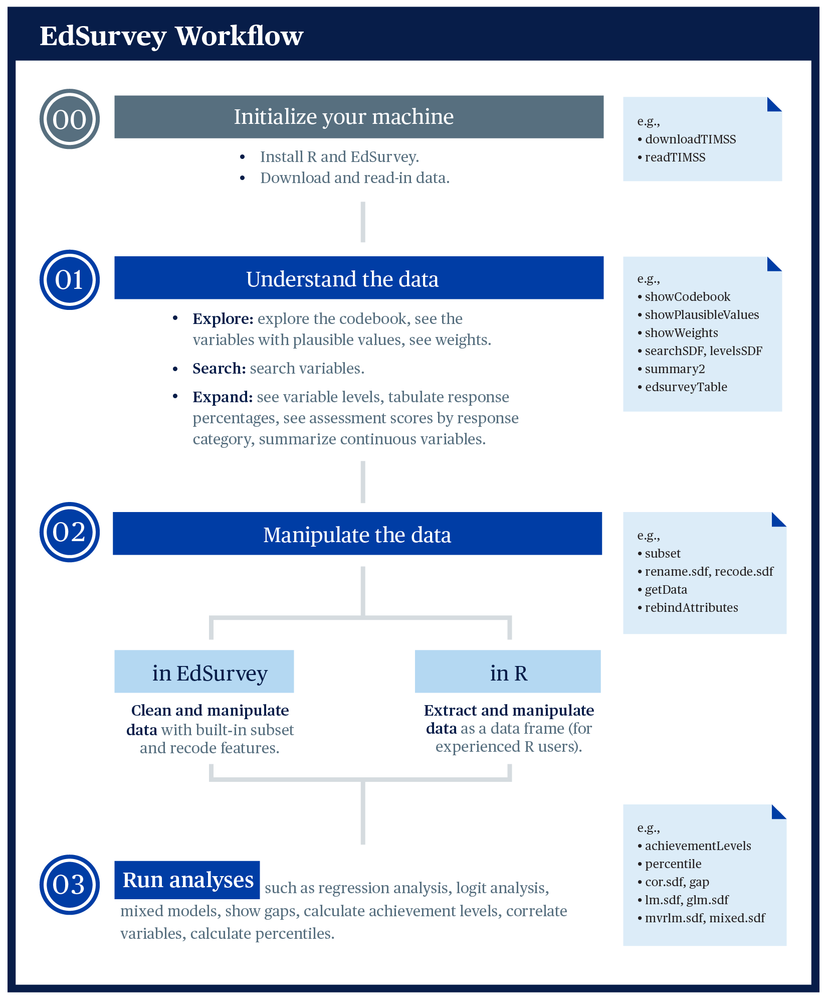

# Philosophy of Analysis {#philosophyOfAnalysis}

This chapter explains the main use cases for `EdSurvey`. To facilitate the learning process, we recommend the workflow detailed in the following infographic:



The workflow has the following steps:

1.	Install and load the package. 
2.	Access the data. 
3.	Understand the data. 
4.	Manipulate the data. 
5.	Run the analysis.

First, use `EdSurvey` to download publicly available data and read in data; then move to understand the data, including tasks such as look at or search the codebook; explore the data, including tasks such as summarizing variables; and then analyze the data either inside `EdSurvey` or with other R packages.

The previous chapter detailed installation and loading of the `EdSurvey` library; this chapter explores the subsequent steps.

## Download or License Data

Although the bulk of this book will focus on NAEP data, `EdSurvey` includes a family of download functions for NCES publicly available data files, including the following:


- TIMSS: Trends in International Mathematics and Science Study and TIMSS Advanced (`downloadTIMSS`, `downloadTIMSSAdv`)
- PIRLS: Progress in International Reading Literacy Study (`downloadPIRLS`)
- ePIRLS: Electronic Progress in International Reading Literacy Study (`download_ePIRLS`)
- CIVED: The Civic Education Study 1999 and International Civic and Citizenship Study (`downloadCivEDICCS`)
- ICILS: International Computer and Information Literacy Study (`downloadICILS`)
- PISA: The Programme for International Student Assessment (`downloadPISA`)
- PIAAC: Programme for the International Assessment of Adult Competencies (`downloadPIAAC`)
- TALIS: Teaching and Learning International Survey (`downloadTALIS`)
- ECLS: Early Childhood Longitudinal Study (`downloadECLS_K`)
- ELS: Education Longitudinal Study (`downloadELS`)
- HSLS: High School Longitudinal Study of 2009 (`downloadHSLS`)
- NHES: National Household Education Surveys (`downloadNHES`)
- SSOCS: School Survey on Crime and Safety (`downloadSSOCS`)


For example, the `downloadTIMSS` function will download publicly available TIMSS data to a directory that the user specifies e.g., `"C:/Data"`). One also can manually download desirable survey data from their respective websites.


```r
downloadTIMSS(years = 2015, root = "C:/", cache=FALSE)
```

For restricted datasets such as NAEP, please follow their restricted-use instructions to save the whole intact data folder to a directory and read the data from there.

## Reading in Data

Once the data are prepared for your system, the read family of functions will open a connection to the specified data file to conduct your analysis. The read functions are as follows:

- TIMSS and TIMSS Advanced (`readTIMSS`, `readTIMSSAdv`)
- PIRLS (`readPIRLS`)
- ePIRLS (`read_ePIRLS`)
- CIVED (`readCivEDICCS`)
- ICILS (`readICILS`)
- PISA (`readPISA`)
- PIAAC (`readPIAAC`)
- TALIS (`readTALIS`)
- ECLS (`readECLS_K2011` and `readECLS_K1998`)
- ELS: Education Longitudinal Study (`readELS`)
- BTLS: Beginning Teacher Longitudinal Study (`readBTLS`)
- HSLS (`readHSLS`)
- NHES (`readNHES`)
- SSOCS (`readSSOCS`)

For example, you can access the 2015 TIMSS data by the `readTIMSS` function, selecting a data `path`, the vector of `countries`, and `gradeLvl` of interest:


```r
TIMSS15 <- readTIMSS(path = "C:/TIMSS2015/", countries = c("usa"), gradeLvl = "4")
```

Each read function is unique given the differences across survey designs, but the functions typically follow a standard convention across functions for ease of use. To learn more about a particular read function, refer to [Chapter 4](#dataAccess), or use `help(package = "EdSurvey")` to find the survey of interest and refer to its help documentation for guidance.

### Vignette Sample NCES Dataset

To follow along with this vignette, load the NAEP Primer dataset `M36NT2PM` and assign it the name `sdf` with this call:
  

```r
library(EdSurvey)
#> Warning: package 'EdSurvey' was built under R version 4.3.1
#> Loading required package: car
#> Loading required package: carData
#> Loading required package: lfactors
#> lfactors v1.0.4
#> Loading required package: Dire
#> Dire v2.1.1
#> EdSurvey v4.0.1
#> 
#> Attaching package: 'EdSurvey'
#> The following objects are masked from 'package:base':
#> 
#>     cbind, rbind
sdf <- readNAEP(path = system.file("extdata/data", "M36NT2PM.dat", package = "NAEPprimer"))
```

This command uses a somewhat unusual way of identifying a file path (the `system.file` function). Because the Primer data are bundled with the NAEPprimer package, the `system.file` function finds it regardless of where the package is installed on a machine. All other datasets are referred to by their system path.

### NCES Dataset

To load a unique NCES dataset for analysis, select the pathway to the DAT file in the NAEP folder, which needs to be in the NCES standard folder directory titled `/Data`:


```r
sdf2 <- readNAEP(filepath = '//.../Data/file.dat')
```

This function recognizes the naming convention used by NCES for NAEP file names to determine which sample design and assessment information are attached to the resulting `edsurvey.data.frame`. The `readNAEP` function transparently accesses the necessary sample information and silently attaches it to the data.[^noteEDS]

[^noteEDS]: The `EdSurvey` package uses the `.fr2` file in the `/Select/Parms` folder to assign this information to the `edsurvey.data.frame`.

It is possible that file pathways with special characters in your local directory could cause problems with reading data into R. Commonly used characters that require escapes include single quotation marks (`'`), double quotation marks (`"`), and backslashes (`\`). The most general solution to resolving these issues is adding an escape (i.e., the backslash key: `\`) before each character. For example, add an escape before the single quote used in `Nat'l`, as well as before each backslash as copied from the following hypothetical Windows file directory:


```r
# original
"C:\2015 Nat'l Assessment Data\Data\file.dat"

# updated with escapes:
sdf2 <- readNAEP(filepath = "C:\\2015 Nat\'l Assessment Data\\Data\\file.dat")
```

An alternative option would involve using the `file.choose()` function to select the data file via a search window. The function opens your system's default file explorer to select a particular file. This file can be saved to an object, which in this example is `chosenFile`, which then can be read using `readNAEP`:


```r
chosenFile <- file.choose()
sdf2 <- readNAEP(filepath = chosenFile)
```

Once read in, both student and school data from an NCES dataset can be analyzed and merged after loading the data into the R working environment. The `readNAEP` function is built to connect with the student data file, but it silently holds file formatting for the school dataset when read. More details on retrieving school variables for analysis will be outlined later in this chapter with the `getData` function.

##	Understand Data

Information about an `edsurvey.data.frame` can be obtained in multiple ways. To get general data information, simply call print by typing the name of the `data.frame` object (i.e., `sdf`) in the console.


```r
sdf
#> edsurvey.data.frame for 2005 NAEP National - Primer
#>   (Mathematics; Grade 8) in USA
#> Dimensions: 17606 rows and 303 columns.
#> 
#> There is 1 full sample weight in this
#>   edsurvey.data.frame:
#>   'origwt' with 62 JK replicate weights (the
#>   default).
#> 
#> 
#> There are 6 subject scale(s) or subscale(s) in this
#>   edsurvey.data.frame:
#> 'num_oper' subject scale or subscale with 5 plausible
#>   values.
#> 
#> 'measurement' subject scale or subscale with 5
#>   plausible values.
#> 
#> 'geometry' subject scale or subscale with 5 plausible
#>   values.
#> 
#> 'data_anal_prob' subject scale or subscale with 5
#>   plausible values.
#> 
#> 'algebra' subject scale or subscale with 5 plausible
#>   values.
#> 
#> 'composite' subject scale or subscale with 5
#>   plausible values (the default).
#> 
#> 
#> Omitted Levels: 'Multiple', 'NA', and 'Omitted'
#> 
#> Default Conditions:
#> tolower(rptsamp) == "reporting sample"
#> Achievement Levels:
#> Mathematics:
#> Basic: 262.00
#> Proficient: 299.00
#> Advanced: 333.00
```

Some basic functions that work on a `data.frame`, such as `dim`, `nrow`, and `ncol`, also work on an `edsurvey.data.frame`.[^whatisdim] They help check the dimensions of `sdf`.

[^whatisdim]:Use `?function` in the R console to view documentation on base R and `EdSurvey` package functions (e.g.,  `?gsub` or `?lm.sdf`).


```r
dim(x = sdf)
#> [1] 17606   303
nrow(x = sdf)
#> [1] 17606
ncol(x = sdf)
#> [1] 303
```

The `colnames` function can be used to list all variable names in the data:


```r
colnames(x = sdf)
#>   [1] "ROWID"   "year"    "cohort"  "scrpsu"  "dsex"   
#>   [6] "iep"     "lep"     "ell3"    "sdracem" "pared"  
#>  [11] "b003501" "b003601" "b013801" "b017001" "b017101"
#>  [16] "b018101" "b018201" "b017451" "m815401" "m815501"
#>  [21] "m815601" "m815801" "m815701" "rptsamp" "repgrp1"
#>  [26] "repgrp2" "jkunit"  "origwt"  "srwt01"  "srwt02" 
#>  [31] "srwt03"  "srwt04"  "srwt05"  "srwt06"  "srwt07" 
#>  [36] "srwt08"  "srwt09"  "srwt10"  "srwt11"  "srwt12" 
#>  [41] "srwt13"  "srwt14"  "srwt15"  "srwt16"  "srwt17" 
#>  [46] "srwt18"  "srwt19"  "srwt20"  "srwt21"  "srwt22" 
#>  [51] "srwt23"  "srwt24"  "srwt25"  "srwt26"  "srwt27" 
#>  [56] "srwt28"  "srwt29"  "srwt30"  "srwt31"  "srwt32" 
#>  [61] "srwt33"  "srwt34"  "srwt35"  "srwt36"  "srwt37" 
#>  [66] "srwt38"  "srwt39"  "srwt40"  "srwt41"  "srwt42" 
#>  [71] "srwt43"  "srwt44"  "srwt45"  "srwt46"  "srwt47" 
#>  [76] "srwt48"  "srwt49"  "srwt50"  "srwt51"  "srwt52" 
#>  [81] "srwt53"  "srwt54"  "srwt55"  "srwt56"  "srwt57" 
#>  [86] "srwt58"  "srwt59"  "srwt60"  "srwt61"  "srwt62" 
#>  [91] "smsrswt" "mrps11"  "mrps12"  "mrps13"  "mrps14" 
#>  [96] "mrps15"  "mrps21"  "mrps22"  "mrps23"  "mrps24" 
#> [101] "mrps25"  "mrps31"  "mrps32"  "mrps33"  "mrps34" 
#> [106] "mrps35"  "mrps41"  "mrps42"  "mrps43"  "mrps44" 
#> [111] "mrps45"  "mrps51"  "mrps52"  "mrps53"  "mrps54" 
#> [116] "mrps55"  "mrpcm1"  "mrpcm2"  "mrpcm3"  "mrpcm4" 
#> [121] "mrpcm5"  "m075201" "m075401" "m075601" "m019901"
#> [126] "m066201" "m047301" "m046201" "m066401" "m020101"
#> [131] "m067401" "m086101" "m047701" "m067301" "m048001"
#> [136] "m093701" "m086001" "m051901" "m076001" "m046001"
#> [141] "m046101" "m067701" "m046701" "m046901" "m047201"
#> [146] "m046601" "m046801" "m067801" "m066601" "m067201"
#> [151] "m068003" "m068005" "m068008" "m068007" "m068006"
#> [156] "m093601" "m053001" "m047801" "m086301" "m085701"
#> [161] "m085901" "m085601" "m085501" "m085801" "m019701"
#> [166] "m020001" "m046301" "m047001" "m046501" "m066501"
#> [171] "m047101" "m066301" "m067901" "m019601" "m051501"
#> [176] "m047901" "m053101" "m143601" "m143701" "m143801"
#> [181] "m143901" "m144001" "m144101" "m144201" "m144301"
#> [186] "m144401" "m144501" "m144601" "m144701" "m144801"
#> [191] "m144901" "m145001" "m145101" "m013431" "m0757cl"
#> [196] "m013131" "m091701" "m072801" "m091501" "m091601"
#> [201] "m073501" "m052401" "m075301" "m072901" "m013631"
#> [206] "m075801" "m013731" "m013531" "m051801" "m093401"
#> [211] "m093801" "m142001" "m142101" "m142201" "m142301"
#> [216] "m142401" "m142501" "m142601" "m142701" "m142801"
#> [221] "m142901" "m143001" "m143101" "m143201" "m143301"
#> [226] "m143401" "m143501" "m105601" "m105801" "m105901"
#> [231] "m106001" "m106101" "m106201" "m106301" "m106401"
#> [236] "m106501" "m106601" "m106701" "m106801" "m106901"
#> [241] "m107001" "m107101" "m107201" "m107401" "m107501"
#> [246] "m107601" "m109801" "m110001" "m110101" "m110201"
#> [251] "m110301" "m110401" "m110501" "m110601" "m110701"
#> [256] "m110801" "m110901" "m111001" "m111201" "m111301"
#> [261] "m111401" "m111501" "m111601" "m111801" "yrsexp" 
#> [266] "yrsmath" "t089401" "t088001" "t090801" "t090802"
#> [271] "t090803" "t090804" "t090805" "t090806" "t087501"
#> [276] "t088301" "t088401" "t088501" "t088602" "t088603"
#> [281] "t088801" "t088803" "t088804" "t088805" "t091502"
#> [286] "t091503" "t091504" "c052801" "c052802" "c052804"
#> [291] "c052805" "c052806" "c052807" "c052808" "c052701"
#> [296] "c046501" "c044006" "c044007" "c052901" "c053001"
#> [301] "c053101" "sscrpsu" "c052601"
```

To conduct a more powerful search of NAEP data variables, use the `searchSDF` function, which returns variable names and labels from an `edsurvey.data.frame` based on a character string. The user can specify which data source (either "student" or "school") the user would like to search. For example, the following call to `searchSDF` searches for the character string `"book"` in the `edsurvey.data.frame` and specifies the `fileFormat` to search the student data file:


```r
searchSDF(string = "book", data = sdf, fileFormat = "student")
#>   variableName                                       Labels
#> 1      b013801                                Books in home
#> 2      t088804 Computer activities: Use a gradebook program
#> 3      t091503     G8Math:How often use Geometry sketchbook
#>   fileFormat
#> 1    Student
#> 2    Student
#> 3    Student
```

The levels and labels for each variable search via `searchSDF()` also can be returned by setting `levels = TRUE`:


```r
searchSDF(string = "book", data = sdf, fileFormat = "student", levels = TRUE)
#> Variable: b013801
#> Label: Books in home
#> Levels (Lowest level first):
#>      1. 0-10
#>      2. 11-25
#>      3. 26-100
#>      4. >100
#>      8. Omitted
#>      0. Multiple
#> Variable: t088804
#> Label: Computer activities: Use a gradebook program
#> Levels (Lowest level first):
#>      1. Never or hardly ever
#>      2. Once or twice/month
#>      3. Once or twice a week
#>      4. Almost every day
#>      8. Omitted
#>      0. Multiple
#> Variable: t091503
#> Label: G8Math:How often use Geometry sketchbook
#> Levels (Lowest level first):
#>      1. Never or hardly ever
#>      2. Once or twice/month
#>      3. Once or twice a week
#>      4. Almost every day
#>      8. Omitted
#>      0. Multiple
```

The `|` (OR) operator can be used to search several strings simultaneously:


```r
searchSDF(string="book|home|value", data=sdf)
#>    variableName
#> 1       b013801
#> 2       b017001
#> 3       b017101
#> 4       b018201
#> 5       b017451
#> 6       m086101
#> 7       m020001
#> 8       m143601
#> 9       m142301
#> 10      t088804
#> 11      t088805
#> 12      t091503
#>                                               Labels
#> 1                                      Books in home
#> 2                                  Newspaper in home
#> 3                                   Computer at home
#> 4         Language other than English spoken in home
#> 5                         Talk about studies at home
#> 6                              Read value from graph
#> 7  Apply place value                            (R1)
#> 8                       Solve for x given value of n
#> 9                               Identify place value
#> 10      Computer activities: Use a gradebook program
#> 11  Computer activities: Post homework,schedule info
#> 12          G8Math:How often use Geometry sketchbook
#>    fileFormat
#> 1     Student
#> 2     Student
#> 3     Student
#> 4     Student
#> 5     Student
#> 6     Student
#> 7     Student
#> 8     Student
#> 9     Student
#> 10    Student
#> 11    Student
#> 12    Student
```

A vector of strings is used to search for variables that contain multiple strings, such as both "book" and "home"; each string is present in the variable label and can be used to filter the results:


```r
searchSDF(string=c("book","home"), data=sdf)
#>   variableName        Labels fileFormat
#> 1      b013801 Books in home    Student
```

To return the levels and labels for a particular variable, use `levelsSDF()`:


```r
levelsSDF(varnames = "b017451", data = sdf)
#> Levels for Variable 'b017451' (Lowest level first):
#>     1. Never or hardly ever (n = 3837)
#>     2. Once every few weeks (n = 3147)
#>     3. About once a week (n = 2853)
#>     4. 2 or 3 times a week (n = 3362)
#>     5. Every day (n = 3132)
#>     8. Omitted* (n = 575)
#>     0. Multiple* (n = 9)
#>     NOTE: * indicates an omitted level.
```

Access the full codebook using `showCodebook()` to retrieve the variable names, variable labels, and value labels of a survey. This function pairs well with the `View()` function to more easily explore a dataset: 


```r
View(showCodebook(data = sdf))
```

Basic information about plausible values and weights in an `edsurvey.data.frame` can be seen in the `print` function. The variables associated with plausible values and weights can be seen from the `showPlausibleValues` and `showWeights` functions, respectively, when the `verbose` argument is set to `TRUE`:


```r
showPlausibleValues(data = sdf, verbose = TRUE)
#> There are 6 subject scale(s) or subscale(s) in this
#>   edsurvey.data.frame:
#> 'num_oper' subject scale or subscale with 5 plausible
#>   values.
#>   The plausible value variables are: 'mrps11',
#>   'mrps12', 'mrps13', 'mrps14', and 'mrps15'
#> 
#> 'measurement' subject scale or subscale with 5
#>   plausible values.
#>   The plausible value variables are: 'mrps21',
#>   'mrps22', 'mrps23', 'mrps24', and 'mrps25'
#> 
#> 'geometry' subject scale or subscale with 5 plausible
#>   values.
#>   The plausible value variables are: 'mrps31',
#>   'mrps32', 'mrps33', 'mrps34', and 'mrps35'
#> 
#> 'data_anal_prob' subject scale or subscale with 5
#>   plausible values.
#>   The plausible value variables are: 'mrps41',
#>   'mrps42', 'mrps43', 'mrps44', and 'mrps45'
#> 
#> 'algebra' subject scale or subscale with 5 plausible
#>   values.
#>   The plausible value variables are: 'mrps51',
#>   'mrps52', 'mrps53', 'mrps54', and 'mrps55'
#> 
#> 'composite' subject scale or subscale with 5
#>   plausible values (the default).
#>   The plausible value variables are: 'mrpcm1',
#>   'mrpcm2', 'mrpcm3', 'mrpcm4', and 'mrpcm5'
showWeights(data = sdf, verbose = TRUE)
#> There is 1 full sample weight in this
#>   edsurvey.data.frame:
#>   'origwt' with 62 JK replicate weights (the
#>   default).
#>     Jackknife replicate weight variables associated
#>     with the full sample weight 'origwt':
#>     'srwt01', 'srwt02', 'srwt03', 'srwt04', 'srwt05',
#>     'srwt06', 'srwt07', 'srwt08', 'srwt09', 'srwt10',
#>     'srwt11', 'srwt12', 'srwt13', 'srwt14', 'srwt15',
#>     'srwt16', 'srwt17', 'srwt18', 'srwt19', 'srwt20',
#>     'srwt21', 'srwt22', 'srwt23', 'srwt24', 'srwt25',
#>     'srwt26', 'srwt27', 'srwt28', 'srwt29', 'srwt30',
#>     'srwt31', 'srwt32', 'srwt33', 'srwt34', 'srwt35',
#>     'srwt36', 'srwt37', 'srwt38', 'srwt39', 'srwt40',
#>     'srwt41', 'srwt42', 'srwt43', 'srwt44', 'srwt45',
#>     'srwt46', 'srwt47', 'srwt48', 'srwt49', 'srwt50',
#>     'srwt51', 'srwt52', 'srwt53', 'srwt54', 'srwt55',
#>     'srwt56', 'srwt57', 'srwt58', 'srwt59', 'srwt60',
#>     'srwt61', and 'srwt62'
```

The functions `getStratumVar` and `getPSUVar` return the default stratum variable name or a primary sampling unit (PSU) variable associated with a weight variable.


```r
EdSurvey:::getStratumVar(data = sdf)
#>   stratum 
#> "repgrp1"
EdSurvey:::getPSUVar(data = sdf)
#>      psu 
#> "jkunit"
```

These functions are quite useful for accessing the variables associated with the weights in longitudinal surveys.

##	Explore Data

### Subsetting the Data {#subsettingData}

A subset of a dataset can be used with `EdSurvey` package functions. In this example, a summary table is created with `edsurveyTable` after filtering the sample to include only those students whose value in the `dsex` variable is male and race (as variable `sdracem`) is either the values 1 or 3 (White or Hispanic). Both value levels and labels can be used in `EdSurvey` package functions.


```r
sdfm <- subset(x = sdf, subset = dsex == "Male" & (sdracem == 3 | sdracem == 1))
es2 <- edsurveyTable(formula = composite ~ dsex + sdracem, data = sdfm)
```

```r
es2
```


Table: (\#tab:table301)Summary Table Subset \label{tab:summaryTableSubset}

|dsex |sdracem  |    N|    WTD_N|      PCT|  SE(PCT)|     MEAN|  SE(MEAN)|
|:----|:--------|----:|--------:|--------:|--------:|--------:|---------:|
|Male |White    | 5160| 5035.169| 76.11329| 1.625174| 287.6603| 0.8995013|
|Male |Hispanic | 1244| 1580.192| 23.88671| 1.625174| 260.8268| 1.5822251|


### Explore Variable Distributions With `summary2`

The `summary2` function produces both weighted and unweighted descriptive statistics for a variable. This functionality is quite useful for gathering response information for survey variables when conducting data exploration. For NAEP data and other datasets that have a default weight variable, `summary2` produces weighted statistics by default. If the specified variable is a set of plausible values, and the `weightVar` option is non-`NULL`, `summary2` statistics account for both plausible values pooling and weighting.


```r
summary2(data = sdf, variable = "composite")
#> Estimates are weighted using the weight variable 'origwt'
#>    Variable     N Weighted N   Min.  1st Qu.   Median
#> 1 composite 16915   16932.46 126.11 251.9626 277.4784
#>       Mean  3rd Qu.    Max.      SD NA's Zero weights
#> 1 275.8892 301.1827 404.184 36.5713    0            0
```

By specifying `weightVar = NULL`, the function prints out unweighted descriptive statistics for the selected variable or plausible values:


```r
summary2(data = sdf, variable = "composite", weightVar = NULL)
#> Estimates are not weighted.
#>   Variable     N   Min.  1st Qu. Median     Mean  3rd Qu.
#> 1   mrpcm1 16915 130.53 252.0600 277.33 275.8606 300.7200
#> 2   mrpcm2 16915 124.16 252.2100 277.33 275.6399 300.6900
#> 3   mrpcm3 16915 115.09 252.0017 277.19 275.6570 300.5600
#> 4   mrpcm4 16915 137.19 252.4717 277.44 275.7451 300.5767
#> 5   mrpcm5 16915 123.58 252.4900 277.16 275.6965 300.5000
#>     Max.       SD NA's
#> 1 410.80 35.89864    0
#> 2 408.58 36.08483    0
#> 3 398.17 36.09278    0
#> 4 407.41 35.91078    0
#> 5 395.96 36.10905    0
```

For a categorical variable, the `summary2` function returns the weighted number of cases, the weighted percent, and the weighted standard error. For example, the variable `b017451` (frequency of students talking about
studies at home) returns the following output:


```r
summary2(data = sdf, variable = "b017451")
#> Estimates are weighted using the weight variable 'origwt'
#>                b017451    N Weighted N Weighted Percent
#> 1 Never or hardly ever 3837  3952.4529      23.34245648
#> 2 Once every few weeks 3147  3190.8945      18.84483329
#> 3    About once a week 2853  2937.7148      17.34960077
#> 4  2 or 3 times a week 3362  3425.8950      20.23270282
#> 5            Every day 3132  3223.8074      19.03921080
#> 6              Omitted  575   194.3312       1.14768416
#> 7             Multiple    9     7.3676       0.04351168
#>   Weighted Percent SE
#> 1           0.4318975
#> 2           0.3740648
#> 3           0.3414566
#> 4           0.3156289
#> 5           0.4442216
#> 6           0.1272462
#> 7           0.0191187
```

Note that by default, the `summary2` function includes omitted levels; to remove those, set `dropOmittedLevels = TRUE`:


```r
summary2(data = sdf, variable = "b017451", dropOmittedLevels = TRUE)
#> Estimates are weighted using the weight variable 'origwt'
#>                b017451    N Weighted N Weighted Percent
#> 1 Never or hardly ever 3837   3952.453         23.62386
#> 2 Once every few weeks 3147   3190.894         19.07202
#> 3    About once a week 2853   2937.715         17.55876
#> 4  2 or 3 times a week 3362   3425.895         20.47662
#> 5            Every day 3132   3223.807         19.26874
#>   Weighted Percent SE
#> 1           0.4367548
#> 2           0.3749868
#> 3           0.3486008
#> 4           0.3196719
#> 5           0.4467063
```


##	Read in for Analysis in EdSurvey


### Retrieving Data for Further Manipulation With `getData`

Users can extract and manipulate data by using the function `getData`. This function takes an `edsurvey.data.frame` and returns a `light.edsurvey.data.frame` containing the requested variables by either specifying a set of variable names in `varnames` or entering a formula in `formula`.[^helpgetData]

[^helpgetData]: Use `?getData` for details on default `getData` arguments.

To access and manipulate data for `dsex` and `b017451` variables in `sdf`, call `getData`. In the following code, the `head` function reveals only the first few rows of the resulting data:


```r
gddat <- getData(data = sdf, varnames = c("dsex","b017451"),
                 dropOmittedLevels = TRUE)
head(gddat)
#>     dsex              b017451
#> 1   Male            Every day
#> 2 Female    About once a week
#> 3 Female            Every day
#> 4   Male            Every day
#> 6 Female Once every few weeks
#> 7   Male  2 or 3 times a week
```

By default, setting `dropOmittedLevels` to `TRUE` removes special values such as multiple entries or `NA`s. `getData` tries to help by dropping the levels of factors for regression, tables, and correlations that are not typically included in analysis.

### Retrieving All Variables in a Dataset

To extract all data in an `edsurvey.data.frame`, define the `varnames` argument as `colnames(x = sdf)`, which will query all variables. Setting the arguments `dropOmittedLevels` and `defaultConditions` to `FALSE` ensures that values that would normally be removed are included:


```r
lsdf0 <- getData(data = sdf, varnames = colnames(sdf), addAttributes = TRUE,
                 dropOmittedLevels = FALSE, defaultConditions = FALSE)
dim(x = lsdf0) # excludes the one school variable in the sdf
dim(x = sdf)
```

Once retrieved, this dataset can be used with all `EdSurvey` functions.

##	Read in for Analysis Outside EdSurvey

### Applying `rebindAttributes` to Use `EdSurvey` Functions With Manipulated Data Frames

A helper function that pairs well with `getData` is `rebindAttributes`. This function allows users to reassign the attributes from a survey dataset to a data frame that might have had its attributes stripped during the manipulation process. After rebinding attributes, all variables---including those outside the original dataset---are available for use in `EdSurvey` analytical functions.

For example, a user might want to run a linear model using `composite`, the default weight `origwt`, the variable `dsex`, and the categorical variable `b017451` recoded into a binary variable. To do so, we can return a portion of the `sdf` survey data as the `gddat` object. Next, use the base R function `ifelse` to conditionally recode the variable `b017451` by collapsing the levels `"Never or hardly ever"` and `"Once every few weeks"` into one level (`"Rarely"`) and all other levels into `"At least once a week"`.


```r
gddat <- getData(data = sdf, varnames = c("dsex", "b017451", "origwt", "composite"),
                 dropOmittedLevels = TRUE)
gddat$studyTalk <- ifelse(gddat$b017451 %in% c("Never or hardly ever",
                                               "Once every few weeks"),
                          "Rarely", "At least once a week")
```

From there, apply `rebindAttributes` from the attribute data `sdf` to the manipulated data frame `gddat`. The new variables are now available for use in `EdSurvey` analytical functions:


```r
gddat <- rebindAttributes(data = gddat, attributeData = sdf)
lm2 <- lm.sdf(formula = composite ~ dsex + studyTalk, data = gddat)
summary(object = lm2)
#> 
#> Formula: composite ~ dsex + studyTalk
#> 
#> Weight variable: 'origwt'
#> Variance method: jackknife
#> JK replicates: 62
#> Plausible values: 5
#> jrrIMax: 1
#> full data n: 17606
#> n used: 16331
#> 
#> Coefficients:
#>                      coef        se        t    dof
#> (Intercept)     281.69030   0.96690 291.3349 39.915
#> dsexFemale       -2.89797   0.59549  -4.8665 52.433
#> studyTalkRarely  -9.41418   0.79620 -11.8239 53.205
#>                  Pr(>|t|)    
#> (Intercept)     < 2.2e-16 ***
#> dsexFemale      1.081e-05 ***
#> studyTalkRarely < 2.2e-16 ***
#> ---
#> Signif. codes:  
#> 0 '***' 0.001 '**' 0.01 '*' 0.05 '.' 0.1 ' ' 1
#> 
#> Multiple R-squared: 0.0168
```
