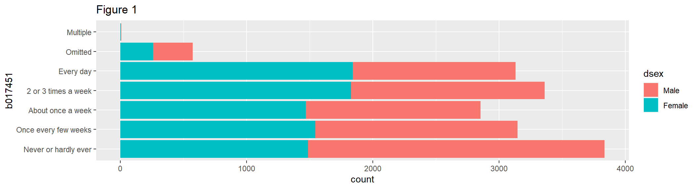
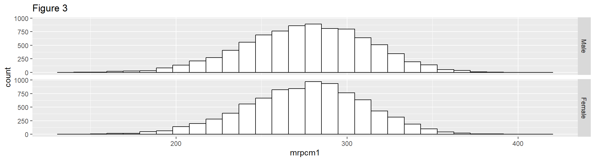

```
#> Warning: package 'EdSurvey' was built under R version 4.3.1
```

# Understanding Data {#understandingData}

Once data are successfully read in (see how `EdSurvey` supports reading-in data for each study in [Chapter 4](#dataAccess)), users can use the commands in the following sections to understand the data.

To follow along in this chapter, load the [NAEP Primer dataset](https://nces.ed.gov/pubsearch/pubsinfo.asp?pubid=2011463) `M36NT2PM` and assign it the name `sdf` with the following call:

```r
sdf <- readNAEP(path = system.file("extdata/data", "M36NT2PM.dat", package = "NAEPprimer"))
```

## Searching Variables
The `colnames()` function will list all variable names in the data:


```r
colnames(x = sdf)
#>   [1] "ROWID"   "year"    "cohort"  "scrpsu"  "dsex"   
#>   [6] "iep"     "lep"     "ell3"    "sdracem" "pared"  
#>  [11] "b003501" "b003601" "b013801" "b017001" "b017101"
#>  [16] "b018101" "b018201" "b017451" "m815401" "m815501"
#>  [21] "m815601" "m815801" "m815701" "rptsamp" "repgrp1"
#>  [26] "repgrp2" "jkunit"  "origwt"  "srwt01"  "srwt02" 
#>  [31] "srwt03"  "srwt04"  "srwt05"  "srwt06"  "srwt07" 
#>  [36] "srwt08"  "srwt09"  "srwt10"  "srwt11"  "srwt12" 
#>  [41] "srwt13"  "srwt14"  "srwt15"  "srwt16"  "srwt17" 
#>  [46] "srwt18"  "srwt19"  "srwt20"  "srwt21"  "srwt22" 
#>  [51] "srwt23"  "srwt24"  "srwt25"  "srwt26"  "srwt27" 
#>  [56] "srwt28"  "srwt29"  "srwt30"  "srwt31"  "srwt32" 
#>  [61] "srwt33"  "srwt34"  "srwt35"  "srwt36"  "srwt37" 
#>  [66] "srwt38"  "srwt39"  "srwt40"  "srwt41"  "srwt42" 
#>  [71] "srwt43"  "srwt44"  "srwt45"  "srwt46"  "srwt47" 
#>  [76] "srwt48"  "srwt49"  "srwt50"  "srwt51"  "srwt52" 
#>  [81] "srwt53"  "srwt54"  "srwt55"  "srwt56"  "srwt57" 
#>  [86] "srwt58"  "srwt59"  "srwt60"  "srwt61"  "srwt62" 
#>  [91] "smsrswt" "mrps11"  "mrps12"  "mrps13"  "mrps14" 
#>  [96] "mrps15"  "mrps21"  "mrps22"  "mrps23"  "mrps24" 
#> [101] "mrps25"  "mrps31"  "mrps32"  "mrps33"  "mrps34" 
#> [106] "mrps35"  "mrps41"  "mrps42"  "mrps43"  "mrps44" 
#> [111] "mrps45"  "mrps51"  "mrps52"  "mrps53"  "mrps54" 
#> [116] "mrps55"  "mrpcm1"  "mrpcm2"  "mrpcm3"  "mrpcm4" 
#> [121] "mrpcm5"  "m075201" "m075401" "m075601" "m019901"
#> [126] "m066201" "m047301" "m046201" "m066401" "m020101"
#> [131] "m067401" "m086101" "m047701" "m067301" "m048001"
#> [136] "m093701" "m086001" "m051901" "m076001" "m046001"
#> [141] "m046101" "m067701" "m046701" "m046901" "m047201"
#> [146] "m046601" "m046801" "m067801" "m066601" "m067201"
#> [151] "m068003" "m068005" "m068008" "m068007" "m068006"
#> [156] "m093601" "m053001" "m047801" "m086301" "m085701"
#> [161] "m085901" "m085601" "m085501" "m085801" "m019701"
#> [166] "m020001" "m046301" "m047001" "m046501" "m066501"
#> [171] "m047101" "m066301" "m067901" "m019601" "m051501"
#> [176] "m047901" "m053101" "m143601" "m143701" "m143801"
#> [181] "m143901" "m144001" "m144101" "m144201" "m144301"
#> [186] "m144401" "m144501" "m144601" "m144701" "m144801"
#> [191] "m144901" "m145001" "m145101" "m013431" "m0757cl"
#> [196] "m013131" "m091701" "m072801" "m091501" "m091601"
#> [201] "m073501" "m052401" "m075301" "m072901" "m013631"
#> [206] "m075801" "m013731" "m013531" "m051801" "m093401"
#> [211] "m093801" "m142001" "m142101" "m142201" "m142301"
#> [216] "m142401" "m142501" "m142601" "m142701" "m142801"
#> [221] "m142901" "m143001" "m143101" "m143201" "m143301"
#> [226] "m143401" "m143501" "m105601" "m105801" "m105901"
#> [231] "m106001" "m106101" "m106201" "m106301" "m106401"
#> [236] "m106501" "m106601" "m106701" "m106801" "m106901"
#> [241] "m107001" "m107101" "m107201" "m107401" "m107501"
#> [246] "m107601" "m109801" "m110001" "m110101" "m110201"
#> [251] "m110301" "m110401" "m110501" "m110601" "m110701"
#> [256] "m110801" "m110901" "m111001" "m111201" "m111301"
#> [261] "m111401" "m111501" "m111601" "m111801" "yrsexp" 
#> [266] "yrsmath" "t089401" "t088001" "t090801" "t090802"
#> [271] "t090803" "t090804" "t090805" "t090806" "t087501"
#> [276] "t088301" "t088401" "t088501" "t088602" "t088603"
#> [281] "t088801" "t088803" "t088804" "t088805" "t091502"
#> [286] "t091503" "t091504" "c052801" "c052802" "c052804"
#> [291] "c052805" "c052806" "c052807" "c052808" "c052701"
#> [296] "c046501" "c044006" "c044007" "c052901" "c053001"
#> [301] "c053101" "sscrpsu" "c052601"
```

To conduct a more powerful search of NAEP data variables, use the `searchSDF()` function, which returns variable names and labels from an `edsurvey.data.frame` based on a character string. The user can specify which data source (either "student" or "school") to search. For example, the following call to `searchSDF()` searches for the character string `"book"` in an `edsurvey.data.frame` and specifies the `fileFormat` to search the student data file:


```r
searchSDF(string = "book", data = sdf, fileFormat = "student")
#>   variableName                                       Labels
#> 1      b013801                                Books in home
#> 2      t088804 Computer activities: Use a gradebook program
#> 3      t091503     G8Math:How often use Geometry sketchbook
#>   fileFormat
#> 1    Student
#> 2    Student
#> 3    Student
```

The levels and labels for each variable searched via `searchSDF()` also can be returned by setting `levels = TRUE`:


```r
searchSDF(string = "book", data = sdf, fileFormat = "student", levels = TRUE)
#> Variable: b013801
#> Label: Books in home
#> Levels (Lowest level first):
#>      1. 0-10
#>      2. 11-25
#>      3. 26-100
#>      4. >100
#>      8. Omitted
#>      0. Multiple
#> Variable: t088804
#> Label: Computer activities: Use a gradebook program
#> Levels (Lowest level first):
#>      1. Never or hardly ever
#>      2. Once or twice/month
#>      3. Once or twice a week
#>      4. Almost every day
#>      8. Omitted
#>      0. Multiple
#> Variable: t091503
#> Label: G8Math:How often use Geometry sketchbook
#> Levels (Lowest level first):
#>      1. Never or hardly ever
#>      2. Once or twice/month
#>      3. Once or twice a week
#>      4. Almost every day
#>      8. Omitted
#>      0. Multiple
```

The `|` (OR) operator will search several strings simultaneously:


```r
searchSDF(string="book|home|value", data=sdf)
#>    variableName
#> 1       b013801
#> 2       b017001
#> 3       b017101
#> 4       b018201
#> 5       b017451
#> 6       m086101
#> 7       m020001
#> 8       m143601
#> 9       m142301
#> 10      t088804
#> 11      t088805
#> 12      t091503
#>                                               Labels
#> 1                                      Books in home
#> 2                                  Newspaper in home
#> 3                                   Computer at home
#> 4         Language other than English spoken in home
#> 5                         Talk about studies at home
#> 6                              Read value from graph
#> 7  Apply place value                            (R1)
#> 8                       Solve for x given value of n
#> 9                               Identify place value
#> 10      Computer activities: Use a gradebook program
#> 11  Computer activities: Post homework,schedule info
#> 12          G8Math:How often use Geometry sketchbook
#>    fileFormat
#> 1     Student
#> 2     Student
#> 3     Student
#> 4     Student
#> 5     Student
#> 6     Student
#> 7     Student
#> 8     Student
#> 9     Student
#> 10    Student
#> 11    Student
#> 12    Student
```

A vector of strings will search for variables that contain multiple strings, such as both "book" and "home"; each string is present in the variable label and can be used to filter the results:


```r
searchSDF(string=c("book","home"), data=sdf)
#>   variableName        Labels fileFormat
#> 1      b013801 Books in home    Student
```

To dive into a particular variable, use `levelsSDF()`. It returns the levels, the corresponding sample size, and label of each level.


```r
levelsSDF(varnames = "b017451", data = sdf)
#> Levels for Variable 'b017451' (Lowest level first):
#>     1. Never or hardly ever (n = 3837)
#>     2. Once every few weeks (n = 3147)
#>     3. About once a week (n = 2853)
#>     4. 2 or 3 times a week (n = 3362)
#>     5. Every day (n = 3132)
#>     8. Omitted* (n = 575)
#>     0. Multiple* (n = 9)
#>     NOTE: * indicates an omitted level.
```

## Displaying Basic Information

Some basic functions that work on a `data.frame`, such as `dim`, `nrow`, and `ncol`, also work on an `edsurvey.data.frame`. They help check the dimensions of `sdf`.


```r
dim(x = sdf)
#> [1] 17606   303
nrow(x = sdf)
#> [1] 17606
ncol(x = sdf)
#> [1] 303
```

Basic information about plausible values and weights in an `edsurvey.data.frame` can be seen in the `print` function. The variables associated with plausible values and weights can be seen from the `showPlausibleValues` and `showWeights` functions, respectively, when setting the `verbose` argument to `TRUE`:


```r
showPlausibleValues(data = sdf, verbose = TRUE)
#> There are 6 subject scale(s) or subscale(s) in this
#>   edsurvey.data.frame:
#> 'num_oper' subject scale or subscale with 5 plausible
#>   values.
#>   The plausible value variables are: 'mrps11',
#>   'mrps12', 'mrps13', 'mrps14', and 'mrps15'
#> 
#> 'measurement' subject scale or subscale with 5
#>   plausible values.
#>   The plausible value variables are: 'mrps21',
#>   'mrps22', 'mrps23', 'mrps24', and 'mrps25'
#> 
#> 'geometry' subject scale or subscale with 5 plausible
#>   values.
#>   The plausible value variables are: 'mrps31',
#>   'mrps32', 'mrps33', 'mrps34', and 'mrps35'
#> 
#> 'data_anal_prob' subject scale or subscale with 5
#>   plausible values.
#>   The plausible value variables are: 'mrps41',
#>   'mrps42', 'mrps43', 'mrps44', and 'mrps45'
#> 
#> 'algebra' subject scale or subscale with 5 plausible
#>   values.
#>   The plausible value variables are: 'mrps51',
#>   'mrps52', 'mrps53', 'mrps54', and 'mrps55'
#> 
#> 'composite' subject scale or subscale with 5
#>   plausible values (the default).
#>   The plausible value variables are: 'mrpcm1',
#>   'mrpcm2', 'mrpcm3', 'mrpcm4', and 'mrpcm5'
showWeights(data = sdf, verbose = TRUE)
#> There is 1 full sample weight in this
#>   edsurvey.data.frame:
#>   'origwt' with 62 JK replicate weights (the
#>   default).
#>     Jackknife replicate weight variables associated
#>     with the full sample weight 'origwt':
#>     'srwt01', 'srwt02', 'srwt03', 'srwt04', 'srwt05',
#>     'srwt06', 'srwt07', 'srwt08', 'srwt09', 'srwt10',
#>     'srwt11', 'srwt12', 'srwt13', 'srwt14', 'srwt15',
#>     'srwt16', 'srwt17', 'srwt18', 'srwt19', 'srwt20',
#>     'srwt21', 'srwt22', 'srwt23', 'srwt24', 'srwt25',
#>     'srwt26', 'srwt27', 'srwt28', 'srwt29', 'srwt30',
#>     'srwt31', 'srwt32', 'srwt33', 'srwt34', 'srwt35',
#>     'srwt36', 'srwt37', 'srwt38', 'srwt39', 'srwt40',
#>     'srwt41', 'srwt42', 'srwt43', 'srwt44', 'srwt45',
#>     'srwt46', 'srwt47', 'srwt48', 'srwt49', 'srwt50',
#>     'srwt51', 'srwt52', 'srwt53', 'srwt54', 'srwt55',
#>     'srwt56', 'srwt57', 'srwt58', 'srwt59', 'srwt60',
#>     'srwt61', and 'srwt62'
```

The functions `getStratumVar` and `getPSUVar` return the default stratum variable name or a PSU variable associated with a weight variable.


```r
getStratumVar(data = sdf, weightVar = "origwt")
#>   stratum 
#> "repgrp1"
getPSUVar(data = sdf, weightVar = "origwt")
#>      psu 
#> "jkunit"
```

##	Keeping or Removing Omitted Levels

`EdSurvey` uses listwise deletion to remove special values in all analyses by default. For example, in the NAEP Primer data, the omitted levels are returned when `print(sdf)` is called: `Omitted Levels: 'Multiple', 'NA', 'Omitted'`. By default, these levels are excluded via listwise deletion in `EdSurvey` analytical functions. To use a different method, such as pairwise deletion, set `defaultConditions = FALSE` when running your analysis.

## Exploring Data
This section introduces three basic R functions (both `EdSurvey` and `non-EdSurvey`) commonly used in the data exploration step, as follows:

1. **`summary2()`** produces both weighted and unweighted descriptive statistics for a variable.

2. **`edsurveyTable()`** produces cross-tabulation statistics.

3. **`ggplot2`** produces a variety of exploratory data analysis (EDA) plots.


### `summary2()`
**`summary2()`** takes the following four arguments in order:

- **`data`**: An `EdSurvey` object.
- **`variable`**: Name of the variable you want to produce statistics on.
- **`weightVar`**: name of the weight variable or `NULL` if users want to produce unweighted statistics.
- **`dropOmittedLevels`**: If `TRUE`, the function will remove omitted levels for the specified variable before producing descriptive statistics. If `FALSE`, the function will include omitted levels in the output statistics.

The `summary2` function produces both weighted and unweighted descriptive statistics for a variable. This functionality is quite useful for gathering response information for survey variables when conducting data exploration. For NAEP data and other datasets that have a default weight variable, `summary2` produces weighted statistics by default. If the specified variable is a set of plausible values, and the `weightVar` option is non-`NULL`, `summary2` statistics account for both plausible values pooling and weighting.


```r
summary2(data = sdf, variable = "composite")
#> Estimates are weighted using the weight variable 'origwt'
#>    Variable     N Weighted N   Min.  1st Qu.   Median
#> 1 composite 16915   16932.46 126.11 251.9626 277.4784
#>       Mean  3rd Qu.    Max.      SD NA's Zero weights
#> 1 275.8892 301.1827 404.184 36.5713    0            0
```

By specifying `weightVar = NULL`, the function prints out unweighted descriptive statistics for the selected variable or plausible values:


```r
summary2(data = sdf, variable = "composite", weightVar = NULL)
#> Estimates are not weighted.
#>   Variable     N   Min.  1st Qu. Median     Mean  3rd Qu.
#> 1   mrpcm1 16915 130.53 252.0600 277.33 275.8606 300.7200
#> 2   mrpcm2 16915 124.16 252.2100 277.33 275.6399 300.6900
#> 3   mrpcm3 16915 115.09 252.0017 277.19 275.6570 300.5600
#> 4   mrpcm4 16915 137.19 252.4717 277.44 275.7451 300.5767
#> 5   mrpcm5 16915 123.58 252.4900 277.16 275.6965 300.5000
#>     Max.       SD NA's
#> 1 410.80 35.89864    0
#> 2 408.58 36.08483    0
#> 3 398.17 36.09278    0
#> 4 407.41 35.91078    0
#> 5 395.96 36.10905    0
```

For a categorical variable, the `summary2` function returns the weighted number of cases, the weighted percentage, and the weighted standard error (SE). For example, the variable `b017451` (frequency of students talking about studies at home) returns the following output:


```r
summary2(data = sdf, variable = "b017451")
#> Estimates are weighted using the weight variable 'origwt'
#>                b017451    N Weighted N Weighted Percent
#> 1 Never or hardly ever 3837  3952.4529      23.34245648
#> 2 Once every few weeks 3147  3190.8945      18.84483329
#> 3    About once a week 2853  2937.7148      17.34960077
#> 4  2 or 3 times a week 3362  3425.8950      20.23270282
#> 5            Every day 3132  3223.8074      19.03921080
#> 6              Omitted  575   194.3312       1.14768416
#> 7             Multiple    9     7.3676       0.04351168
#>   Weighted Percent SE
#> 1           0.4318975
#> 2           0.3740648
#> 3           0.3414566
#> 4           0.3156289
#> 5           0.4442216
#> 6           0.1272462
#> 7           0.0191187
```

By default, the `summary2` function includes omitted levels; to remove those levels, set `dropOmittedLevels = TRUE`:


```r
summary2(data = sdf, variable = "b017451", dropOmittedLevels = TRUE)
#> Estimates are weighted using the weight variable 'origwt'
#>                b017451    N Weighted N Weighted Percent
#> 1 Never or hardly ever 3837   3952.453         23.62386
#> 2 Once every few weeks 3147   3190.894         19.07202
#> 3    About once a week 2853   2937.715         17.55876
#> 4  2 or 3 times a week 3362   3425.895         20.47662
#> 5            Every day 3132   3223.807         19.26874
#>   Weighted Percent SE
#> 1           0.4367548
#> 2           0.3749868
#> 3           0.3486008
#> 4           0.3196719
#> 5           0.4467063
```


### `edsurveyTable()`
`edsurveyTable()` creates a summary table of outcome and categorical variables. The three important arguments are as follows: 

- **`formula`**: Typically written as `a ~ b + c`, with the following meanings:
  - **`a`** is a continuous variable (optional) for which the function will return the weighted mean.
  - **`b`** and **`c`** are categorical variables for which the function will run cross-tabulations; multiple crosstab 
  categorical variables can be separated using `+` symbol.  
- **`data`**: An `EdSurvey` object.
- **`pctAggregationLevel`**: A numeric value (i.e., 0, 1, 2) that indicates the level of aggregation in the cross-tabulation result's percentage column. 

The following call uses `edsurveyTable()` to create a summary table of NAEP composite mathematics performance scale scores (`composite`) of 8th-grade students by two student factors:
  - `dsex`: gender
  - `b017451`: frequency of talk about studies at home
  
`pctAggregationLevel` is by default set to `NULL` (or `1`). That is, the `PCT` column adds up to 100 within each level of the first categorical variable `dsex`. 


```r
es1 <- edsurveyTable(formula = composite ~ dsex + b017451, data = sdf, pctAggregationLevel = NULL)
```


```
#> Warning: package 'knitr' was built under R version 4.3.1
#> Warning: package 'kableExtra' was built under R version
#> 4.3.1
```

<div style="border: 1px solid #ddd; padding: 0px; overflow-y: scroll; height:30%; overflow-x: scroll; width:100%; "><table class="table" style="font-size: 16px; margin-left: auto; margin-right: auto;">
<caption style="font-size: initial !important;">(\#tab:table501)Summary Data Tables with EdSurvey</caption>
 <thead>
  <tr>
   <th style="text-align:left;position: sticky; top:0; background-color: #FFFFFF;"> dsex </th>
   <th style="text-align:left;position: sticky; top:0; background-color: #FFFFFF;"> b017451 </th>
   <th style="text-align:right;position: sticky; top:0; background-color: #FFFFFF;"> N </th>
   <th style="text-align:right;position: sticky; top:0; background-color: #FFFFFF;"> WTD_N </th>
   <th style="text-align:right;position: sticky; top:0; background-color: #FFFFFF;"> PCT </th>
   <th style="text-align:right;position: sticky; top:0; background-color: #FFFFFF;"> SE(PCT) </th>
   <th style="text-align:right;position: sticky; top:0; background-color: #FFFFFF;"> MEAN </th>
   <th style="text-align:right;position: sticky; top:0; background-color: #FFFFFF;"> SE(MEAN) </th>
  </tr>
 </thead>
<tbody>
  <tr>
   <td style="text-align:left;"> Male </td>
   <td style="text-align:left;"> Never or hardly ever </td>
   <td style="text-align:right;"> 2350 </td>
   <td style="text-align:right;"> 2434.844 </td>
   <td style="text-align:right;"> 29.00978 </td>
   <td style="text-align:right;"> 0.6959418 </td>
   <td style="text-align:right;"> 270.8243 </td>
   <td style="text-align:right;"> 1.057078 </td>
  </tr>
  <tr>
   <td style="text-align:left;"> Male </td>
   <td style="text-align:left;"> Once every few weeks </td>
   <td style="text-align:right;"> 1603 </td>
   <td style="text-align:right;"> 1638.745 </td>
   <td style="text-align:right;"> 19.52472 </td>
   <td style="text-align:right;"> 0.5020657 </td>
   <td style="text-align:right;"> 275.0807 </td>
   <td style="text-align:right;"> 1.305922 </td>
  </tr>
  <tr>
   <td style="text-align:left;"> Male </td>
   <td style="text-align:left;"> About once a week </td>
   <td style="text-align:right;"> 1384 </td>
   <td style="text-align:right;"> 1423.312 </td>
   <td style="text-align:right;"> 16.95795 </td>
   <td style="text-align:right;"> 0.5057265 </td>
   <td style="text-align:right;"> 281.5612 </td>
   <td style="text-align:right;"> 1.409587 </td>
  </tr>
  <tr>
   <td style="text-align:left;"> Male </td>
   <td style="text-align:left;"> 2 or 3 times a week </td>
   <td style="text-align:right;"> 1535 </td>
   <td style="text-align:right;"> 1563.393 </td>
   <td style="text-align:right;"> 18.62694 </td>
   <td style="text-align:right;"> 0.4811497 </td>
   <td style="text-align:right;"> 284.9066 </td>
   <td style="text-align:right;"> 1.546072 </td>
  </tr>
  <tr>
   <td style="text-align:left;"> Male </td>
   <td style="text-align:left;"> Every day </td>
   <td style="text-align:right;"> 1291 </td>
   <td style="text-align:right;"> 1332.890 </td>
   <td style="text-align:right;"> 15.88062 </td>
   <td style="text-align:right;"> 0.5872731 </td>
   <td style="text-align:right;"> 277.2597 </td>
   <td style="text-align:right;"> 1.795784 </td>
  </tr>
  <tr>
   <td style="text-align:left;"> Female </td>
   <td style="text-align:left;"> Never or hardly ever </td>
   <td style="text-align:right;"> 1487 </td>
   <td style="text-align:right;"> 1517.609 </td>
   <td style="text-align:right;"> 18.20203 </td>
   <td style="text-align:right;"> 0.5078805 </td>
   <td style="text-align:right;"> 266.7897 </td>
   <td style="text-align:right;"> 1.519020 </td>
  </tr>
  <tr>
   <td style="text-align:left;"> Female </td>
   <td style="text-align:left;"> Once every few weeks </td>
   <td style="text-align:right;"> 1544 </td>
   <td style="text-align:right;"> 1552.149 </td>
   <td style="text-align:right;"> 18.61630 </td>
   <td style="text-align:right;"> 0.4892491 </td>
   <td style="text-align:right;"> 271.2255 </td>
   <td style="text-align:right;"> 1.205528 </td>
  </tr>
  <tr>
   <td style="text-align:left;"> Female </td>
   <td style="text-align:left;"> About once a week </td>
   <td style="text-align:right;"> 1469 </td>
   <td style="text-align:right;"> 1514.403 </td>
   <td style="text-align:right;"> 18.16358 </td>
   <td style="text-align:right;"> 0.5782966 </td>
   <td style="text-align:right;"> 278.7502 </td>
   <td style="text-align:right;"> 1.719778 </td>
  </tr>
  <tr>
   <td style="text-align:left;"> Female </td>
   <td style="text-align:left;"> 2 or 3 times a week </td>
   <td style="text-align:right;"> 1827 </td>
   <td style="text-align:right;"> 1862.502 </td>
   <td style="text-align:right;"> 22.33864 </td>
   <td style="text-align:right;"> 0.4844840 </td>
   <td style="text-align:right;"> 282.7765 </td>
   <td style="text-align:right;"> 1.404107 </td>
  </tr>
  <tr>
   <td style="text-align:left;"> Female </td>
   <td style="text-align:left;"> Every day </td>
   <td style="text-align:right;"> 1841 </td>
   <td style="text-align:right;"> 1890.918 </td>
   <td style="text-align:right;"> 22.67945 </td>
   <td style="text-align:right;"> 0.6553039 </td>
   <td style="text-align:right;"> 275.4628 </td>
   <td style="text-align:right;"> 1.219439 </td>
  </tr>
</tbody>
</table></div>


By specifying `pctAggregationLevel = 0`, such as in the following call, the `PCT` column adds up to 100 across the entire sample.         


```r
es2 <- edsurveyTable(formula = composite ~ dsex + b017451, data = sdf, pctAggregationLevel = 0)
```


<div style="border: 1px solid #ddd; padding: 0px; overflow-y: scroll; height:75%; overflow-x: scroll; width:100%; "><table class="table" style="font-size: 16px; margin-left: auto; margin-right: auto;">
<caption style="font-size: initial !important;">(\#tab:table502)Summary Data Tables with EdSurvey, Setting pctAggregationLevel = 0 \label{tab:table2}</caption>
 <thead>
  <tr>
   <th style="text-align:left;position: sticky; top:0; background-color: #FFFFFF;"> dsex </th>
   <th style="text-align:left;position: sticky; top:0; background-color: #FFFFFF;"> b017451 </th>
   <th style="text-align:right;position: sticky; top:0; background-color: #FFFFFF;"> N </th>
   <th style="text-align:right;position: sticky; top:0; background-color: #FFFFFF;"> WTD_N </th>
   <th style="text-align:right;position: sticky; top:0; background-color: #FFFFFF;"> PCT </th>
   <th style="text-align:right;position: sticky; top:0; background-color: #FFFFFF;"> SE(PCT) </th>
   <th style="text-align:right;position: sticky; top:0; background-color: #FFFFFF;"> MEAN </th>
   <th style="text-align:right;position: sticky; top:0; background-color: #FFFFFF;"> SE(MEAN) </th>
  </tr>
 </thead>
<tbody>
  <tr>
   <td style="text-align:left;"> Male </td>
   <td style="text-align:left;"> Never or hardly ever </td>
   <td style="text-align:right;"> 2350 </td>
   <td style="text-align:right;"> 2434.844 </td>
   <td style="text-align:right;"> 14.553095 </td>
   <td style="text-align:right;"> 0.3738531 </td>
   <td style="text-align:right;"> 270.8243 </td>
   <td style="text-align:right;"> 1.057078 </td>
  </tr>
  <tr>
   <td style="text-align:left;"> Male </td>
   <td style="text-align:left;"> Once every few weeks </td>
   <td style="text-align:right;"> 1603 </td>
   <td style="text-align:right;"> 1638.745 </td>
   <td style="text-align:right;"> 9.794803 </td>
   <td style="text-align:right;"> 0.2651368 </td>
   <td style="text-align:right;"> 275.0807 </td>
   <td style="text-align:right;"> 1.305922 </td>
  </tr>
  <tr>
   <td style="text-align:left;"> Male </td>
   <td style="text-align:left;"> About once a week </td>
   <td style="text-align:right;"> 1384 </td>
   <td style="text-align:right;"> 1423.312 </td>
   <td style="text-align:right;"> 8.507154 </td>
   <td style="text-align:right;"> 0.2770233 </td>
   <td style="text-align:right;"> 281.5612 </td>
   <td style="text-align:right;"> 1.409587 </td>
  </tr>
  <tr>
   <td style="text-align:left;"> Male </td>
   <td style="text-align:left;"> 2 or 3 times a week </td>
   <td style="text-align:right;"> 1535 </td>
   <td style="text-align:right;"> 1563.393 </td>
   <td style="text-align:right;"> 9.344421 </td>
   <td style="text-align:right;"> 0.2670298 </td>
   <td style="text-align:right;"> 284.9066 </td>
   <td style="text-align:right;"> 1.546072 </td>
  </tr>
  <tr>
   <td style="text-align:left;"> Male </td>
   <td style="text-align:left;"> Every day </td>
   <td style="text-align:right;"> 1291 </td>
   <td style="text-align:right;"> 1332.890 </td>
   <td style="text-align:right;"> 7.966700 </td>
   <td style="text-align:right;"> 0.3000579 </td>
   <td style="text-align:right;"> 277.2597 </td>
   <td style="text-align:right;"> 1.795784 </td>
  </tr>
  <tr>
   <td style="text-align:left;"> Female </td>
   <td style="text-align:left;"> Never or hardly ever </td>
   <td style="text-align:right;"> 1487 </td>
   <td style="text-align:right;"> 1517.609 </td>
   <td style="text-align:right;"> 9.070768 </td>
   <td style="text-align:right;"> 0.2984443 </td>
   <td style="text-align:right;"> 266.7897 </td>
   <td style="text-align:right;"> 1.519020 </td>
  </tr>
  <tr>
   <td style="text-align:left;"> Female </td>
   <td style="text-align:left;"> Once every few weeks </td>
   <td style="text-align:right;"> 1544 </td>
   <td style="text-align:right;"> 1552.149 </td>
   <td style="text-align:right;"> 9.277216 </td>
   <td style="text-align:right;"> 0.2498498 </td>
   <td style="text-align:right;"> 271.2255 </td>
   <td style="text-align:right;"> 1.205528 </td>
  </tr>
  <tr>
   <td style="text-align:left;"> Female </td>
   <td style="text-align:left;"> About once a week </td>
   <td style="text-align:right;"> 1469 </td>
   <td style="text-align:right;"> 1514.403 </td>
   <td style="text-align:right;"> 9.051606 </td>
   <td style="text-align:right;"> 0.2899668 </td>
   <td style="text-align:right;"> 278.7502 </td>
   <td style="text-align:right;"> 1.719778 </td>
  </tr>
  <tr>
   <td style="text-align:left;"> Female </td>
   <td style="text-align:left;"> 2 or 3 times a week </td>
   <td style="text-align:right;"> 1827 </td>
   <td style="text-align:right;"> 1862.502 </td>
   <td style="text-align:right;"> 11.132198 </td>
   <td style="text-align:right;"> 0.2552321 </td>
   <td style="text-align:right;"> 282.7765 </td>
   <td style="text-align:right;"> 1.404107 </td>
  </tr>
  <tr>
   <td style="text-align:left;"> Female </td>
   <td style="text-align:left;"> Every day </td>
   <td style="text-align:right;"> 1841 </td>
   <td style="text-align:right;"> 1890.918 </td>
   <td style="text-align:right;"> 11.302039 </td>
   <td style="text-align:right;"> 0.3497982 </td>
   <td style="text-align:right;"> 275.4628 </td>
   <td style="text-align:right;"> 1.219439 </td>
  </tr>
</tbody>
</table></div>


### `ggplot2`
`ggplot2` is an important R package used with `EdSurvey` to conduct EDA. 


```r
# load the ggplot2 library
library(ggplot2)
```

The basic steps for using `ggplot2` are as follows. To learn more about how to use `ggplot2()`, visit its [official website](https://ggplot2.tidyverse.org/). 

1. Start with a `ggplot()`.
2. Supply a dataset and aesthetic mapping with `aes()`.
3. Add layers comprising one or more of the following functions. We will address examples of the *talicized functions*.
- Geometries:  *`geom_bar()`*, *`geom_histogram()`*, *`geom_boxplot()`*
- Scales: `scale_colour_brewer()`, `scale_x_date()`
- Facets:  *`facet_grid()`*, `facet_wrap()`
- Statistical transformations: *`stat_summary()`*, `stat_density()`
- Coordinate systems: *`coord_flip()`*, `coord_map()`

In this chapter, you will find a "quick and dirty" approach (i.e., no application of weights; where applicable, only one set of plausible values is used) for EDA using `ggplot2` and `EdSurvey` functions. To learn more about conducting EDA on NCES data, read [*Exploratory Data Analysis on NCES Data*](https://www.air.org/sites/default/files/EdSurvey-EDA.pdf)

This section uses the following `gddat` object:


```r
gddat <- getData(data = sdf, varnames = c('dsex', 'sdracem', 'b018201', 'b017451',
                                   'composite', 'geometry', 'origwt'),
              addAttributes = TRUE, dropOmittedLevels = FALSE)
```

`geom_bar()` uses the height of rectangles to represent data values. Figure 1 shows a bar chart with counts of the variable `b017451` in each category, with `fill = dsex` used to color portions of the selected `x` variable.


```r
bar1 <- ggplot(data = gddat, aes(x = b017451)) +
  geom_bar(aes(fill = dsex)) +
  coord_flip() +
  labs(title = "Figure 1")
bar1
```



`geom_histogram()` uses binning to visualize the distribution of continuous variables. Figure 2 is a basic histogram that uses the first plausible value of the composite, giving an unbiased (but unweighted) estimate of the frequencies in each bin.


```r
hist1 <- ggplot(gddat, aes(x = mrpcm1)) +
    geom_histogram() + 
    labs(title = "Figure 2") 
hist1
```


Figure 3 extends Figure 2, faceted on the categorical variable `dsex`, so that the output will be two histograms with common axes.


```r
hist2 <- ggplot(gddat, aes(x = mrpcm1)) +
  geom_histogram(color = "black", fill = "white")+
  facet_grid(dsex ~ .) +
  labs(title = "Figure 3") 
hist2
#> Warning: Combining variables of class <lfactor> and <factor> was
#> deprecated in ggplot2 3.4.0.
#> ℹ Please ensure your variables are compatible before
#>   plotting (location: `join_keys()`)
#> This warning is displayed once every 8 hours.
#> Call `lifecycle::last_lifecycle_warnings()` to see where
#> this warning was generated.
```



`geom_boxplot()` shows the distribution of a single variable through quartiles. Figure 4 shows the distribution of the six levels of the `sdracem` variable by the first plausible value of the composite.


```r
box1 <- ggplot(gddat, aes(x = sdracem, y = mrpcm1)) + 
  geom_boxplot() +
  labs(title = "Figure 4") 
box1
```


Figure 5 extends Figure 4 by using `stat_summary()` to add another statistic on top: the mean of `mrpcm1` by `sdracem`, which is represented by the diamond-shaped symbol (`shape = 23`). Figure 5 also adds a coordinate flip via `coord_flip()`.


```r

box2 <- box1 + stat_summary(fun.y = mean, geom = "point", shape = 23, size = 4) +
  coord_flip() +
  labs(title = "Figure 5") 
box2
```


