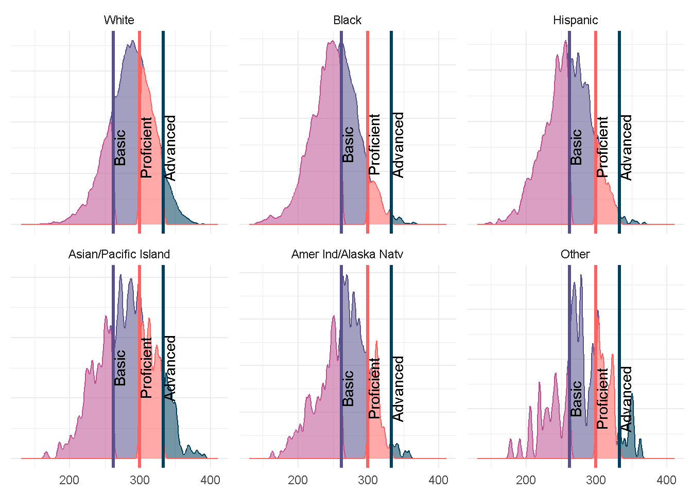

# Data Manipulation in `EdSurvey` and Base R {#dataManipulation}

`EdSurvey` gives users functions to efficiently analyze education survey data. As mentioned in [Chapter 3](#philosophyOfAnalysis), `EdSurvey` is flexible when conducting data manipulation and preparing for survey analysis. It allows for rudimentary data manipulation and analysis with both `EdSurvey` and base R functions to edit data before processing. Also, by calling the function `getData()`, one can extract a `light.edsurvey.data.frame` to manipulate similarly as other `data.frame` objects in other R packages. This concept is further detailed in [Chapter 9](#analysisOutsideEdSurvey)analysisOutsideEdSurvey).

## Subsetting the Data

Analysts can directly use a subset of a dataset with `EdSurvey` functions. In this example, a summary table is created with `edsurveyTable` after filtering the sample to include only those students whose value for the `dsex` variable is male and race (as the variable `sdracem`) is either 1 or 3 (White or Hispanic). Both value levels and labels can be used in `EdSurvey` functions.


``` r
sdf <- readNAEP(path = system.file("extdata/data", "M36NT2PM.dat", package = "NAEPprimer"))
sdfm <- subset(x = sdf, subset = dsex == "Male" & (sdracem == 3 | sdracem == 1))
es1 <- edsurveyTable(formula = composite ~ dsex + sdracem, data = sdfm)
```

``` r
es1
```


Table: (\#tab:table601)Subsetting Data \label{tab:subsettingData}

|dsex |sdracem  |    N|    WTD_N|      PCT|  SE(PCT)|     MEAN|  SE(MEAN)|
|:----|:--------|----:|--------:|--------:|--------:|--------:|---------:|
|Male |White    | 5160| 5035.169| 76.11329| 1.625174| 287.6603| 0.8995013|
|Male |Hispanic | 1244| 1580.192| 23.88671| 1.625174| 260.8268| 1.5822251|


## Recoding Variable Names and Levels Using `recode.sdf` and `rename.sdf`

To assist in the process of standardizing data for an `edsurvey.data.frame`, a `light.edsurvey.data.frame`, and an `edsurvey.data.frame.list`, the functions `recode.sdf()` and `rename.sdf()` are very handy. 

The `recode.sdf()` function accepts the levels of a variable as a vector from their current values to their newly recoded value. For example, changing the lowest level of `b017451` from `"Never or hardly ever"` to `"Infrequently"` and the highest level from `"Every day"` to `"Frequently"`, will recode levels for that variable in our connection to `sdf`:


``` r
sdf2 <- recode.sdf(sdf, recode = list(
  b017451 = list(from = c("Never or hardly ever"),
               to = c("Infrequently")),
  b017451 = list(from = c("Every day"),
               to = c ("Frequently"))
  )
)
searchSDF(string = "b017451", data = sdf2, levels = TRUE)                              
#> Variable: b017451
#> Label: Talk about studies at home
#> Levels (Lowest level first):
#>      2. Once every few weeks
#>      3. About once a week
#>      4. 2 or 3 times a week
#>      8. Omitted
#>      0. Multiple
#>      9. Infrequently
#>      10. Frequently
```

In addition, we can change the name of variables using `rename.sdf()`. The recoded variable `"b017451"` can be changed to a value that more effectively describes its contents, such as `"studytalkfrequency"`:


``` r
sdf2 <- rename.sdf(x = sdf2, oldnames = "b017451", newnames = "studytalkfrequency")
searchSDF(string = "studytalkfrequency", data = sdf2, levels = TRUE)
#> Variable: studytalkfrequency
#> Label: Talk about studies at home
#> Levels (Lowest level first):
#>      2. Once every few weeks
#>      3. About once a week
#>      4. 2 or 3 times a week
#>      8. Omitted
#>      0. Multiple
#>      9. Infrequently
#>      10. Frequently
```

Most `EdSurvey` analytical functions allow the user to recode variable levels through the recode argument, including, for example, `cor.sdf()`, `lm.sdf()`, and `edsurveyTable()`. Reference a function's documentation page for details.

It also is important to note that `EdSurvey` functions (and function arguments) do not permanently overwrite the variable information from your data source; they recode it only for the current connection to the data in R. The original file formatting can be retrieved by reconnecting to the data source via `readNAEP()`.


## Retrieving Data for Further Manipulation With `getData`

Data can be extracted and manipulated using the function `getData`. The function `getData` takes an `edsurvey.data.frame` and returns a `light.edsurvey.data.frame` containing the requested variables by either specifying a set of variable names in `varnames` or entering a formula in `formula`.[^helpgetData] For plausible values and weights, only the names of the main scale/subscale and the weight variable need to be included here for all necessary supplementary variables to be automatically included.

To access and manipulate data for the `dsex` and `b017451` variables and the `num_oper` subject scale in `sdf`, call `getData`. In the following code, the `head` function is used, which reveals only the first few rows of the resulting data:


``` r
gddat <- getData(data = sdf, varnames = c("dsex","b017451", "num_oper"),
                 dropOmittedLevels = TRUE)
head(gddat)
#>     dsex              b017451 mrps11 mrps12 mrps13 mrps14
#> 1   Male            Every day 321.57 299.37 306.94 310.63
#> 2 Female    About once a week 283.79 273.33 285.96 284.48
#> 3 Female            Every day 334.42 323.01 316.28 361.03
#> 4   Male            Every day 337.25 315.84 316.92 319.00
#> 6 Female Once every few weeks 253.99 248.50 260.63 270.22
#> 7   Male  2 or 3 times a week 313.27 329.85 315.97 313.91
#>   mrps15
#> 1 308.04
#> 2 281.61
#> 3 321.40
#> 4 323.68
#> 6 267.75
#> 7 311.69
```

By default, setting `dropOmittedLevels` to `TRUE` removes special values such as multiple entries or instances of `NA`. `getData` tries to help by dropping the levels of factors for regression, tables, and correlations that are not typically included in analysis.

## Retrieving All Variables in a Dataset {#retrievingAllVariablesInADataset}

To extract all data in an `edsurvey.data.frame`, define the `varnames` argument as `colnames(sdf)`, which will query all variables. Setting the arguments `dropOmittedLevels` and `defaultConditions` to `FALSE` ensures that values that would normally be removed are included:


``` r
lsdf0 <- getData(data = sdf, varnames = colnames(sdf), addAttributes = TRUE,
                 dropOmittedLevels = FALSE, defaultConditions = FALSE)
dim(x = lsdf0) # excludes the one school variable in the sdf
dim(x = sdf)
```

Once retrieved, this dataset can be used with all `EdSurvey` functions.

## Using `EdSurvey` Functions on a Unique `light.edsurvey.data.frame`

After manipulating the data, you can use a `light.edsurvey.data.frame` with any `EdSurvey` function. Most notably, a `light.edsurvey.data.frame` can create tables using `edsurveyTable` and run regressions with the `lm.sdf` function.

### `edsurveyTable`
The following example creates an `edsurveyTable` using the manipulated `light.edsurvey.data.frame` (named `gddat`), the variables `dsex` and `b017451`, the five plausible values for `composite`, and the default weight `origwt`:[^qedsurveyTable]

[^qedsurveyTable]: Consult `?edsurveyTable` or the vignette titled [*Using EdSurvey to Analyze NCES Data: An Illustration of Analyzing NAEP Primer*](https://nces.ed.gov/nationsreportcard/subject/researchcenter/pdf/using_edsurvey_for_naep.pdf) for details on default `edsurveyTable` arguments.


``` r
gddat <- getData(data = sdf, varnames = c("composite", "dsex", "b017451",
                                          "c052601","origwt"), addAttributes = TRUE)
es2 <- edsurveyTable(formula = composite ~ dsex + b017451,
                     weightVar = "origwt", data = gddat)
```


Table: (\#tab:table602)Using EdSurvey Functions on a light.edsurvey.data.frame \label{tab:lsdf}

|dsex   |b017451              |    N|    WTD_N|      PCT|   SE(PCT)|     MEAN| SE(MEAN)|
|:------|:--------------------|----:|--------:|--------:|---------:|--------:|--------:|
|Male   |Never or hardly ever | 2171| 2276.820| 28.99585| 0.7044670| 270.8526| 1.090086|
|Male   |Once every few weeks | 1489| 1535.884| 19.55985| 0.5538779| 275.6296| 1.357837|
|Male   |About once a week    | 1293| 1339.204| 17.05508| 0.5278360| 281.7165| 1.449683|
|Male   |2 or 3 times a week  | 1424| 1454.934| 18.52893| 0.5158073| 284.7212| 1.661465|
|Male   |Every day            | 1203| 1245.385| 15.86028| 0.5824622| 277.8021| 1.929363|
|Female |Never or hardly ever | 1383| 1425.512| 18.24810| 0.5115641| 266.7741| 1.555760|
|Female |Once every few weeks | 1419| 1454.837| 18.62349| 0.5134568| 271.5970| 1.295964|
|Female |About once a week    | 1379| 1450.724| 18.57084| 0.5789385| 279.3023| 1.660139|
|Female |2 or 3 times a week  | 1697| 1737.825| 22.24604| 0.5070853| 282.8398| 1.459509|
|Female |Every day            | 1686| 1742.940| 22.31153| 0.6531813| 275.7997| 1.321104|


### `lm.sdf`
To generate a linear model using a `light.edsurvey.data.frame`, the included arguments from the previous example, as well as the weight `origwt`, are passed through the `lm.sdf` function:[^qlmsdf]

[^qlmsdf]: Consult `?lm.sdf` or the appendix of the vignette titled *Using EdSurvey to Analyze NCES Data: An Illustration of Analyzing NAEP Primer* for details on default `lm.sdf` arguments.


``` r
lm2 <- lm.sdf(formula = composite ~ dsex + b017451, weightVar = "origwt", data = gddat)
summary(object = lm2)
#> 
#> Formula: composite ~ dsex + b017451
#> 
#> Weight variable: 'origwt'
#> Variance method: jackknife
#> JK replicates: 62
#> Plausible values: 5
#> jrrIMax: 1
#> full data n: 17606
#> n used: 15144
#> 
#> Coefficients:
#>                                  coef        se        t
#> (Intercept)                 270.40708   1.05390 256.5768
#> dsexFemale                   -2.92147   0.61554  -4.7462
#> b017451Once every few weeks   4.68200   1.16792   4.0088
#> b017451About once a week     11.57319   1.26477   9.1504
#> b0174512 or 3 times a week   14.88024   1.23890  12.0108
#> b017451Every day              7.93104   1.28155   6.1886
#>                                dof  Pr(>|t|)    
#> (Intercept)                 51.496 < 2.2e-16 ***
#> dsexFemale                  53.963 1.565e-05 ***
#> b017451Once every few weeks 55.188 0.0001848 ***
#> b017451About once a week    49.005 3.519e-12 ***
#> b0174512 or 3 times a week  77.130 < 2.2e-16 ***
#> b017451Every day            50.501 1.074e-07 ***
#> ---
#> Signif. codes:  
#> 0 '***' 0.001 '**' 0.01 '*' 0.05 '.' 0.1 ' ' 1
#> 
#> Multiple R-squared: 0.0224
```

Contrasts from treatment groups also can be omitted from a linear model by stating the variable name in the `relevels` argument. In this example, values with `dsex = "Female"` are withheld from the regression. Use the base R function `summary` to view details about the linear model.


``` r
lm3 <- lm.sdf(formula = composite ~ dsex + b017451, data = gddat,
              relevels = list(dsex = "Female"))
summary(object = lm3)
#> 
#> Formula: composite ~ dsex + b017451
#> 
#> Weight variable: 'origwt'
#> Variance method: jackknife
#> JK replicates: 62
#> Plausible values: 5
#> jrrIMax: 1
#> full data n: 17606
#> n used: 15144
#> 
#> Coefficients:
#>                                  coef        se        t
#> (Intercept)                 267.48561   1.11204 240.5350
#> dsexMale                      2.92147   0.61554   4.7462
#> b017451Once every few weeks   4.68200   1.16792   4.0088
#> b017451About once a week     11.57319   1.26477   9.1504
#> b0174512 or 3 times a week   14.88024   1.23890  12.0108
#> b017451Every day              7.93104   1.28155   6.1886
#>                                dof  Pr(>|t|)    
#> (Intercept)                 65.757 < 2.2e-16 ***
#> dsexMale                    53.963 1.565e-05 ***
#> b017451Once every few weeks 55.188 0.0001848 ***
#> b017451About once a week    49.005 3.519e-12 ***
#> b0174512 or 3 times a week  77.130 < 2.2e-16 ***
#> b017451Every day            50.501 1.074e-07 ***
#> ---
#> Signif. codes:  
#> 0 '***' 0.001 '**' 0.01 '*' 0.05 '.' 0.1 ' ' 1
#> 
#> Multiple R-squared: 0.0224
```

### cor.sdf
Users might want to generate a correlation to explore a manipulated `light.edsurvey.data.frame`. The marginal correlation coefficient among plausible values of the subject scales and subscales can be calculated on a `light.edsurvey.data.frame` object `eddat` using the `cor.sdf` function and the Pearson method. In this example, the variable `dsex == "Female"` subsets our `light.edsurvey.data.frame` to calculate the correlation between the subject subscales `num_oper` and `algebra` using the default weight `origwt`:[^corsdf]

[^corsdf]: Consult `?cor.sdf` or the appendix of the vignette titled *Using EdSurvey to Analyze NCES Data: An Illustration of Analyzing NAEP Primer* for details on default `cor.sdf` arguments.


``` r
eddat <- getData(data = sdf, varnames = c("num_oper","algebra","dsex", 'origwt'),
                addAttributes = TRUE, dropOmittedLevels = FALSE)
eddat <- subset(eddat,dsex == "Female")
cor2 <- cor.sdf(x = "num_oper", y = "algebra", weightVar = "origwt",
                data = eddat, method = "Pearson")
cor2
#> Method: Pearson
#> full data n: 17606
#> n used: 8429
#> 
#> Correlation: 0.8917132
#> Standard Error: 0.006153243
#> Confidence Interval: [0.8785106, 0.9035547]
```

## Applying `rebindAttributes` to Use `EdSurvey` Functions With Manipulated Data Frames

A helper function that pairs well with `getData` is `rebindAttributes`. This function allows users to reassign the attributes from a survey dataset to a data frame that might have had its attributes stripped during the manipulation process. Once attributes have been rebinded, all variables---including those outside the original dataset---are available for use in `EdSurvey` analytical functions.

For instance, the `sdf` object contains the following attributes:


``` r
attributes(sdf)
#> $names
#>  [1] "userConditions"       "defaultConditions"   
#>  [3] "dataList"             "weights"             
#>  [5] "pvvars"               "subject"             
#>  [7] "year"                 "assessmentCode"      
#>  [9] "dataType"             "gradeLevel"          
#> [11] "achievementLevels"    "omittedLevels"       
#> [13] "survey"               "country"             
#> [15] "psuVar"               "stratumVar"          
#> [17] "jkSumMultiplier"      "recodes"             
#> [19] "dim0"                 "validateFactorLabels"
#> [21] "cacheDataLevelName"   "reqDecimalConversion"
#> [23] "fr2Path"              "dichotParamTab"      
#> [25] "polyParamTab"         "adjustedData"        
#> [27] "testData"             "scoreCard"           
#> [29] "scoreDict"            "scoreFunction"       
#> [31] "cache"               
#> 
#> $class
#> [1] "edsurvey.data.frame" "edsurvey.data"
```

These attributes are lost when variables are retrieved via `getData()`. For example, a user might want to run a linear model using `composite`, the default weight `origwt`, the variable `dsex`, and the categorical variable `b017451` recoded into a binary variable. To do so, we can return a portion of the `sdf` survey data as the `gddat` object. Next, use the base R function `ifelse` to conditionally recode the variable `b017451` by collapsing the levels `"Never or hardly ever"` and `"Once every few weeks"` into one level (`"Rarely"`) and all other levels into `"At least once a week"`.


``` r
gddat <- getData(data = sdf, varnames = c("dsex", "b017451", "origwt", "composite"),
                 dropOmittedLevels = TRUE)
gddat$studyTalk <- ifelse(gddat$b017451 %in% c("Never or hardly ever",
                                               "Once every few weeks"),
                          "Rarely", "At least once a week")
```

From there, apply `rebindAttributes` from the attribute data `sdf` to the manipulated data frame `gddat`. The new variables are now available for use in `EdSurvey` analytical functions:


``` r
gddat <- rebindAttributes(data = gddat, attributeData = sdf)
lm2 <- lm.sdf(formula = composite ~ dsex + studyTalk, data = gddat)
summary(object = lm2)
#> 
#> Formula: composite ~ dsex + studyTalk
#> 
#> Weight variable: 'origwt'
#> Variance method: jackknife
#> JK replicates: 62
#> Plausible values: 5
#> jrrIMax: 1
#> full data n: 17606
#> n used: 16331
#> 
#> Coefficients:
#>                      coef        se        t    dof
#> (Intercept)     281.69030   0.96690 291.3349 39.915
#> dsexFemale       -2.89797   0.59549  -4.8665 52.433
#> studyTalkRarely  -9.41418   0.79620 -11.8239 53.205
#>                  Pr(>|t|)    
#> (Intercept)     < 2.2e-16 ***
#> dsexFemale      1.081e-05 ***
#> studyTalkRarely < 2.2e-16 ***
#> ---
#> Signif. codes:  
#> 0 '***' 0.001 '**' 0.01 '*' 0.05 '.' 0.1 ' ' 1
#> 
#> Multiple R-squared: 0.0168
```

Additional details on the features of the `getData` function appear in the vignette titled [*Using the `getData` Function in EdSurvey*](https://www.air.org/sites/default/files/EdSurvey-getData.pdf).

## Important Data Manipulation Notes

### Memory Usage

Because many NCES databases have hundreds of columns and millions of rows, `EdSurvey` allows users to analyze data without storing it in the global environment. Alternatively, the `getData` function retrieves a `light.edsurvey.data.frame` into the global environment, which can be costlier to memory usage. The base R function `object.size` estimates the memory being used to store an R object. Computations using objects stored in the global environment are markedly costlier to memory than those made directly from the `EdSurvey` database:


``` r
object.size(gddat <- getData(data = sdf,
                             varnames = c('composite', 'dsex', 'b017451', 'origwt'),
                             addAttributes = TRUE, dropOmittedLevels = FALSE))
#> 9675824 bytes
```

``` r
object.size(lm7 <- lm.sdf(formula = composite ~ dsex + b017451,
                          weightVar='origwt', data = gddat))
#> 7168568 bytes
```

``` r
object.size(lm8 <- lm.sdf(formula = composite ~ dsex + b017451,
                          weightVar='origwt', data = sdf))
#> 2518768 bytes
```

Although a manipulated `light.edsurvey.data.frame` requires nearly 10 MB of working memory to store both the `light.edsurvey.data.frame` and the regression model object (`lm7`), the resulting object of the same computation made directly from the `EdSurvey` database (`lm8`) holds only 5--7 kB. It is a good practice to remove unnecessary values saved in the global environment. Because we have stored many large data objects, let's remove these before moving on.


``` r
rm(df,gddat,eddat)
#> Warning in rm(df, gddat, eddat): object 'df' not found
```

Some operating systems continue to hold the memory usage even after removing an object. R will clean up your global environment automatically, but a forced garbage cleanup also can be employed:


``` r
gc()
```

### Forgetting to Include a Column Variable

When creating a summary table or running regression, `EdSurvey` will give a warning when a column is missing:


``` r
gddat <- getData(data = sdf, 
                 varnames = c(all.vars(composite ~ lep + dsex + iep), "origwt"), 
                 addAttributes = TRUE, dropOmittedLevels = FALSE)
lm9 <- lm.sdf(formula = composite ~ lep + dsex + iep + b017451, data = gddat)
## Using default weight variable 'origwt'
## Error in getData(sdf, c(all.vars(formula), wgt), ..., includeNaLabel = TRUE)
  ## The following variable names are required for this call 
  ## and are not on the incoming data 'b017451'.
```

The solution is simple: Edit the call to `getData` to include the variable and rerun the linear model.


``` r
gddat <- getData(data = sdf,
                 varnames = c(all.vars(composite ~ lep + dsex + iep + b017451),"origwt"), 
                 addAttributes = TRUE, dropOmittedLevels = FALSE)
lm9 <- lm.sdf(formula = composite ~ lep + dsex + iep + b017451, data = gddat)
lm9
#>                 (Intercept)                       lepNo 
#>                  207.356989                   35.278034 
#>                  dsexFemale                       iepNo 
#>                   -5.285498                   36.170641 
#> b017451Once every few weeks    b017451About once a week 
#>                    3.254744                    9.210189 
#>  b0174512 or 3 times a week            b017451Every day 
#>                   12.659496                    6.808825
```

# Data Manipulation With `tidyEdSurvey`

EdSurvey has a companion package, `tidyEdSurvey`, designed to allow users to directly use an `edsurvey.data.frame` with common `dplyr` and `ggplot2` functions, as opposed to making a call to `getData` first. To install, run the following code within R:


``` r
install.packages("tidyEdSurvey")
```

Once the package is successfully installed, `tidyEdSurvey` can be loaded with the following command:


Anything that can be done with a standard `data.frame` object within `dplyr` and `ggplot2` can be done with an `edsurvey.data.frame` using `tidyEdSurvey`. There are two nuances to consider:

1. If the `select` verb is used on a weight variable (such as `origwt`), the default behavior will also return the jackknife replicate weights associated with that weight variable.
2. Any verb used with a plausible value variable (such as `algebra`) will return all of the associated plausible value columns (a total of 5 columns, in the case of the NAEP primer).

## dplyr

All of the common `dplyr` verbs can be used with an `edsurvey.data.frame`, including: `select`, `group_by`, `filter`, `mutate`, `arrange`, and several more. We can consider an example where we filter to only female students, group by race, and get a count in each racial group.


``` r
sdf %>% filter(dsex=="Female") %>% group_by(sdracem) %>% group_size()
#> [1] 4977 1615 1234  384  166   53
```

We can also utilize the `mutate` verb to create a proficiency variable based on the 1st set of plausible values.


``` r
sdf %>% 	
    mutate(prof = case_when(	
                  between(mrpcm1, 0, 261.99) ~ "Below Basic",	
                  between(mrpcm1, 262, 298.99) ~ "Basic",	
                  between(mrpcm1, 299, 332.99) ~ "Proficient",	
                  between(mrpcm1, 333, 1e4) ~ "Advanced"))
#>     ROWID year cohort scrpsu   dsex iep lep ell3
#> 1       1   36 Age 13      5   Male  No  No   No
#> 2       2   36 Age 13      5 Female  No  No   No
#> 3       3   36 Age 13      5 Female  No  No   No
#> 4       4   36 Age 13      5   Male  No  No   No
#> 6       6   36 Age 13      5 Female  No  No   No
#> 7       7   36 Age 13      5   Male  No  No   No
#> 8       8   36 Age 13      5 Female  No  No   No
#> 9       9   36 Age 13      5 Female  No  No   No
#> 10     10   36 Age 13      5   Male  No  No   No
#> 11     11   36 Age 13      5 Female  No  No   No
#> 12     12   36 Age 13      5 Female  No  No   No
#> 13     13   36 Age 13      5 Female  No  No   No
#> 14     14   36 Age 13      5   Male  No  No   No
#> 15     15   36 Age 13      5   Male  No  No   No
#> 16     16   36 Age 13      5   Male  No Yes  Yes
#> 17     17   36 Age 13      5   Male  No  No   No
#> 19     19   36 Age 13      5   Male  No  No   No
#> 20     20   36 Age 13      5   Male  No  No   No
#> 21     21   36 Age 13      5   Male Yes  No   No
#> 22     22   36 Age 13      5   Male  No  No   No
#> 23     23   36 Age 13      5   Male  No  No   No
#> 24     24   36 Age 13      5   Male  No  No   No
#> 25     25   36 Age 13      5   Male  No  No   No
#> 26     26   36 Age 13      5 Female  No  No   No
#> 27     27   36 Age 13      5   Male  No  No   No
#> 28     28   36 Age 13      5   Male  No  No   No
#> 29     29   36 Age 13      5 Female Yes  No   No
#> 30     30   36 Age 13     45 Female  No  No   No
#> 31     31   36 Age 13     45   Male  No  No   No
#> 32     32   36 Age 13     45   Male  No  No   No
#> 33     33   36 Age 13     45 Female  No  No   No
#> 34     34   36 Age 13     45 Female  No  No   No
#> 35     35   36 Age 13     45 Female  No  No   No
#> 36     36   36 Age 13     45   Male  No  No   No
#> 37     37   36 Age 13     45   Male  No  No   No
#> 38     38   36 Age 13     45   Male  No  No   No
#> 39     39   36 Age 13     45   Male  No  No   No
#> 40     40   36 Age 13     45   Male  No  No   No
#> 41     41   36 Age 13     45 Female  No  No   No
#> 42     42   36 Age 13     45 Female  No  No   No
#> 43     43   36 Age 13     45   Male  No  No   No
#> 44     44   36 Age 13     45   Male  No  No   No
#> 45     45   36 Age 13     45   Male  No  No   No
#> 46     46   36 Age 13     45 Female  No  No   No
#> 47     47   36 Age 13     45 Female  No  No   No
#> 48     48   36 Age 13     45   Male  No  No   No
#> 49     49   36 Age 13     45   Male  No  No   No
#> 50     50   36 Age 13     45 Female  No  No   No
#> 51     51   36 Age 13     45   Male  No  No   No
#> 52     52   36 Age 13     45 Female  No  No   No
#> 53     53   36 Age 13     45   Male  No  No   No
#> 54     54   36 Age 13     45   Male  No  No   No
#> 55     55   36 Age 13     45 Female  No  No   No
#> 56     56   36 Age 13     45 Female  No  No   No
#> 57     57   36 Age 13     45 Female Yes  No   No
#> 58     58   36 Age 13     45   Male Yes  No   No
#> 59     59   36 Age 13     56 Female  No  No   No
#> 60     60   36 Age 13     56   Male Yes  No   No
#> 61     61   36 Age 13     56 Female  No  No   No
#> 62     62   36 Age 13     56   Male  No  No   No
#> 63     63   36 Age 13     56   Male  No  No   No
#> 64     64   36 Age 13     56   Male  No  No   No
#> 65     65   36 Age 13     56 Female  No Yes  Yes
#> 67     67   36 Age 13     56 Female  No  No   No
#> 69     69   36 Age 13     56 Female  No  No   No
#> 70     70   36 Age 13     56 Female  No  No   No
#> 71     71   36 Age 13     56 Female  No  No   No
#> 72     72   36 Age 13     56 Female  No  No   No
#> 73     73   36 Age 13     56 Female  No  No   No
#> 74     74   36 Age 13     56   Male  No  No   No
#> 75     75   36 Age 13     56   Male  No  No   No
#> 76     76   36 Age 13     56 Female Yes  No   No
#> 77     77   36 Age 13     56   Male  No Yes  Yes
#> 78     78   36 Age 13     56   Male  No  No   No
#> 79     79   36 Age 13     56   Male  No  No   No
#> 80     80   36 Age 13     56 Female  No  No   No
#> 81     81   36 Age 13     56   Male  No  No   No
#> 82     82   36 Age 13     56   Male  No  No   No
#> 83     83   36 Age 13     56 Female  No  No   No
#> 84     84   36 Age 13     75 Female Yes  No   No
#> 85     85   36 Age 13     75   Male  No  No   No
#> 86     86   36 Age 13     75   Male  No  No   No
#> 87     87   36 Age 13     75 Female  No  No   No
#> 88     88   36 Age 13     75   Male  No  No   No
#> 89     89   36 Age 13     75 Female  No  No   No
#> 90     90   36 Age 13     75 Female  No  No   No
#> 91     91   36 Age 13     75   Male  No  No   No
#> 92     92   36 Age 13     75   Male  No  No   No
#> 93     93   36 Age 13     75   Male  No Yes  Yes
#> 94     94   36 Age 13     75 Female  No  No   No
#> 95     95   36 Age 13     75   Male  No  No   No
#> 96     96   36 Age 13     75   Male  No  No   No
#> 97     97   36 Age 13     75 Female  No  No   No
#> 98     98   36 Age 13     75 Female  No  No   No
#> 99     99   36 Age 13     75 Female  No  No   No
#> 100   100   36 Age 13     75 Female  No  No   No
#> 101   101   36 Age 13     75   Male  No  No   No
#> 102   102   36 Age 13     75   Male Yes  No   No
#> 103   103   36 Age 13     75 Female  No  No   No
#> 104   104   36 Age 13     75 Female  No  No   No
#> 105   105   36 Age 13     75   Male  No  No   No
#> 106   106   36 Age 13     75   Male  No  No   No
#> 107   107   36 Age 13     75   Male  No  No   No
#> 108   108   36 Age 13     75 Female  No  No   No
#> 109   109   36 Age 13     75   Male  No  No   No
#> 111   111   36 Age 13     75 Female  No  No   No
#> 112   112   36 Age 13     75   Male  No  No   No
#> 113   113   36 Age 13     76   Male  No  No   No
#> 114   114   36 Age 13     76 Female  No  No   No
#> 115   115   36 Age 13     76   Male  No  No   No
#> 116   116   36 Age 13     76   Male  No  No   No
#> 117   117   36 Age 13     76   Male  No  No   No
#> 118   118   36 Age 13     76   Male Yes  No   No
#> 119   119   36 Age 13     76 Female  No  No   No
#> 120   120   36 Age 13     76 Female  No  No   No
#> 121   121   36 Age 13     76   Male  No  No   No
#> 122   122   36 Age 13     76   Male  No  No   No
#> 123   123   36 Age 13     76 Female  No  No   No
#> 124   124   36 Age 13     76   Male  No  No   No
#> 125   125   36 Age 13     76 Female  No  No   No
#> 126   126   36 Age 13     76   Male  No  No   No
#> 127   127   36 Age 13     76   Male  No  No   No
#> 128   128   36 Age 13     76   Male  No  No   No
#> 129   129   36 Age 13     76   Male  No  No   No
#> 130   130   36 Age 13     76 Female  No  No   No
#> 131   131   36 Age 13     76   Male  No  No   No
#> 132   132   36 Age 13     76   Male  No  No   No
#> 133   133   36 Age 13     76 Female  No  No   No
#> 134   134   36 Age 13     76   Male  No  No   No
#> 135   135   36 Age 13     78 Female  No  No   No
#> 136   136   36 Age 13     78   Male  No  No   No
#> 137   137   36 Age 13     78   Male  No  No   No
#> 138   138   36 Age 13     78   Male  No  No   No
#> 139   139   36 Age 13     78 Female  No  No   No
#> 140   140   36 Age 13     78 Female Yes Yes  Yes
#> 141   141   36 Age 13     78   Male  No  No   No
#> 142   142   36 Age 13     78   Male  No  No   No
#> 143   143   36 Age 13     78 Female  No  No   No
#> 144   144   36 Age 13     78 Female  No  No   No
#> 145   145   36 Age 13     78   Male  No  No   No
#> 146   146   36 Age 13     78 Female  No  No   No
#> 147   147   36 Age 13     78 Female  No  No   No
#> 148   148   36 Age 13     78   Male Yes  No   No
#> 149   149   36 Age 13     78 Female  No  No   No
#> 150   150   36 Age 13     78 Female  No  No   No
#> 151   151   36 Age 13     78   Male  No  No   No
#> 152   152   36 Age 13     78   Male  No  No   No
#> 153   153   36 Age 13     78 Female  No Yes  Yes
#> 155   155   36 Age 13     78   Male  No  No   No
#> 156   156   36 Age 13     78   Male  No  No   No
#> 157   157   36 Age 13     78 Female  No  No   No
#> 158   158   36 Age 13     78   Male  No  No   No
#> 159   159   36 Age 13     78   Male  No  No   No
#> 160   160   36 Age 13     78 Female  No  No   No
#> 161   161   36 Age 13     78   Male  No  No   No
#> 162   162   36 Age 13     78 Female  No  No   No
#> 163   163   36 Age 13    134   Male  No  No   No
#> 164   164   36 Age 13    134   Male  No  No   No
#> 165   165   36 Age 13    134 Female  No  No   No
#> 166   166   36 Age 13    134   Male  No  No   No
#> 167   167   36 Age 13    134 Female  No  No   No
#> 169   169   36 Age 13    134 Female  No  No   No
#> 170   170   36 Age 13    134 Female  No  No   No
#> 171   171   36 Age 13    134 Female  No  No   No
#> 172   172   36 Age 13    134 Female  No  No   No
#> 173   173   36 Age 13    134   Male  No  No   No
#> 174   174   36 Age 13    134 Female  No  No   No
#> 175   175   36 Age 13    134 Female  No Yes  Yes
#> 176   176   36 Age 13    134 Female  No  No   No
#> 177   177   36 Age 13    134 Female  No Yes  Yes
#> 178   178   36 Age 13    134 Female Yes  No   No
#> 179   179   36 Age 13    134 Female  No  No   No
#> 180   180   36 Age 13    134   Male  No  No   No
#> 181   181   36 Age 13    134 Female  No  No   No
#> 182   182   36 Age 13    134   Male  No  No   No
#> 183   183   36 Age 13    134   Male  No  No   No
#> 184   184   36 Age 13    134   Male  No  No   No
#> 185   185   36 Age 13    134 Female  No  No   No
#> 186   186   36 Age 13    135 Female  No  No   No
#> 187   187   36 Age 13    135 Female  No  No   No
#> 188   188   36 Age 13    135   Male  No  No   No
#> 189   189   36 Age 13    135 Female  No  No   No
#> 190   190   36 Age 13    135   Male  No  No   No
#> 191   191   36 Age 13    135 Female  No  No   No
#> 192   192   36 Age 13    135 Female  No  No   No
#> 193   193   36 Age 13    135   Male  No  No   No
#> 194   194   36 Age 13    135   Male  No  No   No
#> 195   195   36 Age 13    135   Male  No  No   No
#> 196   196   36 Age 13    135 Female  No  No   No
#> 197   197   36 Age 13    135   Male  No  No   No
#> 198   198   36 Age 13    135   Male  No  No   No
#> 199   199   36 Age 13    135   Male Yes  No   No
#> 200   200   36 Age 13    135   Male  No  No   No
#> 201   201   36 Age 13    135   Male  No  No   No
#> 202   202   36 Age 13    135   Male Yes  No   No
#> 203   203   36 Age 13    135 Female  No  No   No
#> 204   204   36 Age 13    135 Female  No  No   No
#> 205   205   36 Age 13    135 Female Yes  No   No
#> 206   206   36 Age 13    135   Male  No  No   No
#> 207   207   36 Age 13    135 Female  No  No   No
#> 208   208   36 Age 13    135   Male  No  No   No
#> 209   209   36 Age 13    135 Female  No  No   No
#> 210   210   36 Age 13    148 Female  No  No   No
#> 211   211   36 Age 13    148 Female  No  No   No
#> 212   212   36 Age 13    148   Male  No  No   No
#> 213   213   36 Age 13    148   Male  No  No   No
#> 214   214   36 Age 13    148 Female  No  No   No
#> 215   215   36 Age 13    148   Male Yes  No   No
#> 216   216   36 Age 13    148 Female  No  No   No
#> 217   217   36 Age 13    148   Male  No  No   No
#> 218   218   36 Age 13    148   Male  No  No   No
#> 219   219   36 Age 13    148   Male Yes  No   No
#> 220   220   36 Age 13    148 Female  No  No   No
#> 221   221   36 Age 13    148 Female  No  No   No
#> 222   222   36 Age 13    148 Female  No  No   No
#> 223   223   36 Age 13    148   Male  No  No   No
#> 224   224   36 Age 13    148 Female  No  No   No
#> 225   225   36 Age 13    148 Female  No  No   No
#> 226   226   36 Age 13    246   Male Yes Yes  Yes
#> 227   227   36 Age 13    246 Female  No Yes  Yes
#> 228   228   36 Age 13    246 Female  No  No   No
#> 229   229   36 Age 13    246 Female  No  No   No
#> 231   231   36 Age 13    246 Female  No  No   No
#> 232   232   36 Age 13    246 Female  No  No   No
#> 233   233   36 Age 13    246 Female  No  No   No
#> 234   234   36 Age 13    246 Female  No  No   No
#> 235   235   36 Age 13    246   Male Yes  No   No
#> 236   236   36 Age 13    246 Female  No  No   No
#> 237   237   36 Age 13    246 Female  No  No   No
#> 238   238   36 Age 13    246 Female  No  No   No
#> 239   239   36 Age 13    246   Male Yes  No   No
#> 240   240   36 Age 13    246 Female  No  No   No
#> 241   241   36 Age 13    246 Female  No Yes  Yes
#> 242   242   36 Age 13    246 Female  No  No   No
#> 243   243   36 Age 13    246 Female  No  No   No
#> 244   244   36 Age 13    246 Female Yes  No   No
#> 245   245   36 Age 13    246   Male Yes Yes  Yes
#> 246   246   36 Age 13    246 Female  No  No   No
#> 247   247   36 Age 13    246 Female  No  No   No
#> 248   248   36 Age 13    246   Male  No  No   No
#> 249   249   36 Age 13    246 Female  No  No   No
#> 250   250   36 Age 13    255   Male  No  No   No
#> 251   251   36 Age 13    255   Male  No Yes  Yes
#> 252   252   36 Age 13    255   Male  No Yes  Yes
#> 253   253   36 Age 13    255 Female  No  No   No
#> 254   254   36 Age 13    255   Male  No Yes  Yes
#> 255   255   36 Age 13    255 Female  No Yes  Yes
#> 256   256   36 Age 13    255 Female  No  No   No
#> 257   257   36 Age 13    255 Female  No Yes  Yes
#> 258   258   36 Age 13    255   Male Yes  No   No
#> 259   259   36 Age 13    255   Male  No  No   No
#> 260   260   36 Age 13    255 Female  No  No   No
#> 261   261   36 Age 13    255   Male  No Yes  Yes
#> 262   262   36 Age 13    255 Female  No  No   No
#> 263   263   36 Age 13    255   Male  No  No   No
#> 265   265   36 Age 13    255 Female  No Yes  Yes
#> 266   266   36 Age 13    255 Female  No  No   No
#> 267   267   36 Age 13    255   Male  No Yes  Yes
#> 268   268   36 Age 13    255 Female  No  No   No
#> 269   269   36 Age 13    255 Female  No Yes  Yes
#> 270   270   36 Age 13    255 Female  No  No   No
#> 271   271   36 Age 13    255 Female  No Yes  Yes
#> 272   272   36 Age 13    257 Female  No  No   No
#> 273   273   36 Age 13    257   Male  No  No   No
#> 274   274   36 Age 13    257 Female  No  No   No
#> 275   275   36 Age 13    257   Male  No  No   No
#> 276   276   36 Age 13    257   Male  No  No   No
#> 277   277   36 Age 13    257   Male  No  No   No
#> 278   278   36 Age 13    257   Male  No  No   No
#> 279   279   36 Age 13    257   Male  No  No   No
#> 280   280   36 Age 13    257   Male  No  No   No
#> 281   281   36 Age 13    257 Female Yes  No   No
#> 282   282   36 Age 13    257   Male  No  No   No
#> 283   283   36 Age 13    257 Female Yes  No   No
#> 284   284   36 Age 13    257 Female  No  No   No
#> 285   285   36 Age 13    257   Male  No  No   No
#> 286   286   36 Age 13    257 Female  No  No   No
#> 287   287   36 Age 13    257   Male  No  No   No
#> 288   288   36 Age 13    257   Male  No  No   No
#> 289   289   36 Age 13    257   Male  No  No   No
#> 290   290   36 Age 13    257   Male  No  No   No
#> 291   291   36 Age 13    257 Female  No  No   No
#> 292   292   36 Age 13    257 Female  No  No   No
#> 293   293   36 Age 13    257   Male  No  No   No
#> 294   294   36 Age 13    257 Female  No  No   No
#> 295   295   36 Age 13    257   Male  No  No   No
#> 296   296   36 Age 13    285 Female  No  No   No
#> 297   297   36 Age 13    285 Female  No  No   No
#> 298   298   36 Age 13    285 Female  No  No   No
#> 299   299   36 Age 13    285 Female  No  No   No
#> 300   300   36 Age 13    286 Female  No  No   No
#> 301   301   36 Age 13    286 Female  No  No   No
#> 303   303   36 Age 13    286   Male  No  No   No
#> 304   304   36 Age 13    286 Female  No  No   No
#> 305   305   36 Age 13    286 Female  No  No   No
#> 306   306   36 Age 13    286 Female  No  No   No
#> 307   307   36 Age 13    286 Female  No  No   No
#> 308   308   36 Age 13    286   Male  No  No   No
#> 309   309   36 Age 13    286 Female  No  No   No
#> 310   310   36 Age 13    286 Female  No  No   No
#> 311   311   36 Age 13    286 Female  No  No   No
#> 312   312   36 Age 13    286   Male  No  No   No
#> 313   313   36 Age 13    286   Male  No  No   No
#> 314   314   36 Age 13    286   Male  No  No   No
#> 315   315   36 Age 13    286 Female  No  No   No
#> 316   316   36 Age 13    286   Male  No  No   No
#> 317   317   36 Age 13    286   Male  No  No   No
#> 318   318   36 Age 13    286   Male  No  No   No
#> 319   319   36 Age 13    286   Male  No  No   No
#> 320   320   36 Age 13    286 Female  No  No   No
#> 321   321   36 Age 13    286   Male  No  No   No
#> 322   322   36 Age 13    286 Female  No  No   No
#> 323   323   36 Age 13    286 Female  No  No   No
#> 324   324   36 Age 13    286   Male  No  No   No
#> 325   325   36 Age 13    286 Female  No  No   No
#> 326   326   36 Age 13    286   Male  No  No   No
#> 327   327   36 Age 13    315   Male  No  No   No
#> 328   328   36 Age 13    315 Female  No  No   No
#> 329   329   36 Age 13    315 Female  No  No   No
#> 330   330   36 Age 13    315 Female  No  No   No
#> 331   331   36 Age 13    315 Female  No  No   No
#> 332   332   36 Age 13    315   Male  No  No   No
#> 333   333   36 Age 13    315 Female  No  No   No
#> 334   334   36 Age 13    315   Male  No  No   No
#> 335   335   36 Age 13    315   Male  No  No   No
#> 336   336   36 Age 13    315   Male  No  No   No
#> 337   337   36 Age 13    315   Male  No  No   No
#> 339   339   36 Age 13    315   Male  No  No   No
#>                  sdracem               pared
#> 1                  White   Graduated college
#> 2                  White  Some ed after H.S.
#> 3                  White   Graduated college
#> 4                  White   Graduated college
#> 6                  White   Graduated college
#> 7                  White   Graduated college
#> 8                  White   Graduated college
#> 9                  White   Graduated college
#> 10                 White   Graduated college
#> 11                 White   Graduated college
#> 12                 White   Graduated college
#> 13                 White   Graduated college
#> 14                 White   Graduated college
#> 15                 White        I Don't Know
#> 16  Asian/Pacific Island        I Don't Know
#> 17                 White   Graduated college
#> 19                 White   Graduated college
#> 20                 White        I Don't Know
#> 21              Hispanic      Graduated H.S.
#> 22  Amer Ind/Alaska Natv   Graduated college
#> 23                 White   Graduated college
#> 24                 White   Graduated college
#> 25                 White   Graduated college
#> 26              Hispanic Did not finish H.S.
#> 27                 White  Some ed after H.S.
#> 28                 White      Graduated H.S.
#> 29                 White      Graduated H.S.
#> 30                 White   Graduated college
#> 31                 White   Graduated college
#> 32                 White   Graduated college
#> 33                 White  Some ed after H.S.
#> 34                 White   Graduated college
#> 35                 White   Graduated college
#> 36                 White  Some ed after H.S.
#> 37                 White   Graduated college
#> 38                 White   Graduated college
#> 39                 White  Some ed after H.S.
#> 40                 White  Some ed after H.S.
#> 41                 White   Graduated college
#> 42                 White        I Don't Know
#> 43                 White  Some ed after H.S.
#> 44                 White   Graduated college
#> 45                 White  Some ed after H.S.
#> 46                 White   Graduated college
#> 47  Asian/Pacific Island   Graduated college
#> 48                 White   Graduated college
#> 49                 White   Graduated college
#> 50                 White   Graduated college
#> 51                 White   Graduated college
#> 52                 White   Graduated college
#> 53                 White        I Don't Know
#> 54                 White        I Don't Know
#> 55                 White   Graduated college
#> 56                 White  Some ed after H.S.
#> 57                 White   Graduated college
#> 58                 White   Graduated college
#> 59                 Black   Graduated college
#> 60                 White  Some ed after H.S.
#> 61                 White      Graduated H.S.
#> 62                 Black      Graduated H.S.
#> 63                 Black   Graduated college
#> 64                 Black   Graduated college
#> 65              Hispanic  Some ed after H.S.
#> 67                 Black      Graduated H.S.
#> 69                 Black        I Don't Know
#> 70                 Black      Graduated H.S.
#> 71                 Black      Graduated H.S.
#> 72              Hispanic  Some ed after H.S.
#> 73                 Black      Graduated H.S.
#> 74                 Black   Graduated college
#> 75                 White   Graduated college
#> 76                 White        I Don't Know
#> 77  Asian/Pacific Island   Graduated college
#> 78                 Black      Graduated H.S.
#> 79                 White   Graduated college
#> 80                 White      Graduated H.S.
#> 81              Hispanic Did not finish H.S.
#> 82                 White   Graduated college
#> 83  Asian/Pacific Island   Graduated college
#> 84                 White  Some ed after H.S.
#> 85                 White   Graduated college
#> 86                 White   Graduated college
#> 87                 White   Graduated college
#> 88              Hispanic      Graduated H.S.
#> 89                 White   Graduated college
#> 90                 White      Graduated H.S.
#> 91                 White  Some ed after H.S.
#> 92                 White   Graduated college
#> 93              Hispanic  Some ed after H.S.
#> 94                 White  Some ed after H.S.
#> 95              Hispanic        I Don't Know
#> 96                 White  Some ed after H.S.
#> 97                 White   Graduated college
#> 98                 Black  Some ed after H.S.
#> 99                 White   Graduated college
#> 100                White   Graduated college
#> 101                White   Graduated college
#> 102                White   Graduated college
#> 103                White   Graduated college
#> 104                White  Some ed after H.S.
#> 105                White      Graduated H.S.
#> 106                Black   Graduated college
#> 107                Black   Graduated college
#> 108             Hispanic        I Don't Know
#> 109                White        I Don't Know
#> 111                White   Graduated college
#> 112                White  Some ed after H.S.
#> 113                White   Graduated college
#> 114                White   Graduated college
#> 115                White   Graduated college
#> 116                White             Omitted
#> 117             Hispanic   Graduated college
#> 118                White      Graduated H.S.
#> 119                White   Graduated college
#> 120                White   Graduated college
#> 121                White   Graduated college
#> 122                White   Graduated college
#> 123                White   Graduated college
#> 124                White   Graduated college
#> 125 Asian/Pacific Island      Graduated H.S.
#> 126 Asian/Pacific Island   Graduated college
#> 127                White   Graduated college
#> 128                White   Graduated college
#> 129                White   Graduated college
#> 130                White   Graduated college
#> 131                White        I Don't Know
#> 132                White   Graduated college
#> 133                White   Graduated college
#> 134                White   Graduated college
#> 135             Hispanic  Some ed after H.S.
#> 136             Hispanic      Graduated H.S.
#> 137             Hispanic        I Don't Know
#> 138             Hispanic        I Don't Know
#> 139             Hispanic      Graduated H.S.
#> 140             Hispanic Did not finish H.S.
#> 141             Hispanic      Graduated H.S.
#> 142             Hispanic      Graduated H.S.
#> 143             Hispanic  Some ed after H.S.
#> 144 Asian/Pacific Island        I Don't Know
#> 145 Asian/Pacific Island  Some ed after H.S.
#> 146 Asian/Pacific Island        I Don't Know
#> 147                Black  Some ed after H.S.
#> 148                White      Graduated H.S.
#> 149                Black   Graduated college
#> 150                Other        I Don't Know
#> 151 Asian/Pacific Island  Some ed after H.S.
#> 152 Asian/Pacific Island        I Don't Know
#> 153                Black  Some ed after H.S.
#> 155             Hispanic Did not finish H.S.
#> 156             Hispanic      Graduated H.S.
#> 157                White  Some ed after H.S.
#> 158             Hispanic Did not finish H.S.
#> 159             Hispanic      Graduated H.S.
#> 160             Hispanic        I Don't Know
#> 161                Black   Graduated college
#> 162             Hispanic Did not finish H.S.
#> 163                White   Graduated college
#> 164                White             Omitted
#> 165             Hispanic   Graduated college
#> 166 Amer Ind/Alaska Natv   Graduated college
#> 167                White Did not finish H.S.
#> 169                White   Graduated college
#> 170                White  Some ed after H.S.
#> 171                White Did not finish H.S.
#> 172                White   Graduated college
#> 173                White   Graduated college
#> 174                White      Graduated H.S.
#> 175             Hispanic      Graduated H.S.
#> 176                White      Graduated H.S.
#> 177                White  Some ed after H.S.
#> 178                White      Graduated H.S.
#> 179                White   Graduated college
#> 180                White  Some ed after H.S.
#> 181                White      Graduated H.S.
#> 182                White   Graduated college
#> 183 Amer Ind/Alaska Natv  Some ed after H.S.
#> 184                White   Graduated college
#> 185                White  Some ed after H.S.
#> 186             Hispanic      Graduated H.S.
#> 187             Hispanic   Graduated college
#> 188                White      Graduated H.S.
#> 189 Amer Ind/Alaska Natv Did not finish H.S.
#> 190                White   Graduated college
#> 191                Black   Graduated college
#> 192                Black   Graduated college
#> 193                White      Graduated H.S.
#> 194                White   Graduated college
#> 195 Asian/Pacific Island   Graduated college
#> 196                White   Graduated college
#> 197                Black        I Don't Know
#> 198                White   Graduated college
#> 199                Black        I Don't Know
#> 200                White   Graduated college
#> 201                White        I Don't Know
#> 202                White        I Don't Know
#> 203                White   Graduated college
#> 204                White   Graduated college
#> 205                White        I Don't Know
#> 206                White   Graduated college
#> 207                White   Graduated college
#> 208                Black Did not finish H.S.
#> 209                White   Graduated college
#> 210 Asian/Pacific Island  Some ed after H.S.
#> 211                Black   Graduated college
#> 212 Asian/Pacific Island   Graduated college
#> 213                White   Graduated college
#> 214 Asian/Pacific Island   Graduated college
#> 215                Black        I Don't Know
#> 216                White   Graduated college
#> 217                White   Graduated college
#> 218                White   Graduated college
#> 219                Black        I Don't Know
#> 220                White   Graduated college
#> 221             Hispanic Did not finish H.S.
#> 222                Black  Some ed after H.S.
#> 223             Hispanic Did not finish H.S.
#> 224             Hispanic  Some ed after H.S.
#> 225                Black   Graduated college
#> 226 Asian/Pacific Island        I Don't Know
#> 227 Asian/Pacific Island   Graduated college
#> 228 Asian/Pacific Island        I Don't Know
#> 229                Black  Some ed after H.S.
#> 231                White   Graduated college
#> 232 Asian/Pacific Island        I Don't Know
#> 233                Black Did not finish H.S.
#> 234                White Did not finish H.S.
#> 235                White Did not finish H.S.
#> 236                Black      Graduated H.S.
#> 237                White  Some ed after H.S.
#> 238                Black        I Don't Know
#> 239                White   Graduated college
#> 240 Asian/Pacific Island        I Don't Know
#> 241 Asian/Pacific Island Did not finish H.S.
#> 242                Black   Graduated college
#> 243                White      Graduated H.S.
#> 244                White      Graduated H.S.
#> 245 Asian/Pacific Island   Graduated college
#> 246                White Did not finish H.S.
#> 247                Black   Graduated college
#> 248                White   Graduated college
#> 249             Hispanic        I Don't Know
#> 250                White  Some ed after H.S.
#> 251 Asian/Pacific Island   Graduated college
#> 252 Asian/Pacific Island        I Don't Know
#> 253             Hispanic      Graduated H.S.
#> 254 Asian/Pacific Island  Some ed after H.S.
#> 255 Asian/Pacific Island        I Don't Know
#> 256                White  Some ed after H.S.
#> 257 Asian/Pacific Island        I Don't Know
#> 258                Black  Some ed after H.S.
#> 259                Black             Omitted
#> 260                Black             Omitted
#> 261                Black   Graduated college
#> 262 Asian/Pacific Island  Some ed after H.S.
#> 263                White      Graduated H.S.
#> 265             Hispanic        I Don't Know
#> 266             Hispanic   Graduated college
#> 267 Asian/Pacific Island        I Don't Know
#> 268                Black        I Don't Know
#> 269 Asian/Pacific Island      Graduated H.S.
#> 270                Black   Graduated college
#> 271 Asian/Pacific Island   Graduated college
#> 272                White   Graduated college
#> 273                White   Graduated college
#> 274                Black  Some ed after H.S.
#> 275                White      Graduated H.S.
#> 276                White   Graduated college
#> 277                White   Graduated college
#> 278                White Did not finish H.S.
#> 279                White   Graduated college
#> 280                White   Graduated college
#> 281                White        I Don't Know
#> 282                Black      Graduated H.S.
#> 283                White  Some ed after H.S.
#> 284                White Did not finish H.S.
#> 285                White   Graduated college
#> 286                Black  Some ed after H.S.
#> 287                Black      Graduated H.S.
#> 288                White   Graduated college
#> 289                White   Graduated college
#> 290                White   Graduated college
#> 291 Asian/Pacific Island Did not finish H.S.
#> 292                White      Graduated H.S.
#> 293                White      Graduated H.S.
#> 294                White      Graduated H.S.
#> 295                White      Graduated H.S.
#> 296                Black      Graduated H.S.
#> 297                Black   Graduated college
#> 298                Black      Graduated H.S.
#> 299                Black  Some ed after H.S.
#> 300 Asian/Pacific Island   Graduated college
#> 301             Hispanic   Graduated college
#> 303                White   Graduated college
#> 304                White  Some ed after H.S.
#> 305                White Did not finish H.S.
#> 306                Black  Some ed after H.S.
#> 307                Black      Graduated H.S.
#> 308                Black        I Don't Know
#> 309                White   Graduated college
#> 310                White            Multiple
#> 311             Hispanic      Graduated H.S.
#> 312                Black   Graduated college
#> 313                White      Graduated H.S.
#> 314                Black             Omitted
#> 315                White   Graduated college
#> 316                White   Graduated college
#> 317                Black   Graduated college
#> 318                Black   Graduated college
#> 319                White   Graduated college
#> 320                Black   Graduated college
#> 321             Hispanic   Graduated college
#> 322                White   Graduated college
#> 323                White   Graduated college
#> 324                White   Graduated college
#> 325                Black   Graduated college
#> 326 Asian/Pacific Island   Graduated college
#> 327                White        I Don't Know
#> 328                White        I Don't Know
#> 329                White  Some ed after H.S.
#> 330                White   Graduated college
#> 331                White   Graduated college
#> 332                White      Graduated H.S.
#> 333                White   Graduated college
#> 334                White   Graduated college
#> 335                White  Some ed after H.S.
#> 336                Black  Some ed after H.S.
#> 337                White   Graduated college
#> 339                White        I Don't Know
#>                 b003501             b003601 b013801
#> 1    Some ed after H.S.                <NA>    >100
#> 2    Some ed after H.S.      Graduated H.S.    >100
#> 3                  <NA>        I Don't Know    >100
#> 4                  <NA>  Some ed after H.S.    >100
#> 6                  <NA>        I Don't Know  26-100
#> 7                  <NA>                <NA>    >100
#> 8                  <NA>                <NA>  26-100
#> 9                  <NA>                <NA>  26-100
#> 10   Some ed after H.S.                <NA>  26-100
#> 11                 <NA>                <NA>    >100
#> 12                 <NA>                <NA>    >100
#> 13                 <NA>                <NA>    >100
#> 14                 <NA>      Graduated H.S.  26-100
#> 15         I Don't Know        I Don't Know  26-100
#> 16         I Don't Know        I Don't Know    >100
#> 17                 <NA>                <NA>    >100
#> 19                 <NA>                <NA>  26-100
#> 20         I Don't Know        I Don't Know  26-100
#> 21  Did not finish H.S.      Graduated H.S.  26-100
#> 22       Graduated H.S.                <NA>  26-100
#> 23                 <NA>                <NA>  26-100
#> 24                 <NA>  Some ed after H.S.    >100
#> 25                 <NA>                <NA>  26-100
#> 26  Did not finish H.S.        I Don't Know    0-10
#> 27   Some ed after H.S.      Graduated H.S.    >100
#> 28       Graduated H.S.      Graduated H.S.  26-100
#> 29       Graduated H.S.      Graduated H.S.    >100
#> 30                 <NA> Did not finish H.S.    >100
#> 31         I Don't Know                <NA>    >100
#> 32                 <NA>                <NA>  26-100
#> 33   Some ed after H.S.  Some ed after H.S.    >100
#> 34                 <NA>  Some ed after H.S.    >100
#> 35                 <NA>  Some ed after H.S.  26-100
#> 36       Graduated H.S.  Some ed after H.S.  26-100
#> 37       Graduated H.S.                <NA>    0-10
#> 38   Some ed after H.S.                <NA>   11-25
#> 39         I Don't Know  Some ed after H.S.  26-100
#> 40   Some ed after H.S.        I Don't Know    >100
#> 41                 <NA>                <NA>  26-100
#> 42         I Don't Know        I Don't Know  26-100
#> 43   Some ed after H.S.  Some ed after H.S.   11-25
#> 44                 <NA>  Some ed after H.S.  26-100
#> 45   Some ed after H.S.  Some ed after H.S.    >100
#> 46   Some ed after H.S.                <NA>    >100
#> 47                 <NA> Did not finish H.S.  26-100
#> 48                 <NA>                <NA>    >100
#> 49                 <NA>  Some ed after H.S.    0-10
#> 50                 <NA>                <NA>    >100
#> 51   Some ed after H.S.                <NA>    >100
#> 52                 <NA>  Some ed after H.S.   11-25
#> 53         I Don't Know        I Don't Know   11-25
#> 54         I Don't Know        I Don't Know  26-100
#> 55                 <NA>                <NA>   11-25
#> 56   Some ed after H.S.  Some ed after H.S.  26-100
#> 57                 <NA>      Graduated H.S.    0-10
#> 58                 <NA>        I Don't Know  26-100
#> 59   Some ed after H.S.                <NA>  26-100
#> 60   Some ed after H.S.        I Don't Know  26-100
#> 61       Graduated H.S.        I Don't Know   11-25
#> 62       Graduated H.S.      Graduated H.S.   11-25
#> 63                 <NA>      Graduated H.S.  26-100
#> 64  Did not finish H.S.                <NA>    0-10
#> 65   Some ed after H.S.        I Don't Know   11-25
#> 67       Graduated H.S.        I Don't Know    >100
#> 69         I Don't Know        I Don't Know   11-25
#> 70       Graduated H.S.        I Don't Know    0-10
#> 71       Graduated H.S.      Graduated H.S.   11-25
#> 72       Graduated H.S.  Some ed after H.S.    0-10
#> 73       Graduated H.S.      Graduated H.S.  26-100
#> 74                 <NA>                <NA>  26-100
#> 75                 <NA>  Some ed after H.S.  26-100
#> 76         I Don't Know        I Don't Know    >100
#> 77       Graduated H.S.                <NA>   11-25
#> 78       Graduated H.S.      Graduated H.S.    >100
#> 79                 <NA>                <NA>    >100
#> 80       Graduated H.S.        I Don't Know   11-25
#> 81  Did not finish H.S. Did not finish H.S.  26-100
#> 82                 <NA>  Some ed after H.S.    >100
#> 83                 <NA>                <NA>    >100
#> 84   Some ed after H.S.      Graduated H.S.    0-10
#> 85                 <NA>      Graduated H.S.  26-100
#> 86                 <NA>                <NA>    >100
#> 87                 <NA>                <NA>  26-100
#> 88  Did not finish H.S.      Graduated H.S.   11-25
#> 89   Some ed after H.S.                <NA>  26-100
#> 90         I Don't Know      Graduated H.S.  26-100
#> 91       Graduated H.S.  Some ed after H.S.    >100
#> 92                 <NA>                <NA>    0-10
#> 93       Graduated H.S.  Some ed after H.S.   11-25
#> 94   Some ed after H.S.      Graduated H.S.    >100
#> 95         I Don't Know        I Don't Know  26-100
#> 96   Some ed after H.S.  Some ed after H.S.    >100
#> 97                 <NA>  Some ed after H.S.    >100
#> 98   Some ed after H.S. Did not finish H.S.   11-25
#> 99                 <NA>  Some ed after H.S.   11-25
#> 100                <NA>  Some ed after H.S.  26-100
#> 101                <NA>      Graduated H.S.    >100
#> 102                <NA>        I Don't Know    >100
#> 103                <NA>        I Don't Know    >100
#> 104  Some ed after H.S.  Some ed after H.S.  26-100
#> 105      Graduated H.S.      Graduated H.S.  26-100
#> 106                <NA>                <NA>  26-100
#> 107      Graduated H.S.                <NA>  26-100
#> 108        I Don't Know        I Don't Know    0-10
#> 109        I Don't Know        I Don't Know    >100
#> 111                <NA>  Some ed after H.S.  26-100
#> 112  Some ed after H.S.  Some ed after H.S.  26-100
#> 113                <NA>  Some ed after H.S.  26-100
#> 114                <NA>                <NA>  26-100
#> 115  Some ed after H.S.                <NA>  26-100
#> 116             Omitted             Omitted Omitted
#> 117                <NA>                <NA>    >100
#> 118      Graduated H.S.      Graduated H.S.  26-100
#> 119                <NA>                <NA>    >100
#> 120                <NA>                <NA>    >100
#> 121                <NA>                <NA>    >100
#> 122                <NA>                <NA>    >100
#> 123  Some ed after H.S.                <NA>    >100
#> 124                <NA>  Some ed after H.S.    >100
#> 125        I Don't Know      Graduated H.S.  26-100
#> 126                <NA>                <NA>    >100
#> 127                <NA>                <NA>  26-100
#> 128                <NA>                <NA>  26-100
#> 129                <NA>                <NA>   11-25
#> 130                <NA>                <NA>    >100
#> 131        I Don't Know        I Don't Know  26-100
#> 132                <NA>                <NA>    >100
#> 133                <NA>  Some ed after H.S.    >100
#> 134                <NA>                <NA>   11-25
#> 135  Some ed after H.S.  Some ed after H.S.    >100
#> 136        I Don't Know      Graduated H.S.   11-25
#> 137        I Don't Know        I Don't Know    0-10
#> 138        I Don't Know        I Don't Know    0-10
#> 139      Graduated H.S.      Graduated H.S.    0-10
#> 140 Did not finish H.S. Did not finish H.S.  26-100
#> 141        I Don't Know      Graduated H.S.   11-25
#> 142      Graduated H.S. Did not finish H.S.   11-25
#> 143  Some ed after H.S.  Some ed after H.S.   11-25
#> 144        I Don't Know        I Don't Know  26-100
#> 145  Some ed after H.S.  Some ed after H.S.  26-100
#> 146        I Don't Know        I Don't Know  26-100
#> 147  Some ed after H.S.             Omitted    >100
#> 148      Graduated H.S.      Graduated H.S.    0-10
#> 149                <NA>                <NA>    0-10
#> 150        I Don't Know        I Don't Know    0-10
#> 151  Some ed after H.S.  Some ed after H.S.  26-100
#> 152        I Don't Know        I Don't Know   11-25
#> 153 Did not finish H.S.  Some ed after H.S.    >100
#> 155 Did not finish H.S. Did not finish H.S.    0-10
#> 156        I Don't Know      Graduated H.S.  26-100
#> 157  Some ed after H.S.  Some ed after H.S.    >100
#> 158 Did not finish H.S.        I Don't Know   11-25
#> 159      Graduated H.S.        I Don't Know    0-10
#> 160        I Don't Know        I Don't Know   11-25
#> 161                <NA>                <NA>    >100
#> 162        I Don't Know Did not finish H.S.    >100
#> 163                <NA>        I Don't Know   11-25
#> 164             Omitted             Omitted Omitted
#> 165  Some ed after H.S.                <NA>    >100
#> 166                <NA>      Graduated H.S.  26-100
#> 167 Did not finish H.S.        I Don't Know    >100
#> 169                <NA>                <NA>    >100
#> 170  Some ed after H.S.      Graduated H.S.  26-100
#> 171 Did not finish H.S. Did not finish H.S.   11-25
#> 172                <NA>  Some ed after H.S.   11-25
#> 173                <NA>  Some ed after H.S.  26-100
#> 174      Graduated H.S.      Graduated H.S.    >100
#> 175      Graduated H.S.        I Don't Know    >100
#> 176      Graduated H.S.      Graduated H.S.   11-25
#> 177      Graduated H.S.  Some ed after H.S.   11-25
#> 178      Graduated H.S.        I Don't Know  26-100
#> 179 Did not finish H.S.                <NA>    0-10
#> 180  Some ed after H.S.        I Don't Know    >100
#> 181      Graduated H.S.      Graduated H.S.  26-100
#> 182                <NA>  Some ed after H.S.  26-100
#> 183  Some ed after H.S.  Some ed after H.S.  26-100
#> 184                <NA>      Graduated H.S.   11-25
#> 185  Some ed after H.S.      Graduated H.S.    0-10
#> 186      Graduated H.S.      Graduated H.S.   11-25
#> 187                <NA> Did not finish H.S.    >100
#> 188        I Don't Know      Graduated H.S.  26-100
#> 189 Did not finish H.S. Did not finish H.S.  26-100
#> 190                <NA>                <NA>    >100
#> 191  Some ed after H.S.                <NA>    >100
#> 192                <NA>                <NA>    >100
#> 193      Graduated H.S.      Graduated H.S.   11-25
#> 194                <NA>                <NA>    >100
#> 195                <NA>                <NA>    >100
#> 196                <NA>                <NA>  26-100
#> 197        I Don't Know        I Don't Know  26-100
#> 198                <NA>                <NA>    >100
#> 199        I Don't Know        I Don't Know  26-100
#> 200                <NA>                <NA>    >100
#> 201        I Don't Know        I Don't Know    0-10
#> 202        I Don't Know        I Don't Know    >100
#> 203                <NA>                <NA>    >100
#> 204                <NA>                <NA>    >100
#> 205        I Don't Know        I Don't Know    >100
#> 206                <NA>                <NA>    >100
#> 207                <NA>                <NA>    >100
#> 208 Did not finish H.S.             Omitted   11-25
#> 209                <NA>                <NA>  26-100
#> 210  Some ed after H.S. Did not finish H.S.   11-25
#> 211  Some ed after H.S.                <NA>  26-100
#> 212                <NA>                <NA>    >100
#> 213                <NA>                <NA>    >100
#> 214                <NA>                <NA>   11-25
#> 215        I Don't Know             Omitted    >100
#> 216                <NA>                <NA>    >100
#> 217                <NA>                <NA>  26-100
#> 218                <NA>             Omitted    >100
#> 219        I Don't Know        I Don't Know    0-10
#> 220                <NA>                <NA>    >100
#> 221 Did not finish H.S. Did not finish H.S.  26-100
#> 222  Some ed after H.S.        I Don't Know    0-10
#> 223 Did not finish H.S. Did not finish H.S.   11-25
#> 224  Some ed after H.S.      Graduated H.S.   11-25
#> 225                <NA>                <NA>  26-100
#> 226        I Don't Know        I Don't Know    0-10
#> 227      Graduated H.S.                <NA>   11-25
#> 228        I Don't Know        I Don't Know   11-25
#> 229  Some ed after H.S.        I Don't Know  26-100
#> 231      Graduated H.S.                <NA>   11-25
#> 232        I Don't Know        I Don't Know  26-100
#> 233 Did not finish H.S.        I Don't Know    >100
#> 234 Did not finish H.S. Did not finish H.S.    >100
#> 235 Did not finish H.S. Did not finish H.S.    0-10
#> 236      Graduated H.S.      Graduated H.S.   11-25
#> 237  Some ed after H.S.            Multiple  26-100
#> 238        I Don't Know        I Don't Know   11-25
#> 239                <NA>                <NA>   11-25
#> 240        I Don't Know        I Don't Know  26-100
#> 241 Did not finish H.S.        I Don't Know  26-100
#> 242                <NA>  Some ed after H.S.  26-100
#> 243      Graduated H.S.        I Don't Know    >100
#> 244        I Don't Know      Graduated H.S.    0-10
#> 245        I Don't Know                <NA>    >100
#> 246 Did not finish H.S.        I Don't Know    >100
#> 247                <NA>                <NA>  26-100
#> 248                <NA>        I Don't Know    >100
#> 249        I Don't Know        I Don't Know    0-10
#> 250      Graduated H.S.  Some ed after H.S.  26-100
#> 251      Graduated H.S.                <NA>  26-100
#> 252        I Don't Know        I Don't Know  26-100
#> 253      Graduated H.S.      Graduated H.S.  26-100
#> 254        I Don't Know  Some ed after H.S.  26-100
#> 255        I Don't Know        I Don't Know    0-10
#> 256 Did not finish H.S.  Some ed after H.S.    >100
#> 257        I Don't Know        I Don't Know    0-10
#> 258      Graduated H.S.  Some ed after H.S.   11-25
#> 259             Omitted             Omitted Omitted
#> 260             Omitted             Omitted Omitted
#> 261                <NA>                <NA>   11-25
#> 262  Some ed after H.S.      Graduated H.S.    >100
#> 263      Graduated H.S.      Graduated H.S.   11-25
#> 265        I Don't Know        I Don't Know    0-10
#> 266 Did not finish H.S.                <NA>   11-25
#> 267        I Don't Know        I Don't Know   11-25
#> 268        I Don't Know        I Don't Know    >100
#> 269      Graduated H.S.      Graduated H.S.  26-100
#> 270                <NA>                <NA>  26-100
#> 271        I Don't Know                <NA>  26-100
#> 272                <NA> Did not finish H.S.   11-25
#> 273      Graduated H.S.                <NA>   11-25
#> 274  Some ed after H.S. Did not finish H.S.  26-100
#> 275      Graduated H.S.      Graduated H.S.    >100
#> 276                <NA> Did not finish H.S.    >100
#> 277                <NA>        I Don't Know    0-10
#> 278 Did not finish H.S. Did not finish H.S.    0-10
#> 279                <NA>      Graduated H.S.  26-100
#> 280                <NA>                <NA>   11-25
#> 281        I Don't Know        I Don't Know  26-100
#> 282      Graduated H.S.        I Don't Know   11-25
#> 283        I Don't Know  Some ed after H.S.    0-10
#> 284 Did not finish H.S. Did not finish H.S.    0-10
#> 285                <NA>                <NA>   11-25
#> 286  Some ed after H.S.      Graduated H.S.  26-100
#> 287      Graduated H.S. Did not finish H.S.    0-10
#> 288        I Don't Know                <NA>  26-100
#> 289                <NA>                <NA>  26-100
#> 290                <NA>  Some ed after H.S.  26-100
#> 291 Did not finish H.S. Did not finish H.S.    >100
#> 292      Graduated H.S.      Graduated H.S.   11-25
#> 293      Graduated H.S.      Graduated H.S.   11-25
#> 294      Graduated H.S.        I Don't Know   11-25
#> 295      Graduated H.S. Did not finish H.S.   11-25
#> 296      Graduated H.S.      Graduated H.S.  26-100
#> 297                <NA>                <NA>    >100
#> 298      Graduated H.S.        I Don't Know   11-25
#> 299  Some ed after H.S.      Graduated H.S.    >100
#> 300                <NA>                <NA>  26-100
#> 301                <NA>                <NA>    >100
#> 303  Some ed after H.S.                <NA>    >100
#> 304  Some ed after H.S. Did not finish H.S.    >100
#> 305 Did not finish H.S. Did not finish H.S.  26-100
#> 306  Some ed after H.S.  Some ed after H.S.  26-100
#> 307      Graduated H.S.        I Don't Know  26-100
#> 308        I Don't Know        I Don't Know    >100
#> 309                <NA>                <NA>    >100
#> 310            Multiple            Multiple    >100
#> 311      Graduated H.S. Did not finish H.S.   11-25
#> 312                <NA>                <NA>    >100
#> 313      Graduated H.S.      Graduated H.S.   11-25
#> 314             Omitted             Omitted    >100
#> 315        I Don't Know                <NA>    >100
#> 316                <NA>                <NA>    >100
#> 317                <NA>                <NA>    >100
#> 318  Some ed after H.S.                <NA>  26-100
#> 319      Graduated H.S.                <NA>  26-100
#> 320                <NA>                <NA>  26-100
#> 321      Graduated H.S.                <NA>  26-100
#> 322                <NA>                <NA>    >100
#> 323                <NA>                <NA>    >100
#> 324                <NA>                <NA>    >100
#> 325                <NA>                <NA>  26-100
#> 326                <NA>                <NA>   11-25
#> 327        I Don't Know        I Don't Know  26-100
#> 328        I Don't Know        I Don't Know  26-100
#> 329      Graduated H.S.  Some ed after H.S.    >100
#> 330                <NA> Did not finish H.S.    >100
#> 331        I Don't Know                <NA>   11-25
#> 332      Graduated H.S. Did not finish H.S.    >100
#> 333                <NA>  Some ed after H.S.   11-25
#> 334                <NA>  Some ed after H.S.    0-10
#> 335  Some ed after H.S.      Graduated H.S.   11-25
#> 336  Some ed after H.S.      Graduated H.S.   11-25
#> 337                <NA>                <NA>  26-100
#> 339        I Don't Know        I Don't Know  26-100
#>          b017001 b017101           b018101
#> 1             No     Yes          3-4 days
#> 2   I Don't Know     Yes          1-2 days
#> 3            Yes     Yes          1-2 days
#> 4             No     Yes          1-2 days
#> 6   I Don't Know     Yes          1-2 days
#> 7            Yes     Yes         5-10 days
#> 8             No     Yes              None
#> 9             No     Yes              None
#> 10            No     Yes          1-2 days
#> 11           Yes     Yes          1-2 days
#> 12           Yes     Yes              None
#> 13           Yes     Yes          1-2 days
#> 14            No     Yes              None
#> 15  I Don't Know     Yes         5-10 days
#> 16            No     Yes              None
#> 17           Yes     Yes              None
#> 19            No     Yes              None
#> 20  I Don't Know     Yes          1-2 days
#> 21           Yes     Yes          1-2 days
#> 22            No     Yes              None
#> 23            No     Yes              None
#> 24            No     Yes          1-2 days
#> 25            No     Yes              None
#> 26            No     Yes              None
#> 27            No     Yes              None
#> 28  I Don't Know     Yes          1-2 days
#> 29            No     Yes          3-4 days
#> 30  I Don't Know     Yes         5-10 days
#> 31           Yes     Yes              None
#> 32            No     Yes              None
#> 33            No     Yes              None
#> 34            No     Yes              None
#> 35           Yes     Yes              None
#> 36           Yes     Yes          1-2 days
#> 37            No     Yes              None
#> 38            No     Yes          1-2 days
#> 39            No     Yes         5-10 days
#> 40           Yes     Yes              None
#> 41  I Don't Know     Yes              None
#> 42            No     Yes              None
#> 43           Yes     Yes              None
#> 44            No     Yes              None
#> 45           Yes     Yes              None
#> 46            No     Yes              None
#> 47            No     Yes          1-2 days
#> 48            No     Yes              None
#> 49            No     Yes              None
#> 50            No     Yes              None
#> 51           Yes     Yes              None
#> 52  I Don't Know     Yes          1-2 days
#> 53           Yes     Yes          1-2 days
#> 54           Yes     Yes              None
#> 55            No      No          3-4 days
#> 56            No     Yes          1-2 days
#> 57  I Don't Know     Yes          3-4 days
#> 58  I Don't Know     Yes          1-2 days
#> 59           Yes     Yes              None
#> 60  I Don't Know     Yes          1-2 days
#> 61            No      No         5-10 days
#> 62           Yes     Yes         5-10 days
#> 63           Yes     Yes          3-4 days
#> 64            No     Yes              None
#> 65  I Don't Know     Yes          1-2 days
#> 67            No     Yes              None
#> 69  I Don't Know      No          1-2 days
#> 70           Yes     Yes          3-4 days
#> 71           Yes     Yes              None
#> 72  I Don't Know     Yes          1-2 days
#> 73            No     Yes              None
#> 74           Yes      No          1-2 days
#> 75            No     Yes          1-2 days
#> 76  I Don't Know     Yes              None
#> 77            No     Yes          1-2 days
#> 78            No     Yes          1-2 days
#> 79  I Don't Know     Yes              None
#> 80           Yes     Yes          3-4 days
#> 81            No     Yes         5-10 days
#> 82           Yes     Yes          1-2 days
#> 83            No     Yes          1-2 days
#> 84            No      No         5-10 days
#> 85           Yes      No              None
#> 86           Yes     Yes              None
#> 87           Yes     Yes          1-2 days
#> 88           Yes     Yes          3-4 days
#> 89           Yes     Yes More than 10 days
#> 90           Yes     Yes              None
#> 91           Yes     Yes          1-2 days
#> 92  I Don't Know     Yes          1-2 days
#> 93            No     Yes              None
#> 94            No     Yes              None
#> 95           Yes     Yes              None
#> 96            No     Yes          1-2 days
#> 97           Yes     Yes          1-2 days
#> 98            No     Yes          1-2 days
#> 99            No     Yes          1-2 days
#> 100           No      No              None
#> 101          Yes     Yes              None
#> 102           No     Yes          1-2 days
#> 103 I Don't Know     Yes              None
#> 104           No     Yes          1-2 days
#> 105          Yes     Yes              None
#> 106          Yes     Yes          3-4 days
#> 107          Yes      No          3-4 days
#> 108           No     Yes More than 10 days
#> 109           No     Yes              None
#> 111           No     Yes              None
#> 112           No     Yes          1-2 days
#> 113           No      No          1-2 days
#> 114          Yes     Yes              None
#> 115 I Don't Know     Yes          1-2 days
#> 116      Omitted Omitted           Omitted
#> 117           No     Yes          1-2 days
#> 118           No      No              None
#> 119           No     Yes              None
#> 120          Yes     Yes              None
#> 121          Yes     Yes          3-4 days
#> 122          Yes     Yes          1-2 days
#> 123          Yes     Yes          1-2 days
#> 124           No     Yes         5-10 days
#> 125           No     Yes              None
#> 126          Yes     Yes              None
#> 127           No     Yes          1-2 days
#> 128          Yes     Yes              None
#> 129 I Don't Know     Yes              None
#> 130           No     Yes              None
#> 131 I Don't Know     Yes              None
#> 132          Yes     Yes          1-2 days
#> 133          Yes     Yes              None
#> 134          Yes     Yes              None
#> 135 I Don't Know     Yes          3-4 days
#> 136           No     Yes              None
#> 137          Yes      No              None
#> 138          Yes     Yes          3-4 days
#> 139          Yes     Yes          3-4 days
#> 140 I Don't Know      No          1-2 days
#> 141 I Don't Know     Yes              None
#> 142          Yes     Yes          1-2 days
#> 143           No     Yes          1-2 days
#> 144          Yes     Yes          1-2 days
#> 145           No     Yes              None
#> 146           No     Yes              None
#> 147          Yes     Yes          1-2 days
#> 148          Yes     Yes          1-2 days
#> 149           No     Yes              None
#> 150 I Don't Know     Yes          1-2 days
#> 151          Yes     Yes              None
#> 152          Yes     Yes              None
#> 153          Yes     Yes              None
#> 155           No      No              None
#> 156 I Don't Know      No          1-2 days
#> 157          Yes     Yes          1-2 days
#> 158          Yes      No          1-2 days
#> 159           No     Yes          3-4 days
#> 160          Yes     Yes          3-4 days
#> 161 I Don't Know     Yes              None
#> 162          Yes     Yes          3-4 days
#> 163 I Don't Know     Yes          3-4 days
#> 164      Omitted Omitted           Omitted
#> 165           No     Yes              None
#> 166           No     Yes More than 10 days
#> 167           No      No          1-2 days
#> 169           No     Yes          1-2 days
#> 170          Yes     Yes          1-2 days
#> 171           No     Yes          3-4 days
#> 172          Yes     Yes          1-2 days
#> 173           No     Yes          3-4 days
#> 174 I Don't Know     Yes          1-2 days
#> 175 I Don't Know     Yes          3-4 days
#> 176 I Don't Know     Yes              None
#> 177 I Don't Know     Yes              None
#> 178 I Don't Know     Yes          1-2 days
#> 179           No     Yes              None
#> 180           No     Yes              None
#> 181           No     Yes          1-2 days
#> 182           No     Yes          1-2 days
#> 183           No      No          3-4 days
#> 184           No     Yes          1-2 days
#> 185 I Don't Know     Yes              None
#> 186 I Don't Know      No          3-4 days
#> 187          Yes     Yes          1-2 days
#> 188          Yes     Yes More than 10 days
#> 189          Yes     Yes          1-2 days
#> 190           No     Yes              None
#> 191 I Don't Know     Yes          1-2 days
#> 192           No     Yes          3-4 days
#> 193           No     Yes          1-2 days
#> 194          Yes     Yes              None
#> 195          Yes     Yes              None
#> 196           No     Yes         5-10 days
#> 197 I Don't Know     Yes              None
#> 198          Yes     Yes          1-2 days
#> 199           No     Yes         5-10 days
#> 200          Yes     Yes         5-10 days
#> 201 I Don't Know     Yes              None
#> 202           No     Yes              None
#> 203          Yes     Yes          1-2 days
#> 204           No     Yes More than 10 days
#> 205           No     Yes          3-4 days
#> 206          Yes     Yes              None
#> 207          Yes     Yes              None
#> 208          Yes     Yes          3-4 days
#> 209          Yes     Yes          1-2 days
#> 210          Yes     Yes          1-2 days
#> 211           No     Yes              None
#> 212 I Don't Know     Yes          3-4 days
#> 213           No     Yes          1-2 days
#> 214           No     Yes          1-2 days
#> 215 I Don't Know     Yes          1-2 days
#> 216          Yes     Yes              None
#> 217           No     Yes          1-2 days
#> 218          Yes     Yes              None
#> 219           No     Yes         5-10 days
#> 220          Yes     Yes          1-2 days
#> 221           No     Yes          1-2 days
#> 222           No     Yes          1-2 days
#> 223 I Don't Know     Yes              None
#> 224           No     Yes          3-4 days
#> 225          Yes     Yes          1-2 days
#> 226           No      No              None
#> 227           No      No          1-2 days
#> 228 I Don't Know     Yes              None
#> 229          Yes     Yes          1-2 days
#> 231           No     Yes          3-4 days
#> 232 I Don't Know     Yes              None
#> 233           No     Yes More than 10 days
#> 234           No      No          1-2 days
#> 235           No      No              None
#> 236          Yes     Yes          1-2 days
#> 237          Yes Omitted              None
#> 238           No      No          1-2 days
#> 239          Yes Omitted              None
#> 240          Yes     Yes              None
#> 241           No      No              None
#> 242          Yes      No          1-2 days
#> 243          Yes     Yes          1-2 days
#> 244           No     Yes          3-4 days
#> 245          Yes     Yes              None
#> 246          Yes     Yes          3-4 days
#> 247          Yes      No          1-2 days
#> 248          Yes      No              None
#> 249 I Don't Know     Yes          1-2 days
#> 250           No     Yes              None
#> 251           No     Yes         5-10 days
#> 252           No     Yes              None
#> 253           No      No              None
#> 254 I Don't Know     Yes              None
#> 255 I Don't Know     Yes              None
#> 256          Yes     Yes          3-4 days
#> 257          Yes     Yes              None
#> 258          Yes     Yes          1-2 days
#> 259      Omitted Omitted           Omitted
#> 260      Omitted Omitted           Omitted
#> 261 I Don't Know Omitted          1-2 days
#> 262           No     Yes              None
#> 263          Yes Omitted              None
#> 265 I Don't Know     Yes          1-2 days
#> 266 I Don't Know     Yes              None
#> 267           No      No              None
#> 268           No      No              None
#> 269           No     Yes              None
#> 270          Yes     Yes              None
#> 271 I Don't Know     Yes         5-10 days
#> 272           No     Yes              None
#> 273          Yes     Yes              None
#> 274          Yes      No              None
#> 275 I Don't Know     Yes          1-2 days
#> 276 I Don't Know     Yes              None
#> 277           No     Yes          1-2 days
#> 278           No     Yes          3-4 days
#> 279          Yes     Yes          1-2 days
#> 280          Yes     Yes          1-2 days
#> 281           No     Yes          1-2 days
#> 282          Yes     Yes              None
#> 283           No     Yes              None
#> 284           No     Yes          1-2 days
#> 285 I Don't Know     Yes              None
#> 286 I Don't Know     Yes              None
#> 287           No      No          1-2 days
#> 288 I Don't Know     Yes              None
#> 289           No     Yes              None
#> 290          Yes     Yes              None
#> 291           No     Yes              None
#> 292          Yes     Yes              None
#> 293           No     Yes              None
#> 294           No     Yes         5-10 days
#> 295           No     Yes          1-2 days
#> 296           No     Yes          1-2 days
#> 297           No Omitted              None
#> 298 I Don't Know      No         5-10 days
#> 299          Yes     Yes          1-2 days
#> 300 I Don't Know     Yes              None
#> 301           No     Yes              None
#> 303          Yes     Yes          3-4 days
#> 304          Yes     Yes          1-2 days
#> 305           No     Yes          1-2 days
#> 306           No Omitted              None
#> 307          Yes     Yes              None
#> 308           No     Yes              None
#> 309          Yes     Yes          1-2 days
#> 310          Yes     Yes              None
#> 311           No     Yes          1-2 days
#> 312          Yes     Yes              None
#> 313          Yes     Yes          1-2 days
#> 314 I Don't Know      No          1-2 days
#> 315          Yes     Yes          1-2 days
#> 316          Yes     Yes              None
#> 317          Yes     Yes          1-2 days
#> 318          Yes     Yes              None
#> 319           No     Yes          1-2 days
#> 320           No     Yes          1-2 days
#> 321          Yes     Yes              None
#> 322          Yes     Yes              None
#> 323          Yes     Yes          1-2 days
#> 324          Yes     Yes          3-4 days
#> 325          Yes     Yes              None
#> 326 I Don't Know     Yes              None
#> 327 I Don't Know      No         5-10 days
#> 328           No     Yes              None
#> 329 I Don't Know     Yes          1-2 days
#> 330           No     Yes          3-4 days
#> 331          Yes     Yes              None
#> 332 I Don't Know     Yes              None
#> 333           No     Yes          3-4 days
#> 334 I Don't Know     Yes              None
#> 335           No     Yes          3-4 days
#> 336          Yes      No          1-2 days
#> 337           No     Yes          1-2 days
#> 339 I Don't Know     Yes              None
#>                 b018201              b017451
#> 1                 Never            Every day
#> 2                 Never    About once a week
#> 3                 Never            Every day
#> 4                 Never            Every day
#> 6       Once in a while Once every few weeks
#> 7       Once in a while  2 or 3 times a week
#> 8                 Never  2 or 3 times a week
#> 9       Once in a while Never or hardly ever
#> 10                Never  2 or 3 times a week
#> 11      Once in a while  2 or 3 times a week
#> 12      Once in a while  2 or 3 times a week
#> 13                Never    About once a week
#> 14                Never    About once a week
#> 15                Never Never or hardly ever
#> 16  All or most of time    About once a week
#> 17                Never            Every day
#> 19                Never  2 or 3 times a week
#> 20                Never Once every few weeks
#> 21                Never            Every day
#> 22                Never Once every few weeks
#> 23             Multiple            Every day
#> 24      Once in a while  2 or 3 times a week
#> 25                Never  2 or 3 times a week
#> 26  All or most of time Never or hardly ever
#> 27                Never  2 or 3 times a week
#> 28                Never            Every day
#> 29                Never Never or hardly ever
#> 30                Never Never or hardly ever
#> 31                Never    About once a week
#> 32                Never Never or hardly ever
#> 33                Never  2 or 3 times a week
#> 34      Once in a while            Every day
#> 35                Never  2 or 3 times a week
#> 36                Never            Every day
#> 37              Omitted Never or hardly ever
#> 38                Never  2 or 3 times a week
#> 39      Once in a while Never or hardly ever
#> 40      Once in a while Once every few weeks
#> 41                Never Once every few weeks
#> 42                Never Never or hardly ever
#> 43      Once in a while Once every few weeks
#> 44                Never  2 or 3 times a week
#> 45                Never Once every few weeks
#> 46      Once in a while            Every day
#> 47        Half the time  2 or 3 times a week
#> 48      Once in a while  2 or 3 times a week
#> 49                Never Never or hardly ever
#> 50                Never Once every few weeks
#> 51      Once in a while  2 or 3 times a week
#> 52                Never Never or hardly ever
#> 53                Never Never or hardly ever
#> 54                Never Never or hardly ever
#> 55                Never            Every day
#> 56                Never    About once a week
#> 57              Omitted Once every few weeks
#> 58                Never Never or hardly ever
#> 59      Once in a while Once every few weeks
#> 60                Never Once every few weeks
#> 61                Never  2 or 3 times a week
#> 62                Never Never or hardly ever
#> 63        Half the time  2 or 3 times a week
#> 64  All or most of time Once every few weeks
#> 65      Once in a while Never or hardly ever
#> 67                Never    About once a week
#> 69                Never Once every few weeks
#> 70  All or most of time Once every few weeks
#> 71                Never  2 or 3 times a week
#> 72        Half the time Never or hardly ever
#> 73                Never Never or hardly ever
#> 74                Never    About once a week
#> 75                Never    About once a week
#> 76                Never Once every few weeks
#> 77  All or most of time            Every day
#> 78                Never Never or hardly ever
#> 79                Never            Every day
#> 80                Never Once every few weeks
#> 81  All or most of time Once every few weeks
#> 82      Once in a while            Every day
#> 83  All or most of time            Every day
#> 84                Never    About once a week
#> 85                Never Never or hardly ever
#> 86                Never            Every day
#> 87                Never  2 or 3 times a week
#> 88  All or most of time Once every few weeks
#> 89                Never Once every few weeks
#> 90                Never Never or hardly ever
#> 91      Once in a while Once every few weeks
#> 92                Never Once every few weeks
#> 93  All or most of time    About once a week
#> 94                Never            Every day
#> 95      Once in a while  2 or 3 times a week
#> 96                Never Never or hardly ever
#> 97      Once in a while            Every day
#> 98      Once in a while  2 or 3 times a week
#> 99                Never Never or hardly ever
#> 100               Never  2 or 3 times a week
#> 101               Never  2 or 3 times a week
#> 102 All or most of time Never or hardly ever
#> 103               Never            Every day
#> 104               Never    About once a week
#> 105               Never            Every day
#> 106     Once in a while Once every few weeks
#> 107     Once in a while    About once a week
#> 108     Once in a while Never or hardly ever
#> 109               Never  2 or 3 times a week
#> 111               Never    About once a week
#> 112     Once in a while Once every few weeks
#> 113               Never Never or hardly ever
#> 114               Never            Every day
#> 115               Never  2 or 3 times a week
#> 116             Omitted              Omitted
#> 117 All or most of time Once every few weeks
#> 118 All or most of time Never or hardly ever
#> 119               Never    About once a week
#> 120               Never            Every day
#> 121     Once in a while            Every day
#> 122     Once in a while  2 or 3 times a week
#> 123               Never  2 or 3 times a week
#> 124       Half the time  2 or 3 times a week
#> 125 All or most of time  2 or 3 times a week
#> 126       Half the time Once every few weeks
#> 127               Never    About once a week
#> 128     Once in a while Never or hardly ever
#> 129               Never Never or hardly ever
#> 130               Never Once every few weeks
#> 131               Never Never or hardly ever
#> 132               Never            Every day
#> 133     Once in a while            Every day
#> 134               Never Once every few weeks
#> 135             Omitted Never or hardly ever
#> 136       Half the time  2 or 3 times a week
#> 137 All or most of time Never or hardly ever
#> 138 All or most of time Once every few weeks
#> 139 All or most of time  2 or 3 times a week
#> 140 All or most of time  2 or 3 times a week
#> 141     Once in a while Once every few weeks
#> 142 All or most of time Once every few weeks
#> 143     Once in a while    About once a week
#> 144 All or most of time  2 or 3 times a week
#> 145 All or most of time Never or hardly ever
#> 146 All or most of time            Every day
#> 147     Once in a while    About once a week
#> 148               Never Never or hardly ever
#> 149               Never Never or hardly ever
#> 150               Never Never or hardly ever
#> 151               Never Once every few weeks
#> 152       Half the time Never or hardly ever
#> 153               Never            Every day
#> 155 All or most of time  2 or 3 times a week
#> 156 All or most of time            Every day
#> 157               Never Once every few weeks
#> 158       Half the time Once every few weeks
#> 159 All or most of time Never or hardly ever
#> 160 All or most of time    About once a week
#> 161     Once in a while            Every day
#> 162 All or most of time Once every few weeks
#> 163               Never            Every day
#> 164             Omitted              Omitted
#> 165     Once in a while            Every day
#> 166       Half the time            Every day
#> 167     Once in a while    About once a week
#> 169     Once in a while            Every day
#> 170               Never    About once a week
#> 171               Never    About once a week
#> 172               Never Never or hardly ever
#> 173               Never Once every few weeks
#> 174               Never Once every few weeks
#> 175               Never  2 or 3 times a week
#> 176               Never Never or hardly ever
#> 177               Never            Every day
#> 178     Once in a while Once every few weeks
#> 179     Once in a while Never or hardly ever
#> 180     Once in a while  2 or 3 times a week
#> 181               Never Once every few weeks
#> 182     Once in a while  2 or 3 times a week
#> 183               Never Once every few weeks
#> 184               Never            Every day
#> 185               Never Never or hardly ever
#> 186     Once in a while Never or hardly ever
#> 187     Once in a while  2 or 3 times a week
#> 188 All or most of time Never or hardly ever
#> 189     Once in a while  2 or 3 times a week
#> 190     Once in a while Once every few weeks
#> 191     Once in a while    About once a week
#> 192     Once in a while Never or hardly ever
#> 193               Never Once every few weeks
#> 194     Once in a while  2 or 3 times a week
#> 195 All or most of time    About once a week
#> 196               Never  2 or 3 times a week
#> 197     Once in a while            Every day
#> 198     Once in a while            Every day
#> 199               Never Never or hardly ever
#> 200       Half the time Once every few weeks
#> 201               Never  2 or 3 times a week
#> 202               Never Never or hardly ever
#> 203     Once in a while    About once a week
#> 204     Once in a while Never or hardly ever
#> 205               Never Once every few weeks
#> 206     Once in a while    About once a week
#> 207     Once in a while            Every day
#> 208     Once in a while Never or hardly ever
#> 209     Once in a while    About once a week
#> 210 All or most of time  2 or 3 times a week
#> 211               Never Never or hardly ever
#> 212 All or most of time Never or hardly ever
#> 213               Never Never or hardly ever
#> 214 All or most of time            Every day
#> 215             Omitted            Every day
#> 216     Once in a while    About once a week
#> 217     Once in a while    About once a week
#> 218               Never            Every day
#> 219               Never Once every few weeks
#> 220               Never    About once a week
#> 221 All or most of time            Every day
#> 222     Once in a while            Every day
#> 223 All or most of time  2 or 3 times a week
#> 224       Half the time Never or hardly ever
#> 225     Once in a while            Every day
#> 226       Half the time Once every few weeks
#> 227 All or most of time Once every few weeks
#> 228 All or most of time Never or hardly ever
#> 229       Half the time  2 or 3 times a week
#> 231               Never  2 or 3 times a week
#> 232 All or most of time            Every day
#> 233     Once in a while  2 or 3 times a week
#> 234               Never Once every few weeks
#> 235               Never Never or hardly ever
#> 236               Never  2 or 3 times a week
#> 237               Never Never or hardly ever
#> 238               Never    About once a week
#> 239             Omitted            Every day
#> 240       Half the time Never or hardly ever
#> 241 All or most of time Never or hardly ever
#> 242               Never    About once a week
#> 243     Once in a while            Every day
#> 244 All or most of time            Every day
#> 245     Once in a while Once every few weeks
#> 246     Once in a while  2 or 3 times a week
#> 247     Once in a while            Every day
#> 248 All or most of time            Every day
#> 249     Once in a while Never or hardly ever
#> 250       Half the time  2 or 3 times a week
#> 251       Half the time  2 or 3 times a week
#> 252       Half the time    About once a week
#> 253     Once in a while    About once a week
#> 254       Half the time Once every few weeks
#> 255 All or most of time    About once a week
#> 256               Never Once every few weeks
#> 257       Half the time            Every day
#> 258               Never    About once a week
#> 259             Omitted              Omitted
#> 260             Omitted              Omitted
#> 261 All or most of time Once every few weeks
#> 262       Half the time            Every day
#> 263               Never  2 or 3 times a week
#> 265 All or most of time    About once a week
#> 266               Never            Every day
#> 267 All or most of time Once every few weeks
#> 268               Never            Every day
#> 269       Half the time  2 or 3 times a week
#> 270               Never    About once a week
#> 271       Half the time Never or hardly ever
#> 272               Never  2 or 3 times a week
#> 273               Never    About once a week
#> 274               Never    About once a week
#> 275               Never Never or hardly ever
#> 276               Never    About once a week
#> 277               Never Never or hardly ever
#> 278               Never Never or hardly ever
#> 279               Never  2 or 3 times a week
#> 280               Never            Every day
#> 281     Once in a while  2 or 3 times a week
#> 282       Half the time  2 or 3 times a week
#> 283               Never Once every few weeks
#> 284               Never Once every few weeks
#> 285               Never            Every day
#> 286               Never  2 or 3 times a week
#> 287     Once in a while    About once a week
#> 288               Never            Every day
#> 289               Never  2 or 3 times a week
#> 290               Never    About once a week
#> 291     Once in a while Never or hardly ever
#> 292     Once in a while            Every day
#> 293               Never  2 or 3 times a week
#> 294               Never  2 or 3 times a week
#> 295               Never            Every day
#> 296               Never            Every day
#> 297               Never  2 or 3 times a week
#> 298     Once in a while    About once a week
#> 299     Once in a while            Every day
#> 300 All or most of time Once every few weeks
#> 301       Half the time            Every day
#> 303     Once in a while  2 or 3 times a week
#> 304               Never    About once a week
#> 305               Never  2 or 3 times a week
#> 306               Never Once every few weeks
#> 307               Never  2 or 3 times a week
#> 308               Never Once every few weeks
#> 309               Never  2 or 3 times a week
#> 310               Never  2 or 3 times a week
#> 311 All or most of time Never or hardly ever
#> 312               Never Never or hardly ever
#> 313               Never  2 or 3 times a week
#> 314               Never Once every few weeks
#> 315     Once in a while Never or hardly ever
#> 316               Never  2 or 3 times a week
#> 317               Never            Every day
#> 318               Never Once every few weeks
#> 319               Never  2 or 3 times a week
#> 320               Never Never or hardly ever
#> 321       Half the time Once every few weeks
#> 322               Never  2 or 3 times a week
#> 323     Once in a while Never or hardly ever
#> 324               Never  2 or 3 times a week
#> 325     Once in a while  2 or 3 times a week
#> 326       Half the time Never or hardly ever
#> 327               Never Never or hardly ever
#> 328     Once in a while Never or hardly ever
#> 329               Never Never or hardly ever
#> 330     Once in a while            Every day
#> 331               Never Never or hardly ever
#> 332               Never Never or hardly ever
#> 333               Never    About once a week
#> 334               Never  2 or 3 times a week
#> 335               Never Never or hardly ever
#> 336               Never    About once a week
#> 337               Never    About once a week
#> 339               Never  2 or 3 times a week
#>                m815401             m815501
#> 1   Easier than others   Tried not as hard
#> 2    As hard as others Tried about as hard
#> 3   Easier than others        Tried harder
#> 4   Easier than others   Tried not as hard
#> 6   Harder than others   Tried not as hard
#> 7    As hard as others Tried about as hard
#> 8   Easier than others        Tried harder
#> 9   Easier than others   Tried not as hard
#> 10   As hard as others   Tried not as hard
#> 11   As hard as others Tried about as hard
#> 12   As hard as others Tried about as hard
#> 13  Harder than others   Tried not as hard
#> 14   As hard as others Tried about as hard
#> 15  Easier than others Tried about as hard
#> 16   As hard as others   Tried not as hard
#> 17  Easier than others Tried about as hard
#> 19   As hard as others Tried about as hard
#> 20  Easier than others   Tried not as hard
#> 21  Easier than others Tried about as hard
#> 22  Easier than others Tried about as hard
#> 23  Easier than others        Tried harder
#> 24  Easier than others Tried about as hard
#> 25         Much harder Tried about as hard
#> 26  Easier than others   Tried not as hard
#> 27  Harder than others   Tried not as hard
#> 28  Easier than others   Tried not as hard
#> 29  Easier than others        Tried harder
#> 30  Easier than others   Tried not as hard
#> 31  Easier than others Tried about as hard
#> 32   As hard as others   Tried not as hard
#> 33   As hard as others        Tried harder
#> 34   As hard as others Tried about as hard
#> 35  Easier than others Tried about as hard
#> 36  Easier than others Tried about as hard
#> 37   As hard as others        Tried harder
#> 38  Easier than others Tried about as hard
#> 39  Easier than others Tried about as hard
#> 40   As hard as others   Tried not as hard
#> 41   As hard as others Tried about as hard
#> 42   As hard as others Tried about as hard
#> 43  Easier than others Tried about as hard
#> 44   As hard as others Tried about as hard
#> 45  Easier than others Tried about as hard
#> 46   As hard as others Tried about as hard
#> 47  Harder than others Tried about as hard
#> 48  Easier than others Tried about as hard
#> 49         Much harder   Tried not as hard
#> 50  Easier than others Tried about as hard
#> 51  Easier than others Tried about as hard
#> 52   As hard as others   Tried not as hard
#> 53   As hard as others   Tried not as hard
#> 54  Easier than others   Tried not as hard
#> 55   As hard as others   Tried not as hard
#> 56   As hard as others Tried about as hard
#> 57  Easier than others Tried about as hard
#> 58  Easier than others Tried about as hard
#> 59  Easier than others        Tried harder
#> 60   As hard as others Tried about as hard
#> 61   As hard as others Tried about as hard
#> 62  Easier than others   Tried much harder
#> 63   As hard as others Tried about as hard
#> 64   As hard as others   Tried much harder
#> 65   As hard as others   Tried much harder
#> 67  Easier than others        Tried harder
#> 69   As hard as others        Tried harder
#> 70   As hard as others   Tried much harder
#> 71  Easier than others   Tried not as hard
#> 72   As hard as others Tried about as hard
#> 73   As hard as others Tried about as hard
#> 74   As hard as others        Tried harder
#> 75  Harder than others Tried about as hard
#> 76  Easier than others        Tried harder
#> 77  Easier than others   Tried not as hard
#> 78  Easier than others   Tried not as hard
#> 79  Easier than others Tried about as hard
#> 80  Easier than others Tried about as hard
#> 81  Harder than others Tried about as hard
#> 82  Easier than others        Tried harder
#> 83  Easier than others Tried about as hard
#> 84   As hard as others   Tried not as hard
#> 85             Omitted             Omitted
#> 86  Easier than others Tried about as hard
#> 87  Easier than others   Tried not as hard
#> 88  Easier than others Tried about as hard
#> 89  Easier than others   Tried not as hard
#> 90  Easier than others        Tried harder
#> 91  Easier than others   Tried not as hard
#> 92  Easier than others Tried about as hard
#> 93  Easier than others        Tried harder
#> 94   As hard as others Tried about as hard
#> 95   As hard as others Tried about as hard
#> 96  Easier than others Tried about as hard
#> 97  Easier than others   Tried not as hard
#> 98  Easier than others             Omitted
#> 99  Easier than others   Tried not as hard
#> 100  As hard as others Tried about as hard
#> 101  As hard as others Tried about as hard
#> 102        Much harder   Tried not as hard
#> 103 Easier than others Tried about as hard
#> 104  As hard as others Tried about as hard
#> 105 Easier than others Tried about as hard
#> 106  As hard as others   Tried not as hard
#> 107 Easier than others Tried about as hard
#> 108 Easier than others Tried about as hard
#> 109  As hard as others Tried about as hard
#> 111 Easier than others        Tried harder
#> 112  As hard as others Tried about as hard
#> 113 Easier than others   Tried not as hard
#> 114 Easier than others Tried about as hard
#> 115 Easier than others   Tried much harder
#> 116            Omitted             Omitted
#> 117 Easier than others   Tried not as hard
#> 118 Easier than others Tried about as hard
#> 119 Easier than others Tried about as hard
#> 120  As hard as others Tried about as hard
#> 121 Easier than others Tried about as hard
#> 122 Easier than others Tried about as hard
#> 123 Easier than others   Tried not as hard
#> 124  As hard as others   Tried not as hard
#> 125 Easier than others   Tried not as hard
#> 126 Easier than others   Tried not as hard
#> 127  As hard as others Tried about as hard
#> 128 Harder than others Tried about as hard
#> 129 Easier than others Tried about as hard
#> 130 Easier than others   Tried not as hard
#> 131 Easier than others   Tried not as hard
#> 132 Easier than others Tried about as hard
#> 133 Easier than others Tried about as hard
#> 134 Easier than others Tried about as hard
#> 135  As hard as others             Omitted
#> 136  As hard as others        Tried harder
#> 137  As hard as others   Tried not as hard
#> 138 Easier than others Tried about as hard
#> 139  As hard as others Tried about as hard
#> 140  As hard as others   Tried not as hard
#> 141        Much harder Tried about as hard
#> 142 Easier than others        Tried harder
#> 143  As hard as others Tried about as hard
#> 144 Easier than others Tried about as hard
#> 145 Easier than others        Tried harder
#> 146  As hard as others Tried about as hard
#> 147 Easier than others   Tried not as hard
#> 148 Easier than others Tried about as hard
#> 149  As hard as others   Tried much harder
#> 150  As hard as others   Tried not as hard
#> 151  As hard as others   Tried not as hard
#> 152  As hard as others Tried about as hard
#> 153            Omitted             Omitted
#> 155  As hard as others   Tried not as hard
#> 156 Easier than others   Tried not as hard
#> 157 Easier than others Tried about as hard
#> 158 Easier than others   Tried not as hard
#> 159 Easier than others Tried about as hard
#> 160  As hard as others   Tried not as hard
#> 161 Easier than others   Tried much harder
#> 162  As hard as others   Tried not as hard
#> 163 Harder than others   Tried not as hard
#> 164 Easier than others   Tried not as hard
#> 165 Easier than others Tried about as hard
#> 166  As hard as others        Tried harder
#> 167 Harder than others Tried about as hard
#> 169 Easier than others Tried about as hard
#> 170 Easier than others Tried about as hard
#> 171  As hard as others Tried about as hard
#> 172 Easier than others Tried about as hard
#> 173 Easier than others Tried about as hard
#> 174  As hard as others   Tried not as hard
#> 175 Easier than others   Tried not as hard
#> 176  As hard as others Tried about as hard
#> 177  As hard as others   Tried not as hard
#> 178 Easier than others Tried about as hard
#> 179 Easier than others Tried about as hard
#> 180 Easier than others   Tried not as hard
#> 181 Easier than others Tried about as hard
#> 182 Harder than others Tried about as hard
#> 183  As hard as others        Tried harder
#> 184 Harder than others        Tried harder
#> 185  As hard as others Tried about as hard
#> 186 Easier than others   Tried not as hard
#> 187 Easier than others   Tried not as hard
#> 188        Much harder        Tried harder
#> 189  As hard as others   Tried not as hard
#> 190 Easier than others   Tried not as hard
#> 191 Easier than others Tried about as hard
#> 192  As hard as others   Tried not as hard
#> 193 Easier than others Tried about as hard
#> 194 Harder than others Tried about as hard
#> 195  As hard as others Tried about as hard
#> 196 Easier than others Tried about as hard
#> 197 Easier than others Tried about as hard
#> 198 Easier than others Tried about as hard
#> 199  As hard as others Tried about as hard
#> 200 Easier than others   Tried not as hard
#> 201 Easier than others Tried about as hard
#> 202 Easier than others   Tried not as hard
#> 203 Easier than others   Tried not as hard
#> 204 Easier than others   Tried not as hard
#> 205  As hard as others        Tried harder
#> 206 Easier than others Tried about as hard
#> 207 Easier than others Tried about as hard
#> 208  As hard as others Tried about as hard
#> 209 Harder than others   Tried not as hard
#> 210 Easier than others Tried about as hard
#> 211 Easier than others   Tried not as hard
#> 212  As hard as others Tried about as hard
#> 213 Easier than others Tried about as hard
#> 214 Easier than others Tried about as hard
#> 215  As hard as others        Tried harder
#> 216 Easier than others   Tried not as hard
#> 217 Easier than others Tried about as hard
#> 218 Easier than others Tried about as hard
#> 219 Easier than others        Tried harder
#> 220 Easier than others   Tried not as hard
#> 221 Easier than others Tried about as hard
#> 222  As hard as others        Tried harder
#> 223  As hard as others Tried about as hard
#> 224 Easier than others   Tried not as hard
#> 225 Easier than others Tried about as hard
#> 226  As hard as others Tried about as hard
#> 227 Harder than others Tried about as hard
#> 228  As hard as others        Tried harder
#> 229 Harder than others Tried about as hard
#> 231  As hard as others Tried about as hard
#> 232 Harder than others Tried about as hard
#> 233  As hard as others   Tried much harder
#> 234  As hard as others Tried about as hard
#> 235  As hard as others   Tried not as hard
#> 236  As hard as others Tried about as hard
#> 237  As hard as others   Tried not as hard
#> 238  As hard as others Tried about as hard
#> 239 Easier than others   Tried not as hard
#> 240 Easier than others   Tried not as hard
#> 241  As hard as others Tried about as hard
#> 242  As hard as others        Tried harder
#> 243 Easier than others Tried about as hard
#> 244  As hard as others        Tried harder
#> 245  As hard as others Tried about as hard
#> 246 Easier than others   Tried not as hard
#> 247  As hard as others Tried about as hard
#> 248 Easier than others   Tried not as hard
#> 249 Easier than others Tried about as hard
#> 250            Omitted             Omitted
#> 251  As hard as others Tried about as hard
#> 252 Easier than others   Tried not as hard
#> 253 Easier than others Tried about as hard
#> 254 Harder than others Tried about as hard
#> 255  As hard as others Tried about as hard
#> 256  As hard as others Tried about as hard
#> 257  As hard as others Tried about as hard
#> 258 Harder than others        Tried harder
#> 259            Omitted             Omitted
#> 260            Omitted             Omitted
#> 261 Easier than others   Tried not as hard
#> 262        Much harder Tried about as hard
#> 263 Harder than others   Tried not as hard
#> 265  As hard as others Tried about as hard
#> 266 Easier than others   Tried not as hard
#> 267 Easier than others   Tried not as hard
#> 268 Easier than others Tried about as hard
#> 269 Easier than others Tried about as hard
#> 270 Easier than others   Tried not as hard
#> 271 Easier than others   Tried not as hard
#> 272  As hard as others Tried about as hard
#> 273 Easier than others Tried about as hard
#> 274 Easier than others Tried about as hard
#> 275  As hard as others        Tried harder
#> 276  As hard as others Tried about as hard
#> 277 Harder than others        Tried harder
#> 278        Much harder   Tried much harder
#> 279 Easier than others Tried about as hard
#> 280        Much harder        Tried harder
#> 281  As hard as others Tried about as hard
#> 282  As hard as others Tried about as hard
#> 283 Easier than others   Tried much harder
#> 284 Easier than others Tried about as hard
#> 285            Omitted             Omitted
#> 286  As hard as others   Tried not as hard
#> 287  As hard as others Tried about as hard
#> 288 Harder than others Tried about as hard
#> 289  As hard as others   Tried not as hard
#> 290        Much harder   Tried much harder
#> 291  As hard as others   Tried not as hard
#> 292  As hard as others Tried about as hard
#> 293 Harder than others Tried about as hard
#> 294 Harder than others   Tried much harder
#> 295  As hard as others   Tried much harder
#> 296 Easier than others Tried about as hard
#> 297 Easier than others Tried about as hard
#> 298 Easier than others Tried about as hard
#> 299  As hard as others   Tried not as hard
#> 300 Easier than others Tried about as hard
#> 301 Easier than others   Tried not as hard
#> 303 Easier than others Tried about as hard
#> 304 Easier than others Tried about as hard
#> 305 Easier than others Tried about as hard
#> 306 Easier than others Tried about as hard
#> 307 Easier than others Tried about as hard
#> 308  As hard as others        Tried harder
#> 309  As hard as others Tried about as hard
#> 310            Omitted             Omitted
#> 311 Easier than others Tried about as hard
#> 312 Easier than others Tried about as hard
#> 313 Easier than others   Tried not as hard
#> 314 Easier than others   Tried not as hard
#> 315 Harder than others   Tried not as hard
#> 316 Easier than others Tried about as hard
#> 317 Easier than others        Tried harder
#> 318 Easier than others   Tried not as hard
#> 319 Easier than others Tried about as hard
#> 320 Easier than others   Tried not as hard
#> 321  As hard as others   Tried not as hard
#> 322 Easier than others        Tried harder
#> 323 Easier than others   Tried not as hard
#> 324 Easier than others Tried about as hard
#> 325 Easier than others   Tried not as hard
#> 326  As hard as others Tried about as hard
#> 327 Easier than others   Tried not as hard
#> 328  As hard as others Tried about as hard
#> 329  As hard as others   Tried not as hard
#> 330  As hard as others Tried about as hard
#> 331  As hard as others   Tried not as hard
#> 332 Easier than others   Tried not as hard
#> 333  As hard as others Tried about as hard
#> 334 Easier than others   Tried not as hard
#> 335  As hard as others Tried about as hard
#> 336 Easier than others   Tried not as hard
#> 337 Easier than others Tried about as hard
#> 339 Easier than others Tried about as hard
#>                m815601              m815801
#> 1   Not very important  1st yr 2-yr Algeb I
#> 2   Somewhat important Algebra I (1-yr crs)
#> 3       Very important             Geometry
#> 4   Not very important             Geometry
#> 6   Somewhat important           Algebra II
#> 7   Somewhat important             Geometry
#> 8   Somewhat important         I Don't Know
#> 9   Not very important Algebra I (1-yr crs)
#> 10             Omitted         I Don't Know
#> 11           Important Algebra I (1-yr crs)
#> 12           Important Algebra I (1-yr crs)
#> 13  Not very important Algebra I (1-yr crs)
#> 14  Somewhat important             Geometry
#> 15  Somewhat important Algebra I (1-yr crs)
#> 16  Somewhat important Algebra I (1-yr crs)
#> 17  Not very important             Geometry
#> 19  Somewhat important Algebra I (1-yr crs)
#> 20  Not very important Algebra I (1-yr crs)
#> 21  Somewhat important           Algebra II
#> 22  Somewhat important Algebra I (1-yr crs)
#> 23  Somewhat important             Geometry
#> 24           Important             Geometry
#> 25  Somewhat important Algebra I (1-yr crs)
#> 26  Somewhat important             Geometry
#> 27  Somewhat important  1st yr 2-yr Algeb I
#> 28  Somewhat important Algebra I (1-yr crs)
#> 29           Important         I Don't Know
#> 30  Not very important           Algebra II
#> 31  Somewhat important           Algebra II
#> 32  Not very important  2nd yr 2-yr Algeb I
#> 33  Somewhat important           Algebra II
#> 34  Somewhat important Algebra I (1-yr crs)
#> 35  Somewhat important         I Don't Know
#> 36  Somewhat important Bus or consumer math
#> 37           Important           Algebra II
#> 38  Somewhat important         I Don't Know
#> 39      Very important           Algebra II
#> 40           Important  Int algeb,pre-algeb
#> 41  Somewhat important Algebra I (1-yr crs)
#> 42  Somewhat important         I Don't Know
#> 43           Important  Basic, general math
#> 44           Important           Algebra II
#> 45  Somewhat important Algebra I (1-yr crs)
#> 46           Important           Algebra II
#> 47      Very important           Algebra II
#> 48           Important         I Don't Know
#> 49  Not very important           Algebra II
#> 50  Somewhat important  Int algeb,pre-algeb
#> 51           Important     Other math class
#> 52  Not very important           Algebra II
#> 53  Somewhat important  Int algeb,pre-algeb
#> 54           Important         I Don't Know
#> 55           Important           Algebra II
#> 56           Important  1st yr 2-yr Algeb I
#> 57  Somewhat important  Int algeb,pre-algeb
#> 58  Somewhat important         I Don't Know
#> 59  Somewhat important Algebra I (1-yr crs)
#> 60  Not very important  1st yr 2-yr Algeb I
#> 61      Very important  Basic, general math
#> 62           Important           Algebra II
#> 63      Very important Algebra I (1-yr crs)
#> 64      Very important           Algebra II
#> 65  Not very important           Algebra II
#> 67           Important           Algebra II
#> 69      Very important Algebra I (1-yr crs)
#> 70      Very important             Geometry
#> 71  Somewhat important           Algebra II
#> 72           Important             Multiple
#> 73  Somewhat important Algebra I (1-yr crs)
#> 74      Very important             Geometry
#> 75  Somewhat important         I Don't Know
#> 76           Important Algebra I (1-yr crs)
#> 77      Very important Algebra I (1-yr crs)
#> 78      Very important             Geometry
#> 79      Very important  2nd yr 2-yr Algeb I
#> 80  Somewhat important           Algebra II
#> 81  Somewhat important           Algebra II
#> 82           Important         I Don't Know
#> 83           Important             Geometry
#> 84  Somewhat important  Basic, general math
#> 85             Omitted Algebra I (1-yr crs)
#> 86           Important             Geometry
#> 87  Not very important         I Don't Know
#> 88  Somewhat important Algebra I (1-yr crs)
#> 89           Important Algebra I (1-yr crs)
#> 90           Important Algebra I (1-yr crs)
#> 91           Important             Geometry
#> 92           Important Bus or consumer math
#> 93           Important Algebra I (1-yr crs)
#> 94           Important           Algebra II
#> 95           Important         I Don't Know
#> 96  Somewhat important             Geometry
#> 97  Not very important           Algebra II
#> 98      Very important           Algebra II
#> 99  Not very important             Geometry
#> 100 Somewhat important Algebra I (1-yr crs)
#> 101     Very important     Other math class
#> 102 Not very important         I Don't Know
#> 103 Somewhat important             Geometry
#> 104 Somewhat important  Int algeb,pre-algeb
#> 105     Very important             Geometry
#> 106          Important Bus or consumer math
#> 107     Very important Algebra I (1-yr crs)
#> 108          Important         I Don't Know
#> 109          Important Algebra I (1-yr crs)
#> 111 Not very important  Int algeb,pre-algeb
#> 112 Somewhat important           Algebra II
#> 113 Not very important         I Don't Know
#> 114 Not very important         I Don't Know
#> 115     Very important Integrat or seq math
#> 116            Omitted              Omitted
#> 117 Somewhat important         I Don't Know
#> 118 Not very important  Basic, general math
#> 119 Somewhat important     Other math class
#> 120          Important  1st yr 2-yr Algeb I
#> 121     Very important Integrat or seq math
#> 122          Important Integrat or seq math
#> 123 Not very important         I Don't Know
#> 124 Not very important         I Don't Know
#> 125 Somewhat important Integrat or seq math
#> 126 Not very important     Other math class
#> 127          Important  Basic, general math
#> 128 Not very important         I Don't Know
#> 129          Important Integrat or seq math
#> 130          Important         I Don't Know
#> 131 Not very important Integrat or seq math
#> 132          Important Integrat or seq math
#> 133          Important Algebra I (1-yr crs)
#> 134          Important Integrat or seq math
#> 135            Omitted  1st yr 2-yr Algeb I
#> 136          Important  1st yr 2-yr Algeb I
#> 137          Important           Algebra II
#> 138 Somewhat important           Algebra II
#> 139          Important             Geometry
#> 140          Important           Algebra II
#> 141 Not very important  Int algeb,pre-algeb
#> 142          Important Algebra I (1-yr crs)
#> 143          Important             Geometry
#> 144 Somewhat important         I Don't Know
#> 145 Somewhat important             Geometry
#> 146          Important           Algebra II
#> 147 Somewhat important           Algebra II
#> 148     Very important           Algebra II
#> 149 Somewhat important         I Don't Know
#> 150 Not very important         I Don't Know
#> 151 Somewhat important           Algebra II
#> 152          Important           Algebra II
#> 153            Omitted  Int algeb,pre-algeb
#> 155          Important         I Don't Know
#> 156 Somewhat important         I Don't Know
#> 157          Important  2nd yr 2-yr Algeb I
#> 158 Somewhat important Bus or consumer math
#> 159 Not very important Algebra I (1-yr crs)
#> 160 Somewhat important         I Don't Know
#> 161     Very important Algebra I (1-yr crs)
#> 162 Not very important         I Don't Know
#> 163 Not very important         I Don't Know
#> 164 Not very important Algebra I (1-yr crs)
#> 165          Important Algebra I (1-yr crs)
#> 166     Very important         I Don't Know
#> 167 Somewhat important         I Don't Know
#> 169          Important             Geometry
#> 170          Important Algebra I (1-yr crs)
#> 171 Somewhat important  Int algeb,pre-algeb
#> 172 Somewhat important  Int algeb,pre-algeb
#> 173 Not very important Algebra I (1-yr crs)
#> 174 Somewhat important Algebra I (1-yr crs)
#> 175 Somewhat important         I Don't Know
#> 176 Somewhat important  Basic, general math
#> 177     Very important         I Don't Know
#> 178 Not very important         I Don't Know
#> 179 Somewhat important  Basic, general math
#> 180          Important  Int algeb,pre-algeb
#> 181          Important             Geometry
#> 182 Somewhat important  Int algeb,pre-algeb
#> 183          Important  Int algeb,pre-algeb
#> 184 Somewhat important  1st yr 2-yr Algeb I
#> 185          Important Algebra I (1-yr crs)
#> 186 Not very important             Multiple
#> 187 Not very important  2nd yr 2-yr Algeb I
#> 188 Not very important  Int algeb,pre-algeb
#> 189 Somewhat important Algebra I (1-yr crs)
#> 190 Somewhat important           Algebra II
#> 191          Important             Multiple
#> 192 Not very important             Multiple
#> 193 Somewhat important             Geometry
#> 194     Very important Algebra I (1-yr crs)
#> 195 Somewhat important Algebra I (1-yr crs)
#> 196 Somewhat important           Algebra II
#> 197 Somewhat important           Algebra II
#> 198          Important             Geometry
#> 199 Somewhat important             Geometry
#> 200 Not very important     Other math class
#> 201 Somewhat important  Basic, general math
#> 202          Important         I Don't Know
#> 203 Somewhat important             Geometry
#> 204 Not very important           Algebra II
#> 205          Important         I Don't Know
#> 206          Important Algebra I (1-yr crs)
#> 207          Important             Geometry
#> 208          Important              Omitted
#> 209 Not very important Integrat or seq math
#> 210     Very important Algebra I (1-yr crs)
#> 211 Somewhat important           Algebra II
#> 212 Somewhat important  2nd yr 2-yr Algeb I
#> 213 Somewhat important Algebra I (1-yr crs)
#> 214     Very important             Geometry
#> 215          Important         I Don't Know
#> 216 Not very important             Geometry
#> 217          Important Algebra I (1-yr crs)
#> 218 Somewhat important  2nd yr 2-yr Algeb I
#> 219          Important         I Don't Know
#> 220 Somewhat important Algebra I (1-yr crs)
#> 221          Important Algebra I (1-yr crs)
#> 222     Very important Algebra I (1-yr crs)
#> 223     Very important         I Don't Know
#> 224 Not very important  2nd yr 2-yr Algeb I
#> 225          Important           Algebra II
#> 226 Somewhat important             Geometry
#> 227     Very important             Geometry
#> 228          Important         I Don't Know
#> 229          Important Algebra I (1-yr crs)
#> 231 Not very important Algebra I (1-yr crs)
#> 232 Somewhat important         I Don't Know
#> 233     Very important         I Don't Know
#> 234 Somewhat important         I Don't Know
#> 235 Not very important             Multiple
#> 236          Important Algebra I (1-yr crs)
#> 237          Important  1st yr 2-yr Algeb I
#> 238          Important  1st yr 2-yr Algeb I
#> 239 Not very important           Algebra II
#> 240 Not very important         I Don't Know
#> 241 Not very important         I Don't Know
#> 242          Important Algebra I (1-yr crs)
#> 243          Important Algebra I (1-yr crs)
#> 244          Important           Algebra II
#> 245     Very important         I Don't Know
#> 246 Somewhat important Algebra I (1-yr crs)
#> 247     Very important           Algebra II
#> 248     Very important         I Don't Know
#> 249          Important         I Don't Know
#> 250            Omitted           Algebra II
#> 251          Important  Int algeb,pre-algeb
#> 252          Important           Algebra II
#> 253     Very important  Int algeb,pre-algeb
#> 254          Important  Basic, general math
#> 255 Somewhat important         I Don't Know
#> 256 Somewhat important Algebra I (1-yr crs)
#> 257     Very important         I Don't Know
#> 258          Important Algebra I (1-yr crs)
#> 259            Omitted              Omitted
#> 260            Omitted              Omitted
#> 261          Important  2nd yr 2-yr Algeb I
#> 262          Important         I Don't Know
#> 263 Somewhat important         I Don't Know
#> 265          Important         I Don't Know
#> 266 Somewhat important             Geometry
#> 267 Somewhat important           Algebra II
#> 268          Important         I Don't Know
#> 269 Somewhat important         I Don't Know
#> 270 Somewhat important  Int algeb,pre-algeb
#> 271 Not very important         I Don't Know
#> 272          Important Algebra I (1-yr crs)
#> 273          Important Algebra I (1-yr crs)
#> 274     Very important  Int algeb,pre-algeb
#> 275     Very important  Int algeb,pre-algeb
#> 276          Important           Algebra II
#> 277     Very important  Int algeb,pre-algeb
#> 278 Not very important Algebra I (1-yr crs)
#> 279          Important  1st yr 2-yr Algeb I
#> 280     Very important           Algebra II
#> 281          Important         I Don't Know
#> 282          Important           Algebra II
#> 283     Very important  Basic, general math
#> 284          Important  Int algeb,pre-algeb
#> 285            Omitted Algebra I (1-yr crs)
#> 286 Somewhat important         I Don't Know
#> 287          Important         I Don't Know
#> 288 Somewhat important  Int algeb,pre-algeb
#> 289 Somewhat important Algebra I (1-yr crs)
#> 290     Very important           Algebra II
#> 291 Not very important Algebra I (1-yr crs)
#> 292     Very important  Int algeb,pre-algeb
#> 293     Very important         I Don't Know
#> 294          Important  Int algeb,pre-algeb
#> 295     Very important Algebra I (1-yr crs)
#> 296 Somewhat important Algebra I (1-yr crs)
#> 297 Somewhat important             Geometry
#> 298            Omitted         I Don't Know
#> 299     Very important  2nd yr 2-yr Algeb I
#> 300 Somewhat important             Geometry
#> 301 Somewhat important           Algebra II
#> 303          Important             Geometry
#> 304 Somewhat important             Geometry
#> 305          Important             Geometry
#> 306 Not very important           Algebra II
#> 307          Important  2nd yr 2-yr Algeb I
#> 308 Somewhat important             Geometry
#> 309 Not very important           Algebra II
#> 310            Omitted           Algebra II
#> 311 Somewhat important         I Don't Know
#> 312 Not very important         I Don't Know
#> 313 Somewhat important           Algebra II
#> 314 Not very important             Geometry
#> 315 Not very important           Algebra II
#> 316          Important             Geometry
#> 317     Very important             Geometry
#> 318 Not very important           Algebra II
#> 319          Important           Algebra II
#> 320 Not very important         I Don't Know
#> 321 Not very important             Geometry
#> 322     Very important           Algebra II
#> 323 Not very important           Algebra II
#> 324 Somewhat important             Geometry
#> 325          Important             Geometry
#> 326 Somewhat important         I Don't Know
#> 327 Somewhat important           Algebra II
#> 328 Not very important           Algebra II
#> 329 Not very important           Algebra II
#> 330          Important     Other math class
#> 331          Important  Basic, general math
#> 332 Not very important           Algebra II
#> 333 Somewhat important  1st yr 2-yr Algeb I
#> 334 Not very important           Algebra II
#> 335 Somewhat important           Algebra II
#> 336          Important         I Don't Know
#> 337 Not very important     Other math class
#> 339          Important         I Don't Know
#>                  m815701          rptsamp repgrp1 repgrp2
#> 1    Int algeb,pre-algeb Reporting sample      32     329
#> 2    Basic,gen gr 8 math Reporting sample      32     329
#> 3   Algebra I (1-yr crs) Reporting sample      32     329
#> 4   Algebra I (1-yr crs) Reporting sample      32     329
#> 6    2nd yr 2-yr Algeb I Reporting sample      32     329
#> 7   Algebra I (1-yr crs) Reporting sample      32     329
#> 8             Algebra II Reporting sample      32     329
#> 9    Basic,gen gr 8 math Reporting sample      32     329
#> 10   Basic,gen gr 8 math Reporting sample      32     329
#> 11   Basic,gen gr 8 math Reporting sample      32     329
#> 12   Basic,gen gr 8 math Reporting sample      32     329
#> 13   Int algeb,pre-algeb Reporting sample      32     329
#> 14  Algebra I (1-yr crs) Reporting sample      32     329
#> 15              Geometry Reporting sample      32     329
#> 16   Basic,gen gr 8 math Reporting sample      32     329
#> 17  Algebra I (1-yr crs) Reporting sample      32     329
#> 19   Int algeb,pre-algeb Reporting sample      32     329
#> 20   Int algeb,pre-algeb Reporting sample      32     329
#> 21  Algebra I (1-yr crs) Reporting sample      32     329
#> 22   Basic,gen gr 8 math Reporting sample      32     329
#> 23            Algebra II Reporting sample      32     329
#> 24   2nd yr 2-yr Algeb I Reporting sample      32     329
#> 25  Algebra I (1-yr crs) Reporting sample      32     329
#> 26  Algebra I (1-yr crs) Reporting sample      32     329
#> 27   Basic,gen gr 8 math Reporting sample      32     329
#> 28  Algebra I (1-yr crs) Reporting sample      32     329
#> 29      Other math class Reporting sample      32     329
#> 30   Int algeb,pre-algeb Reporting sample      33     226
#> 31  Algebra I (1-yr crs) Reporting sample      33     226
#> 32  Algebra I (1-yr crs) Reporting sample      33     226
#> 33  Algebra I (1-yr crs) Reporting sample      33     226
#> 34  Algebra I (1-yr crs) Reporting sample      33     226
#> 35   Basic,gen gr 8 math Reporting sample      33     226
#> 36  Algebra I (1-yr crs) Reporting sample      33     226
#> 37  Algebra I (1-yr crs) Reporting sample      33     226
#> 38  Algebra I (1-yr crs) Reporting sample      33     226
#> 39  Algebra I (1-yr crs) Reporting sample      33     226
#> 40  Algebra I (1-yr crs) Reporting sample      33     226
#> 41   Int algeb,pre-algeb Reporting sample      33     226
#> 42               Omitted Reporting sample      33     226
#> 43  Algebra I (1-yr crs) Reporting sample      33     226
#> 44  Algebra I (1-yr crs) Reporting sample      33     226
#> 45  Algebra I (1-yr crs) Reporting sample      33     226
#> 46  Algebra I (1-yr crs) Reporting sample      33     226
#> 47  Algebra I (1-yr crs) Reporting sample      33     226
#> 48  Algebra I (1-yr crs) Reporting sample      33     226
#> 49  Algebra I (1-yr crs) Reporting sample      33     226
#> 50   Int algeb,pre-algeb Reporting sample      33     226
#> 51   1st yr 2-yr Algeb I Reporting sample      33     226
#> 52  Algebra I (1-yr crs) Reporting sample      33     226
#> 53            Algebra II Reporting sample      33     226
#> 54  Algebra I (1-yr crs) Reporting sample      33     226
#> 55  Algebra I (1-yr crs) Reporting sample      33     226
#> 56   Int algeb,pre-algeb Reporting sample      33     226
#> 57   Int algeb,pre-algeb Reporting sample      33     226
#> 58   Int algeb,pre-algeb Reporting sample      33     226
#> 59   Int algeb,pre-algeb Reporting sample      13     101
#> 60   Int algeb,pre-algeb Reporting sample      13     101
#> 61   Basic,gen gr 8 math Reporting sample      13     101
#> 62  Algebra I (1-yr crs) Reporting sample      13     101
#> 63   Int algeb,pre-algeb Reporting sample      13     101
#> 64              Geometry Reporting sample      13     101
#> 65              Geometry Reporting sample      13     101
#> 67  Algebra I (1-yr crs) Reporting sample      13     101
#> 69   Int algeb,pre-algeb Reporting sample      13     101
#> 70              Geometry Reporting sample      13     101
#> 71  Algebra I (1-yr crs) Reporting sample      13     101
#> 72              Multiple Reporting sample      13     101
#> 73   Int algeb,pre-algeb Reporting sample      13     101
#> 74              Geometry Reporting sample      13     101
#> 75              Geometry Reporting sample      13     101
#> 76   Basic,gen gr 8 math Reporting sample      13     101
#> 77   Basic,gen gr 8 math Reporting sample      13     101
#> 78            Algebra II Reporting sample      13     101
#> 79   1st yr 2-yr Algeb I Reporting sample      13     101
#> 80  Algebra I (1-yr crs) Reporting sample      13     101
#> 81   Basic,gen gr 8 math Reporting sample      13     101
#> 82   Int algeb,pre-algeb Reporting sample      13     101
#> 83  Algebra I (1-yr crs) Reporting sample      13     101
#> 84   Basic,gen gr 8 math Reporting sample      35      38
#> 85   Int algeb,pre-algeb Reporting sample      35      38
#> 86  Algebra I (1-yr crs) Reporting sample      35      38
#> 87              Geometry Reporting sample      35      38
#> 88   Int algeb,pre-algeb Reporting sample      35      38
#> 89   Basic,gen gr 8 math Reporting sample      35      38
#> 90   Int algeb,pre-algeb Reporting sample      35      38
#> 91            Algebra II Reporting sample      35      38
#> 92              Geometry Reporting sample      35      38
#> 93   Int algeb,pre-algeb Reporting sample      35      38
#> 94   Int algeb,pre-algeb Reporting sample      35      38
#> 95            Algebra II Reporting sample      35      38
#> 96  Algebra I (1-yr crs) Reporting sample      35      38
#> 97              Geometry Reporting sample      35      38
#> 98   Int algeb,pre-algeb Reporting sample      35      38
#> 99            Algebra II Reporting sample      35      38
#> 100  Basic,gen gr 8 math Reporting sample      35      38
#> 101             Geometry Reporting sample      35      38
#> 102     Other math class Reporting sample      35      38
#> 103 Algebra I (1-yr crs) Reporting sample      35      38
#> 104             Geometry Reporting sample      35      38
#> 105 Algebra I (1-yr crs) Reporting sample      35      38
#> 106  Basic,gen gr 8 math Reporting sample      35      38
#> 107  Int algeb,pre-algeb Reporting sample      35      38
#> 108  Int algeb,pre-algeb Reporting sample      35      38
#> 109  Int algeb,pre-algeb Reporting sample      35      38
#> 111  Basic,gen gr 8 math Reporting sample      35      38
#> 112  Int algeb,pre-algeb Reporting sample      35      38
#> 113  Basic,gen gr 8 math Reporting sample      13     101
#> 114 Integrat or seq math Reporting sample      13     101
#> 115 Integrat or seq math Reporting sample      13     101
#> 116              Omitted Reporting sample      13     101
#> 117  Basic,gen gr 8 math Reporting sample      13     101
#> 118  Basic,gen gr 8 math Reporting sample      13     101
#> 119     Other math class Reporting sample      13     101
#> 120  Int algeb,pre-algeb Reporting sample      13     101
#> 121 Integrat or seq math Reporting sample      13     101
#> 122 Integrat or seq math Reporting sample      13     101
#> 123 Integrat or seq math Reporting sample      13     101
#> 124 Integrat or seq math Reporting sample      13     101
#> 125 Integrat or seq math Reporting sample      13     101
#> 126     Other math class Reporting sample      13     101
#> 127  Basic,gen gr 8 math Reporting sample      13     101
#> 128 Integrat or seq math Reporting sample      13     101
#> 129 Integrat or seq math Reporting sample      13     101
#> 130 Integrat or seq math Reporting sample      13     101
#> 131 Integrat or seq math Reporting sample      13     101
#> 132 Integrat or seq math Reporting sample      13     101
#> 133 Integrat or seq math Reporting sample      13     101
#> 134 Integrat or seq math Reporting sample      13     101
#> 135 Algebra I (1-yr crs) Reporting sample      11      84
#> 136  Basic,gen gr 8 math Reporting sample      11      84
#> 137 Algebra I (1-yr crs) Reporting sample      11      84
#> 138           Algebra II Reporting sample      11      84
#> 139           Algebra II Reporting sample      11      84
#> 140 Algebra I (1-yr crs) Reporting sample      11      84
#> 141           Algebra II Reporting sample      11      84
#> 142  Basic,gen gr 8 math Reporting sample      11      84
#> 143           Algebra II Reporting sample      11      84
#> 144  Int algeb,pre-algeb Reporting sample      11      84
#> 145           Algebra II Reporting sample      11      84
#> 146 Algebra I (1-yr crs) Reporting sample      11      84
#> 147 Algebra I (1-yr crs) Reporting sample      11      84
#> 148  2nd yr 2-yr Algeb I Reporting sample      11      84
#> 149 Algebra I (1-yr crs) Reporting sample      11      84
#> 150  Int algeb,pre-algeb Reporting sample      11      84
#> 151 Algebra I (1-yr crs) Reporting sample      11      84
#> 152     Other math class Reporting sample      11      84
#> 153           Algebra II Reporting sample      11      84
#> 155 Algebra I (1-yr crs) Reporting sample      11      84
#> 156           Algebra II Reporting sample      11      84
#> 157  1st yr 2-yr Algeb I Reporting sample      11      84
#> 158  2nd yr 2-yr Algeb I Reporting sample      11      84
#> 159 Algebra I (1-yr crs) Reporting sample      11      84
#> 160  Int algeb,pre-algeb Reporting sample      11      84
#> 161     Other math class Reporting sample      11      84
#> 162 Algebra I (1-yr crs) Reporting sample      11      84
#> 163  Basic,gen gr 8 math Reporting sample       7     166
#> 164  Int algeb,pre-algeb Reporting sample       7     166
#> 165  Int algeb,pre-algeb Reporting sample       7     166
#> 166     Other math class Reporting sample       7     166
#> 167  Basic,gen gr 8 math Reporting sample       7     166
#> 169 Algebra I (1-yr crs) Reporting sample       7     166
#> 170  Int algeb,pre-algeb Reporting sample       7     166
#> 171  Basic,gen gr 8 math Reporting sample       7     166
#> 172  Basic,gen gr 8 math Reporting sample       7     166
#> 173  Basic,gen gr 8 math Reporting sample       7     166
#> 174             Geometry Reporting sample       7     166
#> 175     Other math class Reporting sample       7     166
#> 176  Basic,gen gr 8 math Reporting sample       7     166
#> 177     Other math class Reporting sample       7     166
#> 178  Basic,gen gr 8 math Reporting sample       7     166
#> 179  Basic,gen gr 8 math Reporting sample       7     166
#> 180  Basic,gen gr 8 math Reporting sample       7     166
#> 181 Algebra I (1-yr crs) Reporting sample       7     166
#> 182  Basic,gen gr 8 math Reporting sample       7     166
#> 183  Basic,gen gr 8 math Reporting sample       7     166
#> 184  Basic,gen gr 8 math Reporting sample       7     166
#> 185  Int algeb,pre-algeb Reporting sample       7     166
#> 186  Basic,gen gr 8 math Reporting sample      34     295
#> 187 Algebra I (1-yr crs) Reporting sample      34     295
#> 188     Other math class Reporting sample      34     295
#> 189  Basic,gen gr 8 math Reporting sample      34     295
#> 190 Algebra I (1-yr crs) Reporting sample      34     295
#> 191  Basic,gen gr 8 math Reporting sample      34     295
#> 192 Algebra I (1-yr crs) Reporting sample      34     295
#> 193 Algebra I (1-yr crs) Reporting sample      34     295
#> 194  Basic,gen gr 8 math Reporting sample      34     295
#> 195  Basic,gen gr 8 math Reporting sample      34     295
#> 196 Algebra I (1-yr crs) Reporting sample      34     295
#> 197 Algebra I (1-yr crs) Reporting sample      34     295
#> 198 Algebra I (1-yr crs) Reporting sample      34     295
#> 199  Basic,gen gr 8 math Reporting sample      34     295
#> 200           Algebra II Reporting sample      34     295
#> 201  Basic,gen gr 8 math Reporting sample      34     295
#> 202 Algebra I (1-yr crs) Reporting sample      34     295
#> 203           Algebra II Reporting sample      34     295
#> 204 Algebra I (1-yr crs) Reporting sample      34     295
#> 205  Basic,gen gr 8 math Reporting sample      34     295
#> 206  Int algeb,pre-algeb Reporting sample      34     295
#> 207 Algebra I (1-yr crs) Reporting sample      34     295
#> 208              Omitted Reporting sample      34     295
#> 209  Basic,gen gr 8 math Reporting sample      34     295
#> 210  Basic,gen gr 8 math Reporting sample      10     308
#> 211 Algebra I (1-yr crs) Reporting sample      10     308
#> 212  1st yr 2-yr Algeb I Reporting sample      10     308
#> 213 Algebra I (1-yr crs) Reporting sample      10     308
#> 214 Algebra I (1-yr crs) Reporting sample      10     308
#> 215 Algebra I (1-yr crs) Reporting sample      10     308
#> 216 Algebra I (1-yr crs) Reporting sample      10     308
#> 217 Algebra I (1-yr crs) Reporting sample      10     308
#> 218 Algebra I (1-yr crs) Reporting sample      10     308
#> 219 Algebra I (1-yr crs) Reporting sample      10     308
#> 220 Algebra I (1-yr crs) Reporting sample      10     308
#> 221 Algebra I (1-yr crs) Reporting sample      10     308
#> 222 Algebra I (1-yr crs) Reporting sample      10     308
#> 223           Algebra II Reporting sample      10     308
#> 224  1st yr 2-yr Algeb I Reporting sample      10     308
#> 225 Algebra I (1-yr crs) Reporting sample      10     308
#> 226  1st yr 2-yr Algeb I Reporting sample      11      10
#> 227  Int algeb,pre-algeb Reporting sample      11      10
#> 228             Geometry Reporting sample      11      10
#> 229  Basic,gen gr 8 math Reporting sample      11      10
#> 231             Geometry Reporting sample      11      10
#> 232  Basic,gen gr 8 math Reporting sample      11      10
#> 233  Basic,gen gr 8 math Reporting sample      11      10
#> 234  Int algeb,pre-algeb Reporting sample      11      10
#> 235             Multiple Reporting sample      11      10
#> 236  Int algeb,pre-algeb Reporting sample      11      10
#> 237     Other math class Reporting sample      11      10
#> 238  Int algeb,pre-algeb Reporting sample      11      10
#> 239     Other math class Reporting sample      11      10
#> 240  Basic,gen gr 8 math Reporting sample      11      10
#> 241  Basic,gen gr 8 math Reporting sample      11      10
#> 242             Geometry Reporting sample      11      10
#> 243  Int algeb,pre-algeb Reporting sample      11      10
#> 244  Basic,gen gr 8 math Reporting sample      11      10
#> 245     Other math class Reporting sample      11      10
#> 246  Basic,gen gr 8 math Reporting sample      11      10
#> 247  Basic,gen gr 8 math Reporting sample      11      10
#> 248     Other math class Reporting sample      11      10
#> 249     Other math class Reporting sample      11      10
#> 250  1st yr 2-yr Algeb I Reporting sample      31     331
#> 251  Basic,gen gr 8 math Reporting sample      31     331
#> 252 Algebra I (1-yr crs) Reporting sample      31     331
#> 253  Int algeb,pre-algeb Reporting sample      31     331
#> 254  Basic,gen gr 8 math Reporting sample      31     331
#> 255  Basic,gen gr 8 math Reporting sample      31     331
#> 256  Basic,gen gr 8 math Reporting sample      31     331
#> 257             Geometry Reporting sample      31     331
#> 258     Other math class Reporting sample      31     331
#> 259              Omitted Reporting sample      31     331
#> 260              Omitted Reporting sample      31     331
#> 261           Algebra II Reporting sample      31     331
#> 262  Basic,gen gr 8 math Reporting sample      31     331
#> 263  Basic,gen gr 8 math Reporting sample      31     331
#> 265  Basic,gen gr 8 math Reporting sample      31     331
#> 266     Other math class Reporting sample      31     331
#> 267     Other math class Reporting sample      31     331
#> 268     Other math class Reporting sample      31     331
#> 269  Int algeb,pre-algeb Reporting sample      31     331
#> 270  Basic,gen gr 8 math Reporting sample      31     331
#> 271     Other math class Reporting sample      31     331
#> 272  Int algeb,pre-algeb Reporting sample      36     116
#> 273  Int algeb,pre-algeb Reporting sample      36     116
#> 274  Basic,gen gr 8 math Reporting sample      36     116
#> 275  Basic,gen gr 8 math Reporting sample      36     116
#> 276 Algebra I (1-yr crs) Reporting sample      36     116
#> 277  Basic,gen gr 8 math Reporting sample      36     116
#> 278  Basic,gen gr 8 math Reporting sample      36     116
#> 279  Int algeb,pre-algeb Reporting sample      36     116
#> 280  Basic,gen gr 8 math Reporting sample      36     116
#> 281  Basic,gen gr 8 math Reporting sample      36     116
#> 282  Int algeb,pre-algeb Reporting sample      36     116
#> 283  Basic,gen gr 8 math Reporting sample      36     116
#> 284  Basic,gen gr 8 math Reporting sample      36     116
#> 285  Int algeb,pre-algeb Reporting sample      36     116
#> 286 Algebra I (1-yr crs) Reporting sample      36     116
#> 287  Basic,gen gr 8 math Reporting sample      36     116
#> 288  Basic,gen gr 8 math Reporting sample      36     116
#> 289  Int algeb,pre-algeb Reporting sample      36     116
#> 290 Algebra I (1-yr crs) Reporting sample      36     116
#> 291  Int algeb,pre-algeb Reporting sample      36     116
#> 292  Basic,gen gr 8 math Reporting sample      36     116
#> 293  Basic,gen gr 8 math Reporting sample      36     116
#> 294  Basic,gen gr 8 math Reporting sample      36     116
#> 295  Int algeb,pre-algeb Reporting sample      36     116
#> 296     Other math class Reporting sample      26     306
#> 297     Other math class Reporting sample      26     306
#> 298  Basic,gen gr 8 math Reporting sample      26     306
#> 299  Basic,gen gr 8 math Reporting sample      26     306
#> 300           Algebra II Reporting sample      12      59
#> 301 Algebra I (1-yr crs) Reporting sample      12      59
#> 303 Algebra I (1-yr crs) Reporting sample      12      59
#> 304           Algebra II Reporting sample      12      59
#> 305 Algebra I (1-yr crs) Reporting sample      12      59
#> 306 Algebra I (1-yr crs) Reporting sample      12      59
#> 307  1st yr 2-yr Algeb I Reporting sample      12      59
#> 308           Algebra II Reporting sample      12      59
#> 309 Algebra I (1-yr crs) Reporting sample      12      59
#> 310 Algebra I (1-yr crs) Reporting sample      12      59
#> 311 Algebra I (1-yr crs) Reporting sample      12      59
#> 312 Algebra I (1-yr crs) Reporting sample      12      59
#> 313 Algebra I (1-yr crs) Reporting sample      12      59
#> 314 Algebra I (1-yr crs) Reporting sample      12      59
#> 315 Algebra I (1-yr crs) Reporting sample      12      59
#> 316 Algebra I (1-yr crs) Reporting sample      12      59
#> 317           Algebra II Reporting sample      12      59
#> 318 Algebra I (1-yr crs) Reporting sample      12      59
#> 319 Algebra I (1-yr crs) Reporting sample      12      59
#> 320 Algebra I (1-yr crs) Reporting sample      12      59
#> 321           Algebra II Reporting sample      12      59
#> 322 Algebra I (1-yr crs) Reporting sample      12      59
#> 323 Algebra I (1-yr crs) Reporting sample      12      59
#> 324           Algebra II Reporting sample      12      59
#> 325 Algebra I (1-yr crs) Reporting sample      12      59
#> 326 Algebra I (1-yr crs) Reporting sample      12      59
#> 327 Algebra I (1-yr crs) Reporting sample      44     224
#> 328 Algebra I (1-yr crs) Reporting sample      44     224
#> 329 Algebra I (1-yr crs) Reporting sample      44     224
#> 330  Int algeb,pre-algeb Reporting sample      44     224
#> 331  Basic,gen gr 8 math Reporting sample      44     224
#> 332           Algebra II Reporting sample      44     224
#> 333  Basic,gen gr 8 math Reporting sample      44     224
#> 334 Algebra I (1-yr crs) Reporting sample      44     224
#> 335  2nd yr 2-yr Algeb I Reporting sample      44     224
#> 336           Algebra II Reporting sample      44     224
#> 337     Other math class Reporting sample      44     224
#> 339     Other math class Reporting sample      44     224
#>     jkunit srwt01 srwt02 srwt03 srwt04 srwt05 srwt06 srwt07
#> 1        1 1.1004 1.1004 1.1004 1.1004 1.1004 1.1004 1.1004
#> 2        1 1.1004 1.1004 1.1004 1.1004 1.1004 1.1004 1.1004
#> 3        1 1.1004 1.1004 1.1004 1.1004 1.1004 1.1004 1.1004
#> 4        1 1.1004 1.1004 1.1004 1.1004 1.1004 1.1004 1.1004
#> 6        1 1.1004 1.1004 1.1004 1.1004 1.1004 1.1004 1.1004
#> 7        1 1.1004 1.1004 1.1004 1.1004 1.1004 1.1004 1.1004
#> 8        1 1.1004 1.1004 1.1004 1.1004 1.1004 1.1004 1.1004
#> 9        1 1.1004 1.1004 1.1004 1.1004 1.1004 1.1004 1.1004
#> 10       1 1.1004 1.1004 1.1004 1.1004 1.1004 1.1004 1.1004
#> 11       1 1.1004 1.1004 1.1004 1.1004 1.1004 1.1004 1.1004
#> 12       1 1.1004 1.1004 1.1004 1.1004 1.1004 1.1004 1.1004
#> 13       1 1.1004 1.1004 1.1004 1.1004 1.1004 1.1004 1.1004
#> 14       1 1.1004 1.1004 1.1004 1.1004 1.1004 1.1004 1.1004
#> 15       1 1.1004 1.1004 1.1004 1.1004 1.1004 1.1004 1.1004
#> 16       1 1.3396 1.3396 1.3396 1.3396 1.3396 1.3396 1.3396
#> 17       1 1.1004 1.1004 1.1004 1.1004 1.1004 1.1004 1.1004
#> 19       1 1.1004 1.1004 1.1004 1.1004 1.1004 1.1004 1.1004
#> 20       1 1.1004 1.1004 1.1004 1.1004 1.1004 1.1004 1.1004
#> 21       1 1.3396 1.3396 1.3396 1.3396 1.3396 1.3396 1.3396
#> 22       1 1.1961 1.1961 1.1961 1.1961 1.1961 1.1961 1.1961
#> 23       1 1.1004 1.1004 1.1004 1.1004 1.1004 1.1004 1.1004
#> 24       1 1.1004 1.1004 1.1004 1.1004 1.1004 1.1004 1.1004
#> 25       1 1.1004 1.1004 1.1004 1.1004 1.1004 1.1004 1.1004
#> 26       1 1.1004 1.1004 1.1004 1.1004 1.1004 1.1004 1.1004
#> 27       1 1.1004 1.1004 1.1004 1.1004 1.1004 1.1004 1.1004
#> 28       1 1.1004 1.1004 1.1004 1.1004 1.1004 1.1004 1.1004
#> 29       1 1.3396 1.3396 1.3396 1.3396 1.3396 1.3396 1.3396
#> 30       1 1.0047 1.0047 1.0047 1.0047 1.0047 1.0047 1.0047
#> 31       1 1.0047 1.0047 1.0047 1.0047 1.0047 1.0047 1.0047
#> 32       1 1.0047 1.0047 1.0047 1.0047 1.0047 1.0047 1.0047
#> 33       1 1.0047 1.0047 1.0047 1.0047 1.0047 1.0047 1.0047
#> 34       1 1.0525 1.0525 1.0525 1.0525 1.0525 1.0525 1.0525
#> 35       1 1.0047 1.0047 1.0047 1.0047 1.0047 1.0047 1.0047
#> 36       1 1.0047 1.0047 1.0047 1.0047 1.0047 1.0047 1.0047
#> 37       1 1.0047 1.0047 1.0047 1.0047 1.0047 1.0047 1.0047
#> 38       1 1.0047 1.0047 1.0047 1.0047 1.0047 1.0047 1.0047
#> 39       1 1.0047 1.0047 1.0047 1.0047 1.0047 1.0047 1.0047
#> 40       1 1.0047 1.0047 1.0047 1.0047 1.0047 1.0047 1.0047
#> 41       1 1.0525 1.0525 1.0525 1.0525 1.0525 1.0525 1.0525
#> 42       1 1.0047 1.0047 1.0047 1.0047 1.0047 1.0047 1.0047
#> 43       1 1.0047 1.0047 1.0047 1.0047 1.0047 1.0047 1.0047
#> 44       1 1.0047 1.0047 1.0047 1.0047 1.0047 1.0047 1.0047
#> 45       1 1.0047 1.0047 1.0047 1.0047 1.0047 1.0047 1.0047
#> 46       1 1.0525 1.0525 1.0525 1.0525 1.0525 1.0525 1.0525
#> 47       1 1.0047 1.0047 1.0047 1.0047 1.0047 1.0047 1.0047
#> 48       1 1.0047 1.0047 1.0047 1.0047 1.0047 1.0047 1.0047
#> 49       1 1.0047 1.0047 1.0047 1.0047 1.0047 1.0047 1.0047
#> 50       1 1.0047 1.0047 1.0047 1.0047 1.0047 1.0047 1.0047
#> 51       1 1.0047 1.0047 1.0047 1.0047 1.0047 1.0047 1.0047
#> 52       1 1.0047 1.0047 1.0047 1.0047 1.0047 1.0047 1.0047
#> 53       1 1.0047 1.0047 1.0047 1.0047 1.0047 1.0047 1.0047
#> 54       1 1.0047 1.0047 1.0047 1.0047 1.0047 1.0047 1.0047
#> 55       1 1.0047 1.0047 1.0047 1.0047 1.0047 1.0047 1.0047
#> 56       1 1.0047 1.0047 1.0047 1.0047 1.0047 1.0047 1.0047
#> 57       1 1.0525 1.0525 1.0525 1.0525 1.0525 1.0525 1.0525
#> 58       1 1.0525 1.0525 1.0525 1.0525 1.0525 1.0525 1.0525
#> 59       1 2.2486 2.2486 2.2486 2.2486 2.2486 2.2486 2.2486
#> 60       1 2.0094 2.0094 2.0094 2.0094 2.0094 2.0094 2.0094
#> 61       1 2.2008 2.2008 2.2008 2.2008 2.2008 2.2008 2.2008
#> 62       1 2.2008 2.2008 2.2008 2.2008 2.2008 2.2008 2.2008
#> 63       1 2.2008 2.2008 2.2008 2.2008 2.2008 2.2008 2.2008
#> 64       1 2.2008 2.2008 2.2008 2.2008 2.2008 2.2008 2.2008
#> 65       1 2.0094 2.0094 2.0094 2.0094 2.0094 2.0094 2.0094
#> 67       1 2.2486 2.2486 2.2486 2.2486 2.2486 2.2486 2.2486
#> 69       1 2.2486 2.2486 2.2486 2.2486 2.2486 2.2486 2.2486
#> 70       1 2.2486 2.2486 2.2486 2.2486 2.2486 2.2486 2.2486
#> 71       1 2.2486 2.2486 2.2486 2.2486 2.2486 2.2486 2.2486
#> 72       1 2.2486 2.2486 2.2486 2.2486 2.2486 2.2486 2.2486
#> 73       1 2.2486 2.2486 2.2486 2.2486 2.2486 2.2486 2.2486
#> 74       1 2.3921 2.3921 2.3921 2.3921 2.3921 2.3921 2.3921
#> 75       1 2.2964 2.2964 2.2964 2.2964 2.2964 2.2964 2.2964
#> 76       1 2.0094 2.0094 2.0094 2.0094 2.0094 2.0094 2.0094
#> 77       1 2.0094 2.0094 2.0094 2.0094 2.0094 2.0094 2.0094
#> 78       1 2.2008 2.2008 2.2008 2.2008 2.2008 2.2008 2.2008
#> 79       1 2.2964 2.2964 2.2964 2.2964 2.2964 2.2964 2.2964
#> 80       1 2.2008 2.2008 2.2008 2.2008 2.2008 2.2008 2.2008
#> 81       1 2.3921 2.3921 2.3921 2.3921 2.3921 2.3921 2.3921
#> 82       1 2.2964 2.2964 2.2964 2.2964 2.2964 2.2964 2.2964
#> 83       1 2.2964 2.2964 2.2964 2.2964 2.2964 2.2964 2.2964
#> 84       1 1.1961 1.1961 1.1961 1.1961 1.1961 1.1961 1.1961
#> 85       1 1.1004 1.1004 1.1004 1.1004 1.1004 1.1004 1.1004
#> 86       1 1.1004 1.1004 1.1004 1.1004 1.1004 1.1004 1.1004
#> 87       1 1.0525 1.0525 1.0525 1.0525 1.0525 1.0525 1.0525
#> 88       1 1.1004 1.1004 1.1004 1.1004 1.1004 1.1004 1.1004
#> 89       1 1.0525 1.0525 1.0525 1.0525 1.0525 1.0525 1.0525
#> 90       1 1.0525 1.0525 1.0525 1.0525 1.0525 1.0525 1.0525
#> 91       1 1.0525 1.0525 1.0525 1.0525 1.0525 1.0525 1.0525
#> 92       1 1.1004 1.1004 1.1004 1.1004 1.1004 1.1004 1.1004
#> 93       1 1.1961 1.1961 1.1961 1.1961 1.1961 1.1961 1.1961
#> 94       1 1.0525 1.0525 1.0525 1.0525 1.0525 1.0525 1.0525
#> 95       1 1.0525 1.0525 1.0525 1.0525 1.0525 1.0525 1.0525
#> 96       1 1.1004 1.1004 1.1004 1.1004 1.1004 1.1004 1.1004
#> 97       1 1.0525 1.0525 1.0525 1.0525 1.0525 1.0525 1.0525
#> 98       1 0.9568 0.9568 0.9568 0.9568 0.9568 0.9568 0.9568
#> 99       1 1.0525 1.0525 1.0525 1.0525 1.0525 1.0525 1.0525
#> 100      1 1.0525 1.0525 1.0525 1.0525 1.0525 1.0525 1.0525
#> 101      1 1.1004 1.1004 1.1004 1.1004 1.1004 1.1004 1.1004
#> 102      1 1.1961 1.1961 1.1961 1.1961 1.1961 1.1961 1.1961
#> 103      1 1.0525 1.0525 1.0525 1.0525 1.0525 1.0525 1.0525
#> 104      1 1.0525 1.0525 1.0525 1.0525 1.0525 1.0525 1.0525
#> 105      1 1.0525 1.0525 1.0525 1.0525 1.0525 1.0525 1.0525
#> 106      1 1.1004 1.1004 1.1004 1.1004 1.1004 1.1004 1.1004
#> 107      1 1.0525 1.0525 1.0525 1.0525 1.0525 1.0525 1.0525
#> 108      1 1.0525 1.0525 1.0525 1.0525 1.0525 1.0525 1.0525
#> 109      1 1.0525 1.0525 1.0525 1.0525 1.0525 1.0525 1.0525
#> 111      1 1.0525 1.0525 1.0525 1.0525 1.0525 1.0525 1.0525
#> 112      1 1.0525 1.0525 1.0525 1.0525 1.0525 1.0525 1.0525
#> 113      2 2.5356 2.5356 2.5356 2.5356 2.5356 2.5356 2.5356
#> 114      2 2.5356 2.5356 2.5356 2.5356 2.5356 2.5356 2.5356
#> 115      2 2.5356 2.5356 2.5356 2.5356 2.5356 2.5356 2.5356
#> 116      2 2.5356 2.5356 2.5356 2.5356 2.5356 2.5356 2.5356
#> 117      2 2.5356 2.5356 2.5356 2.5356 2.5356 2.5356 2.5356
#> 118      2 2.6792 2.6792 2.6792 2.6792 2.6792 2.6792 2.6792
#> 119      2 2.5356 2.5356 2.5356 2.5356 2.5356 2.5356 2.5356
#> 120      2 2.5835 2.5835 2.5835 2.5835 2.5835 2.5835 2.5835
#> 121      2 2.5356 2.5356 2.5356 2.5356 2.5356 2.5356 2.5356
#> 122      2 2.5356 2.5356 2.5356 2.5356 2.5356 2.5356 2.5356
#> 123      2 2.5835 2.5835 2.5835 2.5835 2.5835 2.5835 2.5835
#> 124      2 2.5356 2.5356 2.5356 2.5356 2.5356 2.5356 2.5356
#> 125      2 2.5835 2.5835 2.5835 2.5835 2.5835 2.5835 2.5835
#> 126      2 2.5356 2.5356 2.5356 2.5356 2.5356 2.5356 2.5356
#> 127      2 2.5356 2.5356 2.5356 2.5356 2.5356 2.5356 2.5356
#> 128      2 2.5356 2.5356 2.5356 2.5356 2.5356 2.5356 2.5356
#> 129      2 2.5356 2.5356 2.5356 2.5356 2.5356 2.5356 2.5356
#> 130      2 2.5356 2.5356 2.5356 2.5356 2.5356 2.5356 2.5356
#> 131      2 2.5356 2.5356 2.5356 2.5356 2.5356 2.5356 2.5356
#> 132      2 2.5356 2.5356 2.5356 2.5356 2.5356 2.5356 2.5356
#> 133      2 2.5835 2.5835 2.5835 2.5835 2.5835 2.5835 2.5835
#> 134      2 2.5356 2.5356 2.5356 2.5356 2.5356 2.5356 2.5356
#> 135      1 1.1004 1.1004 1.1004 1.1004 1.1004 1.1004 1.1004
#> 136      1 1.0525 1.0525 1.0525 1.0525 1.0525 1.0525 1.0525
#> 137      1 1.0525 1.0525 1.0525 1.0525 1.0525 1.0525 1.0525
#> 138      1 1.0525 1.0525 1.0525 1.0525 1.0525 1.0525 1.0525
#> 139      1 1.1004 1.1004 1.1004 1.1004 1.1004 1.1004 1.1004
#> 140      1 1.1482 1.1482 1.1482 1.1482 1.1482 1.1482 1.1482
#> 141      1 1.0525 1.0525 1.0525 1.0525 1.0525 1.0525 1.0525
#> 142      1 1.0525 1.0525 1.0525 1.0525 1.0525 1.0525 1.0525
#> 143      1 1.1004 1.1004 1.1004 1.1004 1.1004 1.1004 1.1004
#> 144      1 1.0525 1.0525 1.0525 1.0525 1.0525 1.0525 1.0525
#> 145      1 1.1004 1.1004 1.1004 1.1004 1.1004 1.1004 1.1004
#> 146      1 1.0525 1.0525 1.0525 1.0525 1.0525 1.0525 1.0525
#> 147      1 1.0047 1.0047 1.0047 1.0047 1.0047 1.0047 1.0047
#> 148      1 1.1482 1.1482 1.1482 1.1482 1.1482 1.1482 1.1482
#> 149      1 1.0047 1.0047 1.0047 1.0047 1.0047 1.0047 1.0047
#> 150      1 1.0525 1.0525 1.0525 1.0525 1.0525 1.0525 1.0525
#> 151      1 1.1004 1.1004 1.1004 1.1004 1.1004 1.1004 1.1004
#> 152      1 1.1004 1.1004 1.1004 1.1004 1.1004 1.1004 1.1004
#> 153      1 1.1482 1.1482 1.1482 1.1482 1.1482 1.1482 1.1482
#> 155      1 1.0525 1.0525 1.0525 1.0525 1.0525 1.0525 1.0525
#> 156      1 1.1004 1.1004 1.1004 1.1004 1.1004 1.1004 1.1004
#> 157      1 1.0525 1.0525 1.0525 1.0525 1.0525 1.0525 1.0525
#> 158      1 1.0525 1.0525 1.0525 1.0525 1.0525 1.0525 1.0525
#> 159      1 1.0525 1.0525 1.0525 1.0525 1.0525 1.0525 1.0525
#> 160      1 1.1004 1.1004 1.1004 1.1004 1.1004 1.1004 1.1004
#> 161      1 1.0525 1.0525 1.0525 1.0525 1.0525 1.0525 1.0525
#> 162      1 1.1004 1.1004 1.1004 1.1004 1.1004 1.1004 1.1004
#> 163      2 0.6220 0.6220 0.6220 0.6220 0.6220 0.6220 0.0000
#> 164      2 0.6220 0.6220 0.6220 0.6220 0.6220 0.6220 0.0000
#> 165      2 0.5263 0.5263 0.5263 0.5263 0.5263 0.5263 0.0000
#> 166      2 0.6220 0.6220 0.6220 0.6220 0.6220 0.6220 0.0000
#> 167      2 0.5263 0.5263 0.5263 0.5263 0.5263 0.5263 0.0000
#> 169      2 0.6220 0.6220 0.6220 0.6220 0.6220 0.6220 0.0000
#> 170      2 0.6220 0.6220 0.6220 0.6220 0.6220 0.6220 0.0000
#> 171      2 0.5263 0.5263 0.5263 0.5263 0.5263 0.5263 0.0000
#> 172      2 0.6220 0.6220 0.6220 0.6220 0.6220 0.6220 0.0000
#> 173      2 0.6220 0.6220 0.6220 0.6220 0.6220 0.6220 0.0000
#> 174      2 0.6220 0.6220 0.6220 0.6220 0.6220 0.6220 0.0000
#> 175      2 0.5741 0.5741 0.5741 0.5741 0.5741 0.5741 0.0000
#> 176      2 0.6220 0.6220 0.6220 0.6220 0.6220 0.6220 0.0000
#> 177      2 0.5741 0.5741 0.5741 0.5741 0.5741 0.5741 0.0000
#> 178      2 0.5741 0.5741 0.5741 0.5741 0.5741 0.5741 0.0000
#> 179      2 0.5263 0.5263 0.5263 0.5263 0.5263 0.5263 0.0000
#> 180      2 0.6220 0.6220 0.6220 0.6220 0.6220 0.6220 0.0000
#> 181      2 0.6220 0.6220 0.6220 0.6220 0.6220 0.6220 0.0000
#> 182      2 0.6220 0.6220 0.6220 0.6220 0.6220 0.6220 0.0000
#> 183      2 0.6220 0.6220 0.6220 0.6220 0.6220 0.6220 0.0000
#> 184      2 0.6220 0.6220 0.6220 0.6220 0.6220 0.6220 0.0000
#> 185      2 0.6220 0.6220 0.6220 0.6220 0.6220 0.6220 0.0000
#> 186      2 1.1004 1.1004 1.1004 1.1004 1.1004 1.1004 1.1004
#> 187      2 1.0047 1.0047 1.0047 1.0047 1.0047 1.0047 1.0047
#> 188      2 1.1004 1.1004 1.1004 1.1004 1.1004 1.1004 1.1004
#> 189      2 1.1004 1.1004 1.1004 1.1004 1.1004 1.1004 1.1004
#> 190      2 1.1004 1.1004 1.1004 1.1004 1.1004 1.1004 1.1004
#> 191      2 1.1004 1.1004 1.1004 1.1004 1.1004 1.1004 1.1004
#> 192      2 1.1004 1.1004 1.1004 1.1004 1.1004 1.1004 1.1004
#> 193      2 1.1004 1.1004 1.1004 1.1004 1.1004 1.1004 1.1004
#> 194      2 1.1004 1.1004 1.1004 1.1004 1.1004 1.1004 1.1004
#> 195      2 1.1004 1.1004 1.1004 1.1004 1.1004 1.1004 1.1004
#> 196      2 1.1004 1.1004 1.1004 1.1004 1.1004 1.1004 1.1004
#> 197      2 1.1482 1.1482 1.1482 1.1482 1.1482 1.1482 1.1482
#> 198      2 1.1004 1.1004 1.1004 1.1004 1.1004 1.1004 1.1004
#> 199      2 1.2439 1.2439 1.2439 1.2439 1.2439 1.2439 1.2439
#> 200      2 1.1004 1.1004 1.1004 1.1004 1.1004 1.1004 1.1004
#> 201      2 1.1482 1.1482 1.1482 1.1482 1.1482 1.1482 1.1482
#> 202      2 1.2439 1.2439 1.2439 1.2439 1.2439 1.2439 1.2439
#> 203      2 1.1004 1.1004 1.1004 1.1004 1.1004 1.1004 1.1004
#> 204      2 1.1004 1.1004 1.1004 1.1004 1.1004 1.1004 1.1004
#> 205      2 1.2439 1.2439 1.2439 1.2439 1.2439 1.2439 1.2439
#> 206      2 1.1004 1.1004 1.1004 1.1004 1.1004 1.1004 1.1004
#> 207      2 1.1004 1.1004 1.1004 1.1004 1.1004 1.1004 1.1004
#> 208      2 1.0525 1.0525 1.0525 1.0525 1.0525 1.0525 1.0525
#> 209      2 1.1004 1.1004 1.1004 1.1004 1.1004 1.1004 1.1004
#> 210      1 3.2533 3.2533 3.2533 3.2533 3.2533 3.2533 3.2533
#> 211      1 3.0619 3.0619 3.0619 3.0619 3.0619 3.0619 3.0619
#> 212      1 3.1098 3.1098 3.1098 3.1098 3.1098 3.1098 3.1098
#> 213      1 3.0619 3.0619 3.0619 3.0619 3.0619 3.0619 3.0619
#> 214      1 3.0141 3.0141 3.0141 3.0141 3.0141 3.0141 3.0141
#> 215      1 3.2054 3.2054 3.2054 3.2054 3.2054 3.2054 3.2054
#> 216      1 3.1576 3.1576 3.1576 3.1576 3.1576 3.1576 3.1576
#> 217      1 3.1098 3.1098 3.1098 3.1098 3.1098 3.1098 3.1098
#> 218      1 3.1098 3.1098 3.1098 3.1098 3.1098 3.1098 3.1098
#> 219      1 3.2054 3.2054 3.2054 3.2054 3.2054 3.2054 3.2054
#> 220      1 3.1576 3.1576 3.1576 3.1576 3.1576 3.1576 3.1576
#> 221      1 3.0619 3.0619 3.0619 3.0619 3.0619 3.0619 3.0619
#> 222      1 3.0619 3.0619 3.0619 3.0619 3.0619 3.0619 3.0619
#> 223      1 2.8705 2.8705 2.8705 2.8705 2.8705 2.8705 2.8705
#> 224      1 3.0619 3.0619 3.0619 3.0619 3.0619 3.0619 3.0619
#> 225      1 3.0619 3.0619 3.0619 3.0619 3.0619 3.0619 3.0619
#> 226      1 1.9615 1.9615 1.9615 1.9615 1.9615 1.9615 1.9615
#> 227      1 1.9615 1.9615 1.9615 1.9615 1.9615 1.9615 1.9615
#> 228      1 2.0572 2.0572 2.0572 2.0572 2.0572 2.0572 2.0572
#> 229      1 2.0572 2.0572 2.0572 2.0572 2.0572 2.0572 2.0572
#> 231      1 2.0572 2.0572 2.0572 2.0572 2.0572 2.0572 2.0572
#> 232      1 2.0572 2.0572 2.0572 2.0572 2.0572 2.0572 2.0572
#> 233      1 2.0572 2.0572 2.0572 2.0572 2.0572 2.0572 2.0572
#> 234      1 1.9615 1.9615 1.9615 1.9615 1.9615 1.9615 1.9615
#> 235      1 1.9615 1.9615 1.9615 1.9615 1.9615 1.9615 1.9615
#> 236      1 1.8659 1.8659 1.8659 1.8659 1.8659 1.8659 1.8659
#> 237      1 2.0572 2.0572 2.0572 2.0572 2.0572 2.0572 2.0572
#> 238      1 1.8659 1.8659 1.8659 1.8659 1.8659 1.8659 1.8659
#> 239      1 1.9615 1.9615 1.9615 1.9615 1.9615 1.9615 1.9615
#> 240      1 1.9615 1.9615 1.9615 1.9615 1.9615 1.9615 1.9615
#> 241      1 1.9615 1.9615 1.9615 1.9615 1.9615 1.9615 1.9615
#> 242      1 1.8659 1.8659 1.8659 1.8659 1.8659 1.8659 1.8659
#> 243      1 1.9615 1.9615 1.9615 1.9615 1.9615 1.9615 1.9615
#> 244      1 1.9615 1.9615 1.9615 1.9615 1.9615 1.9615 1.9615
#> 245      1 1.9615 1.9615 1.9615 1.9615 1.9615 1.9615 1.9615
#> 246      1 1.9615 1.9615 1.9615 1.9615 1.9615 1.9615 1.9615
#> 247      1 1.8659 1.8659 1.8659 1.8659 1.8659 1.8659 1.8659
#> 248      1 2.2008 2.2008 2.2008 2.2008 2.2008 2.2008 2.2008
#> 249      1 1.9137 1.9137 1.9137 1.9137 1.9137 1.9137 1.9137
#> 250      1 1.5310 1.5310 1.5310 1.5310 1.5310 1.5310 1.5310
#> 251      1 1.4353 1.4353 1.4353 1.4353 1.4353 1.4353 1.4353
#> 252      1 1.5310 1.5310 1.5310 1.5310 1.5310 1.5310 1.5310
#> 253      1 1.5788 1.5788 1.5788 1.5788 1.5788 1.5788 1.5788
#> 254      1 1.4353 1.4353 1.4353 1.4353 1.4353 1.4353 1.4353
#> 255      1 1.5310 1.5310 1.5310 1.5310 1.5310 1.5310 1.5310
#> 256      1 1.5788 1.5788 1.5788 1.5788 1.5788 1.5788 1.5788
#> 257      1 1.5310 1.5310 1.5310 1.5310 1.5310 1.5310 1.5310
#> 258      1 1.5310 1.5310 1.5310 1.5310 1.5310 1.5310 1.5310
#> 259      1 1.5788 1.5788 1.5788 1.5788 1.5788 1.5788 1.5788
#> 260      1 1.6266 1.6266 1.6266 1.6266 1.6266 1.6266 1.6266
#> 261      1 1.4353 1.4353 1.4353 1.4353 1.4353 1.4353 1.4353
#> 262      1 1.5310 1.5310 1.5310 1.5310 1.5310 1.5310 1.5310
#> 263      1 1.5310 1.5310 1.5310 1.5310 1.5310 1.5310 1.5310
#> 265      1 1.5310 1.5310 1.5310 1.5310 1.5310 1.5310 1.5310
#> 266      1 1.5788 1.5788 1.5788 1.5788 1.5788 1.5788 1.5788
#> 267      1 1.5310 1.5310 1.5310 1.5310 1.5310 1.5310 1.5310
#> 268      1 1.6266 1.6266 1.6266 1.6266 1.6266 1.6266 1.6266
#> 269      1 1.5310 1.5310 1.5310 1.5310 1.5310 1.5310 1.5310
#> 270      1 1.5788 1.5788 1.5788 1.5788 1.5788 1.5788 1.5788
#> 271      1 1.5310 1.5310 1.5310 1.5310 1.5310 1.5310 1.5310
#> 272      1 0.6220 0.6220 0.6220 0.6220 0.6220 0.6220 0.6220
#> 273      1 0.6220 0.6220 0.6220 0.6220 0.6220 0.6220 0.6220
#> 274      1 0.6698 0.6698 0.6698 0.6698 0.6698 0.6698 0.6698
#> 275      1 0.6220 0.6220 0.6220 0.6220 0.6220 0.6220 0.6220
#> 276      1 0.6220 0.6220 0.6220 0.6220 0.6220 0.6220 0.6220
#> 277      1 0.6220 0.6220 0.6220 0.6220 0.6220 0.6220 0.6220
#> 278      1 0.6220 0.6220 0.6220 0.6220 0.6220 0.6220 0.6220
#> 279      1 0.6220 0.6220 0.6220 0.6220 0.6220 0.6220 0.6220
#> 280      1 0.6220 0.6220 0.6220 0.6220 0.6220 0.6220 0.6220
#> 281      1 0.6698 0.6698 0.6698 0.6698 0.6698 0.6698 0.6698
#> 282      1 0.6220 0.6220 0.6220 0.6220 0.6220 0.6220 0.6220
#> 283      1 0.6698 0.6698 0.6698 0.6698 0.6698 0.6698 0.6698
#> 284      1 0.6220 0.6220 0.6220 0.6220 0.6220 0.6220 0.6220
#> 285      1 0.6220 0.6220 0.6220 0.6220 0.6220 0.6220 0.6220
#> 286      1 0.6220 0.6220 0.6220 0.6220 0.6220 0.6220 0.6220
#> 287      1 0.6698 0.6698 0.6698 0.6698 0.6698 0.6698 0.6698
#> 288      1 0.6220 0.6220 0.6220 0.6220 0.6220 0.6220 0.6220
#> 289      1 0.6220 0.6220 0.6220 0.6220 0.6220 0.6220 0.6220
#> 290      1 0.6220 0.6220 0.6220 0.6220 0.6220 0.6220 0.6220
#> 291      1 0.6220 0.6220 0.6220 0.6220 0.6220 0.6220 0.6220
#> 292      1 0.6220 0.6220 0.6220 0.6220 0.6220 0.6220 0.6220
#> 293      1 0.6220 0.6220 0.6220 0.6220 0.6220 0.6220 0.6220
#> 294      1 0.6220 0.6220 0.6220 0.6220 0.6220 0.6220 0.6220
#> 295      1 0.6220 0.6220 0.6220 0.6220 0.6220 0.6220 0.6220
#> 296      2 1.1482 1.1482 1.1482 1.1482 1.1482 1.1482 1.1482
#> 297      2 1.1482 1.1482 1.1482 1.1482 1.1482 1.1482 1.1482
#> 298      2 1.1482 1.1482 1.1482 1.1482 1.1482 1.1482 1.1482
#> 299      2 1.3396 1.3396 1.3396 1.3396 1.3396 1.3396 1.3396
#> 300      2 2.3921 2.3921 2.3921 2.3921 2.3921 2.3921 2.3921
#> 301      2 2.3443 2.3443 2.3443 2.3443 2.3443 2.3443 2.3443
#> 303      2 2.4878 2.4878 2.4878 2.4878 2.4878 2.4878 2.4878
#> 304      2 2.3921 2.3921 2.3921 2.3921 2.3921 2.3921 2.3921
#> 305      2 2.3921 2.3921 2.3921 2.3921 2.3921 2.3921 2.3921
#> 306      2 2.2964 2.2964 2.2964 2.2964 2.2964 2.2964 2.2964
#> 307      2 2.2964 2.2964 2.2964 2.2964 2.2964 2.2964 2.2964
#> 308      2 2.5835 2.5835 2.5835 2.5835 2.5835 2.5835 2.5835
#> 309      2 2.3921 2.3921 2.3921 2.3921 2.3921 2.3921 2.3921
#> 310      2 2.5356 2.5356 2.5356 2.5356 2.5356 2.5356 2.5356
#> 311      2 2.5356 2.5356 2.5356 2.5356 2.5356 2.5356 2.5356
#> 312      2 2.5835 2.5835 2.5835 2.5835 2.5835 2.5835 2.5835
#> 313      2 2.4878 2.4878 2.4878 2.4878 2.4878 2.4878 2.4878
#> 314      2 2.5835 2.5835 2.5835 2.5835 2.5835 2.5835 2.5835
#> 315      2 2.3921 2.3921 2.3921 2.3921 2.3921 2.3921 2.3921
#> 316      2 2.4878 2.4878 2.4878 2.4878 2.4878 2.4878 2.4878
#> 317      2 2.5835 2.5835 2.5835 2.5835 2.5835 2.5835 2.5835
#> 318      2 2.5835 2.5835 2.5835 2.5835 2.5835 2.5835 2.5835
#> 319      2 2.4878 2.4878 2.4878 2.4878 2.4878 2.4878 2.4878
#> 320      2 2.2964 2.2964 2.2964 2.2964 2.2964 2.2964 2.2964
#> 321      2 2.5835 2.5835 2.5835 2.5835 2.5835 2.5835 2.5835
#> 322      2 2.3921 2.3921 2.3921 2.3921 2.3921 2.3921 2.3921
#> 323      2 2.3921 2.3921 2.3921 2.3921 2.3921 2.3921 2.3921
#> 324      2 2.6792 2.6792 2.6792 2.6792 2.6792 2.6792 2.6792
#> 325      2 2.2964 2.2964 2.2964 2.2964 2.2964 2.2964 2.2964
#> 326      2 2.4878 2.4878 2.4878 2.4878 2.4878 2.4878 2.4878
#> 327      1 1.2439 1.2439 1.2439 1.2439 1.2439 1.2439 1.2439
#> 328      1 1.2439 1.2439 1.2439 1.2439 1.2439 1.2439 1.2439
#> 329      1 1.2439 1.2439 1.2439 1.2439 1.2439 1.2439 1.2439
#> 330      1 1.2439 1.2439 1.2439 1.2439 1.2439 1.2439 1.2439
#> 331      1 1.2439 1.2439 1.2439 1.2439 1.2439 1.2439 1.2439
#> 332      1 1.2917 1.2917 1.2917 1.2917 1.2917 1.2917 1.2917
#> 333      1 1.2439 1.2439 1.2439 1.2439 1.2439 1.2439 1.2439
#> 334      1 1.2917 1.2917 1.2917 1.2917 1.2917 1.2917 1.2917
#> 335      1 1.2917 1.2917 1.2917 1.2917 1.2917 1.2917 1.2917
#> 336      1 1.2439 1.2439 1.2439 1.2439 1.2439 1.2439 1.2439
#> 337      1 1.2917 1.2917 1.2917 1.2917 1.2917 1.2917 1.2917
#> 339      1 1.2439 1.2439 1.2439 1.2439 1.2439 1.2439 1.2439
#>     srwt08 srwt09 srwt10 srwt11 srwt12 srwt13 srwt14 srwt15
#> 1   1.1004 1.1004 1.1004 1.1004 1.1004 1.1004 1.1004 1.1004
#> 2   1.1004 1.1004 1.1004 1.1004 1.1004 1.1004 1.1004 1.1004
#> 3   1.1004 1.1004 1.1004 1.1004 1.1004 1.1004 1.1004 1.1004
#> 4   1.1004 1.1004 1.1004 1.1004 1.1004 1.1004 1.1004 1.1004
#> 6   1.1004 1.1004 1.1004 1.1004 1.1004 1.1004 1.1004 1.1004
#> 7   1.1004 1.1004 1.1004 1.1004 1.1004 1.1004 1.1004 1.1004
#> 8   1.1004 1.1004 1.1004 1.1004 1.1004 1.1004 1.1004 1.1004
#> 9   1.1004 1.1004 1.1004 1.1004 1.1004 1.1004 1.1004 1.1004
#> 10  1.1004 1.1004 1.1004 1.1004 1.1004 1.1004 1.1004 1.1004
#> 11  1.1004 1.1004 1.1004 1.1004 1.1004 1.1004 1.1004 1.1004
#> 12  1.1004 1.1004 1.1004 1.1004 1.1004 1.1004 1.1004 1.1004
#> 13  1.1004 1.1004 1.1004 1.1004 1.1004 1.1004 1.1004 1.1004
#> 14  1.1004 1.1004 1.1004 1.1004 1.1004 1.1004 1.1004 1.1004
#> 15  1.1004 1.1004 1.1004 1.1004 1.1004 1.1004 1.1004 1.1004
#> 16  1.3396 1.3396 1.3396 1.3396 1.3396 1.3396 1.3396 1.3396
#> 17  1.1004 1.1004 1.1004 1.1004 1.1004 1.1004 1.1004 1.1004
#> 19  1.1004 1.1004 1.1004 1.1004 1.1004 1.1004 1.1004 1.1004
#> 20  1.1004 1.1004 1.1004 1.1004 1.1004 1.1004 1.1004 1.1004
#> 21  1.3396 1.3396 1.3396 1.3396 1.3396 1.3396 1.3396 1.3396
#> 22  1.1961 1.1961 1.1961 1.1961 1.1961 1.1961 1.1961 1.1961
#> 23  1.1004 1.1004 1.1004 1.1004 1.1004 1.1004 1.1004 1.1004
#> 24  1.1004 1.1004 1.1004 1.1004 1.1004 1.1004 1.1004 1.1004
#> 25  1.1004 1.1004 1.1004 1.1004 1.1004 1.1004 1.1004 1.1004
#> 26  1.1004 1.1004 1.1004 1.1004 1.1004 1.1004 1.1004 1.1004
#> 27  1.1004 1.1004 1.1004 1.1004 1.1004 1.1004 1.1004 1.1004
#> 28  1.1004 1.1004 1.1004 1.1004 1.1004 1.1004 1.1004 1.1004
#> 29  1.3396 1.3396 1.3396 1.3396 1.3396 1.3396 1.3396 1.3396
#> 30  1.0047 1.0047 1.0047 1.0047 1.0047 1.0047 1.0047 1.0047
#> 31  1.0047 1.0047 1.0047 1.0047 1.0047 1.0047 1.0047 1.0047
#> 32  1.0047 1.0047 1.0047 1.0047 1.0047 1.0047 1.0047 1.0047
#> 33  1.0047 1.0047 1.0047 1.0047 1.0047 1.0047 1.0047 1.0047
#> 34  1.0525 1.0525 1.0525 1.0525 1.0525 1.0525 1.0525 1.0525
#> 35  1.0047 1.0047 1.0047 1.0047 1.0047 1.0047 1.0047 1.0047
#> 36  1.0047 1.0047 1.0047 1.0047 1.0047 1.0047 1.0047 1.0047
#> 37  1.0047 1.0047 1.0047 1.0047 1.0047 1.0047 1.0047 1.0047
#> 38  1.0047 1.0047 1.0047 1.0047 1.0047 1.0047 1.0047 1.0047
#> 39  1.0047 1.0047 1.0047 1.0047 1.0047 1.0047 1.0047 1.0047
#> 40  1.0047 1.0047 1.0047 1.0047 1.0047 1.0047 1.0047 1.0047
#> 41  1.0525 1.0525 1.0525 1.0525 1.0525 1.0525 1.0525 1.0525
#> 42  1.0047 1.0047 1.0047 1.0047 1.0047 1.0047 1.0047 1.0047
#> 43  1.0047 1.0047 1.0047 1.0047 1.0047 1.0047 1.0047 1.0047
#> 44  1.0047 1.0047 1.0047 1.0047 1.0047 1.0047 1.0047 1.0047
#> 45  1.0047 1.0047 1.0047 1.0047 1.0047 1.0047 1.0047 1.0047
#> 46  1.0525 1.0525 1.0525 1.0525 1.0525 1.0525 1.0525 1.0525
#> 47  1.0047 1.0047 1.0047 1.0047 1.0047 1.0047 1.0047 1.0047
#> 48  1.0047 1.0047 1.0047 1.0047 1.0047 1.0047 1.0047 1.0047
#> 49  1.0047 1.0047 1.0047 1.0047 1.0047 1.0047 1.0047 1.0047
#> 50  1.0047 1.0047 1.0047 1.0047 1.0047 1.0047 1.0047 1.0047
#> 51  1.0047 1.0047 1.0047 1.0047 1.0047 1.0047 1.0047 1.0047
#> 52  1.0047 1.0047 1.0047 1.0047 1.0047 1.0047 1.0047 1.0047
#> 53  1.0047 1.0047 1.0047 1.0047 1.0047 1.0047 1.0047 1.0047
#> 54  1.0047 1.0047 1.0047 1.0047 1.0047 1.0047 1.0047 1.0047
#> 55  1.0047 1.0047 1.0047 1.0047 1.0047 1.0047 1.0047 1.0047
#> 56  1.0047 1.0047 1.0047 1.0047 1.0047 1.0047 1.0047 1.0047
#> 57  1.0525 1.0525 1.0525 1.0525 1.0525 1.0525 1.0525 1.0525
#> 58  1.0525 1.0525 1.0525 1.0525 1.0525 1.0525 1.0525 1.0525
#> 59  2.2486 2.2486 2.2486 2.2486 2.2486 4.4972 2.2486 2.2486
#> 60  2.0094 2.0094 2.0094 2.0094 2.0094 4.0188 2.0094 2.0094
#> 61  2.2008 2.2008 2.2008 2.2008 2.2008 4.4016 2.2008 2.2008
#> 62  2.2008 2.2008 2.2008 2.2008 2.2008 4.4016 2.2008 2.2008
#> 63  2.2008 2.2008 2.2008 2.2008 2.2008 4.4016 2.2008 2.2008
#> 64  2.2008 2.2008 2.2008 2.2008 2.2008 4.4016 2.2008 2.2008
#> 65  2.0094 2.0094 2.0094 2.0094 2.0094 4.0188 2.0094 2.0094
#> 67  2.2486 2.2486 2.2486 2.2486 2.2486 4.4972 2.2486 2.2486
#> 69  2.2486 2.2486 2.2486 2.2486 2.2486 4.4972 2.2486 2.2486
#> 70  2.2486 2.2486 2.2486 2.2486 2.2486 4.4972 2.2486 2.2486
#> 71  2.2486 2.2486 2.2486 2.2486 2.2486 4.4972 2.2486 2.2486
#> 72  2.2486 2.2486 2.2486 2.2486 2.2486 4.4972 2.2486 2.2486
#> 73  2.2486 2.2486 2.2486 2.2486 2.2486 4.4972 2.2486 2.2486
#> 74  2.3921 2.3921 2.3921 2.3921 2.3921 4.7842 2.3921 2.3921
#> 75  2.2964 2.2964 2.2964 2.2964 2.2964 4.5928 2.2964 2.2964
#> 76  2.0094 2.0094 2.0094 2.0094 2.0094 4.0188 2.0094 2.0094
#> 77  2.0094 2.0094 2.0094 2.0094 2.0094 4.0188 2.0094 2.0094
#> 78  2.2008 2.2008 2.2008 2.2008 2.2008 4.4016 2.2008 2.2008
#> 79  2.2964 2.2964 2.2964 2.2964 2.2964 4.5928 2.2964 2.2964
#> 80  2.2008 2.2008 2.2008 2.2008 2.2008 4.4016 2.2008 2.2008
#> 81  2.3921 2.3921 2.3921 2.3921 2.3921 4.7842 2.3921 2.3921
#> 82  2.2964 2.2964 2.2964 2.2964 2.2964 4.5928 2.2964 2.2964
#> 83  2.2964 2.2964 2.2964 2.2964 2.2964 4.5928 2.2964 2.2964
#> 84  1.1961 1.1961 1.1961 1.1961 1.1961 1.1961 1.1961 1.1961
#> 85  1.1004 1.1004 1.1004 1.1004 1.1004 1.1004 1.1004 1.1004
#> 86  1.1004 1.1004 1.1004 1.1004 1.1004 1.1004 1.1004 1.1004
#> 87  1.0525 1.0525 1.0525 1.0525 1.0525 1.0525 1.0525 1.0525
#> 88  1.1004 1.1004 1.1004 1.1004 1.1004 1.1004 1.1004 1.1004
#> 89  1.0525 1.0525 1.0525 1.0525 1.0525 1.0525 1.0525 1.0525
#> 90  1.0525 1.0525 1.0525 1.0525 1.0525 1.0525 1.0525 1.0525
#> 91  1.0525 1.0525 1.0525 1.0525 1.0525 1.0525 1.0525 1.0525
#> 92  1.1004 1.1004 1.1004 1.1004 1.1004 1.1004 1.1004 1.1004
#> 93  1.1961 1.1961 1.1961 1.1961 1.1961 1.1961 1.1961 1.1961
#> 94  1.0525 1.0525 1.0525 1.0525 1.0525 1.0525 1.0525 1.0525
#> 95  1.0525 1.0525 1.0525 1.0525 1.0525 1.0525 1.0525 1.0525
#> 96  1.1004 1.1004 1.1004 1.1004 1.1004 1.1004 1.1004 1.1004
#> 97  1.0525 1.0525 1.0525 1.0525 1.0525 1.0525 1.0525 1.0525
#> 98  0.9568 0.9568 0.9568 0.9568 0.9568 0.9568 0.9568 0.9568
#> 99  1.0525 1.0525 1.0525 1.0525 1.0525 1.0525 1.0525 1.0525
#> 100 1.0525 1.0525 1.0525 1.0525 1.0525 1.0525 1.0525 1.0525
#> 101 1.1004 1.1004 1.1004 1.1004 1.1004 1.1004 1.1004 1.1004
#> 102 1.1961 1.1961 1.1961 1.1961 1.1961 1.1961 1.1961 1.1961
#> 103 1.0525 1.0525 1.0525 1.0525 1.0525 1.0525 1.0525 1.0525
#> 104 1.0525 1.0525 1.0525 1.0525 1.0525 1.0525 1.0525 1.0525
#> 105 1.0525 1.0525 1.0525 1.0525 1.0525 1.0525 1.0525 1.0525
#> 106 1.1004 1.1004 1.1004 1.1004 1.1004 1.1004 1.1004 1.1004
#> 107 1.0525 1.0525 1.0525 1.0525 1.0525 1.0525 1.0525 1.0525
#> 108 1.0525 1.0525 1.0525 1.0525 1.0525 1.0525 1.0525 1.0525
#> 109 1.0525 1.0525 1.0525 1.0525 1.0525 1.0525 1.0525 1.0525
#> 111 1.0525 1.0525 1.0525 1.0525 1.0525 1.0525 1.0525 1.0525
#> 112 1.0525 1.0525 1.0525 1.0525 1.0525 1.0525 1.0525 1.0525
#> 113 2.5356 2.5356 2.5356 2.5356 2.5356 0.0000 2.5356 2.5356
#> 114 2.5356 2.5356 2.5356 2.5356 2.5356 0.0000 2.5356 2.5356
#> 115 2.5356 2.5356 2.5356 2.5356 2.5356 0.0000 2.5356 2.5356
#> 116 2.5356 2.5356 2.5356 2.5356 2.5356 0.0000 2.5356 2.5356
#> 117 2.5356 2.5356 2.5356 2.5356 2.5356 0.0000 2.5356 2.5356
#> 118 2.6792 2.6792 2.6792 2.6792 2.6792 0.0000 2.6792 2.6792
#> 119 2.5356 2.5356 2.5356 2.5356 2.5356 0.0000 2.5356 2.5356
#> 120 2.5835 2.5835 2.5835 2.5835 2.5835 0.0000 2.5835 2.5835
#> 121 2.5356 2.5356 2.5356 2.5356 2.5356 0.0000 2.5356 2.5356
#> 122 2.5356 2.5356 2.5356 2.5356 2.5356 0.0000 2.5356 2.5356
#> 123 2.5835 2.5835 2.5835 2.5835 2.5835 0.0000 2.5835 2.5835
#> 124 2.5356 2.5356 2.5356 2.5356 2.5356 0.0000 2.5356 2.5356
#> 125 2.5835 2.5835 2.5835 2.5835 2.5835 0.0000 2.5835 2.5835
#> 126 2.5356 2.5356 2.5356 2.5356 2.5356 0.0000 2.5356 2.5356
#> 127 2.5356 2.5356 2.5356 2.5356 2.5356 0.0000 2.5356 2.5356
#> 128 2.5356 2.5356 2.5356 2.5356 2.5356 0.0000 2.5356 2.5356
#> 129 2.5356 2.5356 2.5356 2.5356 2.5356 0.0000 2.5356 2.5356
#> 130 2.5356 2.5356 2.5356 2.5356 2.5356 0.0000 2.5356 2.5356
#> 131 2.5356 2.5356 2.5356 2.5356 2.5356 0.0000 2.5356 2.5356
#> 132 2.5356 2.5356 2.5356 2.5356 2.5356 0.0000 2.5356 2.5356
#> 133 2.5835 2.5835 2.5835 2.5835 2.5835 0.0000 2.5835 2.5835
#> 134 2.5356 2.5356 2.5356 2.5356 2.5356 0.0000 2.5356 2.5356
#> 135 1.1004 1.1004 1.1004 2.2008 1.1004 1.1004 1.1004 1.1004
#> 136 1.0525 1.0525 1.0525 2.1050 1.0525 1.0525 1.0525 1.0525
#> 137 1.0525 1.0525 1.0525 2.1050 1.0525 1.0525 1.0525 1.0525
#> 138 1.0525 1.0525 1.0525 2.1050 1.0525 1.0525 1.0525 1.0525
#> 139 1.1004 1.1004 1.1004 2.2008 1.1004 1.1004 1.1004 1.1004
#> 140 1.1482 1.1482 1.1482 2.2964 1.1482 1.1482 1.1482 1.1482
#> 141 1.0525 1.0525 1.0525 2.1050 1.0525 1.0525 1.0525 1.0525
#> 142 1.0525 1.0525 1.0525 2.1050 1.0525 1.0525 1.0525 1.0525
#> 143 1.1004 1.1004 1.1004 2.2008 1.1004 1.1004 1.1004 1.1004
#> 144 1.0525 1.0525 1.0525 2.1050 1.0525 1.0525 1.0525 1.0525
#> 145 1.1004 1.1004 1.1004 2.2008 1.1004 1.1004 1.1004 1.1004
#> 146 1.0525 1.0525 1.0525 2.1050 1.0525 1.0525 1.0525 1.0525
#> 147 1.0047 1.0047 1.0047 2.0094 1.0047 1.0047 1.0047 1.0047
#> 148 1.1482 1.1482 1.1482 2.2964 1.1482 1.1482 1.1482 1.1482
#> 149 1.0047 1.0047 1.0047 2.0094 1.0047 1.0047 1.0047 1.0047
#> 150 1.0525 1.0525 1.0525 2.1050 1.0525 1.0525 1.0525 1.0525
#> 151 1.1004 1.1004 1.1004 2.2008 1.1004 1.1004 1.1004 1.1004
#> 152 1.1004 1.1004 1.1004 2.2008 1.1004 1.1004 1.1004 1.1004
#> 153 1.1482 1.1482 1.1482 2.2964 1.1482 1.1482 1.1482 1.1482
#> 155 1.0525 1.0525 1.0525 2.1050 1.0525 1.0525 1.0525 1.0525
#> 156 1.1004 1.1004 1.1004 2.2008 1.1004 1.1004 1.1004 1.1004
#> 157 1.0525 1.0525 1.0525 2.1050 1.0525 1.0525 1.0525 1.0525
#> 158 1.0525 1.0525 1.0525 2.1050 1.0525 1.0525 1.0525 1.0525
#> 159 1.0525 1.0525 1.0525 2.1050 1.0525 1.0525 1.0525 1.0525
#> 160 1.1004 1.1004 1.1004 2.2008 1.1004 1.1004 1.1004 1.1004
#> 161 1.0525 1.0525 1.0525 2.1050 1.0525 1.0525 1.0525 1.0525
#> 162 1.1004 1.1004 1.1004 2.2008 1.1004 1.1004 1.1004 1.1004
#> 163 0.6220 0.6220 0.6220 0.6220 0.6220 0.6220 0.6220 0.6220
#> 164 0.6220 0.6220 0.6220 0.6220 0.6220 0.6220 0.6220 0.6220
#> 165 0.5263 0.5263 0.5263 0.5263 0.5263 0.5263 0.5263 0.5263
#> 166 0.6220 0.6220 0.6220 0.6220 0.6220 0.6220 0.6220 0.6220
#> 167 0.5263 0.5263 0.5263 0.5263 0.5263 0.5263 0.5263 0.5263
#> 169 0.6220 0.6220 0.6220 0.6220 0.6220 0.6220 0.6220 0.6220
#> 170 0.6220 0.6220 0.6220 0.6220 0.6220 0.6220 0.6220 0.6220
#> 171 0.5263 0.5263 0.5263 0.5263 0.5263 0.5263 0.5263 0.5263
#> 172 0.6220 0.6220 0.6220 0.6220 0.6220 0.6220 0.6220 0.6220
#> 173 0.6220 0.6220 0.6220 0.6220 0.6220 0.6220 0.6220 0.6220
#> 174 0.6220 0.6220 0.6220 0.6220 0.6220 0.6220 0.6220 0.6220
#> 175 0.5741 0.5741 0.5741 0.5741 0.5741 0.5741 0.5741 0.5741
#> 176 0.6220 0.6220 0.6220 0.6220 0.6220 0.6220 0.6220 0.6220
#> 177 0.5741 0.5741 0.5741 0.5741 0.5741 0.5741 0.5741 0.5741
#> 178 0.5741 0.5741 0.5741 0.5741 0.5741 0.5741 0.5741 0.5741
#> 179 0.5263 0.5263 0.5263 0.5263 0.5263 0.5263 0.5263 0.5263
#> 180 0.6220 0.6220 0.6220 0.6220 0.6220 0.6220 0.6220 0.6220
#> 181 0.6220 0.6220 0.6220 0.6220 0.6220 0.6220 0.6220 0.6220
#> 182 0.6220 0.6220 0.6220 0.6220 0.6220 0.6220 0.6220 0.6220
#> 183 0.6220 0.6220 0.6220 0.6220 0.6220 0.6220 0.6220 0.6220
#> 184 0.6220 0.6220 0.6220 0.6220 0.6220 0.6220 0.6220 0.6220
#> 185 0.6220 0.6220 0.6220 0.6220 0.6220 0.6220 0.6220 0.6220
#> 186 1.1004 1.1004 1.1004 1.1004 1.1004 1.1004 1.1004 1.1004
#> 187 1.0047 1.0047 1.0047 1.0047 1.0047 1.0047 1.0047 1.0047
#> 188 1.1004 1.1004 1.1004 1.1004 1.1004 1.1004 1.1004 1.1004
#> 189 1.1004 1.1004 1.1004 1.1004 1.1004 1.1004 1.1004 1.1004
#> 190 1.1004 1.1004 1.1004 1.1004 1.1004 1.1004 1.1004 1.1004
#> 191 1.1004 1.1004 1.1004 1.1004 1.1004 1.1004 1.1004 1.1004
#> 192 1.1004 1.1004 1.1004 1.1004 1.1004 1.1004 1.1004 1.1004
#> 193 1.1004 1.1004 1.1004 1.1004 1.1004 1.1004 1.1004 1.1004
#> 194 1.1004 1.1004 1.1004 1.1004 1.1004 1.1004 1.1004 1.1004
#> 195 1.1004 1.1004 1.1004 1.1004 1.1004 1.1004 1.1004 1.1004
#> 196 1.1004 1.1004 1.1004 1.1004 1.1004 1.1004 1.1004 1.1004
#> 197 1.1482 1.1482 1.1482 1.1482 1.1482 1.1482 1.1482 1.1482
#> 198 1.1004 1.1004 1.1004 1.1004 1.1004 1.1004 1.1004 1.1004
#> 199 1.2439 1.2439 1.2439 1.2439 1.2439 1.2439 1.2439 1.2439
#> 200 1.1004 1.1004 1.1004 1.1004 1.1004 1.1004 1.1004 1.1004
#> 201 1.1482 1.1482 1.1482 1.1482 1.1482 1.1482 1.1482 1.1482
#> 202 1.2439 1.2439 1.2439 1.2439 1.2439 1.2439 1.2439 1.2439
#> 203 1.1004 1.1004 1.1004 1.1004 1.1004 1.1004 1.1004 1.1004
#> 204 1.1004 1.1004 1.1004 1.1004 1.1004 1.1004 1.1004 1.1004
#> 205 1.2439 1.2439 1.2439 1.2439 1.2439 1.2439 1.2439 1.2439
#> 206 1.1004 1.1004 1.1004 1.1004 1.1004 1.1004 1.1004 1.1004
#> 207 1.1004 1.1004 1.1004 1.1004 1.1004 1.1004 1.1004 1.1004
#> 208 1.0525 1.0525 1.0525 1.0525 1.0525 1.0525 1.0525 1.0525
#> 209 1.1004 1.1004 1.1004 1.1004 1.1004 1.1004 1.1004 1.1004
#> 210 3.2533 3.2533 6.5066 3.2533 3.2533 3.2533 3.2533 3.2533
#> 211 3.0619 3.0619 6.1238 3.0619 3.0619 3.0619 3.0619 3.0619
#> 212 3.1098 3.1098 6.2196 3.1098 3.1098 3.1098 3.1098 3.1098
#> 213 3.0619 3.0619 6.1238 3.0619 3.0619 3.0619 3.0619 3.0619
#> 214 3.0141 3.0141 6.0282 3.0141 3.0141 3.0141 3.0141 3.0141
#> 215 3.2054 3.2054 6.4108 3.2054 3.2054 3.2054 3.2054 3.2054
#> 216 3.1576 3.1576 6.3152 3.1576 3.1576 3.1576 3.1576 3.1576
#> 217 3.1098 3.1098 6.2196 3.1098 3.1098 3.1098 3.1098 3.1098
#> 218 3.1098 3.1098 6.2196 3.1098 3.1098 3.1098 3.1098 3.1098
#> 219 3.2054 3.2054 6.4108 3.2054 3.2054 3.2054 3.2054 3.2054
#> 220 3.1576 3.1576 6.3152 3.1576 3.1576 3.1576 3.1576 3.1576
#> 221 3.0619 3.0619 6.1238 3.0619 3.0619 3.0619 3.0619 3.0619
#> 222 3.0619 3.0619 6.1238 3.0619 3.0619 3.0619 3.0619 3.0619
#> 223 2.8705 2.8705 5.7410 2.8705 2.8705 2.8705 2.8705 2.8705
#> 224 3.0619 3.0619 6.1238 3.0619 3.0619 3.0619 3.0619 3.0619
#> 225 3.0619 3.0619 6.1238 3.0619 3.0619 3.0619 3.0619 3.0619
#> 226 1.9615 1.9615 1.9615 3.9230 1.9615 1.9615 1.9615 1.9615
#> 227 1.9615 1.9615 1.9615 3.9230 1.9615 1.9615 1.9615 1.9615
#> 228 2.0572 2.0572 2.0572 4.1144 2.0572 2.0572 2.0572 2.0572
#> 229 2.0572 2.0572 2.0572 4.1144 2.0572 2.0572 2.0572 2.0572
#> 231 2.0572 2.0572 2.0572 4.1144 2.0572 2.0572 2.0572 2.0572
#> 232 2.0572 2.0572 2.0572 4.1144 2.0572 2.0572 2.0572 2.0572
#> 233 2.0572 2.0572 2.0572 4.1144 2.0572 2.0572 2.0572 2.0572
#> 234 1.9615 1.9615 1.9615 3.9230 1.9615 1.9615 1.9615 1.9615
#> 235 1.9615 1.9615 1.9615 3.9230 1.9615 1.9615 1.9615 1.9615
#> 236 1.8659 1.8659 1.8659 3.7318 1.8659 1.8659 1.8659 1.8659
#> 237 2.0572 2.0572 2.0572 4.1144 2.0572 2.0572 2.0572 2.0572
#> 238 1.8659 1.8659 1.8659 3.7318 1.8659 1.8659 1.8659 1.8659
#> 239 1.9615 1.9615 1.9615 3.9230 1.9615 1.9615 1.9615 1.9615
#> 240 1.9615 1.9615 1.9615 3.9230 1.9615 1.9615 1.9615 1.9615
#> 241 1.9615 1.9615 1.9615 3.9230 1.9615 1.9615 1.9615 1.9615
#> 242 1.8659 1.8659 1.8659 3.7318 1.8659 1.8659 1.8659 1.8659
#> 243 1.9615 1.9615 1.9615 3.9230 1.9615 1.9615 1.9615 1.9615
#> 244 1.9615 1.9615 1.9615 3.9230 1.9615 1.9615 1.9615 1.9615
#> 245 1.9615 1.9615 1.9615 3.9230 1.9615 1.9615 1.9615 1.9615
#> 246 1.9615 1.9615 1.9615 3.9230 1.9615 1.9615 1.9615 1.9615
#> 247 1.8659 1.8659 1.8659 3.7318 1.8659 1.8659 1.8659 1.8659
#> 248 2.2008 2.2008 2.2008 4.4016 2.2008 2.2008 2.2008 2.2008
#> 249 1.9137 1.9137 1.9137 3.8274 1.9137 1.9137 1.9137 1.9137
#> 250 1.5310 1.5310 1.5310 1.5310 1.5310 1.5310 1.5310 1.5310
#> 251 1.4353 1.4353 1.4353 1.4353 1.4353 1.4353 1.4353 1.4353
#> 252 1.5310 1.5310 1.5310 1.5310 1.5310 1.5310 1.5310 1.5310
#> 253 1.5788 1.5788 1.5788 1.5788 1.5788 1.5788 1.5788 1.5788
#> 254 1.4353 1.4353 1.4353 1.4353 1.4353 1.4353 1.4353 1.4353
#> 255 1.5310 1.5310 1.5310 1.5310 1.5310 1.5310 1.5310 1.5310
#> 256 1.5788 1.5788 1.5788 1.5788 1.5788 1.5788 1.5788 1.5788
#> 257 1.5310 1.5310 1.5310 1.5310 1.5310 1.5310 1.5310 1.5310
#> 258 1.5310 1.5310 1.5310 1.5310 1.5310 1.5310 1.5310 1.5310
#> 259 1.5788 1.5788 1.5788 1.5788 1.5788 1.5788 1.5788 1.5788
#> 260 1.6266 1.6266 1.6266 1.6266 1.6266 1.6266 1.6266 1.6266
#> 261 1.4353 1.4353 1.4353 1.4353 1.4353 1.4353 1.4353 1.4353
#> 262 1.5310 1.5310 1.5310 1.5310 1.5310 1.5310 1.5310 1.5310
#> 263 1.5310 1.5310 1.5310 1.5310 1.5310 1.5310 1.5310 1.5310
#> 265 1.5310 1.5310 1.5310 1.5310 1.5310 1.5310 1.5310 1.5310
#> 266 1.5788 1.5788 1.5788 1.5788 1.5788 1.5788 1.5788 1.5788
#> 267 1.5310 1.5310 1.5310 1.5310 1.5310 1.5310 1.5310 1.5310
#> 268 1.6266 1.6266 1.6266 1.6266 1.6266 1.6266 1.6266 1.6266
#> 269 1.5310 1.5310 1.5310 1.5310 1.5310 1.5310 1.5310 1.5310
#> 270 1.5788 1.5788 1.5788 1.5788 1.5788 1.5788 1.5788 1.5788
#> 271 1.5310 1.5310 1.5310 1.5310 1.5310 1.5310 1.5310 1.5310
#> 272 0.6220 0.6220 0.6220 0.6220 0.6220 0.6220 0.6220 0.6220
#> 273 0.6220 0.6220 0.6220 0.6220 0.6220 0.6220 0.6220 0.6220
#> 274 0.6698 0.6698 0.6698 0.6698 0.6698 0.6698 0.6698 0.6698
#> 275 0.6220 0.6220 0.6220 0.6220 0.6220 0.6220 0.6220 0.6220
#> 276 0.6220 0.6220 0.6220 0.6220 0.6220 0.6220 0.6220 0.6220
#> 277 0.6220 0.6220 0.6220 0.6220 0.6220 0.6220 0.6220 0.6220
#> 278 0.6220 0.6220 0.6220 0.6220 0.6220 0.6220 0.6220 0.6220
#> 279 0.6220 0.6220 0.6220 0.6220 0.6220 0.6220 0.6220 0.6220
#> 280 0.6220 0.6220 0.6220 0.6220 0.6220 0.6220 0.6220 0.6220
#> 281 0.6698 0.6698 0.6698 0.6698 0.6698 0.6698 0.6698 0.6698
#> 282 0.6220 0.6220 0.6220 0.6220 0.6220 0.6220 0.6220 0.6220
#> 283 0.6698 0.6698 0.6698 0.6698 0.6698 0.6698 0.6698 0.6698
#> 284 0.6220 0.6220 0.6220 0.6220 0.6220 0.6220 0.6220 0.6220
#> 285 0.6220 0.6220 0.6220 0.6220 0.6220 0.6220 0.6220 0.6220
#> 286 0.6220 0.6220 0.6220 0.6220 0.6220 0.6220 0.6220 0.6220
#> 287 0.6698 0.6698 0.6698 0.6698 0.6698 0.6698 0.6698 0.6698
#> 288 0.6220 0.6220 0.6220 0.6220 0.6220 0.6220 0.6220 0.6220
#> 289 0.6220 0.6220 0.6220 0.6220 0.6220 0.6220 0.6220 0.6220
#> 290 0.6220 0.6220 0.6220 0.6220 0.6220 0.6220 0.6220 0.6220
#> 291 0.6220 0.6220 0.6220 0.6220 0.6220 0.6220 0.6220 0.6220
#> 292 0.6220 0.6220 0.6220 0.6220 0.6220 0.6220 0.6220 0.6220
#> 293 0.6220 0.6220 0.6220 0.6220 0.6220 0.6220 0.6220 0.6220
#> 294 0.6220 0.6220 0.6220 0.6220 0.6220 0.6220 0.6220 0.6220
#> 295 0.6220 0.6220 0.6220 0.6220 0.6220 0.6220 0.6220 0.6220
#> 296 1.1482 1.1482 1.1482 1.1482 1.1482 1.1482 1.1482 1.1482
#> 297 1.1482 1.1482 1.1482 1.1482 1.1482 1.1482 1.1482 1.1482
#> 298 1.1482 1.1482 1.1482 1.1482 1.1482 1.1482 1.1482 1.1482
#> 299 1.3396 1.3396 1.3396 1.3396 1.3396 1.3396 1.3396 1.3396
#> 300 2.3921 2.3921 2.3921 2.3921 0.0000 2.3921 2.3921 2.3921
#> 301 2.3443 2.3443 2.3443 2.3443 0.0000 2.3443 2.3443 2.3443
#> 303 2.4878 2.4878 2.4878 2.4878 0.0000 2.4878 2.4878 2.4878
#> 304 2.3921 2.3921 2.3921 2.3921 0.0000 2.3921 2.3921 2.3921
#> 305 2.3921 2.3921 2.3921 2.3921 0.0000 2.3921 2.3921 2.3921
#> 306 2.2964 2.2964 2.2964 2.2964 0.0000 2.2964 2.2964 2.2964
#> 307 2.2964 2.2964 2.2964 2.2964 0.0000 2.2964 2.2964 2.2964
#> 308 2.5835 2.5835 2.5835 2.5835 0.0000 2.5835 2.5835 2.5835
#> 309 2.3921 2.3921 2.3921 2.3921 0.0000 2.3921 2.3921 2.3921
#> 310 2.5356 2.5356 2.5356 2.5356 0.0000 2.5356 2.5356 2.5356
#> 311 2.5356 2.5356 2.5356 2.5356 0.0000 2.5356 2.5356 2.5356
#> 312 2.5835 2.5835 2.5835 2.5835 0.0000 2.5835 2.5835 2.5835
#> 313 2.4878 2.4878 2.4878 2.4878 0.0000 2.4878 2.4878 2.4878
#> 314 2.5835 2.5835 2.5835 2.5835 0.0000 2.5835 2.5835 2.5835
#> 315 2.3921 2.3921 2.3921 2.3921 0.0000 2.3921 2.3921 2.3921
#> 316 2.4878 2.4878 2.4878 2.4878 0.0000 2.4878 2.4878 2.4878
#> 317 2.5835 2.5835 2.5835 2.5835 0.0000 2.5835 2.5835 2.5835
#> 318 2.5835 2.5835 2.5835 2.5835 0.0000 2.5835 2.5835 2.5835
#> 319 2.4878 2.4878 2.4878 2.4878 0.0000 2.4878 2.4878 2.4878
#> 320 2.2964 2.2964 2.2964 2.2964 0.0000 2.2964 2.2964 2.2964
#> 321 2.5835 2.5835 2.5835 2.5835 0.0000 2.5835 2.5835 2.5835
#> 322 2.3921 2.3921 2.3921 2.3921 0.0000 2.3921 2.3921 2.3921
#> 323 2.3921 2.3921 2.3921 2.3921 0.0000 2.3921 2.3921 2.3921
#> 324 2.6792 2.6792 2.6792 2.6792 0.0000 2.6792 2.6792 2.6792
#> 325 2.2964 2.2964 2.2964 2.2964 0.0000 2.2964 2.2964 2.2964
#> 326 2.4878 2.4878 2.4878 2.4878 0.0000 2.4878 2.4878 2.4878
#> 327 1.2439 1.2439 1.2439 1.2439 1.2439 1.2439 1.2439 1.2439
#> 328 1.2439 1.2439 1.2439 1.2439 1.2439 1.2439 1.2439 1.2439
#> 329 1.2439 1.2439 1.2439 1.2439 1.2439 1.2439 1.2439 1.2439
#> 330 1.2439 1.2439 1.2439 1.2439 1.2439 1.2439 1.2439 1.2439
#> 331 1.2439 1.2439 1.2439 1.2439 1.2439 1.2439 1.2439 1.2439
#> 332 1.2917 1.2917 1.2917 1.2917 1.2917 1.2917 1.2917 1.2917
#> 333 1.2439 1.2439 1.2439 1.2439 1.2439 1.2439 1.2439 1.2439
#> 334 1.2917 1.2917 1.2917 1.2917 1.2917 1.2917 1.2917 1.2917
#> 335 1.2917 1.2917 1.2917 1.2917 1.2917 1.2917 1.2917 1.2917
#> 336 1.2439 1.2439 1.2439 1.2439 1.2439 1.2439 1.2439 1.2439
#> 337 1.2917 1.2917 1.2917 1.2917 1.2917 1.2917 1.2917 1.2917
#> 339 1.2439 1.2439 1.2439 1.2439 1.2439 1.2439 1.2439 1.2439
#>     srwt16 srwt17 srwt18 srwt19 srwt20 srwt21 srwt22 srwt23
#> 1   1.1004 1.1004 1.1004 1.1004 1.1004 1.1004 1.1004 1.1004
#> 2   1.1004 1.1004 1.1004 1.1004 1.1004 1.1004 1.1004 1.1004
#> 3   1.1004 1.1004 1.1004 1.1004 1.1004 1.1004 1.1004 1.1004
#> 4   1.1004 1.1004 1.1004 1.1004 1.1004 1.1004 1.1004 1.1004
#> 6   1.1004 1.1004 1.1004 1.1004 1.1004 1.1004 1.1004 1.1004
#> 7   1.1004 1.1004 1.1004 1.1004 1.1004 1.1004 1.1004 1.1004
#> 8   1.1004 1.1004 1.1004 1.1004 1.1004 1.1004 1.1004 1.1004
#> 9   1.1004 1.1004 1.1004 1.1004 1.1004 1.1004 1.1004 1.1004
#> 10  1.1004 1.1004 1.1004 1.1004 1.1004 1.1004 1.1004 1.1004
#> 11  1.1004 1.1004 1.1004 1.1004 1.1004 1.1004 1.1004 1.1004
#> 12  1.1004 1.1004 1.1004 1.1004 1.1004 1.1004 1.1004 1.1004
#> 13  1.1004 1.1004 1.1004 1.1004 1.1004 1.1004 1.1004 1.1004
#> 14  1.1004 1.1004 1.1004 1.1004 1.1004 1.1004 1.1004 1.1004
#> 15  1.1004 1.1004 1.1004 1.1004 1.1004 1.1004 1.1004 1.1004
#> 16  1.3396 1.3396 1.3396 1.3396 1.3396 1.3396 1.3396 1.3396
#> 17  1.1004 1.1004 1.1004 1.1004 1.1004 1.1004 1.1004 1.1004
#> 19  1.1004 1.1004 1.1004 1.1004 1.1004 1.1004 1.1004 1.1004
#> 20  1.1004 1.1004 1.1004 1.1004 1.1004 1.1004 1.1004 1.1004
#> 21  1.3396 1.3396 1.3396 1.3396 1.3396 1.3396 1.3396 1.3396
#> 22  1.1961 1.1961 1.1961 1.1961 1.1961 1.1961 1.1961 1.1961
#> 23  1.1004 1.1004 1.1004 1.1004 1.1004 1.1004 1.1004 1.1004
#> 24  1.1004 1.1004 1.1004 1.1004 1.1004 1.1004 1.1004 1.1004
#> 25  1.1004 1.1004 1.1004 1.1004 1.1004 1.1004 1.1004 1.1004
#> 26  1.1004 1.1004 1.1004 1.1004 1.1004 1.1004 1.1004 1.1004
#> 27  1.1004 1.1004 1.1004 1.1004 1.1004 1.1004 1.1004 1.1004
#> 28  1.1004 1.1004 1.1004 1.1004 1.1004 1.1004 1.1004 1.1004
#> 29  1.3396 1.3396 1.3396 1.3396 1.3396 1.3396 1.3396 1.3396
#> 30  1.0047 1.0047 1.0047 1.0047 1.0047 1.0047 1.0047 1.0047
#> 31  1.0047 1.0047 1.0047 1.0047 1.0047 1.0047 1.0047 1.0047
#> 32  1.0047 1.0047 1.0047 1.0047 1.0047 1.0047 1.0047 1.0047
#> 33  1.0047 1.0047 1.0047 1.0047 1.0047 1.0047 1.0047 1.0047
#> 34  1.0525 1.0525 1.0525 1.0525 1.0525 1.0525 1.0525 1.0525
#> 35  1.0047 1.0047 1.0047 1.0047 1.0047 1.0047 1.0047 1.0047
#> 36  1.0047 1.0047 1.0047 1.0047 1.0047 1.0047 1.0047 1.0047
#> 37  1.0047 1.0047 1.0047 1.0047 1.0047 1.0047 1.0047 1.0047
#> 38  1.0047 1.0047 1.0047 1.0047 1.0047 1.0047 1.0047 1.0047
#> 39  1.0047 1.0047 1.0047 1.0047 1.0047 1.0047 1.0047 1.0047
#> 40  1.0047 1.0047 1.0047 1.0047 1.0047 1.0047 1.0047 1.0047
#> 41  1.0525 1.0525 1.0525 1.0525 1.0525 1.0525 1.0525 1.0525
#> 42  1.0047 1.0047 1.0047 1.0047 1.0047 1.0047 1.0047 1.0047
#> 43  1.0047 1.0047 1.0047 1.0047 1.0047 1.0047 1.0047 1.0047
#> 44  1.0047 1.0047 1.0047 1.0047 1.0047 1.0047 1.0047 1.0047
#> 45  1.0047 1.0047 1.0047 1.0047 1.0047 1.0047 1.0047 1.0047
#> 46  1.0525 1.0525 1.0525 1.0525 1.0525 1.0525 1.0525 1.0525
#> 47  1.0047 1.0047 1.0047 1.0047 1.0047 1.0047 1.0047 1.0047
#> 48  1.0047 1.0047 1.0047 1.0047 1.0047 1.0047 1.0047 1.0047
#> 49  1.0047 1.0047 1.0047 1.0047 1.0047 1.0047 1.0047 1.0047
#> 50  1.0047 1.0047 1.0047 1.0047 1.0047 1.0047 1.0047 1.0047
#> 51  1.0047 1.0047 1.0047 1.0047 1.0047 1.0047 1.0047 1.0047
#> 52  1.0047 1.0047 1.0047 1.0047 1.0047 1.0047 1.0047 1.0047
#> 53  1.0047 1.0047 1.0047 1.0047 1.0047 1.0047 1.0047 1.0047
#> 54  1.0047 1.0047 1.0047 1.0047 1.0047 1.0047 1.0047 1.0047
#> 55  1.0047 1.0047 1.0047 1.0047 1.0047 1.0047 1.0047 1.0047
#> 56  1.0047 1.0047 1.0047 1.0047 1.0047 1.0047 1.0047 1.0047
#> 57  1.0525 1.0525 1.0525 1.0525 1.0525 1.0525 1.0525 1.0525
#> 58  1.0525 1.0525 1.0525 1.0525 1.0525 1.0525 1.0525 1.0525
#> 59  2.2486 2.2486 2.2486 2.2486 2.2486 2.2486 2.2486 2.2486
#> 60  2.0094 2.0094 2.0094 2.0094 2.0094 2.0094 2.0094 2.0094
#> 61  2.2008 2.2008 2.2008 2.2008 2.2008 2.2008 2.2008 2.2008
#> 62  2.2008 2.2008 2.2008 2.2008 2.2008 2.2008 2.2008 2.2008
#> 63  2.2008 2.2008 2.2008 2.2008 2.2008 2.2008 2.2008 2.2008
#> 64  2.2008 2.2008 2.2008 2.2008 2.2008 2.2008 2.2008 2.2008
#> 65  2.0094 2.0094 2.0094 2.0094 2.0094 2.0094 2.0094 2.0094
#> 67  2.2486 2.2486 2.2486 2.2486 2.2486 2.2486 2.2486 2.2486
#> 69  2.2486 2.2486 2.2486 2.2486 2.2486 2.2486 2.2486 2.2486
#> 70  2.2486 2.2486 2.2486 2.2486 2.2486 2.2486 2.2486 2.2486
#> 71  2.2486 2.2486 2.2486 2.2486 2.2486 2.2486 2.2486 2.2486
#> 72  2.2486 2.2486 2.2486 2.2486 2.2486 2.2486 2.2486 2.2486
#> 73  2.2486 2.2486 2.2486 2.2486 2.2486 2.2486 2.2486 2.2486
#> 74  2.3921 2.3921 2.3921 2.3921 2.3921 2.3921 2.3921 2.3921
#> 75  2.2964 2.2964 2.2964 2.2964 2.2964 2.2964 2.2964 2.2964
#> 76  2.0094 2.0094 2.0094 2.0094 2.0094 2.0094 2.0094 2.0094
#> 77  2.0094 2.0094 2.0094 2.0094 2.0094 2.0094 2.0094 2.0094
#> 78  2.2008 2.2008 2.2008 2.2008 2.2008 2.2008 2.2008 2.2008
#> 79  2.2964 2.2964 2.2964 2.2964 2.2964 2.2964 2.2964 2.2964
#> 80  2.2008 2.2008 2.2008 2.2008 2.2008 2.2008 2.2008 2.2008
#> 81  2.3921 2.3921 2.3921 2.3921 2.3921 2.3921 2.3921 2.3921
#> 82  2.2964 2.2964 2.2964 2.2964 2.2964 2.2964 2.2964 2.2964
#> 83  2.2964 2.2964 2.2964 2.2964 2.2964 2.2964 2.2964 2.2964
#> 84  1.1961 1.1961 1.1961 1.1961 1.1961 1.1961 1.1961 1.1961
#> 85  1.1004 1.1004 1.1004 1.1004 1.1004 1.1004 1.1004 1.1004
#> 86  1.1004 1.1004 1.1004 1.1004 1.1004 1.1004 1.1004 1.1004
#> 87  1.0525 1.0525 1.0525 1.0525 1.0525 1.0525 1.0525 1.0525
#> 88  1.1004 1.1004 1.1004 1.1004 1.1004 1.1004 1.1004 1.1004
#> 89  1.0525 1.0525 1.0525 1.0525 1.0525 1.0525 1.0525 1.0525
#> 90  1.0525 1.0525 1.0525 1.0525 1.0525 1.0525 1.0525 1.0525
#> 91  1.0525 1.0525 1.0525 1.0525 1.0525 1.0525 1.0525 1.0525
#> 92  1.1004 1.1004 1.1004 1.1004 1.1004 1.1004 1.1004 1.1004
#> 93  1.1961 1.1961 1.1961 1.1961 1.1961 1.1961 1.1961 1.1961
#> 94  1.0525 1.0525 1.0525 1.0525 1.0525 1.0525 1.0525 1.0525
#> 95  1.0525 1.0525 1.0525 1.0525 1.0525 1.0525 1.0525 1.0525
#> 96  1.1004 1.1004 1.1004 1.1004 1.1004 1.1004 1.1004 1.1004
#> 97  1.0525 1.0525 1.0525 1.0525 1.0525 1.0525 1.0525 1.0525
#> 98  0.9568 0.9568 0.9568 0.9568 0.9568 0.9568 0.9568 0.9568
#> 99  1.0525 1.0525 1.0525 1.0525 1.0525 1.0525 1.0525 1.0525
#> 100 1.0525 1.0525 1.0525 1.0525 1.0525 1.0525 1.0525 1.0525
#> 101 1.1004 1.1004 1.1004 1.1004 1.1004 1.1004 1.1004 1.1004
#> 102 1.1961 1.1961 1.1961 1.1961 1.1961 1.1961 1.1961 1.1961
#> 103 1.0525 1.0525 1.0525 1.0525 1.0525 1.0525 1.0525 1.0525
#> 104 1.0525 1.0525 1.0525 1.0525 1.0525 1.0525 1.0525 1.0525
#> 105 1.0525 1.0525 1.0525 1.0525 1.0525 1.0525 1.0525 1.0525
#> 106 1.1004 1.1004 1.1004 1.1004 1.1004 1.1004 1.1004 1.1004
#> 107 1.0525 1.0525 1.0525 1.0525 1.0525 1.0525 1.0525 1.0525
#> 108 1.0525 1.0525 1.0525 1.0525 1.0525 1.0525 1.0525 1.0525
#> 109 1.0525 1.0525 1.0525 1.0525 1.0525 1.0525 1.0525 1.0525
#> 111 1.0525 1.0525 1.0525 1.0525 1.0525 1.0525 1.0525 1.0525
#> 112 1.0525 1.0525 1.0525 1.0525 1.0525 1.0525 1.0525 1.0525
#> 113 2.5356 2.5356 2.5356 2.5356 2.5356 2.5356 2.5356 2.5356
#> 114 2.5356 2.5356 2.5356 2.5356 2.5356 2.5356 2.5356 2.5356
#> 115 2.5356 2.5356 2.5356 2.5356 2.5356 2.5356 2.5356 2.5356
#> 116 2.5356 2.5356 2.5356 2.5356 2.5356 2.5356 2.5356 2.5356
#> 117 2.5356 2.5356 2.5356 2.5356 2.5356 2.5356 2.5356 2.5356
#> 118 2.6792 2.6792 2.6792 2.6792 2.6792 2.6792 2.6792 2.6792
#> 119 2.5356 2.5356 2.5356 2.5356 2.5356 2.5356 2.5356 2.5356
#> 120 2.5835 2.5835 2.5835 2.5835 2.5835 2.5835 2.5835 2.5835
#> 121 2.5356 2.5356 2.5356 2.5356 2.5356 2.5356 2.5356 2.5356
#> 122 2.5356 2.5356 2.5356 2.5356 2.5356 2.5356 2.5356 2.5356
#> 123 2.5835 2.5835 2.5835 2.5835 2.5835 2.5835 2.5835 2.5835
#> 124 2.5356 2.5356 2.5356 2.5356 2.5356 2.5356 2.5356 2.5356
#> 125 2.5835 2.5835 2.5835 2.5835 2.5835 2.5835 2.5835 2.5835
#> 126 2.5356 2.5356 2.5356 2.5356 2.5356 2.5356 2.5356 2.5356
#> 127 2.5356 2.5356 2.5356 2.5356 2.5356 2.5356 2.5356 2.5356
#> 128 2.5356 2.5356 2.5356 2.5356 2.5356 2.5356 2.5356 2.5356
#> 129 2.5356 2.5356 2.5356 2.5356 2.5356 2.5356 2.5356 2.5356
#> 130 2.5356 2.5356 2.5356 2.5356 2.5356 2.5356 2.5356 2.5356
#> 131 2.5356 2.5356 2.5356 2.5356 2.5356 2.5356 2.5356 2.5356
#> 132 2.5356 2.5356 2.5356 2.5356 2.5356 2.5356 2.5356 2.5356
#> 133 2.5835 2.5835 2.5835 2.5835 2.5835 2.5835 2.5835 2.5835
#> 134 2.5356 2.5356 2.5356 2.5356 2.5356 2.5356 2.5356 2.5356
#> 135 1.1004 1.1004 1.1004 1.1004 1.1004 1.1004 1.1004 1.1004
#> 136 1.0525 1.0525 1.0525 1.0525 1.0525 1.0525 1.0525 1.0525
#> 137 1.0525 1.0525 1.0525 1.0525 1.0525 1.0525 1.0525 1.0525
#> 138 1.0525 1.0525 1.0525 1.0525 1.0525 1.0525 1.0525 1.0525
#> 139 1.1004 1.1004 1.1004 1.1004 1.1004 1.1004 1.1004 1.1004
#> 140 1.1482 1.1482 1.1482 1.1482 1.1482 1.1482 1.1482 1.1482
#> 141 1.0525 1.0525 1.0525 1.0525 1.0525 1.0525 1.0525 1.0525
#> 142 1.0525 1.0525 1.0525 1.0525 1.0525 1.0525 1.0525 1.0525
#> 143 1.1004 1.1004 1.1004 1.1004 1.1004 1.1004 1.1004 1.1004
#> 144 1.0525 1.0525 1.0525 1.0525 1.0525 1.0525 1.0525 1.0525
#> 145 1.1004 1.1004 1.1004 1.1004 1.1004 1.1004 1.1004 1.1004
#> 146 1.0525 1.0525 1.0525 1.0525 1.0525 1.0525 1.0525 1.0525
#> 147 1.0047 1.0047 1.0047 1.0047 1.0047 1.0047 1.0047 1.0047
#> 148 1.1482 1.1482 1.1482 1.1482 1.1482 1.1482 1.1482 1.1482
#> 149 1.0047 1.0047 1.0047 1.0047 1.0047 1.0047 1.0047 1.0047
#> 150 1.0525 1.0525 1.0525 1.0525 1.0525 1.0525 1.0525 1.0525
#> 151 1.1004 1.1004 1.1004 1.1004 1.1004 1.1004 1.1004 1.1004
#> 152 1.1004 1.1004 1.1004 1.1004 1.1004 1.1004 1.1004 1.1004
#> 153 1.1482 1.1482 1.1482 1.1482 1.1482 1.1482 1.1482 1.1482
#> 155 1.0525 1.0525 1.0525 1.0525 1.0525 1.0525 1.0525 1.0525
#> 156 1.1004 1.1004 1.1004 1.1004 1.1004 1.1004 1.1004 1.1004
#> 157 1.0525 1.0525 1.0525 1.0525 1.0525 1.0525 1.0525 1.0525
#> 158 1.0525 1.0525 1.0525 1.0525 1.0525 1.0525 1.0525 1.0525
#> 159 1.0525 1.0525 1.0525 1.0525 1.0525 1.0525 1.0525 1.0525
#> 160 1.1004 1.1004 1.1004 1.1004 1.1004 1.1004 1.1004 1.1004
#> 161 1.0525 1.0525 1.0525 1.0525 1.0525 1.0525 1.0525 1.0525
#> 162 1.1004 1.1004 1.1004 1.1004 1.1004 1.1004 1.1004 1.1004
#> 163 0.6220 0.6220 0.6220 0.6220 0.6220 0.6220 0.6220 0.6220
#> 164 0.6220 0.6220 0.6220 0.6220 0.6220 0.6220 0.6220 0.6220
#> 165 0.5263 0.5263 0.5263 0.5263 0.5263 0.5263 0.5263 0.5263
#> 166 0.6220 0.6220 0.6220 0.6220 0.6220 0.6220 0.6220 0.6220
#> 167 0.5263 0.5263 0.5263 0.5263 0.5263 0.5263 0.5263 0.5263
#> 169 0.6220 0.6220 0.6220 0.6220 0.6220 0.6220 0.6220 0.6220
#> 170 0.6220 0.6220 0.6220 0.6220 0.6220 0.6220 0.6220 0.6220
#> 171 0.5263 0.5263 0.5263 0.5263 0.5263 0.5263 0.5263 0.5263
#> 172 0.6220 0.6220 0.6220 0.6220 0.6220 0.6220 0.6220 0.6220
#> 173 0.6220 0.6220 0.6220 0.6220 0.6220 0.6220 0.6220 0.6220
#> 174 0.6220 0.6220 0.6220 0.6220 0.6220 0.6220 0.6220 0.6220
#> 175 0.5741 0.5741 0.5741 0.5741 0.5741 0.5741 0.5741 0.5741
#> 176 0.6220 0.6220 0.6220 0.6220 0.6220 0.6220 0.6220 0.6220
#> 177 0.5741 0.5741 0.5741 0.5741 0.5741 0.5741 0.5741 0.5741
#> 178 0.5741 0.5741 0.5741 0.5741 0.5741 0.5741 0.5741 0.5741
#> 179 0.5263 0.5263 0.5263 0.5263 0.5263 0.5263 0.5263 0.5263
#> 180 0.6220 0.6220 0.6220 0.6220 0.6220 0.6220 0.6220 0.6220
#> 181 0.6220 0.6220 0.6220 0.6220 0.6220 0.6220 0.6220 0.6220
#> 182 0.6220 0.6220 0.6220 0.6220 0.6220 0.6220 0.6220 0.6220
#> 183 0.6220 0.6220 0.6220 0.6220 0.6220 0.6220 0.6220 0.6220
#> 184 0.6220 0.6220 0.6220 0.6220 0.6220 0.6220 0.6220 0.6220
#> 185 0.6220 0.6220 0.6220 0.6220 0.6220 0.6220 0.6220 0.6220
#> 186 1.1004 1.1004 1.1004 1.1004 1.1004 1.1004 1.1004 1.1004
#> 187 1.0047 1.0047 1.0047 1.0047 1.0047 1.0047 1.0047 1.0047
#> 188 1.1004 1.1004 1.1004 1.1004 1.1004 1.1004 1.1004 1.1004
#> 189 1.1004 1.1004 1.1004 1.1004 1.1004 1.1004 1.1004 1.1004
#> 190 1.1004 1.1004 1.1004 1.1004 1.1004 1.1004 1.1004 1.1004
#> 191 1.1004 1.1004 1.1004 1.1004 1.1004 1.1004 1.1004 1.1004
#> 192 1.1004 1.1004 1.1004 1.1004 1.1004 1.1004 1.1004 1.1004
#> 193 1.1004 1.1004 1.1004 1.1004 1.1004 1.1004 1.1004 1.1004
#> 194 1.1004 1.1004 1.1004 1.1004 1.1004 1.1004 1.1004 1.1004
#> 195 1.1004 1.1004 1.1004 1.1004 1.1004 1.1004 1.1004 1.1004
#> 196 1.1004 1.1004 1.1004 1.1004 1.1004 1.1004 1.1004 1.1004
#> 197 1.1482 1.1482 1.1482 1.1482 1.1482 1.1482 1.1482 1.1482
#> 198 1.1004 1.1004 1.1004 1.1004 1.1004 1.1004 1.1004 1.1004
#> 199 1.2439 1.2439 1.2439 1.2439 1.2439 1.2439 1.2439 1.2439
#> 200 1.1004 1.1004 1.1004 1.1004 1.1004 1.1004 1.1004 1.1004
#> 201 1.1482 1.1482 1.1482 1.1482 1.1482 1.1482 1.1482 1.1482
#> 202 1.2439 1.2439 1.2439 1.2439 1.2439 1.2439 1.2439 1.2439
#> 203 1.1004 1.1004 1.1004 1.1004 1.1004 1.1004 1.1004 1.1004
#> 204 1.1004 1.1004 1.1004 1.1004 1.1004 1.1004 1.1004 1.1004
#> 205 1.2439 1.2439 1.2439 1.2439 1.2439 1.2439 1.2439 1.2439
#> 206 1.1004 1.1004 1.1004 1.1004 1.1004 1.1004 1.1004 1.1004
#> 207 1.1004 1.1004 1.1004 1.1004 1.1004 1.1004 1.1004 1.1004
#> 208 1.0525 1.0525 1.0525 1.0525 1.0525 1.0525 1.0525 1.0525
#> 209 1.1004 1.1004 1.1004 1.1004 1.1004 1.1004 1.1004 1.1004
#> 210 3.2533 3.2533 3.2533 3.2533 3.2533 3.2533 3.2533 3.2533
#> 211 3.0619 3.0619 3.0619 3.0619 3.0619 3.0619 3.0619 3.0619
#> 212 3.1098 3.1098 3.1098 3.1098 3.1098 3.1098 3.1098 3.1098
#> 213 3.0619 3.0619 3.0619 3.0619 3.0619 3.0619 3.0619 3.0619
#> 214 3.0141 3.0141 3.0141 3.0141 3.0141 3.0141 3.0141 3.0141
#> 215 3.2054 3.2054 3.2054 3.2054 3.2054 3.2054 3.2054 3.2054
#> 216 3.1576 3.1576 3.1576 3.1576 3.1576 3.1576 3.1576 3.1576
#> 217 3.1098 3.1098 3.1098 3.1098 3.1098 3.1098 3.1098 3.1098
#> 218 3.1098 3.1098 3.1098 3.1098 3.1098 3.1098 3.1098 3.1098
#> 219 3.2054 3.2054 3.2054 3.2054 3.2054 3.2054 3.2054 3.2054
#> 220 3.1576 3.1576 3.1576 3.1576 3.1576 3.1576 3.1576 3.1576
#> 221 3.0619 3.0619 3.0619 3.0619 3.0619 3.0619 3.0619 3.0619
#> 222 3.0619 3.0619 3.0619 3.0619 3.0619 3.0619 3.0619 3.0619
#> 223 2.8705 2.8705 2.8705 2.8705 2.8705 2.8705 2.8705 2.8705
#> 224 3.0619 3.0619 3.0619 3.0619 3.0619 3.0619 3.0619 3.0619
#> 225 3.0619 3.0619 3.0619 3.0619 3.0619 3.0619 3.0619 3.0619
#> 226 1.9615 1.9615 1.9615 1.9615 1.9615 1.9615 1.9615 1.9615
#> 227 1.9615 1.9615 1.9615 1.9615 1.9615 1.9615 1.9615 1.9615
#> 228 2.0572 2.0572 2.0572 2.0572 2.0572 2.0572 2.0572 2.0572
#> 229 2.0572 2.0572 2.0572 2.0572 2.0572 2.0572 2.0572 2.0572
#> 231 2.0572 2.0572 2.0572 2.0572 2.0572 2.0572 2.0572 2.0572
#> 232 2.0572 2.0572 2.0572 2.0572 2.0572 2.0572 2.0572 2.0572
#> 233 2.0572 2.0572 2.0572 2.0572 2.0572 2.0572 2.0572 2.0572
#> 234 1.9615 1.9615 1.9615 1.9615 1.9615 1.9615 1.9615 1.9615
#> 235 1.9615 1.9615 1.9615 1.9615 1.9615 1.9615 1.9615 1.9615
#> 236 1.8659 1.8659 1.8659 1.8659 1.8659 1.8659 1.8659 1.8659
#> 237 2.0572 2.0572 2.0572 2.0572 2.0572 2.0572 2.0572 2.0572
#> 238 1.8659 1.8659 1.8659 1.8659 1.8659 1.8659 1.8659 1.8659
#> 239 1.9615 1.9615 1.9615 1.9615 1.9615 1.9615 1.9615 1.9615
#> 240 1.9615 1.9615 1.9615 1.9615 1.9615 1.9615 1.9615 1.9615
#> 241 1.9615 1.9615 1.9615 1.9615 1.9615 1.9615 1.9615 1.9615
#> 242 1.8659 1.8659 1.8659 1.8659 1.8659 1.8659 1.8659 1.8659
#> 243 1.9615 1.9615 1.9615 1.9615 1.9615 1.9615 1.9615 1.9615
#> 244 1.9615 1.9615 1.9615 1.9615 1.9615 1.9615 1.9615 1.9615
#> 245 1.9615 1.9615 1.9615 1.9615 1.9615 1.9615 1.9615 1.9615
#> 246 1.9615 1.9615 1.9615 1.9615 1.9615 1.9615 1.9615 1.9615
#> 247 1.8659 1.8659 1.8659 1.8659 1.8659 1.8659 1.8659 1.8659
#> 248 2.2008 2.2008 2.2008 2.2008 2.2008 2.2008 2.2008 2.2008
#> 249 1.9137 1.9137 1.9137 1.9137 1.9137 1.9137 1.9137 1.9137
#> 250 1.5310 1.5310 1.5310 1.5310 1.5310 1.5310 1.5310 1.5310
#> 251 1.4353 1.4353 1.4353 1.4353 1.4353 1.4353 1.4353 1.4353
#> 252 1.5310 1.5310 1.5310 1.5310 1.5310 1.5310 1.5310 1.5310
#> 253 1.5788 1.5788 1.5788 1.5788 1.5788 1.5788 1.5788 1.5788
#> 254 1.4353 1.4353 1.4353 1.4353 1.4353 1.4353 1.4353 1.4353
#> 255 1.5310 1.5310 1.5310 1.5310 1.5310 1.5310 1.5310 1.5310
#> 256 1.5788 1.5788 1.5788 1.5788 1.5788 1.5788 1.5788 1.5788
#> 257 1.5310 1.5310 1.5310 1.5310 1.5310 1.5310 1.5310 1.5310
#> 258 1.5310 1.5310 1.5310 1.5310 1.5310 1.5310 1.5310 1.5310
#> 259 1.5788 1.5788 1.5788 1.5788 1.5788 1.5788 1.5788 1.5788
#> 260 1.6266 1.6266 1.6266 1.6266 1.6266 1.6266 1.6266 1.6266
#> 261 1.4353 1.4353 1.4353 1.4353 1.4353 1.4353 1.4353 1.4353
#> 262 1.5310 1.5310 1.5310 1.5310 1.5310 1.5310 1.5310 1.5310
#> 263 1.5310 1.5310 1.5310 1.5310 1.5310 1.5310 1.5310 1.5310
#> 265 1.5310 1.5310 1.5310 1.5310 1.5310 1.5310 1.5310 1.5310
#> 266 1.5788 1.5788 1.5788 1.5788 1.5788 1.5788 1.5788 1.5788
#> 267 1.5310 1.5310 1.5310 1.5310 1.5310 1.5310 1.5310 1.5310
#> 268 1.6266 1.6266 1.6266 1.6266 1.6266 1.6266 1.6266 1.6266
#> 269 1.5310 1.5310 1.5310 1.5310 1.5310 1.5310 1.5310 1.5310
#> 270 1.5788 1.5788 1.5788 1.5788 1.5788 1.5788 1.5788 1.5788
#> 271 1.5310 1.5310 1.5310 1.5310 1.5310 1.5310 1.5310 1.5310
#> 272 0.6220 0.6220 0.6220 0.6220 0.6220 0.6220 0.6220 0.6220
#> 273 0.6220 0.6220 0.6220 0.6220 0.6220 0.6220 0.6220 0.6220
#> 274 0.6698 0.6698 0.6698 0.6698 0.6698 0.6698 0.6698 0.6698
#> 275 0.6220 0.6220 0.6220 0.6220 0.6220 0.6220 0.6220 0.6220
#> 276 0.6220 0.6220 0.6220 0.6220 0.6220 0.6220 0.6220 0.6220
#> 277 0.6220 0.6220 0.6220 0.6220 0.6220 0.6220 0.6220 0.6220
#> 278 0.6220 0.6220 0.6220 0.6220 0.6220 0.6220 0.6220 0.6220
#> 279 0.6220 0.6220 0.6220 0.6220 0.6220 0.6220 0.6220 0.6220
#> 280 0.6220 0.6220 0.6220 0.6220 0.6220 0.6220 0.6220 0.6220
#> 281 0.6698 0.6698 0.6698 0.6698 0.6698 0.6698 0.6698 0.6698
#> 282 0.6220 0.6220 0.6220 0.6220 0.6220 0.6220 0.6220 0.6220
#> 283 0.6698 0.6698 0.6698 0.6698 0.6698 0.6698 0.6698 0.6698
#> 284 0.6220 0.6220 0.6220 0.6220 0.6220 0.6220 0.6220 0.6220
#> 285 0.6220 0.6220 0.6220 0.6220 0.6220 0.6220 0.6220 0.6220
#> 286 0.6220 0.6220 0.6220 0.6220 0.6220 0.6220 0.6220 0.6220
#> 287 0.6698 0.6698 0.6698 0.6698 0.6698 0.6698 0.6698 0.6698
#> 288 0.6220 0.6220 0.6220 0.6220 0.6220 0.6220 0.6220 0.6220
#> 289 0.6220 0.6220 0.6220 0.6220 0.6220 0.6220 0.6220 0.6220
#> 290 0.6220 0.6220 0.6220 0.6220 0.6220 0.6220 0.6220 0.6220
#> 291 0.6220 0.6220 0.6220 0.6220 0.6220 0.6220 0.6220 0.6220
#> 292 0.6220 0.6220 0.6220 0.6220 0.6220 0.6220 0.6220 0.6220
#> 293 0.6220 0.6220 0.6220 0.6220 0.6220 0.6220 0.6220 0.6220
#> 294 0.6220 0.6220 0.6220 0.6220 0.6220 0.6220 0.6220 0.6220
#> 295 0.6220 0.6220 0.6220 0.6220 0.6220 0.6220 0.6220 0.6220
#> 296 1.1482 1.1482 1.1482 1.1482 1.1482 1.1482 1.1482 1.1482
#> 297 1.1482 1.1482 1.1482 1.1482 1.1482 1.1482 1.1482 1.1482
#> 298 1.1482 1.1482 1.1482 1.1482 1.1482 1.1482 1.1482 1.1482
#> 299 1.3396 1.3396 1.3396 1.3396 1.3396 1.3396 1.3396 1.3396
#> 300 2.3921 2.3921 2.3921 2.3921 2.3921 2.3921 2.3921 2.3921
#> 301 2.3443 2.3443 2.3443 2.3443 2.3443 2.3443 2.3443 2.3443
#> 303 2.4878 2.4878 2.4878 2.4878 2.4878 2.4878 2.4878 2.4878
#> 304 2.3921 2.3921 2.3921 2.3921 2.3921 2.3921 2.3921 2.3921
#> 305 2.3921 2.3921 2.3921 2.3921 2.3921 2.3921 2.3921 2.3921
#> 306 2.2964 2.2964 2.2964 2.2964 2.2964 2.2964 2.2964 2.2964
#> 307 2.2964 2.2964 2.2964 2.2964 2.2964 2.2964 2.2964 2.2964
#> 308 2.5835 2.5835 2.5835 2.5835 2.5835 2.5835 2.5835 2.5835
#> 309 2.3921 2.3921 2.3921 2.3921 2.3921 2.3921 2.3921 2.3921
#> 310 2.5356 2.5356 2.5356 2.5356 2.5356 2.5356 2.5356 2.5356
#> 311 2.5356 2.5356 2.5356 2.5356 2.5356 2.5356 2.5356 2.5356
#> 312 2.5835 2.5835 2.5835 2.5835 2.5835 2.5835 2.5835 2.5835
#> 313 2.4878 2.4878 2.4878 2.4878 2.4878 2.4878 2.4878 2.4878
#> 314 2.5835 2.5835 2.5835 2.5835 2.5835 2.5835 2.5835 2.5835
#> 315 2.3921 2.3921 2.3921 2.3921 2.3921 2.3921 2.3921 2.3921
#> 316 2.4878 2.4878 2.4878 2.4878 2.4878 2.4878 2.4878 2.4878
#> 317 2.5835 2.5835 2.5835 2.5835 2.5835 2.5835 2.5835 2.5835
#> 318 2.5835 2.5835 2.5835 2.5835 2.5835 2.5835 2.5835 2.5835
#> 319 2.4878 2.4878 2.4878 2.4878 2.4878 2.4878 2.4878 2.4878
#> 320 2.2964 2.2964 2.2964 2.2964 2.2964 2.2964 2.2964 2.2964
#> 321 2.5835 2.5835 2.5835 2.5835 2.5835 2.5835 2.5835 2.5835
#> 322 2.3921 2.3921 2.3921 2.3921 2.3921 2.3921 2.3921 2.3921
#> 323 2.3921 2.3921 2.3921 2.3921 2.3921 2.3921 2.3921 2.3921
#> 324 2.6792 2.6792 2.6792 2.6792 2.6792 2.6792 2.6792 2.6792
#> 325 2.2964 2.2964 2.2964 2.2964 2.2964 2.2964 2.2964 2.2964
#> 326 2.4878 2.4878 2.4878 2.4878 2.4878 2.4878 2.4878 2.4878
#> 327 1.2439 1.2439 1.2439 1.2439 1.2439 1.2439 1.2439 1.2439
#> 328 1.2439 1.2439 1.2439 1.2439 1.2439 1.2439 1.2439 1.2439
#> 329 1.2439 1.2439 1.2439 1.2439 1.2439 1.2439 1.2439 1.2439
#> 330 1.2439 1.2439 1.2439 1.2439 1.2439 1.2439 1.2439 1.2439
#> 331 1.2439 1.2439 1.2439 1.2439 1.2439 1.2439 1.2439 1.2439
#> 332 1.2917 1.2917 1.2917 1.2917 1.2917 1.2917 1.2917 1.2917
#> 333 1.2439 1.2439 1.2439 1.2439 1.2439 1.2439 1.2439 1.2439
#> 334 1.2917 1.2917 1.2917 1.2917 1.2917 1.2917 1.2917 1.2917
#> 335 1.2917 1.2917 1.2917 1.2917 1.2917 1.2917 1.2917 1.2917
#> 336 1.2439 1.2439 1.2439 1.2439 1.2439 1.2439 1.2439 1.2439
#> 337 1.2917 1.2917 1.2917 1.2917 1.2917 1.2917 1.2917 1.2917
#> 339 1.2439 1.2439 1.2439 1.2439 1.2439 1.2439 1.2439 1.2439
#>     srwt24 srwt25 srwt26 srwt27 srwt28 srwt29 srwt30 srwt31
#> 1   1.1004 1.1004 1.1004 1.1004 1.1004 1.1004 1.1004 1.1004
#> 2   1.1004 1.1004 1.1004 1.1004 1.1004 1.1004 1.1004 1.1004
#> 3   1.1004 1.1004 1.1004 1.1004 1.1004 1.1004 1.1004 1.1004
#> 4   1.1004 1.1004 1.1004 1.1004 1.1004 1.1004 1.1004 1.1004
#> 6   1.1004 1.1004 1.1004 1.1004 1.1004 1.1004 1.1004 1.1004
#> 7   1.1004 1.1004 1.1004 1.1004 1.1004 1.1004 1.1004 1.1004
#> 8   1.1004 1.1004 1.1004 1.1004 1.1004 1.1004 1.1004 1.1004
#> 9   1.1004 1.1004 1.1004 1.1004 1.1004 1.1004 1.1004 1.1004
#> 10  1.1004 1.1004 1.1004 1.1004 1.1004 1.1004 1.1004 1.1004
#> 11  1.1004 1.1004 1.1004 1.1004 1.1004 1.1004 1.1004 1.1004
#> 12  1.1004 1.1004 1.1004 1.1004 1.1004 1.1004 1.1004 1.1004
#> 13  1.1004 1.1004 1.1004 1.1004 1.1004 1.1004 1.1004 1.1004
#> 14  1.1004 1.1004 1.1004 1.1004 1.1004 1.1004 1.1004 1.1004
#> 15  1.1004 1.1004 1.1004 1.1004 1.1004 1.1004 1.1004 1.1004
#> 16  1.3396 1.3396 1.3396 1.3396 1.3396 1.3396 1.3396 1.3396
#> 17  1.1004 1.1004 1.1004 1.1004 1.1004 1.1004 1.1004 1.1004
#> 19  1.1004 1.1004 1.1004 1.1004 1.1004 1.1004 1.1004 1.1004
#> 20  1.1004 1.1004 1.1004 1.1004 1.1004 1.1004 1.1004 1.1004
#> 21  1.3396 1.3396 1.3396 1.3396 1.3396 1.3396 1.3396 1.3396
#> 22  1.1961 1.1961 1.1961 1.1961 1.1961 1.1961 1.1961 1.1961
#> 23  1.1004 1.1004 1.1004 1.1004 1.1004 1.1004 1.1004 1.1004
#> 24  1.1004 1.1004 1.1004 1.1004 1.1004 1.1004 1.1004 1.1004
#> 25  1.1004 1.1004 1.1004 1.1004 1.1004 1.1004 1.1004 1.1004
#> 26  1.1004 1.1004 1.1004 1.1004 1.1004 1.1004 1.1004 1.1004
#> 27  1.1004 1.1004 1.1004 1.1004 1.1004 1.1004 1.1004 1.1004
#> 28  1.1004 1.1004 1.1004 1.1004 1.1004 1.1004 1.1004 1.1004
#> 29  1.3396 1.3396 1.3396 1.3396 1.3396 1.3396 1.3396 1.3396
#> 30  1.0047 1.0047 1.0047 1.0047 1.0047 1.0047 1.0047 1.0047
#> 31  1.0047 1.0047 1.0047 1.0047 1.0047 1.0047 1.0047 1.0047
#> 32  1.0047 1.0047 1.0047 1.0047 1.0047 1.0047 1.0047 1.0047
#> 33  1.0047 1.0047 1.0047 1.0047 1.0047 1.0047 1.0047 1.0047
#> 34  1.0525 1.0525 1.0525 1.0525 1.0525 1.0525 1.0525 1.0525
#> 35  1.0047 1.0047 1.0047 1.0047 1.0047 1.0047 1.0047 1.0047
#> 36  1.0047 1.0047 1.0047 1.0047 1.0047 1.0047 1.0047 1.0047
#> 37  1.0047 1.0047 1.0047 1.0047 1.0047 1.0047 1.0047 1.0047
#> 38  1.0047 1.0047 1.0047 1.0047 1.0047 1.0047 1.0047 1.0047
#> 39  1.0047 1.0047 1.0047 1.0047 1.0047 1.0047 1.0047 1.0047
#> 40  1.0047 1.0047 1.0047 1.0047 1.0047 1.0047 1.0047 1.0047
#> 41  1.0525 1.0525 1.0525 1.0525 1.0525 1.0525 1.0525 1.0525
#> 42  1.0047 1.0047 1.0047 1.0047 1.0047 1.0047 1.0047 1.0047
#> 43  1.0047 1.0047 1.0047 1.0047 1.0047 1.0047 1.0047 1.0047
#> 44  1.0047 1.0047 1.0047 1.0047 1.0047 1.0047 1.0047 1.0047
#> 45  1.0047 1.0047 1.0047 1.0047 1.0047 1.0047 1.0047 1.0047
#> 46  1.0525 1.0525 1.0525 1.0525 1.0525 1.0525 1.0525 1.0525
#> 47  1.0047 1.0047 1.0047 1.0047 1.0047 1.0047 1.0047 1.0047
#> 48  1.0047 1.0047 1.0047 1.0047 1.0047 1.0047 1.0047 1.0047
#> 49  1.0047 1.0047 1.0047 1.0047 1.0047 1.0047 1.0047 1.0047
#> 50  1.0047 1.0047 1.0047 1.0047 1.0047 1.0047 1.0047 1.0047
#> 51  1.0047 1.0047 1.0047 1.0047 1.0047 1.0047 1.0047 1.0047
#> 52  1.0047 1.0047 1.0047 1.0047 1.0047 1.0047 1.0047 1.0047
#> 53  1.0047 1.0047 1.0047 1.0047 1.0047 1.0047 1.0047 1.0047
#> 54  1.0047 1.0047 1.0047 1.0047 1.0047 1.0047 1.0047 1.0047
#> 55  1.0047 1.0047 1.0047 1.0047 1.0047 1.0047 1.0047 1.0047
#> 56  1.0047 1.0047 1.0047 1.0047 1.0047 1.0047 1.0047 1.0047
#> 57  1.0525 1.0525 1.0525 1.0525 1.0525 1.0525 1.0525 1.0525
#> 58  1.0525 1.0525 1.0525 1.0525 1.0525 1.0525 1.0525 1.0525
#> 59  2.2486 2.2486 2.2486 2.2486 2.2486 2.2486 2.2486 2.2486
#> 60  2.0094 2.0094 2.0094 2.0094 2.0094 2.0094 2.0094 2.0094
#> 61  2.2008 2.2008 2.2008 2.2008 2.2008 2.2008 2.2008 2.2008
#> 62  2.2008 2.2008 2.2008 2.2008 2.2008 2.2008 2.2008 2.2008
#> 63  2.2008 2.2008 2.2008 2.2008 2.2008 2.2008 2.2008 2.2008
#> 64  2.2008 2.2008 2.2008 2.2008 2.2008 2.2008 2.2008 2.2008
#> 65  2.0094 2.0094 2.0094 2.0094 2.0094 2.0094 2.0094 2.0094
#> 67  2.2486 2.2486 2.2486 2.2486 2.2486 2.2486 2.2486 2.2486
#> 69  2.2486 2.2486 2.2486 2.2486 2.2486 2.2486 2.2486 2.2486
#> 70  2.2486 2.2486 2.2486 2.2486 2.2486 2.2486 2.2486 2.2486
#> 71  2.2486 2.2486 2.2486 2.2486 2.2486 2.2486 2.2486 2.2486
#> 72  2.2486 2.2486 2.2486 2.2486 2.2486 2.2486 2.2486 2.2486
#> 73  2.2486 2.2486 2.2486 2.2486 2.2486 2.2486 2.2486 2.2486
#> 74  2.3921 2.3921 2.3921 2.3921 2.3921 2.3921 2.3921 2.3921
#> 75  2.2964 2.2964 2.2964 2.2964 2.2964 2.2964 2.2964 2.2964
#> 76  2.0094 2.0094 2.0094 2.0094 2.0094 2.0094 2.0094 2.0094
#> 77  2.0094 2.0094 2.0094 2.0094 2.0094 2.0094 2.0094 2.0094
#> 78  2.2008 2.2008 2.2008 2.2008 2.2008 2.2008 2.2008 2.2008
#> 79  2.2964 2.2964 2.2964 2.2964 2.2964 2.2964 2.2964 2.2964
#> 80  2.2008 2.2008 2.2008 2.2008 2.2008 2.2008 2.2008 2.2008
#> 81  2.3921 2.3921 2.3921 2.3921 2.3921 2.3921 2.3921 2.3921
#> 82  2.2964 2.2964 2.2964 2.2964 2.2964 2.2964 2.2964 2.2964
#> 83  2.2964 2.2964 2.2964 2.2964 2.2964 2.2964 2.2964 2.2964
#> 84  1.1961 1.1961 1.1961 1.1961 1.1961 1.1961 1.1961 1.1961
#> 85  1.1004 1.1004 1.1004 1.1004 1.1004 1.1004 1.1004 1.1004
#> 86  1.1004 1.1004 1.1004 1.1004 1.1004 1.1004 1.1004 1.1004
#> 87  1.0525 1.0525 1.0525 1.0525 1.0525 1.0525 1.0525 1.0525
#> 88  1.1004 1.1004 1.1004 1.1004 1.1004 1.1004 1.1004 1.1004
#> 89  1.0525 1.0525 1.0525 1.0525 1.0525 1.0525 1.0525 1.0525
#> 90  1.0525 1.0525 1.0525 1.0525 1.0525 1.0525 1.0525 1.0525
#> 91  1.0525 1.0525 1.0525 1.0525 1.0525 1.0525 1.0525 1.0525
#> 92  1.1004 1.1004 1.1004 1.1004 1.1004 1.1004 1.1004 1.1004
#> 93  1.1961 1.1961 1.1961 1.1961 1.1961 1.1961 1.1961 1.1961
#> 94  1.0525 1.0525 1.0525 1.0525 1.0525 1.0525 1.0525 1.0525
#> 95  1.0525 1.0525 1.0525 1.0525 1.0525 1.0525 1.0525 1.0525
#> 96  1.1004 1.1004 1.1004 1.1004 1.1004 1.1004 1.1004 1.1004
#> 97  1.0525 1.0525 1.0525 1.0525 1.0525 1.0525 1.0525 1.0525
#> 98  0.9568 0.9568 0.9568 0.9568 0.9568 0.9568 0.9568 0.9568
#> 99  1.0525 1.0525 1.0525 1.0525 1.0525 1.0525 1.0525 1.0525
#> 100 1.0525 1.0525 1.0525 1.0525 1.0525 1.0525 1.0525 1.0525
#> 101 1.1004 1.1004 1.1004 1.1004 1.1004 1.1004 1.1004 1.1004
#> 102 1.1961 1.1961 1.1961 1.1961 1.1961 1.1961 1.1961 1.1961
#> 103 1.0525 1.0525 1.0525 1.0525 1.0525 1.0525 1.0525 1.0525
#> 104 1.0525 1.0525 1.0525 1.0525 1.0525 1.0525 1.0525 1.0525
#> 105 1.0525 1.0525 1.0525 1.0525 1.0525 1.0525 1.0525 1.0525
#> 106 1.1004 1.1004 1.1004 1.1004 1.1004 1.1004 1.1004 1.1004
#> 107 1.0525 1.0525 1.0525 1.0525 1.0525 1.0525 1.0525 1.0525
#> 108 1.0525 1.0525 1.0525 1.0525 1.0525 1.0525 1.0525 1.0525
#> 109 1.0525 1.0525 1.0525 1.0525 1.0525 1.0525 1.0525 1.0525
#> 111 1.0525 1.0525 1.0525 1.0525 1.0525 1.0525 1.0525 1.0525
#> 112 1.0525 1.0525 1.0525 1.0525 1.0525 1.0525 1.0525 1.0525
#> 113 2.5356 2.5356 2.5356 2.5356 2.5356 2.5356 2.5356 2.5356
#> 114 2.5356 2.5356 2.5356 2.5356 2.5356 2.5356 2.5356 2.5356
#> 115 2.5356 2.5356 2.5356 2.5356 2.5356 2.5356 2.5356 2.5356
#> 116 2.5356 2.5356 2.5356 2.5356 2.5356 2.5356 2.5356 2.5356
#> 117 2.5356 2.5356 2.5356 2.5356 2.5356 2.5356 2.5356 2.5356
#> 118 2.6792 2.6792 2.6792 2.6792 2.6792 2.6792 2.6792 2.6792
#> 119 2.5356 2.5356 2.5356 2.5356 2.5356 2.5356 2.5356 2.5356
#> 120 2.5835 2.5835 2.5835 2.5835 2.5835 2.5835 2.5835 2.5835
#> 121 2.5356 2.5356 2.5356 2.5356 2.5356 2.5356 2.5356 2.5356
#> 122 2.5356 2.5356 2.5356 2.5356 2.5356 2.5356 2.5356 2.5356
#> 123 2.5835 2.5835 2.5835 2.5835 2.5835 2.5835 2.5835 2.5835
#> 124 2.5356 2.5356 2.5356 2.5356 2.5356 2.5356 2.5356 2.5356
#> 125 2.5835 2.5835 2.5835 2.5835 2.5835 2.5835 2.5835 2.5835
#> 126 2.5356 2.5356 2.5356 2.5356 2.5356 2.5356 2.5356 2.5356
#> 127 2.5356 2.5356 2.5356 2.5356 2.5356 2.5356 2.5356 2.5356
#> 128 2.5356 2.5356 2.5356 2.5356 2.5356 2.5356 2.5356 2.5356
#> 129 2.5356 2.5356 2.5356 2.5356 2.5356 2.5356 2.5356 2.5356
#> 130 2.5356 2.5356 2.5356 2.5356 2.5356 2.5356 2.5356 2.5356
#> 131 2.5356 2.5356 2.5356 2.5356 2.5356 2.5356 2.5356 2.5356
#> 132 2.5356 2.5356 2.5356 2.5356 2.5356 2.5356 2.5356 2.5356
#> 133 2.5835 2.5835 2.5835 2.5835 2.5835 2.5835 2.5835 2.5835
#> 134 2.5356 2.5356 2.5356 2.5356 2.5356 2.5356 2.5356 2.5356
#> 135 1.1004 1.1004 1.1004 1.1004 1.1004 1.1004 1.1004 1.1004
#> 136 1.0525 1.0525 1.0525 1.0525 1.0525 1.0525 1.0525 1.0525
#> 137 1.0525 1.0525 1.0525 1.0525 1.0525 1.0525 1.0525 1.0525
#> 138 1.0525 1.0525 1.0525 1.0525 1.0525 1.0525 1.0525 1.0525
#> 139 1.1004 1.1004 1.1004 1.1004 1.1004 1.1004 1.1004 1.1004
#> 140 1.1482 1.1482 1.1482 1.1482 1.1482 1.1482 1.1482 1.1482
#> 141 1.0525 1.0525 1.0525 1.0525 1.0525 1.0525 1.0525 1.0525
#> 142 1.0525 1.0525 1.0525 1.0525 1.0525 1.0525 1.0525 1.0525
#> 143 1.1004 1.1004 1.1004 1.1004 1.1004 1.1004 1.1004 1.1004
#> 144 1.0525 1.0525 1.0525 1.0525 1.0525 1.0525 1.0525 1.0525
#> 145 1.1004 1.1004 1.1004 1.1004 1.1004 1.1004 1.1004 1.1004
#> 146 1.0525 1.0525 1.0525 1.0525 1.0525 1.0525 1.0525 1.0525
#> 147 1.0047 1.0047 1.0047 1.0047 1.0047 1.0047 1.0047 1.0047
#> 148 1.1482 1.1482 1.1482 1.1482 1.1482 1.1482 1.1482 1.1482
#> 149 1.0047 1.0047 1.0047 1.0047 1.0047 1.0047 1.0047 1.0047
#> 150 1.0525 1.0525 1.0525 1.0525 1.0525 1.0525 1.0525 1.0525
#> 151 1.1004 1.1004 1.1004 1.1004 1.1004 1.1004 1.1004 1.1004
#> 152 1.1004 1.1004 1.1004 1.1004 1.1004 1.1004 1.1004 1.1004
#> 153 1.1482 1.1482 1.1482 1.1482 1.1482 1.1482 1.1482 1.1482
#> 155 1.0525 1.0525 1.0525 1.0525 1.0525 1.0525 1.0525 1.0525
#> 156 1.1004 1.1004 1.1004 1.1004 1.1004 1.1004 1.1004 1.1004
#> 157 1.0525 1.0525 1.0525 1.0525 1.0525 1.0525 1.0525 1.0525
#> 158 1.0525 1.0525 1.0525 1.0525 1.0525 1.0525 1.0525 1.0525
#> 159 1.0525 1.0525 1.0525 1.0525 1.0525 1.0525 1.0525 1.0525
#> 160 1.1004 1.1004 1.1004 1.1004 1.1004 1.1004 1.1004 1.1004
#> 161 1.0525 1.0525 1.0525 1.0525 1.0525 1.0525 1.0525 1.0525
#> 162 1.1004 1.1004 1.1004 1.1004 1.1004 1.1004 1.1004 1.1004
#> 163 0.6220 0.6220 0.6220 0.6220 0.6220 0.6220 0.6220 0.6220
#> 164 0.6220 0.6220 0.6220 0.6220 0.6220 0.6220 0.6220 0.6220
#> 165 0.5263 0.5263 0.5263 0.5263 0.5263 0.5263 0.5263 0.5263
#> 166 0.6220 0.6220 0.6220 0.6220 0.6220 0.6220 0.6220 0.6220
#> 167 0.5263 0.5263 0.5263 0.5263 0.5263 0.5263 0.5263 0.5263
#> 169 0.6220 0.6220 0.6220 0.6220 0.6220 0.6220 0.6220 0.6220
#> 170 0.6220 0.6220 0.6220 0.6220 0.6220 0.6220 0.6220 0.6220
#> 171 0.5263 0.5263 0.5263 0.5263 0.5263 0.5263 0.5263 0.5263
#> 172 0.6220 0.6220 0.6220 0.6220 0.6220 0.6220 0.6220 0.6220
#> 173 0.6220 0.6220 0.6220 0.6220 0.6220 0.6220 0.6220 0.6220
#> 174 0.6220 0.6220 0.6220 0.6220 0.6220 0.6220 0.6220 0.6220
#> 175 0.5741 0.5741 0.5741 0.5741 0.5741 0.5741 0.5741 0.5741
#> 176 0.6220 0.6220 0.6220 0.6220 0.6220 0.6220 0.6220 0.6220
#> 177 0.5741 0.5741 0.5741 0.5741 0.5741 0.5741 0.5741 0.5741
#> 178 0.5741 0.5741 0.5741 0.5741 0.5741 0.5741 0.5741 0.5741
#> 179 0.5263 0.5263 0.5263 0.5263 0.5263 0.5263 0.5263 0.5263
#> 180 0.6220 0.6220 0.6220 0.6220 0.6220 0.6220 0.6220 0.6220
#> 181 0.6220 0.6220 0.6220 0.6220 0.6220 0.6220 0.6220 0.6220
#> 182 0.6220 0.6220 0.6220 0.6220 0.6220 0.6220 0.6220 0.6220
#> 183 0.6220 0.6220 0.6220 0.6220 0.6220 0.6220 0.6220 0.6220
#> 184 0.6220 0.6220 0.6220 0.6220 0.6220 0.6220 0.6220 0.6220
#> 185 0.6220 0.6220 0.6220 0.6220 0.6220 0.6220 0.6220 0.6220
#> 186 1.1004 1.1004 1.1004 1.1004 1.1004 1.1004 1.1004 1.1004
#> 187 1.0047 1.0047 1.0047 1.0047 1.0047 1.0047 1.0047 1.0047
#> 188 1.1004 1.1004 1.1004 1.1004 1.1004 1.1004 1.1004 1.1004
#> 189 1.1004 1.1004 1.1004 1.1004 1.1004 1.1004 1.1004 1.1004
#> 190 1.1004 1.1004 1.1004 1.1004 1.1004 1.1004 1.1004 1.1004
#> 191 1.1004 1.1004 1.1004 1.1004 1.1004 1.1004 1.1004 1.1004
#> 192 1.1004 1.1004 1.1004 1.1004 1.1004 1.1004 1.1004 1.1004
#> 193 1.1004 1.1004 1.1004 1.1004 1.1004 1.1004 1.1004 1.1004
#> 194 1.1004 1.1004 1.1004 1.1004 1.1004 1.1004 1.1004 1.1004
#> 195 1.1004 1.1004 1.1004 1.1004 1.1004 1.1004 1.1004 1.1004
#> 196 1.1004 1.1004 1.1004 1.1004 1.1004 1.1004 1.1004 1.1004
#> 197 1.1482 1.1482 1.1482 1.1482 1.1482 1.1482 1.1482 1.1482
#> 198 1.1004 1.1004 1.1004 1.1004 1.1004 1.1004 1.1004 1.1004
#> 199 1.2439 1.2439 1.2439 1.2439 1.2439 1.2439 1.2439 1.2439
#> 200 1.1004 1.1004 1.1004 1.1004 1.1004 1.1004 1.1004 1.1004
#> 201 1.1482 1.1482 1.1482 1.1482 1.1482 1.1482 1.1482 1.1482
#> 202 1.2439 1.2439 1.2439 1.2439 1.2439 1.2439 1.2439 1.2439
#> 203 1.1004 1.1004 1.1004 1.1004 1.1004 1.1004 1.1004 1.1004
#> 204 1.1004 1.1004 1.1004 1.1004 1.1004 1.1004 1.1004 1.1004
#> 205 1.2439 1.2439 1.2439 1.2439 1.2439 1.2439 1.2439 1.2439
#> 206 1.1004 1.1004 1.1004 1.1004 1.1004 1.1004 1.1004 1.1004
#> 207 1.1004 1.1004 1.1004 1.1004 1.1004 1.1004 1.1004 1.1004
#> 208 1.0525 1.0525 1.0525 1.0525 1.0525 1.0525 1.0525 1.0525
#> 209 1.1004 1.1004 1.1004 1.1004 1.1004 1.1004 1.1004 1.1004
#> 210 3.2533 3.2533 3.2533 3.2533 3.2533 3.2533 3.2533 3.2533
#> 211 3.0619 3.0619 3.0619 3.0619 3.0619 3.0619 3.0619 3.0619
#> 212 3.1098 3.1098 3.1098 3.1098 3.1098 3.1098 3.1098 3.1098
#> 213 3.0619 3.0619 3.0619 3.0619 3.0619 3.0619 3.0619 3.0619
#> 214 3.0141 3.0141 3.0141 3.0141 3.0141 3.0141 3.0141 3.0141
#> 215 3.2054 3.2054 3.2054 3.2054 3.2054 3.2054 3.2054 3.2054
#> 216 3.1576 3.1576 3.1576 3.1576 3.1576 3.1576 3.1576 3.1576
#> 217 3.1098 3.1098 3.1098 3.1098 3.1098 3.1098 3.1098 3.1098
#> 218 3.1098 3.1098 3.1098 3.1098 3.1098 3.1098 3.1098 3.1098
#> 219 3.2054 3.2054 3.2054 3.2054 3.2054 3.2054 3.2054 3.2054
#> 220 3.1576 3.1576 3.1576 3.1576 3.1576 3.1576 3.1576 3.1576
#> 221 3.0619 3.0619 3.0619 3.0619 3.0619 3.0619 3.0619 3.0619
#> 222 3.0619 3.0619 3.0619 3.0619 3.0619 3.0619 3.0619 3.0619
#> 223 2.8705 2.8705 2.8705 2.8705 2.8705 2.8705 2.8705 2.8705
#> 224 3.0619 3.0619 3.0619 3.0619 3.0619 3.0619 3.0619 3.0619
#> 225 3.0619 3.0619 3.0619 3.0619 3.0619 3.0619 3.0619 3.0619
#> 226 1.9615 1.9615 1.9615 1.9615 1.9615 1.9615 1.9615 1.9615
#> 227 1.9615 1.9615 1.9615 1.9615 1.9615 1.9615 1.9615 1.9615
#> 228 2.0572 2.0572 2.0572 2.0572 2.0572 2.0572 2.0572 2.0572
#> 229 2.0572 2.0572 2.0572 2.0572 2.0572 2.0572 2.0572 2.0572
#> 231 2.0572 2.0572 2.0572 2.0572 2.0572 2.0572 2.0572 2.0572
#> 232 2.0572 2.0572 2.0572 2.0572 2.0572 2.0572 2.0572 2.0572
#> 233 2.0572 2.0572 2.0572 2.0572 2.0572 2.0572 2.0572 2.0572
#> 234 1.9615 1.9615 1.9615 1.9615 1.9615 1.9615 1.9615 1.9615
#> 235 1.9615 1.9615 1.9615 1.9615 1.9615 1.9615 1.9615 1.9615
#> 236 1.8659 1.8659 1.8659 1.8659 1.8659 1.8659 1.8659 1.8659
#> 237 2.0572 2.0572 2.0572 2.0572 2.0572 2.0572 2.0572 2.0572
#> 238 1.8659 1.8659 1.8659 1.8659 1.8659 1.8659 1.8659 1.8659
#> 239 1.9615 1.9615 1.9615 1.9615 1.9615 1.9615 1.9615 1.9615
#> 240 1.9615 1.9615 1.9615 1.9615 1.9615 1.9615 1.9615 1.9615
#> 241 1.9615 1.9615 1.9615 1.9615 1.9615 1.9615 1.9615 1.9615
#> 242 1.8659 1.8659 1.8659 1.8659 1.8659 1.8659 1.8659 1.8659
#> 243 1.9615 1.9615 1.9615 1.9615 1.9615 1.9615 1.9615 1.9615
#> 244 1.9615 1.9615 1.9615 1.9615 1.9615 1.9615 1.9615 1.9615
#> 245 1.9615 1.9615 1.9615 1.9615 1.9615 1.9615 1.9615 1.9615
#> 246 1.9615 1.9615 1.9615 1.9615 1.9615 1.9615 1.9615 1.9615
#> 247 1.8659 1.8659 1.8659 1.8659 1.8659 1.8659 1.8659 1.8659
#> 248 2.2008 2.2008 2.2008 2.2008 2.2008 2.2008 2.2008 2.2008
#> 249 1.9137 1.9137 1.9137 1.9137 1.9137 1.9137 1.9137 1.9137
#> 250 1.5310 1.5310 1.5310 1.5310 1.5310 1.5310 1.5310 3.0620
#> 251 1.4353 1.4353 1.4353 1.4353 1.4353 1.4353 1.4353 2.8706
#> 252 1.5310 1.5310 1.5310 1.5310 1.5310 1.5310 1.5310 3.0620
#> 253 1.5788 1.5788 1.5788 1.5788 1.5788 1.5788 1.5788 3.1576
#> 254 1.4353 1.4353 1.4353 1.4353 1.4353 1.4353 1.4353 2.8706
#> 255 1.5310 1.5310 1.5310 1.5310 1.5310 1.5310 1.5310 3.0620
#> 256 1.5788 1.5788 1.5788 1.5788 1.5788 1.5788 1.5788 3.1576
#> 257 1.5310 1.5310 1.5310 1.5310 1.5310 1.5310 1.5310 3.0620
#> 258 1.5310 1.5310 1.5310 1.5310 1.5310 1.5310 1.5310 3.0620
#> 259 1.5788 1.5788 1.5788 1.5788 1.5788 1.5788 1.5788 3.1576
#> 260 1.6266 1.6266 1.6266 1.6266 1.6266 1.6266 1.6266 3.2532
#> 261 1.4353 1.4353 1.4353 1.4353 1.4353 1.4353 1.4353 2.8706
#> 262 1.5310 1.5310 1.5310 1.5310 1.5310 1.5310 1.5310 3.0620
#> 263 1.5310 1.5310 1.5310 1.5310 1.5310 1.5310 1.5310 3.0620
#> 265 1.5310 1.5310 1.5310 1.5310 1.5310 1.5310 1.5310 3.0620
#> 266 1.5788 1.5788 1.5788 1.5788 1.5788 1.5788 1.5788 3.1576
#> 267 1.5310 1.5310 1.5310 1.5310 1.5310 1.5310 1.5310 3.0620
#> 268 1.6266 1.6266 1.6266 1.6266 1.6266 1.6266 1.6266 3.2532
#> 269 1.5310 1.5310 1.5310 1.5310 1.5310 1.5310 1.5310 3.0620
#> 270 1.5788 1.5788 1.5788 1.5788 1.5788 1.5788 1.5788 3.1576
#> 271 1.5310 1.5310 1.5310 1.5310 1.5310 1.5310 1.5310 3.0620
#> 272 0.6220 0.6220 0.6220 0.6220 0.6220 0.6220 0.6220 0.6220
#> 273 0.6220 0.6220 0.6220 0.6220 0.6220 0.6220 0.6220 0.6220
#> 274 0.6698 0.6698 0.6698 0.6698 0.6698 0.6698 0.6698 0.6698
#> 275 0.6220 0.6220 0.6220 0.6220 0.6220 0.6220 0.6220 0.6220
#> 276 0.6220 0.6220 0.6220 0.6220 0.6220 0.6220 0.6220 0.6220
#> 277 0.6220 0.6220 0.6220 0.6220 0.6220 0.6220 0.6220 0.6220
#> 278 0.6220 0.6220 0.6220 0.6220 0.6220 0.6220 0.6220 0.6220
#> 279 0.6220 0.6220 0.6220 0.6220 0.6220 0.6220 0.6220 0.6220
#> 280 0.6220 0.6220 0.6220 0.6220 0.6220 0.6220 0.6220 0.6220
#> 281 0.6698 0.6698 0.6698 0.6698 0.6698 0.6698 0.6698 0.6698
#> 282 0.6220 0.6220 0.6220 0.6220 0.6220 0.6220 0.6220 0.6220
#> 283 0.6698 0.6698 0.6698 0.6698 0.6698 0.6698 0.6698 0.6698
#> 284 0.6220 0.6220 0.6220 0.6220 0.6220 0.6220 0.6220 0.6220
#> 285 0.6220 0.6220 0.6220 0.6220 0.6220 0.6220 0.6220 0.6220
#> 286 0.6220 0.6220 0.6220 0.6220 0.6220 0.6220 0.6220 0.6220
#> 287 0.6698 0.6698 0.6698 0.6698 0.6698 0.6698 0.6698 0.6698
#> 288 0.6220 0.6220 0.6220 0.6220 0.6220 0.6220 0.6220 0.6220
#> 289 0.6220 0.6220 0.6220 0.6220 0.6220 0.6220 0.6220 0.6220
#> 290 0.6220 0.6220 0.6220 0.6220 0.6220 0.6220 0.6220 0.6220
#> 291 0.6220 0.6220 0.6220 0.6220 0.6220 0.6220 0.6220 0.6220
#> 292 0.6220 0.6220 0.6220 0.6220 0.6220 0.6220 0.6220 0.6220
#> 293 0.6220 0.6220 0.6220 0.6220 0.6220 0.6220 0.6220 0.6220
#> 294 0.6220 0.6220 0.6220 0.6220 0.6220 0.6220 0.6220 0.6220
#> 295 0.6220 0.6220 0.6220 0.6220 0.6220 0.6220 0.6220 0.6220
#> 296 1.1482 1.1482 0.0000 1.1482 1.1482 1.1482 1.1482 1.1482
#> 297 1.1482 1.1482 0.0000 1.1482 1.1482 1.1482 1.1482 1.1482
#> 298 1.1482 1.1482 0.0000 1.1482 1.1482 1.1482 1.1482 1.1482
#> 299 1.3396 1.3396 0.0000 1.3396 1.3396 1.3396 1.3396 1.3396
#> 300 2.3921 2.3921 2.3921 2.3921 2.3921 2.3921 2.3921 2.3921
#> 301 2.3443 2.3443 2.3443 2.3443 2.3443 2.3443 2.3443 2.3443
#> 303 2.4878 2.4878 2.4878 2.4878 2.4878 2.4878 2.4878 2.4878
#> 304 2.3921 2.3921 2.3921 2.3921 2.3921 2.3921 2.3921 2.3921
#> 305 2.3921 2.3921 2.3921 2.3921 2.3921 2.3921 2.3921 2.3921
#> 306 2.2964 2.2964 2.2964 2.2964 2.2964 2.2964 2.2964 2.2964
#> 307 2.2964 2.2964 2.2964 2.2964 2.2964 2.2964 2.2964 2.2964
#> 308 2.5835 2.5835 2.5835 2.5835 2.5835 2.5835 2.5835 2.5835
#> 309 2.3921 2.3921 2.3921 2.3921 2.3921 2.3921 2.3921 2.3921
#> 310 2.5356 2.5356 2.5356 2.5356 2.5356 2.5356 2.5356 2.5356
#> 311 2.5356 2.5356 2.5356 2.5356 2.5356 2.5356 2.5356 2.5356
#> 312 2.5835 2.5835 2.5835 2.5835 2.5835 2.5835 2.5835 2.5835
#> 313 2.4878 2.4878 2.4878 2.4878 2.4878 2.4878 2.4878 2.4878
#> 314 2.5835 2.5835 2.5835 2.5835 2.5835 2.5835 2.5835 2.5835
#> 315 2.3921 2.3921 2.3921 2.3921 2.3921 2.3921 2.3921 2.3921
#> 316 2.4878 2.4878 2.4878 2.4878 2.4878 2.4878 2.4878 2.4878
#> 317 2.5835 2.5835 2.5835 2.5835 2.5835 2.5835 2.5835 2.5835
#> 318 2.5835 2.5835 2.5835 2.5835 2.5835 2.5835 2.5835 2.5835
#> 319 2.4878 2.4878 2.4878 2.4878 2.4878 2.4878 2.4878 2.4878
#> 320 2.2964 2.2964 2.2964 2.2964 2.2964 2.2964 2.2964 2.2964
#> 321 2.5835 2.5835 2.5835 2.5835 2.5835 2.5835 2.5835 2.5835
#> 322 2.3921 2.3921 2.3921 2.3921 2.3921 2.3921 2.3921 2.3921
#> 323 2.3921 2.3921 2.3921 2.3921 2.3921 2.3921 2.3921 2.3921
#> 324 2.6792 2.6792 2.6792 2.6792 2.6792 2.6792 2.6792 2.6792
#> 325 2.2964 2.2964 2.2964 2.2964 2.2964 2.2964 2.2964 2.2964
#> 326 2.4878 2.4878 2.4878 2.4878 2.4878 2.4878 2.4878 2.4878
#> 327 1.2439 1.2439 1.2439 1.2439 1.2439 1.2439 1.2439 1.2439
#> 328 1.2439 1.2439 1.2439 1.2439 1.2439 1.2439 1.2439 1.2439
#> 329 1.2439 1.2439 1.2439 1.2439 1.2439 1.2439 1.2439 1.2439
#> 330 1.2439 1.2439 1.2439 1.2439 1.2439 1.2439 1.2439 1.2439
#> 331 1.2439 1.2439 1.2439 1.2439 1.2439 1.2439 1.2439 1.2439
#> 332 1.2917 1.2917 1.2917 1.2917 1.2917 1.2917 1.2917 1.2917
#> 333 1.2439 1.2439 1.2439 1.2439 1.2439 1.2439 1.2439 1.2439
#> 334 1.2917 1.2917 1.2917 1.2917 1.2917 1.2917 1.2917 1.2917
#> 335 1.2917 1.2917 1.2917 1.2917 1.2917 1.2917 1.2917 1.2917
#> 336 1.2439 1.2439 1.2439 1.2439 1.2439 1.2439 1.2439 1.2439
#> 337 1.2917 1.2917 1.2917 1.2917 1.2917 1.2917 1.2917 1.2917
#> 339 1.2439 1.2439 1.2439 1.2439 1.2439 1.2439 1.2439 1.2439
#>     srwt32 srwt33 srwt34 srwt35 srwt36 srwt37 srwt38 srwt39
#> 1   2.2008 1.1004 1.1004 1.1004 1.1004 1.1004 1.1004 1.1004
#> 2   2.2008 1.1004 1.1004 1.1004 1.1004 1.1004 1.1004 1.1004
#> 3   2.2008 1.1004 1.1004 1.1004 1.1004 1.1004 1.1004 1.1004
#> 4   2.2008 1.1004 1.1004 1.1004 1.1004 1.1004 1.1004 1.1004
#> 6   2.2008 1.1004 1.1004 1.1004 1.1004 1.1004 1.1004 1.1004
#> 7   2.2008 1.1004 1.1004 1.1004 1.1004 1.1004 1.1004 1.1004
#> 8   2.2008 1.1004 1.1004 1.1004 1.1004 1.1004 1.1004 1.1004
#> 9   2.2008 1.1004 1.1004 1.1004 1.1004 1.1004 1.1004 1.1004
#> 10  2.2008 1.1004 1.1004 1.1004 1.1004 1.1004 1.1004 1.1004
#> 11  2.2008 1.1004 1.1004 1.1004 1.1004 1.1004 1.1004 1.1004
#> 12  2.2008 1.1004 1.1004 1.1004 1.1004 1.1004 1.1004 1.1004
#> 13  2.2008 1.1004 1.1004 1.1004 1.1004 1.1004 1.1004 1.1004
#> 14  2.2008 1.1004 1.1004 1.1004 1.1004 1.1004 1.1004 1.1004
#> 15  2.2008 1.1004 1.1004 1.1004 1.1004 1.1004 1.1004 1.1004
#> 16  2.6792 1.3396 1.3396 1.3396 1.3396 1.3396 1.3396 1.3396
#> 17  2.2008 1.1004 1.1004 1.1004 1.1004 1.1004 1.1004 1.1004
#> 19  2.2008 1.1004 1.1004 1.1004 1.1004 1.1004 1.1004 1.1004
#> 20  2.2008 1.1004 1.1004 1.1004 1.1004 1.1004 1.1004 1.1004
#> 21  2.6792 1.3396 1.3396 1.3396 1.3396 1.3396 1.3396 1.3396
#> 22  2.3922 1.1961 1.1961 1.1961 1.1961 1.1961 1.1961 1.1961
#> 23  2.2008 1.1004 1.1004 1.1004 1.1004 1.1004 1.1004 1.1004
#> 24  2.2008 1.1004 1.1004 1.1004 1.1004 1.1004 1.1004 1.1004
#> 25  2.2008 1.1004 1.1004 1.1004 1.1004 1.1004 1.1004 1.1004
#> 26  2.2008 1.1004 1.1004 1.1004 1.1004 1.1004 1.1004 1.1004
#> 27  2.2008 1.1004 1.1004 1.1004 1.1004 1.1004 1.1004 1.1004
#> 28  2.2008 1.1004 1.1004 1.1004 1.1004 1.1004 1.1004 1.1004
#> 29  2.6792 1.3396 1.3396 1.3396 1.3396 1.3396 1.3396 1.3396
#> 30  1.0047 2.0094 1.0047 1.0047 1.0047 1.0047 1.0047 1.0047
#> 31  1.0047 2.0094 1.0047 1.0047 1.0047 1.0047 1.0047 1.0047
#> 32  1.0047 2.0094 1.0047 1.0047 1.0047 1.0047 1.0047 1.0047
#> 33  1.0047 2.0094 1.0047 1.0047 1.0047 1.0047 1.0047 1.0047
#> 34  1.0525 2.1050 1.0525 1.0525 1.0525 1.0525 1.0525 1.0525
#> 35  1.0047 2.0094 1.0047 1.0047 1.0047 1.0047 1.0047 1.0047
#> 36  1.0047 2.0094 1.0047 1.0047 1.0047 1.0047 1.0047 1.0047
#> 37  1.0047 2.0094 1.0047 1.0047 1.0047 1.0047 1.0047 1.0047
#> 38  1.0047 2.0094 1.0047 1.0047 1.0047 1.0047 1.0047 1.0047
#> 39  1.0047 2.0094 1.0047 1.0047 1.0047 1.0047 1.0047 1.0047
#> 40  1.0047 2.0094 1.0047 1.0047 1.0047 1.0047 1.0047 1.0047
#> 41  1.0525 2.1050 1.0525 1.0525 1.0525 1.0525 1.0525 1.0525
#> 42  1.0047 2.0094 1.0047 1.0047 1.0047 1.0047 1.0047 1.0047
#> 43  1.0047 2.0094 1.0047 1.0047 1.0047 1.0047 1.0047 1.0047
#> 44  1.0047 2.0094 1.0047 1.0047 1.0047 1.0047 1.0047 1.0047
#> 45  1.0047 2.0094 1.0047 1.0047 1.0047 1.0047 1.0047 1.0047
#> 46  1.0525 2.1050 1.0525 1.0525 1.0525 1.0525 1.0525 1.0525
#> 47  1.0047 2.0094 1.0047 1.0047 1.0047 1.0047 1.0047 1.0047
#> 48  1.0047 2.0094 1.0047 1.0047 1.0047 1.0047 1.0047 1.0047
#> 49  1.0047 2.0094 1.0047 1.0047 1.0047 1.0047 1.0047 1.0047
#> 50  1.0047 2.0094 1.0047 1.0047 1.0047 1.0047 1.0047 1.0047
#> 51  1.0047 2.0094 1.0047 1.0047 1.0047 1.0047 1.0047 1.0047
#> 52  1.0047 2.0094 1.0047 1.0047 1.0047 1.0047 1.0047 1.0047
#> 53  1.0047 2.0094 1.0047 1.0047 1.0047 1.0047 1.0047 1.0047
#> 54  1.0047 2.0094 1.0047 1.0047 1.0047 1.0047 1.0047 1.0047
#> 55  1.0047 2.0094 1.0047 1.0047 1.0047 1.0047 1.0047 1.0047
#> 56  1.0047 2.0094 1.0047 1.0047 1.0047 1.0047 1.0047 1.0047
#> 57  1.0525 2.1050 1.0525 1.0525 1.0525 1.0525 1.0525 1.0525
#> 58  1.0525 2.1050 1.0525 1.0525 1.0525 1.0525 1.0525 1.0525
#> 59  2.2486 2.2486 2.2486 2.2486 2.2486 2.2486 2.2486 2.2486
#> 60  2.0094 2.0094 2.0094 2.0094 2.0094 2.0094 2.0094 2.0094
#> 61  2.2008 2.2008 2.2008 2.2008 2.2008 2.2008 2.2008 2.2008
#> 62  2.2008 2.2008 2.2008 2.2008 2.2008 2.2008 2.2008 2.2008
#> 63  2.2008 2.2008 2.2008 2.2008 2.2008 2.2008 2.2008 2.2008
#> 64  2.2008 2.2008 2.2008 2.2008 2.2008 2.2008 2.2008 2.2008
#> 65  2.0094 2.0094 2.0094 2.0094 2.0094 2.0094 2.0094 2.0094
#> 67  2.2486 2.2486 2.2486 2.2486 2.2486 2.2486 2.2486 2.2486
#> 69  2.2486 2.2486 2.2486 2.2486 2.2486 2.2486 2.2486 2.2486
#> 70  2.2486 2.2486 2.2486 2.2486 2.2486 2.2486 2.2486 2.2486
#> 71  2.2486 2.2486 2.2486 2.2486 2.2486 2.2486 2.2486 2.2486
#> 72  2.2486 2.2486 2.2486 2.2486 2.2486 2.2486 2.2486 2.2486
#> 73  2.2486 2.2486 2.2486 2.2486 2.2486 2.2486 2.2486 2.2486
#> 74  2.3921 2.3921 2.3921 2.3921 2.3921 2.3921 2.3921 2.3921
#> 75  2.2964 2.2964 2.2964 2.2964 2.2964 2.2964 2.2964 2.2964
#> 76  2.0094 2.0094 2.0094 2.0094 2.0094 2.0094 2.0094 2.0094
#> 77  2.0094 2.0094 2.0094 2.0094 2.0094 2.0094 2.0094 2.0094
#> 78  2.2008 2.2008 2.2008 2.2008 2.2008 2.2008 2.2008 2.2008
#> 79  2.2964 2.2964 2.2964 2.2964 2.2964 2.2964 2.2964 2.2964
#> 80  2.2008 2.2008 2.2008 2.2008 2.2008 2.2008 2.2008 2.2008
#> 81  2.3921 2.3921 2.3921 2.3921 2.3921 2.3921 2.3921 2.3921
#> 82  2.2964 2.2964 2.2964 2.2964 2.2964 2.2964 2.2964 2.2964
#> 83  2.2964 2.2964 2.2964 2.2964 2.2964 2.2964 2.2964 2.2964
#> 84  1.1961 1.1961 1.1961 2.3922 1.1961 1.1961 1.1961 1.1961
#> 85  1.1004 1.1004 1.1004 2.2008 1.1004 1.1004 1.1004 1.1004
#> 86  1.1004 1.1004 1.1004 2.2008 1.1004 1.1004 1.1004 1.1004
#> 87  1.0525 1.0525 1.0525 2.1050 1.0525 1.0525 1.0525 1.0525
#> 88  1.1004 1.1004 1.1004 2.2008 1.1004 1.1004 1.1004 1.1004
#> 89  1.0525 1.0525 1.0525 2.1050 1.0525 1.0525 1.0525 1.0525
#> 90  1.0525 1.0525 1.0525 2.1050 1.0525 1.0525 1.0525 1.0525
#> 91  1.0525 1.0525 1.0525 2.1050 1.0525 1.0525 1.0525 1.0525
#> 92  1.1004 1.1004 1.1004 2.2008 1.1004 1.1004 1.1004 1.1004
#> 93  1.1961 1.1961 1.1961 2.3922 1.1961 1.1961 1.1961 1.1961
#> 94  1.0525 1.0525 1.0525 2.1050 1.0525 1.0525 1.0525 1.0525
#> 95  1.0525 1.0525 1.0525 2.1050 1.0525 1.0525 1.0525 1.0525
#> 96  1.1004 1.1004 1.1004 2.2008 1.1004 1.1004 1.1004 1.1004
#> 97  1.0525 1.0525 1.0525 2.1050 1.0525 1.0525 1.0525 1.0525
#> 98  0.9568 0.9568 0.9568 1.9136 0.9568 0.9568 0.9568 0.9568
#> 99  1.0525 1.0525 1.0525 2.1050 1.0525 1.0525 1.0525 1.0525
#> 100 1.0525 1.0525 1.0525 2.1050 1.0525 1.0525 1.0525 1.0525
#> 101 1.1004 1.1004 1.1004 2.2008 1.1004 1.1004 1.1004 1.1004
#> 102 1.1961 1.1961 1.1961 2.3922 1.1961 1.1961 1.1961 1.1961
#> 103 1.0525 1.0525 1.0525 2.1050 1.0525 1.0525 1.0525 1.0525
#> 104 1.0525 1.0525 1.0525 2.1050 1.0525 1.0525 1.0525 1.0525
#> 105 1.0525 1.0525 1.0525 2.1050 1.0525 1.0525 1.0525 1.0525
#> 106 1.1004 1.1004 1.1004 2.2008 1.1004 1.1004 1.1004 1.1004
#> 107 1.0525 1.0525 1.0525 2.1050 1.0525 1.0525 1.0525 1.0525
#> 108 1.0525 1.0525 1.0525 2.1050 1.0525 1.0525 1.0525 1.0525
#> 109 1.0525 1.0525 1.0525 2.1050 1.0525 1.0525 1.0525 1.0525
#> 111 1.0525 1.0525 1.0525 2.1050 1.0525 1.0525 1.0525 1.0525
#> 112 1.0525 1.0525 1.0525 2.1050 1.0525 1.0525 1.0525 1.0525
#> 113 2.5356 2.5356 2.5356 2.5356 2.5356 2.5356 2.5356 2.5356
#> 114 2.5356 2.5356 2.5356 2.5356 2.5356 2.5356 2.5356 2.5356
#> 115 2.5356 2.5356 2.5356 2.5356 2.5356 2.5356 2.5356 2.5356
#> 116 2.5356 2.5356 2.5356 2.5356 2.5356 2.5356 2.5356 2.5356
#> 117 2.5356 2.5356 2.5356 2.5356 2.5356 2.5356 2.5356 2.5356
#> 118 2.6792 2.6792 2.6792 2.6792 2.6792 2.6792 2.6792 2.6792
#> 119 2.5356 2.5356 2.5356 2.5356 2.5356 2.5356 2.5356 2.5356
#> 120 2.5835 2.5835 2.5835 2.5835 2.5835 2.5835 2.5835 2.5835
#> 121 2.5356 2.5356 2.5356 2.5356 2.5356 2.5356 2.5356 2.5356
#> 122 2.5356 2.5356 2.5356 2.5356 2.5356 2.5356 2.5356 2.5356
#> 123 2.5835 2.5835 2.5835 2.5835 2.5835 2.5835 2.5835 2.5835
#> 124 2.5356 2.5356 2.5356 2.5356 2.5356 2.5356 2.5356 2.5356
#> 125 2.5835 2.5835 2.5835 2.5835 2.5835 2.5835 2.5835 2.5835
#> 126 2.5356 2.5356 2.5356 2.5356 2.5356 2.5356 2.5356 2.5356
#> 127 2.5356 2.5356 2.5356 2.5356 2.5356 2.5356 2.5356 2.5356
#> 128 2.5356 2.5356 2.5356 2.5356 2.5356 2.5356 2.5356 2.5356
#> 129 2.5356 2.5356 2.5356 2.5356 2.5356 2.5356 2.5356 2.5356
#> 130 2.5356 2.5356 2.5356 2.5356 2.5356 2.5356 2.5356 2.5356
#> 131 2.5356 2.5356 2.5356 2.5356 2.5356 2.5356 2.5356 2.5356
#> 132 2.5356 2.5356 2.5356 2.5356 2.5356 2.5356 2.5356 2.5356
#> 133 2.5835 2.5835 2.5835 2.5835 2.5835 2.5835 2.5835 2.5835
#> 134 2.5356 2.5356 2.5356 2.5356 2.5356 2.5356 2.5356 2.5356
#> 135 1.1004 1.1004 1.1004 1.1004 1.1004 1.1004 1.1004 1.1004
#> 136 1.0525 1.0525 1.0525 1.0525 1.0525 1.0525 1.0525 1.0525
#> 137 1.0525 1.0525 1.0525 1.0525 1.0525 1.0525 1.0525 1.0525
#> 138 1.0525 1.0525 1.0525 1.0525 1.0525 1.0525 1.0525 1.0525
#> 139 1.1004 1.1004 1.1004 1.1004 1.1004 1.1004 1.1004 1.1004
#> 140 1.1482 1.1482 1.1482 1.1482 1.1482 1.1482 1.1482 1.1482
#> 141 1.0525 1.0525 1.0525 1.0525 1.0525 1.0525 1.0525 1.0525
#> 142 1.0525 1.0525 1.0525 1.0525 1.0525 1.0525 1.0525 1.0525
#> 143 1.1004 1.1004 1.1004 1.1004 1.1004 1.1004 1.1004 1.1004
#> 144 1.0525 1.0525 1.0525 1.0525 1.0525 1.0525 1.0525 1.0525
#> 145 1.1004 1.1004 1.1004 1.1004 1.1004 1.1004 1.1004 1.1004
#> 146 1.0525 1.0525 1.0525 1.0525 1.0525 1.0525 1.0525 1.0525
#> 147 1.0047 1.0047 1.0047 1.0047 1.0047 1.0047 1.0047 1.0047
#> 148 1.1482 1.1482 1.1482 1.1482 1.1482 1.1482 1.1482 1.1482
#> 149 1.0047 1.0047 1.0047 1.0047 1.0047 1.0047 1.0047 1.0047
#> 150 1.0525 1.0525 1.0525 1.0525 1.0525 1.0525 1.0525 1.0525
#> 151 1.1004 1.1004 1.1004 1.1004 1.1004 1.1004 1.1004 1.1004
#> 152 1.1004 1.1004 1.1004 1.1004 1.1004 1.1004 1.1004 1.1004
#> 153 1.1482 1.1482 1.1482 1.1482 1.1482 1.1482 1.1482 1.1482
#> 155 1.0525 1.0525 1.0525 1.0525 1.0525 1.0525 1.0525 1.0525
#> 156 1.1004 1.1004 1.1004 1.1004 1.1004 1.1004 1.1004 1.1004
#> 157 1.0525 1.0525 1.0525 1.0525 1.0525 1.0525 1.0525 1.0525
#> 158 1.0525 1.0525 1.0525 1.0525 1.0525 1.0525 1.0525 1.0525
#> 159 1.0525 1.0525 1.0525 1.0525 1.0525 1.0525 1.0525 1.0525
#> 160 1.1004 1.1004 1.1004 1.1004 1.1004 1.1004 1.1004 1.1004
#> 161 1.0525 1.0525 1.0525 1.0525 1.0525 1.0525 1.0525 1.0525
#> 162 1.1004 1.1004 1.1004 1.1004 1.1004 1.1004 1.1004 1.1004
#> 163 0.6220 0.6220 0.6220 0.6220 0.6220 0.6220 0.6220 0.6220
#> 164 0.6220 0.6220 0.6220 0.6220 0.6220 0.6220 0.6220 0.6220
#> 165 0.5263 0.5263 0.5263 0.5263 0.5263 0.5263 0.5263 0.5263
#> 166 0.6220 0.6220 0.6220 0.6220 0.6220 0.6220 0.6220 0.6220
#> 167 0.5263 0.5263 0.5263 0.5263 0.5263 0.5263 0.5263 0.5263
#> 169 0.6220 0.6220 0.6220 0.6220 0.6220 0.6220 0.6220 0.6220
#> 170 0.6220 0.6220 0.6220 0.6220 0.6220 0.6220 0.6220 0.6220
#> 171 0.5263 0.5263 0.5263 0.5263 0.5263 0.5263 0.5263 0.5263
#> 172 0.6220 0.6220 0.6220 0.6220 0.6220 0.6220 0.6220 0.6220
#> 173 0.6220 0.6220 0.6220 0.6220 0.6220 0.6220 0.6220 0.6220
#> 174 0.6220 0.6220 0.6220 0.6220 0.6220 0.6220 0.6220 0.6220
#> 175 0.5741 0.5741 0.5741 0.5741 0.5741 0.5741 0.5741 0.5741
#> 176 0.6220 0.6220 0.6220 0.6220 0.6220 0.6220 0.6220 0.6220
#> 177 0.5741 0.5741 0.5741 0.5741 0.5741 0.5741 0.5741 0.5741
#> 178 0.5741 0.5741 0.5741 0.5741 0.5741 0.5741 0.5741 0.5741
#> 179 0.5263 0.5263 0.5263 0.5263 0.5263 0.5263 0.5263 0.5263
#> 180 0.6220 0.6220 0.6220 0.6220 0.6220 0.6220 0.6220 0.6220
#> 181 0.6220 0.6220 0.6220 0.6220 0.6220 0.6220 0.6220 0.6220
#> 182 0.6220 0.6220 0.6220 0.6220 0.6220 0.6220 0.6220 0.6220
#> 183 0.6220 0.6220 0.6220 0.6220 0.6220 0.6220 0.6220 0.6220
#> 184 0.6220 0.6220 0.6220 0.6220 0.6220 0.6220 0.6220 0.6220
#> 185 0.6220 0.6220 0.6220 0.6220 0.6220 0.6220 0.6220 0.6220
#> 186 1.1004 1.1004 0.0000 1.1004 1.1004 1.1004 1.1004 1.1004
#> 187 1.0047 1.0047 0.0000 1.0047 1.0047 1.0047 1.0047 1.0047
#> 188 1.1004 1.1004 0.0000 1.1004 1.1004 1.1004 1.1004 1.1004
#> 189 1.1004 1.1004 0.0000 1.1004 1.1004 1.1004 1.1004 1.1004
#> 190 1.1004 1.1004 0.0000 1.1004 1.1004 1.1004 1.1004 1.1004
#> 191 1.1004 1.1004 0.0000 1.1004 1.1004 1.1004 1.1004 1.1004
#> 192 1.1004 1.1004 0.0000 1.1004 1.1004 1.1004 1.1004 1.1004
#> 193 1.1004 1.1004 0.0000 1.1004 1.1004 1.1004 1.1004 1.1004
#> 194 1.1004 1.1004 0.0000 1.1004 1.1004 1.1004 1.1004 1.1004
#> 195 1.1004 1.1004 0.0000 1.1004 1.1004 1.1004 1.1004 1.1004
#> 196 1.1004 1.1004 0.0000 1.1004 1.1004 1.1004 1.1004 1.1004
#> 197 1.1482 1.1482 0.0000 1.1482 1.1482 1.1482 1.1482 1.1482
#> 198 1.1004 1.1004 0.0000 1.1004 1.1004 1.1004 1.1004 1.1004
#> 199 1.2439 1.2439 0.0000 1.2439 1.2439 1.2439 1.2439 1.2439
#> 200 1.1004 1.1004 0.0000 1.1004 1.1004 1.1004 1.1004 1.1004
#> 201 1.1482 1.1482 0.0000 1.1482 1.1482 1.1482 1.1482 1.1482
#> 202 1.2439 1.2439 0.0000 1.2439 1.2439 1.2439 1.2439 1.2439
#> 203 1.1004 1.1004 0.0000 1.1004 1.1004 1.1004 1.1004 1.1004
#> 204 1.1004 1.1004 0.0000 1.1004 1.1004 1.1004 1.1004 1.1004
#> 205 1.2439 1.2439 0.0000 1.2439 1.2439 1.2439 1.2439 1.2439
#> 206 1.1004 1.1004 0.0000 1.1004 1.1004 1.1004 1.1004 1.1004
#> 207 1.1004 1.1004 0.0000 1.1004 1.1004 1.1004 1.1004 1.1004
#> 208 1.0525 1.0525 0.0000 1.0525 1.0525 1.0525 1.0525 1.0525
#> 209 1.1004 1.1004 0.0000 1.1004 1.1004 1.1004 1.1004 1.1004
#> 210 3.2533 3.2533 3.2533 3.2533 3.2533 3.2533 3.2533 3.2533
#> 211 3.0619 3.0619 3.0619 3.0619 3.0619 3.0619 3.0619 3.0619
#> 212 3.1098 3.1098 3.1098 3.1098 3.1098 3.1098 3.1098 3.1098
#> 213 3.0619 3.0619 3.0619 3.0619 3.0619 3.0619 3.0619 3.0619
#> 214 3.0141 3.0141 3.0141 3.0141 3.0141 3.0141 3.0141 3.0141
#> 215 3.2054 3.2054 3.2054 3.2054 3.2054 3.2054 3.2054 3.2054
#> 216 3.1576 3.1576 3.1576 3.1576 3.1576 3.1576 3.1576 3.1576
#> 217 3.1098 3.1098 3.1098 3.1098 3.1098 3.1098 3.1098 3.1098
#> 218 3.1098 3.1098 3.1098 3.1098 3.1098 3.1098 3.1098 3.1098
#> 219 3.2054 3.2054 3.2054 3.2054 3.2054 3.2054 3.2054 3.2054
#> 220 3.1576 3.1576 3.1576 3.1576 3.1576 3.1576 3.1576 3.1576
#> 221 3.0619 3.0619 3.0619 3.0619 3.0619 3.0619 3.0619 3.0619
#> 222 3.0619 3.0619 3.0619 3.0619 3.0619 3.0619 3.0619 3.0619
#> 223 2.8705 2.8705 2.8705 2.8705 2.8705 2.8705 2.8705 2.8705
#> 224 3.0619 3.0619 3.0619 3.0619 3.0619 3.0619 3.0619 3.0619
#> 225 3.0619 3.0619 3.0619 3.0619 3.0619 3.0619 3.0619 3.0619
#> 226 1.9615 1.9615 1.9615 1.9615 1.9615 1.9615 1.9615 1.9615
#> 227 1.9615 1.9615 1.9615 1.9615 1.9615 1.9615 1.9615 1.9615
#> 228 2.0572 2.0572 2.0572 2.0572 2.0572 2.0572 2.0572 2.0572
#> 229 2.0572 2.0572 2.0572 2.0572 2.0572 2.0572 2.0572 2.0572
#> 231 2.0572 2.0572 2.0572 2.0572 2.0572 2.0572 2.0572 2.0572
#> 232 2.0572 2.0572 2.0572 2.0572 2.0572 2.0572 2.0572 2.0572
#> 233 2.0572 2.0572 2.0572 2.0572 2.0572 2.0572 2.0572 2.0572
#> 234 1.9615 1.9615 1.9615 1.9615 1.9615 1.9615 1.9615 1.9615
#> 235 1.9615 1.9615 1.9615 1.9615 1.9615 1.9615 1.9615 1.9615
#> 236 1.8659 1.8659 1.8659 1.8659 1.8659 1.8659 1.8659 1.8659
#> 237 2.0572 2.0572 2.0572 2.0572 2.0572 2.0572 2.0572 2.0572
#> 238 1.8659 1.8659 1.8659 1.8659 1.8659 1.8659 1.8659 1.8659
#> 239 1.9615 1.9615 1.9615 1.9615 1.9615 1.9615 1.9615 1.9615
#> 240 1.9615 1.9615 1.9615 1.9615 1.9615 1.9615 1.9615 1.9615
#> 241 1.9615 1.9615 1.9615 1.9615 1.9615 1.9615 1.9615 1.9615
#> 242 1.8659 1.8659 1.8659 1.8659 1.8659 1.8659 1.8659 1.8659
#> 243 1.9615 1.9615 1.9615 1.9615 1.9615 1.9615 1.9615 1.9615
#> 244 1.9615 1.9615 1.9615 1.9615 1.9615 1.9615 1.9615 1.9615
#> 245 1.9615 1.9615 1.9615 1.9615 1.9615 1.9615 1.9615 1.9615
#> 246 1.9615 1.9615 1.9615 1.9615 1.9615 1.9615 1.9615 1.9615
#> 247 1.8659 1.8659 1.8659 1.8659 1.8659 1.8659 1.8659 1.8659
#> 248 2.2008 2.2008 2.2008 2.2008 2.2008 2.2008 2.2008 2.2008
#> 249 1.9137 1.9137 1.9137 1.9137 1.9137 1.9137 1.9137 1.9137
#> 250 1.5310 1.5310 1.5310 1.5310 1.5310 1.5310 1.5310 1.5310
#> 251 1.4353 1.4353 1.4353 1.4353 1.4353 1.4353 1.4353 1.4353
#> 252 1.5310 1.5310 1.5310 1.5310 1.5310 1.5310 1.5310 1.5310
#> 253 1.5788 1.5788 1.5788 1.5788 1.5788 1.5788 1.5788 1.5788
#> 254 1.4353 1.4353 1.4353 1.4353 1.4353 1.4353 1.4353 1.4353
#> 255 1.5310 1.5310 1.5310 1.5310 1.5310 1.5310 1.5310 1.5310
#> 256 1.5788 1.5788 1.5788 1.5788 1.5788 1.5788 1.5788 1.5788
#> 257 1.5310 1.5310 1.5310 1.5310 1.5310 1.5310 1.5310 1.5310
#> 258 1.5310 1.5310 1.5310 1.5310 1.5310 1.5310 1.5310 1.5310
#> 259 1.5788 1.5788 1.5788 1.5788 1.5788 1.5788 1.5788 1.5788
#> 260 1.6266 1.6266 1.6266 1.6266 1.6266 1.6266 1.6266 1.6266
#> 261 1.4353 1.4353 1.4353 1.4353 1.4353 1.4353 1.4353 1.4353
#> 262 1.5310 1.5310 1.5310 1.5310 1.5310 1.5310 1.5310 1.5310
#> 263 1.5310 1.5310 1.5310 1.5310 1.5310 1.5310 1.5310 1.5310
#> 265 1.5310 1.5310 1.5310 1.5310 1.5310 1.5310 1.5310 1.5310
#> 266 1.5788 1.5788 1.5788 1.5788 1.5788 1.5788 1.5788 1.5788
#> 267 1.5310 1.5310 1.5310 1.5310 1.5310 1.5310 1.5310 1.5310
#> 268 1.6266 1.6266 1.6266 1.6266 1.6266 1.6266 1.6266 1.6266
#> 269 1.5310 1.5310 1.5310 1.5310 1.5310 1.5310 1.5310 1.5310
#> 270 1.5788 1.5788 1.5788 1.5788 1.5788 1.5788 1.5788 1.5788
#> 271 1.5310 1.5310 1.5310 1.5310 1.5310 1.5310 1.5310 1.5310
#> 272 0.6220 0.6220 0.6220 0.6220 1.2440 0.6220 0.6220 0.6220
#> 273 0.6220 0.6220 0.6220 0.6220 1.2440 0.6220 0.6220 0.6220
#> 274 0.6698 0.6698 0.6698 0.6698 1.3396 0.6698 0.6698 0.6698
#> 275 0.6220 0.6220 0.6220 0.6220 1.2440 0.6220 0.6220 0.6220
#> 276 0.6220 0.6220 0.6220 0.6220 1.2440 0.6220 0.6220 0.6220
#> 277 0.6220 0.6220 0.6220 0.6220 1.2440 0.6220 0.6220 0.6220
#> 278 0.6220 0.6220 0.6220 0.6220 1.2440 0.6220 0.6220 0.6220
#> 279 0.6220 0.6220 0.6220 0.6220 1.2440 0.6220 0.6220 0.6220
#> 280 0.6220 0.6220 0.6220 0.6220 1.2440 0.6220 0.6220 0.6220
#> 281 0.6698 0.6698 0.6698 0.6698 1.3396 0.6698 0.6698 0.6698
#> 282 0.6220 0.6220 0.6220 0.6220 1.2440 0.6220 0.6220 0.6220
#> 283 0.6698 0.6698 0.6698 0.6698 1.3396 0.6698 0.6698 0.6698
#> 284 0.6220 0.6220 0.6220 0.6220 1.2440 0.6220 0.6220 0.6220
#> 285 0.6220 0.6220 0.6220 0.6220 1.2440 0.6220 0.6220 0.6220
#> 286 0.6220 0.6220 0.6220 0.6220 1.2440 0.6220 0.6220 0.6220
#> 287 0.6698 0.6698 0.6698 0.6698 1.3396 0.6698 0.6698 0.6698
#> 288 0.6220 0.6220 0.6220 0.6220 1.2440 0.6220 0.6220 0.6220
#> 289 0.6220 0.6220 0.6220 0.6220 1.2440 0.6220 0.6220 0.6220
#> 290 0.6220 0.6220 0.6220 0.6220 1.2440 0.6220 0.6220 0.6220
#> 291 0.6220 0.6220 0.6220 0.6220 1.2440 0.6220 0.6220 0.6220
#> 292 0.6220 0.6220 0.6220 0.6220 1.2440 0.6220 0.6220 0.6220
#> 293 0.6220 0.6220 0.6220 0.6220 1.2440 0.6220 0.6220 0.6220
#> 294 0.6220 0.6220 0.6220 0.6220 1.2440 0.6220 0.6220 0.6220
#> 295 0.6220 0.6220 0.6220 0.6220 1.2440 0.6220 0.6220 0.6220
#> 296 1.1482 1.1482 1.1482 1.1482 1.1482 1.1482 1.1482 1.1482
#> 297 1.1482 1.1482 1.1482 1.1482 1.1482 1.1482 1.1482 1.1482
#> 298 1.1482 1.1482 1.1482 1.1482 1.1482 1.1482 1.1482 1.1482
#> 299 1.3396 1.3396 1.3396 1.3396 1.3396 1.3396 1.3396 1.3396
#> 300 2.3921 2.3921 2.3921 2.3921 2.3921 2.3921 2.3921 2.3921
#> 301 2.3443 2.3443 2.3443 2.3443 2.3443 2.3443 2.3443 2.3443
#> 303 2.4878 2.4878 2.4878 2.4878 2.4878 2.4878 2.4878 2.4878
#> 304 2.3921 2.3921 2.3921 2.3921 2.3921 2.3921 2.3921 2.3921
#> 305 2.3921 2.3921 2.3921 2.3921 2.3921 2.3921 2.3921 2.3921
#> 306 2.2964 2.2964 2.2964 2.2964 2.2964 2.2964 2.2964 2.2964
#> 307 2.2964 2.2964 2.2964 2.2964 2.2964 2.2964 2.2964 2.2964
#> 308 2.5835 2.5835 2.5835 2.5835 2.5835 2.5835 2.5835 2.5835
#> 309 2.3921 2.3921 2.3921 2.3921 2.3921 2.3921 2.3921 2.3921
#> 310 2.5356 2.5356 2.5356 2.5356 2.5356 2.5356 2.5356 2.5356
#> 311 2.5356 2.5356 2.5356 2.5356 2.5356 2.5356 2.5356 2.5356
#> 312 2.5835 2.5835 2.5835 2.5835 2.5835 2.5835 2.5835 2.5835
#> 313 2.4878 2.4878 2.4878 2.4878 2.4878 2.4878 2.4878 2.4878
#> 314 2.5835 2.5835 2.5835 2.5835 2.5835 2.5835 2.5835 2.5835
#> 315 2.3921 2.3921 2.3921 2.3921 2.3921 2.3921 2.3921 2.3921
#> 316 2.4878 2.4878 2.4878 2.4878 2.4878 2.4878 2.4878 2.4878
#> 317 2.5835 2.5835 2.5835 2.5835 2.5835 2.5835 2.5835 2.5835
#> 318 2.5835 2.5835 2.5835 2.5835 2.5835 2.5835 2.5835 2.5835
#> 319 2.4878 2.4878 2.4878 2.4878 2.4878 2.4878 2.4878 2.4878
#> 320 2.2964 2.2964 2.2964 2.2964 2.2964 2.2964 2.2964 2.2964
#> 321 2.5835 2.5835 2.5835 2.5835 2.5835 2.5835 2.5835 2.5835
#> 322 2.3921 2.3921 2.3921 2.3921 2.3921 2.3921 2.3921 2.3921
#> 323 2.3921 2.3921 2.3921 2.3921 2.3921 2.3921 2.3921 2.3921
#> 324 2.6792 2.6792 2.6792 2.6792 2.6792 2.6792 2.6792 2.6792
#> 325 2.2964 2.2964 2.2964 2.2964 2.2964 2.2964 2.2964 2.2964
#> 326 2.4878 2.4878 2.4878 2.4878 2.4878 2.4878 2.4878 2.4878
#> 327 1.2439 1.2439 1.2439 1.2439 1.2439 1.2439 1.2439 1.2439
#> 328 1.2439 1.2439 1.2439 1.2439 1.2439 1.2439 1.2439 1.2439
#> 329 1.2439 1.2439 1.2439 1.2439 1.2439 1.2439 1.2439 1.2439
#> 330 1.2439 1.2439 1.2439 1.2439 1.2439 1.2439 1.2439 1.2439
#> 331 1.2439 1.2439 1.2439 1.2439 1.2439 1.2439 1.2439 1.2439
#> 332 1.2917 1.2917 1.2917 1.2917 1.2917 1.2917 1.2917 1.2917
#> 333 1.2439 1.2439 1.2439 1.2439 1.2439 1.2439 1.2439 1.2439
#> 334 1.2917 1.2917 1.2917 1.2917 1.2917 1.2917 1.2917 1.2917
#> 335 1.2917 1.2917 1.2917 1.2917 1.2917 1.2917 1.2917 1.2917
#> 336 1.2439 1.2439 1.2439 1.2439 1.2439 1.2439 1.2439 1.2439
#> 337 1.2917 1.2917 1.2917 1.2917 1.2917 1.2917 1.2917 1.2917
#> 339 1.2439 1.2439 1.2439 1.2439 1.2439 1.2439 1.2439 1.2439
#>     srwt40 srwt41 srwt42 srwt43 srwt44 srwt45 srwt46 srwt47
#> 1   1.1004 1.1004 1.1004 1.1004 1.1004 1.1004 1.1004 1.1004
#> 2   1.1004 1.1004 1.1004 1.1004 1.1004 1.1004 1.1004 1.1004
#> 3   1.1004 1.1004 1.1004 1.1004 1.1004 1.1004 1.1004 1.1004
#> 4   1.1004 1.1004 1.1004 1.1004 1.1004 1.1004 1.1004 1.1004
#> 6   1.1004 1.1004 1.1004 1.1004 1.1004 1.1004 1.1004 1.1004
#> 7   1.1004 1.1004 1.1004 1.1004 1.1004 1.1004 1.1004 1.1004
#> 8   1.1004 1.1004 1.1004 1.1004 1.1004 1.1004 1.1004 1.1004
#> 9   1.1004 1.1004 1.1004 1.1004 1.1004 1.1004 1.1004 1.1004
#> 10  1.1004 1.1004 1.1004 1.1004 1.1004 1.1004 1.1004 1.1004
#> 11  1.1004 1.1004 1.1004 1.1004 1.1004 1.1004 1.1004 1.1004
#> 12  1.1004 1.1004 1.1004 1.1004 1.1004 1.1004 1.1004 1.1004
#> 13  1.1004 1.1004 1.1004 1.1004 1.1004 1.1004 1.1004 1.1004
#> 14  1.1004 1.1004 1.1004 1.1004 1.1004 1.1004 1.1004 1.1004
#> 15  1.1004 1.1004 1.1004 1.1004 1.1004 1.1004 1.1004 1.1004
#> 16  1.3396 1.3396 1.3396 1.3396 1.3396 1.3396 1.3396 1.3396
#> 17  1.1004 1.1004 1.1004 1.1004 1.1004 1.1004 1.1004 1.1004
#> 19  1.1004 1.1004 1.1004 1.1004 1.1004 1.1004 1.1004 1.1004
#> 20  1.1004 1.1004 1.1004 1.1004 1.1004 1.1004 1.1004 1.1004
#> 21  1.3396 1.3396 1.3396 1.3396 1.3396 1.3396 1.3396 1.3396
#> 22  1.1961 1.1961 1.1961 1.1961 1.1961 1.1961 1.1961 1.1961
#> 23  1.1004 1.1004 1.1004 1.1004 1.1004 1.1004 1.1004 1.1004
#> 24  1.1004 1.1004 1.1004 1.1004 1.1004 1.1004 1.1004 1.1004
#> 25  1.1004 1.1004 1.1004 1.1004 1.1004 1.1004 1.1004 1.1004
#> 26  1.1004 1.1004 1.1004 1.1004 1.1004 1.1004 1.1004 1.1004
#> 27  1.1004 1.1004 1.1004 1.1004 1.1004 1.1004 1.1004 1.1004
#> 28  1.1004 1.1004 1.1004 1.1004 1.1004 1.1004 1.1004 1.1004
#> 29  1.3396 1.3396 1.3396 1.3396 1.3396 1.3396 1.3396 1.3396
#> 30  1.0047 1.0047 1.0047 1.0047 1.0047 1.0047 1.0047 1.0047
#> 31  1.0047 1.0047 1.0047 1.0047 1.0047 1.0047 1.0047 1.0047
#> 32  1.0047 1.0047 1.0047 1.0047 1.0047 1.0047 1.0047 1.0047
#> 33  1.0047 1.0047 1.0047 1.0047 1.0047 1.0047 1.0047 1.0047
#> 34  1.0525 1.0525 1.0525 1.0525 1.0525 1.0525 1.0525 1.0525
#> 35  1.0047 1.0047 1.0047 1.0047 1.0047 1.0047 1.0047 1.0047
#> 36  1.0047 1.0047 1.0047 1.0047 1.0047 1.0047 1.0047 1.0047
#> 37  1.0047 1.0047 1.0047 1.0047 1.0047 1.0047 1.0047 1.0047
#> 38  1.0047 1.0047 1.0047 1.0047 1.0047 1.0047 1.0047 1.0047
#> 39  1.0047 1.0047 1.0047 1.0047 1.0047 1.0047 1.0047 1.0047
#> 40  1.0047 1.0047 1.0047 1.0047 1.0047 1.0047 1.0047 1.0047
#> 41  1.0525 1.0525 1.0525 1.0525 1.0525 1.0525 1.0525 1.0525
#> 42  1.0047 1.0047 1.0047 1.0047 1.0047 1.0047 1.0047 1.0047
#> 43  1.0047 1.0047 1.0047 1.0047 1.0047 1.0047 1.0047 1.0047
#> 44  1.0047 1.0047 1.0047 1.0047 1.0047 1.0047 1.0047 1.0047
#> 45  1.0047 1.0047 1.0047 1.0047 1.0047 1.0047 1.0047 1.0047
#> 46  1.0525 1.0525 1.0525 1.0525 1.0525 1.0525 1.0525 1.0525
#> 47  1.0047 1.0047 1.0047 1.0047 1.0047 1.0047 1.0047 1.0047
#> 48  1.0047 1.0047 1.0047 1.0047 1.0047 1.0047 1.0047 1.0047
#> 49  1.0047 1.0047 1.0047 1.0047 1.0047 1.0047 1.0047 1.0047
#> 50  1.0047 1.0047 1.0047 1.0047 1.0047 1.0047 1.0047 1.0047
#> 51  1.0047 1.0047 1.0047 1.0047 1.0047 1.0047 1.0047 1.0047
#> 52  1.0047 1.0047 1.0047 1.0047 1.0047 1.0047 1.0047 1.0047
#> 53  1.0047 1.0047 1.0047 1.0047 1.0047 1.0047 1.0047 1.0047
#> 54  1.0047 1.0047 1.0047 1.0047 1.0047 1.0047 1.0047 1.0047
#> 55  1.0047 1.0047 1.0047 1.0047 1.0047 1.0047 1.0047 1.0047
#> 56  1.0047 1.0047 1.0047 1.0047 1.0047 1.0047 1.0047 1.0047
#> 57  1.0525 1.0525 1.0525 1.0525 1.0525 1.0525 1.0525 1.0525
#> 58  1.0525 1.0525 1.0525 1.0525 1.0525 1.0525 1.0525 1.0525
#> 59  2.2486 2.2486 2.2486 2.2486 2.2486 2.2486 2.2486 2.2486
#> 60  2.0094 2.0094 2.0094 2.0094 2.0094 2.0094 2.0094 2.0094
#> 61  2.2008 2.2008 2.2008 2.2008 2.2008 2.2008 2.2008 2.2008
#> 62  2.2008 2.2008 2.2008 2.2008 2.2008 2.2008 2.2008 2.2008
#> 63  2.2008 2.2008 2.2008 2.2008 2.2008 2.2008 2.2008 2.2008
#> 64  2.2008 2.2008 2.2008 2.2008 2.2008 2.2008 2.2008 2.2008
#> 65  2.0094 2.0094 2.0094 2.0094 2.0094 2.0094 2.0094 2.0094
#> 67  2.2486 2.2486 2.2486 2.2486 2.2486 2.2486 2.2486 2.2486
#> 69  2.2486 2.2486 2.2486 2.2486 2.2486 2.2486 2.2486 2.2486
#> 70  2.2486 2.2486 2.2486 2.2486 2.2486 2.2486 2.2486 2.2486
#> 71  2.2486 2.2486 2.2486 2.2486 2.2486 2.2486 2.2486 2.2486
#> 72  2.2486 2.2486 2.2486 2.2486 2.2486 2.2486 2.2486 2.2486
#> 73  2.2486 2.2486 2.2486 2.2486 2.2486 2.2486 2.2486 2.2486
#> 74  2.3921 2.3921 2.3921 2.3921 2.3921 2.3921 2.3921 2.3921
#> 75  2.2964 2.2964 2.2964 2.2964 2.2964 2.2964 2.2964 2.2964
#> 76  2.0094 2.0094 2.0094 2.0094 2.0094 2.0094 2.0094 2.0094
#> 77  2.0094 2.0094 2.0094 2.0094 2.0094 2.0094 2.0094 2.0094
#> 78  2.2008 2.2008 2.2008 2.2008 2.2008 2.2008 2.2008 2.2008
#> 79  2.2964 2.2964 2.2964 2.2964 2.2964 2.2964 2.2964 2.2964
#> 80  2.2008 2.2008 2.2008 2.2008 2.2008 2.2008 2.2008 2.2008
#> 81  2.3921 2.3921 2.3921 2.3921 2.3921 2.3921 2.3921 2.3921
#> 82  2.2964 2.2964 2.2964 2.2964 2.2964 2.2964 2.2964 2.2964
#> 83  2.2964 2.2964 2.2964 2.2964 2.2964 2.2964 2.2964 2.2964
#> 84  1.1961 1.1961 1.1961 1.1961 1.1961 1.1961 1.1961 1.1961
#> 85  1.1004 1.1004 1.1004 1.1004 1.1004 1.1004 1.1004 1.1004
#> 86  1.1004 1.1004 1.1004 1.1004 1.1004 1.1004 1.1004 1.1004
#> 87  1.0525 1.0525 1.0525 1.0525 1.0525 1.0525 1.0525 1.0525
#> 88  1.1004 1.1004 1.1004 1.1004 1.1004 1.1004 1.1004 1.1004
#> 89  1.0525 1.0525 1.0525 1.0525 1.0525 1.0525 1.0525 1.0525
#> 90  1.0525 1.0525 1.0525 1.0525 1.0525 1.0525 1.0525 1.0525
#> 91  1.0525 1.0525 1.0525 1.0525 1.0525 1.0525 1.0525 1.0525
#> 92  1.1004 1.1004 1.1004 1.1004 1.1004 1.1004 1.1004 1.1004
#> 93  1.1961 1.1961 1.1961 1.1961 1.1961 1.1961 1.1961 1.1961
#> 94  1.0525 1.0525 1.0525 1.0525 1.0525 1.0525 1.0525 1.0525
#> 95  1.0525 1.0525 1.0525 1.0525 1.0525 1.0525 1.0525 1.0525
#> 96  1.1004 1.1004 1.1004 1.1004 1.1004 1.1004 1.1004 1.1004
#> 97  1.0525 1.0525 1.0525 1.0525 1.0525 1.0525 1.0525 1.0525
#> 98  0.9568 0.9568 0.9568 0.9568 0.9568 0.9568 0.9568 0.9568
#> 99  1.0525 1.0525 1.0525 1.0525 1.0525 1.0525 1.0525 1.0525
#> 100 1.0525 1.0525 1.0525 1.0525 1.0525 1.0525 1.0525 1.0525
#> 101 1.1004 1.1004 1.1004 1.1004 1.1004 1.1004 1.1004 1.1004
#> 102 1.1961 1.1961 1.1961 1.1961 1.1961 1.1961 1.1961 1.1961
#> 103 1.0525 1.0525 1.0525 1.0525 1.0525 1.0525 1.0525 1.0525
#> 104 1.0525 1.0525 1.0525 1.0525 1.0525 1.0525 1.0525 1.0525
#> 105 1.0525 1.0525 1.0525 1.0525 1.0525 1.0525 1.0525 1.0525
#> 106 1.1004 1.1004 1.1004 1.1004 1.1004 1.1004 1.1004 1.1004
#> 107 1.0525 1.0525 1.0525 1.0525 1.0525 1.0525 1.0525 1.0525
#> 108 1.0525 1.0525 1.0525 1.0525 1.0525 1.0525 1.0525 1.0525
#> 109 1.0525 1.0525 1.0525 1.0525 1.0525 1.0525 1.0525 1.0525
#> 111 1.0525 1.0525 1.0525 1.0525 1.0525 1.0525 1.0525 1.0525
#> 112 1.0525 1.0525 1.0525 1.0525 1.0525 1.0525 1.0525 1.0525
#> 113 2.5356 2.5356 2.5356 2.5356 2.5356 2.5356 2.5356 2.5356
#> 114 2.5356 2.5356 2.5356 2.5356 2.5356 2.5356 2.5356 2.5356
#> 115 2.5356 2.5356 2.5356 2.5356 2.5356 2.5356 2.5356 2.5356
#> 116 2.5356 2.5356 2.5356 2.5356 2.5356 2.5356 2.5356 2.5356
#> 117 2.5356 2.5356 2.5356 2.5356 2.5356 2.5356 2.5356 2.5356
#> 118 2.6792 2.6792 2.6792 2.6792 2.6792 2.6792 2.6792 2.6792
#> 119 2.5356 2.5356 2.5356 2.5356 2.5356 2.5356 2.5356 2.5356
#> 120 2.5835 2.5835 2.5835 2.5835 2.5835 2.5835 2.5835 2.5835
#> 121 2.5356 2.5356 2.5356 2.5356 2.5356 2.5356 2.5356 2.5356
#> 122 2.5356 2.5356 2.5356 2.5356 2.5356 2.5356 2.5356 2.5356
#> 123 2.5835 2.5835 2.5835 2.5835 2.5835 2.5835 2.5835 2.5835
#> 124 2.5356 2.5356 2.5356 2.5356 2.5356 2.5356 2.5356 2.5356
#> 125 2.5835 2.5835 2.5835 2.5835 2.5835 2.5835 2.5835 2.5835
#> 126 2.5356 2.5356 2.5356 2.5356 2.5356 2.5356 2.5356 2.5356
#> 127 2.5356 2.5356 2.5356 2.5356 2.5356 2.5356 2.5356 2.5356
#> 128 2.5356 2.5356 2.5356 2.5356 2.5356 2.5356 2.5356 2.5356
#> 129 2.5356 2.5356 2.5356 2.5356 2.5356 2.5356 2.5356 2.5356
#> 130 2.5356 2.5356 2.5356 2.5356 2.5356 2.5356 2.5356 2.5356
#> 131 2.5356 2.5356 2.5356 2.5356 2.5356 2.5356 2.5356 2.5356
#> 132 2.5356 2.5356 2.5356 2.5356 2.5356 2.5356 2.5356 2.5356
#> 133 2.5835 2.5835 2.5835 2.5835 2.5835 2.5835 2.5835 2.5835
#> 134 2.5356 2.5356 2.5356 2.5356 2.5356 2.5356 2.5356 2.5356
#> 135 1.1004 1.1004 1.1004 1.1004 1.1004 1.1004 1.1004 1.1004
#> 136 1.0525 1.0525 1.0525 1.0525 1.0525 1.0525 1.0525 1.0525
#> 137 1.0525 1.0525 1.0525 1.0525 1.0525 1.0525 1.0525 1.0525
#> 138 1.0525 1.0525 1.0525 1.0525 1.0525 1.0525 1.0525 1.0525
#> 139 1.1004 1.1004 1.1004 1.1004 1.1004 1.1004 1.1004 1.1004
#> 140 1.1482 1.1482 1.1482 1.1482 1.1482 1.1482 1.1482 1.1482
#> 141 1.0525 1.0525 1.0525 1.0525 1.0525 1.0525 1.0525 1.0525
#> 142 1.0525 1.0525 1.0525 1.0525 1.0525 1.0525 1.0525 1.0525
#> 143 1.1004 1.1004 1.1004 1.1004 1.1004 1.1004 1.1004 1.1004
#> 144 1.0525 1.0525 1.0525 1.0525 1.0525 1.0525 1.0525 1.0525
#> 145 1.1004 1.1004 1.1004 1.1004 1.1004 1.1004 1.1004 1.1004
#> 146 1.0525 1.0525 1.0525 1.0525 1.0525 1.0525 1.0525 1.0525
#> 147 1.0047 1.0047 1.0047 1.0047 1.0047 1.0047 1.0047 1.0047
#> 148 1.1482 1.1482 1.1482 1.1482 1.1482 1.1482 1.1482 1.1482
#> 149 1.0047 1.0047 1.0047 1.0047 1.0047 1.0047 1.0047 1.0047
#> 150 1.0525 1.0525 1.0525 1.0525 1.0525 1.0525 1.0525 1.0525
#> 151 1.1004 1.1004 1.1004 1.1004 1.1004 1.1004 1.1004 1.1004
#> 152 1.1004 1.1004 1.1004 1.1004 1.1004 1.1004 1.1004 1.1004
#> 153 1.1482 1.1482 1.1482 1.1482 1.1482 1.1482 1.1482 1.1482
#> 155 1.0525 1.0525 1.0525 1.0525 1.0525 1.0525 1.0525 1.0525
#> 156 1.1004 1.1004 1.1004 1.1004 1.1004 1.1004 1.1004 1.1004
#> 157 1.0525 1.0525 1.0525 1.0525 1.0525 1.0525 1.0525 1.0525
#> 158 1.0525 1.0525 1.0525 1.0525 1.0525 1.0525 1.0525 1.0525
#> 159 1.0525 1.0525 1.0525 1.0525 1.0525 1.0525 1.0525 1.0525
#> 160 1.1004 1.1004 1.1004 1.1004 1.1004 1.1004 1.1004 1.1004
#> 161 1.0525 1.0525 1.0525 1.0525 1.0525 1.0525 1.0525 1.0525
#> 162 1.1004 1.1004 1.1004 1.1004 1.1004 1.1004 1.1004 1.1004
#> 163 0.6220 0.6220 0.6220 0.6220 0.6220 0.6220 0.6220 0.6220
#> 164 0.6220 0.6220 0.6220 0.6220 0.6220 0.6220 0.6220 0.6220
#> 165 0.5263 0.5263 0.5263 0.5263 0.5263 0.5263 0.5263 0.5263
#> 166 0.6220 0.6220 0.6220 0.6220 0.6220 0.6220 0.6220 0.6220
#> 167 0.5263 0.5263 0.5263 0.5263 0.5263 0.5263 0.5263 0.5263
#> 169 0.6220 0.6220 0.6220 0.6220 0.6220 0.6220 0.6220 0.6220
#> 170 0.6220 0.6220 0.6220 0.6220 0.6220 0.6220 0.6220 0.6220
#> 171 0.5263 0.5263 0.5263 0.5263 0.5263 0.5263 0.5263 0.5263
#> 172 0.6220 0.6220 0.6220 0.6220 0.6220 0.6220 0.6220 0.6220
#> 173 0.6220 0.6220 0.6220 0.6220 0.6220 0.6220 0.6220 0.6220
#> 174 0.6220 0.6220 0.6220 0.6220 0.6220 0.6220 0.6220 0.6220
#> 175 0.5741 0.5741 0.5741 0.5741 0.5741 0.5741 0.5741 0.5741
#> 176 0.6220 0.6220 0.6220 0.6220 0.6220 0.6220 0.6220 0.6220
#> 177 0.5741 0.5741 0.5741 0.5741 0.5741 0.5741 0.5741 0.5741
#> 178 0.5741 0.5741 0.5741 0.5741 0.5741 0.5741 0.5741 0.5741
#> 179 0.5263 0.5263 0.5263 0.5263 0.5263 0.5263 0.5263 0.5263
#> 180 0.6220 0.6220 0.6220 0.6220 0.6220 0.6220 0.6220 0.6220
#> 181 0.6220 0.6220 0.6220 0.6220 0.6220 0.6220 0.6220 0.6220
#> 182 0.6220 0.6220 0.6220 0.6220 0.6220 0.6220 0.6220 0.6220
#> 183 0.6220 0.6220 0.6220 0.6220 0.6220 0.6220 0.6220 0.6220
#> 184 0.6220 0.6220 0.6220 0.6220 0.6220 0.6220 0.6220 0.6220
#> 185 0.6220 0.6220 0.6220 0.6220 0.6220 0.6220 0.6220 0.6220
#> 186 1.1004 1.1004 1.1004 1.1004 1.1004 1.1004 1.1004 1.1004
#> 187 1.0047 1.0047 1.0047 1.0047 1.0047 1.0047 1.0047 1.0047
#> 188 1.1004 1.1004 1.1004 1.1004 1.1004 1.1004 1.1004 1.1004
#> 189 1.1004 1.1004 1.1004 1.1004 1.1004 1.1004 1.1004 1.1004
#> 190 1.1004 1.1004 1.1004 1.1004 1.1004 1.1004 1.1004 1.1004
#> 191 1.1004 1.1004 1.1004 1.1004 1.1004 1.1004 1.1004 1.1004
#> 192 1.1004 1.1004 1.1004 1.1004 1.1004 1.1004 1.1004 1.1004
#> 193 1.1004 1.1004 1.1004 1.1004 1.1004 1.1004 1.1004 1.1004
#> 194 1.1004 1.1004 1.1004 1.1004 1.1004 1.1004 1.1004 1.1004
#> 195 1.1004 1.1004 1.1004 1.1004 1.1004 1.1004 1.1004 1.1004
#> 196 1.1004 1.1004 1.1004 1.1004 1.1004 1.1004 1.1004 1.1004
#> 197 1.1482 1.1482 1.1482 1.1482 1.1482 1.1482 1.1482 1.1482
#> 198 1.1004 1.1004 1.1004 1.1004 1.1004 1.1004 1.1004 1.1004
#> 199 1.2439 1.2439 1.2439 1.2439 1.2439 1.2439 1.2439 1.2439
#> 200 1.1004 1.1004 1.1004 1.1004 1.1004 1.1004 1.1004 1.1004
#> 201 1.1482 1.1482 1.1482 1.1482 1.1482 1.1482 1.1482 1.1482
#> 202 1.2439 1.2439 1.2439 1.2439 1.2439 1.2439 1.2439 1.2439
#> 203 1.1004 1.1004 1.1004 1.1004 1.1004 1.1004 1.1004 1.1004
#> 204 1.1004 1.1004 1.1004 1.1004 1.1004 1.1004 1.1004 1.1004
#> 205 1.2439 1.2439 1.2439 1.2439 1.2439 1.2439 1.2439 1.2439
#> 206 1.1004 1.1004 1.1004 1.1004 1.1004 1.1004 1.1004 1.1004
#> 207 1.1004 1.1004 1.1004 1.1004 1.1004 1.1004 1.1004 1.1004
#> 208 1.0525 1.0525 1.0525 1.0525 1.0525 1.0525 1.0525 1.0525
#> 209 1.1004 1.1004 1.1004 1.1004 1.1004 1.1004 1.1004 1.1004
#> 210 3.2533 3.2533 3.2533 3.2533 3.2533 3.2533 3.2533 3.2533
#> 211 3.0619 3.0619 3.0619 3.0619 3.0619 3.0619 3.0619 3.0619
#> 212 3.1098 3.1098 3.1098 3.1098 3.1098 3.1098 3.1098 3.1098
#> 213 3.0619 3.0619 3.0619 3.0619 3.0619 3.0619 3.0619 3.0619
#> 214 3.0141 3.0141 3.0141 3.0141 3.0141 3.0141 3.0141 3.0141
#> 215 3.2054 3.2054 3.2054 3.2054 3.2054 3.2054 3.2054 3.2054
#> 216 3.1576 3.1576 3.1576 3.1576 3.1576 3.1576 3.1576 3.1576
#> 217 3.1098 3.1098 3.1098 3.1098 3.1098 3.1098 3.1098 3.1098
#> 218 3.1098 3.1098 3.1098 3.1098 3.1098 3.1098 3.1098 3.1098
#> 219 3.2054 3.2054 3.2054 3.2054 3.2054 3.2054 3.2054 3.2054
#> 220 3.1576 3.1576 3.1576 3.1576 3.1576 3.1576 3.1576 3.1576
#> 221 3.0619 3.0619 3.0619 3.0619 3.0619 3.0619 3.0619 3.0619
#> 222 3.0619 3.0619 3.0619 3.0619 3.0619 3.0619 3.0619 3.0619
#> 223 2.8705 2.8705 2.8705 2.8705 2.8705 2.8705 2.8705 2.8705
#> 224 3.0619 3.0619 3.0619 3.0619 3.0619 3.0619 3.0619 3.0619
#> 225 3.0619 3.0619 3.0619 3.0619 3.0619 3.0619 3.0619 3.0619
#> 226 1.9615 1.9615 1.9615 1.9615 1.9615 1.9615 1.9615 1.9615
#> 227 1.9615 1.9615 1.9615 1.9615 1.9615 1.9615 1.9615 1.9615
#> 228 2.0572 2.0572 2.0572 2.0572 2.0572 2.0572 2.0572 2.0572
#> 229 2.0572 2.0572 2.0572 2.0572 2.0572 2.0572 2.0572 2.0572
#> 231 2.0572 2.0572 2.0572 2.0572 2.0572 2.0572 2.0572 2.0572
#> 232 2.0572 2.0572 2.0572 2.0572 2.0572 2.0572 2.0572 2.0572
#> 233 2.0572 2.0572 2.0572 2.0572 2.0572 2.0572 2.0572 2.0572
#> 234 1.9615 1.9615 1.9615 1.9615 1.9615 1.9615 1.9615 1.9615
#> 235 1.9615 1.9615 1.9615 1.9615 1.9615 1.9615 1.9615 1.9615
#> 236 1.8659 1.8659 1.8659 1.8659 1.8659 1.8659 1.8659 1.8659
#> 237 2.0572 2.0572 2.0572 2.0572 2.0572 2.0572 2.0572 2.0572
#> 238 1.8659 1.8659 1.8659 1.8659 1.8659 1.8659 1.8659 1.8659
#> 239 1.9615 1.9615 1.9615 1.9615 1.9615 1.9615 1.9615 1.9615
#> 240 1.9615 1.9615 1.9615 1.9615 1.9615 1.9615 1.9615 1.9615
#> 241 1.9615 1.9615 1.9615 1.9615 1.9615 1.9615 1.9615 1.9615
#> 242 1.8659 1.8659 1.8659 1.8659 1.8659 1.8659 1.8659 1.8659
#> 243 1.9615 1.9615 1.9615 1.9615 1.9615 1.9615 1.9615 1.9615
#> 244 1.9615 1.9615 1.9615 1.9615 1.9615 1.9615 1.9615 1.9615
#> 245 1.9615 1.9615 1.9615 1.9615 1.9615 1.9615 1.9615 1.9615
#> 246 1.9615 1.9615 1.9615 1.9615 1.9615 1.9615 1.9615 1.9615
#> 247 1.8659 1.8659 1.8659 1.8659 1.8659 1.8659 1.8659 1.8659
#> 248 2.2008 2.2008 2.2008 2.2008 2.2008 2.2008 2.2008 2.2008
#> 249 1.9137 1.9137 1.9137 1.9137 1.9137 1.9137 1.9137 1.9137
#> 250 1.5310 1.5310 1.5310 1.5310 1.5310 1.5310 1.5310 1.5310
#> 251 1.4353 1.4353 1.4353 1.4353 1.4353 1.4353 1.4353 1.4353
#> 252 1.5310 1.5310 1.5310 1.5310 1.5310 1.5310 1.5310 1.5310
#> 253 1.5788 1.5788 1.5788 1.5788 1.5788 1.5788 1.5788 1.5788
#> 254 1.4353 1.4353 1.4353 1.4353 1.4353 1.4353 1.4353 1.4353
#> 255 1.5310 1.5310 1.5310 1.5310 1.5310 1.5310 1.5310 1.5310
#> 256 1.5788 1.5788 1.5788 1.5788 1.5788 1.5788 1.5788 1.5788
#> 257 1.5310 1.5310 1.5310 1.5310 1.5310 1.5310 1.5310 1.5310
#> 258 1.5310 1.5310 1.5310 1.5310 1.5310 1.5310 1.5310 1.5310
#> 259 1.5788 1.5788 1.5788 1.5788 1.5788 1.5788 1.5788 1.5788
#> 260 1.6266 1.6266 1.6266 1.6266 1.6266 1.6266 1.6266 1.6266
#> 261 1.4353 1.4353 1.4353 1.4353 1.4353 1.4353 1.4353 1.4353
#> 262 1.5310 1.5310 1.5310 1.5310 1.5310 1.5310 1.5310 1.5310
#> 263 1.5310 1.5310 1.5310 1.5310 1.5310 1.5310 1.5310 1.5310
#> 265 1.5310 1.5310 1.5310 1.5310 1.5310 1.5310 1.5310 1.5310
#> 266 1.5788 1.5788 1.5788 1.5788 1.5788 1.5788 1.5788 1.5788
#> 267 1.5310 1.5310 1.5310 1.5310 1.5310 1.5310 1.5310 1.5310
#> 268 1.6266 1.6266 1.6266 1.6266 1.6266 1.6266 1.6266 1.6266
#> 269 1.5310 1.5310 1.5310 1.5310 1.5310 1.5310 1.5310 1.5310
#> 270 1.5788 1.5788 1.5788 1.5788 1.5788 1.5788 1.5788 1.5788
#> 271 1.5310 1.5310 1.5310 1.5310 1.5310 1.5310 1.5310 1.5310
#> 272 0.6220 0.6220 0.6220 0.6220 0.6220 0.6220 0.6220 0.6220
#> 273 0.6220 0.6220 0.6220 0.6220 0.6220 0.6220 0.6220 0.6220
#> 274 0.6698 0.6698 0.6698 0.6698 0.6698 0.6698 0.6698 0.6698
#> 275 0.6220 0.6220 0.6220 0.6220 0.6220 0.6220 0.6220 0.6220
#> 276 0.6220 0.6220 0.6220 0.6220 0.6220 0.6220 0.6220 0.6220
#> 277 0.6220 0.6220 0.6220 0.6220 0.6220 0.6220 0.6220 0.6220
#> 278 0.6220 0.6220 0.6220 0.6220 0.6220 0.6220 0.6220 0.6220
#> 279 0.6220 0.6220 0.6220 0.6220 0.6220 0.6220 0.6220 0.6220
#> 280 0.6220 0.6220 0.6220 0.6220 0.6220 0.6220 0.6220 0.6220
#> 281 0.6698 0.6698 0.6698 0.6698 0.6698 0.6698 0.6698 0.6698
#> 282 0.6220 0.6220 0.6220 0.6220 0.6220 0.6220 0.6220 0.6220
#> 283 0.6698 0.6698 0.6698 0.6698 0.6698 0.6698 0.6698 0.6698
#> 284 0.6220 0.6220 0.6220 0.6220 0.6220 0.6220 0.6220 0.6220
#> 285 0.6220 0.6220 0.6220 0.6220 0.6220 0.6220 0.6220 0.6220
#> 286 0.6220 0.6220 0.6220 0.6220 0.6220 0.6220 0.6220 0.6220
#> 287 0.6698 0.6698 0.6698 0.6698 0.6698 0.6698 0.6698 0.6698
#> 288 0.6220 0.6220 0.6220 0.6220 0.6220 0.6220 0.6220 0.6220
#> 289 0.6220 0.6220 0.6220 0.6220 0.6220 0.6220 0.6220 0.6220
#> 290 0.6220 0.6220 0.6220 0.6220 0.6220 0.6220 0.6220 0.6220
#> 291 0.6220 0.6220 0.6220 0.6220 0.6220 0.6220 0.6220 0.6220
#> 292 0.6220 0.6220 0.6220 0.6220 0.6220 0.6220 0.6220 0.6220
#> 293 0.6220 0.6220 0.6220 0.6220 0.6220 0.6220 0.6220 0.6220
#> 294 0.6220 0.6220 0.6220 0.6220 0.6220 0.6220 0.6220 0.6220
#> 295 0.6220 0.6220 0.6220 0.6220 0.6220 0.6220 0.6220 0.6220
#> 296 1.1482 1.1482 1.1482 1.1482 1.1482 1.1482 1.1482 1.1482
#> 297 1.1482 1.1482 1.1482 1.1482 1.1482 1.1482 1.1482 1.1482
#> 298 1.1482 1.1482 1.1482 1.1482 1.1482 1.1482 1.1482 1.1482
#> 299 1.3396 1.3396 1.3396 1.3396 1.3396 1.3396 1.3396 1.3396
#> 300 2.3921 2.3921 2.3921 2.3921 2.3921 2.3921 2.3921 2.3921
#> 301 2.3443 2.3443 2.3443 2.3443 2.3443 2.3443 2.3443 2.3443
#> 303 2.4878 2.4878 2.4878 2.4878 2.4878 2.4878 2.4878 2.4878
#> 304 2.3921 2.3921 2.3921 2.3921 2.3921 2.3921 2.3921 2.3921
#> 305 2.3921 2.3921 2.3921 2.3921 2.3921 2.3921 2.3921 2.3921
#> 306 2.2964 2.2964 2.2964 2.2964 2.2964 2.2964 2.2964 2.2964
#> 307 2.2964 2.2964 2.2964 2.2964 2.2964 2.2964 2.2964 2.2964
#> 308 2.5835 2.5835 2.5835 2.5835 2.5835 2.5835 2.5835 2.5835
#> 309 2.3921 2.3921 2.3921 2.3921 2.3921 2.3921 2.3921 2.3921
#> 310 2.5356 2.5356 2.5356 2.5356 2.5356 2.5356 2.5356 2.5356
#> 311 2.5356 2.5356 2.5356 2.5356 2.5356 2.5356 2.5356 2.5356
#> 312 2.5835 2.5835 2.5835 2.5835 2.5835 2.5835 2.5835 2.5835
#> 313 2.4878 2.4878 2.4878 2.4878 2.4878 2.4878 2.4878 2.4878
#> 314 2.5835 2.5835 2.5835 2.5835 2.5835 2.5835 2.5835 2.5835
#> 315 2.3921 2.3921 2.3921 2.3921 2.3921 2.3921 2.3921 2.3921
#> 316 2.4878 2.4878 2.4878 2.4878 2.4878 2.4878 2.4878 2.4878
#> 317 2.5835 2.5835 2.5835 2.5835 2.5835 2.5835 2.5835 2.5835
#> 318 2.5835 2.5835 2.5835 2.5835 2.5835 2.5835 2.5835 2.5835
#> 319 2.4878 2.4878 2.4878 2.4878 2.4878 2.4878 2.4878 2.4878
#> 320 2.2964 2.2964 2.2964 2.2964 2.2964 2.2964 2.2964 2.2964
#> 321 2.5835 2.5835 2.5835 2.5835 2.5835 2.5835 2.5835 2.5835
#> 322 2.3921 2.3921 2.3921 2.3921 2.3921 2.3921 2.3921 2.3921
#> 323 2.3921 2.3921 2.3921 2.3921 2.3921 2.3921 2.3921 2.3921
#> 324 2.6792 2.6792 2.6792 2.6792 2.6792 2.6792 2.6792 2.6792
#> 325 2.2964 2.2964 2.2964 2.2964 2.2964 2.2964 2.2964 2.2964
#> 326 2.4878 2.4878 2.4878 2.4878 2.4878 2.4878 2.4878 2.4878
#> 327 1.2439 1.2439 1.2439 1.2439 2.4878 1.2439 1.2439 1.2439
#> 328 1.2439 1.2439 1.2439 1.2439 2.4878 1.2439 1.2439 1.2439
#> 329 1.2439 1.2439 1.2439 1.2439 2.4878 1.2439 1.2439 1.2439
#> 330 1.2439 1.2439 1.2439 1.2439 2.4878 1.2439 1.2439 1.2439
#> 331 1.2439 1.2439 1.2439 1.2439 2.4878 1.2439 1.2439 1.2439
#> 332 1.2917 1.2917 1.2917 1.2917 2.5834 1.2917 1.2917 1.2917
#> 333 1.2439 1.2439 1.2439 1.2439 2.4878 1.2439 1.2439 1.2439
#> 334 1.2917 1.2917 1.2917 1.2917 2.5834 1.2917 1.2917 1.2917
#> 335 1.2917 1.2917 1.2917 1.2917 2.5834 1.2917 1.2917 1.2917
#> 336 1.2439 1.2439 1.2439 1.2439 2.4878 1.2439 1.2439 1.2439
#> 337 1.2917 1.2917 1.2917 1.2917 2.5834 1.2917 1.2917 1.2917
#> 339 1.2439 1.2439 1.2439 1.2439 2.4878 1.2439 1.2439 1.2439
#>     srwt48 srwt49 srwt50 srwt51 srwt52 srwt53 srwt54 srwt55
#> 1   1.1004 1.1004 1.1004 1.1004 1.1004 1.1004 1.1004 1.1004
#> 2   1.1004 1.1004 1.1004 1.1004 1.1004 1.1004 1.1004 1.1004
#> 3   1.1004 1.1004 1.1004 1.1004 1.1004 1.1004 1.1004 1.1004
#> 4   1.1004 1.1004 1.1004 1.1004 1.1004 1.1004 1.1004 1.1004
#> 6   1.1004 1.1004 1.1004 1.1004 1.1004 1.1004 1.1004 1.1004
#> 7   1.1004 1.1004 1.1004 1.1004 1.1004 1.1004 1.1004 1.1004
#> 8   1.1004 1.1004 1.1004 1.1004 1.1004 1.1004 1.1004 1.1004
#> 9   1.1004 1.1004 1.1004 1.1004 1.1004 1.1004 1.1004 1.1004
#> 10  1.1004 1.1004 1.1004 1.1004 1.1004 1.1004 1.1004 1.1004
#> 11  1.1004 1.1004 1.1004 1.1004 1.1004 1.1004 1.1004 1.1004
#> 12  1.1004 1.1004 1.1004 1.1004 1.1004 1.1004 1.1004 1.1004
#> 13  1.1004 1.1004 1.1004 1.1004 1.1004 1.1004 1.1004 1.1004
#> 14  1.1004 1.1004 1.1004 1.1004 1.1004 1.1004 1.1004 1.1004
#> 15  1.1004 1.1004 1.1004 1.1004 1.1004 1.1004 1.1004 1.1004
#> 16  1.3396 1.3396 1.3396 1.3396 1.3396 1.3396 1.3396 1.3396
#> 17  1.1004 1.1004 1.1004 1.1004 1.1004 1.1004 1.1004 1.1004
#> 19  1.1004 1.1004 1.1004 1.1004 1.1004 1.1004 1.1004 1.1004
#> 20  1.1004 1.1004 1.1004 1.1004 1.1004 1.1004 1.1004 1.1004
#> 21  1.3396 1.3396 1.3396 1.3396 1.3396 1.3396 1.3396 1.3396
#> 22  1.1961 1.1961 1.1961 1.1961 1.1961 1.1961 1.1961 1.1961
#> 23  1.1004 1.1004 1.1004 1.1004 1.1004 1.1004 1.1004 1.1004
#> 24  1.1004 1.1004 1.1004 1.1004 1.1004 1.1004 1.1004 1.1004
#> 25  1.1004 1.1004 1.1004 1.1004 1.1004 1.1004 1.1004 1.1004
#> 26  1.1004 1.1004 1.1004 1.1004 1.1004 1.1004 1.1004 1.1004
#> 27  1.1004 1.1004 1.1004 1.1004 1.1004 1.1004 1.1004 1.1004
#> 28  1.1004 1.1004 1.1004 1.1004 1.1004 1.1004 1.1004 1.1004
#> 29  1.3396 1.3396 1.3396 1.3396 1.3396 1.3396 1.3396 1.3396
#> 30  1.0047 1.0047 1.0047 1.0047 1.0047 1.0047 1.0047 1.0047
#> 31  1.0047 1.0047 1.0047 1.0047 1.0047 1.0047 1.0047 1.0047
#> 32  1.0047 1.0047 1.0047 1.0047 1.0047 1.0047 1.0047 1.0047
#> 33  1.0047 1.0047 1.0047 1.0047 1.0047 1.0047 1.0047 1.0047
#> 34  1.0525 1.0525 1.0525 1.0525 1.0525 1.0525 1.0525 1.0525
#> 35  1.0047 1.0047 1.0047 1.0047 1.0047 1.0047 1.0047 1.0047
#> 36  1.0047 1.0047 1.0047 1.0047 1.0047 1.0047 1.0047 1.0047
#> 37  1.0047 1.0047 1.0047 1.0047 1.0047 1.0047 1.0047 1.0047
#> 38  1.0047 1.0047 1.0047 1.0047 1.0047 1.0047 1.0047 1.0047
#> 39  1.0047 1.0047 1.0047 1.0047 1.0047 1.0047 1.0047 1.0047
#> 40  1.0047 1.0047 1.0047 1.0047 1.0047 1.0047 1.0047 1.0047
#> 41  1.0525 1.0525 1.0525 1.0525 1.0525 1.0525 1.0525 1.0525
#> 42  1.0047 1.0047 1.0047 1.0047 1.0047 1.0047 1.0047 1.0047
#> 43  1.0047 1.0047 1.0047 1.0047 1.0047 1.0047 1.0047 1.0047
#> 44  1.0047 1.0047 1.0047 1.0047 1.0047 1.0047 1.0047 1.0047
#> 45  1.0047 1.0047 1.0047 1.0047 1.0047 1.0047 1.0047 1.0047
#> 46  1.0525 1.0525 1.0525 1.0525 1.0525 1.0525 1.0525 1.0525
#> 47  1.0047 1.0047 1.0047 1.0047 1.0047 1.0047 1.0047 1.0047
#> 48  1.0047 1.0047 1.0047 1.0047 1.0047 1.0047 1.0047 1.0047
#> 49  1.0047 1.0047 1.0047 1.0047 1.0047 1.0047 1.0047 1.0047
#> 50  1.0047 1.0047 1.0047 1.0047 1.0047 1.0047 1.0047 1.0047
#> 51  1.0047 1.0047 1.0047 1.0047 1.0047 1.0047 1.0047 1.0047
#> 52  1.0047 1.0047 1.0047 1.0047 1.0047 1.0047 1.0047 1.0047
#> 53  1.0047 1.0047 1.0047 1.0047 1.0047 1.0047 1.0047 1.0047
#> 54  1.0047 1.0047 1.0047 1.0047 1.0047 1.0047 1.0047 1.0047
#> 55  1.0047 1.0047 1.0047 1.0047 1.0047 1.0047 1.0047 1.0047
#> 56  1.0047 1.0047 1.0047 1.0047 1.0047 1.0047 1.0047 1.0047
#> 57  1.0525 1.0525 1.0525 1.0525 1.0525 1.0525 1.0525 1.0525
#> 58  1.0525 1.0525 1.0525 1.0525 1.0525 1.0525 1.0525 1.0525
#> 59  2.2486 2.2486 2.2486 2.2486 2.2486 2.2486 2.2486 2.2486
#> 60  2.0094 2.0094 2.0094 2.0094 2.0094 2.0094 2.0094 2.0094
#> 61  2.2008 2.2008 2.2008 2.2008 2.2008 2.2008 2.2008 2.2008
#> 62  2.2008 2.2008 2.2008 2.2008 2.2008 2.2008 2.2008 2.2008
#> 63  2.2008 2.2008 2.2008 2.2008 2.2008 2.2008 2.2008 2.2008
#> 64  2.2008 2.2008 2.2008 2.2008 2.2008 2.2008 2.2008 2.2008
#> 65  2.0094 2.0094 2.0094 2.0094 2.0094 2.0094 2.0094 2.0094
#> 67  2.2486 2.2486 2.2486 2.2486 2.2486 2.2486 2.2486 2.2486
#> 69  2.2486 2.2486 2.2486 2.2486 2.2486 2.2486 2.2486 2.2486
#> 70  2.2486 2.2486 2.2486 2.2486 2.2486 2.2486 2.2486 2.2486
#> 71  2.2486 2.2486 2.2486 2.2486 2.2486 2.2486 2.2486 2.2486
#> 72  2.2486 2.2486 2.2486 2.2486 2.2486 2.2486 2.2486 2.2486
#> 73  2.2486 2.2486 2.2486 2.2486 2.2486 2.2486 2.2486 2.2486
#> 74  2.3921 2.3921 2.3921 2.3921 2.3921 2.3921 2.3921 2.3921
#> 75  2.2964 2.2964 2.2964 2.2964 2.2964 2.2964 2.2964 2.2964
#> 76  2.0094 2.0094 2.0094 2.0094 2.0094 2.0094 2.0094 2.0094
#> 77  2.0094 2.0094 2.0094 2.0094 2.0094 2.0094 2.0094 2.0094
#> 78  2.2008 2.2008 2.2008 2.2008 2.2008 2.2008 2.2008 2.2008
#> 79  2.2964 2.2964 2.2964 2.2964 2.2964 2.2964 2.2964 2.2964
#> 80  2.2008 2.2008 2.2008 2.2008 2.2008 2.2008 2.2008 2.2008
#> 81  2.3921 2.3921 2.3921 2.3921 2.3921 2.3921 2.3921 2.3921
#> 82  2.2964 2.2964 2.2964 2.2964 2.2964 2.2964 2.2964 2.2964
#> 83  2.2964 2.2964 2.2964 2.2964 2.2964 2.2964 2.2964 2.2964
#> 84  1.1961 1.1961 1.1961 1.1961 1.1961 1.1961 1.1961 1.1961
#> 85  1.1004 1.1004 1.1004 1.1004 1.1004 1.1004 1.1004 1.1004
#> 86  1.1004 1.1004 1.1004 1.1004 1.1004 1.1004 1.1004 1.1004
#> 87  1.0525 1.0525 1.0525 1.0525 1.0525 1.0525 1.0525 1.0525
#> 88  1.1004 1.1004 1.1004 1.1004 1.1004 1.1004 1.1004 1.1004
#> 89  1.0525 1.0525 1.0525 1.0525 1.0525 1.0525 1.0525 1.0525
#> 90  1.0525 1.0525 1.0525 1.0525 1.0525 1.0525 1.0525 1.0525
#> 91  1.0525 1.0525 1.0525 1.0525 1.0525 1.0525 1.0525 1.0525
#> 92  1.1004 1.1004 1.1004 1.1004 1.1004 1.1004 1.1004 1.1004
#> 93  1.1961 1.1961 1.1961 1.1961 1.1961 1.1961 1.1961 1.1961
#> 94  1.0525 1.0525 1.0525 1.0525 1.0525 1.0525 1.0525 1.0525
#> 95  1.0525 1.0525 1.0525 1.0525 1.0525 1.0525 1.0525 1.0525
#> 96  1.1004 1.1004 1.1004 1.1004 1.1004 1.1004 1.1004 1.1004
#> 97  1.0525 1.0525 1.0525 1.0525 1.0525 1.0525 1.0525 1.0525
#> 98  0.9568 0.9568 0.9568 0.9568 0.9568 0.9568 0.9568 0.9568
#> 99  1.0525 1.0525 1.0525 1.0525 1.0525 1.0525 1.0525 1.0525
#> 100 1.0525 1.0525 1.0525 1.0525 1.0525 1.0525 1.0525 1.0525
#> 101 1.1004 1.1004 1.1004 1.1004 1.1004 1.1004 1.1004 1.1004
#> 102 1.1961 1.1961 1.1961 1.1961 1.1961 1.1961 1.1961 1.1961
#> 103 1.0525 1.0525 1.0525 1.0525 1.0525 1.0525 1.0525 1.0525
#> 104 1.0525 1.0525 1.0525 1.0525 1.0525 1.0525 1.0525 1.0525
#> 105 1.0525 1.0525 1.0525 1.0525 1.0525 1.0525 1.0525 1.0525
#> 106 1.1004 1.1004 1.1004 1.1004 1.1004 1.1004 1.1004 1.1004
#> 107 1.0525 1.0525 1.0525 1.0525 1.0525 1.0525 1.0525 1.0525
#> 108 1.0525 1.0525 1.0525 1.0525 1.0525 1.0525 1.0525 1.0525
#> 109 1.0525 1.0525 1.0525 1.0525 1.0525 1.0525 1.0525 1.0525
#> 111 1.0525 1.0525 1.0525 1.0525 1.0525 1.0525 1.0525 1.0525
#> 112 1.0525 1.0525 1.0525 1.0525 1.0525 1.0525 1.0525 1.0525
#> 113 2.5356 2.5356 2.5356 2.5356 2.5356 2.5356 2.5356 2.5356
#> 114 2.5356 2.5356 2.5356 2.5356 2.5356 2.5356 2.5356 2.5356
#> 115 2.5356 2.5356 2.5356 2.5356 2.5356 2.5356 2.5356 2.5356
#> 116 2.5356 2.5356 2.5356 2.5356 2.5356 2.5356 2.5356 2.5356
#> 117 2.5356 2.5356 2.5356 2.5356 2.5356 2.5356 2.5356 2.5356
#> 118 2.6792 2.6792 2.6792 2.6792 2.6792 2.6792 2.6792 2.6792
#> 119 2.5356 2.5356 2.5356 2.5356 2.5356 2.5356 2.5356 2.5356
#> 120 2.5835 2.5835 2.5835 2.5835 2.5835 2.5835 2.5835 2.5835
#> 121 2.5356 2.5356 2.5356 2.5356 2.5356 2.5356 2.5356 2.5356
#> 122 2.5356 2.5356 2.5356 2.5356 2.5356 2.5356 2.5356 2.5356
#> 123 2.5835 2.5835 2.5835 2.5835 2.5835 2.5835 2.5835 2.5835
#> 124 2.5356 2.5356 2.5356 2.5356 2.5356 2.5356 2.5356 2.5356
#> 125 2.5835 2.5835 2.5835 2.5835 2.5835 2.5835 2.5835 2.5835
#> 126 2.5356 2.5356 2.5356 2.5356 2.5356 2.5356 2.5356 2.5356
#> 127 2.5356 2.5356 2.5356 2.5356 2.5356 2.5356 2.5356 2.5356
#> 128 2.5356 2.5356 2.5356 2.5356 2.5356 2.5356 2.5356 2.5356
#> 129 2.5356 2.5356 2.5356 2.5356 2.5356 2.5356 2.5356 2.5356
#> 130 2.5356 2.5356 2.5356 2.5356 2.5356 2.5356 2.5356 2.5356
#> 131 2.5356 2.5356 2.5356 2.5356 2.5356 2.5356 2.5356 2.5356
#> 132 2.5356 2.5356 2.5356 2.5356 2.5356 2.5356 2.5356 2.5356
#> 133 2.5835 2.5835 2.5835 2.5835 2.5835 2.5835 2.5835 2.5835
#> 134 2.5356 2.5356 2.5356 2.5356 2.5356 2.5356 2.5356 2.5356
#> 135 1.1004 1.1004 1.1004 1.1004 1.1004 1.1004 1.1004 1.1004
#> 136 1.0525 1.0525 1.0525 1.0525 1.0525 1.0525 1.0525 1.0525
#> 137 1.0525 1.0525 1.0525 1.0525 1.0525 1.0525 1.0525 1.0525
#> 138 1.0525 1.0525 1.0525 1.0525 1.0525 1.0525 1.0525 1.0525
#> 139 1.1004 1.1004 1.1004 1.1004 1.1004 1.1004 1.1004 1.1004
#> 140 1.1482 1.1482 1.1482 1.1482 1.1482 1.1482 1.1482 1.1482
#> 141 1.0525 1.0525 1.0525 1.0525 1.0525 1.0525 1.0525 1.0525
#> 142 1.0525 1.0525 1.0525 1.0525 1.0525 1.0525 1.0525 1.0525
#> 143 1.1004 1.1004 1.1004 1.1004 1.1004 1.1004 1.1004 1.1004
#> 144 1.0525 1.0525 1.0525 1.0525 1.0525 1.0525 1.0525 1.0525
#> 145 1.1004 1.1004 1.1004 1.1004 1.1004 1.1004 1.1004 1.1004
#> 146 1.0525 1.0525 1.0525 1.0525 1.0525 1.0525 1.0525 1.0525
#> 147 1.0047 1.0047 1.0047 1.0047 1.0047 1.0047 1.0047 1.0047
#> 148 1.1482 1.1482 1.1482 1.1482 1.1482 1.1482 1.1482 1.1482
#> 149 1.0047 1.0047 1.0047 1.0047 1.0047 1.0047 1.0047 1.0047
#> 150 1.0525 1.0525 1.0525 1.0525 1.0525 1.0525 1.0525 1.0525
#> 151 1.1004 1.1004 1.1004 1.1004 1.1004 1.1004 1.1004 1.1004
#> 152 1.1004 1.1004 1.1004 1.1004 1.1004 1.1004 1.1004 1.1004
#> 153 1.1482 1.1482 1.1482 1.1482 1.1482 1.1482 1.1482 1.1482
#> 155 1.0525 1.0525 1.0525 1.0525 1.0525 1.0525 1.0525 1.0525
#> 156 1.1004 1.1004 1.1004 1.1004 1.1004 1.1004 1.1004 1.1004
#> 157 1.0525 1.0525 1.0525 1.0525 1.0525 1.0525 1.0525 1.0525
#> 158 1.0525 1.0525 1.0525 1.0525 1.0525 1.0525 1.0525 1.0525
#> 159 1.0525 1.0525 1.0525 1.0525 1.0525 1.0525 1.0525 1.0525
#> 160 1.1004 1.1004 1.1004 1.1004 1.1004 1.1004 1.1004 1.1004
#> 161 1.0525 1.0525 1.0525 1.0525 1.0525 1.0525 1.0525 1.0525
#> 162 1.1004 1.1004 1.1004 1.1004 1.1004 1.1004 1.1004 1.1004
#> 163 0.6220 0.6220 0.6220 0.6220 0.6220 0.6220 0.6220 0.6220
#> 164 0.6220 0.6220 0.6220 0.6220 0.6220 0.6220 0.6220 0.6220
#> 165 0.5263 0.5263 0.5263 0.5263 0.5263 0.5263 0.5263 0.5263
#> 166 0.6220 0.6220 0.6220 0.6220 0.6220 0.6220 0.6220 0.6220
#> 167 0.5263 0.5263 0.5263 0.5263 0.5263 0.5263 0.5263 0.5263
#> 169 0.6220 0.6220 0.6220 0.6220 0.6220 0.6220 0.6220 0.6220
#> 170 0.6220 0.6220 0.6220 0.6220 0.6220 0.6220 0.6220 0.6220
#> 171 0.5263 0.5263 0.5263 0.5263 0.5263 0.5263 0.5263 0.5263
#> 172 0.6220 0.6220 0.6220 0.6220 0.6220 0.6220 0.6220 0.6220
#> 173 0.6220 0.6220 0.6220 0.6220 0.6220 0.6220 0.6220 0.6220
#> 174 0.6220 0.6220 0.6220 0.6220 0.6220 0.6220 0.6220 0.6220
#> 175 0.5741 0.5741 0.5741 0.5741 0.5741 0.5741 0.5741 0.5741
#> 176 0.6220 0.6220 0.6220 0.6220 0.6220 0.6220 0.6220 0.6220
#> 177 0.5741 0.5741 0.5741 0.5741 0.5741 0.5741 0.5741 0.5741
#> 178 0.5741 0.5741 0.5741 0.5741 0.5741 0.5741 0.5741 0.5741
#> 179 0.5263 0.5263 0.5263 0.5263 0.5263 0.5263 0.5263 0.5263
#> 180 0.6220 0.6220 0.6220 0.6220 0.6220 0.6220 0.6220 0.6220
#> 181 0.6220 0.6220 0.6220 0.6220 0.6220 0.6220 0.6220 0.6220
#> 182 0.6220 0.6220 0.6220 0.6220 0.6220 0.6220 0.6220 0.6220
#> 183 0.6220 0.6220 0.6220 0.6220 0.6220 0.6220 0.6220 0.6220
#> 184 0.6220 0.6220 0.6220 0.6220 0.6220 0.6220 0.6220 0.6220
#> 185 0.6220 0.6220 0.6220 0.6220 0.6220 0.6220 0.6220 0.6220
#> 186 1.1004 1.1004 1.1004 1.1004 1.1004 1.1004 1.1004 1.1004
#> 187 1.0047 1.0047 1.0047 1.0047 1.0047 1.0047 1.0047 1.0047
#> 188 1.1004 1.1004 1.1004 1.1004 1.1004 1.1004 1.1004 1.1004
#> 189 1.1004 1.1004 1.1004 1.1004 1.1004 1.1004 1.1004 1.1004
#> 190 1.1004 1.1004 1.1004 1.1004 1.1004 1.1004 1.1004 1.1004
#> 191 1.1004 1.1004 1.1004 1.1004 1.1004 1.1004 1.1004 1.1004
#> 192 1.1004 1.1004 1.1004 1.1004 1.1004 1.1004 1.1004 1.1004
#> 193 1.1004 1.1004 1.1004 1.1004 1.1004 1.1004 1.1004 1.1004
#> 194 1.1004 1.1004 1.1004 1.1004 1.1004 1.1004 1.1004 1.1004
#> 195 1.1004 1.1004 1.1004 1.1004 1.1004 1.1004 1.1004 1.1004
#> 196 1.1004 1.1004 1.1004 1.1004 1.1004 1.1004 1.1004 1.1004
#> 197 1.1482 1.1482 1.1482 1.1482 1.1482 1.1482 1.1482 1.1482
#> 198 1.1004 1.1004 1.1004 1.1004 1.1004 1.1004 1.1004 1.1004
#> 199 1.2439 1.2439 1.2439 1.2439 1.2439 1.2439 1.2439 1.2439
#> 200 1.1004 1.1004 1.1004 1.1004 1.1004 1.1004 1.1004 1.1004
#> 201 1.1482 1.1482 1.1482 1.1482 1.1482 1.1482 1.1482 1.1482
#> 202 1.2439 1.2439 1.2439 1.2439 1.2439 1.2439 1.2439 1.2439
#> 203 1.1004 1.1004 1.1004 1.1004 1.1004 1.1004 1.1004 1.1004
#> 204 1.1004 1.1004 1.1004 1.1004 1.1004 1.1004 1.1004 1.1004
#> 205 1.2439 1.2439 1.2439 1.2439 1.2439 1.2439 1.2439 1.2439
#> 206 1.1004 1.1004 1.1004 1.1004 1.1004 1.1004 1.1004 1.1004
#> 207 1.1004 1.1004 1.1004 1.1004 1.1004 1.1004 1.1004 1.1004
#> 208 1.0525 1.0525 1.0525 1.0525 1.0525 1.0525 1.0525 1.0525
#> 209 1.1004 1.1004 1.1004 1.1004 1.1004 1.1004 1.1004 1.1004
#> 210 3.2533 3.2533 3.2533 3.2533 3.2533 3.2533 3.2533 3.2533
#> 211 3.0619 3.0619 3.0619 3.0619 3.0619 3.0619 3.0619 3.0619
#> 212 3.1098 3.1098 3.1098 3.1098 3.1098 3.1098 3.1098 3.1098
#> 213 3.0619 3.0619 3.0619 3.0619 3.0619 3.0619 3.0619 3.0619
#> 214 3.0141 3.0141 3.0141 3.0141 3.0141 3.0141 3.0141 3.0141
#> 215 3.2054 3.2054 3.2054 3.2054 3.2054 3.2054 3.2054 3.2054
#> 216 3.1576 3.1576 3.1576 3.1576 3.1576 3.1576 3.1576 3.1576
#> 217 3.1098 3.1098 3.1098 3.1098 3.1098 3.1098 3.1098 3.1098
#> 218 3.1098 3.1098 3.1098 3.1098 3.1098 3.1098 3.1098 3.1098
#> 219 3.2054 3.2054 3.2054 3.2054 3.2054 3.2054 3.2054 3.2054
#> 220 3.1576 3.1576 3.1576 3.1576 3.1576 3.1576 3.1576 3.1576
#> 221 3.0619 3.0619 3.0619 3.0619 3.0619 3.0619 3.0619 3.0619
#> 222 3.0619 3.0619 3.0619 3.0619 3.0619 3.0619 3.0619 3.0619
#> 223 2.8705 2.8705 2.8705 2.8705 2.8705 2.8705 2.8705 2.8705
#> 224 3.0619 3.0619 3.0619 3.0619 3.0619 3.0619 3.0619 3.0619
#> 225 3.0619 3.0619 3.0619 3.0619 3.0619 3.0619 3.0619 3.0619
#> 226 1.9615 1.9615 1.9615 1.9615 1.9615 1.9615 1.9615 1.9615
#> 227 1.9615 1.9615 1.9615 1.9615 1.9615 1.9615 1.9615 1.9615
#> 228 2.0572 2.0572 2.0572 2.0572 2.0572 2.0572 2.0572 2.0572
#> 229 2.0572 2.0572 2.0572 2.0572 2.0572 2.0572 2.0572 2.0572
#> 231 2.0572 2.0572 2.0572 2.0572 2.0572 2.0572 2.0572 2.0572
#> 232 2.0572 2.0572 2.0572 2.0572 2.0572 2.0572 2.0572 2.0572
#> 233 2.0572 2.0572 2.0572 2.0572 2.0572 2.0572 2.0572 2.0572
#> 234 1.9615 1.9615 1.9615 1.9615 1.9615 1.9615 1.9615 1.9615
#> 235 1.9615 1.9615 1.9615 1.9615 1.9615 1.9615 1.9615 1.9615
#> 236 1.8659 1.8659 1.8659 1.8659 1.8659 1.8659 1.8659 1.8659
#> 237 2.0572 2.0572 2.0572 2.0572 2.0572 2.0572 2.0572 2.0572
#> 238 1.8659 1.8659 1.8659 1.8659 1.8659 1.8659 1.8659 1.8659
#> 239 1.9615 1.9615 1.9615 1.9615 1.9615 1.9615 1.9615 1.9615
#> 240 1.9615 1.9615 1.9615 1.9615 1.9615 1.9615 1.9615 1.9615
#> 241 1.9615 1.9615 1.9615 1.9615 1.9615 1.9615 1.9615 1.9615
#> 242 1.8659 1.8659 1.8659 1.8659 1.8659 1.8659 1.8659 1.8659
#> 243 1.9615 1.9615 1.9615 1.9615 1.9615 1.9615 1.9615 1.9615
#> 244 1.9615 1.9615 1.9615 1.9615 1.9615 1.9615 1.9615 1.9615
#> 245 1.9615 1.9615 1.9615 1.9615 1.9615 1.9615 1.9615 1.9615
#> 246 1.9615 1.9615 1.9615 1.9615 1.9615 1.9615 1.9615 1.9615
#> 247 1.8659 1.8659 1.8659 1.8659 1.8659 1.8659 1.8659 1.8659
#> 248 2.2008 2.2008 2.2008 2.2008 2.2008 2.2008 2.2008 2.2008
#> 249 1.9137 1.9137 1.9137 1.9137 1.9137 1.9137 1.9137 1.9137
#> 250 1.5310 1.5310 1.5310 1.5310 1.5310 1.5310 1.5310 1.5310
#> 251 1.4353 1.4353 1.4353 1.4353 1.4353 1.4353 1.4353 1.4353
#> 252 1.5310 1.5310 1.5310 1.5310 1.5310 1.5310 1.5310 1.5310
#> 253 1.5788 1.5788 1.5788 1.5788 1.5788 1.5788 1.5788 1.5788
#> 254 1.4353 1.4353 1.4353 1.4353 1.4353 1.4353 1.4353 1.4353
#> 255 1.5310 1.5310 1.5310 1.5310 1.5310 1.5310 1.5310 1.5310
#> 256 1.5788 1.5788 1.5788 1.5788 1.5788 1.5788 1.5788 1.5788
#> 257 1.5310 1.5310 1.5310 1.5310 1.5310 1.5310 1.5310 1.5310
#> 258 1.5310 1.5310 1.5310 1.5310 1.5310 1.5310 1.5310 1.5310
#> 259 1.5788 1.5788 1.5788 1.5788 1.5788 1.5788 1.5788 1.5788
#> 260 1.6266 1.6266 1.6266 1.6266 1.6266 1.6266 1.6266 1.6266
#> 261 1.4353 1.4353 1.4353 1.4353 1.4353 1.4353 1.4353 1.4353
#> 262 1.5310 1.5310 1.5310 1.5310 1.5310 1.5310 1.5310 1.5310
#> 263 1.5310 1.5310 1.5310 1.5310 1.5310 1.5310 1.5310 1.5310
#> 265 1.5310 1.5310 1.5310 1.5310 1.5310 1.5310 1.5310 1.5310
#> 266 1.5788 1.5788 1.5788 1.5788 1.5788 1.5788 1.5788 1.5788
#> 267 1.5310 1.5310 1.5310 1.5310 1.5310 1.5310 1.5310 1.5310
#> 268 1.6266 1.6266 1.6266 1.6266 1.6266 1.6266 1.6266 1.6266
#> 269 1.5310 1.5310 1.5310 1.5310 1.5310 1.5310 1.5310 1.5310
#> 270 1.5788 1.5788 1.5788 1.5788 1.5788 1.5788 1.5788 1.5788
#> 271 1.5310 1.5310 1.5310 1.5310 1.5310 1.5310 1.5310 1.5310
#> 272 0.6220 0.6220 0.6220 0.6220 0.6220 0.6220 0.6220 0.6220
#> 273 0.6220 0.6220 0.6220 0.6220 0.6220 0.6220 0.6220 0.6220
#> 274 0.6698 0.6698 0.6698 0.6698 0.6698 0.6698 0.6698 0.6698
#> 275 0.6220 0.6220 0.6220 0.6220 0.6220 0.6220 0.6220 0.6220
#> 276 0.6220 0.6220 0.6220 0.6220 0.6220 0.6220 0.6220 0.6220
#> 277 0.6220 0.6220 0.6220 0.6220 0.6220 0.6220 0.6220 0.6220
#> 278 0.6220 0.6220 0.6220 0.6220 0.6220 0.6220 0.6220 0.6220
#> 279 0.6220 0.6220 0.6220 0.6220 0.6220 0.6220 0.6220 0.6220
#> 280 0.6220 0.6220 0.6220 0.6220 0.6220 0.6220 0.6220 0.6220
#> 281 0.6698 0.6698 0.6698 0.6698 0.6698 0.6698 0.6698 0.6698
#> 282 0.6220 0.6220 0.6220 0.6220 0.6220 0.6220 0.6220 0.6220
#> 283 0.6698 0.6698 0.6698 0.6698 0.6698 0.6698 0.6698 0.6698
#> 284 0.6220 0.6220 0.6220 0.6220 0.6220 0.6220 0.6220 0.6220
#> 285 0.6220 0.6220 0.6220 0.6220 0.6220 0.6220 0.6220 0.6220
#> 286 0.6220 0.6220 0.6220 0.6220 0.6220 0.6220 0.6220 0.6220
#> 287 0.6698 0.6698 0.6698 0.6698 0.6698 0.6698 0.6698 0.6698
#> 288 0.6220 0.6220 0.6220 0.6220 0.6220 0.6220 0.6220 0.6220
#> 289 0.6220 0.6220 0.6220 0.6220 0.6220 0.6220 0.6220 0.6220
#> 290 0.6220 0.6220 0.6220 0.6220 0.6220 0.6220 0.6220 0.6220
#> 291 0.6220 0.6220 0.6220 0.6220 0.6220 0.6220 0.6220 0.6220
#> 292 0.6220 0.6220 0.6220 0.6220 0.6220 0.6220 0.6220 0.6220
#> 293 0.6220 0.6220 0.6220 0.6220 0.6220 0.6220 0.6220 0.6220
#> 294 0.6220 0.6220 0.6220 0.6220 0.6220 0.6220 0.6220 0.6220
#> 295 0.6220 0.6220 0.6220 0.6220 0.6220 0.6220 0.6220 0.6220
#> 296 1.1482 1.1482 1.1482 1.1482 1.1482 1.1482 1.1482 1.1482
#> 297 1.1482 1.1482 1.1482 1.1482 1.1482 1.1482 1.1482 1.1482
#> 298 1.1482 1.1482 1.1482 1.1482 1.1482 1.1482 1.1482 1.1482
#> 299 1.3396 1.3396 1.3396 1.3396 1.3396 1.3396 1.3396 1.3396
#> 300 2.3921 2.3921 2.3921 2.3921 2.3921 2.3921 2.3921 2.3921
#> 301 2.3443 2.3443 2.3443 2.3443 2.3443 2.3443 2.3443 2.3443
#> 303 2.4878 2.4878 2.4878 2.4878 2.4878 2.4878 2.4878 2.4878
#> 304 2.3921 2.3921 2.3921 2.3921 2.3921 2.3921 2.3921 2.3921
#> 305 2.3921 2.3921 2.3921 2.3921 2.3921 2.3921 2.3921 2.3921
#> 306 2.2964 2.2964 2.2964 2.2964 2.2964 2.2964 2.2964 2.2964
#> 307 2.2964 2.2964 2.2964 2.2964 2.2964 2.2964 2.2964 2.2964
#> 308 2.5835 2.5835 2.5835 2.5835 2.5835 2.5835 2.5835 2.5835
#> 309 2.3921 2.3921 2.3921 2.3921 2.3921 2.3921 2.3921 2.3921
#> 310 2.5356 2.5356 2.5356 2.5356 2.5356 2.5356 2.5356 2.5356
#> 311 2.5356 2.5356 2.5356 2.5356 2.5356 2.5356 2.5356 2.5356
#> 312 2.5835 2.5835 2.5835 2.5835 2.5835 2.5835 2.5835 2.5835
#> 313 2.4878 2.4878 2.4878 2.4878 2.4878 2.4878 2.4878 2.4878
#> 314 2.5835 2.5835 2.5835 2.5835 2.5835 2.5835 2.5835 2.5835
#> 315 2.3921 2.3921 2.3921 2.3921 2.3921 2.3921 2.3921 2.3921
#> 316 2.4878 2.4878 2.4878 2.4878 2.4878 2.4878 2.4878 2.4878
#> 317 2.5835 2.5835 2.5835 2.5835 2.5835 2.5835 2.5835 2.5835
#> 318 2.5835 2.5835 2.5835 2.5835 2.5835 2.5835 2.5835 2.5835
#> 319 2.4878 2.4878 2.4878 2.4878 2.4878 2.4878 2.4878 2.4878
#> 320 2.2964 2.2964 2.2964 2.2964 2.2964 2.2964 2.2964 2.2964
#> 321 2.5835 2.5835 2.5835 2.5835 2.5835 2.5835 2.5835 2.5835
#> 322 2.3921 2.3921 2.3921 2.3921 2.3921 2.3921 2.3921 2.3921
#> 323 2.3921 2.3921 2.3921 2.3921 2.3921 2.3921 2.3921 2.3921
#> 324 2.6792 2.6792 2.6792 2.6792 2.6792 2.6792 2.6792 2.6792
#> 325 2.2964 2.2964 2.2964 2.2964 2.2964 2.2964 2.2964 2.2964
#> 326 2.4878 2.4878 2.4878 2.4878 2.4878 2.4878 2.4878 2.4878
#> 327 1.2439 1.2439 1.2439 1.2439 1.2439 1.2439 1.2439 1.2439
#> 328 1.2439 1.2439 1.2439 1.2439 1.2439 1.2439 1.2439 1.2439
#> 329 1.2439 1.2439 1.2439 1.2439 1.2439 1.2439 1.2439 1.2439
#> 330 1.2439 1.2439 1.2439 1.2439 1.2439 1.2439 1.2439 1.2439
#> 331 1.2439 1.2439 1.2439 1.2439 1.2439 1.2439 1.2439 1.2439
#> 332 1.2917 1.2917 1.2917 1.2917 1.2917 1.2917 1.2917 1.2917
#> 333 1.2439 1.2439 1.2439 1.2439 1.2439 1.2439 1.2439 1.2439
#> 334 1.2917 1.2917 1.2917 1.2917 1.2917 1.2917 1.2917 1.2917
#> 335 1.2917 1.2917 1.2917 1.2917 1.2917 1.2917 1.2917 1.2917
#> 336 1.2439 1.2439 1.2439 1.2439 1.2439 1.2439 1.2439 1.2439
#> 337 1.2917 1.2917 1.2917 1.2917 1.2917 1.2917 1.2917 1.2917
#> 339 1.2439 1.2439 1.2439 1.2439 1.2439 1.2439 1.2439 1.2439
#>     srwt56 srwt57 srwt58 srwt59 srwt60 srwt61 srwt62
#> 1   1.1004 1.1004 1.1004 1.1004 1.1004 1.1004 1.1004
#> 2   1.1004 1.1004 1.1004 1.1004 1.1004 1.1004 1.1004
#> 3   1.1004 1.1004 1.1004 1.1004 1.1004 1.1004 1.1004
#> 4   1.1004 1.1004 1.1004 1.1004 1.1004 1.1004 1.1004
#> 6   1.1004 1.1004 1.1004 1.1004 1.1004 1.1004 1.1004
#> 7   1.1004 1.1004 1.1004 1.1004 1.1004 1.1004 1.1004
#> 8   1.1004 1.1004 1.1004 1.1004 1.1004 1.1004 1.1004
#> 9   1.1004 1.1004 1.1004 1.1004 1.1004 1.1004 1.1004
#> 10  1.1004 1.1004 1.1004 1.1004 1.1004 1.1004 1.1004
#> 11  1.1004 1.1004 1.1004 1.1004 1.1004 1.1004 1.1004
#> 12  1.1004 1.1004 1.1004 1.1004 1.1004 1.1004 1.1004
#> 13  1.1004 1.1004 1.1004 1.1004 1.1004 1.1004 1.1004
#> 14  1.1004 1.1004 1.1004 1.1004 1.1004 1.1004 1.1004
#> 15  1.1004 1.1004 1.1004 1.1004 1.1004 1.1004 1.1004
#> 16  1.3396 1.3396 1.3396 1.3396 1.3396 1.3396 1.3396
#> 17  1.1004 1.1004 1.1004 1.1004 1.1004 1.1004 1.1004
#> 19  1.1004 1.1004 1.1004 1.1004 1.1004 1.1004 1.1004
#> 20  1.1004 1.1004 1.1004 1.1004 1.1004 1.1004 1.1004
#> 21  1.3396 1.3396 1.3396 1.3396 1.3396 1.3396 1.3396
#> 22  1.1961 1.1961 1.1961 1.1961 1.1961 1.1961 1.1961
#> 23  1.1004 1.1004 1.1004 1.1004 1.1004 1.1004 1.1004
#> 24  1.1004 1.1004 1.1004 1.1004 1.1004 1.1004 1.1004
#> 25  1.1004 1.1004 1.1004 1.1004 1.1004 1.1004 1.1004
#> 26  1.1004 1.1004 1.1004 1.1004 1.1004 1.1004 1.1004
#> 27  1.1004 1.1004 1.1004 1.1004 1.1004 1.1004 1.1004
#> 28  1.1004 1.1004 1.1004 1.1004 1.1004 1.1004 1.1004
#> 29  1.3396 1.3396 1.3396 1.3396 1.3396 1.3396 1.3396
#> 30  1.0047 1.0047 1.0047 1.0047 1.0047 1.0047 1.0047
#> 31  1.0047 1.0047 1.0047 1.0047 1.0047 1.0047 1.0047
#> 32  1.0047 1.0047 1.0047 1.0047 1.0047 1.0047 1.0047
#> 33  1.0047 1.0047 1.0047 1.0047 1.0047 1.0047 1.0047
#> 34  1.0525 1.0525 1.0525 1.0525 1.0525 1.0525 1.0525
#> 35  1.0047 1.0047 1.0047 1.0047 1.0047 1.0047 1.0047
#> 36  1.0047 1.0047 1.0047 1.0047 1.0047 1.0047 1.0047
#> 37  1.0047 1.0047 1.0047 1.0047 1.0047 1.0047 1.0047
#> 38  1.0047 1.0047 1.0047 1.0047 1.0047 1.0047 1.0047
#> 39  1.0047 1.0047 1.0047 1.0047 1.0047 1.0047 1.0047
#> 40  1.0047 1.0047 1.0047 1.0047 1.0047 1.0047 1.0047
#> 41  1.0525 1.0525 1.0525 1.0525 1.0525 1.0525 1.0525
#> 42  1.0047 1.0047 1.0047 1.0047 1.0047 1.0047 1.0047
#> 43  1.0047 1.0047 1.0047 1.0047 1.0047 1.0047 1.0047
#> 44  1.0047 1.0047 1.0047 1.0047 1.0047 1.0047 1.0047
#> 45  1.0047 1.0047 1.0047 1.0047 1.0047 1.0047 1.0047
#> 46  1.0525 1.0525 1.0525 1.0525 1.0525 1.0525 1.0525
#> 47  1.0047 1.0047 1.0047 1.0047 1.0047 1.0047 1.0047
#> 48  1.0047 1.0047 1.0047 1.0047 1.0047 1.0047 1.0047
#> 49  1.0047 1.0047 1.0047 1.0047 1.0047 1.0047 1.0047
#> 50  1.0047 1.0047 1.0047 1.0047 1.0047 1.0047 1.0047
#> 51  1.0047 1.0047 1.0047 1.0047 1.0047 1.0047 1.0047
#> 52  1.0047 1.0047 1.0047 1.0047 1.0047 1.0047 1.0047
#> 53  1.0047 1.0047 1.0047 1.0047 1.0047 1.0047 1.0047
#> 54  1.0047 1.0047 1.0047 1.0047 1.0047 1.0047 1.0047
#> 55  1.0047 1.0047 1.0047 1.0047 1.0047 1.0047 1.0047
#> 56  1.0047 1.0047 1.0047 1.0047 1.0047 1.0047 1.0047
#> 57  1.0525 1.0525 1.0525 1.0525 1.0525 1.0525 1.0525
#> 58  1.0525 1.0525 1.0525 1.0525 1.0525 1.0525 1.0525
#> 59  2.2486 2.2486 2.2486 2.2486 2.2486 2.2486 2.2486
#> 60  2.0094 2.0094 2.0094 2.0094 2.0094 2.0094 2.0094
#> 61  2.2008 2.2008 2.2008 2.2008 2.2008 2.2008 2.2008
#> 62  2.2008 2.2008 2.2008 2.2008 2.2008 2.2008 2.2008
#> 63  2.2008 2.2008 2.2008 2.2008 2.2008 2.2008 2.2008
#> 64  2.2008 2.2008 2.2008 2.2008 2.2008 2.2008 2.2008
#> 65  2.0094 2.0094 2.0094 2.0094 2.0094 2.0094 2.0094
#> 67  2.2486 2.2486 2.2486 2.2486 2.2486 2.2486 2.2486
#> 69  2.2486 2.2486 2.2486 2.2486 2.2486 2.2486 2.2486
#> 70  2.2486 2.2486 2.2486 2.2486 2.2486 2.2486 2.2486
#> 71  2.2486 2.2486 2.2486 2.2486 2.2486 2.2486 2.2486
#> 72  2.2486 2.2486 2.2486 2.2486 2.2486 2.2486 2.2486
#> 73  2.2486 2.2486 2.2486 2.2486 2.2486 2.2486 2.2486
#> 74  2.3921 2.3921 2.3921 2.3921 2.3921 2.3921 2.3921
#> 75  2.2964 2.2964 2.2964 2.2964 2.2964 2.2964 2.2964
#> 76  2.0094 2.0094 2.0094 2.0094 2.0094 2.0094 2.0094
#> 77  2.0094 2.0094 2.0094 2.0094 2.0094 2.0094 2.0094
#> 78  2.2008 2.2008 2.2008 2.2008 2.2008 2.2008 2.2008
#> 79  2.2964 2.2964 2.2964 2.2964 2.2964 2.2964 2.2964
#> 80  2.2008 2.2008 2.2008 2.2008 2.2008 2.2008 2.2008
#> 81  2.3921 2.3921 2.3921 2.3921 2.3921 2.3921 2.3921
#> 82  2.2964 2.2964 2.2964 2.2964 2.2964 2.2964 2.2964
#> 83  2.2964 2.2964 2.2964 2.2964 2.2964 2.2964 2.2964
#> 84  1.1961 1.1961 1.1961 1.1961 1.1961 1.1961 1.1961
#> 85  1.1004 1.1004 1.1004 1.1004 1.1004 1.1004 1.1004
#> 86  1.1004 1.1004 1.1004 1.1004 1.1004 1.1004 1.1004
#> 87  1.0525 1.0525 1.0525 1.0525 1.0525 1.0525 1.0525
#> 88  1.1004 1.1004 1.1004 1.1004 1.1004 1.1004 1.1004
#> 89  1.0525 1.0525 1.0525 1.0525 1.0525 1.0525 1.0525
#> 90  1.0525 1.0525 1.0525 1.0525 1.0525 1.0525 1.0525
#> 91  1.0525 1.0525 1.0525 1.0525 1.0525 1.0525 1.0525
#> 92  1.1004 1.1004 1.1004 1.1004 1.1004 1.1004 1.1004
#> 93  1.1961 1.1961 1.1961 1.1961 1.1961 1.1961 1.1961
#> 94  1.0525 1.0525 1.0525 1.0525 1.0525 1.0525 1.0525
#> 95  1.0525 1.0525 1.0525 1.0525 1.0525 1.0525 1.0525
#> 96  1.1004 1.1004 1.1004 1.1004 1.1004 1.1004 1.1004
#> 97  1.0525 1.0525 1.0525 1.0525 1.0525 1.0525 1.0525
#> 98  0.9568 0.9568 0.9568 0.9568 0.9568 0.9568 0.9568
#> 99  1.0525 1.0525 1.0525 1.0525 1.0525 1.0525 1.0525
#> 100 1.0525 1.0525 1.0525 1.0525 1.0525 1.0525 1.0525
#> 101 1.1004 1.1004 1.1004 1.1004 1.1004 1.1004 1.1004
#> 102 1.1961 1.1961 1.1961 1.1961 1.1961 1.1961 1.1961
#> 103 1.0525 1.0525 1.0525 1.0525 1.0525 1.0525 1.0525
#> 104 1.0525 1.0525 1.0525 1.0525 1.0525 1.0525 1.0525
#> 105 1.0525 1.0525 1.0525 1.0525 1.0525 1.0525 1.0525
#> 106 1.1004 1.1004 1.1004 1.1004 1.1004 1.1004 1.1004
#> 107 1.0525 1.0525 1.0525 1.0525 1.0525 1.0525 1.0525
#> 108 1.0525 1.0525 1.0525 1.0525 1.0525 1.0525 1.0525
#> 109 1.0525 1.0525 1.0525 1.0525 1.0525 1.0525 1.0525
#> 111 1.0525 1.0525 1.0525 1.0525 1.0525 1.0525 1.0525
#> 112 1.0525 1.0525 1.0525 1.0525 1.0525 1.0525 1.0525
#> 113 2.5356 2.5356 2.5356 2.5356 2.5356 2.5356 2.5356
#> 114 2.5356 2.5356 2.5356 2.5356 2.5356 2.5356 2.5356
#> 115 2.5356 2.5356 2.5356 2.5356 2.5356 2.5356 2.5356
#> 116 2.5356 2.5356 2.5356 2.5356 2.5356 2.5356 2.5356
#> 117 2.5356 2.5356 2.5356 2.5356 2.5356 2.5356 2.5356
#> 118 2.6792 2.6792 2.6792 2.6792 2.6792 2.6792 2.6792
#> 119 2.5356 2.5356 2.5356 2.5356 2.5356 2.5356 2.5356
#> 120 2.5835 2.5835 2.5835 2.5835 2.5835 2.5835 2.5835
#> 121 2.5356 2.5356 2.5356 2.5356 2.5356 2.5356 2.5356
#> 122 2.5356 2.5356 2.5356 2.5356 2.5356 2.5356 2.5356
#> 123 2.5835 2.5835 2.5835 2.5835 2.5835 2.5835 2.5835
#> 124 2.5356 2.5356 2.5356 2.5356 2.5356 2.5356 2.5356
#> 125 2.5835 2.5835 2.5835 2.5835 2.5835 2.5835 2.5835
#> 126 2.5356 2.5356 2.5356 2.5356 2.5356 2.5356 2.5356
#> 127 2.5356 2.5356 2.5356 2.5356 2.5356 2.5356 2.5356
#> 128 2.5356 2.5356 2.5356 2.5356 2.5356 2.5356 2.5356
#> 129 2.5356 2.5356 2.5356 2.5356 2.5356 2.5356 2.5356
#> 130 2.5356 2.5356 2.5356 2.5356 2.5356 2.5356 2.5356
#> 131 2.5356 2.5356 2.5356 2.5356 2.5356 2.5356 2.5356
#> 132 2.5356 2.5356 2.5356 2.5356 2.5356 2.5356 2.5356
#> 133 2.5835 2.5835 2.5835 2.5835 2.5835 2.5835 2.5835
#> 134 2.5356 2.5356 2.5356 2.5356 2.5356 2.5356 2.5356
#> 135 1.1004 1.1004 1.1004 1.1004 1.1004 1.1004 1.1004
#> 136 1.0525 1.0525 1.0525 1.0525 1.0525 1.0525 1.0525
#> 137 1.0525 1.0525 1.0525 1.0525 1.0525 1.0525 1.0525
#> 138 1.0525 1.0525 1.0525 1.0525 1.0525 1.0525 1.0525
#> 139 1.1004 1.1004 1.1004 1.1004 1.1004 1.1004 1.1004
#> 140 1.1482 1.1482 1.1482 1.1482 1.1482 1.1482 1.1482
#> 141 1.0525 1.0525 1.0525 1.0525 1.0525 1.0525 1.0525
#> 142 1.0525 1.0525 1.0525 1.0525 1.0525 1.0525 1.0525
#> 143 1.1004 1.1004 1.1004 1.1004 1.1004 1.1004 1.1004
#> 144 1.0525 1.0525 1.0525 1.0525 1.0525 1.0525 1.0525
#> 145 1.1004 1.1004 1.1004 1.1004 1.1004 1.1004 1.1004
#> 146 1.0525 1.0525 1.0525 1.0525 1.0525 1.0525 1.0525
#> 147 1.0047 1.0047 1.0047 1.0047 1.0047 1.0047 1.0047
#> 148 1.1482 1.1482 1.1482 1.1482 1.1482 1.1482 1.1482
#> 149 1.0047 1.0047 1.0047 1.0047 1.0047 1.0047 1.0047
#> 150 1.0525 1.0525 1.0525 1.0525 1.0525 1.0525 1.0525
#> 151 1.1004 1.1004 1.1004 1.1004 1.1004 1.1004 1.1004
#> 152 1.1004 1.1004 1.1004 1.1004 1.1004 1.1004 1.1004
#> 153 1.1482 1.1482 1.1482 1.1482 1.1482 1.1482 1.1482
#> 155 1.0525 1.0525 1.0525 1.0525 1.0525 1.0525 1.0525
#> 156 1.1004 1.1004 1.1004 1.1004 1.1004 1.1004 1.1004
#> 157 1.0525 1.0525 1.0525 1.0525 1.0525 1.0525 1.0525
#> 158 1.0525 1.0525 1.0525 1.0525 1.0525 1.0525 1.0525
#> 159 1.0525 1.0525 1.0525 1.0525 1.0525 1.0525 1.0525
#> 160 1.1004 1.1004 1.1004 1.1004 1.1004 1.1004 1.1004
#> 161 1.0525 1.0525 1.0525 1.0525 1.0525 1.0525 1.0525
#> 162 1.1004 1.1004 1.1004 1.1004 1.1004 1.1004 1.1004
#> 163 0.6220 0.6220 0.6220 0.6220 0.6220 0.6220 0.6220
#> 164 0.6220 0.6220 0.6220 0.6220 0.6220 0.6220 0.6220
#> 165 0.5263 0.5263 0.5263 0.5263 0.5263 0.5263 0.5263
#> 166 0.6220 0.6220 0.6220 0.6220 0.6220 0.6220 0.6220
#> 167 0.5263 0.5263 0.5263 0.5263 0.5263 0.5263 0.5263
#> 169 0.6220 0.6220 0.6220 0.6220 0.6220 0.6220 0.6220
#> 170 0.6220 0.6220 0.6220 0.6220 0.6220 0.6220 0.6220
#> 171 0.5263 0.5263 0.5263 0.5263 0.5263 0.5263 0.5263
#> 172 0.6220 0.6220 0.6220 0.6220 0.6220 0.6220 0.6220
#> 173 0.6220 0.6220 0.6220 0.6220 0.6220 0.6220 0.6220
#> 174 0.6220 0.6220 0.6220 0.6220 0.6220 0.6220 0.6220
#> 175 0.5741 0.5741 0.5741 0.5741 0.5741 0.5741 0.5741
#> 176 0.6220 0.6220 0.6220 0.6220 0.6220 0.6220 0.6220
#> 177 0.5741 0.5741 0.5741 0.5741 0.5741 0.5741 0.5741
#> 178 0.5741 0.5741 0.5741 0.5741 0.5741 0.5741 0.5741
#> 179 0.5263 0.5263 0.5263 0.5263 0.5263 0.5263 0.5263
#> 180 0.6220 0.6220 0.6220 0.6220 0.6220 0.6220 0.6220
#> 181 0.6220 0.6220 0.6220 0.6220 0.6220 0.6220 0.6220
#> 182 0.6220 0.6220 0.6220 0.6220 0.6220 0.6220 0.6220
#> 183 0.6220 0.6220 0.6220 0.6220 0.6220 0.6220 0.6220
#> 184 0.6220 0.6220 0.6220 0.6220 0.6220 0.6220 0.6220
#> 185 0.6220 0.6220 0.6220 0.6220 0.6220 0.6220 0.6220
#> 186 1.1004 1.1004 1.1004 1.1004 1.1004 1.1004 1.1004
#> 187 1.0047 1.0047 1.0047 1.0047 1.0047 1.0047 1.0047
#> 188 1.1004 1.1004 1.1004 1.1004 1.1004 1.1004 1.1004
#> 189 1.1004 1.1004 1.1004 1.1004 1.1004 1.1004 1.1004
#> 190 1.1004 1.1004 1.1004 1.1004 1.1004 1.1004 1.1004
#> 191 1.1004 1.1004 1.1004 1.1004 1.1004 1.1004 1.1004
#> 192 1.1004 1.1004 1.1004 1.1004 1.1004 1.1004 1.1004
#> 193 1.1004 1.1004 1.1004 1.1004 1.1004 1.1004 1.1004
#> 194 1.1004 1.1004 1.1004 1.1004 1.1004 1.1004 1.1004
#> 195 1.1004 1.1004 1.1004 1.1004 1.1004 1.1004 1.1004
#> 196 1.1004 1.1004 1.1004 1.1004 1.1004 1.1004 1.1004
#> 197 1.1482 1.1482 1.1482 1.1482 1.1482 1.1482 1.1482
#> 198 1.1004 1.1004 1.1004 1.1004 1.1004 1.1004 1.1004
#> 199 1.2439 1.2439 1.2439 1.2439 1.2439 1.2439 1.2439
#> 200 1.1004 1.1004 1.1004 1.1004 1.1004 1.1004 1.1004
#> 201 1.1482 1.1482 1.1482 1.1482 1.1482 1.1482 1.1482
#> 202 1.2439 1.2439 1.2439 1.2439 1.2439 1.2439 1.2439
#> 203 1.1004 1.1004 1.1004 1.1004 1.1004 1.1004 1.1004
#> 204 1.1004 1.1004 1.1004 1.1004 1.1004 1.1004 1.1004
#> 205 1.2439 1.2439 1.2439 1.2439 1.2439 1.2439 1.2439
#> 206 1.1004 1.1004 1.1004 1.1004 1.1004 1.1004 1.1004
#> 207 1.1004 1.1004 1.1004 1.1004 1.1004 1.1004 1.1004
#> 208 1.0525 1.0525 1.0525 1.0525 1.0525 1.0525 1.0525
#> 209 1.1004 1.1004 1.1004 1.1004 1.1004 1.1004 1.1004
#> 210 3.2533 3.2533 3.2533 3.2533 3.2533 3.2533 3.2533
#> 211 3.0619 3.0619 3.0619 3.0619 3.0619 3.0619 3.0619
#> 212 3.1098 3.1098 3.1098 3.1098 3.1098 3.1098 3.1098
#> 213 3.0619 3.0619 3.0619 3.0619 3.0619 3.0619 3.0619
#> 214 3.0141 3.0141 3.0141 3.0141 3.0141 3.0141 3.0141
#> 215 3.2054 3.2054 3.2054 3.2054 3.2054 3.2054 3.2054
#> 216 3.1576 3.1576 3.1576 3.1576 3.1576 3.1576 3.1576
#> 217 3.1098 3.1098 3.1098 3.1098 3.1098 3.1098 3.1098
#> 218 3.1098 3.1098 3.1098 3.1098 3.1098 3.1098 3.1098
#> 219 3.2054 3.2054 3.2054 3.2054 3.2054 3.2054 3.2054
#> 220 3.1576 3.1576 3.1576 3.1576 3.1576 3.1576 3.1576
#> 221 3.0619 3.0619 3.0619 3.0619 3.0619 3.0619 3.0619
#> 222 3.0619 3.0619 3.0619 3.0619 3.0619 3.0619 3.0619
#> 223 2.8705 2.8705 2.8705 2.8705 2.8705 2.8705 2.8705
#> 224 3.0619 3.0619 3.0619 3.0619 3.0619 3.0619 3.0619
#> 225 3.0619 3.0619 3.0619 3.0619 3.0619 3.0619 3.0619
#> 226 1.9615 1.9615 1.9615 1.9615 1.9615 1.9615 1.9615
#> 227 1.9615 1.9615 1.9615 1.9615 1.9615 1.9615 1.9615
#> 228 2.0572 2.0572 2.0572 2.0572 2.0572 2.0572 2.0572
#> 229 2.0572 2.0572 2.0572 2.0572 2.0572 2.0572 2.0572
#> 231 2.0572 2.0572 2.0572 2.0572 2.0572 2.0572 2.0572
#> 232 2.0572 2.0572 2.0572 2.0572 2.0572 2.0572 2.0572
#> 233 2.0572 2.0572 2.0572 2.0572 2.0572 2.0572 2.0572
#> 234 1.9615 1.9615 1.9615 1.9615 1.9615 1.9615 1.9615
#> 235 1.9615 1.9615 1.9615 1.9615 1.9615 1.9615 1.9615
#> 236 1.8659 1.8659 1.8659 1.8659 1.8659 1.8659 1.8659
#> 237 2.0572 2.0572 2.0572 2.0572 2.0572 2.0572 2.0572
#> 238 1.8659 1.8659 1.8659 1.8659 1.8659 1.8659 1.8659
#> 239 1.9615 1.9615 1.9615 1.9615 1.9615 1.9615 1.9615
#> 240 1.9615 1.9615 1.9615 1.9615 1.9615 1.9615 1.9615
#> 241 1.9615 1.9615 1.9615 1.9615 1.9615 1.9615 1.9615
#> 242 1.8659 1.8659 1.8659 1.8659 1.8659 1.8659 1.8659
#> 243 1.9615 1.9615 1.9615 1.9615 1.9615 1.9615 1.9615
#> 244 1.9615 1.9615 1.9615 1.9615 1.9615 1.9615 1.9615
#> 245 1.9615 1.9615 1.9615 1.9615 1.9615 1.9615 1.9615
#> 246 1.9615 1.9615 1.9615 1.9615 1.9615 1.9615 1.9615
#> 247 1.8659 1.8659 1.8659 1.8659 1.8659 1.8659 1.8659
#> 248 2.2008 2.2008 2.2008 2.2008 2.2008 2.2008 2.2008
#> 249 1.9137 1.9137 1.9137 1.9137 1.9137 1.9137 1.9137
#> 250 1.5310 1.5310 1.5310 1.5310 1.5310 1.5310 1.5310
#> 251 1.4353 1.4353 1.4353 1.4353 1.4353 1.4353 1.4353
#> 252 1.5310 1.5310 1.5310 1.5310 1.5310 1.5310 1.5310
#> 253 1.5788 1.5788 1.5788 1.5788 1.5788 1.5788 1.5788
#> 254 1.4353 1.4353 1.4353 1.4353 1.4353 1.4353 1.4353
#> 255 1.5310 1.5310 1.5310 1.5310 1.5310 1.5310 1.5310
#> 256 1.5788 1.5788 1.5788 1.5788 1.5788 1.5788 1.5788
#> 257 1.5310 1.5310 1.5310 1.5310 1.5310 1.5310 1.5310
#> 258 1.5310 1.5310 1.5310 1.5310 1.5310 1.5310 1.5310
#> 259 1.5788 1.5788 1.5788 1.5788 1.5788 1.5788 1.5788
#> 260 1.6266 1.6266 1.6266 1.6266 1.6266 1.6266 1.6266
#> 261 1.4353 1.4353 1.4353 1.4353 1.4353 1.4353 1.4353
#> 262 1.5310 1.5310 1.5310 1.5310 1.5310 1.5310 1.5310
#> 263 1.5310 1.5310 1.5310 1.5310 1.5310 1.5310 1.5310
#> 265 1.5310 1.5310 1.5310 1.5310 1.5310 1.5310 1.5310
#> 266 1.5788 1.5788 1.5788 1.5788 1.5788 1.5788 1.5788
#> 267 1.5310 1.5310 1.5310 1.5310 1.5310 1.5310 1.5310
#> 268 1.6266 1.6266 1.6266 1.6266 1.6266 1.6266 1.6266
#> 269 1.5310 1.5310 1.5310 1.5310 1.5310 1.5310 1.5310
#> 270 1.5788 1.5788 1.5788 1.5788 1.5788 1.5788 1.5788
#> 271 1.5310 1.5310 1.5310 1.5310 1.5310 1.5310 1.5310
#> 272 0.6220 0.6220 0.6220 0.6220 0.6220 0.6220 0.6220
#> 273 0.6220 0.6220 0.6220 0.6220 0.6220 0.6220 0.6220
#> 274 0.6698 0.6698 0.6698 0.6698 0.6698 0.6698 0.6698
#> 275 0.6220 0.6220 0.6220 0.6220 0.6220 0.6220 0.6220
#> 276 0.6220 0.6220 0.6220 0.6220 0.6220 0.6220 0.6220
#> 277 0.6220 0.6220 0.6220 0.6220 0.6220 0.6220 0.6220
#> 278 0.6220 0.6220 0.6220 0.6220 0.6220 0.6220 0.6220
#> 279 0.6220 0.6220 0.6220 0.6220 0.6220 0.6220 0.6220
#> 280 0.6220 0.6220 0.6220 0.6220 0.6220 0.6220 0.6220
#> 281 0.6698 0.6698 0.6698 0.6698 0.6698 0.6698 0.6698
#> 282 0.6220 0.6220 0.6220 0.6220 0.6220 0.6220 0.6220
#> 283 0.6698 0.6698 0.6698 0.6698 0.6698 0.6698 0.6698
#> 284 0.6220 0.6220 0.6220 0.6220 0.6220 0.6220 0.6220
#> 285 0.6220 0.6220 0.6220 0.6220 0.6220 0.6220 0.6220
#> 286 0.6220 0.6220 0.6220 0.6220 0.6220 0.6220 0.6220
#> 287 0.6698 0.6698 0.6698 0.6698 0.6698 0.6698 0.6698
#> 288 0.6220 0.6220 0.6220 0.6220 0.6220 0.6220 0.6220
#> 289 0.6220 0.6220 0.6220 0.6220 0.6220 0.6220 0.6220
#> 290 0.6220 0.6220 0.6220 0.6220 0.6220 0.6220 0.6220
#> 291 0.6220 0.6220 0.6220 0.6220 0.6220 0.6220 0.6220
#> 292 0.6220 0.6220 0.6220 0.6220 0.6220 0.6220 0.6220
#> 293 0.6220 0.6220 0.6220 0.6220 0.6220 0.6220 0.6220
#> 294 0.6220 0.6220 0.6220 0.6220 0.6220 0.6220 0.6220
#> 295 0.6220 0.6220 0.6220 0.6220 0.6220 0.6220 0.6220
#> 296 1.1482 1.1482 1.1482 1.1482 1.1482 1.1482 1.1482
#> 297 1.1482 1.1482 1.1482 1.1482 1.1482 1.1482 1.1482
#> 298 1.1482 1.1482 1.1482 1.1482 1.1482 1.1482 1.1482
#> 299 1.3396 1.3396 1.3396 1.3396 1.3396 1.3396 1.3396
#> 300 2.3921 2.3921 2.3921 2.3921 2.3921 2.3921 2.3921
#> 301 2.3443 2.3443 2.3443 2.3443 2.3443 2.3443 2.3443
#> 303 2.4878 2.4878 2.4878 2.4878 2.4878 2.4878 2.4878
#> 304 2.3921 2.3921 2.3921 2.3921 2.3921 2.3921 2.3921
#> 305 2.3921 2.3921 2.3921 2.3921 2.3921 2.3921 2.3921
#> 306 2.2964 2.2964 2.2964 2.2964 2.2964 2.2964 2.2964
#> 307 2.2964 2.2964 2.2964 2.2964 2.2964 2.2964 2.2964
#> 308 2.5835 2.5835 2.5835 2.5835 2.5835 2.5835 2.5835
#> 309 2.3921 2.3921 2.3921 2.3921 2.3921 2.3921 2.3921
#> 310 2.5356 2.5356 2.5356 2.5356 2.5356 2.5356 2.5356
#> 311 2.5356 2.5356 2.5356 2.5356 2.5356 2.5356 2.5356
#> 312 2.5835 2.5835 2.5835 2.5835 2.5835 2.5835 2.5835
#> 313 2.4878 2.4878 2.4878 2.4878 2.4878 2.4878 2.4878
#> 314 2.5835 2.5835 2.5835 2.5835 2.5835 2.5835 2.5835
#> 315 2.3921 2.3921 2.3921 2.3921 2.3921 2.3921 2.3921
#> 316 2.4878 2.4878 2.4878 2.4878 2.4878 2.4878 2.4878
#> 317 2.5835 2.5835 2.5835 2.5835 2.5835 2.5835 2.5835
#> 318 2.5835 2.5835 2.5835 2.5835 2.5835 2.5835 2.5835
#> 319 2.4878 2.4878 2.4878 2.4878 2.4878 2.4878 2.4878
#> 320 2.2964 2.2964 2.2964 2.2964 2.2964 2.2964 2.2964
#> 321 2.5835 2.5835 2.5835 2.5835 2.5835 2.5835 2.5835
#> 322 2.3921 2.3921 2.3921 2.3921 2.3921 2.3921 2.3921
#> 323 2.3921 2.3921 2.3921 2.3921 2.3921 2.3921 2.3921
#> 324 2.6792 2.6792 2.6792 2.6792 2.6792 2.6792 2.6792
#> 325 2.2964 2.2964 2.2964 2.2964 2.2964 2.2964 2.2964
#> 326 2.4878 2.4878 2.4878 2.4878 2.4878 2.4878 2.4878
#> 327 1.2439 1.2439 1.2439 1.2439 1.2439 1.2439 1.2439
#> 328 1.2439 1.2439 1.2439 1.2439 1.2439 1.2439 1.2439
#> 329 1.2439 1.2439 1.2439 1.2439 1.2439 1.2439 1.2439
#> 330 1.2439 1.2439 1.2439 1.2439 1.2439 1.2439 1.2439
#> 331 1.2439 1.2439 1.2439 1.2439 1.2439 1.2439 1.2439
#> 332 1.2917 1.2917 1.2917 1.2917 1.2917 1.2917 1.2917
#> 333 1.2439 1.2439 1.2439 1.2439 1.2439 1.2439 1.2439
#> 334 1.2917 1.2917 1.2917 1.2917 1.2917 1.2917 1.2917
#> 335 1.2917 1.2917 1.2917 1.2917 1.2917 1.2917 1.2917
#> 336 1.2439 1.2439 1.2439 1.2439 1.2439 1.2439 1.2439
#> 337 1.2917 1.2917 1.2917 1.2917 1.2917 1.2917 1.2917
#> 339 1.2439 1.2439 1.2439 1.2439 1.2439 1.2439 1.2439
#>     smsrswt mrps11 mrps12 mrps13 mrps14 mrps15 mrps21
#> 1    0.5701 321.57 299.37 306.94 310.63 308.04 347.87
#> 2    0.5701 283.79 273.33 285.96 284.48 281.61 294.70
#> 3    0.5701 334.42 323.01 316.28 361.03 321.40 335.65
#> 4    0.5701 337.25 315.84 316.92 319.00 323.68 367.48
#> 6    0.5701 253.99 248.50 260.63 270.22 267.75 285.92
#> 7    0.5701 313.27 329.85 315.97 313.91 311.69 339.63
#> 8    0.5701 259.20 272.45 273.56 259.95 281.25 286.46
#> 9    0.5701 280.54 289.46 274.57 279.80 272.56 303.32
#> 10   0.5701 287.25 274.50 302.80 288.43 277.28 305.74
#> 11   0.5701 295.93 281.50 285.39 279.21 278.06 311.33
#> 12   0.5701 313.82 318.20 306.94 304.46 299.90 343.27
#> 13   0.5701 288.14 283.31 278.05 285.71 286.71 300.76
#> 14   0.5701 317.12 313.62 337.34 303.33 305.10 334.60
#> 15   0.5701 246.78 281.83 260.13 243.74 243.72 242.92
#> 16   0.5701 269.01 280.34 262.79 278.66 295.70 262.35
#> 17   0.5701 328.99 321.29 332.74 307.61 317.90 366.30
#> 19   0.5701 284.29 283.54 299.89 279.62 283.11 291.71
#> 20   0.5701 322.04 311.68 325.49 318.46 348.63 339.95
#> 21   0.5701 258.89 266.66 262.48 264.37 264.57 249.29
#> 22   0.5701 295.63 294.30 312.63 296.91 299.61 310.78
#> 23   0.5701 293.01 311.18 318.16 307.06 306.28 297.84
#> 24   0.5701 331.22 344.06 356.76 332.39 341.76 357.64
#> 25   0.5701 287.21 313.05 300.17 308.17 296.55 318.00
#> 26   0.5701 293.10 285.45 277.28 281.53 293.01 340.43
#> 27   0.5701 289.92 279.39 295.75 302.24 279.66 286.23
#> 28   0.5701 289.25 276.62 290.13 277.67 275.01 284.96
#> 29   0.5701 238.47 222.14 237.47 204.48 217.70 230.12
#> 30   0.7609 230.37 249.33 240.61 242.92 253.04 207.38
#> 31   0.7609 297.72 289.17 299.77 288.29 301.69 283.45
#> 32   0.7609 278.76 310.72 294.66 302.52 289.70 263.49
#> 33   0.7609 301.41 324.00 294.78 310.95 309.71 271.47
#> 34   0.7609 316.68 312.71 318.12 306.91 302.93 294.75
#> 35   0.7609 317.61 320.50 322.68 337.89 317.64 335.53
#> 36   0.7609 297.01 327.54 302.16 335.60 312.65 313.05
#> 37   0.7609 304.82 288.13 288.67 283.55 280.78 266.19
#> 38   0.7609 314.01 301.57 324.52 297.80 308.67 314.10
#> 39   0.7609 327.18 329.29 314.63 330.94 320.31 329.90
#> 40   0.7609 307.77 302.32 309.28 287.55 296.35 312.61
#> 41   0.7609 291.05 286.29 268.66 275.40 275.48 302.08
#> 42   0.7609 302.74 306.64 289.76 296.48 297.72 298.31
#> 43   0.7609 332.77 322.90 301.00 316.00 309.54 327.14
#> 44   0.7609 331.20 312.97 320.33 313.77 296.78 339.94
#> 45   0.7609 339.32 334.83 308.08 334.31 355.73 343.03
#> 46   0.7609 324.15 336.63 309.09 315.22 315.41 318.31
#> 47   0.7609 307.61 291.16 268.79 278.36 258.31 318.45
#> 48   0.7609 306.24 310.64 320.05 335.86 323.21 331.90
#> 49   0.7609 297.96 284.63 301.13 304.07 284.67 313.80
#> 50   0.7609 269.99 288.88 255.79 271.03 269.96 265.04
#> 51   0.7609 320.54 337.09 302.32 324.97 336.05 365.24
#> 52   0.7609 266.46 271.88 283.63 273.50 282.76 264.22
#> 53   0.7609 265.93 261.91 264.63 257.74 279.19 234.71
#> 54   0.7609 315.66 332.19 315.34 329.72 328.69 340.27
#> 55   0.7609 310.08 341.12 300.81 334.06 326.20 322.04
#> 56   0.7609 258.20 266.50 264.68 271.52 277.03 217.97
#> 57   0.7609 236.64 286.27 271.95 245.54 246.22 207.41
#> 58   0.7609 282.01 263.67 263.71 256.30 241.89 270.74
#> 59   1.6288 241.63 245.38 262.36 264.48 275.10 241.53
#> 60   1.6288 319.93 306.62 297.56 291.20 315.58 307.18
#> 61   1.6288 234.07 222.29 235.53 247.71 234.02 252.59
#> 62   1.6288 245.99 267.67 267.00 255.29 253.98 271.85
#> 63   1.6288 268.54 235.80 263.12 266.25 252.50 240.95
#> 64   1.6288 283.49 293.66 310.56 306.52 308.88 298.35
#> 65   1.6288 157.60 200.95 155.11 169.14 152.46 184.26
#> 67   1.6288 258.84 250.56 269.53 270.95 300.75 301.39
#> 69   1.6288 241.79 244.52 266.04 254.86 248.71 247.59
#> 70   1.6288 223.80 229.59 250.29 220.41 211.81 182.61
#> 71   1.6288 286.76 278.38 302.76 276.68 299.58 273.51
#> 72   1.6288 271.83 271.66 278.98 294.11 273.34 288.26
#> 73   1.6288 293.75 281.43 292.37 318.66 295.90 296.31
#> 74   1.6288 268.83 274.91 272.49 243.80 252.61 239.89
#> 75   1.6288 285.39 315.05 302.43 303.16 294.38 247.76
#> 76   1.6288 301.92 303.68 289.46 297.89 266.54 275.37
#> 77   1.6288 206.73 174.94 192.01 166.91 140.46 239.70
#> 78   1.6288 259.73 243.95 255.43 264.33 226.91 233.37
#> 79   1.6288 328.21 313.19 339.04 326.23 299.03 336.13
#> 80   1.6288 230.88 262.72 246.26 259.30 239.44 211.22
#> 81   1.6288 266.40 270.13 260.56 262.26 260.64 256.49
#> 82   1.6288 293.89 305.66 286.51 292.51 306.36 275.35
#> 83   1.6288 319.61 323.00 295.73 284.70 278.46 354.99
#> 84   0.5945 225.24 230.59 238.34 231.97 232.82 191.13
#> 85   0.5945 288.79 278.53 298.22 281.22 309.34 258.36
#> 86   0.5945 337.74 303.04 330.87 320.14 329.12 347.72
#> 87   0.5945 299.79 304.55 302.24 328.14 307.79 340.73
#> 88   0.5945 278.56 262.04 269.59 284.17 278.38 255.95
#> 89   0.5945 260.59 254.37 257.89 243.05 250.42 264.47
#> 90   0.5945 313.96 305.12 321.72 319.18 308.86 336.57
#> 91   0.5945 271.80 273.55 288.39 293.57 284.14 297.80
#> 92   0.5945 206.13 243.62 223.18 235.66 243.20 236.26
#> 93   0.5945 249.66 265.65 261.97 259.73 259.13 226.83
#> 94   0.5945 324.99 324.16 339.36 312.16 352.15 337.86
#> 95   0.5945 307.14 265.40 287.77 288.46 279.54 299.83
#> 96   0.5945 316.34 312.31 317.96 301.40 287.82 275.73
#> 97   0.5945 320.34 314.41 307.46 319.72 325.59 340.56
#> 98   0.5945 240.94 269.84 286.24 237.72 279.69 239.60
#> 99   0.5945 270.78 294.44 277.77 292.78 269.10 260.75
#> 100  0.5945 287.79 283.24 305.20 293.06 301.91 288.52
#> 101  0.5945 326.39 322.71 332.92 342.96 305.69 329.08
#> 102  0.5945 236.01 252.36 263.90 228.97 257.09 203.80
#> 103  0.5945 293.55 288.99 311.29 316.77 320.77 322.95
#> 104  0.5945 307.48 282.95 299.58 291.22 290.59 285.01
#> 105  0.5945 328.45 321.24 332.69 344.34 330.76 379.63
#> 106  0.5945 259.70 257.18 263.09 250.05 248.18 263.57
#> 107  0.5945 271.88 269.20 249.12 281.06 262.54 275.73
#> 108  0.5945 287.66 259.73 274.12 266.59 265.40 261.74
#> 109  0.5945 326.50 302.83 319.10 312.36 324.65 297.97
#> 111  0.5945 291.92 297.22 320.02 311.03 320.37 306.66
#> 112  0.5945 319.58 306.79 320.83 307.57 315.27 287.11
#> 113  1.4120 303.68 297.61 300.47 317.34 300.69 295.75
#> 114  1.4120 326.87 336.71 335.25 335.66 325.01 307.63
#> 115  1.4120 339.43 342.40 332.82 332.19 326.30 338.66
#> 116  1.4120 271.49 281.55 248.11 277.28 251.84 283.77
#> 117  1.4120 306.36 299.73 309.02 293.61 308.16 274.98
#> 118  1.4120 305.41 305.12 317.84 320.14 312.48 296.16
#> 119  1.4120 343.40 342.84 338.45 370.07 342.87 330.15
#> 120  1.4120 283.11 284.98 313.23 307.60 299.18 281.77
#> 121  1.4120 323.14 337.66 330.87 343.54 319.53 293.34
#> 122  1.4120 329.39 318.21 290.49 313.31 309.69 319.26
#> 123  1.4120 315.85 313.03 333.78 327.11 319.01 308.99
#> 124  1.4120 326.05 312.67 330.76 320.81 336.18 353.75
#> 125  1.4120 324.88 320.55 345.38 323.49 327.84 313.67
#> 126  1.4120 328.83 352.73 343.13 358.81 341.98 356.71
#> 127  1.4120 298.11 290.55 297.36 303.88 302.07 289.55
#> 128  1.4120 279.81 283.78 255.95 279.37 270.28 244.63
#> 129  1.4120 335.56 349.74 341.74 340.73 337.06 321.91
#> 130  1.4120 311.16 287.90 299.31 316.93 293.15 322.79
#> 131  1.4120 333.34 346.77 342.05 346.94 328.73 348.49
#> 132  1.4120 329.17 330.62 317.01 328.83 312.23 329.30
#> 133  1.4120 335.11 308.61 344.78 332.31 326.51 350.66
#> 134  1.4120 285.06 290.46 291.35 290.04 280.62 259.68
#> 135  0.4180 250.09 258.48 265.83 250.85 248.51 259.03
#> 136  0.4180 259.88 279.06 276.27 271.88 268.71 242.45
#> 137  0.4180 261.63 243.70 284.85 287.35 229.67 235.42
#> 138  0.4180 233.85 234.77 218.73 247.92 191.19 225.51
#> 139  0.4180 243.06 254.51 252.60 265.85 237.68 263.71
#> 140  0.4180 220.86 218.03 224.65 244.02 226.80 159.99
#> 141  0.4180 212.95 182.88 183.27 224.38 217.59 229.28
#> 142  0.4180 286.43 284.37 293.28 290.34 313.72 284.44
#> 143  0.4180 271.74 305.34 301.55 263.95 270.16 275.17
#> 144  0.4180 305.64 258.82 272.20 284.00 278.09 306.08
#> 145  0.4180 302.10 280.06 248.14 280.60 255.37 312.96
#> 146  0.4180 313.73 290.73 271.88 270.81 280.91 300.12
#> 147  0.4180 269.52 283.65 265.63 275.76 293.32 284.04
#> 148  0.4180 275.23 277.78 282.51 287.14 266.96 273.41
#> 149  0.4180 252.93 248.50 255.91 259.64 217.53 203.41
#> 150  0.4180 259.17 268.86 268.69 276.24 266.08 202.54
#> 151  0.4180 277.14 306.04 281.49 245.40 269.14 310.04
#> 152  0.4180 294.12 308.57 290.67 307.04 273.54 304.16
#> 153  0.4180 164.03 230.29 204.62 229.41 165.64  91.62
#> 155  0.4180 223.97 227.95 228.11 227.18 226.42 198.60
#> 156  0.4180 243.63 236.55 221.75 244.11 219.90 196.14
#> 157  0.4180 297.78 318.75 312.69 303.33 288.98 306.50
#> 158  0.4180 269.21 259.49 254.63 268.34 269.82 257.54
#> 159  0.4180 312.33 300.39 305.54 300.08 281.18 298.10
#> 160  0.4180 244.59 264.47 254.68 244.29 265.52 232.33
#> 161  0.4180 248.63 256.15 270.79 271.06 258.85 238.01
#> 162  0.4180 277.60 278.40 305.86 272.41 274.39 284.49
#> 163  1.0630 257.69 273.41 263.47 269.86 286.83 276.89
#> 164  1.0630 310.37 291.33 330.29 321.44 318.31 271.84
#> 165  1.0630 285.75 301.35 302.38 311.67 299.53 304.40
#> 166  1.0630 220.85 225.62 268.38 243.60 243.38 234.26
#> 167  1.0630 301.39 282.34 300.52 280.71 259.61 301.02
#> 169  1.0630 327.28 333.30 324.65 359.68 335.06 370.71
#> 170  1.0630 305.46 320.35 288.14 320.78 324.10 324.43
#> 171  1.0630 291.31 296.69 277.99 293.92 300.47 296.21
#> 172  1.0630 263.44 267.04 267.05 287.91 253.61 254.97
#> 173  1.0630 254.22 272.14 270.54 261.93 256.56 269.33
#> 174  1.0630 237.22 261.01 256.68 277.29 236.72 276.36
#> 175  1.0630 244.19 260.98 248.98 243.53 263.96 238.60
#> 176  1.0630 215.51 237.01 260.31 259.17 271.88 217.08
#> 177  1.0630 210.36 193.12 217.33 214.54 211.90 192.34
#> 178  1.0630 243.02 244.85 260.37 264.02 280.59 255.24
#> 179  1.0630 245.58 261.45 271.47 264.51 247.03 235.30
#> 180  1.0630 304.19 317.38 314.55 312.39 303.59 314.17
#> 181  1.0630 306.68 327.26 317.22 322.42 315.26 338.17
#> 182  1.0630 280.40 288.72 270.32 255.95 278.87 278.75
#> 183  1.0630 278.85 253.13 272.76 280.36 251.98 268.47
#> 184  1.0630 277.27 284.43 275.11 299.17 300.72 312.62
#> 185  1.0630 262.07 288.07 286.47 295.30 289.98 260.57
#> 186  0.5119 269.00 283.64 281.11 281.07 287.10 297.12
#> 187  0.5119 318.19 303.78 318.64 316.12 292.54 309.74
#> 188  0.5119 237.93 274.61 297.97 252.73 242.66 184.91
#> 189  0.5119 292.38 319.83 318.18 318.46 308.73 320.11
#> 190  0.5119 331.33 335.85 332.99 320.60 332.01 345.85
#> 191  0.5119 253.01 303.92 236.28 255.23 260.83 238.06
#> 192  0.5119 275.58 279.27 251.93 267.62 257.48 281.65
#> 193  0.5119 302.06 325.32 303.85 301.11 317.52 322.36
#> 194  0.5119 300.00 309.78 295.75 287.28 309.17 323.39
#> 195  0.5119 290.55 306.93 298.98 285.56 304.33 310.37
#> 196  0.5119 268.75 282.98 277.14 257.90 284.68 269.14
#> 197  0.5119 259.07 254.99 257.96 266.87 256.68 267.66
#> 198  0.5119 307.66 313.75 325.70 277.82 313.47 341.89
#> 199  0.5119 229.09 280.74 275.67 257.71 265.96 196.82
#> 200  0.5119 343.42 340.80 316.62 313.64 329.95 367.26
#> 201  0.5119 285.67 267.83 289.52 279.92 262.42 277.19
#> 202  0.5119 247.50 246.79 271.26 260.95 253.24 288.32
#> 203  0.5119 318.99 339.51 345.87 321.05 331.06 335.32
#> 204  0.5119 311.60 289.16 302.16 301.29 299.99 302.32
#> 205  0.5119 288.60 270.14 242.01 259.51 256.51 247.27
#> 206  0.5119 310.70 326.17 316.62 314.27 320.27 315.52
#> 207  0.5119 348.05 342.39 329.38 334.26 349.11 347.01
#> 208  0.5119 253.21 241.38 232.97 250.18 238.16 235.84
#> 209  0.5119 275.32 257.56 254.47 239.75 241.04 250.17
#> 210  0.7693 280.80 282.84 287.37 265.50 275.70 285.79
#> 211  0.7693 289.92 281.54 284.79 278.76 279.29 286.83
#> 212  0.7693 339.34 350.10 346.55 345.61 343.95 343.85
#> 213  0.7693 338.12 328.38 340.81 331.34 330.94 331.35
#> 214  0.7693 340.41 311.28 326.54 332.32 316.40 313.31
#> 215  0.7693 231.96 214.19 224.48 179.17 217.18 154.48
#> 216  0.7693 316.54 322.02 297.32 308.59 326.91 356.16
#> 217  0.7693 291.64 284.57 266.87 271.46 275.31 308.94
#> 218  0.7693 310.12 321.30 312.29 308.55 296.25 312.99
#> 219  0.7693 235.53 200.53 246.13 251.14 189.72 219.82
#> 220  0.7693 320.59 313.20 329.04 334.12 340.34 330.23
#> 221  0.7693 285.02 274.40 279.97 295.89 260.29 279.92
#> 222  0.7693 311.47 280.96 310.76 287.96 277.19 313.60
#> 223  0.7693 272.81 295.22 245.41 272.12 262.57 297.53
#> 224  0.7693 291.62 300.07 294.15 301.40 304.80 332.77
#> 225  0.7693 294.38 281.45 264.77 267.49 274.97 247.96
#> 226  5.1579 239.73 246.20 244.47 257.31 254.52 240.59
#> 227  5.1579 236.34 230.46 207.91 229.51 210.14 235.18
#> 228  5.1579 230.79 249.32 244.86 242.70 239.31 225.61
#> 229  5.1579 236.31 252.55 254.18 263.77 252.47 241.36
#> 231  5.1579 216.52 242.70 232.83 255.90 217.06 197.95
#> 232  5.1579 278.96 284.78 309.15 285.94 290.54 271.07
#> 233  5.1579 245.05 227.60 265.50 256.36 221.34 241.30
#> 234  5.1579 292.38 271.91 267.53 268.79 277.04 301.53
#> 235  5.1579 200.39 193.60 230.62 216.61 152.11 209.70
#> 236  5.1579 245.23 242.41 232.22 276.03 226.79 244.84
#> 237  5.1579 276.14 279.31 269.28 295.52 276.22 272.58
#> 238  5.1579 254.06 250.63 242.68 255.52 229.19 262.90
#> 239  5.1579 205.68 216.82 207.00 234.32 222.14 169.37
#> 240  5.1579 310.08 316.87 351.60 315.11 321.06 343.74
#> 241  5.1579 266.83 258.98 294.37 296.43 268.85 239.35
#> 242  5.1579 221.11 238.62 243.08 244.52 235.00 203.98
#> 243  5.1579 308.29 317.40 321.62 299.00 324.65 317.67
#> 244  5.1579 226.19 229.42 223.88 231.97 221.91 229.77
#> 245  5.1579 186.58 225.07 190.10 213.19 198.97 200.42
#> 246  5.1579 268.58 259.11 293.97 284.37 260.04 290.60
#> 247  5.1579 257.63 283.54 281.20 288.72 271.38 232.85
#> 248  5.1579 252.41 235.62 280.32 286.66 264.30 249.72
#> 249  5.1579 191.43 258.34 231.67 245.34 243.54 207.85
#> 250  0.6404 313.98 299.45 302.25 289.13 278.71 285.94
#> 251  0.6404 295.83 296.73 297.24 263.78 294.86 312.15
#> 252  0.6404 298.81 339.48 321.46 293.44 309.21 319.53
#> 253  0.6404 289.78 240.83 273.32 285.89 267.95 283.61
#> 254  0.6404 274.40 273.82 298.13 261.85 264.39 289.13
#> 255  0.6404 275.33 259.15 288.82 256.11 259.05 271.24
#> 256  0.6404 245.67 270.07 242.78 224.47 215.74 246.82
#> 257  0.6404 249.81 257.30 247.44 233.61 259.65 227.32
#> 258  0.6404 191.62 210.96 204.82 220.18 187.75 122.32
#> 259  0.6404 221.42 222.68 234.46 209.25 226.76 165.30
#> 260  0.6404 241.70 276.37 264.82 240.58 234.24 193.04
#> 261  0.6404 248.72 229.81 235.00 210.09 215.32 203.51
#> 262  0.6404 273.14 279.07 270.09 276.28 281.44 271.97
#> 263  0.6404 250.12 270.36 264.19 255.85 276.59 234.18
#> 265  0.6404 265.09 274.71 246.98 251.17 249.36 282.68
#> 266  0.6404 282.73 276.79 291.16 295.65 280.36 231.52
#> 267  0.6404 267.94 299.84 281.76 281.66 283.83 248.95
#> 268  0.6404 272.70 280.31 285.00 263.04 294.35 294.65
#> 269  0.6404 307.16 291.19 287.09 292.56 280.03 319.60
#> 270  0.6404 249.55 250.85 265.68 257.57 244.80 237.71
#> 271  0.6404 245.84 254.31 254.59 252.36 266.65 272.15
#> 272  0.6427 277.61 267.69 294.41 274.84 279.51 253.87
#> 273  0.6427 267.72 265.71 283.69 284.14 279.98 292.17
#> 274  0.6427 260.03 297.81 251.73 284.73 245.77 274.12
#> 275  0.6427 265.89 283.40 279.09 273.57 253.57 296.89
#> 276  0.6427 290.26 302.78 321.19 290.38 317.97 287.59
#> 277  0.6427 289.16 293.83 292.44 296.18 301.58 295.41
#> 278  0.6427 226.10 267.35 258.57 252.61 277.98 242.45
#> 279  0.6427 297.89 283.29 290.04 289.57 288.24 293.59
#> 280  0.6427 246.24 260.09 251.53 273.78 255.31 245.33
#> 281  0.6427 221.19 222.68 210.77 236.46 218.71 219.94
#> 282  0.6427 235.28 255.42 244.17 249.18 225.63 224.87
#> 283  0.6427 207.97 244.55 215.93 240.75 230.10 213.39
#> 284  0.6427 268.38 272.91 276.94 300.55 276.60 274.21
#> 285  0.6427 281.31 265.08 200.96 252.43 259.52 275.02
#> 286  0.6427 293.78 310.90 293.26 287.72 273.66 293.30
#> 287  0.6427 265.13 250.01 249.20 261.86 260.29 303.21
#> 288  0.6427 233.63 258.96 271.20 251.06 248.64 270.91
#> 289  0.6427 303.46 285.63 281.99 284.53 288.70 285.04
#> 290  0.6427 317.41 315.55 315.63 332.80 323.20 329.99
#> 291  0.6427 302.43 297.13 281.30 295.20 294.32 268.09
#> 292  0.6427 253.94 276.04 281.82 292.75 270.45 283.37
#> 293  0.6427 225.28 218.93 243.30 251.64 223.77 248.20
#> 294  0.6427 267.01 234.46 263.39 285.66 256.02 289.00
#> 295  0.6427 292.88 299.80 298.68 312.91 287.51 278.70
#> 296  1.9594 269.55 274.59 302.89 256.45 295.65 268.39
#> 297  1.9594 257.36 287.88 282.68 240.16 271.15 212.17
#> 298  1.9594 250.58 226.21 254.42 243.82 259.01 213.79
#> 299  1.9594 210.13 245.12 277.85 228.72 240.44  90.94
#> 300  1.9649 328.37 330.46 321.02 336.84 344.82 375.57
#> 301  1.9649 305.28 287.03 299.41 292.95 275.98 319.38
#> 303  1.9649 345.87 319.59 333.67 342.20 346.00 354.51
#> 304  1.9649 332.63 346.01 339.19 349.90 322.40 350.07
#> 305  1.9649 303.62 302.69 304.73 305.26 322.66 316.86
#> 306  1.9649 359.32 349.08 350.75 348.14 342.48 374.09
#> 307  1.9649 328.11 279.38 306.45 306.08 279.40 324.36
#> 308  1.9649 340.73 334.72 325.10 347.53 346.37 348.58
#> 309  1.9649 307.39 293.50 304.31 298.17 305.59 282.93
#> 310  1.9649 267.36 266.53 267.50 271.75 269.65 313.00
#> 311  1.9649 269.83 291.68 284.89 288.71 296.78 257.98
#> 312  1.9649 327.63 317.74 344.86 313.98 356.43 296.79
#> 313  1.9649 324.33 304.87 319.19 304.98 314.19 324.95
#> 314  1.9649 296.37 304.90 291.11 293.18 306.62 300.51
#> 315  1.9649 312.48 312.76 297.19 306.18 311.77 305.88
#> 316  1.9649 326.28 289.30 302.47 311.64 340.40 303.08
#> 317  1.9649 366.27 371.82 322.01 348.74 342.54 393.04
#> 318  1.9649 308.19 291.03 303.58 297.19 299.56 315.22
#> 319  1.9649 298.51 288.56 275.35 299.48 288.59 289.46
#> 320  1.9649 293.81 278.11 280.42 268.19 287.58 266.85
#> 321  1.9649 334.96 317.32 342.65 363.20 322.13 368.01
#> 322  1.9649 348.65 338.75 328.79 325.87 328.67 356.40
#> 323  1.9649 302.58 313.68 340.97 296.42 318.83 306.23
#> 324  1.9649 359.82 340.09 341.45 358.56 334.72 379.66
#> 325  1.9649 334.40 318.47 340.01 315.53 324.03 349.47
#> 326  1.9649 318.83 296.22 306.33 296.52 340.43 293.40
#> 327  0.5036 251.37 258.97 275.25 290.02 295.15 244.04
#> 328  0.5036 280.63 284.06 276.87 289.50 300.23 289.94
#> 329  0.5036 292.10 305.15 297.27 285.56 305.06 294.83
#> 330  0.5036 243.29 259.93 243.28 255.26 248.05 259.41
#> 331  0.5036 231.12 240.13 238.24 226.87 244.87 201.99
#> 332  0.5036 236.19 260.38 239.08 249.91 240.26 273.15
#> 333  0.5036 275.15 269.51 276.37 291.60 277.85 275.76
#> 334  0.5036 290.62 298.51 295.34 291.36 284.33 278.57
#> 335  0.5036 313.16 326.30 294.07 272.58 324.62 283.54
#> 336  0.5036 242.49 261.68 242.66 243.05 239.30 233.86
#> 337  0.5036 281.02 287.72 275.63 267.91 277.27 262.08
#> 339  0.5036 277.57 301.65 301.49 283.17 298.91 258.48
#>     mrps22 mrps23 mrps24 mrps25 mrps31 mrps32 mrps33 mrps34
#> 1   325.87 306.48 372.63 337.71 294.79 286.84 264.39 311.77
#> 2   282.89 256.45 296.12 287.43 277.26 266.43 261.98 286.23
#> 3   352.41 343.65 352.88 347.31 354.18 320.11 331.88 354.47
#> 4   332.10 354.26 347.77 342.31 326.91 302.79 321.28 333.43
#> 6   236.09 257.98 299.19 281.23 263.22 232.62 260.05 280.10
#> 7   359.47 348.72 341.42 347.41 309.38 317.19 328.37 331.75
#> 8   297.55 309.82 300.97 302.95 264.64 288.83 288.05 296.83
#> 9   304.65 320.08 310.24 302.62 295.10 302.04 300.40 314.25
#> 10  282.19 280.83 292.74 271.72 295.89 268.29 259.92 293.03
#> 11  314.82 308.78 285.58 295.63 301.14 273.64 288.07 291.63
#> 12  341.30 339.54 338.58 330.52 303.74 312.08 314.05 322.23
#> 13  275.05 293.77 299.34 309.22 265.14 273.20 272.48 298.13
#> 14  339.36 342.66 314.82 339.26 301.84 308.86 326.00 311.70
#> 15  266.87 265.05 221.01 238.57 215.43 244.55 261.33 245.74
#> 16  296.30 248.65 295.83 296.49 264.83 280.46 256.38 276.42
#> 17  349.94 389.53 342.08 370.38 317.65 327.42 351.69 316.31
#> 19  281.46 295.57 302.72 306.26 283.16 269.31 268.82 287.20
#> 20  344.42 358.51 336.39 378.33 294.91 308.49 312.06 304.06
#> 21  299.21 292.84 238.33 292.91 270.05 260.68 267.89 223.88
#> 22  283.83 296.06 274.92 263.80 290.92 248.33 257.19 288.51
#> 23  315.79 356.58 339.53 317.48 290.59 298.47 317.65 328.73
#> 24  358.58 383.38 368.88 359.21 312.81 337.37 336.03 338.24
#> 25  332.97 302.69 314.90 318.21 281.48 308.13 293.99 328.85
#> 26  319.47 350.57 300.18 316.59 306.01 299.95 306.45 288.60
#> 27  264.44 316.68 309.39 268.74 268.29 281.82 301.29 313.14
#> 28  283.56 263.09 282.17 285.59 240.10 267.61 252.38 247.49
#> 29  214.49 223.69 188.13 214.46 238.32 224.21 243.33 204.61
#> 30  234.57 254.75 238.03 245.91 246.65 267.50 237.25 238.89
#> 31  320.77 310.96 296.45 309.78 303.21 315.25 311.21 282.48
#> 32  297.33 297.09 318.51 295.94 267.25 309.30 284.61 284.35
#> 33  307.58 314.97 312.54 305.02 300.73 307.15 307.90 289.00
#> 34  305.17 340.56 325.55 321.43 291.33 317.97 315.55 297.98
#> 35  327.06 351.32 346.31 349.11 321.59 325.29 322.07 323.96
#> 36  309.10 315.94 301.56 317.85 295.98 295.99 276.59 280.91
#> 37  270.57 282.94 255.83 235.07 283.35 271.89 304.38 262.73
#> 38  316.73 346.14 304.06 326.85 307.53 300.39 317.52 300.95
#> 39  348.63 340.51 348.27 342.70 303.93 334.49 319.28 309.83
#> 40  318.03 322.73 304.60 332.80 291.89 305.43 319.88 273.28
#> 41  283.31 290.28 283.35 296.04 288.16 288.35 266.44 255.25
#> 42  306.37 302.47 292.33 286.03 301.82 320.70 308.55 317.10
#> 43  307.85 321.99 333.21 310.05 314.46 328.58 331.13 304.40
#> 44  310.99 347.33 335.71 319.18 306.85 301.64 314.96 275.05
#> 45  334.44 329.27 332.76 355.68 336.02 316.22 303.92 311.79
#> 46  359.28 344.72 337.06 338.78 317.08 340.54 341.66 310.13
#> 47  301.92 305.35 285.24 311.08 333.14 334.49 332.59 296.62
#> 48  339.44 339.51 362.57 351.39 311.37 308.26 314.81 316.01
#> 49  292.68 316.75 323.36 282.37 302.23 275.26 297.16 305.37
#> 50  283.86 274.84 285.12 273.58 280.75 284.95 279.24 277.81
#> 51  362.49 336.69 350.37 359.85 334.16 345.57 327.57 321.29
#> 52  269.30 289.32 291.14 294.43 270.93 277.96 292.16 270.33
#> 53  227.46 265.78 253.64 254.15 261.72 256.93 257.04 259.21
#> 54  341.98 347.92 346.35 341.61 322.23 330.50 337.17 320.23
#> 55  309.53 315.53 348.21 314.95 306.88 302.10 276.64 321.41
#> 56  229.58 254.95 261.12 238.01 248.92 253.20 256.49 260.74
#> 57  292.24 276.12 222.95 229.20 236.39 279.28 264.72 218.09
#> 58  247.23 262.03 234.80 240.99 285.58 253.00 258.31 228.98
#> 59  258.58 280.44 241.15 270.04 253.87 271.11 259.71 247.93
#> 60  313.38 315.59 300.07 326.74 295.67 298.42 275.48 325.45
#> 61  226.85 254.21 230.89 224.38 253.85 259.39 238.72 248.36
#> 62  283.81 285.67 274.10 237.26 256.50 261.90 244.30 265.28
#> 63  234.27 294.05 284.94 246.75 226.98 242.60 228.52 251.40
#> 64  288.42 347.11 314.18 290.41 284.80 282.34 290.58 314.16
#> 65  217.68 177.59 205.94 230.22 197.49 214.15 199.02 259.52
#> 67  287.18 297.85 287.04 289.29 316.55 285.81 279.06 278.40
#> 69  241.10 276.82 206.76 230.64 265.84 265.31 255.99 255.28
#> 70  191.67 227.50 197.98 173.76 244.83 251.85 249.84 251.91
#> 71  270.74 297.45 261.04 286.71 280.11 301.59 279.05 283.55
#> 72  272.19 294.24 288.46 249.11 289.12 258.41 268.18 288.15
#> 73  291.22 314.20 302.70 276.70 308.59 298.18 298.88 289.99
#> 74  269.82 254.82 234.95 213.64 263.54 267.86 271.63 265.93
#> 75  329.08 321.57 299.18 316.64 277.54 319.68 301.39 319.63
#> 76  290.43 282.30 272.13 245.26 293.47 300.30 270.02 287.41
#> 77  260.20 224.71 231.82 238.03 225.56 246.98 220.34 279.34
#> 78  245.61 285.32 269.60 210.98 232.72 247.07 245.07 283.84
#> 79  315.92 365.50 339.86 315.85 291.27 308.92 307.84 320.02
#> 80  222.47 226.07 236.13 206.85 242.65 270.23 227.48 264.01
#> 81  264.95 324.72 268.56 251.92 267.67 268.68 266.66 305.95
#> 82  326.03 298.95 304.96 306.96 284.95 295.43 282.04 312.42
#> 83  358.71 315.66 335.33 313.01 337.41 329.19 288.97 337.28
#> 84  221.11 210.32 185.10 196.14 242.99 240.81 255.89 238.58
#> 85  291.74 241.90 279.51 303.98 271.51 284.01 264.85 271.28
#> 86  320.08 332.54 344.23 327.38 317.69 312.69 322.64 322.86
#> 87  342.34 340.75 344.97 316.28 337.79 343.35 337.04 344.84
#> 88  265.83 278.72 240.21 267.51 285.67 276.79 288.25 265.13
#> 89  248.93 238.37 229.66 214.31 280.22 273.20 264.79 242.94
#> 90  317.32 320.36 329.37 310.68 310.59 299.40 319.05 310.76
#> 91  286.67 292.71 285.30 247.99 293.58 312.82 293.87 305.05
#> 92  245.17 208.81 202.12 233.68 244.22 235.84 221.58 213.18
#> 93  225.52 222.32 229.58 214.97 235.49 271.21 240.07 249.65
#> 94  340.24 337.18 308.61 339.41 323.10 340.12 346.98 319.23
#> 95  289.26 311.40 299.42 267.48 290.10 272.16 299.49 264.81
#> 96  301.97 307.57 278.93 262.77 294.23 311.99 307.82 290.74
#> 97  327.62 340.13 319.16 337.13 342.42 332.69 327.62 326.88
#> 98  244.21 264.59 197.85 270.74 257.85 254.72 249.99 238.98
#> 99  291.73 286.66 278.76 258.14 301.78 305.67 301.45 319.17
#> 100 270.62 304.99 275.44 293.52 296.00 291.09 307.13 293.23
#> 101 349.07 317.81 363.96 286.71 341.42 327.57 341.76 342.48
#> 102 286.29 271.25 238.91 263.33 267.64 281.83 289.73 275.88
#> 103 275.02 291.89 295.96 311.00 304.37 283.82 287.55 307.57
#> 104 286.68 273.25 290.71 263.65 304.93 300.27 280.93 294.16
#> 105 337.18 342.54 351.43 346.25 344.57 336.34 327.10 335.86
#> 106 229.59 257.57 227.62 195.95 246.87 208.75 229.66 207.03
#> 107 257.48 255.27 249.37 252.88 237.07 244.55 231.89 235.38
#> 108 276.07 273.78 273.96 266.26 260.65 267.00 265.19 238.28
#> 109 311.24 295.06 302.33 294.01 320.14 292.40 314.69 315.86
#> 111 295.33 326.75 337.08 328.95 295.61 293.23 311.27 315.02
#> 112 294.35 299.23 272.97 282.39 312.36 301.83 317.19 276.08
#> 113 284.38 272.60 288.29 277.11 266.79 295.78 294.31 277.20
#> 114 339.01 319.35 320.93 323.81 310.90 331.92 328.02 319.99
#> 115 331.87 322.89 304.33 336.68 332.02 348.17 338.37 334.79
#> 116 277.46 199.40 256.54 242.62 251.53 246.95 232.60 255.74
#> 117 298.26 230.85 237.98 230.93 254.19 295.54 260.51 247.02
#> 118 265.47 306.72 306.09 286.81 264.85 293.17 299.23 299.53
#> 119 340.04 351.58 353.06 362.97 324.45 314.07 325.13 345.22
#> 120 287.00 286.03 290.01 290.35 275.91 275.24 293.91 295.52
#> 121 333.02 313.06 325.97 315.74 319.61 304.98 304.11 324.22
#> 122 315.28 293.69 273.50 284.53 296.69 309.68 300.13 311.03
#> 123 316.62 317.80 307.40 317.30 330.67 290.57 320.03 312.33
#> 124 341.01 327.93 320.15 352.16 320.05 323.86 320.73 314.97
#> 125 305.37 323.51 328.51 336.45 352.90 322.60 310.11 322.08
#> 126 338.16 365.59 367.67 320.60 339.38 336.90 336.37 336.52
#> 127 266.38 302.58 294.74 263.56 269.24 282.26 270.46 286.05
#> 128 289.24 209.04 248.35 250.24 270.17 269.71 234.17 262.03
#> 129 340.79 329.38 309.51 342.30 340.33 333.18 327.11 330.95
#> 130 319.76 279.94 291.01 296.59 309.75 304.66 284.97 298.57
#> 131 352.33 321.89 342.28 341.95 327.01 341.80 313.44 322.36
#> 132 316.59 298.35 324.03 284.77 307.87 325.74 307.55 324.92
#> 133 338.09 340.60 329.28 349.26 325.19 310.61 334.80 331.91
#> 134 282.40 274.00 244.51 270.52 302.50 285.37 284.62 275.87
#> 135 251.15 235.76 276.12 269.24 283.14 257.13 270.09 281.67
#> 136 276.38 264.08 214.01 233.96 269.21 269.29 260.30 235.02
#> 137 225.82 259.22 252.33 208.75 245.81 218.24 259.98 267.60
#> 138 199.36 237.36 230.67 185.02 228.02 222.83 234.33 237.45
#> 139 256.30 273.91 251.23 230.07 267.42 244.06 266.49 272.20
#> 140 152.81 186.44 226.45 191.54 241.37 169.55 180.32 223.72
#> 141 173.75 165.03 186.25 194.30 249.44 232.77 225.33 238.58
#> 142 284.94 306.61 299.20 325.87 285.35 278.36 292.51 272.27
#> 143 277.02 302.59 252.48 255.44 288.89 270.06 271.43 244.19
#> 144 243.20 276.00 295.56 288.34 311.94 260.23 282.99 280.62
#> 145 268.99 254.02 290.86 249.73 294.88 286.74 233.71 279.98
#> 146 286.30 275.87 270.36 271.12 300.13 286.09 266.05 291.21
#> 147 258.48 258.93 273.36 297.13 279.68 267.68 265.96 262.01
#> 148 276.67 295.09 270.97 282.82 282.17 282.53 282.74 282.02
#> 149 189.79 239.95 232.50 213.90 277.63 229.05 243.39 252.24
#> 150 218.43 238.90 252.72 238.38 259.74 264.11 279.19 295.28
#> 151 285.24 295.08 282.48 298.82 279.85 290.86 270.65 259.10
#> 152 299.44 303.71 301.27 255.34 284.95 314.76 296.57 312.03
#> 153 151.31 154.30 193.65 122.34 208.97 221.92 195.52 235.02
#> 155 185.72 208.64 194.09 205.68 217.72 221.73 224.11 209.11
#> 156 214.50 201.31 191.14 189.14 253.68 229.17 208.07 231.02
#> 157 317.52 307.74 316.29 273.58 332.31 321.94 299.17 315.55
#> 158 253.93 234.52 221.82 260.60 282.14 256.27 270.47 256.25
#> 159 296.05 298.69 292.26 270.30 300.89 272.61 278.06 297.85
#> 160 253.49 220.95 225.42 291.36 248.19 258.98 241.24 254.95
#> 161 218.42 267.04 260.21 244.04 249.03 236.19 283.49 274.25
#> 162 284.33 303.99 281.78 272.63 288.11 276.92 308.36 285.22
#> 163 275.59 291.30 283.28 272.41 274.07 268.36 273.33 292.60
#> 164 253.18 296.28 293.42 312.70 301.67 282.75 312.24 292.67
#> 165 307.78 303.80 319.04 318.05 310.79 307.06 286.43 302.23
#> 166 248.26 265.79 280.72 239.06 207.65 210.71 258.22 227.42
#> 167 271.13 299.84 292.79 281.17 299.44 263.80 278.16 285.22
#> 169 322.18 361.23 399.76 329.30 354.13 318.05 350.75 343.37
#> 170 308.43 305.25 343.16 314.18 326.78 321.25 300.58 329.54
#> 171 274.81 269.03 287.56 315.62 286.97 296.64 287.33 287.83
#> 172 221.05 259.05 276.11 221.19 255.52 255.31 251.06 276.17
#> 173 248.45 273.91 261.79 248.11 256.60 279.58 266.29 272.13
#> 174 233.74 268.27 280.01 201.17 241.15 261.01 269.58 266.70
#> 175 206.28 209.35 214.42 234.93 245.59 223.87 224.19 251.08
#> 176 221.42 260.73 235.34 244.99 224.32 239.52 258.89 241.65
#> 177 135.37 196.13 196.31 159.24 239.16 233.40 227.24 234.40
#> 178 226.61 285.73 269.44 245.87 259.78 259.09 253.89 259.85
#> 179 250.74 243.58 276.67 243.69 268.31 246.70 238.79 257.94
#> 180 332.92 350.04 330.21 304.88 301.96 296.21 303.17 298.20
#> 181 319.06 337.69 350.55 313.80 311.41 330.13 315.03 311.36
#> 182 275.37 288.88 269.25 270.67 283.13 274.38 272.49 274.20
#> 183 222.75 246.13 248.30 237.23 256.93 270.12 256.58 260.48
#> 184 294.87 306.01 315.48 298.64 297.04 285.71 284.39 291.28
#> 185 252.87 288.78 282.34 273.24 250.10 276.47 279.06 272.03
#> 186 315.60 297.10 260.45 309.82 272.88 285.35 278.09 239.48
#> 187 344.92 339.11 318.53 266.01 287.61 296.74 291.05 272.83
#> 188 255.70 272.86 248.02 193.84 256.50 261.23 273.24 236.51
#> 189 329.81 324.57 324.82 302.09 307.46 299.67 309.40 313.55
#> 190 373.26 333.53 335.34 340.81 328.84 317.04 309.21 294.35
#> 191 297.51 274.73 265.85 229.61 268.62 322.04 286.93 279.47
#> 192 280.78 270.74 296.37 257.53 256.21 253.27 234.90 240.93
#> 193 353.68 332.07 340.88 332.39 306.21 306.99 307.47 301.37
#> 194 321.28 294.18 336.20 308.01 311.81 301.37 307.48 281.31
#> 195 302.18 300.32 311.86 302.76 321.89 301.12 312.08 303.82
#> 196 302.34 290.56 285.29 296.23 279.78 271.15 287.05 249.98
#> 197 276.93 301.78 325.56 256.10 261.51 241.59 271.77 254.35
#> 198 332.05 349.19 294.95 361.18 321.26 320.12 325.90 288.96
#> 199 258.77 262.76 273.84 277.12 265.92 293.73 270.33 299.36
#> 200 366.96 367.21 378.55 341.78 371.81 344.80 357.24 338.79
#> 201 290.34 277.36 250.11 237.78 266.07 261.81 254.96 252.10
#> 202 296.57 312.03 309.75 301.44 267.64 244.16 269.43 253.40
#> 203 374.30 381.46 360.26 363.43 343.45 328.61 365.65 328.04
#> 204 302.68 296.29 332.69 303.27 319.93 305.32 278.80 286.74
#> 205 270.95 209.14 259.08 241.23 290.86 259.51 230.75 249.91
#> 206 328.01 300.28 348.23 316.69 331.27 317.07 319.22 320.41
#> 207 378.35 337.71 371.19 373.36 337.33 347.51 337.40 332.31
#> 208 251.04 248.04 249.29 229.22 244.29 262.26 236.40 233.75
#> 209 259.12 247.59 233.57 237.25 270.92 266.00 250.24 246.34
#> 210 274.05 302.57 285.94 258.69 260.71 246.05 266.39 270.55
#> 211 270.43 277.81 319.93 274.55 284.92 282.01 278.37 260.39
#> 212 365.45 374.12 410.55 355.50 330.63 351.29 349.05 357.24
#> 213 337.60 347.46 366.77 327.85 309.99 317.43 329.85 306.05
#> 214 295.07 322.93 332.81 314.93 293.64 283.97 281.22 299.23
#> 215 146.03 153.49 168.57 170.26 205.50 231.15 252.37 218.59
#> 216 359.70 367.72 363.97 351.40 289.33 296.54 280.98 285.43
#> 217 296.58 297.01 287.09 256.93 262.04 264.40 231.41 264.00
#> 218 297.37 313.30 332.61 270.49 280.66 287.46 283.36 297.87
#> 219 196.07 215.25 257.15 188.13 228.92 214.11 228.11 241.38
#> 220 306.33 346.33 346.12 338.78 283.80 292.53 294.83 306.12
#> 221 283.92 272.30 304.75 287.57 264.00 265.20 270.62 276.34
#> 222 256.60 304.85 282.58 290.40 307.64 271.01 310.71 278.20
#> 223 285.30 275.10 266.16 259.70 269.04 284.49 231.43 270.61
#> 224 308.58 306.39 321.16 337.87 279.00 302.38 297.13 293.84
#> 225 257.13 236.74 291.74 237.19 262.70 253.17 263.67 237.51
#> 226 233.90 240.90 225.72 233.63 271.17 254.68 263.53 260.85
#> 227 248.50 200.28 220.77 212.21 270.39 242.32 239.00 241.05
#> 228 256.91 234.19 215.07 238.46 252.84 274.31 259.70 252.57
#> 229 263.11 230.26 214.07 252.76 254.30 249.19 266.03 224.97
#> 231 210.10 206.38 180.52 217.06 205.38 218.88 244.78 210.36
#> 232 289.28 290.42 264.06 292.18 285.69 300.64 288.60 273.46
#> 233 232.02 291.88 247.14 213.14 253.05 218.99 276.96 226.14
#> 234 278.10 278.90 239.03 298.86 292.15 282.85 292.36 275.46
#> 235 220.69 199.89 191.32 154.78 197.02 171.87 217.09 180.53
#> 236 230.81 223.75 222.06 225.40 268.32 246.04 253.09 259.57
#> 237 281.64 254.22 257.58 274.44 253.08 259.59 249.36 276.14
#> 238 269.79 216.56 224.65 232.79 261.00 253.69 236.53 253.62
#> 239 211.27 176.00 181.95 182.35 212.40 204.89 219.08 221.62
#> 240 338.24 368.00 318.53 345.23 339.50 351.02 345.87 332.15
#> 241 257.17 272.66 291.94 250.83 314.36 287.65 311.00 307.46
#> 242 247.59 227.73 201.89 263.79 227.77 234.30 268.82 227.20
#> 243 333.24 317.48 284.27 345.17 309.20 324.13 319.81 308.48
#> 244 242.52 190.79 190.01 212.72 231.08 235.41 242.27 227.60
#> 245 260.67 188.81 202.34 217.07 239.05 232.12 230.61 234.85
#> 246 255.65 303.86 271.92 257.71 301.87 299.91 338.63 326.19
#> 247 252.62 227.70 231.44 259.94 256.41 266.98 271.99 264.98
#> 248 259.24 274.99 247.40 283.16 251.64 244.19 271.68 265.25
#> 249 254.34 255.79 202.87 261.44 250.45 262.25 262.25 253.04
#> 250 295.96 282.26 274.97 248.41 287.45 270.55 251.07 288.27
#> 251 272.52 310.06 262.50 305.93 272.84 256.49 274.31 279.74
#> 252 370.35 349.35 309.73 264.75 310.59 309.76 312.05 292.12
#> 253 243.57 303.32 307.95 260.12 307.00 256.51 320.43 316.90
#> 254 263.43 331.99 249.53 262.63 259.13 238.93 301.03 256.95
#> 255 223.36 253.40 231.87 240.55 271.69 250.71 269.73 259.34
#> 256 273.70 248.52 218.85 211.25 263.67 295.05 258.93 260.14
#> 257 226.74 229.76 242.91 238.91 257.94 256.01 225.55 225.37
#> 258 179.08 184.92 178.11 155.70 131.71 175.67 195.77 148.74
#> 259 185.97 183.04 169.80 205.51 247.26 269.27 271.57 243.34
#> 260 230.56 205.13 180.79 192.17 285.00 295.56 293.22 252.85
#> 261 189.92 265.18 202.39 219.30 227.54 266.89 261.31 254.34
#> 262 293.77 256.37 255.77 255.36 270.54 279.56 260.75 262.63
#> 263 255.42 253.07 274.82 296.11 247.23 292.30 273.52 256.23
#> 265 252.25 267.89 238.94 255.25 284.92 275.90 282.83 266.02
#> 266 216.02 233.04 227.08 219.86 248.72 253.05 246.85 233.14
#> 267 290.25 294.38 303.66 253.60 275.81 291.01 254.08 297.49
#> 268 288.72 314.17 284.64 303.66 288.83 280.03 309.05 281.36
#> 269 281.17 294.19 291.28 321.10 276.09 259.53 250.97 285.66
#> 270 246.87 279.98 217.27 204.49 251.11 271.71 276.11 261.34
#> 271 254.84 255.98 265.52 266.03 268.14 278.29 279.01 271.43
#> 272 256.90 294.11 256.71 276.98 272.05 269.77 293.42 269.61
#> 273 264.03 291.46 321.41 277.34 243.73 262.23 272.65 259.74
#> 274 272.63 249.49 254.81 243.84 266.50 277.77 238.17 253.77
#> 275 297.23 253.98 287.13 244.42 250.00 275.45 231.99 252.92
#> 276 307.30 309.13 319.31 314.10 272.24 312.70 310.41 286.12
#> 277 274.91 273.50 282.24 284.16 272.27 272.30 272.17 261.73
#> 278 238.69 268.58 241.66 263.44 216.02 268.37 258.92 229.46
#> 279 268.44 284.31 262.78 277.43 279.07 266.44 260.88 267.96
#> 280 224.29 221.22 233.54 234.74 237.79 263.10 249.88 240.16
#> 281 184.28 226.14 185.52 181.50 230.55 235.77 250.39 213.31
#> 282 187.53 210.68 212.70 197.05 222.90 203.16 208.71 226.14
#> 283 226.01 211.57 230.01 227.65 206.40 227.99 212.22 226.98
#> 284 239.77 258.69 302.31 270.91 260.91 265.44 241.19 263.09
#> 285 263.60 241.03 295.26 249.53 266.10 268.47 224.36 267.08
#> 286 265.82 285.26 275.37 254.70 301.74 297.31 281.16 275.26
#> 287 245.37 281.06 286.02 240.08 278.00 268.77 263.52 255.68
#> 288 230.16 265.94 232.89 263.60 243.64 252.08 251.08 226.27
#> 289 254.18 268.27 257.16 274.24 300.19 264.18 272.33 260.86
#> 290 298.80 319.32 344.69 313.67 312.67 313.19 321.09 318.10
#> 291 279.25 277.67 282.78 286.85 269.11 271.26 252.82 247.11
#> 292 278.36 270.23 296.56 278.60 260.79 282.38 277.41 277.00
#> 293 215.68 247.26 236.28 229.35 262.65 239.68 235.81 238.90
#> 294 221.60 267.49 279.13 277.85 247.39 225.76 246.08 258.40
#> 295 277.24 287.93 281.33 260.24 279.41 285.51 271.76 285.11
#> 296 250.87 288.84 242.61 285.40 270.56 290.39 284.05 291.00
#> 297 225.78 243.56 191.06 214.37 257.92 281.87 264.51 282.78
#> 298 197.71 208.06 214.29 199.40 230.40 244.68 234.73 281.85
#> 299 172.03 207.46 142.10 125.09 173.83 226.11 266.30 251.71
#> 300 363.44 380.96 371.19 378.99 351.16 348.29 333.38 352.88
#> 301 315.02 295.09 317.56 277.66 298.47 294.55 286.69 303.42
#> 303 327.89 374.61 308.86 334.73 317.28 313.28 324.20 339.75
#> 304 353.02 360.97 344.72 352.58 318.18 332.57 333.32 346.25
#> 305 350.10 327.32 350.30 341.89 279.38 316.36 314.10 309.20
#> 306 360.06 383.43 343.06 325.85 340.42 321.73 330.25 325.77
#> 307 296.11 321.45 304.44 283.14 298.86 289.49 313.24 280.43
#> 308 334.86 350.94 351.56 312.10 324.61 348.24 314.62 334.71
#> 309 276.66 325.56 274.66 290.79 279.89 303.40 303.91 293.40
#> 310 289.95 327.93 340.92 306.15 207.77 252.84 234.18 281.75
#> 311 262.70 281.35 259.49 280.04 294.01 310.54 307.08 297.85
#> 312 310.51 345.69 264.55 312.53 305.62 320.47 308.38 293.31
#> 313 325.94 310.40 336.21 303.33 302.44 319.80 303.62 306.74
#> 314 282.93 310.14 282.63 306.86 287.79 293.74 283.23 309.83
#> 315 320.94 318.76 287.61 294.34 303.21 301.48 281.59 299.23
#> 316 280.63 321.63 281.41 317.13 292.09 286.09 282.35 297.92
#> 317 395.03 351.67 339.17 350.83 329.32 338.04 299.75 324.37
#> 318 307.16 307.86 307.43 277.25 292.14 301.18 302.36 291.10
#> 319 295.25 284.01 276.56 275.01 278.43 286.26 253.93 298.51
#> 320 280.04 276.55 215.07 259.54 273.08 262.15 261.61 247.22
#> 321 333.39 342.36 347.20 350.00 355.99 330.37 346.35 349.03
#> 322 346.49 363.45 309.98 337.21 317.49 313.79 293.02 310.17
#> 323 335.44 324.32 311.45 305.47 288.94 297.61 300.62 287.82
#> 324 358.52 361.03 356.60 373.53 335.90 338.07 326.32 352.46
#> 325 341.58 330.74 326.97 325.11 317.90 330.42 304.56 294.76
#> 326 302.81 326.00 306.60 305.55 301.79 310.74 318.74 305.17
#> 327 277.89 251.59 296.07 244.79 258.35 267.78 285.08 306.33
#> 328 304.53 277.64 309.13 317.33 305.77 279.71 290.38 296.66
#> 329 311.80 329.69 280.11 290.70 306.86 284.24 303.76 288.08
#> 330 276.13 217.55 267.07 203.19 270.52 276.40 283.98 298.73
#> 331 201.46 231.81 218.28 225.19 247.60 233.98 238.92 230.15
#> 332 310.57 294.08 292.67 252.61 265.53 288.17 296.87 298.91
#> 333 293.41 264.49 291.60 259.78 283.20 284.50 294.22 290.55
#> 334 276.93 286.92 279.24 244.60 294.98 294.29 302.57 301.59
#> 335 316.49 283.76 257.61 304.00 300.11 285.91 274.54 277.55
#> 336 263.30 234.26 234.71 231.78 219.89 262.90 239.46 255.86
#> 337 271.04 259.01 267.43 247.94 280.02 281.30 284.47 274.87
#> 339 307.76 281.39 261.64 272.32 289.49 291.38 294.91 272.21
#>     mrps35 mrps41 mrps42 mrps43 mrps44 mrps45 mrps51 mrps52
#> 1   304.62 325.32 316.89 311.68 344.68 332.01 312.52 300.08
#> 2   264.76 292.37 308.34 307.69 309.41 320.00 293.87 290.97
#> 3   365.00 330.83 337.07 321.74 320.89 328.98 350.11 353.29
#> 4   318.45 368.62 336.74 336.72 347.24 327.40 351.71 325.80
#> 6   278.96 281.32 247.27 264.93 275.26 305.22 299.70 254.52
#> 7   309.70 340.90 348.71 330.52 336.96 316.25 337.80 343.18
#> 8   298.78 277.91 286.27 280.94 303.92 300.76 287.51 289.50
#> 9   294.68 310.35 295.43 311.95 293.90 295.99 296.19 291.12
#> 10  268.62 355.09 312.33 335.01 332.98 335.14 307.63 301.29
#> 11  310.55 321.14 282.13 301.15 281.63 309.75 334.71 303.03
#> 12  306.68 316.90 330.39 317.79 315.50 311.12 318.19 320.56
#> 13  273.52 292.85 286.04 287.51 296.77 286.47 288.45 278.94
#> 14  316.15 325.99 330.78 337.15 329.01 343.20 329.74 324.71
#> 15  235.19 261.37 275.21 275.75 250.28 275.98 236.14 262.02
#> 16  303.21 274.92 309.27 279.53 312.79 331.17 263.54 279.06
#> 17  330.13 341.97 340.80 355.08 328.74 339.61 337.23 331.41
#> 19  280.23 320.83 280.74 307.79 313.35 329.75 293.56 276.37
#> 20  326.89 333.22 322.12 351.63 326.18 383.41 315.85 317.77
#> 21  239.85 254.58 274.71 277.40 261.30 288.30 267.30 286.42
#> 22  266.38 303.32 278.00 304.42 295.18 318.62 270.39 291.05
#> 23  313.56 305.78 300.44 326.26 319.57 304.69 311.85 321.78
#> 24  324.57 363.66 350.58 353.60 313.01 362.91 355.01 355.40
#> 25  301.45 342.44 333.52 315.68 330.96 313.72 312.13 327.03
#> 26  296.98 323.98 280.69 311.54 322.88 317.75 327.56 324.63
#> 27  279.97 314.16 306.65 333.12 342.70 295.28 297.31 291.45
#> 28  262.85 275.45 289.34 290.24 260.56 293.25 281.14 290.26
#> 29  224.48 233.13 203.60 210.33 158.73 207.71 242.47 218.37
#> 30  257.18 239.09 248.96 259.46 247.82 248.50 242.91 263.47
#> 31  309.68 325.20 315.83 325.28 321.36 304.74 308.87 313.90
#> 32  297.61 295.53 306.31 309.59 296.30 294.12 274.59 301.64
#> 33  287.41 303.12 304.90 312.17 310.05 302.76 302.91 313.60
#> 34  311.27 311.09 332.30 335.44 323.51 319.18 302.42 307.71
#> 35  319.49 328.07 336.08 339.30 329.73 328.43 329.92 331.44
#> 36  292.48 302.72 303.00 313.25 321.95 325.99 276.97 321.45
#> 37  256.95 259.38 265.25 276.62 263.72 255.35 294.67 289.00
#> 38  308.68 330.69 313.78 324.88 301.19 315.55 318.61 305.15
#> 39  297.01 333.10 375.57 318.76 333.32 336.00 315.34 360.38
#> 40  293.89 315.26 334.36 315.94 291.11 325.70 317.83 320.09
#> 41  276.80 294.38 286.74 276.71 286.12 296.76 300.65 278.31
#> 42  314.06 350.47 338.01 328.40 335.24 312.63 311.26 305.21
#> 43  319.80 332.99 322.74 321.36 329.51 301.78 323.54 307.42
#> 44  285.81 353.48 338.94 347.79 321.70 324.26 326.72 314.48
#> 45  331.37 321.97 319.32 305.76 335.17 338.85 333.52 340.58
#> 46  314.63 318.38 366.11 334.98 333.16 322.68 322.67 348.27
#> 47  292.74 289.30 310.02 286.71 282.26 274.49 316.09 293.64
#> 48  314.68 300.74 306.48 315.90 324.04 316.75 312.93 313.49
#> 49  276.43 316.32 297.28 320.88 326.52 290.86 300.54 292.44
#> 50  277.74 280.54 298.64 277.90 277.70 268.64 276.61 272.18
#> 51  339.00 331.63 337.44 295.71 329.15 339.03 349.72 346.42
#> 52  278.85 291.24 305.32 325.61 299.94 299.30 274.39 278.12
#> 53  248.49 263.25 225.80 240.03 230.43 252.87 273.97 256.36
#> 54  323.86 319.50 318.98 336.55 333.62 318.07 319.27 324.59
#> 55  292.38 318.97 312.45 305.47 336.55 299.52 319.04 339.11
#> 56  257.92 265.30 278.37 312.27 304.11 282.92 253.04 247.18
#> 57  227.44 208.32 256.39 250.15 199.71 214.99 261.20 294.39
#> 58  228.32 273.39 236.56 249.34 206.41 229.23 291.68 268.54
#> 59  263.14 252.80 264.09 272.48 255.17 286.03 247.76 249.30
#> 60  332.86 319.83 324.85 322.46 311.01 343.27 310.86 290.25
#> 61  258.90 259.12 264.38 247.41 260.30 262.83 248.17 233.69
#> 62  258.55 251.03 290.04 279.18 282.46 264.28 272.22 260.94
#> 63  253.06 246.08 234.15 277.15 296.81 257.73 259.89 212.63
#> 64  307.73 283.72 295.79 294.70 308.98 295.23 299.12 297.71
#> 65  186.99 236.85 240.92 198.39 222.43 221.16 231.60 236.16
#> 67  286.54 286.09 285.01 269.89 250.38 295.14 298.83 256.51
#> 69  260.18 251.28 234.76 247.84 226.30 239.13 262.35 236.97
#> 70  244.29 232.64 241.35 259.20 232.66 226.88 233.41 231.10
#> 71  308.24 323.42 318.41 340.56 307.75 336.65 307.09 288.92
#> 72  273.60 291.83 270.71 270.35 269.42 268.99 298.87 282.54
#> 73  277.05 294.61 278.71 303.74 316.79 286.72 305.65 280.54
#> 74  269.38 284.39 303.65 295.01 253.23 260.65 282.40 278.01
#> 75  312.89 296.93 349.62 322.51 314.91 336.19 294.65 326.96
#> 76  267.36 285.42 291.03 284.15 285.07 266.68 291.03 272.55
#> 77  213.64 250.43 237.76 231.57 234.18 228.85 252.18 231.69
#> 78  243.74 268.82 267.78 301.42 298.56 256.36 264.38 245.84
#> 79  313.08 324.65 316.81 354.19 355.09 317.28 319.69 307.84
#> 80  250.66 244.66 280.06 254.25 285.87 251.99 265.35 280.66
#> 81  292.86 244.78 283.96 271.39 265.03 262.89 297.17 286.66
#> 82  312.88 320.31 334.04 319.16 312.89 323.71 315.35 311.07
#> 83  325.70 329.28 354.81 335.66 338.69 317.38 325.83 334.85
#> 84  227.39 205.84 233.73 246.59 207.45 228.15 221.58 234.49
#> 85  295.62 288.56 295.76 247.86 321.50 314.88 253.95 276.33
#> 86  320.60 319.28 312.29 332.53 340.40 348.63 328.40 320.83
#> 87  327.45 333.44 344.19 352.78 364.64 333.81 344.00 326.90
#> 88  257.51 263.02 266.69 282.31 300.82 299.19 270.63 289.66
#> 89  241.83 285.93 255.47 256.00 260.63 257.55 287.80 283.80
#> 90  291.55 304.57 319.89 335.28 341.94 306.67 333.57 323.18
#> 91  285.13 278.55 296.67 282.69 329.21 276.44 303.75 306.91
#> 92  243.35 208.50 219.56 226.30 212.82 253.48 221.46 222.57
#> 93  230.89 227.04 261.04 253.02 283.94 244.77 239.32 262.93
#> 94  327.36 308.55 357.17 355.55 340.23 353.30 330.87 347.60
#> 95  278.59 268.96 255.75 262.44 289.95 280.69 299.23 287.54
#> 96  289.18 296.60 319.44 304.40 310.32 311.77 295.88 325.45
#> 97  326.21 335.31 339.40 330.71 343.40 344.38 356.25 331.85
#> 98  236.92 229.77 260.23 293.74 221.20 299.35 268.51 265.57
#> 99  306.72 275.81 304.53 278.28 300.37 311.48 264.88 302.27
#> 100 278.72 306.44 297.98 333.85 311.30 323.64 295.16 291.79
#> 101 310.48 326.34 339.43 322.58 393.52 359.76 346.11 334.99
#> 102 288.67 249.49 263.15 283.21 269.47 282.81 239.15 272.05
#> 103 292.92 332.05 301.15 319.78 342.58 337.06 336.89 312.13
#> 104 276.99 301.18 311.66 304.55 331.12 331.88 305.47 308.39
#> 105 316.86 345.36 324.81 323.30 358.76 347.60 362.27 340.94
#> 106 220.75 227.71 199.99 248.62 262.96 249.32 242.69 247.68
#> 107 245.00 230.13 241.06 223.13 226.53 228.11 269.22 284.32
#> 108 255.31 277.44 240.66 289.47 272.15 278.67 277.55 282.25
#> 109 302.44 309.09 301.72 298.81 339.45 338.20 314.47 313.08
#> 111 289.25 339.41 311.76 351.01 354.95 370.24 336.59 320.65
#> 112 294.22 310.34 314.14 331.84 315.21 340.67 303.24 316.22
#> 113 278.20 287.19 282.91 276.89 274.84 294.01 286.76 296.41
#> 114 327.88 339.88 340.76 340.73 345.00 345.83 330.62 340.25
#> 115 316.23 357.45 356.09 338.44 336.38 354.15 344.22 341.90
#> 116 233.51 285.58 293.25 261.87 279.80 217.19 285.65 255.10
#> 117 264.28 256.70 291.59 257.71 265.70 283.31 263.41 302.85
#> 118 276.01 270.77 299.60 308.52 288.10 302.35 280.99 304.59
#> 119 325.23 351.69 350.39 353.14 358.57 353.26 352.28 352.40
#> 120 271.59 266.34 297.35 290.78 293.77 260.72 288.28 296.42
#> 121 311.69 317.75 322.63 322.47 340.24 320.54 309.75 320.95
#> 122 297.67 316.34 328.02 276.73 278.26 316.65 306.98 318.75
#> 123 310.44 327.62 317.40 348.40 314.54 337.48 324.20 299.65
#> 124 315.20 333.40 351.90 323.66 327.95 334.72 333.64 326.92
#> 125 327.15 330.25 307.88 348.92 365.16 342.51 334.84 331.77
#> 126 297.75 331.09 353.66 348.51 339.36 309.03 357.51 363.25
#> 127 239.96 261.18 292.91 272.46 288.43 279.18 272.17 280.96
#> 128 254.55 287.77 273.60 263.65 263.02 268.20 271.35 275.92
#> 129 331.85 357.12 356.94 348.49 340.51 361.56 344.06 336.99
#> 130 290.36 324.54 317.45 280.50 305.16 279.15 330.10 305.84
#> 131 317.55 346.52 348.86 324.73 344.79 341.52 350.51 343.26
#> 132 295.63 320.93 333.34 300.46 325.47 299.87 310.58 334.36
#> 133 325.30 332.25 344.00 347.08 311.66 329.18 337.17 323.19
#> 134 282.00 307.31 297.89 281.04 281.79 279.14 318.29 301.52
#> 135 273.41 259.60 259.49 258.93 291.00 269.62 242.06 233.59
#> 136 248.66 256.36 279.11 297.71 267.99 298.60 264.47 287.12
#> 137 193.27 241.17 216.11 274.56 286.69 233.34 260.95 249.00
#> 138 198.65 220.51 217.35 247.43 240.17 220.25 229.51 242.73
#> 139 233.46 250.41 264.86 284.07 281.08 279.24 271.69 269.51
#> 140 217.24 271.42 267.00 246.38 276.52 278.55 262.92 245.22
#> 141 239.18 256.65 211.79 224.91 221.62 265.25 199.62 200.59
#> 142 291.33 275.73 273.23 310.67 293.81 328.06 269.27 301.99
#> 143 242.91 302.60 326.26 308.15 290.61 305.45 271.50 290.50
#> 144 280.57 299.18 265.24 304.13 284.70 260.38 306.05 287.34
#> 145 263.76 274.76 285.22 286.78 299.54 299.39 294.18 291.91
#> 146 288.30 308.03 295.34 308.07 300.52 310.00 307.52 315.47
#> 147 286.04 279.62 256.22 292.49 287.75 316.04 291.36 301.52
#> 148 259.93 285.87 289.02 301.04 311.30 303.94 284.79 297.93
#> 149 215.79 277.00 271.89 290.48 300.49 263.44 273.86 267.67
#> 150 260.64 247.50 241.60 281.81 280.32 269.73 249.55 271.37
#> 151 261.45 265.69 312.62 286.42 252.16 248.17 296.54 326.87
#> 152 276.49 285.81 278.61 305.66 320.75 284.47 314.62 318.41
#> 153 165.80 189.01 261.35 243.48 238.16 205.68 204.74 243.14
#> 155 221.94 213.82 204.39 248.60 225.61 230.74 223.88 240.09
#> 156 215.77 241.09 239.80 235.37 245.91 277.88 236.68 255.07
#> 157 288.20 312.20 335.61 328.90 320.69 336.34 317.03 321.43
#> 158 265.60 270.06 254.17 247.01 244.53 279.18 251.17 259.84
#> 159 267.42 317.34 315.94 338.56 327.37 332.07 309.72 296.07
#> 160 287.50 236.63 246.71 267.30 252.62 282.03 260.24 268.27
#> 161 252.64 232.80 234.03 281.33 280.42 240.93 258.97 258.03
#> 162 259.29 262.34 291.87 323.49 273.89 284.21 272.98 299.79
#> 163 251.33 294.34 297.00 265.60 312.97 301.39 302.52 300.02
#> 164 319.70 339.51 319.06 316.12 338.09 354.50 336.71 299.02
#> 165 307.21 300.73 301.91 285.47 321.45 321.04 312.67 323.69
#> 166 197.71 251.88 235.86 254.91 217.91 261.80 190.65 224.39
#> 167 262.50 319.56 261.52 288.16 294.93 280.92 326.61 284.21
#> 169 315.57 368.06 337.75 335.84 384.71 347.24 387.88 364.09
#> 170 340.25 364.40 311.53 315.20 341.31 325.91 361.29 352.67
#> 171 316.30 330.57 285.22 279.33 328.92 337.34 316.11 316.99
#> 172 266.59 302.51 267.85 283.83 293.58 269.57 312.66 293.41
#> 173 260.20 290.96 265.98 239.92 295.26 267.89 295.35 293.46
#> 174 246.39 281.81 262.95 273.00 301.94 250.20 274.01 280.41
#> 175 252.27 253.03 252.79 255.19 241.10 258.07 280.15 244.70
#> 176 258.88 259.34 267.55 272.00 263.44 284.11 280.30 275.91
#> 177 215.94 214.21 192.73 211.54 219.86 216.17 236.45 247.39
#> 178 237.40 277.26 247.36 260.99 269.16 283.44 250.61 257.21
#> 179 238.59 257.95 263.82 249.67 259.88 246.47 292.18 284.38
#> 180 295.03 347.58 322.00 320.91 349.75 334.72 320.97 335.73
#> 181 324.79 358.26 339.78 336.68 358.92 343.22 349.08 354.95
#> 182 250.47 310.42 305.92 283.47 307.57 292.30 312.77 305.45
#> 183 266.14 277.59 261.70 247.10 284.09 280.44 292.12 261.22
#> 184 283.27 313.31 270.53 268.89 314.06 295.35 326.46 303.98
#> 185 282.56 331.88 299.58 302.90 332.66 322.68 291.87 286.52
#> 186 280.44 297.68 289.71 323.59 288.06 296.41 250.87 267.21
#> 187 282.81 336.32 313.14 370.36 331.46 326.21 307.54 322.60
#> 188 235.87 247.54 212.84 266.84 228.36 219.03 272.25 266.76
#> 189 282.37 267.66 279.90 294.32 315.80 293.06 245.28 290.77
#> 190 322.88 359.88 347.23 340.47 340.04 327.78 332.18 336.52
#> 191 267.45 292.75 316.65 290.50 315.55 232.33 252.78 277.26
#> 192 233.39 288.76 269.52 246.29 290.89 205.87 265.80 256.25
#> 193 319.31 326.13 304.97 304.96 313.62 311.55 299.82 299.43
#> 194 300.91 307.54 304.33 304.23 313.88 275.66 305.01 289.95
#> 195 306.06 333.41 317.84 334.60 332.51 312.06 309.23 301.36
#> 196 288.52 299.05 271.56 301.41 280.45 275.39 279.89 278.47
#> 197 254.07 261.57 233.18 266.23 286.70 211.86 274.57 250.47
#> 198 340.55 319.44 313.12 351.74 281.59 319.22 318.46 319.32
#> 199 270.82 257.61 249.57 288.38 282.24 255.24 240.87 272.21
#> 200 352.75 385.09 352.80 341.93 369.85 345.38 375.01 337.44
#> 201 269.40 291.38 267.63 287.41 254.24 259.75 266.72 271.97
#> 202 259.77 253.95 251.65 258.56 247.07 244.78 256.13 241.81
#> 203 358.48 363.26 350.44 399.53 371.46 349.26 334.53 335.44
#> 204 320.66 333.92 289.76 301.15 315.65 288.64 303.21 290.46
#> 205 269.93 298.97 257.89 256.46 270.95 260.95 271.11 254.57
#> 206 320.48 321.11 327.51 319.36 340.77 301.14 293.68 313.64
#> 207 337.69 352.19 356.35 351.01 357.86 344.41 352.71 348.18
#> 208 225.97 260.04 237.27 234.09 246.82 181.81 251.95 236.23
#> 209 253.10 280.06 261.23 257.80 263.46 230.46 270.55 249.55
#> 210 268.15 262.44 272.43 287.61 255.38 262.50 272.98 288.46
#> 211 278.74 295.68 281.92 305.18 295.09 285.87 309.41 299.73
#> 212 360.26 321.32 346.18 351.24 353.01 357.60 342.60 348.02
#> 213 313.70 334.86 339.57 352.36 349.89 327.54 342.17 324.57
#> 214 286.54 328.72 316.31 315.15 315.25 303.27 335.48 335.13
#> 215 232.92 218.81 232.86 246.11 207.66 239.18 251.87 252.95
#> 216 314.54 303.14 324.63 310.83 322.33 372.34 349.36 333.00
#> 217 237.72 298.23 296.94 274.00 263.44 271.33 307.87 301.76
#> 218 265.92 335.26 316.37 308.63 297.71 310.03 332.33 314.01
#> 219 186.09 232.48 207.49 235.84 263.25 220.17 248.85 232.59
#> 220 317.02 323.18 330.56 329.60 324.36 347.01 330.40 333.68
#> 221 265.16 316.18 306.08 311.68 306.71 284.17 279.08 283.08
#> 222 274.26 325.68 278.03 342.51 298.59 299.61 335.07 291.30
#> 223 268.54 285.07 316.39 267.15 268.05 292.02 292.72 300.07
#> 224 290.20 280.72 300.79 288.22 306.38 277.11 285.17 288.07
#> 225 265.47 298.31 296.02 300.48 288.24 291.43 297.61 295.21
#> 226 267.44 264.09 241.41 256.47 272.46 261.76 270.21 262.58
#> 227 254.87 268.38 245.39 223.55 255.02 232.59 237.08 255.10
#> 228 256.13 244.31 246.14 248.42 250.55 230.49 245.77 243.83
#> 229 244.33 267.04 282.38 299.65 271.28 249.61 274.75 262.38
#> 231 218.23 220.53 213.50 214.15 231.05 212.27 224.12 225.94
#> 232 293.91 283.67 285.94 313.18 307.46 277.74 290.38 294.40
#> 233 210.05 264.96 217.63 244.85 253.83 220.22 248.35 209.34
#> 234 282.21 317.67 285.54 287.65 271.66 271.06 313.69 291.02
#> 235 157.19 177.32 157.23 177.36 176.13 119.49 216.28 218.13
#> 236 242.14 280.54 257.36 259.06 266.10 251.72 261.71 253.98
#> 237 273.26 268.46 269.23 280.32 295.58 276.53 288.34 266.09
#> 238 222.74 259.26 222.16 214.92 222.50 208.01 279.08 250.82
#> 239 209.30 188.18 185.41 183.73 198.30 195.34 249.21 224.93
#> 240 327.17 334.69 332.86 356.79 364.57 331.29 332.65 323.60
#> 241 297.64 331.79 300.86 356.25 367.85 330.03 281.69 259.77
#> 242 231.14 228.45 218.36 240.11 223.99 228.42 243.56 244.75
#> 243 320.77 329.34 315.63 328.89 309.54 319.56 317.94 318.19
#> 244 227.90 216.99 223.27 195.89 207.08 188.34 247.83 241.30
#> 245 223.00 229.47 203.41 203.46 227.05 209.94 228.79 231.41
#> 246 301.41 305.21 264.11 296.88 281.80 265.81 276.16 257.18
#> 247 260.18 233.45 233.02 240.37 258.71 231.71 246.76 259.80
#> 248 277.63 271.84 227.35 265.37 272.83 250.36 267.39 263.93
#> 249 264.20 242.94 257.49 243.31 243.05 267.61 247.57 239.79
#> 250 259.95 299.46 268.91 208.26 307.66 300.00 291.90 274.28
#> 251 252.15 255.83 261.86 266.06 227.93 273.24 288.79 275.04
#> 252 311.32 325.84 343.96 309.74 312.64 321.40 336.84 334.82
#> 253 294.32 324.24 277.56 307.98 329.91 315.93 294.06 244.04
#> 254 256.58 267.73 262.49 303.21 280.27 286.09 250.60 244.35
#> 255 284.31 263.92 263.08 262.95 243.86 232.38 290.10 250.11
#> 256 249.88 271.29 297.78 247.14 258.87 249.00 267.41 262.76
#> 257 248.12 219.79 245.90 215.93 282.23 248.01 260.55 245.28
#> 258 153.96 160.85 162.63 124.23 181.32 145.49 147.59 148.90
#> 259 250.33 260.95 224.67 227.60 231.50 245.98 203.69 193.53
#> 260 239.11 282.78 271.20 223.16 222.17 234.86 219.46 234.25
#> 261 253.09 200.72 200.17 198.78 204.82 190.12 253.83 211.04
#> 262 275.81 287.52 261.91 257.23 308.18 297.02 260.55 269.94
#> 263 273.43 221.93 242.08 224.70 251.00 285.45 233.56 243.86
#> 265 258.39 253.26 291.08 249.06 244.15 254.99 278.00 251.12
#> 266 260.14 231.17 263.46 236.09 257.07 248.70 257.19 267.77
#> 267 298.97 246.12 266.73 231.11 262.83 292.38 283.39 291.92
#> 268 297.55 308.17 293.72 298.11 307.41 303.85 265.89 243.27
#> 269 260.41 294.15 282.05 278.31 278.27 286.58 284.27 292.01
#> 270 266.99 259.69 284.40 254.80 268.48 274.65 267.67 257.43
#> 271 280.78 214.56 225.01 209.93 226.72 213.09 241.46 231.79
#> 272 281.01 298.58 279.54 299.69 272.51 299.15 280.32 260.16
#> 273 247.74 280.72 257.17 286.67 257.12 297.44 242.78 252.36
#> 274 245.87 271.78 293.42 257.73 250.57 260.02 256.08 291.96
#> 275 267.24 282.63 281.01 288.30 259.98 287.58 250.94 273.93
#> 276 293.16 298.11 295.47 315.35 304.76 323.30 274.28 288.55
#> 277 279.38 286.12 282.34 282.79 269.94 298.13 272.32 265.16
#> 278 265.29 220.24 293.24 281.31 249.27 295.30 226.41 253.30
#> 279 277.83 295.27 273.12 294.87 259.49 289.68 283.90 278.50
#> 280 256.35 250.79 281.02 258.84 239.31 264.78 246.56 260.28
#> 281 236.87 248.78 242.96 261.30 237.98 259.26 219.71 248.66
#> 282 197.76 247.22 194.76 246.36 200.60 217.15 206.76 228.63
#> 283 213.70 216.44 242.00 244.20 248.27 240.43 193.87 240.47
#> 284 252.49 277.67 259.67 275.81 268.90 289.25 244.33 261.08
#> 285 256.94 259.06 265.29 225.33 230.20 246.57 281.77 248.43
#> 286 278.20 314.92 299.40 293.83 285.39 298.71 304.62 282.19
#> 287 281.90 245.06 266.24 269.40 239.35 287.25 266.75 263.68
#> 288 241.00 250.12 240.29 262.38 223.70 248.12 225.10 221.75
#> 289 273.32 310.39 270.89 286.41 267.36 286.59 305.46 266.26
#> 290 311.94 338.65 319.42 336.01 328.90 305.93 318.87 294.75
#> 291 250.86 325.34 291.22 308.70 303.71 309.47 288.95 272.90
#> 292 275.41 260.74 300.61 278.13 276.06 309.07 242.64 279.67
#> 293 253.06 249.06 253.32 254.72 223.32 262.80 256.49 236.02
#> 294 246.71 272.40 234.01 270.76 261.71 293.49 255.07 242.19
#> 295 280.57 272.35 284.36 295.34 279.34 276.71 276.19 284.37
#> 296 261.44 292.60 248.27 291.71 301.94 258.58 283.03 273.14
#> 297 252.12 248.31 243.18 250.19 279.83 226.05 241.41 253.87
#> 298 234.07 275.94 203.95 253.97 307.80 227.29 249.24 219.32
#> 299 193.63 157.80 203.08 237.90 199.47 167.20 215.77 210.20
#> 300 367.55 363.45 377.73 363.26 395.92 384.34 352.42 374.05
#> 301 274.43 292.90 299.03 259.58 299.71 285.45 306.22 315.40
#> 303 322.86 370.74 373.50 369.97 371.32 347.82 340.83 330.85
#> 304 323.24 346.25 365.33 376.08 382.71 347.34 356.57 372.92
#> 305 315.90 290.71 332.17 283.36 337.08 334.62 298.92 343.37
#> 306 304.24 366.75 386.38 365.79 372.56 337.74 354.22 353.95
#> 307 300.45 325.49 308.32 303.95 311.04 299.37 322.92 322.43
#> 308 311.27 355.57 364.73 342.72 386.69 354.33 347.64 359.56
#> 309 283.79 315.52 338.10 331.10 316.52 310.78 292.42 304.32
#> 310 268.96 292.76 224.40 267.01 311.36 274.20 278.90 297.22
#> 311 288.81 280.84 289.77 283.82 324.55 317.51 270.92 295.86
#> 312 316.90 322.35 329.76 345.67 343.57 351.83 312.47 321.53
#> 313 281.67 306.93 317.61 280.58 330.06 313.42 336.85 346.21
#> 314 293.53 291.36 286.26 300.99 313.94 307.05 281.67 298.64
#> 315 287.10 328.63 351.39 315.20 328.62 317.32 310.01 317.86
#> 316 310.61 321.80 323.70 325.80 327.57 337.22 306.98 286.46
#> 317 322.96 380.19 381.83 325.12 355.68 337.79 361.07 388.13
#> 318 292.69 290.96 288.16 281.12 307.51 286.41 313.40 317.00
#> 319 275.56 295.36 303.12 283.02 295.39 290.47 283.72 291.51
#> 320 264.98 291.47 299.67 282.80 259.00 303.12 276.62 285.68
#> 321 341.27 340.93 321.45 360.26 388.80 340.75 349.28 343.72
#> 322 299.63 341.63 346.11 319.26 342.93 319.49 328.85 319.60
#> 323 291.68 302.02 330.92 312.70 304.52 316.45 316.24 345.47
#> 324 339.32 365.75 350.20 352.55 390.48 351.46 382.65 373.41
#> 325 313.71 312.95 314.58 304.67 342.17 315.98 331.62 333.25
#> 326 297.47 309.16 302.83 298.49 323.35 308.89 306.27 302.30
#> 327 269.63 266.40 281.22 260.82 287.22 275.07 268.38 266.86
#> 328 291.66 302.76 318.03 284.10 298.41 317.87 306.75 275.81
#> 329 276.04 311.81 330.41 314.20 304.80 293.55 313.39 294.00
#> 330 256.42 280.78 302.08 262.59 280.26 271.49 249.03 288.38
#> 331 237.74 246.07 264.16 241.22 240.09 256.13 241.56 251.72
#> 332 254.31 252.16 254.73 261.45 264.88 279.13 275.84 275.77
#> 333 265.55 316.69 298.79 272.13 282.34 289.41 293.05 299.15
#> 334 273.06 283.31 285.28 291.74 288.02 298.32 287.60 303.61
#> 335 280.46 283.56 308.03 304.60 271.70 328.54 293.01 297.93
#> 336 237.92 237.39 268.47 258.05 244.62 238.89 250.48 274.69
#> 337 262.72 299.26 300.41 293.53 275.41 313.41 275.68 303.95
#> 339 286.19 286.58 283.70 273.50 256.96 300.58 302.42 301.81
#>     mrps53 mrps54 mrps55 mrpcm1 mrpcm2 mrpcm3 mrpcm4 mrpcm5
#> 1   298.73 322.97 309.05 318.01 303.68 296.61 328.97 315.70
#> 2   287.46 283.53 286.13 288.43 283.93 280.45 290.03 286.23
#> 3   333.47 360.97 345.13 342.72 338.03 329.48 352.46 342.26
#> 4   321.95 328.72 328.13 348.76 321.79 327.87 333.35 327.32
#> 6   268.10 270.88 292.44 278.44 245.08 263.00 277.50 285.04
#> 7   324.38 343.95 320.65 327.95 338.59 328.07 334.07 320.02
#> 8   273.98 262.31 296.65 275.68 286.68 283.13 280.78 295.56
#> 9   295.43 276.69 285.16 296.04 295.65 298.43 292.44 288.79
#> 10  310.61 284.85 283.99 308.04 288.12 298.10 295.60 285.40
#> 11  301.66 295.16 299.88 314.69 291.48 296.68 287.79 298.49
#> 12  310.87 315.99 306.33 318.00 322.98 316.06 318.25 309.46
#> 13  271.33 291.98 281.80 286.23 279.15 278.70 293.78 285.94
#> 14  327.68 313.17 331.67 321.80 322.43 332.94 313.53 326.12
#> 15  245.87 237.47 242.90 238.93 265.19 259.17 239.83 245.84
#> 16  259.19 285.84 298.68 266.42 286.71 260.82 288.06 303.53
#> 17  347.82 326.93 331.15 336.74 332.78 352.93 323.49 335.45
#> 19  292.76 287.91 295.25 293.44 277.81 292.07 292.15 296.64
#> 20  342.01 309.09 350.84 319.12 319.34 336.63 316.62 354.61
#> 21  283.96 256.39 280.81 261.56 277.48 276.80 249.51 272.31
#> 22  307.38 279.86 279.44 290.54 280.12 296.25 286.56 284.39
#> 23  331.86 315.08 320.47 300.82 310.90 329.15 320.55 313.43
#> 24  352.42 332.78 341.47 343.51 349.28 354.83 336.24 344.03
#> 25  301.24 307.02 310.31 306.44 322.32 301.96 316.39 307.48
#> 26  325.62 312.02 318.67 317.75 304.49 313.75 301.09 308.75
#> 27  292.14 309.81 278.91 290.89 285.34 304.52 313.83 280.20
#> 28  290.84 267.39 287.22 274.27 281.86 278.75 266.66 280.56
#> 29  235.27 191.76 211.89 237.59 217.49 231.84 191.37 215.33
#> 30  246.92 255.62 269.32 235.25 254.94 246.78 245.93 257.00
#> 31  303.89 322.62 324.69 304.14 310.55 308.80 303.61 311.86
#> 32  277.47 311.93 310.29 275.43 305.04 290.10 303.17 299.06
#> 33  312.54 313.36 325.66 297.49 312.18 308.37 307.39 308.29
#> 34  314.77 322.90 325.67 303.20 314.07 322.56 315.21 316.63
#> 35  326.85 337.79 336.26 326.36 328.06 330.60 335.11 329.93
#> 36  285.11 331.35 345.82 294.06 312.96 295.66 316.23 321.35
#> 37  294.35 305.50 313.29 284.87 279.08 290.85 278.84 275.10
#> 38  305.80 311.64 322.46 316.61 306.51 320.80 304.03 316.57
#> 39  321.08 345.69 348.72 320.27 349.50 321.99 334.10 329.88
#> 40  303.60 297.81 330.96 309.46 315.43 312.71 290.87 316.11
#> 41  278.23 300.58 299.17 295.51 283.93 275.54 281.73 289.13
#> 42  280.49 295.24 308.72 311.61 313.69 298.44 305.42 304.77
#> 43  304.75 325.81 327.83 325.53 317.11 314.35 321.23 315.99
#> 44  326.10 327.05 324.17 329.64 314.75 329.15 314.49 310.28
#> 45  319.36 340.85 368.56 334.87 330.45 313.46 331.67 352.17
#> 46  326.13 334.17 348.25 320.55 348.72 329.94 325.85 329.70
#> 47  281.89 296.14 294.91 314.14 305.01 293.65 288.96 286.52
#> 48  310.45 333.89 336.51 312.30 314.71 318.42 333.53 328.75
#> 49  300.56 308.35 312.90 304.72 288.20 305.47 311.87 292.08
#> 50  246.72 279.60 282.47 274.97 283.79 263.93 278.07 275.61
#> 51  308.27 344.39 356.26 340.39 345.45 313.32 334.50 346.72
#> 52  285.63 286.88 316.33 273.11 279.60 293.09 283.49 296.28
#> 53  261.73 250.00 270.94 262.42 248.67 258.72 251.00 262.87
#> 54  326.88 324.11 342.63 322.32 329.06 331.24 329.22 332.25
#> 55  311.97 345.26 338.82 315.25 323.67 302.23 337.38 317.53
#> 56  256.34 272.02 289.57 249.83 254.28 266.22 272.84 272.00
#> 57  282.91 244.52 259.13 235.33 283.72 271.15 229.48 239.10
#> 58  251.47 241.20 248.61 282.64 256.46 256.55 235.60 239.16
#> 59  250.28 242.93 273.01 247.58 256.49 262.44 249.81 272.96
#> 60  287.37 284.62 319.20 310.43 303.82 296.53 300.38 325.95
#> 61  244.27 243.74 244.97 248.79 240.13 243.37 246.01 245.16
#> 62  258.30 265.28 259.73 260.60 270.27 264.48 267.18 255.66
#> 63  237.38 245.91 230.97 250.13 229.73 255.22 264.57 246.08
#> 64  299.20 294.36 303.97 290.70 292.14 306.26 305.92 302.36
#> 65  198.91 248.04 225.30 203.67 222.66 186.90 224.40 203.19
#> 67  264.58 251.66 296.57 292.85 270.06 274.25 265.98 294.09
#> 69  262.79 227.94 266.80 255.06 244.44 261.94 235.37 252.28
#> 70  244.40 223.83 227.95 226.04 230.57 246.35 226.21 219.70
#> 71  300.22 285.74 319.59 295.04 291.04 302.13 283.08 310.94
#> 72  274.61 309.01 295.77 288.87 272.21 276.50 292.84 275.83
#> 73  286.91 291.19 294.55 300.80 285.57 297.01 302.01 287.47
#> 74  285.35 252.95 262.74 269.84 277.98 276.90 251.06 254.36
#> 75  311.64 298.30 320.69 282.68 326.84 310.86 306.16 315.58
#> 76  266.48 275.69 262.50 290.50 289.78 276.81 283.35 262.32
#> 77  246.80 241.82 206.41 235.63 228.59 224.95 231.70 202.77
#> 78  255.76 274.79 238.36 253.13 248.96 264.84 277.29 235.74
#> 79  327.57 336.95 306.92 318.92 311.68 335.60 334.58 309.47
#> 80  240.87 259.75 259.18 242.69 266.17 239.06 260.89 244.60
#> 81  281.54 273.92 278.86 271.15 276.10 279.32 275.86 271.58
#> 82  291.17 295.95 313.41 299.72 312.55 293.78 302.45 312.47
#> 83  302.36 308.96 303.66 331.80 337.92 305.35 318.19 306.49
#> 84  232.72 221.62 227.70 219.67 232.85 237.20 219.48 224.00
#> 85  222.78 262.36 284.25 270.28 283.53 252.91 279.36 299.09
#> 86  311.87 334.55 326.63 329.66 314.25 324.02 331.66 329.33
#> 87  329.91 355.65 341.28 331.84 330.63 330.86 347.73 326.95
#> 88  282.50 273.78 285.49 271.88 274.54 280.47 273.15 277.83
#> 89  257.07 247.69 263.61 277.06 266.31 255.81 245.05 248.31
#> 90  321.08 341.57 318.90 321.15 313.44 322.82 329.16 308.35
#> 91  291.14 304.08 287.17 290.65 296.85 290.10 303.12 278.67
#> 92  218.23 215.70 247.28 223.22 232.37 219.69 216.72 244.57
#> 93  240.01 244.33 246.20 236.91 259.23 243.71 252.20 240.83
#> 94  335.62 323.13 356.82 325.84 341.75 341.86 320.54 346.85
#> 95  272.81 284.61 273.29 294.54 275.53 285.37 284.44 275.84
#> 96  289.42 309.35 297.02 296.73 315.71 303.78 299.62 290.69
#> 97  320.30 327.49 347.07 340.81 329.03 323.73 326.95 336.71
#> 98  268.45 243.05 266.53 250.72 260.25 271.53 231.11 268.80
#> 99  279.86 294.36 300.75 274.46 300.14 284.54 297.57 290.83
#> 100 299.61 304.21 309.94 294.55 287.69 308.17 296.53 301.68
#> 101 312.35 357.36 310.66 335.71 333.83 324.70 357.92 313.40
#> 102 265.28 255.29 279.79 240.47 270.87 273.48 253.81 275.01
#> 103 305.53 331.19 337.44 318.90 294.63 303.18 320.00 321.18
#> 104 283.31 305.09 302.80 302.05 298.91 287.76 301.88 293.69
#> 105 321.13 350.09 348.07 352.04 333.10 328.17 347.59 338.03
#> 106 244.59 242.28 250.27 247.81 231.93 247.86 237.68 235.66
#> 107 239.79 265.90 277.18 258.44 262.83 239.90 254.44 256.81
#> 108 273.53 273.75 275.09 273.80 267.53 274.41 265.02 268.41
#> 109 303.41 313.01 330.22 314.73 304.91 306.86 315.81 319.32
#> 111 325.92 333.48 328.38 315.39 305.35 325.70 329.06 325.32
#> 112 305.45 277.04 330.20 306.98 307.86 313.90 288.07 314.42
#> 113 288.76 282.81 286.94 287.56 292.69 288.01 288.22 287.53
#> 114 333.60 326.49 329.77 323.87 337.77 331.75 328.97 329.95
#> 115 351.64 323.53 332.46 341.97 343.88 338.93 326.56 331.87
#> 116 226.41 245.01 259.03 275.70 267.84 233.26 260.56 243.75
#> 117 279.25 251.86 275.77 270.88 298.38 270.97 259.24 274.35
#> 118 304.81 295.96 295.87 283.39 295.80 307.14 301.85 294.83
#> 119 343.25 350.33 360.20 341.53 340.66 341.40 354.90 349.11
#> 120 311.11 303.92 299.22 280.50 288.62 301.28 299.37 286.58
#> 121 319.38 324.38 308.49 313.14 323.16 318.14 330.80 314.23
#> 122 300.63 305.51 315.86 312.65 317.70 293.87 299.29 306.41
#> 123 324.00 307.44 315.84 322.05 305.72 327.89 313.41 318.86
#> 124 324.75 319.14 339.32 332.38 329.32 325.46 320.11 335.10
#> 125 332.46 338.60 355.65 332.59 320.15 331.70 334.74 339.54
#> 126 356.04 343.36 359.97 344.07 350.67 349.83 348.13 330.38
#> 127 287.13 272.17 267.36 277.73 282.74 285.96 287.11 270.02
#> 128 240.99 252.28 250.20 271.26 277.90 241.22 260.67 257.79
#> 129 339.87 327.50 344.78 340.25 342.34 337.41 330.09 342.80
#> 130 290.08 303.22 293.61 320.31 305.85 287.95 303.49 291.15
#> 131 349.23 343.89 340.66 341.48 345.87 332.86 340.09 333.97
#> 132 313.21 331.92 289.17 318.12 329.07 308.70 327.75 296.02
#> 133 337.62 334.93 341.47 335.65 323.11 340.35 329.46 334.57
#> 134 302.92 280.55 307.60 298.05 292.67 289.32 276.29 287.25
#> 135 221.16 244.87 229.47 257.06 249.80 247.74 265.03 254.05
#> 136 262.72 249.80 239.26 259.98 279.13 270.40 248.62 255.14
#> 137 260.01 277.04 220.63 251.26 233.38 267.04 274.96 217.09
#> 138 233.96 252.72 220.16 228.13 226.85 233.52 243.51 204.81
#> 139 267.43 264.33 251.00 260.72 258.74 267.74 266.76 245.93
#> 140 225.99 248.43 253.94 236.03 214.05 213.72 243.52 235.50
#> 141 168.29 204.68 215.38 225.25 201.14 190.70 215.18 224.90
#> 142 294.29 297.14 306.93 279.16 286.87 298.04 290.62 311.18
#> 143 281.76 240.34 255.52 280.24 292.72 290.73 255.19 263.40
#> 144 291.73 293.91 280.30 306.12 266.28 285.58 288.14 278.13
#> 145 252.10 289.41 272.87 295.81 284.06 253.12 287.50 268.06
#> 146 278.65 281.17 304.35 306.25 297.25 278.77 282.39 292.31
#> 147 275.78 299.69 300.43 281.80 277.92 271.77 281.63 297.98
#> 148 281.24 282.34 274.45 280.81 286.29 286.84 285.88 275.73
#> 149 262.60 268.33 240.02 260.33 245.06 258.20 262.82 230.27
#> 150 277.07 288.90 262.97 246.15 257.01 270.80 280.93 260.45
#> 151 302.02 286.49 298.12 286.72 307.12 288.26 267.04 277.60
#> 152 296.15 313.41 291.70 298.69 306.90 297.70 311.14 278.49
#> 153 232.41 254.05 192.79 178.12 225.28 209.42 233.87 173.33
#> 155 222.10 224.63 220.53 217.36 220.48 225.66 217.60 221.30
#> 156 210.17 222.00 215.41 236.05 237.81 214.52 227.18 221.81
#> 157 310.58 305.14 308.46 313.93 322.54 311.04 310.86 299.46
#> 158 242.58 234.42 252.82 264.76 257.32 250.02 245.20 263.90
#> 159 300.17 283.70 286.63 307.88 295.22 302.36 297.64 286.06
#> 160 260.75 261.69 287.97 246.97 260.20 250.65 250.06 283.01
#> 161 282.09 287.19 269.14 247.84 243.74 277.74 276.31 255.79
#> 162 290.96 249.38 293.49 277.06 287.43 304.26 269.69 278.31
#> 163 288.46 288.45 293.61 282.79 284.25 277.43 288.47 281.78
#> 164 317.19 325.11 333.99 315.12 290.36 315.52 315.08 327.88
#> 165 278.11 323.61 320.47 303.88 310.24 289.59 315.93 313.35
#> 166 221.79 214.88 206.09 215.82 227.20 249.96 233.46 225.17
#> 167 280.55 296.98 267.91 311.23 274.39 288.10 290.44 269.11
#> 169 349.21 388.68 342.04 363.46 338.49 344.41 374.89 334.22
#> 170 311.01 344.65 357.54 338.16 327.12 304.11 336.13 336.15
#> 171 291.38 298.69 320.87 304.51 297.77 282.73 298.43 317.56
#> 172 279.67 294.58 293.80 281.21 265.83 268.96 286.64 265.79
#> 173 286.74 289.07 289.05 274.81 275.55 270.46 277.09 267.46
#> 174 269.63 293.63 263.83 261.60 263.03 267.33 284.18 243.48
#> 175 248.42 252.83 261.87 255.75 239.24 238.84 243.10 255.76
#> 176 265.99 266.93 290.50 243.52 251.42 263.55 255.06 272.67
#> 177 223.77 214.32 231.42 221.82 208.74 217.20 216.51 211.30
#> 178 259.10 265.02 266.85 255.62 249.05 262.59 265.07 263.05
#> 179 258.40 278.28 263.03 264.42 264.13 253.56 268.45 249.56
#> 180 312.85 307.41 310.55 316.78 321.67 318.04 316.34 308.83
#> 181 329.12 353.06 353.24 332.81 336.79 326.34 339.09 332.54
#> 182 290.76 280.96 298.50 294.91 291.45 281.64 276.84 279.86
#> 183 274.56 268.67 278.62 276.70 255.68 262.22 268.63 264.86
#> 184 281.47 299.31 314.23 306.69 290.03 282.58 302.32 300.17
#> 185 276.72 300.01 305.96 278.86 281.73 284.87 295.72 295.69
#> 186 269.87 260.36 270.99 272.86 284.76 285.91 264.49 285.74
#> 187 333.60 326.27 306.75 310.33 315.59 328.44 313.17 295.93
#> 188 274.30 255.82 278.73 245.43 257.48 277.49 246.05 241.26
#> 189 297.12 301.11 283.64 281.72 302.59 307.49 312.83 292.58
#> 190 317.89 319.27 338.08 337.55 339.61 324.91 320.08 332.69
#> 191 278.80 274.86 266.24 259.78 300.49 273.06 276.61 254.82
#> 192 258.89 282.04 243.15 271.66 265.93 252.59 274.41 240.63
#> 193 286.98 294.79 314.25 308.87 315.09 303.91 307.11 318.23
#> 194 280.97 282.10 291.30 308.50 303.06 294.70 295.86 296.96
#> 195 287.38 303.57 311.44 311.83 305.02 303.66 305.60 307.73
#> 196 293.41 268.54 299.85 278.90 280.45 289.66 267.00 290.34
#> 197 265.70 272.18 264.37 265.87 250.97 270.86 277.74 251.65
#> 198 321.89 315.08 337.43 320.52 319.35 332.03 294.36 334.09
#> 199 280.71 270.37 255.53 239.43 272.81 276.08 275.94 263.87
#> 200 335.45 338.47 349.02 368.40 346.32 341.78 344.29 344.32
#> 201 282.91 271.28 263.94 275.65 271.21 278.49 263.44 260.18
#> 202 244.55 270.15 265.92 261.21 252.96 267.09 267.44 264.31
#> 203 357.35 335.11 357.94 337.63 342.97 366.66 340.11 352.19
#> 204 282.80 297.43 311.58 312.71 294.90 290.65 304.09 306.39
#> 205 225.03 246.09 253.10 279.16 261.63 231.90 255.22 256.55
#> 206 315.48 315.70 321.06 311.99 321.07 314.76 325.00 317.14
#> 207 332.14 347.91 346.50 347.77 352.64 336.31 347.04 348.97
#> 208 230.73 242.46 223.23 249.47 244.84 235.41 243.94 221.45
#> 209 239.41 241.11 245.20 269.95 257.63 248.57 244.11 242.54
#> 210 308.48 287.46 287.58 272.43 274.29 291.82 274.65 273.22
#> 211 316.75 296.65 298.58 295.17 285.48 295.11 289.08 285.24
#> 212 349.09 350.56 352.80 336.55 351.43 352.65 360.27 353.65
#> 213 333.79 322.78 320.96 332.20 328.11 339.24 331.81 323.53
#> 214 317.97 337.02 324.88 323.76 311.30 312.65 324.62 310.78
#> 215 231.14 225.53 240.31 219.05 221.79 224.65 203.65 223.53
#> 216 325.59 344.41 323.20 324.88 326.26 315.12 325.07 333.81
#> 217 286.78 291.77 285.57 294.17 289.35 271.34 277.21 267.52
#> 218 336.72 325.04 301.90 315.09 308.01 313.44 313.35 290.08
#> 219 239.90 266.33 231.16 235.39 213.24 234.48 256.46 205.76
#> 220 344.38 352.01 348.72 318.01 316.78 329.48 334.22 338.96
#> 221 277.75 290.64 268.77 282.94 281.35 281.04 293.36 271.48
#> 222 320.39 310.72 296.10 320.23 277.98 317.52 293.62 287.62
#> 223 269.19 281.15 290.45 283.57 296.22 257.46 273.02 276.11
#> 224 278.43 298.50 271.19 291.70 298.32 290.98 302.73 292.60
#> 225 281.60 277.54 278.45 282.64 278.46 270.75 271.26 270.92
#> 226 254.45 257.83 278.28 258.95 250.25 252.54 255.71 262.19
#> 227 226.92 235.30 235.54 248.00 245.17 221.03 236.07 230.38
#> 228 248.51 229.52 238.13 240.94 253.33 247.86 237.75 240.87
#> 229 281.74 265.32 265.50 256.81 260.88 268.05 250.15 254.37
#> 231 235.72 237.48 233.18 214.39 223.64 229.32 226.23 221.41
#> 232 300.06 266.11 294.00 283.26 291.69 300.11 277.44 290.58
#> 233 235.83 232.71 201.74 250.06 219.57 259.75 241.46 211.80
#> 234 278.67 260.90 288.64 303.89 282.80 280.56 263.72 283.93
#> 235 243.53 228.49 194.98 202.42 195.22 219.19 203.09 161.50
#> 236 247.22 266.83 253.18 260.03 247.11 243.65 260.39 241.31
#> 237 269.02 275.09 269.04 273.50 270.24 264.62 279.83 273.25
#> 238 242.24 237.39 231.96 265.06 249.90 233.23 240.12 226.09
#> 239 223.64 235.19 220.81 212.01 211.32 206.27 218.78 209.18
#> 240 351.59 318.12 328.42 331.47 331.32 353.69 327.35 329.65
#> 241 278.55 278.88 271.15 286.42 270.96 298.97 303.41 281.77
#> 242 244.46 228.55 240.93 227.71 237.90 245.89 226.79 239.34
#> 243 315.18 294.53 322.44 315.93 321.09 319.79 298.93 325.53
#> 244 216.13 231.04 242.54 232.82 235.22 216.07 220.79 222.88
#> 245 196.18 234.81 227.02 218.25 230.47 201.84 224.46 216.55
#> 246 281.75 255.08 252.62 286.31 266.92 301.16 281.69 266.60
#> 247 243.14 253.33 272.24 246.78 260.89 253.79 260.26 261.73
#> 248 269.87 284.13 285.12 259.26 248.13 272.42 273.65 273.95
#> 249 243.08 250.15 265.75 230.26 252.83 246.57 241.61 260.63
#> 250 255.92 258.87 262.01 295.67 281.02 261.02 280.54 268.60
#> 251 283.08 262.02 284.89 285.57 273.31 285.65 260.87 281.74
#> 252 325.06 313.93 314.72 319.74 337.44 323.08 304.65 306.45
#> 253 303.57 291.90 275.62 298.75 250.85 301.52 303.81 281.55
#> 254 270.72 246.74 267.60 265.41 254.74 296.33 257.25 266.78
#> 255 287.41 261.47 255.82 276.71 249.97 275.39 252.89 256.35
#> 256 248.33 237.90 232.57 259.81 277.57 249.19 239.95 231.93
#> 257 232.49 222.75 253.26 246.78 247.14 231.20 237.39 250.57
#> 258 162.21 163.75 148.61 151.42 173.25 175.16 176.82 158.10
#> 259 193.43 189.07 198.59 218.78 218.05 220.83 207.43 222.72
#> 260 231.16 212.88 202.98 242.55 259.92 245.20 223.00 219.62
#> 261 247.85 223.29 224.41 232.04 221.17 243.21 220.95 222.42
#> 262 254.08 270.17 287.22 270.82 276.06 259.43 273.42 280.47
#> 263 231.07 250.03 248.97 237.95 260.32 248.53 256.30 271.93
#> 265 259.56 269.79 256.94 273.79 266.96 261.37 256.84 255.17
#> 266 262.48 248.81 259.22 252.85 258.22 256.72 253.02 256.15
#> 267 285.80 294.61 295.38 268.03 289.29 271.73 289.19 287.07
#> 268 263.82 259.62 273.35 282.50 272.42 289.80 275.57 291.51
#> 269 281.67 275.54 262.18 293.99 282.23 277.99 283.74 277.89
#> 270 267.77 271.24 267.82 255.04 261.43 268.91 258.02 254.57
#> 271 236.24 223.95 247.85 248.24 248.04 247.48 245.78 255.71
#> 272 287.43 281.88 274.53 276.90 266.00 292.87 272.84 280.88
#> 273 260.39 278.62 244.96 261.06 259.48 276.10 279.14 265.25
#> 274 253.82 260.09 234.06 264.01 287.61 250.21 261.54 244.12
#> 275 242.25 258.87 256.25 265.39 280.69 256.23 265.03 260.84
#> 276 289.26 294.91 298.84 282.64 300.08 306.77 297.38 307.49
#> 277 263.40 260.62 272.42 281.21 276.36 275.39 272.60 285.26
#> 278 253.36 246.96 258.44 225.75 262.92 261.99 244.14 270.00
#> 279 271.98 264.51 260.10 288.89 274.73 278.65 269.20 276.31
#> 280 235.23 253.46 250.53 245.19 258.52 242.86 249.75 252.42
#> 281 248.12 234.87 235.12 226.57 230.38 239.78 223.94 227.76
#> 282 191.76 230.38 211.67 224.48 217.65 216.66 226.17 210.31
#> 283 222.15 236.96 241.03 205.51 236.85 220.64 236.37 231.28
#> 284 260.98 273.31 253.71 261.94 260.91 262.09 280.40 265.96
#> 285 229.85 267.26 236.86 274.12 260.57 223.97 262.90 248.76
#> 286 286.72 296.67 279.06 301.72 291.08 287.76 285.71 277.10
#> 287 263.41 266.85 267.19 270.89 259.60 264.14 262.37 267.69
#> 288 239.54 219.68 240.70 241.14 239.30 255.57 229.86 246.90
#> 289 268.83 276.22 265.24 301.68 268.60 274.72 270.62 276.10
#> 290 313.51 313.67 300.31 321.97 306.91 319.70 325.32 310.06
#> 291 256.65 284.17 275.80 290.01 281.12 271.77 281.69 281.23
#> 292 270.64 282.84 270.45 257.35 282.43 275.29 284.69 278.46
#> 293 231.07 232.36 214.39 249.12 232.88 240.44 236.75 233.50
#> 294 260.88 275.12 262.67 263.61 233.04 260.90 272.48 265.05
#> 295 283.75 295.29 268.01 279.97 286.61 286.70 292.29 274.56
#> 296 299.88 270.39 263.55 277.08 269.81 294.44 272.29 272.08
#> 297 259.46 244.91 238.87 244.55 260.46 261.34 248.69 242.38
#> 298 261.74 261.34 230.71 244.43 220.22 245.65 261.85 231.83
#> 299 280.50 254.53 204.34 178.84 213.57 259.78 223.68 191.96
#> 300 372.39 386.71 401.64 352.48 359.14 354.23 369.02 377.47
#> 301 311.66 309.66 312.43 304.46 303.05 293.92 304.76 288.28
#> 303 341.35 342.97 342.26 343.67 331.04 345.67 341.31 338.83
#> 304 366.10 395.73 367.12 341.58 355.34 354.89 367.06 344.25
#> 305 314.69 327.99 341.74 297.41 329.16 309.78 324.40 331.71
#> 306 359.97 343.48 359.76 357.34 352.31 356.57 345.17 336.81
#> 307 309.11 313.93 318.17 319.75 301.17 310.48 303.80 298.80
#> 308 334.11 354.83 346.25 342.98 349.40 332.23 353.63 335.37
#> 309 324.32 303.17 319.79 294.95 302.89 317.44 297.94 304.05
#> 310 286.54 305.22 304.10 269.56 270.19 275.54 300.11 286.00
#> 311 298.19 298.10 311.03 274.87 292.07 292.63 294.35 300.06
#> 312 324.87 299.99 343.48 313.26 320.14 331.81 302.67 337.36
#> 313 328.31 326.12 341.97 321.19 325.33 311.70 320.12 314.27
#> 314 302.88 307.60 312.94 290.11 294.70 297.40 302.37 306.00
#> 315 309.18 314.83 317.41 311.32 319.05 303.60 307.96 306.75
#> 316 306.83 307.41 338.69 309.50 291.67 306.13 305.48 329.96
#> 317 330.93 355.24 356.86 363.42 374.94 325.15 345.42 343.45
#> 318 307.76 298.28 312.31 305.01 302.84 301.86 299.38 296.69
#> 319 288.48 285.26 309.02 288.23 292.17 277.45 290.97 290.36
#> 320 281.71 245.70 294.40 280.11 280.71 276.82 247.90 283.23
#> 321 362.33 354.92 368.62 349.31 330.88 351.89 359.32 346.88
#> 322 322.54 314.42 340.88 336.59 330.28 323.53 319.47 326.43
#> 323 344.46 317.31 332.48 304.41 325.85 327.21 304.43 315.13
#> 324 368.11 388.01 371.14 365.75 353.96 351.02 370.67 354.90
#> 325 326.21 313.73 330.22 329.31 328.18 322.09 316.55 322.78
#> 326 313.96 306.61 339.75 306.39 302.93 312.88 306.81 321.67
#> 327 290.33 296.28 289.76 259.02 269.28 276.03 295.65 277.86
#> 328 280.29 301.77 301.70 298.21 288.88 281.80 298.89 304.16
#> 329 305.75 278.98 293.70 304.80 302.41 308.52 286.16 291.97
#> 330 272.19 278.24 244.47 258.50 280.51 259.13 276.37 245.44
#> 331 236.68 237.74 228.39 235.42 240.18 237.39 231.48 237.24
#> 332 277.09 259.03 257.33 261.89 277.24 273.65 271.11 255.87
#> 333 283.37 314.41 298.19 288.45 289.38 279.62 296.84 280.52
#> 334 317.96 297.69 275.42 287.68 293.98 301.77 292.99 275.54
#> 335 296.07 262.87 289.65 295.62 305.50 290.80 268.28 302.79
#> 336 260.40 249.68 238.67 238.30 267.09 248.39 246.59 237.64
#> 337 311.68 270.26 279.22 279.11 290.70 288.41 271.06 275.97
#> 339 303.84 287.06 284.32 285.90 297.87 293.67 274.98 288.25
#>     m075201   m075401   m075601    m019901 m066201 m047301
#> 1      <NA>      <NA>      <NA>       <NA>    <NA>    <NA>
#> 2      <NA>      <NA>      <NA>       <NA>    <NA>    <NA>
#> 3      <NA>      <NA>      <NA>       <NA>    <NA>    <NA>
#> 4      <NA>      <NA>      <NA>       <NA>    <NA>    <NA>
#> 6      <NA>      <NA>      <NA>       <NA>    <NA>    <NA>
#> 7       C *   Correct   Correct Correct #1     B *      D*
#> 8       C *   Partial   Correct Correct #1     B *      D*
#> 9      <NA>      <NA>      <NA>       <NA>    <NA>    <NA>
#> 10     <NA>      <NA>      <NA>       <NA>    <NA>    <NA>
#> 11     <NA>      <NA>      <NA>       <NA>    <NA>    <NA>
#> 12     <NA>      <NA>      <NA>       <NA>    <NA>    <NA>
#> 13     <NA>      <NA>      <NA>       <NA>    <NA>    <NA>
#> 14     <NA>      <NA>      <NA>       <NA>    <NA>    <NA>
#> 15     <NA>      <NA>      <NA>       <NA>    <NA>    <NA>
#> 16      C * Incorrect   Correct Correct #1     B *      D*
#> 17     <NA>      <NA>      <NA>       <NA>    <NA>    <NA>
#> 19     <NA>      <NA>      <NA>       <NA>    <NA>    <NA>
#> 20     <NA>      <NA>      <NA>       <NA>    <NA>    <NA>
#> 21      C * Incorrect   Correct Correct #1     B *      D*
#> 22        A   Partial   Correct Correct #1       C      D*
#> 23     <NA>      <NA>      <NA>       <NA>    <NA>    <NA>
#> 24     <NA>      <NA>      <NA>       <NA>    <NA>    <NA>
#> 25      C *   Correct   Correct Correct #1     B *      D*
#> 26     <NA>      <NA>      <NA>       <NA>    <NA>    <NA>
#> 27     <NA>      <NA>      <NA>       <NA>    <NA>    <NA>
#> 28     <NA>      <NA>      <NA>       <NA>    <NA>    <NA>
#> 29     <NA>      <NA>      <NA>       <NA>    <NA>    <NA>
#> 30     <NA>      <NA>      <NA>       <NA>    <NA>    <NA>
#> 31     <NA>      <NA>      <NA>       <NA>    <NA>    <NA>
#> 32     <NA>      <NA>      <NA>       <NA>    <NA>    <NA>
#> 33     <NA>      <NA>      <NA>       <NA>    <NA>    <NA>
#> 34     <NA>      <NA>      <NA>       <NA>    <NA>    <NA>
#> 35     <NA>      <NA>      <NA>       <NA>    <NA>    <NA>
#> 36      C * Incorrect   Correct Correct #1     B *      D*
#> 37     <NA>      <NA>      <NA>       <NA>    <NA>    <NA>
#> 38     <NA>      <NA>      <NA>       <NA>    <NA>    <NA>
#> 39     <NA>      <NA>      <NA>       <NA>    <NA>    <NA>
#> 40     <NA>      <NA>      <NA>       <NA>    <NA>    <NA>
#> 41     <NA>      <NA>      <NA>       <NA>    <NA>    <NA>
#> 42      C *   Correct   Correct      Wrong     B *      D*
#> 43     <NA>      <NA>      <NA>       <NA>    <NA>    <NA>
#> 44     <NA>      <NA>      <NA>       <NA>    <NA>    <NA>
#> 45     <NA>      <NA>      <NA>       <NA>    <NA>    <NA>
#> 46     <NA>      <NA>      <NA>       <NA>    <NA>    <NA>
#> 47     <NA>      <NA>      <NA>       <NA>    <NA>    <NA>
#> 48      C *   Correct   Correct Correct #1     B *      D*
#> 49     <NA>      <NA>      <NA>       <NA>    <NA>    <NA>
#> 50     <NA>      <NA>      <NA>       <NA>    <NA>    <NA>
#> 51     <NA>      <NA>      <NA>       <NA>    <NA>    <NA>
#> 52     <NA>      <NA>      <NA>       <NA>    <NA>    <NA>
#> 53        E   Partial   Partial      Wrong     B *      D*
#> 54     <NA>      <NA>      <NA>       <NA>    <NA>    <NA>
#> 55     <NA>      <NA>      <NA>       <NA>    <NA>    <NA>
#> 56     <NA>      <NA>      <NA>       <NA>    <NA>    <NA>
#> 57     <NA>      <NA>      <NA>       <NA>    <NA>    <NA>
#> 58     <NA>      <NA>      <NA>       <NA>    <NA>    <NA>
#> 59     <NA>      <NA>      <NA>       <NA>    <NA>    <NA>
#> 60     <NA>      <NA>      <NA>       <NA>    <NA>    <NA>
#> 61     <NA>      <NA>      <NA>       <NA>    <NA>    <NA>
#> 62     <NA>      <NA>      <NA>       <NA>    <NA>    <NA>
#> 63     <NA>      <NA>      <NA>       <NA>    <NA>    <NA>
#> 64     <NA>      <NA>      <NA>       <NA>    <NA>    <NA>
#> 65      C * Incorrect Incorrect      Wrong       D      D*
#> 67     <NA>      <NA>      <NA>       <NA>    <NA>    <NA>
#> 69     <NA>      <NA>      <NA>       <NA>    <NA>    <NA>
#> 70     <NA>      <NA>      <NA>       <NA>    <NA>    <NA>
#> 71     <NA>      <NA>      <NA>       <NA>    <NA>    <NA>
#> 72     <NA>      <NA>      <NA>       <NA>    <NA>    <NA>
#> 73     <NA>      <NA>      <NA>       <NA>    <NA>    <NA>
#> 74     <NA>      <NA>      <NA>       <NA>    <NA>    <NA>
#> 75      C * Incorrect Incorrect Correct #2     B *      D*
#> 76     <NA>      <NA>      <NA>       <NA>    <NA>    <NA>
#> 77     <NA>      <NA>      <NA>       <NA>    <NA>    <NA>
#> 78        A   Partial Incorrect Correct #1       C      D*
#> 79     <NA>      <NA>      <NA>       <NA>    <NA>    <NA>
#> 80     <NA>      <NA>      <NA>       <NA>    <NA>    <NA>
#> 81     <NA>      <NA>      <NA>       <NA>    <NA>    <NA>
#> 82     <NA>      <NA>      <NA>       <NA>    <NA>    <NA>
#> 83     <NA>      <NA>      <NA>       <NA>    <NA>    <NA>
#> 84     <NA>      <NA>      <NA>       <NA>    <NA>    <NA>
#> 85     <NA>      <NA>      <NA>       <NA>    <NA>    <NA>
#> 86     <NA>      <NA>      <NA>       <NA>    <NA>    <NA>
#> 87     <NA>      <NA>      <NA>       <NA>    <NA>    <NA>
#> 88     <NA>      <NA>      <NA>       <NA>    <NA>    <NA>
#> 89     <NA>      <NA>      <NA>       <NA>    <NA>    <NA>
#> 90      C *   Correct   Correct Correct #1     B *      D*
#> 91     <NA>      <NA>      <NA>       <NA>    <NA>    <NA>
#> 92     <NA>      <NA>      <NA>       <NA>    <NA>    <NA>
#> 93     <NA>      <NA>      <NA>       <NA>    <NA>    <NA>
#> 94     <NA>      <NA>      <NA>       <NA>    <NA>    <NA>
#> 95     <NA>      <NA>      <NA>       <NA>    <NA>    <NA>
#> 96      C * Incorrect Incorrect Correct #1     B *      D*
#> 97      C *   Correct   Correct Correct #1     B *      D*
#> 98     <NA>      <NA>      <NA>       <NA>    <NA>    <NA>
#> 99     <NA>      <NA>      <NA>       <NA>    <NA>    <NA>
#> 100    <NA>      <NA>      <NA>       <NA>    <NA>    <NA>
#> 101    <NA>      <NA>      <NA>       <NA>    <NA>    <NA>
#> 102    <NA>      <NA>      <NA>       <NA>    <NA>    <NA>
#> 103    <NA>      <NA>      <NA>       <NA>    <NA>    <NA>
#> 104    <NA>      <NA>      <NA>       <NA>    <NA>    <NA>
#> 105     C *   Correct   Correct Correct #1     B *      D*
#> 106    <NA>      <NA>      <NA>       <NA>    <NA>    <NA>
#> 107    <NA>      <NA>      <NA>       <NA>    <NA>    <NA>
#> 108     C * Incorrect Incorrect Correct #1     B *      D*
#> 109    <NA>      <NA>      <NA>       <NA>    <NA>    <NA>
#> 111    <NA>      <NA>      <NA>       <NA>    <NA>    <NA>
#> 112    <NA>      <NA>      <NA>       <NA>    <NA>    <NA>
#> 113     C *   Partial   Partial Correct #1     B *      D*
#> 114    <NA>      <NA>      <NA>       <NA>    <NA>    <NA>
#> 115    <NA>      <NA>      <NA>       <NA>    <NA>    <NA>
#> 116    <NA>      <NA>      <NA>       <NA>    <NA>    <NA>
#> 117    <NA>      <NA>      <NA>       <NA>    <NA>    <NA>
#> 118     C *   Correct   Correct Correct #1     B *      D*
#> 119     C *   Partial   Correct Correct #1     B *      D*
#> 120    <NA>      <NA>      <NA>       <NA>    <NA>    <NA>
#> 121     C *   Partial   Correct Correct #1     B *      D*
#> 122     C * Incorrect   Correct Correct #1     B *      D*
#> 123    <NA>      <NA>      <NA>       <NA>    <NA>    <NA>
#> 124    <NA>      <NA>      <NA>       <NA>    <NA>    <NA>
#> 125    <NA>      <NA>      <NA>       <NA>    <NA>    <NA>
#> 126    <NA>      <NA>      <NA>       <NA>    <NA>    <NA>
#> 127    <NA>      <NA>      <NA>       <NA>    <NA>    <NA>
#> 128     C * Incorrect   Correct    Omitted Omitted Omitted
#> 129    <NA>      <NA>      <NA>       <NA>    <NA>    <NA>
#> 130     C *   Partial   Correct      Wrong     B *      D*
#> 131    <NA>      <NA>      <NA>       <NA>    <NA>    <NA>
#> 132     C *   Correct   Correct Correct #1     B *      D*
#> 133    <NA>      <NA>      <NA>       <NA>    <NA>    <NA>
#> 134    <NA>      <NA>      <NA>       <NA>    <NA>    <NA>
#> 135    <NA>      <NA>      <NA>       <NA>    <NA>    <NA>
#> 136    <NA>      <NA>      <NA>       <NA>    <NA>    <NA>
#> 137    <NA>      <NA>      <NA>       <NA>    <NA>    <NA>
#> 138    <NA>      <NA>      <NA>       <NA>    <NA>    <NA>
#> 139    <NA>      <NA>      <NA>       <NA>    <NA>    <NA>
#> 140    <NA>      <NA>      <NA>       <NA>    <NA>    <NA>
#> 141    <NA>      <NA>      <NA>       <NA>    <NA>    <NA>
#> 142    <NA>      <NA>      <NA>       <NA>    <NA>    <NA>
#> 143     C * Incorrect   Correct Correct #1     B *      D*
#> 144    <NA>      <NA>      <NA>       <NA>    <NA>    <NA>
#> 145    <NA>      <NA>      <NA>       <NA>    <NA>    <NA>
#> 146    <NA>      <NA>      <NA>       <NA>    <NA>    <NA>
#> 147    <NA>      <NA>      <NA>       <NA>    <NA>    <NA>
#> 148    <NA>      <NA>      <NA>       <NA>    <NA>    <NA>
#> 149       E Incorrect   Partial Correct #2     B *      D*
#> 150    <NA>      <NA>      <NA>       <NA>    <NA>    <NA>
#> 151       E   Partial   Correct    Omitted     B *      D*
#> 152    <NA>      <NA>      <NA>       <NA>    <NA>    <NA>
#> 153    <NA>      <NA>      <NA>       <NA>    <NA>    <NA>
#> 155    <NA>      <NA>      <NA>       <NA>    <NA>    <NA>
#> 156     C * Incorrect Incorrect Correct #1       D       C
#> 157    <NA>      <NA>      <NA>       <NA>    <NA>    <NA>
#> 158    <NA>      <NA>      <NA>       <NA>    <NA>    <NA>
#> 159    <NA>      <NA>      <NA>       <NA>    <NA>    <NA>
#> 160    <NA>      <NA>      <NA>       <NA>    <NA>    <NA>
#> 161    <NA>      <NA>      <NA>       <NA>    <NA>    <NA>
#> 162    <NA>      <NA>      <NA>       <NA>    <NA>    <NA>
#> 163     C *   Partial Incorrect      Wrong     B *      D*
#> 164    <NA>      <NA>      <NA>       <NA>    <NA>    <NA>
#> 165    <NA>      <NA>      <NA>       <NA>    <NA>    <NA>
#> 166    <NA>      <NA>      <NA>       <NA>    <NA>    <NA>
#> 167    <NA>      <NA>      <NA>       <NA>    <NA>    <NA>
#> 169     C *   Partial   Correct Correct #1     B *      D*
#> 170     C *   Partial   Correct Correct #1     B *      D*
#> 171    <NA>      <NA>      <NA>       <NA>    <NA>    <NA>
#> 172    <NA>      <NA>      <NA>       <NA>    <NA>    <NA>
#> 173    <NA>      <NA>      <NA>       <NA>    <NA>    <NA>
#> 174    <NA>      <NA>      <NA>       <NA>    <NA>    <NA>
#> 175    <NA>      <NA>      <NA>       <NA>    <NA>    <NA>
#> 176    <NA>      <NA>      <NA>       <NA>    <NA>    <NA>
#> 177    <NA>      <NA>      <NA>       <NA>    <NA>    <NA>
#> 178     C * Incorrect Incorrect Correct #2       A      D*
#> 179    <NA>      <NA>      <NA>       <NA>    <NA>    <NA>
#> 180    <NA>      <NA>      <NA>       <NA>    <NA>    <NA>
#> 181       E   Partial   Correct Correct #1     B *      D*
#> 182    <NA>      <NA>      <NA>       <NA>    <NA>    <NA>
#> 183    <NA>      <NA>      <NA>       <NA>    <NA>    <NA>
#> 184       E   Correct   Correct Correct #1     B *      D*
#> 185    <NA>      <NA>      <NA>       <NA>    <NA>    <NA>
#> 186    <NA>      <NA>      <NA>       <NA>    <NA>    <NA>
#> 187    <NA>      <NA>      <NA>       <NA>    <NA>    <NA>
#> 188    <NA>      <NA>      <NA>       <NA>    <NA>    <NA>
#> 189    <NA>      <NA>      <NA>       <NA>    <NA>    <NA>
#> 190    <NA>      <NA>      <NA>       <NA>    <NA>    <NA>
#> 191    <NA>      <NA>      <NA>       <NA>    <NA>    <NA>
#> 192     C * Incorrect Incorrect      Wrong       D      D*
#> 193     C *   Correct Incorrect Correct #1     B *      D*
#> 194    <NA>      <NA>      <NA>       <NA>    <NA>    <NA>
#> 195    <NA>      <NA>      <NA>       <NA>    <NA>    <NA>
#> 196     C * Incorrect   Correct Correct #1     B *      D*
#> 197    <NA>      <NA>      <NA>       <NA>    <NA>    <NA>
#> 198    <NA>      <NA>      <NA>       <NA>    <NA>    <NA>
#> 199    <NA>      <NA>      <NA>       <NA>    <NA>    <NA>
#> 200    <NA>      <NA>      <NA>       <NA>    <NA>    <NA>
#> 201    <NA>      <NA>      <NA>       <NA>    <NA>    <NA>
#> 202    <NA>      <NA>      <NA>       <NA>    <NA>    <NA>
#> 203    <NA>      <NA>      <NA>       <NA>    <NA>    <NA>
#> 204     C *   Partial   Correct Correct #1     B *      D*
#> 205     C * Incorrect   Correct      Wrong       C      D*
#> 206    <NA>      <NA>      <NA>       <NA>    <NA>    <NA>
#> 207    <NA>      <NA>      <NA>       <NA>    <NA>    <NA>
#> 208       D   Omitted Incorrect Correct #1     B *      D*
#> 209    <NA>      <NA>      <NA>       <NA>    <NA>    <NA>
#> 210    <NA>      <NA>      <NA>       <NA>    <NA>    <NA>
#> 211    <NA>      <NA>      <NA>       <NA>    <NA>    <NA>
#> 212    <NA>      <NA>      <NA>       <NA>    <NA>    <NA>
#> 213    <NA>      <NA>      <NA>       <NA>    <NA>    <NA>
#> 214    <NA>      <NA>      <NA>       <NA>    <NA>    <NA>
#> 215    <NA>      <NA>      <NA>       <NA>    <NA>    <NA>
#> 216     C *   Correct   Correct Correct #1     B *      D*
#> 217     C *   Partial Incorrect Correct #1     B *      D*
#> 218     C *   Partial   Correct Correct #1     B *      D*
#> 219    <NA>      <NA>      <NA>       <NA>    <NA>    <NA>
#> 220    <NA>      <NA>      <NA>       <NA>    <NA>    <NA>
#> 221    <NA>      <NA>      <NA>       <NA>    <NA>    <NA>
#> 222    <NA>      <NA>      <NA>       <NA>    <NA>    <NA>
#> 223    <NA>      <NA>      <NA>       <NA>    <NA>    <NA>
#> 224    <NA>      <NA>      <NA>       <NA>    <NA>    <NA>
#> 225    <NA>      <NA>      <NA>       <NA>    <NA>    <NA>
#> 226    <NA>      <NA>      <NA>       <NA>    <NA>    <NA>
#> 227    <NA>      <NA>      <NA>       <NA>    <NA>    <NA>
#> 228    <NA>      <NA>      <NA>       <NA>    <NA>    <NA>
#> 229    <NA>      <NA>      <NA>       <NA>    <NA>    <NA>
#> 231    <NA>      <NA>      <NA>       <NA>    <NA>    <NA>
#> 232    <NA>      <NA>      <NA>       <NA>    <NA>    <NA>
#> 233       B   Partial Incorrect Correct #1     B *      D*
#> 234    <NA>      <NA>      <NA>       <NA>    <NA>    <NA>
#> 235    <NA>      <NA>      <NA>       <NA>    <NA>    <NA>
#> 236    <NA>      <NA>      <NA>       <NA>    <NA>    <NA>
#> 237    <NA>      <NA>      <NA>       <NA>    <NA>    <NA>
#> 238    <NA>      <NA>      <NA>       <NA>    <NA>    <NA>
#> 239    <NA>      <NA>      <NA>       <NA>    <NA>    <NA>
#> 240    <NA>      <NA>      <NA>       <NA>    <NA>    <NA>
#> 241    <NA>      <NA>      <NA>       <NA>    <NA>    <NA>
#> 242       A   Correct Incorrect Correct #2     B *      D*
#> 243    <NA>      <NA>      <NA>       <NA>    <NA>    <NA>
#> 244       A   Partial Incorrect Correct #1       C      D*
#> 245    <NA>      <NA>      <NA>       <NA>    <NA>    <NA>
#> 246    <NA>      <NA>      <NA>       <NA>    <NA>    <NA>
#> 247    <NA>      <NA>      <NA>       <NA>    <NA>    <NA>
#> 248    <NA>      <NA>      <NA>       <NA>    <NA>    <NA>
#> 249    <NA>      <NA>      <NA>       <NA>    <NA>    <NA>
#> 250    <NA>      <NA>      <NA>       <NA>    <NA>    <NA>
#> 251    <NA>      <NA>      <NA>       <NA>    <NA>    <NA>
#> 252    <NA>      <NA>      <NA>       <NA>    <NA>    <NA>
#> 253    <NA>      <NA>      <NA>       <NA>    <NA>    <NA>
#> 254    <NA>      <NA>      <NA>       <NA>    <NA>    <NA>
#> 255    <NA>      <NA>      <NA>       <NA>    <NA>    <NA>
#> 256    <NA>      <NA>      <NA>       <NA>    <NA>    <NA>
#> 257    <NA>      <NA>      <NA>       <NA>    <NA>    <NA>
#> 258    <NA>      <NA>      <NA>       <NA>    <NA>    <NA>
#> 259    <NA>      <NA>      <NA>       <NA>    <NA>    <NA>
#> 260     C * Incorrect Incorrect Correct #1       D       C
#> 261    <NA>      <NA>      <NA>       <NA>    <NA>    <NA>
#> 262    <NA>      <NA>      <NA>       <NA>    <NA>    <NA>
#> 263    <NA>      <NA>      <NA>       <NA>    <NA>    <NA>
#> 265     C *   Partial Incorrect Correct #1     B *      D*
#> 266       E   Partial Incorrect Correct #2     B *      D*
#> 267     C *   Partial Incorrect Correct #2     B *      D*
#> 268    <NA>      <NA>      <NA>       <NA>    <NA>    <NA>
#> 269    <NA>      <NA>      <NA>       <NA>    <NA>    <NA>
#> 270       D Incorrect Incorrect      Wrong     B *      D*
#> 271     C *   Correct Incorrect      Wrong     B *      D*
#> 272     C * Incorrect   Correct Correct #1     B *      D*
#> 273    <NA>      <NA>      <NA>       <NA>    <NA>    <NA>
#> 274    <NA>      <NA>      <NA>       <NA>    <NA>    <NA>
#> 275     C *   Partial   Correct      Wrong     B *      D*
#> 276    <NA>      <NA>      <NA>       <NA>    <NA>    <NA>
#> 277    <NA>      <NA>      <NA>       <NA>    <NA>    <NA>
#> 278    <NA>      <NA>      <NA>       <NA>    <NA>    <NA>
#> 279     C * Incorrect   Correct Correct #1     B *      D*
#> 280     C *   Correct Incorrect Correct #1     B *       A
#> 281    <NA>      <NA>      <NA>       <NA>    <NA>    <NA>
#> 282    <NA>      <NA>      <NA>       <NA>    <NA>    <NA>
#> 283    <NA>      <NA>      <NA>       <NA>    <NA>    <NA>
#> 284    <NA>      <NA>      <NA>       <NA>    <NA>    <NA>
#> 285    <NA>      <NA>      <NA>       <NA>    <NA>    <NA>
#> 286    <NA>      <NA>      <NA>       <NA>    <NA>    <NA>
#> 287     C *   Partial   Correct Correct #1     B *      D*
#> 288       B   Partial Incorrect Correct #2     B *      D*
#> 289     C * Incorrect   Partial Correct #1     B *      D*
#> 290    <NA>      <NA>      <NA>       <NA>    <NA>    <NA>
#> 291    <NA>      <NA>      <NA>       <NA>    <NA>    <NA>
#> 292    <NA>      <NA>      <NA>       <NA>    <NA>    <NA>
#> 293     C *   Partial Incorrect Correct #2       C      D*
#> 294    <NA>      <NA>      <NA>       <NA>    <NA>    <NA>
#> 295    <NA>      <NA>      <NA>       <NA>    <NA>    <NA>
#> 296    <NA>      <NA>      <NA>       <NA>    <NA>    <NA>
#> 297    <NA>      <NA>      <NA>       <NA>    <NA>    <NA>
#> 298    <NA>      <NA>      <NA>       <NA>    <NA>    <NA>
#> 299    <NA>      <NA>      <NA>       <NA>    <NA>    <NA>
#> 300     C *   Correct   Correct Correct #1     B *      D*
#> 301    <NA>      <NA>      <NA>       <NA>    <NA>    <NA>
#> 303    <NA>      <NA>      <NA>       <NA>    <NA>    <NA>
#> 304    <NA>      <NA>      <NA>       <NA>    <NA>    <NA>
#> 305    <NA>      <NA>      <NA>       <NA>    <NA>    <NA>
#> 306     C *   Correct   Correct Correct #1     B *      D*
#> 307    <NA>      <NA>      <NA>       <NA>    <NA>    <NA>
#> 308    <NA>      <NA>      <NA>       <NA>    <NA>    <NA>
#> 309    <NA>      <NA>      <NA>       <NA>    <NA>    <NA>
#> 310    <NA>      <NA>      <NA>       <NA>    <NA>    <NA>
#> 311     C *   Partial   Correct Correct #1     B *      D*
#> 312       E   Partial   Partial Correct #1     B *      D*
#> 313    <NA>      <NA>      <NA>       <NA>    <NA>    <NA>
#> 314    <NA>      <NA>      <NA>       <NA>    <NA>    <NA>
#> 315    <NA>      <NA>      <NA>       <NA>    <NA>    <NA>
#> 316    <NA>      <NA>      <NA>       <NA>    <NA>    <NA>
#> 317    <NA>      <NA>      <NA>       <NA>    <NA>    <NA>
#> 318    <NA>      <NA>      <NA>       <NA>    <NA>    <NA>
#> 319    <NA>      <NA>      <NA>       <NA>    <NA>    <NA>
#> 320     C *   Omitted   Omitted Correct #1     B *      D*
#> 321    <NA>      <NA>      <NA>       <NA>    <NA>    <NA>
#> 322     C *   Correct   Correct Correct #1     B *      D*
#> 323       E   Partial   Correct Correct #1     B *      D*
#> 324    <NA>      <NA>      <NA>       <NA>    <NA>    <NA>
#> 325    <NA>      <NA>      <NA>       <NA>    <NA>    <NA>
#> 326    <NA>      <NA>      <NA>       <NA>    <NA>    <NA>
#> 327     C *   Partial   Partial Correct #2     B *      D*
#> 328     C *   Partial   Correct Correct #1     B *      D*
#> 329    <NA>      <NA>      <NA>       <NA>    <NA>    <NA>
#> 330    <NA>      <NA>      <NA>       <NA>    <NA>    <NA>
#> 331    <NA>      <NA>      <NA>       <NA>    <NA>    <NA>
#> 332    <NA>      <NA>      <NA>       <NA>    <NA>    <NA>
#> 333    <NA>      <NA>      <NA>       <NA>    <NA>    <NA>
#> 334     C *   Correct Incorrect Correct #1     B *      D*
#> 335    <NA>      <NA>      <NA>       <NA>    <NA>    <NA>
#> 336    <NA>      <NA>      <NA>       <NA>    <NA>    <NA>
#> 337    <NA>      <NA>      <NA>       <NA>    <NA>    <NA>
#> 339    <NA>      <NA>      <NA>       <NA>    <NA>    <NA>
#>     m046201 m066401   m020101 m067401     m086101
#> 1      <NA>    <NA>      <NA>    <NA>        <NA>
#> 2      <NA>    <NA>      <NA>    <NA>        <NA>
#> 3      <NA>    <NA>      <NA>    <NA>        <NA>
#> 4      <NA>    <NA>      <NA>    <NA>        <NA>
#> 6      <NA>    <NA>      <NA>    <NA>        <NA>
#> 7       C *     D * Illegible     A *         C *
#> 8       C *     D *  Correct*       B         C *
#> 9      <NA>    <NA>      <NA>    <NA>        <NA>
#> 10     <NA>    <NA>      <NA>    <NA>        <NA>
#> 11     <NA>    <NA>      <NA>    <NA>        <NA>
#> 12     <NA>    <NA>      <NA>    <NA>        <NA>
#> 13     <NA>    <NA>      <NA>    <NA>        <NA>
#> 14     <NA>    <NA>      <NA>    <NA>        <NA>
#> 15     <NA>    <NA>      <NA>    <NA>        <NA>
#> 16      C *       B  Correct*       C           D
#> 17     <NA>    <NA>      <NA>    <NA>        <NA>
#> 19     <NA>    <NA>      <NA>    <NA>        <NA>
#> 20     <NA>    <NA>      <NA>    <NA>        <NA>
#> 21        B       B  Correct*       C         C *
#> 22      C *     D *  Correct*       D         C *
#> 23     <NA>    <NA>      <NA>    <NA>        <NA>
#> 24     <NA>    <NA>      <NA>    <NA>        <NA>
#> 25      C *     D *  Correct*     A *           A
#> 26     <NA>    <NA>      <NA>    <NA>        <NA>
#> 27     <NA>    <NA>      <NA>    <NA>        <NA>
#> 28     <NA>    <NA>      <NA>    <NA>        <NA>
#> 29     <NA>    <NA>      <NA>    <NA>        <NA>
#> 30     <NA>    <NA>      <NA>    <NA>        <NA>
#> 31     <NA>    <NA>      <NA>    <NA>        <NA>
#> 32     <NA>    <NA>      <NA>    <NA>        <NA>
#> 33     <NA>    <NA>      <NA>    <NA>        <NA>
#> 34     <NA>    <NA>      <NA>    <NA>        <NA>
#> 35     <NA>    <NA>      <NA>    <NA>        <NA>
#> 36      C *     D *  Correct*       C         C *
#> 37     <NA>    <NA>      <NA>    <NA>        <NA>
#> 38     <NA>    <NA>      <NA>    <NA>        <NA>
#> 39     <NA>    <NA>      <NA>    <NA>        <NA>
#> 40     <NA>    <NA>      <NA>    <NA>        <NA>
#> 41     <NA>    <NA>      <NA>    <NA>        <NA>
#> 42      C *       A  Correct*       B         C *
#> 43     <NA>    <NA>      <NA>    <NA>        <NA>
#> 44     <NA>    <NA>      <NA>    <NA>        <NA>
#> 45     <NA>    <NA>      <NA>    <NA>        <NA>
#> 46     <NA>    <NA>      <NA>    <NA>        <NA>
#> 47     <NA>    <NA>      <NA>    <NA>        <NA>
#> 48      C *     D *  Correct*       C         C *
#> 49     <NA>    <NA>      <NA>    <NA>        <NA>
#> 50     <NA>    <NA>      <NA>    <NA>        <NA>
#> 51     <NA>    <NA>      <NA>    <NA>        <NA>
#> 52     <NA>    <NA>      <NA>    <NA>        <NA>
#> 53      C *     D * Incorrect       B           E
#> 54     <NA>    <NA>      <NA>    <NA>        <NA>
#> 55     <NA>    <NA>      <NA>    <NA>        <NA>
#> 56     <NA>    <NA>      <NA>    <NA>        <NA>
#> 57     <NA>    <NA>      <NA>    <NA>        <NA>
#> 58     <NA>    <NA>      <NA>    <NA>        <NA>
#> 59     <NA>    <NA>      <NA>    <NA>        <NA>
#> 60     <NA>    <NA>      <NA>    <NA>        <NA>
#> 61     <NA>    <NA>      <NA>    <NA>        <NA>
#> 62     <NA>    <NA>      <NA>    <NA>        <NA>
#> 63     <NA>    <NA>      <NA>    <NA>        <NA>
#> 64     <NA>    <NA>      <NA>    <NA>        <NA>
#> 65        B       B Incorrect       D         C *
#> 67     <NA>    <NA>      <NA>    <NA>        <NA>
#> 69     <NA>    <NA>      <NA>    <NA>        <NA>
#> 70     <NA>    <NA>      <NA>    <NA>        <NA>
#> 71     <NA>    <NA>      <NA>    <NA>        <NA>
#> 72     <NA>    <NA>      <NA>    <NA>        <NA>
#> 73     <NA>    <NA>      <NA>    <NA>        <NA>
#> 74     <NA>    <NA>      <NA>    <NA>        <NA>
#> 75      C *     D *  Correct*     A *         C *
#> 76     <NA>    <NA>      <NA>    <NA>        <NA>
#> 77     <NA>    <NA>      <NA>    <NA>        <NA>
#> 78        D     D * Incorrect       B           B
#> 79     <NA>    <NA>      <NA>    <NA>        <NA>
#> 80     <NA>    <NA>      <NA>    <NA>        <NA>
#> 81     <NA>    <NA>      <NA>    <NA>        <NA>
#> 82     <NA>    <NA>      <NA>    <NA>        <NA>
#> 83     <NA>    <NA>      <NA>    <NA>        <NA>
#> 84     <NA>    <NA>      <NA>    <NA>        <NA>
#> 85     <NA>    <NA>      <NA>    <NA>        <NA>
#> 86     <NA>    <NA>      <NA>    <NA>        <NA>
#> 87     <NA>    <NA>      <NA>    <NA>        <NA>
#> 88     <NA>    <NA>      <NA>    <NA>        <NA>
#> 89     <NA>    <NA>      <NA>    <NA>        <NA>
#> 90      C *     D *  Correct*     A *           A
#> 91     <NA>    <NA>      <NA>    <NA>        <NA>
#> 92     <NA>    <NA>      <NA>    <NA>        <NA>
#> 93     <NA>    <NA>      <NA>    <NA>        <NA>
#> 94     <NA>    <NA>      <NA>    <NA>        <NA>
#> 95     <NA>    <NA>      <NA>    <NA>        <NA>
#> 96      C *       B  Correct*       B         C *
#> 97      C *     D *  Correct*       C           A
#> 98     <NA>    <NA>      <NA>    <NA>        <NA>
#> 99     <NA>    <NA>      <NA>    <NA>        <NA>
#> 100    <NA>    <NA>      <NA>    <NA>        <NA>
#> 101    <NA>    <NA>      <NA>    <NA>        <NA>
#> 102    <NA>    <NA>      <NA>    <NA>        <NA>
#> 103    <NA>    <NA>      <NA>    <NA>        <NA>
#> 104    <NA>    <NA>      <NA>    <NA>        <NA>
#> 105     C *     D *  Correct*       C         C *
#> 106    <NA>    <NA>      <NA>    <NA>        <NA>
#> 107    <NA>    <NA>      <NA>    <NA>        <NA>
#> 108     C *     D *  Correct*       C         C *
#> 109    <NA>    <NA>      <NA>    <NA>        <NA>
#> 111    <NA>    <NA>      <NA>    <NA>        <NA>
#> 112    <NA>    <NA>      <NA>    <NA>        <NA>
#> 113     C *     D *  Correct*       C         C *
#> 114    <NA>    <NA>      <NA>    <NA>        <NA>
#> 115    <NA>    <NA>      <NA>    <NA>        <NA>
#> 116    <NA>    <NA>      <NA>    <NA>        <NA>
#> 117    <NA>    <NA>      <NA>    <NA>        <NA>
#> 118     C *     D *  Correct*     A *         C *
#> 119     C *     D *  Correct*       C         C *
#> 120    <NA>    <NA>      <NA>    <NA>        <NA>
#> 121     C *     D *  Correct*       B         C *
#> 122     C *     D *  Correct*       C           E
#> 123    <NA>    <NA>      <NA>    <NA>        <NA>
#> 124    <NA>    <NA>      <NA>    <NA>        <NA>
#> 125    <NA>    <NA>      <NA>    <NA>        <NA>
#> 126    <NA>    <NA>      <NA>    <NA>        <NA>
#> 127    <NA>    <NA>      <NA>    <NA>        <NA>
#> 128 Omitted       C  Correct*       D           D
#> 129    <NA>    <NA>      <NA>    <NA>        <NA>
#> 130     C *     D *  Correct*     A *         C *
#> 131    <NA>    <NA>      <NA>    <NA>        <NA>
#> 132     C *     D *  Correct*     A *           A
#> 133    <NA>    <NA>      <NA>    <NA>        <NA>
#> 134    <NA>    <NA>      <NA>    <NA>        <NA>
#> 135    <NA>    <NA>      <NA>    <NA>        <NA>
#> 136    <NA>    <NA>      <NA>    <NA>        <NA>
#> 137    <NA>    <NA>      <NA>    <NA>        <NA>
#> 138    <NA>    <NA>      <NA>    <NA>        <NA>
#> 139    <NA>    <NA>      <NA>    <NA>        <NA>
#> 140    <NA>    <NA>      <NA>    <NA>        <NA>
#> 141    <NA>    <NA>      <NA>    <NA>        <NA>
#> 142    <NA>    <NA>      <NA>    <NA>        <NA>
#> 143     C *     D *  Correct*       C           E
#> 144    <NA>    <NA>      <NA>    <NA>        <NA>
#> 145    <NA>    <NA>      <NA>    <NA>        <NA>
#> 146    <NA>    <NA>      <NA>    <NA>        <NA>
#> 147    <NA>    <NA>      <NA>    <NA>        <NA>
#> 148    <NA>    <NA>      <NA>    <NA>        <NA>
#> 149     C *     D *  Correct*       C         C *
#> 150    <NA>    <NA>      <NA>    <NA>        <NA>
#> 151     C * Omitted  Correct*       B Not Reached
#> 152    <NA>    <NA>      <NA>    <NA>        <NA>
#> 153    <NA>    <NA>      <NA>    <NA>        <NA>
#> 155    <NA>    <NA>      <NA>    <NA>        <NA>
#> 156     C *     D * Incorrect     A *         C *
#> 157    <NA>    <NA>      <NA>    <NA>        <NA>
#> 158    <NA>    <NA>      <NA>    <NA>        <NA>
#> 159    <NA>    <NA>      <NA>    <NA>        <NA>
#> 160    <NA>    <NA>      <NA>    <NA>        <NA>
#> 161    <NA>    <NA>      <NA>    <NA>        <NA>
#> 162    <NA>    <NA>      <NA>    <NA>        <NA>
#> 163     C *     D *  Correct*       C         C *
#> 164    <NA>    <NA>      <NA>    <NA>        <NA>
#> 165    <NA>    <NA>      <NA>    <NA>        <NA>
#> 166    <NA>    <NA>      <NA>    <NA>        <NA>
#> 167    <NA>    <NA>      <NA>    <NA>        <NA>
#> 169     C *     D *  Correct*     A *         C *
#> 170     C *     D *  Correct*     A *         C *
#> 171    <NA>    <NA>      <NA>    <NA>        <NA>
#> 172    <NA>    <NA>      <NA>    <NA>        <NA>
#> 173    <NA>    <NA>      <NA>    <NA>        <NA>
#> 174    <NA>    <NA>      <NA>    <NA>        <NA>
#> 175    <NA>    <NA>      <NA>    <NA>        <NA>
#> 176    <NA>    <NA>      <NA>    <NA>        <NA>
#> 177    <NA>    <NA>      <NA>    <NA>        <NA>
#> 178     C *       A  Correct*       B         C *
#> 179    <NA>    <NA>      <NA>    <NA>        <NA>
#> 180    <NA>    <NA>      <NA>    <NA>        <NA>
#> 181     C *     D *  Correct*     A *         C *
#> 182    <NA>    <NA>      <NA>    <NA>        <NA>
#> 183    <NA>    <NA>      <NA>    <NA>        <NA>
#> 184     C *       B  Correct*     A *         C *
#> 185    <NA>    <NA>      <NA>    <NA>        <NA>
#> 186    <NA>    <NA>      <NA>    <NA>        <NA>
#> 187    <NA>    <NA>      <NA>    <NA>        <NA>
#> 188    <NA>    <NA>      <NA>    <NA>        <NA>
#> 189    <NA>    <NA>      <NA>    <NA>        <NA>
#> 190    <NA>    <NA>      <NA>    <NA>        <NA>
#> 191    <NA>    <NA>      <NA>    <NA>        <NA>
#> 192       D     D *  Correct*     A *         C *
#> 193     C *     D *  Correct*     A *           A
#> 194    <NA>    <NA>      <NA>    <NA>        <NA>
#> 195    <NA>    <NA>      <NA>    <NA>        <NA>
#> 196     C * Omitted  Correct*       C         C *
#> 197    <NA>    <NA>      <NA>    <NA>        <NA>
#> 198    <NA>    <NA>      <NA>    <NA>        <NA>
#> 199    <NA>    <NA>      <NA>    <NA>        <NA>
#> 200    <NA>    <NA>      <NA>    <NA>        <NA>
#> 201    <NA>    <NA>      <NA>    <NA>        <NA>
#> 202    <NA>    <NA>      <NA>    <NA>        <NA>
#> 203    <NA>    <NA>      <NA>    <NA>        <NA>
#> 204     C *     D *  Correct*     A *         C *
#> 205     C *       C Incorrect     A *           B
#> 206    <NA>    <NA>      <NA>    <NA>        <NA>
#> 207    <NA>    <NA>      <NA>    <NA>        <NA>
#> 208       D Omitted  Correct*       C           A
#> 209    <NA>    <NA>      <NA>    <NA>        <NA>
#> 210    <NA>    <NA>      <NA>    <NA>        <NA>
#> 211    <NA>    <NA>      <NA>    <NA>        <NA>
#> 212    <NA>    <NA>      <NA>    <NA>        <NA>
#> 213    <NA>    <NA>      <NA>    <NA>        <NA>
#> 214    <NA>    <NA>      <NA>    <NA>        <NA>
#> 215    <NA>    <NA>      <NA>    <NA>        <NA>
#> 216     C *     D *  Correct*       C         C *
#> 217     C *     D *  Correct*       C           A
#> 218     C *     D *  Correct*     A *         C *
#> 219    <NA>    <NA>      <NA>    <NA>        <NA>
#> 220    <NA>    <NA>      <NA>    <NA>        <NA>
#> 221    <NA>    <NA>      <NA>    <NA>        <NA>
#> 222    <NA>    <NA>      <NA>    <NA>        <NA>
#> 223    <NA>    <NA>      <NA>    <NA>        <NA>
#> 224    <NA>    <NA>      <NA>    <NA>        <NA>
#> 225    <NA>    <NA>      <NA>    <NA>        <NA>
#> 226    <NA>    <NA>      <NA>    <NA>        <NA>
#> 227    <NA>    <NA>      <NA>    <NA>        <NA>
#> 228    <NA>    <NA>      <NA>    <NA>        <NA>
#> 229    <NA>    <NA>      <NA>    <NA>        <NA>
#> 231    <NA>    <NA>      <NA>    <NA>        <NA>
#> 232    <NA>    <NA>      <NA>    <NA>        <NA>
#> 233     C *     D * Incorrect       C           A
#> 234    <NA>    <NA>      <NA>    <NA>        <NA>
#> 235    <NA>    <NA>      <NA>    <NA>        <NA>
#> 236    <NA>    <NA>      <NA>    <NA>        <NA>
#> 237    <NA>    <NA>      <NA>    <NA>        <NA>
#> 238    <NA>    <NA>      <NA>    <NA>        <NA>
#> 239    <NA>    <NA>      <NA>    <NA>        <NA>
#> 240    <NA>    <NA>      <NA>    <NA>        <NA>
#> 241    <NA>    <NA>      <NA>    <NA>        <NA>
#> 242     C *       A Incorrect     A *         C *
#> 243    <NA>    <NA>      <NA>    <NA>        <NA>
#> 244     C *     D * Incorrect       E           B
#> 245    <NA>    <NA>      <NA>    <NA>        <NA>
#> 246    <NA>    <NA>      <NA>    <NA>        <NA>
#> 247    <NA>    <NA>      <NA>    <NA>        <NA>
#> 248    <NA>    <NA>      <NA>    <NA>        <NA>
#> 249    <NA>    <NA>      <NA>    <NA>        <NA>
#> 250    <NA>    <NA>      <NA>    <NA>        <NA>
#> 251    <NA>    <NA>      <NA>    <NA>        <NA>
#> 252    <NA>    <NA>      <NA>    <NA>        <NA>
#> 253    <NA>    <NA>      <NA>    <NA>        <NA>
#> 254    <NA>    <NA>      <NA>    <NA>        <NA>
#> 255    <NA>    <NA>      <NA>    <NA>        <NA>
#> 256    <NA>    <NA>      <NA>    <NA>        <NA>
#> 257    <NA>    <NA>      <NA>    <NA>        <NA>
#> 258    <NA>    <NA>      <NA>    <NA>        <NA>
#> 259    <NA>    <NA>      <NA>    <NA>        <NA>
#> 260     C *       C  Correct*       D         C *
#> 261    <NA>    <NA>      <NA>    <NA>        <NA>
#> 262    <NA>    <NA>      <NA>    <NA>        <NA>
#> 263    <NA>    <NA>      <NA>    <NA>        <NA>
#> 265     C *     D * Incorrect     A *           E
#> 266     C *     D *  Correct*       E           B
#> 267     C *       B  Correct*       E         C *
#> 268    <NA>    <NA>      <NA>    <NA>        <NA>
#> 269    <NA>    <NA>      <NA>    <NA>        <NA>
#> 270       D       B  Correct*       B         C *
#> 271     C *       C  Correct*       B           A
#> 272     C *     D * Incorrect       D         C *
#> 273    <NA>    <NA>      <NA>    <NA>        <NA>
#> 274    <NA>    <NA>      <NA>    <NA>        <NA>
#> 275       D     D *  Correct*       B           B
#> 276    <NA>    <NA>      <NA>    <NA>        <NA>
#> 277    <NA>    <NA>      <NA>    <NA>        <NA>
#> 278    <NA>    <NA>      <NA>    <NA>        <NA>
#> 279     C *       B  Correct*       B         C *
#> 280     C *       B  Correct*       C           D
#> 281    <NA>    <NA>      <NA>    <NA>        <NA>
#> 282    <NA>    <NA>      <NA>    <NA>        <NA>
#> 283    <NA>    <NA>      <NA>    <NA>        <NA>
#> 284    <NA>    <NA>      <NA>    <NA>        <NA>
#> 285    <NA>    <NA>      <NA>    <NA>        <NA>
#> 286    <NA>    <NA>      <NA>    <NA>        <NA>
#> 287     C *       C Incorrect     A *           A
#> 288       B       A  Correct*       C           B
#> 289     C *       B  Correct*     A *           B
#> 290    <NA>    <NA>      <NA>    <NA>        <NA>
#> 291    <NA>    <NA>      <NA>    <NA>        <NA>
#> 292    <NA>    <NA>      <NA>    <NA>        <NA>
#> 293     C *     D * Incorrect       C           D
#> 294    <NA>    <NA>      <NA>    <NA>        <NA>
#> 295    <NA>    <NA>      <NA>    <NA>        <NA>
#> 296    <NA>    <NA>      <NA>    <NA>        <NA>
#> 297    <NA>    <NA>      <NA>    <NA>        <NA>
#> 298    <NA>    <NA>      <NA>    <NA>        <NA>
#> 299    <NA>    <NA>      <NA>    <NA>        <NA>
#> 300     C *     D *  Correct*     A *         C *
#> 301    <NA>    <NA>      <NA>    <NA>        <NA>
#> 303    <NA>    <NA>      <NA>    <NA>        <NA>
#> 304    <NA>    <NA>      <NA>    <NA>        <NA>
#> 305    <NA>    <NA>      <NA>    <NA>        <NA>
#> 306     C *     D *  Correct*     A *         C *
#> 307    <NA>    <NA>      <NA>    <NA>        <NA>
#> 308    <NA>    <NA>      <NA>    <NA>        <NA>
#> 309    <NA>    <NA>      <NA>    <NA>        <NA>
#> 310    <NA>    <NA>      <NA>    <NA>        <NA>
#> 311     C *     D *  Correct*       C         C *
#> 312     C *     D *  Correct*     A *         C *
#> 313    <NA>    <NA>      <NA>    <NA>        <NA>
#> 314    <NA>    <NA>      <NA>    <NA>        <NA>
#> 315    <NA>    <NA>      <NA>    <NA>        <NA>
#> 316    <NA>    <NA>      <NA>    <NA>        <NA>
#> 317    <NA>    <NA>      <NA>    <NA>        <NA>
#> 318    <NA>    <NA>      <NA>    <NA>        <NA>
#> 319    <NA>    <NA>      <NA>    <NA>        <NA>
#> 320       B     D * Incorrect       C           A
#> 321    <NA>    <NA>      <NA>    <NA>        <NA>
#> 322     C *     D *  Correct*       B         C *
#> 323     C *     D *  Correct*       C         C *
#> 324    <NA>    <NA>      <NA>    <NA>        <NA>
#> 325    <NA>    <NA>      <NA>    <NA>        <NA>
#> 326    <NA>    <NA>      <NA>    <NA>        <NA>
#> 327     C *     D *  Correct*       C           E
#> 328     C *     D *  Correct*       C         C *
#> 329    <NA>    <NA>      <NA>    <NA>        <NA>
#> 330    <NA>    <NA>      <NA>    <NA>        <NA>
#> 331    <NA>    <NA>      <NA>    <NA>        <NA>
#> 332    <NA>    <NA>      <NA>    <NA>        <NA>
#> 333    <NA>    <NA>      <NA>    <NA>        <NA>
#> 334     C *     D *  Correct*     A *         C *
#> 335    <NA>    <NA>      <NA>    <NA>        <NA>
#> 336    <NA>    <NA>      <NA>    <NA>        <NA>
#> 337    <NA>    <NA>      <NA>    <NA>        <NA>
#> 339    <NA>    <NA>      <NA>    <NA>        <NA>
#>         m047701     m067301     m048001     m093701
#> 1          <NA>        <NA>        <NA>        <NA>
#> 2          <NA>        <NA>        <NA>        <NA>
#> 3          <NA>        <NA>        <NA>        <NA>
#> 4          <NA>        <NA>        <NA>        <NA>
#> 6          <NA>        <NA>        <NA>        <NA>
#> 7             D         D *         E *           D
#> 8             C           E           B           D
#> 9          <NA>        <NA>        <NA>        <NA>
#> 10         <NA>        <NA>        <NA>        <NA>
#> 11         <NA>        <NA>        <NA>        <NA>
#> 12         <NA>        <NA>        <NA>        <NA>
#> 13         <NA>        <NA>        <NA>        <NA>
#> 14         <NA>        <NA>        <NA>        <NA>
#> 15         <NA>        <NA>        <NA>        <NA>
#> 16            C         D *           D           C
#> 17         <NA>        <NA>        <NA>        <NA>
#> 19         <NA>        <NA>        <NA>        <NA>
#> 20         <NA>        <NA>        <NA>        <NA>
#> 21          B *         D *           D           A
#> 22            D         D *           B           A
#> 23         <NA>        <NA>        <NA>        <NA>
#> 24         <NA>        <NA>        <NA>        <NA>
#> 25            A         D *           D           C
#> 26         <NA>        <NA>        <NA>        <NA>
#> 27         <NA>        <NA>        <NA>        <NA>
#> 28         <NA>        <NA>        <NA>        <NA>
#> 29         <NA>        <NA>        <NA>        <NA>
#> 30         <NA>        <NA>        <NA>        <NA>
#> 31         <NA>        <NA>        <NA>        <NA>
#> 32         <NA>        <NA>        <NA>        <NA>
#> 33         <NA>        <NA>        <NA>        <NA>
#> 34         <NA>        <NA>        <NA>        <NA>
#> 35         <NA>        <NA>        <NA>        <NA>
#> 36          B *         D *           A           C
#> 37         <NA>        <NA>        <NA>        <NA>
#> 38         <NA>        <NA>        <NA>        <NA>
#> 39         <NA>        <NA>        <NA>        <NA>
#> 40         <NA>        <NA>        <NA>        <NA>
#> 41         <NA>        <NA>        <NA>        <NA>
#> 42            D         D *           B           A
#> 43         <NA>        <NA>        <NA>        <NA>
#> 44         <NA>        <NA>        <NA>        <NA>
#> 45         <NA>        <NA>        <NA>        <NA>
#> 46         <NA>        <NA>        <NA>        <NA>
#> 47         <NA>        <NA>        <NA>        <NA>
#> 48            C         D *           D           C
#> 49         <NA>        <NA>        <NA>        <NA>
#> 50         <NA>        <NA>        <NA>        <NA>
#> 51         <NA>        <NA>        <NA>        <NA>
#> 52         <NA>        <NA>        <NA>        <NA>
#> 53            C         D *           C           B
#> 54         <NA>        <NA>        <NA>        <NA>
#> 55         <NA>        <NA>        <NA>        <NA>
#> 56         <NA>        <NA>        <NA>        <NA>
#> 57         <NA>        <NA>        <NA>        <NA>
#> 58         <NA>        <NA>        <NA>        <NA>
#> 59         <NA>        <NA>        <NA>        <NA>
#> 60         <NA>        <NA>        <NA>        <NA>
#> 61         <NA>        <NA>        <NA>        <NA>
#> 62         <NA>        <NA>        <NA>        <NA>
#> 63         <NA>        <NA>        <NA>        <NA>
#> 64         <NA>        <NA>        <NA>        <NA>
#> 65          B *           E           C           D
#> 67         <NA>        <NA>        <NA>        <NA>
#> 69         <NA>        <NA>        <NA>        <NA>
#> 70         <NA>        <NA>        <NA>        <NA>
#> 71         <NA>        <NA>        <NA>        <NA>
#> 72         <NA>        <NA>        <NA>        <NA>
#> 73         <NA>        <NA>        <NA>        <NA>
#> 74         <NA>        <NA>        <NA>        <NA>
#> 75          B *         D *           D           C
#> 76         <NA>        <NA>        <NA>        <NA>
#> 77         <NA>        <NA>        <NA>        <NA>
#> 78          B *           A           B           B
#> 79         <NA>        <NA>        <NA>        <NA>
#> 80         <NA>        <NA>        <NA>        <NA>
#> 81         <NA>        <NA>        <NA>        <NA>
#> 82         <NA>        <NA>        <NA>        <NA>
#> 83         <NA>        <NA>        <NA>        <NA>
#> 84         <NA>        <NA>        <NA>        <NA>
#> 85         <NA>        <NA>        <NA>        <NA>
#> 86         <NA>        <NA>        <NA>        <NA>
#> 87         <NA>        <NA>        <NA>        <NA>
#> 88         <NA>        <NA>        <NA>        <NA>
#> 89         <NA>        <NA>        <NA>        <NA>
#> 90          B *         D *           A           C
#> 91         <NA>        <NA>        <NA>        <NA>
#> 92         <NA>        <NA>        <NA>        <NA>
#> 93         <NA>        <NA>        <NA>        <NA>
#> 94         <NA>        <NA>        <NA>        <NA>
#> 95         <NA>        <NA>        <NA>        <NA>
#> 96          B *           E           B           D
#> 97          B *         D *           D           C
#> 98         <NA>        <NA>        <NA>        <NA>
#> 99         <NA>        <NA>        <NA>        <NA>
#> 100        <NA>        <NA>        <NA>        <NA>
#> 101        <NA>        <NA>        <NA>        <NA>
#> 102        <NA>        <NA>        <NA>        <NA>
#> 103        <NA>        <NA>        <NA>        <NA>
#> 104        <NA>        <NA>        <NA>        <NA>
#> 105         B *         D *         E *         E *
#> 106        <NA>        <NA>        <NA>        <NA>
#> 107        <NA>        <NA>        <NA>        <NA>
#> 108           A         D *           A           B
#> 109        <NA>        <NA>        <NA>        <NA>
#> 111        <NA>        <NA>        <NA>        <NA>
#> 112        <NA>        <NA>        <NA>        <NA>
#> 113           D         D *           D           C
#> 114        <NA>        <NA>        <NA>        <NA>
#> 115        <NA>        <NA>        <NA>        <NA>
#> 116        <NA>        <NA>        <NA>        <NA>
#> 117        <NA>        <NA>        <NA>        <NA>
#> 118           D         D *           B         E *
#> 119         B *         D *         E *           D
#> 120        <NA>        <NA>        <NA>        <NA>
#> 121           A         D *         E *           C
#> 122         B *           E           D           B
#> 123        <NA>        <NA>        <NA>        <NA>
#> 124        <NA>        <NA>        <NA>        <NA>
#> 125        <NA>        <NA>        <NA>        <NA>
#> 126        <NA>        <NA>        <NA>        <NA>
#> 127        <NA>        <NA>        <NA>        <NA>
#> 128           E           E         E *         E *
#> 129        <NA>        <NA>        <NA>        <NA>
#> 130           E         D *           D           A
#> 131        <NA>        <NA>        <NA>        <NA>
#> 132           C         D *           C           B
#> 133        <NA>        <NA>        <NA>        <NA>
#> 134        <NA>        <NA>        <NA>        <NA>
#> 135        <NA>        <NA>        <NA>        <NA>
#> 136        <NA>        <NA>        <NA>        <NA>
#> 137        <NA>        <NA>        <NA>        <NA>
#> 138        <NA>        <NA>        <NA>        <NA>
#> 139        <NA>        <NA>        <NA>        <NA>
#> 140        <NA>        <NA>        <NA>        <NA>
#> 141        <NA>        <NA>        <NA>        <NA>
#> 142        <NA>        <NA>        <NA>        <NA>
#> 143           D         D *         E *         E *
#> 144        <NA>        <NA>        <NA>        <NA>
#> 145        <NA>        <NA>        <NA>        <NA>
#> 146        <NA>        <NA>        <NA>        <NA>
#> 147        <NA>        <NA>        <NA>        <NA>
#> 148        <NA>        <NA>        <NA>        <NA>
#> 149           D           B           C           B
#> 150        <NA>        <NA>        <NA>        <NA>
#> 151 Not Reached Not Reached Not Reached Not Reached
#> 152        <NA>        <NA>        <NA>        <NA>
#> 153        <NA>        <NA>        <NA>        <NA>
#> 155        <NA>        <NA>        <NA>        <NA>
#> 156         B *           C           B           C
#> 157        <NA>        <NA>        <NA>        <NA>
#> 158        <NA>        <NA>        <NA>        <NA>
#> 159        <NA>        <NA>        <NA>        <NA>
#> 160        <NA>        <NA>        <NA>        <NA>
#> 161        <NA>        <NA>        <NA>        <NA>
#> 162        <NA>        <NA>        <NA>        <NA>
#> 163           D           E           C           B
#> 164        <NA>        <NA>        <NA>        <NA>
#> 165        <NA>        <NA>        <NA>        <NA>
#> 166        <NA>        <NA>        <NA>        <NA>
#> 167        <NA>        <NA>        <NA>        <NA>
#> 169         B *         D *         E *           A
#> 170         B *         D *         E *         E *
#> 171        <NA>        <NA>        <NA>        <NA>
#> 172        <NA>        <NA>        <NA>        <NA>
#> 173        <NA>        <NA>        <NA>        <NA>
#> 174        <NA>        <NA>        <NA>        <NA>
#> 175        <NA>        <NA>        <NA>        <NA>
#> 176        <NA>        <NA>        <NA>        <NA>
#> 177        <NA>        <NA>        <NA>        <NA>
#> 178           D           B           A           B
#> 179        <NA>        <NA>        <NA>        <NA>
#> 180        <NA>        <NA>        <NA>        <NA>
#> 181         B *         D *         E *         E *
#> 182        <NA>        <NA>        <NA>        <NA>
#> 183        <NA>        <NA>        <NA>        <NA>
#> 184           C         D *           B           B
#> 185        <NA>        <NA>        <NA>        <NA>
#> 186        <NA>        <NA>        <NA>        <NA>
#> 187        <NA>        <NA>        <NA>        <NA>
#> 188        <NA>        <NA>        <NA>        <NA>
#> 189        <NA>        <NA>        <NA>        <NA>
#> 190        <NA>        <NA>        <NA>        <NA>
#> 191        <NA>        <NA>        <NA>        <NA>
#> 192         B *           B           C           C
#> 193           E         D *           B           C
#> 194        <NA>        <NA>        <NA>        <NA>
#> 195        <NA>        <NA>        <NA>        <NA>
#> 196           D         D *           B           D
#> 197        <NA>        <NA>        <NA>        <NA>
#> 198        <NA>        <NA>        <NA>        <NA>
#> 199        <NA>        <NA>        <NA>        <NA>
#> 200        <NA>        <NA>        <NA>        <NA>
#> 201        <NA>        <NA>        <NA>        <NA>
#> 202        <NA>        <NA>        <NA>        <NA>
#> 203        <NA>        <NA>        <NA>        <NA>
#> 204           A         D *           D           C
#> 205           A           B           C           B
#> 206        <NA>        <NA>        <NA>        <NA>
#> 207        <NA>        <NA>        <NA>        <NA>
#> 208         B *         D *           D         E *
#> 209        <NA>        <NA>        <NA>        <NA>
#> 210        <NA>        <NA>        <NA>        <NA>
#> 211        <NA>        <NA>        <NA>        <NA>
#> 212        <NA>        <NA>        <NA>        <NA>
#> 213        <NA>        <NA>        <NA>        <NA>
#> 214        <NA>        <NA>        <NA>        <NA>
#> 215        <NA>        <NA>        <NA>        <NA>
#> 216         B *         D *           D           D
#> 217           A         D *           C           A
#> 218           D         D *           D           B
#> 219        <NA>        <NA>        <NA>        <NA>
#> 220        <NA>        <NA>        <NA>        <NA>
#> 221        <NA>        <NA>        <NA>        <NA>
#> 222        <NA>        <NA>        <NA>        <NA>
#> 223        <NA>        <NA>        <NA>        <NA>
#> 224        <NA>        <NA>        <NA>        <NA>
#> 225        <NA>        <NA>        <NA>        <NA>
#> 226        <NA>        <NA>        <NA>        <NA>
#> 227        <NA>        <NA>        <NA>        <NA>
#> 228        <NA>        <NA>        <NA>        <NA>
#> 229        <NA>        <NA>        <NA>        <NA>
#> 231        <NA>        <NA>        <NA>        <NA>
#> 232        <NA>        <NA>        <NA>        <NA>
#> 233           C           C           C           C
#> 234        <NA>        <NA>        <NA>        <NA>
#> 235        <NA>        <NA>        <NA>        <NA>
#> 236        <NA>        <NA>        <NA>        <NA>
#> 237        <NA>        <NA>        <NA>        <NA>
#> 238        <NA>        <NA>        <NA>        <NA>
#> 239        <NA>        <NA>        <NA>        <NA>
#> 240        <NA>        <NA>        <NA>        <NA>
#> 241        <NA>        <NA>        <NA>        <NA>
#> 242         B *           E           A           C
#> 243        <NA>        <NA>        <NA>        <NA>
#> 244         B *           A           C           B
#> 245        <NA>        <NA>        <NA>        <NA>
#> 246        <NA>        <NA>        <NA>        <NA>
#> 247        <NA>        <NA>        <NA>        <NA>
#> 248        <NA>        <NA>        <NA>        <NA>
#> 249        <NA>        <NA>        <NA>        <NA>
#> 250        <NA>        <NA>        <NA>        <NA>
#> 251        <NA>        <NA>        <NA>        <NA>
#> 252        <NA>        <NA>        <NA>        <NA>
#> 253        <NA>        <NA>        <NA>        <NA>
#> 254        <NA>        <NA>        <NA>        <NA>
#> 255        <NA>        <NA>        <NA>        <NA>
#> 256        <NA>        <NA>        <NA>        <NA>
#> 257        <NA>        <NA>        <NA>        <NA>
#> 258        <NA>        <NA>        <NA>        <NA>
#> 259        <NA>        <NA>        <NA>        <NA>
#> 260         B *           B           D           C
#> 261        <NA>        <NA>        <NA>        <NA>
#> 262        <NA>        <NA>        <NA>        <NA>
#> 263        <NA>        <NA>        <NA>        <NA>
#> 265           A           A           C           C
#> 266           C         D *           C           C
#> 267           C         D *         E *         E *
#> 268        <NA>        <NA>        <NA>        <NA>
#> 269        <NA>        <NA>        <NA>        <NA>
#> 270         B *         D *           C           D
#> 271           D           B           C           B
#> 272           D         D *           C         E *
#> 273        <NA>        <NA>        <NA>        <NA>
#> 274        <NA>        <NA>        <NA>        <NA>
#> 275           E         D *           D           C
#> 276        <NA>        <NA>        <NA>        <NA>
#> 277        <NA>        <NA>        <NA>        <NA>
#> 278        <NA>        <NA>        <NA>        <NA>
#> 279           C           E           A         E *
#> 280           C           A           D           B
#> 281        <NA>        <NA>        <NA>        <NA>
#> 282        <NA>        <NA>        <NA>        <NA>
#> 283        <NA>        <NA>        <NA>        <NA>
#> 284        <NA>        <NA>        <NA>        <NA>
#> 285        <NA>        <NA>        <NA>        <NA>
#> 286        <NA>        <NA>        <NA>        <NA>
#> 287           C         D *           D           C
#> 288           E           A           C           C
#> 289           C         D *         E *         E *
#> 290        <NA>        <NA>        <NA>        <NA>
#> 291        <NA>        <NA>        <NA>        <NA>
#> 292        <NA>        <NA>        <NA>        <NA>
#> 293           A         D *           B           C
#> 294        <NA>        <NA>        <NA>        <NA>
#> 295        <NA>        <NA>        <NA>        <NA>
#> 296        <NA>        <NA>        <NA>        <NA>
#> 297        <NA>        <NA>        <NA>        <NA>
#> 298        <NA>        <NA>        <NA>        <NA>
#> 299        <NA>        <NA>        <NA>        <NA>
#> 300           D         D *         E *         E *
#> 301        <NA>        <NA>        <NA>        <NA>
#> 303        <NA>        <NA>        <NA>        <NA>
#> 304        <NA>        <NA>        <NA>        <NA>
#> 305        <NA>        <NA>        <NA>        <NA>
#> 306         B *         D *         E * Not Reached
#> 307        <NA>        <NA>        <NA>        <NA>
#> 308        <NA>        <NA>        <NA>        <NA>
#> 309        <NA>        <NA>        <NA>        <NA>
#> 310        <NA>        <NA>        <NA>        <NA>
#> 311         B *         D *           A           C
#> 312           D         D *           D         E *
#> 313        <NA>        <NA>        <NA>        <NA>
#> 314        <NA>        <NA>        <NA>        <NA>
#> 315        <NA>        <NA>        <NA>        <NA>
#> 316        <NA>        <NA>        <NA>        <NA>
#> 317        <NA>        <NA>        <NA>        <NA>
#> 318        <NA>        <NA>        <NA>        <NA>
#> 319        <NA>        <NA>        <NA>        <NA>
#> 320         B *           B           A           A
#> 321        <NA>        <NA>        <NA>        <NA>
#> 322           C         D *           D           C
#> 323         B *         D *           D         E *
#> 324        <NA>        <NA>        <NA>        <NA>
#> 325        <NA>        <NA>        <NA>        <NA>
#> 326        <NA>        <NA>        <NA>        <NA>
#> 327           C           B           C           C
#> 328         B *         D *           D           B
#> 329        <NA>        <NA>        <NA>        <NA>
#> 330        <NA>        <NA>        <NA>        <NA>
#> 331        <NA>        <NA>        <NA>        <NA>
#> 332        <NA>        <NA>        <NA>        <NA>
#> 333        <NA>        <NA>        <NA>        <NA>
#> 334           D         D *           C           D
#> 335        <NA>        <NA>        <NA>        <NA>
#> 336        <NA>        <NA>        <NA>        <NA>
#> 337        <NA>        <NA>        <NA>        <NA>
#> 339        <NA>        <NA>        <NA>        <NA>
#>         m086001     m051901      m076001      m046001
#> 1          <NA>        <NA>         <NA>      Correct
#> 2          <NA>        <NA>         <NA>         <NA>
#> 3          <NA>        <NA>         <NA>         <NA>
#> 4          <NA>        <NA>         <NA>         <NA>
#> 6          <NA>        <NA>         <NA>         <NA>
#> 7             C         D *     Extended         <NA>
#> 8             D           E      Minimal         <NA>
#> 9          <NA>        <NA>         <NA>      Correct
#> 10         <NA>        <NA>         <NA>      Correct
#> 11         <NA>        <NA>         <NA>         <NA>
#> 12         <NA>        <NA>         <NA>         <NA>
#> 13         <NA>        <NA>         <NA>         <NA>
#> 14         <NA>        <NA>         <NA>      Correct
#> 15         <NA>        <NA>         <NA>         <NA>
#> 16            C           E      Omitted         <NA>
#> 17         <NA>        <NA>         <NA>         <NA>
#> 19         <NA>        <NA>         <NA>         <NA>
#> 20         <NA>        <NA>         <NA>         <NA>
#> 21            D         D *    Incorrect         <NA>
#> 22            D           C     Extended         <NA>
#> 23         <NA>        <NA>         <NA>         <NA>
#> 24         <NA>        <NA>         <NA>         <NA>
#> 25            C         D *    Incorrect         <NA>
#> 26         <NA>        <NA>         <NA>      Correct
#> 27         <NA>        <NA>         <NA>         <NA>
#> 28         <NA>        <NA>         <NA>         <NA>
#> 29         <NA>        <NA>         <NA>         <NA>
#> 30         <NA>        <NA>         <NA>      Correct
#> 31         <NA>        <NA>         <NA>         <NA>
#> 32         <NA>        <NA>         <NA>         <NA>
#> 33         <NA>        <NA>         <NA>         <NA>
#> 34         <NA>        <NA>         <NA>         <NA>
#> 35         <NA>        <NA>         <NA>         <NA>
#> 36            C         D *      Minimal         <NA>
#> 37         <NA>        <NA>         <NA>      Correct
#> 38         <NA>        <NA>         <NA>      Correct
#> 39         <NA>        <NA>         <NA>         <NA>
#> 40         <NA>        <NA>         <NA>         <NA>
#> 41         <NA>        <NA>         <NA>         <NA>
#> 42            C         D *     Extended         <NA>
#> 43         <NA>        <NA>         <NA>      Correct
#> 44         <NA>        <NA>         <NA>      Correct
#> 45         <NA>        <NA>         <NA>         <NA>
#> 46         <NA>        <NA>         <NA>         <NA>
#> 47         <NA>        <NA>         <NA>         <NA>
#> 48          B *         D * Satisfactory         <NA>
#> 49         <NA>        <NA>         <NA> Incorrect #1
#> 50         <NA>        <NA>         <NA>      Correct
#> 51         <NA>        <NA>         <NA>         <NA>
#> 52         <NA>        <NA>         <NA>         <NA>
#> 53            E           E    Incorrect         <NA>
#> 54         <NA>        <NA>         <NA>         <NA>
#> 55         <NA>        <NA>         <NA>      Correct
#> 56         <NA>        <NA>         <NA>         <NA>
#> 57         <NA>        <NA>         <NA>         <NA>
#> 58         <NA>        <NA>         <NA>         <NA>
#> 59         <NA>        <NA>         <NA>      Correct
#> 60         <NA>        <NA>         <NA>         <NA>
#> 61         <NA>        <NA>         <NA>         <NA>
#> 62         <NA>        <NA>         <NA>         <NA>
#> 63         <NA>        <NA>         <NA>         <NA>
#> 64         <NA>        <NA>         <NA>         <NA>
#> 65            C           E    Incorrect         <NA>
#> 67         <NA>        <NA>         <NA>         <NA>
#> 69         <NA>        <NA>         <NA>         <NA>
#> 70         <NA>        <NA>         <NA>         <NA>
#> 71         <NA>        <NA>         <NA>         <NA>
#> 72         <NA>        <NA>         <NA>         <NA>
#> 73         <NA>        <NA>         <NA>         <NA>
#> 74         <NA>        <NA>         <NA>      Correct
#> 75            E           E Satisfactory         <NA>
#> 76         <NA>        <NA>         <NA>         <NA>
#> 77         <NA>        <NA>         <NA>         <NA>
#> 78            C           A    Incorrect         <NA>
#> 79         <NA>        <NA>         <NA>      Correct
#> 80         <NA>        <NA>         <NA>         <NA>
#> 81         <NA>        <NA>         <NA>      Correct
#> 82         <NA>        <NA>         <NA>         <NA>
#> 83         <NA>        <NA>         <NA>         <NA>
#> 84         <NA>        <NA>         <NA> Incorrect #2
#> 85         <NA>        <NA>         <NA>      Correct
#> 86         <NA>        <NA>         <NA>         <NA>
#> 87         <NA>        <NA>         <NA>         <NA>
#> 88         <NA>        <NA>         <NA>         <NA>
#> 89         <NA>        <NA>         <NA>         <NA>
#> 90            D         D *      Minimal         <NA>
#> 91         <NA>        <NA>         <NA>      Correct
#> 92         <NA>        <NA>         <NA>         <NA>
#> 93         <NA>        <NA>         <NA>         <NA>
#> 94         <NA>        <NA>         <NA>         <NA>
#> 95         <NA>        <NA>         <NA>         <NA>
#> 96          B *         D *      Minimal         <NA>
#> 97          B *         D *     Extended         <NA>
#> 98         <NA>        <NA>         <NA>      Correct
#> 99         <NA>        <NA>         <NA>         <NA>
#> 100        <NA>        <NA>         <NA>         <NA>
#> 101        <NA>        <NA>         <NA>         <NA>
#> 102        <NA>        <NA>         <NA>         <NA>
#> 103        <NA>        <NA>         <NA>      Correct
#> 104        <NA>        <NA>         <NA>         <NA>
#> 105         B *         D *    Incorrect         <NA>
#> 106        <NA>        <NA>         <NA>         <NA>
#> 107        <NA>        <NA>         <NA>         <NA>
#> 108           D         D *    Incorrect         <NA>
#> 109        <NA>        <NA>         <NA>         <NA>
#> 111        <NA>        <NA>         <NA>         <NA>
#> 112        <NA>        <NA>         <NA>         <NA>
#> 113           D         D *    Incorrect      Correct
#> 114        <NA>        <NA>         <NA>         <NA>
#> 115        <NA>        <NA>         <NA>         <NA>
#> 116        <NA>        <NA>         <NA>         <NA>
#> 117        <NA>        <NA>         <NA>         <NA>
#> 118           D         D *    Incorrect         <NA>
#> 119         B *         D *     Extended         <NA>
#> 120        <NA>        <NA>         <NA>         <NA>
#> 121         B *         D *    Incorrect         <NA>
#> 122           C         D *    Incorrect         <NA>
#> 123        <NA>        <NA>         <NA>         <NA>
#> 124        <NA>        <NA>         <NA>         <NA>
#> 125        <NA>        <NA>         <NA>         <NA>
#> 126        <NA>        <NA>         <NA>      Correct
#> 127        <NA>        <NA>         <NA>         <NA>
#> 128           E         D *    Incorrect         <NA>
#> 129        <NA>        <NA>         <NA>      Correct
#> 130         B *         D *    Incorrect         <NA>
#> 131        <NA>        <NA>         <NA>         <NA>
#> 132         B *         D *    Incorrect         <NA>
#> 133        <NA>        <NA>         <NA>         <NA>
#> 134        <NA>        <NA>         <NA>         <NA>
#> 135        <NA>        <NA>         <NA>      Correct
#> 136        <NA>        <NA>         <NA>      Correct
#> 137        <NA>        <NA>         <NA>         <NA>
#> 138        <NA>        <NA>         <NA>         <NA>
#> 139        <NA>        <NA>         <NA>         <NA>
#> 140        <NA>        <NA>         <NA>         <NA>
#> 141        <NA>        <NA>         <NA>         <NA>
#> 142        <NA>        <NA>         <NA>         <NA>
#> 143           D           E      Omitted         <NA>
#> 144        <NA>        <NA>         <NA>         <NA>
#> 145        <NA>        <NA>         <NA>         <NA>
#> 146        <NA>        <NA>         <NA>         <NA>
#> 147        <NA>        <NA>         <NA>         <NA>
#> 148        <NA>        <NA>         <NA>         <NA>
#> 149           D           A    Incorrect         <NA>
#> 150        <NA>        <NA>         <NA>      Correct
#> 151 Not Reached Not Reached  Not Reached         <NA>
#> 152        <NA>        <NA>         <NA>         <NA>
#> 153        <NA>        <NA>         <NA>         <NA>
#> 155        <NA>        <NA>         <NA>      Correct
#> 156           C           A Non-Rateable         <NA>
#> 157        <NA>        <NA>         <NA>         <NA>
#> 158        <NA>        <NA>         <NA>         <NA>
#> 159        <NA>        <NA>         <NA>      Correct
#> 160        <NA>        <NA>         <NA>         <NA>
#> 161        <NA>        <NA>         <NA>         <NA>
#> 162        <NA>        <NA>         <NA>         <NA>
#> 163         B *         D *      Omitted      Correct
#> 164        <NA>        <NA>         <NA>         <NA>
#> 165        <NA>        <NA>         <NA>         <NA>
#> 166        <NA>        <NA>         <NA>         <NA>
#> 167        <NA>        <NA>         <NA>         <NA>
#> 169         B *           A Satisfactory         <NA>
#> 170           E           E      Partial         <NA>
#> 171        <NA>        <NA>         <NA>         <NA>
#> 172        <NA>        <NA>         <NA>      Correct
#> 173        <NA>        <NA>         <NA>      Correct
#> 174        <NA>        <NA>         <NA>      Correct
#> 175        <NA>        <NA>         <NA>         <NA>
#> 176        <NA>        <NA>         <NA>         <NA>
#> 177        <NA>        <NA>         <NA>      Correct
#> 178         B *           E    Incorrect         <NA>
#> 179        <NA>        <NA>         <NA>         <NA>
#> 180        <NA>        <NA>         <NA>         <NA>
#> 181         B *         D *     Extended         <NA>
#> 182        <NA>        <NA>         <NA>         <NA>
#> 183        <NA>        <NA>         <NA>         <NA>
#> 184         B *         D *    Incorrect         <NA>
#> 185        <NA>        <NA>         <NA>         <NA>
#> 186        <NA>        <NA>         <NA>         <NA>
#> 187        <NA>        <NA>         <NA>         <NA>
#> 188        <NA>        <NA>         <NA>         <NA>
#> 189        <NA>        <NA>         <NA>         <NA>
#> 190        <NA>        <NA>         <NA>         <NA>
#> 191        <NA>        <NA>         <NA>         <NA>
#> 192           D         D *    Incorrect         <NA>
#> 193         B *           A Satisfactory         <NA>
#> 194        <NA>        <NA>         <NA>         <NA>
#> 195        <NA>        <NA>         <NA>         <NA>
#> 196           D           C      Omitted         <NA>
#> 197        <NA>        <NA>         <NA>         <NA>
#> 198        <NA>        <NA>         <NA>         <NA>
#> 199        <NA>        <NA>         <NA>         <NA>
#> 200        <NA>        <NA>         <NA>      Correct
#> 201        <NA>        <NA>         <NA>         <NA>
#> 202        <NA>        <NA>         <NA>      Correct
#> 203        <NA>        <NA>         <NA>         <NA>
#> 204         B *           A    Incorrect         <NA>
#> 205         B *           E    Incorrect         <NA>
#> 206        <NA>        <NA>         <NA>         <NA>
#> 207        <NA>        <NA>         <NA>         <NA>
#> 208           D           B    Incorrect         <NA>
#> 209        <NA>        <NA>         <NA>         <NA>
#> 210        <NA>        <NA>         <NA>         <NA>
#> 211        <NA>        <NA>         <NA>         <NA>
#> 212        <NA>        <NA>         <NA>         <NA>
#> 213        <NA>        <NA>         <NA>         <NA>
#> 214        <NA>        <NA>         <NA>         <NA>
#> 215        <NA>        <NA>         <NA>         <NA>
#> 216         B *           B     Extended         <NA>
#> 217           D           E      Minimal         <NA>
#> 218         B *         D *      Partial         <NA>
#> 219        <NA>        <NA>         <NA> Incorrect #3
#> 220        <NA>        <NA>         <NA>         <NA>
#> 221        <NA>        <NA>         <NA>         <NA>
#> 222        <NA>        <NA>         <NA>         <NA>
#> 223        <NA>        <NA>         <NA>         <NA>
#> 224        <NA>        <NA>         <NA>         <NA>
#> 225        <NA>        <NA>         <NA>         <NA>
#> 226        <NA>        <NA>         <NA>         <NA>
#> 227        <NA>        <NA>         <NA>         <NA>
#> 228        <NA>        <NA>         <NA>         <NA>
#> 229        <NA>        <NA>         <NA>      Correct
#> 231        <NA>        <NA>         <NA>         <NA>
#> 232        <NA>        <NA>         <NA>         <NA>
#> 233         B *         D *    Incorrect         <NA>
#> 234        <NA>        <NA>         <NA>      Correct
#> 235        <NA>        <NA>         <NA>      Correct
#> 236        <NA>        <NA>         <NA>         <NA>
#> 237        <NA>        <NA>         <NA>         <NA>
#> 238        <NA>        <NA>         <NA>         <NA>
#> 239        <NA>        <NA>         <NA>         <NA>
#> 240        <NA>        <NA>         <NA>         <NA>
#> 241        <NA>        <NA>         <NA>         <NA>
#> 242           E           A    Incorrect         <NA>
#> 243        <NA>        <NA>         <NA>         <NA>
#> 244         B *           E    Incorrect         <NA>
#> 245        <NA>        <NA>         <NA>      Correct
#> 246        <NA>        <NA>         <NA>         <NA>
#> 247        <NA>        <NA>         <NA>      Correct
#> 248        <NA>        <NA>         <NA>         <NA>
#> 249        <NA>        <NA>         <NA>         <NA>
#> 250        <NA>        <NA>         <NA>      Correct
#> 251        <NA>        <NA>         <NA>         <NA>
#> 252        <NA>        <NA>         <NA>         <NA>
#> 253        <NA>        <NA>         <NA>         <NA>
#> 254        <NA>        <NA>         <NA>         <NA>
#> 255        <NA>        <NA>         <NA>      Correct
#> 256        <NA>        <NA>         <NA>      Correct
#> 257        <NA>        <NA>         <NA>         <NA>
#> 258        <NA>        <NA>         <NA>      Correct
#> 259        <NA>        <NA>         <NA>         <NA>
#> 260           D           E    Incorrect         <NA>
#> 261        <NA>        <NA>         <NA>      Correct
#> 262        <NA>        <NA>         <NA>         <NA>
#> 263        <NA>        <NA>         <NA>         <NA>
#> 265           C           B    Incorrect         <NA>
#> 266           A           E    Incorrect         <NA>
#> 267         B *         D *    Incorrect         <NA>
#> 268        <NA>        <NA>         <NA>      Correct
#> 269        <NA>        <NA>         <NA>      Correct
#> 270         B *           A    Incorrect         <NA>
#> 271           D           E    Incorrect         <NA>
#> 272           D         D *    Incorrect      Correct
#> 273        <NA>        <NA>         <NA>         <NA>
#> 274        <NA>        <NA>         <NA>         <NA>
#> 275         B *           E    Incorrect         <NA>
#> 276        <NA>        <NA>         <NA>         <NA>
#> 277        <NA>        <NA>         <NA>         <NA>
#> 278        <NA>        <NA>         <NA>         <NA>
#> 279         B *           E    Incorrect         <NA>
#> 280           E           E    Incorrect         <NA>
#> 281        <NA>        <NA>         <NA>      Correct
#> 282        <NA>        <NA>         <NA>         <NA>
#> 283        <NA>        <NA>         <NA>         <NA>
#> 284        <NA>        <NA>         <NA>         <NA>
#> 285        <NA>        <NA>         <NA>         <NA>
#> 286        <NA>        <NA>         <NA>      Correct
#> 287           D           E    Incorrect         <NA>
#> 288         B *           E    Incorrect         <NA>
#> 289           D         D *      Omitted         <NA>
#> 290        <NA>        <NA>         <NA>         <NA>
#> 291        <NA>        <NA>         <NA>         <NA>
#> 292        <NA>        <NA>         <NA>         <NA>
#> 293           D           A    Incorrect         <NA>
#> 294        <NA>        <NA>         <NA>      Correct
#> 295        <NA>        <NA>         <NA>         <NA>
#> 296        <NA>        <NA>         <NA>         <NA>
#> 297        <NA>        <NA>         <NA>         <NA>
#> 298        <NA>        <NA>         <NA>         <NA>
#> 299        <NA>        <NA>         <NA>         <NA>
#> 300         B *         D * Satisfactory Incorrect #3
#> 301        <NA>        <NA>         <NA>      Correct
#> 303        <NA>        <NA>         <NA>         <NA>
#> 304        <NA>        <NA>         <NA>         <NA>
#> 305        <NA>        <NA>         <NA>         <NA>
#> 306 Not Reached Not Reached  Not Reached         <NA>
#> 307        <NA>        <NA>         <NA> Incorrect #1
#> 308        <NA>        <NA>         <NA>         <NA>
#> 309        <NA>        <NA>         <NA>         <NA>
#> 310        <NA>        <NA>         <NA>         <NA>
#> 311           D           E    Incorrect         <NA>
#> 312         B *         D *    Incorrect         <NA>
#> 313        <NA>        <NA>         <NA>      Correct
#> 314        <NA>        <NA>         <NA>         <NA>
#> 315        <NA>        <NA>         <NA>         <NA>
#> 316        <NA>        <NA>         <NA>         <NA>
#> 317        <NA>        <NA>         <NA>         <NA>
#> 318        <NA>        <NA>         <NA>         <NA>
#> 319        <NA>        <NA>         <NA>         <NA>
#> 320         B *           E    Incorrect         <NA>
#> 321        <NA>        <NA>         <NA>         <NA>
#> 322         B *         D *      Omitted         <NA>
#> 323         B * Not Reached  Not Reached         <NA>
#> 324        <NA>        <NA>         <NA>         <NA>
#> 325        <NA>        <NA>         <NA>         <NA>
#> 326        <NA>        <NA>         <NA>         <NA>
#> 327         B *         D *    Incorrect      Correct
#> 328           D           E     Extended      Correct
#> 329        <NA>        <NA>         <NA>         <NA>
#> 330        <NA>        <NA>         <NA>         <NA>
#> 331        <NA>        <NA>         <NA>         <NA>
#> 332        <NA>        <NA>         <NA>         <NA>
#> 333        <NA>        <NA>         <NA>         <NA>
#> 334           D           E      Minimal         <NA>
#> 335        <NA>        <NA>         <NA>      Correct
#> 336        <NA>        <NA>         <NA>         <NA>
#> 337        <NA>        <NA>         <NA>         <NA>
#> 339        <NA>        <NA>         <NA>         <NA>
#>     m046101 m067701 m046701      m046901 m047201
#> 1       B *     A *     C *      Correct     B *
#> 2      <NA>    <NA>    <NA>         <NA>    <NA>
#> 3      <NA>    <NA>    <NA>         <NA>    <NA>
#> 4      <NA>    <NA>    <NA>         <NA>    <NA>
#> 6      <NA>    <NA>    <NA>         <NA>    <NA>
#> 7      <NA>    <NA>    <NA>         <NA>    <NA>
#> 8      <NA>    <NA>    <NA>         <NA>    <NA>
#> 9       B *     A *     C *      Correct     B *
#> 10      B *     A *     C *      Correct     B *
#> 11     <NA>    <NA>    <NA>         <NA>    <NA>
#> 12     <NA>    <NA>    <NA>         <NA>    <NA>
#> 13     <NA>    <NA>    <NA>         <NA>    <NA>
#> 14      B *     A *     C *      Correct     B *
#> 15     <NA>    <NA>    <NA>         <NA>    <NA>
#> 16     <NA>    <NA>    <NA>         <NA>    <NA>
#> 17     <NA>    <NA>    <NA>         <NA>    <NA>
#> 19     <NA>    <NA>    <NA>         <NA>    <NA>
#> 20     <NA>    <NA>    <NA>         <NA>    <NA>
#> 21     <NA>    <NA>    <NA>         <NA>    <NA>
#> 22     <NA>    <NA>    <NA>         <NA>    <NA>
#> 23     <NA>    <NA>    <NA>         <NA>    <NA>
#> 24     <NA>    <NA>    <NA>         <NA>    <NA>
#> 25     <NA>    <NA>    <NA>         <NA>    <NA>
#> 26      B *     A *     C *      Correct     B *
#> 27     <NA>    <NA>    <NA>         <NA>    <NA>
#> 28     <NA>    <NA>    <NA>         <NA>    <NA>
#> 29     <NA>    <NA>    <NA>         <NA>    <NA>
#> 30      B *     A *       B      Correct       C
#> 31     <NA>    <NA>    <NA>         <NA>    <NA>
#> 32     <NA>    <NA>    <NA>         <NA>    <NA>
#> 33     <NA>    <NA>    <NA>         <NA>    <NA>
#> 34     <NA>    <NA>    <NA>         <NA>    <NA>
#> 35     <NA>    <NA>    <NA>         <NA>    <NA>
#> 36     <NA>    <NA>    <NA>         <NA>    <NA>
#> 37      B *     A *     C *      Correct     B *
#> 38      B *     A *     C *      Correct     B *
#> 39     <NA>    <NA>    <NA>         <NA>    <NA>
#> 40     <NA>    <NA>    <NA>         <NA>    <NA>
#> 41     <NA>    <NA>    <NA>         <NA>    <NA>
#> 42     <NA>    <NA>    <NA>         <NA>    <NA>
#> 43      B *     A *     C *      Correct     B *
#> 44      B *     A *     C *      Correct     B *
#> 45     <NA>    <NA>    <NA>         <NA>    <NA>
#> 46     <NA>    <NA>    <NA>         <NA>    <NA>
#> 47     <NA>    <NA>    <NA>         <NA>    <NA>
#> 48     <NA>    <NA>    <NA>         <NA>    <NA>
#> 49      B *     A *     C *      Correct     B *
#> 50      B *     A *       B      Correct     B *
#> 51     <NA>    <NA>    <NA>         <NA>    <NA>
#> 52     <NA>    <NA>    <NA>         <NA>    <NA>
#> 53     <NA>    <NA>    <NA>         <NA>    <NA>
#> 54     <NA>    <NA>    <NA>         <NA>    <NA>
#> 55      B *     A *     C *      Correct     B *
#> 56     <NA>    <NA>    <NA>         <NA>    <NA>
#> 57     <NA>    <NA>    <NA>         <NA>    <NA>
#> 58     <NA>    <NA>    <NA>         <NA>    <NA>
#> 59      B *     A *     C * Incorrect #3     B *
#> 60     <NA>    <NA>    <NA>         <NA>    <NA>
#> 61     <NA>    <NA>    <NA>         <NA>    <NA>
#> 62     <NA>    <NA>    <NA>         <NA>    <NA>
#> 63     <NA>    <NA>    <NA>         <NA>    <NA>
#> 64     <NA>    <NA>    <NA>         <NA>    <NA>
#> 65     <NA>    <NA>    <NA>         <NA>    <NA>
#> 67     <NA>    <NA>    <NA>         <NA>    <NA>
#> 69     <NA>    <NA>    <NA>         <NA>    <NA>
#> 70     <NA>    <NA>    <NA>         <NA>    <NA>
#> 71     <NA>    <NA>    <NA>         <NA>    <NA>
#> 72     <NA>    <NA>    <NA>         <NA>    <NA>
#> 73     <NA>    <NA>    <NA>         <NA>    <NA>
#> 74      B *     A *       D      Correct     B *
#> 75     <NA>    <NA>    <NA>         <NA>    <NA>
#> 76     <NA>    <NA>    <NA>         <NA>    <NA>
#> 77     <NA>    <NA>    <NA>         <NA>    <NA>
#> 78     <NA>    <NA>    <NA>         <NA>    <NA>
#> 79      B *     A *     C *      Correct     B *
#> 80     <NA>    <NA>    <NA>         <NA>    <NA>
#> 81        D     A *     C *      Correct     B *
#> 82     <NA>    <NA>    <NA>         <NA>    <NA>
#> 83     <NA>    <NA>    <NA>         <NA>    <NA>
#> 84      B *     A *       D      Correct     B *
#> 85      B *     A *     C *      Correct       C
#> 86     <NA>    <NA>    <NA>         <NA>    <NA>
#> 87     <NA>    <NA>    <NA>         <NA>    <NA>
#> 88     <NA>    <NA>    <NA>         <NA>    <NA>
#> 89     <NA>    <NA>    <NA>         <NA>    <NA>
#> 90     <NA>    <NA>    <NA>         <NA>    <NA>
#> 91      B *     A *     C *      Correct Omitted
#> 92     <NA>    <NA>    <NA>         <NA>    <NA>
#> 93     <NA>    <NA>    <NA>         <NA>    <NA>
#> 94     <NA>    <NA>    <NA>         <NA>    <NA>
#> 95     <NA>    <NA>    <NA>         <NA>    <NA>
#> 96     <NA>    <NA>    <NA>         <NA>    <NA>
#> 97     <NA>    <NA>    <NA>         <NA>    <NA>
#> 98      B *     A *       B      Correct       A
#> 99     <NA>    <NA>    <NA>         <NA>    <NA>
#> 100    <NA>    <NA>    <NA>         <NA>    <NA>
#> 101    <NA>    <NA>    <NA>         <NA>    <NA>
#> 102    <NA>    <NA>    <NA>         <NA>    <NA>
#> 103     B *     A *     C *      Correct     B *
#> 104    <NA>    <NA>    <NA>         <NA>    <NA>
#> 105    <NA>    <NA>    <NA>         <NA>    <NA>
#> 106    <NA>    <NA>    <NA>         <NA>    <NA>
#> 107    <NA>    <NA>    <NA>         <NA>    <NA>
#> 108    <NA>    <NA>    <NA>         <NA>    <NA>
#> 109    <NA>    <NA>    <NA>         <NA>    <NA>
#> 111    <NA>    <NA>    <NA>         <NA>    <NA>
#> 112    <NA>    <NA>    <NA>         <NA>    <NA>
#> 113     B *     A *     C *      Correct     B *
#> 114    <NA>    <NA>    <NA>         <NA>    <NA>
#> 115    <NA>    <NA>    <NA>         <NA>    <NA>
#> 116    <NA>    <NA>    <NA>         <NA>    <NA>
#> 117    <NA>    <NA>    <NA>         <NA>    <NA>
#> 118    <NA>    <NA>    <NA>         <NA>    <NA>
#> 119    <NA>    <NA>    <NA>         <NA>    <NA>
#> 120    <NA>    <NA>    <NA>         <NA>    <NA>
#> 121    <NA>    <NA>    <NA>         <NA>    <NA>
#> 122    <NA>    <NA>    <NA>         <NA>    <NA>
#> 123    <NA>    <NA>    <NA>         <NA>    <NA>
#> 124    <NA>    <NA>    <NA>         <NA>    <NA>
#> 125    <NA>    <NA>    <NA>         <NA>    <NA>
#> 126     B *     A *     C *      Correct     B *
#> 127    <NA>    <NA>    <NA>         <NA>    <NA>
#> 128    <NA>    <NA>    <NA>         <NA>    <NA>
#> 129     B *     A *     C *      Correct     B *
#> 130    <NA>    <NA>    <NA>         <NA>    <NA>
#> 131    <NA>    <NA>    <NA>         <NA>    <NA>
#> 132    <NA>    <NA>    <NA>         <NA>    <NA>
#> 133    <NA>    <NA>    <NA>         <NA>    <NA>
#> 134    <NA>    <NA>    <NA>         <NA>    <NA>
#> 135     B *     A *     C *      Correct     B *
#> 136     B *     A *       A      Correct       A
#> 137    <NA>    <NA>    <NA>         <NA>    <NA>
#> 138    <NA>    <NA>    <NA>         <NA>    <NA>
#> 139    <NA>    <NA>    <NA>         <NA>    <NA>
#> 140    <NA>    <NA>    <NA>         <NA>    <NA>
#> 141    <NA>    <NA>    <NA>         <NA>    <NA>
#> 142    <NA>    <NA>    <NA>         <NA>    <NA>
#> 143    <NA>    <NA>    <NA>         <NA>    <NA>
#> 144    <NA>    <NA>    <NA>         <NA>    <NA>
#> 145    <NA>    <NA>    <NA>         <NA>    <NA>
#> 146    <NA>    <NA>    <NA>         <NA>    <NA>
#> 147    <NA>    <NA>    <NA>         <NA>    <NA>
#> 148    <NA>    <NA>    <NA>         <NA>    <NA>
#> 149    <NA>    <NA>    <NA>         <NA>    <NA>
#> 150     B *     A *     C *      Correct     B *
#> 151    <NA>    <NA>    <NA>         <NA>    <NA>
#> 152    <NA>    <NA>    <NA>         <NA>    <NA>
#> 153    <NA>    <NA>    <NA>         <NA>    <NA>
#> 155     B *       B       D      Correct       A
#> 156    <NA>    <NA>    <NA>         <NA>    <NA>
#> 157    <NA>    <NA>    <NA>         <NA>    <NA>
#> 158    <NA>    <NA>    <NA>         <NA>    <NA>
#> 159     B *     A *     C *      Correct     B *
#> 160    <NA>    <NA>    <NA>         <NA>    <NA>
#> 161    <NA>    <NA>    <NA>         <NA>    <NA>
#> 162    <NA>    <NA>    <NA>         <NA>    <NA>
#> 163     B *     A *     C *      Correct     B *
#> 164    <NA>    <NA>    <NA>         <NA>    <NA>
#> 165    <NA>    <NA>    <NA>         <NA>    <NA>
#> 166    <NA>    <NA>    <NA>         <NA>    <NA>
#> 167    <NA>    <NA>    <NA>         <NA>    <NA>
#> 169    <NA>    <NA>    <NA>         <NA>    <NA>
#> 170    <NA>    <NA>    <NA>         <NA>    <NA>
#> 171    <NA>    <NA>    <NA>         <NA>    <NA>
#> 172     B *     A *       A      Correct       C
#> 173     B *     A *     C *      Correct     B *
#> 174     B *       B     C *      Correct     B *
#> 175    <NA>    <NA>    <NA>         <NA>    <NA>
#> 176    <NA>    <NA>    <NA>         <NA>    <NA>
#> 177     B *     A *       D Incorrect #1       C
#> 178    <NA>    <NA>    <NA>         <NA>    <NA>
#> 179    <NA>    <NA>    <NA>         <NA>    <NA>
#> 180    <NA>    <NA>    <NA>         <NA>    <NA>
#> 181    <NA>    <NA>    <NA>         <NA>    <NA>
#> 182    <NA>    <NA>    <NA>         <NA>    <NA>
#> 183    <NA>    <NA>    <NA>         <NA>    <NA>
#> 184    <NA>    <NA>    <NA>         <NA>    <NA>
#> 185    <NA>    <NA>    <NA>         <NA>    <NA>
#> 186    <NA>    <NA>    <NA>         <NA>    <NA>
#> 187    <NA>    <NA>    <NA>         <NA>    <NA>
#> 188    <NA>    <NA>    <NA>         <NA>    <NA>
#> 189    <NA>    <NA>    <NA>         <NA>    <NA>
#> 190    <NA>    <NA>    <NA>         <NA>    <NA>
#> 191    <NA>    <NA>    <NA>         <NA>    <NA>
#> 192    <NA>    <NA>    <NA>         <NA>    <NA>
#> 193    <NA>    <NA>    <NA>         <NA>    <NA>
#> 194    <NA>    <NA>    <NA>         <NA>    <NA>
#> 195    <NA>    <NA>    <NA>         <NA>    <NA>
#> 196    <NA>    <NA>    <NA>         <NA>    <NA>
#> 197    <NA>    <NA>    <NA>         <NA>    <NA>
#> 198    <NA>    <NA>    <NA>         <NA>    <NA>
#> 199    <NA>    <NA>    <NA>         <NA>    <NA>
#> 200     B *     A *     C *      Correct     B *
#> 201    <NA>    <NA>    <NA>         <NA>    <NA>
#> 202     B *     A *     C *      Correct     B *
#> 203    <NA>    <NA>    <NA>         <NA>    <NA>
#> 204    <NA>    <NA>    <NA>         <NA>    <NA>
#> 205    <NA>    <NA>    <NA>         <NA>    <NA>
#> 206    <NA>    <NA>    <NA>         <NA>    <NA>
#> 207    <NA>    <NA>    <NA>         <NA>    <NA>
#> 208    <NA>    <NA>    <NA>         <NA>    <NA>
#> 209    <NA>    <NA>    <NA>         <NA>    <NA>
#> 210    <NA>    <NA>    <NA>         <NA>    <NA>
#> 211    <NA>    <NA>    <NA>         <NA>    <NA>
#> 212    <NA>    <NA>    <NA>         <NA>    <NA>
#> 213    <NA>    <NA>    <NA>         <NA>    <NA>
#> 214    <NA>    <NA>    <NA>         <NA>    <NA>
#> 215    <NA>    <NA>    <NA>         <NA>    <NA>
#> 216    <NA>    <NA>    <NA>         <NA>    <NA>
#> 217    <NA>    <NA>    <NA>         <NA>    <NA>
#> 218    <NA>    <NA>    <NA>         <NA>    <NA>
#> 219     B *     A *       B      Correct Omitted
#> 220    <NA>    <NA>    <NA>         <NA>    <NA>
#> 221    <NA>    <NA>    <NA>         <NA>    <NA>
#> 222    <NA>    <NA>    <NA>         <NA>    <NA>
#> 223    <NA>    <NA>    <NA>         <NA>    <NA>
#> 224    <NA>    <NA>    <NA>         <NA>    <NA>
#> 225    <NA>    <NA>    <NA>         <NA>    <NA>
#> 226    <NA>    <NA>    <NA>         <NA>    <NA>
#> 227    <NA>    <NA>    <NA>         <NA>    <NA>
#> 228    <NA>    <NA>    <NA>         <NA>    <NA>
#> 229     B *     A *     C *      Correct     B *
#> 231    <NA>    <NA>    <NA>         <NA>    <NA>
#> 232    <NA>    <NA>    <NA>         <NA>    <NA>
#> 233    <NA>    <NA>    <NA>         <NA>    <NA>
#> 234     B *     A *     C *      Correct     B *
#> 235       C       B       D Incorrect #2     B *
#> 236    <NA>    <NA>    <NA>         <NA>    <NA>
#> 237    <NA>    <NA>    <NA>         <NA>    <NA>
#> 238    <NA>    <NA>    <NA>         <NA>    <NA>
#> 239    <NA>    <NA>    <NA>         <NA>    <NA>
#> 240    <NA>    <NA>    <NA>         <NA>    <NA>
#> 241    <NA>    <NA>    <NA>         <NA>    <NA>
#> 242    <NA>    <NA>    <NA>         <NA>    <NA>
#> 243    <NA>    <NA>    <NA>         <NA>    <NA>
#> 244    <NA>    <NA>    <NA>         <NA>    <NA>
#> 245     B *       C       B      Correct       C
#> 246    <NA>    <NA>    <NA>         <NA>    <NA>
#> 247     B *       B       B      Correct       D
#> 248    <NA>    <NA>    <NA>         <NA>    <NA>
#> 249    <NA>    <NA>    <NA>         <NA>    <NA>
#> 250     B *     A *     C *      Correct     B *
#> 251    <NA>    <NA>    <NA>         <NA>    <NA>
#> 252    <NA>    <NA>    <NA>         <NA>    <NA>
#> 253    <NA>    <NA>    <NA>         <NA>    <NA>
#> 254    <NA>    <NA>    <NA>         <NA>    <NA>
#> 255     B *     A *     C *      Correct     B *
#> 256     B *       B       B      Correct     B *
#> 257    <NA>    <NA>    <NA>         <NA>    <NA>
#> 258       C       C       D Incorrect #2       A
#> 259    <NA>    <NA>    <NA>         <NA>    <NA>
#> 260    <NA>    <NA>    <NA>         <NA>    <NA>
#> 261     B * Omitted Omitted      Correct Omitted
#> 262    <NA>    <NA>    <NA>         <NA>    <NA>
#> 263    <NA>    <NA>    <NA>         <NA>    <NA>
#> 265    <NA>    <NA>    <NA>         <NA>    <NA>
#> 266    <NA>    <NA>    <NA>         <NA>    <NA>
#> 267    <NA>    <NA>    <NA>         <NA>    <NA>
#> 268     B *     A *     C *      Correct     B *
#> 269     B *     A *     C *      Correct     B *
#> 270    <NA>    <NA>    <NA>         <NA>    <NA>
#> 271    <NA>    <NA>    <NA>         <NA>    <NA>
#> 272     B *     A *     C *      Correct     B *
#> 273    <NA>    <NA>    <NA>         <NA>    <NA>
#> 274    <NA>    <NA>    <NA>         <NA>    <NA>
#> 275    <NA>    <NA>    <NA>         <NA>    <NA>
#> 276    <NA>    <NA>    <NA>         <NA>    <NA>
#> 277    <NA>    <NA>    <NA>         <NA>    <NA>
#> 278    <NA>    <NA>    <NA>         <NA>    <NA>
#> 279    <NA>    <NA>    <NA>         <NA>    <NA>
#> 280    <NA>    <NA>    <NA>         <NA>    <NA>
#> 281     B *     A *       A Incorrect #3       C
#> 282    <NA>    <NA>    <NA>         <NA>    <NA>
#> 283    <NA>    <NA>    <NA>         <NA>    <NA>
#> 284    <NA>    <NA>    <NA>         <NA>    <NA>
#> 285    <NA>    <NA>    <NA>         <NA>    <NA>
#> 286     B *     A *     C *      Correct     B *
#> 287    <NA>    <NA>    <NA>         <NA>    <NA>
#> 288    <NA>    <NA>    <NA>         <NA>    <NA>
#> 289    <NA>    <NA>    <NA>         <NA>    <NA>
#> 290    <NA>    <NA>    <NA>         <NA>    <NA>
#> 291    <NA>    <NA>    <NA>         <NA>    <NA>
#> 292    <NA>    <NA>    <NA>         <NA>    <NA>
#> 293    <NA>    <NA>    <NA>         <NA>    <NA>
#> 294     B *     A *     C *      Correct       C
#> 295    <NA>    <NA>    <NA>         <NA>    <NA>
#> 296    <NA>    <NA>    <NA>         <NA>    <NA>
#> 297    <NA>    <NA>    <NA>         <NA>    <NA>
#> 298    <NA>    <NA>    <NA>         <NA>    <NA>
#> 299    <NA>    <NA>    <NA>         <NA>    <NA>
#> 300     B *     A *     C *      Correct     B *
#> 301     B *     A *     C *      Correct     B *
#> 303    <NA>    <NA>    <NA>         <NA>    <NA>
#> 304    <NA>    <NA>    <NA>         <NA>    <NA>
#> 305    <NA>    <NA>    <NA>         <NA>    <NA>
#> 306    <NA>    <NA>    <NA>         <NA>    <NA>
#> 307     B *     A *     C *      Correct     B *
#> 308    <NA>    <NA>    <NA>         <NA>    <NA>
#> 309    <NA>    <NA>    <NA>         <NA>    <NA>
#> 310    <NA>    <NA>    <NA>         <NA>    <NA>
#> 311    <NA>    <NA>    <NA>         <NA>    <NA>
#> 312    <NA>    <NA>    <NA>         <NA>    <NA>
#> 313     B *     A *     C *      Correct     B *
#> 314    <NA>    <NA>    <NA>         <NA>    <NA>
#> 315    <NA>    <NA>    <NA>         <NA>    <NA>
#> 316    <NA>    <NA>    <NA>         <NA>    <NA>
#> 317    <NA>    <NA>    <NA>         <NA>    <NA>
#> 318    <NA>    <NA>    <NA>         <NA>    <NA>
#> 319    <NA>    <NA>    <NA>         <NA>    <NA>
#> 320    <NA>    <NA>    <NA>         <NA>    <NA>
#> 321    <NA>    <NA>    <NA>         <NA>    <NA>
#> 322    <NA>    <NA>    <NA>         <NA>    <NA>
#> 323    <NA>    <NA>    <NA>         <NA>    <NA>
#> 324    <NA>    <NA>    <NA>         <NA>    <NA>
#> 325    <NA>    <NA>    <NA>         <NA>    <NA>
#> 326    <NA>    <NA>    <NA>         <NA>    <NA>
#> 327     B *     A *     C *      Correct     B *
#> 328     B *     A *     C *      Correct       A
#> 329    <NA>    <NA>    <NA>         <NA>    <NA>
#> 330    <NA>    <NA>    <NA>         <NA>    <NA>
#> 331    <NA>    <NA>    <NA>         <NA>    <NA>
#> 332    <NA>    <NA>    <NA>         <NA>    <NA>
#> 333    <NA>    <NA>    <NA>         <NA>    <NA>
#> 334    <NA>    <NA>    <NA>         <NA>    <NA>
#> 335     B *     A *     C *      Correct     B *
#> 336    <NA>    <NA>    <NA>         <NA>    <NA>
#> 337    <NA>    <NA>    <NA>         <NA>    <NA>
#> 339    <NA>    <NA>    <NA>         <NA>    <NA>
#>          m046601      m046801 m067801   m066601   m067201
#> 1        Correct      Correct     C *   Partial   Partial
#> 2           <NA>         <NA>    <NA>      <NA>      <NA>
#> 3           <NA>         <NA>    <NA>      <NA>      <NA>
#> 4           <NA>         <NA>    <NA>      <NA>      <NA>
#> 6           <NA>         <NA>    <NA>      <NA>      <NA>
#> 7           <NA>         <NA>    <NA>      <NA>      <NA>
#> 8           <NA>         <NA>    <NA>      <NA>      <NA>
#> 9        Correct      Correct       B   Correct   Partial
#> 10       Correct      Correct     C *   Correct   Partial
#> 11          <NA>         <NA>    <NA>      <NA>      <NA>
#> 12          <NA>         <NA>    <NA>      <NA>      <NA>
#> 13          <NA>         <NA>    <NA>      <NA>      <NA>
#> 14       Correct      Correct     C *   Correct   Partial
#> 15          <NA>         <NA>    <NA>      <NA>      <NA>
#> 16          <NA>         <NA>    <NA>      <NA>      <NA>
#> 17          <NA>         <NA>    <NA>      <NA>      <NA>
#> 19          <NA>         <NA>    <NA>      <NA>      <NA>
#> 20          <NA>         <NA>    <NA>      <NA>      <NA>
#> 21          <NA>         <NA>    <NA>      <NA>      <NA>
#> 22          <NA>         <NA>    <NA>      <NA>      <NA>
#> 23          <NA>         <NA>    <NA>      <NA>      <NA>
#> 24          <NA>         <NA>    <NA>      <NA>      <NA>
#> 25          <NA>         <NA>    <NA>      <NA>      <NA>
#> 26       Correct      Correct     C *   Partial   Partial
#> 27          <NA>         <NA>    <NA>      <NA>      <NA>
#> 28          <NA>         <NA>    <NA>      <NA>      <NA>
#> 29          <NA>         <NA>    <NA>      <NA>      <NA>
#> 30       Correct Incorrect #1     C *   Correct Incorrect
#> 31          <NA>         <NA>    <NA>      <NA>      <NA>
#> 32          <NA>         <NA>    <NA>      <NA>      <NA>
#> 33          <NA>         <NA>    <NA>      <NA>      <NA>
#> 34          <NA>         <NA>    <NA>      <NA>      <NA>
#> 35          <NA>         <NA>    <NA>      <NA>      <NA>
#> 36          <NA>         <NA>    <NA>      <NA>      <NA>
#> 37  Incorrect #2      Correct     C * Incorrect   Partial
#> 38       Correct      Correct     C *   Correct Incorrect
#> 39          <NA>         <NA>    <NA>      <NA>      <NA>
#> 40          <NA>         <NA>    <NA>      <NA>      <NA>
#> 41          <NA>         <NA>    <NA>      <NA>      <NA>
#> 42          <NA>         <NA>    <NA>      <NA>      <NA>
#> 43       Correct      Correct     C *   Correct   Partial
#> 44       Correct      Correct     C *   Correct   Partial
#> 45          <NA>         <NA>    <NA>      <NA>      <NA>
#> 46          <NA>         <NA>    <NA>      <NA>      <NA>
#> 47          <NA>         <NA>    <NA>      <NA>      <NA>
#> 48          <NA>         <NA>    <NA>      <NA>      <NA>
#> 49       Correct      Correct     C *   Correct   Partial
#> 50       Correct      Correct     C *   Correct Incorrect
#> 51          <NA>         <NA>    <NA>      <NA>      <NA>
#> 52          <NA>         <NA>    <NA>      <NA>      <NA>
#> 53          <NA>         <NA>    <NA>      <NA>      <NA>
#> 54          <NA>         <NA>    <NA>      <NA>      <NA>
#> 55       Correct      Correct     C *   Partial   Partial
#> 56          <NA>         <NA>    <NA>      <NA>      <NA>
#> 57          <NA>         <NA>    <NA>      <NA>      <NA>
#> 58          <NA>         <NA>    <NA>      <NA>      <NA>
#> 59       Correct Incorrect #1     C *   Partial   Partial
#> 60          <NA>         <NA>    <NA>      <NA>      <NA>
#> 61          <NA>         <NA>    <NA>      <NA>      <NA>
#> 62          <NA>         <NA>    <NA>      <NA>      <NA>
#> 63          <NA>         <NA>    <NA>      <NA>      <NA>
#> 64          <NA>         <NA>    <NA>      <NA>      <NA>
#> 65          <NA>         <NA>    <NA>      <NA>      <NA>
#> 67          <NA>         <NA>    <NA>      <NA>      <NA>
#> 69          <NA>         <NA>    <NA>      <NA>      <NA>
#> 70          <NA>         <NA>    <NA>      <NA>      <NA>
#> 71          <NA>         <NA>    <NA>      <NA>      <NA>
#> 72          <NA>         <NA>    <NA>      <NA>      <NA>
#> 73          <NA>         <NA>    <NA>      <NA>      <NA>
#> 74       Correct      Correct     C *   Omitted   Omitted
#> 75          <NA>         <NA>    <NA>      <NA>      <NA>
#> 76          <NA>         <NA>    <NA>      <NA>      <NA>
#> 77          <NA>         <NA>    <NA>      <NA>      <NA>
#> 78          <NA>         <NA>    <NA>      <NA>      <NA>
#> 79       Correct      Correct     C *   Correct   Partial
#> 80          <NA>         <NA>    <NA>      <NA>      <NA>
#> 81       Correct      Correct     C *   Correct Incorrect
#> 82          <NA>         <NA>    <NA>      <NA>      <NA>
#> 83          <NA>         <NA>    <NA>      <NA>      <NA>
#> 84  Incorrect #2      Correct       A   Partial Incorrect
#> 85       Correct      Correct     C * Incorrect   Omitted
#> 86          <NA>         <NA>    <NA>      <NA>      <NA>
#> 87          <NA>         <NA>    <NA>      <NA>      <NA>
#> 88          <NA>         <NA>    <NA>      <NA>      <NA>
#> 89          <NA>         <NA>    <NA>      <NA>      <NA>
#> 90          <NA>         <NA>    <NA>      <NA>      <NA>
#> 91       Omitted      Omitted Omitted   Correct   Partial
#> 92          <NA>         <NA>    <NA>      <NA>      <NA>
#> 93          <NA>         <NA>    <NA>      <NA>      <NA>
#> 94          <NA>         <NA>    <NA>      <NA>      <NA>
#> 95          <NA>         <NA>    <NA>      <NA>      <NA>
#> 96          <NA>         <NA>    <NA>      <NA>      <NA>
#> 97          <NA>         <NA>    <NA>      <NA>      <NA>
#> 98       Correct      Correct     C *   Partial Incorrect
#> 99          <NA>         <NA>    <NA>      <NA>      <NA>
#> 100         <NA>         <NA>    <NA>      <NA>      <NA>
#> 101         <NA>         <NA>    <NA>      <NA>      <NA>
#> 102         <NA>         <NA>    <NA>      <NA>      <NA>
#> 103      Correct      Correct     C *   Correct Incorrect
#> 104         <NA>         <NA>    <NA>      <NA>      <NA>
#> 105         <NA>         <NA>    <NA>      <NA>      <NA>
#> 106         <NA>         <NA>    <NA>      <NA>      <NA>
#> 107         <NA>         <NA>    <NA>      <NA>      <NA>
#> 108         <NA>         <NA>    <NA>      <NA>      <NA>
#> 109         <NA>         <NA>    <NA>      <NA>      <NA>
#> 111         <NA>         <NA>    <NA>      <NA>      <NA>
#> 112         <NA>         <NA>    <NA>      <NA>      <NA>
#> 113      Correct      Correct     C *   Partial Incorrect
#> 114         <NA>         <NA>    <NA>      <NA>      <NA>
#> 115         <NA>         <NA>    <NA>      <NA>      <NA>
#> 116         <NA>         <NA>    <NA>      <NA>      <NA>
#> 117         <NA>         <NA>    <NA>      <NA>      <NA>
#> 118         <NA>         <NA>    <NA>      <NA>      <NA>
#> 119         <NA>         <NA>    <NA>      <NA>      <NA>
#> 120         <NA>         <NA>    <NA>      <NA>      <NA>
#> 121         <NA>         <NA>    <NA>      <NA>      <NA>
#> 122         <NA>         <NA>    <NA>      <NA>      <NA>
#> 123         <NA>         <NA>    <NA>      <NA>      <NA>
#> 124         <NA>         <NA>    <NA>      <NA>      <NA>
#> 125         <NA>         <NA>    <NA>      <NA>      <NA>
#> 126      Correct      Correct     C *   Correct   Partial
#> 127         <NA>         <NA>    <NA>      <NA>      <NA>
#> 128         <NA>         <NA>    <NA>      <NA>      <NA>
#> 129      Correct      Correct     C *   Correct   Partial
#> 130         <NA>         <NA>    <NA>      <NA>      <NA>
#> 131         <NA>         <NA>    <NA>      <NA>      <NA>
#> 132         <NA>         <NA>    <NA>      <NA>      <NA>
#> 133         <NA>         <NA>    <NA>      <NA>      <NA>
#> 134         <NA>         <NA>    <NA>      <NA>      <NA>
#> 135      Correct      Correct     C * Incorrect Incorrect
#> 136      Correct      Correct     C * Incorrect Incorrect
#> 137         <NA>         <NA>    <NA>      <NA>      <NA>
#> 138         <NA>         <NA>    <NA>      <NA>      <NA>
#> 139         <NA>         <NA>    <NA>      <NA>      <NA>
#> 140         <NA>         <NA>    <NA>      <NA>      <NA>
#> 141         <NA>         <NA>    <NA>      <NA>      <NA>
#> 142         <NA>         <NA>    <NA>      <NA>      <NA>
#> 143         <NA>         <NA>    <NA>      <NA>      <NA>
#> 144         <NA>         <NA>    <NA>      <NA>      <NA>
#> 145         <NA>         <NA>    <NA>      <NA>      <NA>
#> 146         <NA>         <NA>    <NA>      <NA>      <NA>
#> 147         <NA>         <NA>    <NA>      <NA>      <NA>
#> 148         <NA>         <NA>    <NA>      <NA>      <NA>
#> 149         <NA>         <NA>    <NA>      <NA>      <NA>
#> 150      Correct      Correct     C * Incorrect Incorrect
#> 151         <NA>         <NA>    <NA>      <NA>      <NA>
#> 152         <NA>         <NA>    <NA>      <NA>      <NA>
#> 153         <NA>         <NA>    <NA>      <NA>      <NA>
#> 155 Incorrect #3 Incorrect #1       B   Correct   Partial
#> 156         <NA>         <NA>    <NA>      <NA>      <NA>
#> 157         <NA>         <NA>    <NA>      <NA>      <NA>
#> 158         <NA>         <NA>    <NA>      <NA>      <NA>
#> 159      Correct      Correct     C *   Correct Incorrect
#> 160         <NA>         <NA>    <NA>      <NA>      <NA>
#> 161         <NA>         <NA>    <NA>      <NA>      <NA>
#> 162         <NA>         <NA>    <NA>      <NA>      <NA>
#> 163 Incorrect #2      Correct     C *   Partial Incorrect
#> 164         <NA>         <NA>    <NA>      <NA>      <NA>
#> 165         <NA>         <NA>    <NA>      <NA>      <NA>
#> 166         <NA>         <NA>    <NA>      <NA>      <NA>
#> 167         <NA>         <NA>    <NA>      <NA>      <NA>
#> 169         <NA>         <NA>    <NA>      <NA>      <NA>
#> 170         <NA>         <NA>    <NA>      <NA>      <NA>
#> 171         <NA>         <NA>    <NA>      <NA>      <NA>
#> 172      Correct Incorrect #2     C *   Correct   Partial
#> 173      Correct      Correct     C * Incorrect Incorrect
#> 174 Incorrect #2      Correct     C *   Partial Incorrect
#> 175         <NA>         <NA>    <NA>      <NA>      <NA>
#> 176         <NA>         <NA>    <NA>      <NA>      <NA>
#> 177 Incorrect #3 Incorrect #1       D   Partial Incorrect
#> 178         <NA>         <NA>    <NA>      <NA>      <NA>
#> 179         <NA>         <NA>    <NA>      <NA>      <NA>
#> 180         <NA>         <NA>    <NA>      <NA>      <NA>
#> 181         <NA>         <NA>    <NA>      <NA>      <NA>
#> 182         <NA>         <NA>    <NA>      <NA>      <NA>
#> 183         <NA>         <NA>    <NA>      <NA>      <NA>
#> 184         <NA>         <NA>    <NA>      <NA>      <NA>
#> 185         <NA>         <NA>    <NA>      <NA>      <NA>
#> 186         <NA>         <NA>    <NA>      <NA>      <NA>
#> 187         <NA>         <NA>    <NA>      <NA>      <NA>
#> 188         <NA>         <NA>    <NA>      <NA>      <NA>
#> 189         <NA>         <NA>    <NA>      <NA>      <NA>
#> 190         <NA>         <NA>    <NA>      <NA>      <NA>
#> 191         <NA>         <NA>    <NA>      <NA>      <NA>
#> 192         <NA>         <NA>    <NA>      <NA>      <NA>
#> 193         <NA>         <NA>    <NA>      <NA>      <NA>
#> 194         <NA>         <NA>    <NA>      <NA>      <NA>
#> 195         <NA>         <NA>    <NA>      <NA>      <NA>
#> 196         <NA>         <NA>    <NA>      <NA>      <NA>
#> 197         <NA>         <NA>    <NA>      <NA>      <NA>
#> 198         <NA>         <NA>    <NA>      <NA>      <NA>
#> 199         <NA>         <NA>    <NA>      <NA>      <NA>
#> 200      Correct      Correct     C *   Correct   Correct
#> 201         <NA>         <NA>    <NA>      <NA>      <NA>
#> 202      Correct      Correct       B   Correct Incorrect
#> 203         <NA>         <NA>    <NA>      <NA>      <NA>
#> 204         <NA>         <NA>    <NA>      <NA>      <NA>
#> 205         <NA>         <NA>    <NA>      <NA>      <NA>
#> 206         <NA>         <NA>    <NA>      <NA>      <NA>
#> 207         <NA>         <NA>    <NA>      <NA>      <NA>
#> 208         <NA>         <NA>    <NA>      <NA>      <NA>
#> 209         <NA>         <NA>    <NA>      <NA>      <NA>
#> 210         <NA>         <NA>    <NA>      <NA>      <NA>
#> 211         <NA>         <NA>    <NA>      <NA>      <NA>
#> 212         <NA>         <NA>    <NA>      <NA>      <NA>
#> 213         <NA>         <NA>    <NA>      <NA>      <NA>
#> 214         <NA>         <NA>    <NA>      <NA>      <NA>
#> 215         <NA>         <NA>    <NA>      <NA>      <NA>
#> 216         <NA>         <NA>    <NA>      <NA>      <NA>
#> 217         <NA>         <NA>    <NA>      <NA>      <NA>
#> 218         <NA>         <NA>    <NA>      <NA>      <NA>
#> 219 Incorrect #1      Correct     C * Incorrect Incorrect
#> 220         <NA>         <NA>    <NA>      <NA>      <NA>
#> 221         <NA>         <NA>    <NA>      <NA>      <NA>
#> 222         <NA>         <NA>    <NA>      <NA>      <NA>
#> 223         <NA>         <NA>    <NA>      <NA>      <NA>
#> 224         <NA>         <NA>    <NA>      <NA>      <NA>
#> 225         <NA>         <NA>    <NA>      <NA>      <NA>
#> 226         <NA>         <NA>    <NA>      <NA>      <NA>
#> 227         <NA>         <NA>    <NA>      <NA>      <NA>
#> 228         <NA>         <NA>    <NA>      <NA>      <NA>
#> 229      Correct      Correct     C * Incorrect Incorrect
#> 231         <NA>         <NA>    <NA>      <NA>      <NA>
#> 232         <NA>         <NA>    <NA>      <NA>      <NA>
#> 233         <NA>         <NA>    <NA>      <NA>      <NA>
#> 234      Correct      Correct     C *   Correct   Partial
#> 235 Incorrect #1 Incorrect #3     C * Incorrect Incorrect
#> 236         <NA>         <NA>    <NA>      <NA>      <NA>
#> 237         <NA>         <NA>    <NA>      <NA>      <NA>
#> 238         <NA>         <NA>    <NA>      <NA>      <NA>
#> 239         <NA>         <NA>    <NA>      <NA>      <NA>
#> 240         <NA>         <NA>    <NA>      <NA>      <NA>
#> 241         <NA>         <NA>    <NA>      <NA>      <NA>
#> 242         <NA>         <NA>    <NA>      <NA>      <NA>
#> 243         <NA>         <NA>    <NA>      <NA>      <NA>
#> 244         <NA>         <NA>    <NA>      <NA>      <NA>
#> 245 Incorrect #1 Incorrect #1       A Incorrect Incorrect
#> 246         <NA>         <NA>    <NA>      <NA>      <NA>
#> 247 Incorrect #2      Correct     C *   Correct   Partial
#> 248         <NA>         <NA>    <NA>      <NA>      <NA>
#> 249         <NA>         <NA>    <NA>      <NA>      <NA>
#> 250      Correct      Correct     C *   Correct Incorrect
#> 251         <NA>         <NA>    <NA>      <NA>      <NA>
#> 252         <NA>         <NA>    <NA>      <NA>      <NA>
#> 253         <NA>         <NA>    <NA>      <NA>      <NA>
#> 254         <NA>         <NA>    <NA>      <NA>      <NA>
#> 255      Correct Incorrect #1       D   Correct   Partial
#> 256      Correct      Correct       D   Correct Incorrect
#> 257         <NA>         <NA>    <NA>      <NA>      <NA>
#> 258 Incorrect #1 Incorrect #1     C * Incorrect Incorrect
#> 259         <NA>         <NA>    <NA>      <NA>      <NA>
#> 260         <NA>         <NA>    <NA>      <NA>      <NA>
#> 261 Incorrect #1      Correct       A   Partial Incorrect
#> 262         <NA>         <NA>    <NA>      <NA>      <NA>
#> 263         <NA>         <NA>    <NA>      <NA>      <NA>
#> 265         <NA>         <NA>    <NA>      <NA>      <NA>
#> 266         <NA>         <NA>    <NA>      <NA>      <NA>
#> 267         <NA>         <NA>    <NA>      <NA>      <NA>
#> 268      Correct      Correct     C *   Correct Incorrect
#> 269      Correct      Correct     C *   Correct   Partial
#> 270         <NA>         <NA>    <NA>      <NA>      <NA>
#> 271         <NA>         <NA>    <NA>      <NA>      <NA>
#> 272      Correct      Correct     C * Incorrect Incorrect
#> 273         <NA>         <NA>    <NA>      <NA>      <NA>
#> 274         <NA>         <NA>    <NA>      <NA>      <NA>
#> 275         <NA>         <NA>    <NA>      <NA>      <NA>
#> 276         <NA>         <NA>    <NA>      <NA>      <NA>
#> 277         <NA>         <NA>    <NA>      <NA>      <NA>
#> 278         <NA>         <NA>    <NA>      <NA>      <NA>
#> 279         <NA>         <NA>    <NA>      <NA>      <NA>
#> 280         <NA>         <NA>    <NA>      <NA>      <NA>
#> 281 Incorrect #1 Incorrect #4     C *   Correct   Correct
#> 282         <NA>         <NA>    <NA>      <NA>      <NA>
#> 283         <NA>         <NA>    <NA>      <NA>      <NA>
#> 284         <NA>         <NA>    <NA>      <NA>      <NA>
#> 285         <NA>         <NA>    <NA>      <NA>      <NA>
#> 286      Correct      Correct     C *   Correct Incorrect
#> 287         <NA>         <NA>    <NA>      <NA>      <NA>
#> 288         <NA>         <NA>    <NA>      <NA>      <NA>
#> 289         <NA>         <NA>    <NA>      <NA>      <NA>
#> 290         <NA>         <NA>    <NA>      <NA>      <NA>
#> 291         <NA>         <NA>    <NA>      <NA>      <NA>
#> 292         <NA>         <NA>    <NA>      <NA>      <NA>
#> 293         <NA>         <NA>    <NA>      <NA>      <NA>
#> 294      Correct      Correct     C * Incorrect   Partial
#> 295         <NA>         <NA>    <NA>      <NA>      <NA>
#> 296         <NA>         <NA>    <NA>      <NA>      <NA>
#> 297         <NA>         <NA>    <NA>      <NA>      <NA>
#> 298         <NA>         <NA>    <NA>      <NA>      <NA>
#> 299         <NA>         <NA>    <NA>      <NA>      <NA>
#> 300      Correct      Correct     C *   Correct   Partial
#> 301      Correct      Correct     C *   Correct   Partial
#> 303         <NA>         <NA>    <NA>      <NA>      <NA>
#> 304         <NA>         <NA>    <NA>      <NA>      <NA>
#> 305         <NA>         <NA>    <NA>      <NA>      <NA>
#> 306         <NA>         <NA>    <NA>      <NA>      <NA>
#> 307      Correct      Correct     C *   Correct Incorrect
#> 308         <NA>         <NA>    <NA>      <NA>      <NA>
#> 309         <NA>         <NA>    <NA>      <NA>      <NA>
#> 310         <NA>         <NA>    <NA>      <NA>      <NA>
#> 311         <NA>         <NA>    <NA>      <NA>      <NA>
#> 312         <NA>         <NA>    <NA>      <NA>      <NA>
#> 313      Correct      Correct     C *   Correct   Partial
#> 314         <NA>         <NA>    <NA>      <NA>      <NA>
#> 315         <NA>         <NA>    <NA>      <NA>      <NA>
#> 316         <NA>         <NA>    <NA>      <NA>      <NA>
#> 317         <NA>         <NA>    <NA>      <NA>      <NA>
#> 318         <NA>         <NA>    <NA>      <NA>      <NA>
#> 319         <NA>         <NA>    <NA>      <NA>      <NA>
#> 320         <NA>         <NA>    <NA>      <NA>      <NA>
#> 321         <NA>         <NA>    <NA>      <NA>      <NA>
#> 322         <NA>         <NA>    <NA>      <NA>      <NA>
#> 323         <NA>         <NA>    <NA>      <NA>      <NA>
#> 324         <NA>         <NA>    <NA>      <NA>      <NA>
#> 325         <NA>         <NA>    <NA>      <NA>      <NA>
#> 326         <NA>         <NA>    <NA>      <NA>      <NA>
#> 327 Incorrect #2 Incorrect #4     C *   Correct Incorrect
#> 328      Correct      Correct     C *   Correct Incorrect
#> 329         <NA>         <NA>    <NA>      <NA>      <NA>
#> 330         <NA>         <NA>    <NA>      <NA>      <NA>
#> 331         <NA>         <NA>    <NA>      <NA>      <NA>
#> 332         <NA>         <NA>    <NA>      <NA>      <NA>
#> 333         <NA>         <NA>    <NA>      <NA>      <NA>
#> 334         <NA>         <NA>    <NA>      <NA>      <NA>
#> 335      Correct      Correct     C *   Correct   Partial
#> 336         <NA>         <NA>    <NA>      <NA>      <NA>
#> 337         <NA>         <NA>    <NA>      <NA>      <NA>
#> 339         <NA>         <NA>    <NA>      <NA>      <NA>
#>         m068003     m068005     m068008     m068007
#> 1       Correct     Correct   Incorrect         E *
#> 2          <NA>        <NA>        <NA>        <NA>
#> 3          <NA>        <NA>        <NA>        <NA>
#> 4          <NA>        <NA>        <NA>        <NA>
#> 6          <NA>        <NA>        <NA>        <NA>
#> 7          <NA>        <NA>        <NA>        <NA>
#> 8          <NA>        <NA>        <NA>        <NA>
#> 9       Correct     Correct     Correct         E *
#> 10  Not Reached Not Reached Not Reached Not Reached
#> 11         <NA>        <NA>        <NA>        <NA>
#> 12         <NA>        <NA>        <NA>        <NA>
#> 13         <NA>        <NA>        <NA>        <NA>
#> 14      Correct     Correct   Incorrect           A
#> 15         <NA>        <NA>        <NA>        <NA>
#> 16         <NA>        <NA>        <NA>        <NA>
#> 17         <NA>        <NA>        <NA>        <NA>
#> 19         <NA>        <NA>        <NA>        <NA>
#> 20         <NA>        <NA>        <NA>        <NA>
#> 21         <NA>        <NA>        <NA>        <NA>
#> 22         <NA>        <NA>        <NA>        <NA>
#> 23         <NA>        <NA>        <NA>        <NA>
#> 24         <NA>        <NA>        <NA>        <NA>
#> 25         <NA>        <NA>        <NA>        <NA>
#> 26    Incorrect     Correct   Incorrect         E *
#> 27         <NA>        <NA>        <NA>        <NA>
#> 28         <NA>        <NA>        <NA>        <NA>
#> 29         <NA>        <NA>        <NA>        <NA>
#> 30      Omitted     Partial   Incorrect         E *
#> 31         <NA>        <NA>        <NA>        <NA>
#> 32         <NA>        <NA>        <NA>        <NA>
#> 33         <NA>        <NA>        <NA>        <NA>
#> 34         <NA>        <NA>        <NA>        <NA>
#> 35         <NA>        <NA>        <NA>        <NA>
#> 36         <NA>        <NA>        <NA>        <NA>
#> 37      Correct     Correct   Incorrect           D
#> 38      Correct     Correct     Partial         E *
#> 39         <NA>        <NA>        <NA>        <NA>
#> 40         <NA>        <NA>        <NA>        <NA>
#> 41         <NA>        <NA>        <NA>        <NA>
#> 42         <NA>        <NA>        <NA>        <NA>
#> 43      Correct     Correct     Correct           D
#> 44      Correct     Correct   Incorrect           D
#> 45         <NA>        <NA>        <NA>        <NA>
#> 46         <NA>        <NA>        <NA>        <NA>
#> 47         <NA>        <NA>        <NA>        <NA>
#> 48         <NA>        <NA>        <NA>        <NA>
#> 49      Correct     Correct   Incorrect           D
#> 50    Incorrect     Correct   Incorrect         E *
#> 51         <NA>        <NA>        <NA>        <NA>
#> 52         <NA>        <NA>        <NA>        <NA>
#> 53         <NA>        <NA>        <NA>        <NA>
#> 54         <NA>        <NA>        <NA>        <NA>
#> 55      Correct     Correct   Incorrect         E *
#> 56         <NA>        <NA>        <NA>        <NA>
#> 57         <NA>        <NA>        <NA>        <NA>
#> 58         <NA>        <NA>        <NA>        <NA>
#> 59      Correct     Correct   Incorrect           A
#> 60         <NA>        <NA>        <NA>        <NA>
#> 61         <NA>        <NA>        <NA>        <NA>
#> 62         <NA>        <NA>        <NA>        <NA>
#> 63         <NA>        <NA>        <NA>        <NA>
#> 64         <NA>        <NA>        <NA>        <NA>
#> 65         <NA>        <NA>        <NA>        <NA>
#> 67         <NA>        <NA>        <NA>        <NA>
#> 69         <NA>        <NA>        <NA>        <NA>
#> 70         <NA>        <NA>        <NA>        <NA>
#> 71         <NA>        <NA>        <NA>        <NA>
#> 72         <NA>        <NA>        <NA>        <NA>
#> 73         <NA>        <NA>        <NA>        <NA>
#> 74      Omitted     Correct     Partial         E *
#> 75         <NA>        <NA>        <NA>        <NA>
#> 76         <NA>        <NA>        <NA>        <NA>
#> 77         <NA>        <NA>        <NA>        <NA>
#> 78         <NA>        <NA>        <NA>        <NA>
#> 79      Correct     Correct Not Reached Not Reached
#> 80         <NA>        <NA>        <NA>        <NA>
#> 81      Correct     Partial   Incorrect         E *
#> 82         <NA>        <NA>        <NA>        <NA>
#> 83         <NA>        <NA>        <NA>        <NA>
#> 84      Omitted     Omitted     Omitted     Omitted
#> 85      Correct   Incorrect     Omitted           B
#> 86         <NA>        <NA>        <NA>        <NA>
#> 87         <NA>        <NA>        <NA>        <NA>
#> 88         <NA>        <NA>        <NA>        <NA>
#> 89         <NA>        <NA>        <NA>        <NA>
#> 90         <NA>        <NA>        <NA>        <NA>
#> 91      Correct     Correct     Omitted         E *
#> 92         <NA>        <NA>        <NA>        <NA>
#> 93         <NA>        <NA>        <NA>        <NA>
#> 94         <NA>        <NA>        <NA>        <NA>
#> 95         <NA>        <NA>        <NA>        <NA>
#> 96         <NA>        <NA>        <NA>        <NA>
#> 97         <NA>        <NA>        <NA>        <NA>
#> 98      Correct   Incorrect     Correct           A
#> 99         <NA>        <NA>        <NA>        <NA>
#> 100        <NA>        <NA>        <NA>        <NA>
#> 101        <NA>        <NA>        <NA>        <NA>
#> 102        <NA>        <NA>        <NA>        <NA>
#> 103     Correct     Correct   Incorrect           D
#> 104        <NA>        <NA>        <NA>        <NA>
#> 105        <NA>        <NA>        <NA>        <NA>
#> 106        <NA>        <NA>        <NA>        <NA>
#> 107        <NA>        <NA>        <NA>        <NA>
#> 108        <NA>        <NA>        <NA>        <NA>
#> 109        <NA>        <NA>        <NA>        <NA>
#> 111        <NA>        <NA>        <NA>        <NA>
#> 112        <NA>        <NA>        <NA>        <NA>
#> 113     Correct     Partial   Incorrect           A
#> 114        <NA>        <NA>        <NA>        <NA>
#> 115        <NA>        <NA>        <NA>        <NA>
#> 116        <NA>        <NA>        <NA>        <NA>
#> 117        <NA>        <NA>        <NA>        <NA>
#> 118        <NA>        <NA>        <NA>        <NA>
#> 119        <NA>        <NA>        <NA>        <NA>
#> 120        <NA>        <NA>        <NA>        <NA>
#> 121        <NA>        <NA>        <NA>        <NA>
#> 122        <NA>        <NA>        <NA>        <NA>
#> 123        <NA>        <NA>        <NA>        <NA>
#> 124        <NA>        <NA>        <NA>        <NA>
#> 125        <NA>        <NA>        <NA>        <NA>
#> 126     Correct     Correct     Partial         E *
#> 127        <NA>        <NA>        <NA>        <NA>
#> 128        <NA>        <NA>        <NA>        <NA>
#> 129     Correct     Correct   Illegible           D
#> 130        <NA>        <NA>        <NA>        <NA>
#> 131        <NA>        <NA>        <NA>        <NA>
#> 132        <NA>        <NA>        <NA>        <NA>
#> 133        <NA>        <NA>        <NA>        <NA>
#> 134        <NA>        <NA>        <NA>        <NA>
#> 135     Omitted     Correct   Incorrect           A
#> 136     Correct   Incorrect   Incorrect         E *
#> 137        <NA>        <NA>        <NA>        <NA>
#> 138        <NA>        <NA>        <NA>        <NA>
#> 139        <NA>        <NA>        <NA>        <NA>
#> 140        <NA>        <NA>        <NA>        <NA>
#> 141        <NA>        <NA>        <NA>        <NA>
#> 142        <NA>        <NA>        <NA>        <NA>
#> 143        <NA>        <NA>        <NA>        <NA>
#> 144        <NA>        <NA>        <NA>        <NA>
#> 145        <NA>        <NA>        <NA>        <NA>
#> 146        <NA>        <NA>        <NA>        <NA>
#> 147        <NA>        <NA>        <NA>        <NA>
#> 148        <NA>        <NA>        <NA>        <NA>
#> 149        <NA>        <NA>        <NA>        <NA>
#> 150     Omitted     Omitted   Incorrect           B
#> 151        <NA>        <NA>        <NA>        <NA>
#> 152        <NA>        <NA>        <NA>        <NA>
#> 153        <NA>        <NA>        <NA>        <NA>
#> 155   Incorrect     Partial   Incorrect           B
#> 156        <NA>        <NA>        <NA>        <NA>
#> 157        <NA>        <NA>        <NA>        <NA>
#> 158        <NA>        <NA>        <NA>        <NA>
#> 159     Correct   Incorrect   Incorrect         E *
#> 160        <NA>        <NA>        <NA>        <NA>
#> 161        <NA>        <NA>        <NA>        <NA>
#> 162        <NA>        <NA>        <NA>        <NA>
#> 163     Correct     Correct     Omitted         E *
#> 164        <NA>        <NA>        <NA>        <NA>
#> 165        <NA>        <NA>        <NA>        <NA>
#> 166        <NA>        <NA>        <NA>        <NA>
#> 167        <NA>        <NA>        <NA>        <NA>
#> 169        <NA>        <NA>        <NA>        <NA>
#> 170        <NA>        <NA>        <NA>        <NA>
#> 171        <NA>        <NA>        <NA>        <NA>
#> 172     Partial     Correct   Incorrect           D
#> 173     Correct     Correct   Incorrect           A
#> 174     Correct   Incorrect     Correct         E *
#> 175        <NA>        <NA>        <NA>        <NA>
#> 176        <NA>        <NA>        <NA>        <NA>
#> 177   Incorrect     Partial   Incorrect         E *
#> 178        <NA>        <NA>        <NA>        <NA>
#> 179        <NA>        <NA>        <NA>        <NA>
#> 180        <NA>        <NA>        <NA>        <NA>
#> 181        <NA>        <NA>        <NA>        <NA>
#> 182        <NA>        <NA>        <NA>        <NA>
#> 183        <NA>        <NA>        <NA>        <NA>
#> 184        <NA>        <NA>        <NA>        <NA>
#> 185        <NA>        <NA>        <NA>        <NA>
#> 186        <NA>        <NA>        <NA>        <NA>
#> 187        <NA>        <NA>        <NA>        <NA>
#> 188        <NA>        <NA>        <NA>        <NA>
#> 189        <NA>        <NA>        <NA>        <NA>
#> 190        <NA>        <NA>        <NA>        <NA>
#> 191        <NA>        <NA>        <NA>        <NA>
#> 192        <NA>        <NA>        <NA>        <NA>
#> 193        <NA>        <NA>        <NA>        <NA>
#> 194        <NA>        <NA>        <NA>        <NA>
#> 195        <NA>        <NA>        <NA>        <NA>
#> 196        <NA>        <NA>        <NA>        <NA>
#> 197        <NA>        <NA>        <NA>        <NA>
#> 198        <NA>        <NA>        <NA>        <NA>
#> 199        <NA>        <NA>        <NA>        <NA>
#> 200     Correct     Correct     Partial         E *
#> 201        <NA>        <NA>        <NA>        <NA>
#> 202     Correct     Correct   Incorrect           C
#> 203        <NA>        <NA>        <NA>        <NA>
#> 204        <NA>        <NA>        <NA>        <NA>
#> 205        <NA>        <NA>        <NA>        <NA>
#> 206        <NA>        <NA>        <NA>        <NA>
#> 207        <NA>        <NA>        <NA>        <NA>
#> 208        <NA>        <NA>        <NA>        <NA>
#> 209        <NA>        <NA>        <NA>        <NA>
#> 210        <NA>        <NA>        <NA>        <NA>
#> 211        <NA>        <NA>        <NA>        <NA>
#> 212        <NA>        <NA>        <NA>        <NA>
#> 213        <NA>        <NA>        <NA>        <NA>
#> 214        <NA>        <NA>        <NA>        <NA>
#> 215        <NA>        <NA>        <NA>        <NA>
#> 216        <NA>        <NA>        <NA>        <NA>
#> 217        <NA>        <NA>        <NA>        <NA>
#> 218        <NA>        <NA>        <NA>        <NA>
#> 219   Incorrect   Incorrect   Incorrect           D
#> 220        <NA>        <NA>        <NA>        <NA>
#> 221        <NA>        <NA>        <NA>        <NA>
#> 222        <NA>        <NA>        <NA>        <NA>
#> 223        <NA>        <NA>        <NA>        <NA>
#> 224        <NA>        <NA>        <NA>        <NA>
#> 225        <NA>        <NA>        <NA>        <NA>
#> 226        <NA>        <NA>        <NA>        <NA>
#> 227        <NA>        <NA>        <NA>        <NA>
#> 228        <NA>        <NA>        <NA>        <NA>
#> 229   Incorrect   Incorrect   Incorrect           B
#> 231        <NA>        <NA>        <NA>        <NA>
#> 232        <NA>        <NA>        <NA>        <NA>
#> 233        <NA>        <NA>        <NA>        <NA>
#> 234     Correct   Incorrect   Incorrect         E *
#> 235     Omitted     Omitted   Incorrect           D
#> 236        <NA>        <NA>        <NA>        <NA>
#> 237        <NA>        <NA>        <NA>        <NA>
#> 238        <NA>        <NA>        <NA>        <NA>
#> 239        <NA>        <NA>        <NA>        <NA>
#> 240        <NA>        <NA>        <NA>        <NA>
#> 241        <NA>        <NA>        <NA>        <NA>
#> 242        <NA>        <NA>        <NA>        <NA>
#> 243        <NA>        <NA>        <NA>        <NA>
#> 244        <NA>        <NA>        <NA>        <NA>
#> 245   Incorrect     Partial   Incorrect           A
#> 246        <NA>        <NA>        <NA>        <NA>
#> 247   Incorrect     Partial   Incorrect         E *
#> 248        <NA>        <NA>        <NA>        <NA>
#> 249        <NA>        <NA>        <NA>        <NA>
#> 250     Correct     Partial   Incorrect           B
#> 251        <NA>        <NA>        <NA>        <NA>
#> 252        <NA>        <NA>        <NA>        <NA>
#> 253        <NA>        <NA>        <NA>        <NA>
#> 254        <NA>        <NA>        <NA>        <NA>
#> 255   Incorrect     Correct   Incorrect           C
#> 256     Partial   Incorrect   Incorrect         E *
#> 257        <NA>        <NA>        <NA>        <NA>
#> 258     Omitted   Incorrect     Omitted         E *
#> 259        <NA>        <NA>        <NA>        <NA>
#> 260        <NA>        <NA>        <NA>        <NA>
#> 261     Correct     Correct   Incorrect           D
#> 262        <NA>        <NA>        <NA>        <NA>
#> 263        <NA>        <NA>        <NA>        <NA>
#> 265        <NA>        <NA>        <NA>        <NA>
#> 266        <NA>        <NA>        <NA>        <NA>
#> 267        <NA>        <NA>        <NA>        <NA>
#> 268     Correct     Correct   Incorrect         E *
#> 269   Incorrect     Correct   Incorrect           D
#> 270        <NA>        <NA>        <NA>        <NA>
#> 271        <NA>        <NA>        <NA>        <NA>
#> 272     Correct     Correct   Incorrect           D
#> 273        <NA>        <NA>        <NA>        <NA>
#> 274        <NA>        <NA>        <NA>        <NA>
#> 275        <NA>        <NA>        <NA>        <NA>
#> 276        <NA>        <NA>        <NA>        <NA>
#> 277        <NA>        <NA>        <NA>        <NA>
#> 278        <NA>        <NA>        <NA>        <NA>
#> 279        <NA>        <NA>        <NA>        <NA>
#> 280        <NA>        <NA>        <NA>        <NA>
#> 281   Incorrect     Correct   Incorrect           D
#> 282        <NA>        <NA>        <NA>        <NA>
#> 283        <NA>        <NA>        <NA>        <NA>
#> 284        <NA>        <NA>        <NA>        <NA>
#> 285        <NA>        <NA>        <NA>        <NA>
#> 286     Correct     Partial   Incorrect           D
#> 287        <NA>        <NA>        <NA>        <NA>
#> 288        <NA>        <NA>        <NA>        <NA>
#> 289        <NA>        <NA>        <NA>        <NA>
#> 290        <NA>        <NA>        <NA>        <NA>
#> 291        <NA>        <NA>        <NA>        <NA>
#> 292        <NA>        <NA>        <NA>        <NA>
#> 293        <NA>        <NA>        <NA>        <NA>
#> 294   Incorrect   Incorrect   Incorrect         E *
#> 295        <NA>        <NA>        <NA>        <NA>
#> 296        <NA>        <NA>        <NA>        <NA>
#> 297        <NA>        <NA>        <NA>        <NA>
#> 298        <NA>        <NA>        <NA>        <NA>
#> 299        <NA>        <NA>        <NA>        <NA>
#> 300     Correct     Correct     Correct         E *
#> 301   Incorrect     Correct     Partial         E *
#> 303        <NA>        <NA>        <NA>        <NA>
#> 304        <NA>        <NA>        <NA>        <NA>
#> 305        <NA>        <NA>        <NA>        <NA>
#> 306        <NA>        <NA>        <NA>        <NA>
#> 307     Correct     Omitted     Partial         E *
#> 308        <NA>        <NA>        <NA>        <NA>
#> 309        <NA>        <NA>        <NA>        <NA>
#> 310        <NA>        <NA>        <NA>        <NA>
#> 311        <NA>        <NA>        <NA>        <NA>
#> 312        <NA>        <NA>        <NA>        <NA>
#> 313     Correct     Correct   Incorrect         E *
#> 314        <NA>        <NA>        <NA>        <NA>
#> 315        <NA>        <NA>        <NA>        <NA>
#> 316        <NA>        <NA>        <NA>        <NA>
#> 317        <NA>        <NA>        <NA>        <NA>
#> 318        <NA>        <NA>        <NA>        <NA>
#> 319        <NA>        <NA>        <NA>        <NA>
#> 320        <NA>        <NA>        <NA>        <NA>
#> 321        <NA>        <NA>        <NA>        <NA>
#> 322        <NA>        <NA>        <NA>        <NA>
#> 323        <NA>        <NA>        <NA>        <NA>
#> 324        <NA>        <NA>        <NA>        <NA>
#> 325        <NA>        <NA>        <NA>        <NA>
#> 326        <NA>        <NA>        <NA>        <NA>
#> 327     Correct     Correct   Incorrect     Omitted
#> 328     Correct   Incorrect     Partial         E *
#> 329        <NA>        <NA>        <NA>        <NA>
#> 330        <NA>        <NA>        <NA>        <NA>
#> 331        <NA>        <NA>        <NA>        <NA>
#> 332        <NA>        <NA>        <NA>        <NA>
#> 333        <NA>        <NA>        <NA>        <NA>
#> 334        <NA>        <NA>        <NA>        <NA>
#> 335   Incorrect     Correct   Incorrect           D
#> 336        <NA>        <NA>        <NA>        <NA>
#> 337        <NA>        <NA>        <NA>        <NA>
#> 339        <NA>        <NA>        <NA>        <NA>
#>         m068006     m093601      m053001     m047801
#> 1   Not Reached Not Reached  Not Reached Not Reached
#> 2          <NA>        <NA>         <NA>        <NA>
#> 3          <NA>        <NA>         <NA>        <NA>
#> 4          <NA>        <NA>         <NA>        <NA>
#> 6          <NA>        <NA>         <NA>        <NA>
#> 7          <NA>        <NA>         <NA>        <NA>
#> 8          <NA>        <NA>         <NA>        <NA>
#> 9       Correct     Partial            A Not Reached
#> 10  Not Reached Not Reached  Not Reached Not Reached
#> 11         <NA>        <NA>         <NA>        <NA>
#> 12         <NA>        <NA>         <NA>        <NA>
#> 13         <NA>        <NA>         <NA>        <NA>
#> 14    Incorrect Not Reached  Not Reached Not Reached
#> 15         <NA>        <NA>         <NA>        <NA>
#> 16         <NA>        <NA>         <NA>        <NA>
#> 17         <NA>        <NA>         <NA>        <NA>
#> 19         <NA>        <NA>         <NA>        <NA>
#> 20         <NA>        <NA>         <NA>        <NA>
#> 21         <NA>        <NA>         <NA>        <NA>
#> 22         <NA>        <NA>         <NA>        <NA>
#> 23         <NA>        <NA>         <NA>        <NA>
#> 24         <NA>        <NA>         <NA>        <NA>
#> 25         <NA>        <NA>         <NA>        <NA>
#> 26      Correct     Partial            A           C
#> 27         <NA>        <NA>         <NA>        <NA>
#> 28         <NA>        <NA>         <NA>        <NA>
#> 29         <NA>        <NA>         <NA>        <NA>
#> 30    Incorrect   Incorrect            A           C
#> 31         <NA>        <NA>         <NA>        <NA>
#> 32         <NA>        <NA>         <NA>        <NA>
#> 33         <NA>        <NA>         <NA>        <NA>
#> 34         <NA>        <NA>         <NA>        <NA>
#> 35         <NA>        <NA>         <NA>        <NA>
#> 36         <NA>        <NA>         <NA>        <NA>
#> 37    Incorrect     Partial            A           C
#> 38      Correct     Partial            A         D *
#> 39         <NA>        <NA>         <NA>        <NA>
#> 40         <NA>        <NA>         <NA>        <NA>
#> 41         <NA>        <NA>         <NA>        <NA>
#> 42         <NA>        <NA>         <NA>        <NA>
#> 43      Correct     Partial            A         D *
#> 44      Correct     Partial            A         D *
#> 45         <NA>        <NA>         <NA>        <NA>
#> 46         <NA>        <NA>         <NA>        <NA>
#> 47         <NA>        <NA>         <NA>        <NA>
#> 48         <NA>        <NA>         <NA>        <NA>
#> 49    Incorrect     Partial            A           B
#> 50      Correct     Partial            A           C
#> 51         <NA>        <NA>         <NA>        <NA>
#> 52         <NA>        <NA>         <NA>        <NA>
#> 53         <NA>        <NA>         <NA>        <NA>
#> 54         <NA>        <NA>         <NA>        <NA>
#> 55    Incorrect     Partial      Omitted         D *
#> 56         <NA>        <NA>         <NA>        <NA>
#> 57         <NA>        <NA>         <NA>        <NA>
#> 58         <NA>        <NA>         <NA>        <NA>
#> 59    Incorrect     Partial  Not Reached Not Reached
#> 60         <NA>        <NA>         <NA>        <NA>
#> 61         <NA>        <NA>         <NA>        <NA>
#> 62         <NA>        <NA>         <NA>        <NA>
#> 63         <NA>        <NA>         <NA>        <NA>
#> 64         <NA>        <NA>         <NA>        <NA>
#> 65         <NA>        <NA>         <NA>        <NA>
#> 67         <NA>        <NA>         <NA>        <NA>
#> 69         <NA>        <NA>         <NA>        <NA>
#> 70         <NA>        <NA>         <NA>        <NA>
#> 71         <NA>        <NA>         <NA>        <NA>
#> 72         <NA>        <NA>         <NA>        <NA>
#> 73         <NA>        <NA>         <NA>        <NA>
#> 74    Incorrect   Incorrect            A           B
#> 75         <NA>        <NA>         <NA>        <NA>
#> 76         <NA>        <NA>         <NA>        <NA>
#> 77         <NA>        <NA>         <NA>        <NA>
#> 78         <NA>        <NA>         <NA>        <NA>
#> 79  Not Reached Not Reached  Not Reached Not Reached
#> 80         <NA>        <NA>         <NA>        <NA>
#> 81      Partial Not Reached  Not Reached Not Reached
#> 82         <NA>        <NA>         <NA>        <NA>
#> 83         <NA>        <NA>         <NA>        <NA>
#> 84    Incorrect   Incorrect            A           B
#> 85    Incorrect   Incorrect      Omitted         D *
#> 86         <NA>        <NA>         <NA>        <NA>
#> 87         <NA>        <NA>         <NA>        <NA>
#> 88         <NA>        <NA>         <NA>        <NA>
#> 89         <NA>        <NA>         <NA>        <NA>
#> 90         <NA>        <NA>         <NA>        <NA>
#> 91      Correct     Partial          B *         D *
#> 92         <NA>        <NA>         <NA>        <NA>
#> 93         <NA>        <NA>         <NA>        <NA>
#> 94         <NA>        <NA>         <NA>        <NA>
#> 95         <NA>        <NA>         <NA>        <NA>
#> 96         <NA>        <NA>         <NA>        <NA>
#> 97         <NA>        <NA>         <NA>        <NA>
#> 98    Incorrect   Incorrect            A           E
#> 99         <NA>        <NA>         <NA>        <NA>
#> 100        <NA>        <NA>         <NA>        <NA>
#> 101        <NA>        <NA>         <NA>        <NA>
#> 102        <NA>        <NA>         <NA>        <NA>
#> 103   Incorrect     Partial            A           C
#> 104        <NA>        <NA>         <NA>        <NA>
#> 105        <NA>        <NA>         <NA>        <NA>
#> 106        <NA>        <NA>         <NA>        <NA>
#> 107        <NA>        <NA>         <NA>        <NA>
#> 108        <NA>        <NA>         <NA>        <NA>
#> 109        <NA>        <NA>         <NA>        <NA>
#> 111        <NA>        <NA>         <NA>        <NA>
#> 112        <NA>        <NA>         <NA>        <NA>
#> 113     Correct   Illegible      Omitted           C
#> 114        <NA>        <NA>         <NA>        <NA>
#> 115        <NA>        <NA>         <NA>        <NA>
#> 116        <NA>        <NA>         <NA>        <NA>
#> 117        <NA>        <NA>         <NA>        <NA>
#> 118        <NA>        <NA>         <NA>        <NA>
#> 119        <NA>        <NA>         <NA>        <NA>
#> 120        <NA>        <NA>         <NA>        <NA>
#> 121        <NA>        <NA>         <NA>        <NA>
#> 122        <NA>        <NA>         <NA>        <NA>
#> 123        <NA>        <NA>         <NA>        <NA>
#> 124        <NA>        <NA>         <NA>        <NA>
#> 125        <NA>        <NA>         <NA>        <NA>
#> 126     Correct     Partial            A         D *
#> 127        <NA>        <NA>         <NA>        <NA>
#> 128        <NA>        <NA>         <NA>        <NA>
#> 129     Correct     Partial          B *         D *
#> 130        <NA>        <NA>         <NA>        <NA>
#> 131        <NA>        <NA>         <NA>        <NA>
#> 132        <NA>        <NA>         <NA>        <NA>
#> 133        <NA>        <NA>         <NA>        <NA>
#> 134        <NA>        <NA>         <NA>        <NA>
#> 135 Not Reached Not Reached  Not Reached Not Reached
#> 136   Incorrect   Incorrect            A Not Reached
#> 137        <NA>        <NA>         <NA>        <NA>
#> 138        <NA>        <NA>         <NA>        <NA>
#> 139        <NA>        <NA>         <NA>        <NA>
#> 140        <NA>        <NA>         <NA>        <NA>
#> 141        <NA>        <NA>         <NA>        <NA>
#> 142        <NA>        <NA>         <NA>        <NA>
#> 143        <NA>        <NA>         <NA>        <NA>
#> 144        <NA>        <NA>         <NA>        <NA>
#> 145        <NA>        <NA>         <NA>        <NA>
#> 146        <NA>        <NA>         <NA>        <NA>
#> 147        <NA>        <NA>         <NA>        <NA>
#> 148        <NA>        <NA>         <NA>        <NA>
#> 149        <NA>        <NA>         <NA>        <NA>
#> 150   Incorrect   Incorrect  Not Reached Not Reached
#> 151        <NA>        <NA>         <NA>        <NA>
#> 152        <NA>        <NA>         <NA>        <NA>
#> 153        <NA>        <NA>         <NA>        <NA>
#> 155   Incorrect   Incorrect            A           C
#> 156        <NA>        <NA>         <NA>        <NA>
#> 157        <NA>        <NA>         <NA>        <NA>
#> 158        <NA>        <NA>         <NA>        <NA>
#> 159     Omitted     Partial      Omitted         D *
#> 160        <NA>        <NA>         <NA>        <NA>
#> 161        <NA>        <NA>         <NA>        <NA>
#> 162        <NA>        <NA>         <NA>        <NA>
#> 163   Incorrect     Partial      Omitted           C
#> 164        <NA>        <NA>         <NA>        <NA>
#> 165        <NA>        <NA>         <NA>        <NA>
#> 166        <NA>        <NA>         <NA>        <NA>
#> 167        <NA>        <NA>         <NA>        <NA>
#> 169        <NA>        <NA>         <NA>        <NA>
#> 170        <NA>        <NA>         <NA>        <NA>
#> 171        <NA>        <NA>         <NA>        <NA>
#> 172   Incorrect   Incorrect            A           E
#> 173     Partial   Incorrect      Omitted           B
#> 174 Not Reached Not Reached  Not Reached Not Reached
#> 175        <NA>        <NA>         <NA>        <NA>
#> 176        <NA>        <NA>         <NA>        <NA>
#> 177   Incorrect   Incorrect            A         D *
#> 178        <NA>        <NA>         <NA>        <NA>
#> 179        <NA>        <NA>         <NA>        <NA>
#> 180        <NA>        <NA>         <NA>        <NA>
#> 181        <NA>        <NA>         <NA>        <NA>
#> 182        <NA>        <NA>         <NA>        <NA>
#> 183        <NA>        <NA>         <NA>        <NA>
#> 184        <NA>        <NA>         <NA>        <NA>
#> 185        <NA>        <NA>         <NA>        <NA>
#> 186        <NA>        <NA>         <NA>        <NA>
#> 187        <NA>        <NA>         <NA>        <NA>
#> 188        <NA>        <NA>         <NA>        <NA>
#> 189        <NA>        <NA>         <NA>        <NA>
#> 190        <NA>        <NA>         <NA>        <NA>
#> 191        <NA>        <NA>         <NA>        <NA>
#> 192        <NA>        <NA>         <NA>        <NA>
#> 193        <NA>        <NA>         <NA>        <NA>
#> 194        <NA>        <NA>         <NA>        <NA>
#> 195        <NA>        <NA>         <NA>        <NA>
#> 196        <NA>        <NA>         <NA>        <NA>
#> 197        <NA>        <NA>         <NA>        <NA>
#> 198        <NA>        <NA>         <NA>        <NA>
#> 199        <NA>        <NA>         <NA>        <NA>
#> 200     Correct     Partial            A         D *
#> 201        <NA>        <NA>         <NA>        <NA>
#> 202   Incorrect     Partial            A           C
#> 203        <NA>        <NA>         <NA>        <NA>
#> 204        <NA>        <NA>         <NA>        <NA>
#> 205        <NA>        <NA>         <NA>        <NA>
#> 206        <NA>        <NA>         <NA>        <NA>
#> 207        <NA>        <NA>         <NA>        <NA>
#> 208        <NA>        <NA>         <NA>        <NA>
#> 209        <NA>        <NA>         <NA>        <NA>
#> 210        <NA>        <NA>         <NA>        <NA>
#> 211        <NA>        <NA>         <NA>        <NA>
#> 212        <NA>        <NA>         <NA>        <NA>
#> 213        <NA>        <NA>         <NA>        <NA>
#> 214        <NA>        <NA>         <NA>        <NA>
#> 215        <NA>        <NA>         <NA>        <NA>
#> 216        <NA>        <NA>         <NA>        <NA>
#> 217        <NA>        <NA>         <NA>        <NA>
#> 218        <NA>        <NA>         <NA>        <NA>
#> 219   Incorrect   Incorrect            A           C
#> 220        <NA>        <NA>         <NA>        <NA>
#> 221        <NA>        <NA>         <NA>        <NA>
#> 222        <NA>        <NA>         <NA>        <NA>
#> 223        <NA>        <NA>         <NA>        <NA>
#> 224        <NA>        <NA>         <NA>        <NA>
#> 225        <NA>        <NA>         <NA>        <NA>
#> 226        <NA>        <NA>         <NA>        <NA>
#> 227        <NA>        <NA>         <NA>        <NA>
#> 228        <NA>        <NA>         <NA>        <NA>
#> 229   Incorrect   Incorrect  Not Reached Not Reached
#> 231        <NA>        <NA>         <NA>        <NA>
#> 232        <NA>        <NA>         <NA>        <NA>
#> 233        <NA>        <NA>         <NA>        <NA>
#> 234     Correct Not Reached  Not Reached Not Reached
#> 235   Incorrect   Incorrect      Omitted           C
#> 236        <NA>        <NA>         <NA>        <NA>
#> 237        <NA>        <NA>         <NA>        <NA>
#> 238        <NA>        <NA>         <NA>        <NA>
#> 239        <NA>        <NA>         <NA>        <NA>
#> 240        <NA>        <NA>         <NA>        <NA>
#> 241        <NA>        <NA>         <NA>        <NA>
#> 242        <NA>        <NA>         <NA>        <NA>
#> 243        <NA>        <NA>         <NA>        <NA>
#> 244        <NA>        <NA>         <NA>        <NA>
#> 245 Not Reached Not Reached  Not Reached Not Reached
#> 246        <NA>        <NA>         <NA>        <NA>
#> 247   Incorrect   Incorrect  Not Reached Not Reached
#> 248        <NA>        <NA>         <NA>        <NA>
#> 249        <NA>        <NA>         <NA>        <NA>
#> 250   Incorrect Not Reached  Not Reached Not Reached
#> 251        <NA>        <NA>         <NA>        <NA>
#> 252        <NA>        <NA>         <NA>        <NA>
#> 253        <NA>        <NA>         <NA>        <NA>
#> 254        <NA>        <NA>         <NA>        <NA>
#> 255   Incorrect     Partial            A           E
#> 256   Incorrect   Incorrect Non-Rateable           E
#> 257        <NA>        <NA>         <NA>        <NA>
#> 258   Incorrect   Illegible            A         D *
#> 259        <NA>        <NA>         <NA>        <NA>
#> 260        <NA>        <NA>         <NA>        <NA>
#> 261   Incorrect   Incorrect            A           C
#> 262        <NA>        <NA>         <NA>        <NA>
#> 263        <NA>        <NA>         <NA>        <NA>
#> 265        <NA>        <NA>         <NA>        <NA>
#> 266        <NA>        <NA>         <NA>        <NA>
#> 267        <NA>        <NA>         <NA>        <NA>
#> 268   Incorrect   Incorrect            A           C
#> 269   Incorrect     Partial  Not Reached Not Reached
#> 270        <NA>        <NA>         <NA>        <NA>
#> 271        <NA>        <NA>         <NA>        <NA>
#> 272     Correct   Incorrect            A           C
#> 273        <NA>        <NA>         <NA>        <NA>
#> 274        <NA>        <NA>         <NA>        <NA>
#> 275        <NA>        <NA>         <NA>        <NA>
#> 276        <NA>        <NA>         <NA>        <NA>
#> 277        <NA>        <NA>         <NA>        <NA>
#> 278        <NA>        <NA>         <NA>        <NA>
#> 279        <NA>        <NA>         <NA>        <NA>
#> 280        <NA>        <NA>         <NA>        <NA>
#> 281   Incorrect   Incorrect            A         D *
#> 282        <NA>        <NA>         <NA>        <NA>
#> 283        <NA>        <NA>         <NA>        <NA>
#> 284        <NA>        <NA>         <NA>        <NA>
#> 285        <NA>        <NA>         <NA>        <NA>
#> 286 Not Reached Not Reached  Not Reached Not Reached
#> 287        <NA>        <NA>         <NA>        <NA>
#> 288        <NA>        <NA>         <NA>        <NA>
#> 289        <NA>        <NA>         <NA>        <NA>
#> 290        <NA>        <NA>         <NA>        <NA>
#> 291        <NA>        <NA>         <NA>        <NA>
#> 292        <NA>        <NA>         <NA>        <NA>
#> 293        <NA>        <NA>         <NA>        <NA>
#> 294     Partial   Incorrect            A           B
#> 295        <NA>        <NA>         <NA>        <NA>
#> 296        <NA>        <NA>         <NA>        <NA>
#> 297        <NA>        <NA>         <NA>        <NA>
#> 298        <NA>        <NA>         <NA>        <NA>
#> 299        <NA>        <NA>         <NA>        <NA>
#> 300     Correct     Partial            A         D *
#> 301   Incorrect     Partial            A           C
#> 303        <NA>        <NA>         <NA>        <NA>
#> 304        <NA>        <NA>         <NA>        <NA>
#> 305        <NA>        <NA>         <NA>        <NA>
#> 306        <NA>        <NA>         <NA>        <NA>
#> 307     Correct     Partial      Omitted     Omitted
#> 308        <NA>        <NA>         <NA>        <NA>
#> 309        <NA>        <NA>         <NA>        <NA>
#> 310        <NA>        <NA>         <NA>        <NA>
#> 311        <NA>        <NA>         <NA>        <NA>
#> 312        <NA>        <NA>         <NA>        <NA>
#> 313     Correct     Partial      Omitted     Omitted
#> 314        <NA>        <NA>         <NA>        <NA>
#> 315        <NA>        <NA>         <NA>        <NA>
#> 316        <NA>        <NA>         <NA>        <NA>
#> 317        <NA>        <NA>         <NA>        <NA>
#> 318        <NA>        <NA>         <NA>        <NA>
#> 319        <NA>        <NA>         <NA>        <NA>
#> 320        <NA>        <NA>         <NA>        <NA>
#> 321        <NA>        <NA>         <NA>        <NA>
#> 322        <NA>        <NA>         <NA>        <NA>
#> 323        <NA>        <NA>         <NA>        <NA>
#> 324        <NA>        <NA>         <NA>        <NA>
#> 325        <NA>        <NA>         <NA>        <NA>
#> 326        <NA>        <NA>         <NA>        <NA>
#> 327     Omitted   Incorrect            A           B
#> 328   Incorrect     Partial          B *         D *
#> 329        <NA>        <NA>         <NA>        <NA>
#> 330        <NA>        <NA>         <NA>        <NA>
#> 331        <NA>        <NA>         <NA>        <NA>
#> 332        <NA>        <NA>         <NA>        <NA>
#> 333        <NA>        <NA>         <NA>        <NA>
#> 334        <NA>        <NA>         <NA>        <NA>
#> 335     Partial     Partial          B *           C
#> 336        <NA>        <NA>         <NA>        <NA>
#> 337        <NA>        <NA>         <NA>        <NA>
#> 339        <NA>        <NA>         <NA>        <NA>
#>          m086301     m085701     m085901     m085601
#> 1    Not Reached     Partial     Partial         B *
#> 2           <NA>        <NA>        <NA>        <NA>
#> 3           <NA>        <NA>        <NA>        <NA>
#> 4           <NA>        <NA>        <NA>        <NA>
#> 6           <NA>        <NA>        <NA>        <NA>
#> 7           <NA>        <NA>        <NA>        <NA>
#> 8           <NA>        <NA>        <NA>        <NA>
#> 9    Not Reached        <NA>        <NA>        <NA>
#> 10   Not Reached        <NA>        <NA>        <NA>
#> 11          <NA>     Correct     Correct         B *
#> 12          <NA>        <NA>        <NA>        <NA>
#> 13          <NA>        <NA>        <NA>        <NA>
#> 14   Not Reached        <NA>        <NA>        <NA>
#> 15          <NA>     Partial   Incorrect         B *
#> 16          <NA>        <NA>        <NA>        <NA>
#> 17          <NA>        <NA>        <NA>        <NA>
#> 19          <NA>        <NA>        <NA>        <NA>
#> 20          <NA>     Correct     Correct         B *
#> 21          <NA>        <NA>        <NA>        <NA>
#> 22          <NA>        <NA>        <NA>        <NA>
#> 23          <NA>     Correct     Correct         B *
#> 24          <NA>        <NA>        <NA>        <NA>
#> 25          <NA>        <NA>        <NA>        <NA>
#> 26      Extended        <NA>        <NA>        <NA>
#> 27          <NA>     Correct     Correct         B *
#> 28          <NA>   Incorrect     Partial         B *
#> 29          <NA>        <NA>        <NA>        <NA>
#> 30       Minimal     Correct   Incorrect         B *
#> 31          <NA>     Correct     Correct         B *
#> 32          <NA>        <NA>        <NA>        <NA>
#> 33          <NA>        <NA>        <NA>        <NA>
#> 34          <NA>        <NA>        <NA>        <NA>
#> 35          <NA>        <NA>        <NA>        <NA>
#> 36          <NA>        <NA>        <NA>        <NA>
#> 37       Partial        <NA>        <NA>        <NA>
#> 38       Partial        <NA>        <NA>        <NA>
#> 39          <NA>     Partial     Correct         B *
#> 40          <NA>        <NA>        <NA>        <NA>
#> 41          <NA>        <NA>        <NA>        <NA>
#> 42          <NA>        <NA>        <NA>        <NA>
#> 43       Partial        <NA>        <NA>        <NA>
#> 44       Partial        <NA>        <NA>        <NA>
#> 45          <NA>     Correct     Correct         B *
#> 46          <NA>        <NA>        <NA>        <NA>
#> 47          <NA>        <NA>        <NA>        <NA>
#> 48          <NA>        <NA>        <NA>        <NA>
#> 49       Partial        <NA>        <NA>        <NA>
#> 50       Partial        <NA>        <NA>        <NA>
#> 51          <NA>        <NA>        <NA>        <NA>
#> 52          <NA>     Correct     Partial         B *
#> 53          <NA>        <NA>        <NA>        <NA>
#> 54          <NA>     Correct     Partial         B *
#> 55       Partial        <NA>        <NA>        <NA>
#> 56          <NA>     Correct   Incorrect         B *
#> 57          <NA>     Correct   Incorrect         B *
#> 58          <NA>     Partial   Incorrect           D
#> 59   Not Reached     Correct   Incorrect         B *
#> 60          <NA>     Partial     Partial         B *
#> 61          <NA>        <NA>        <NA>        <NA>
#> 62          <NA>        <NA>        <NA>        <NA>
#> 63          <NA>        <NA>        <NA>        <NA>
#> 64          <NA>        <NA>        <NA>        <NA>
#> 65          <NA>        <NA>        <NA>        <NA>
#> 67          <NA>     Correct     Partial         B *
#> 69          <NA>        <NA>        <NA>        <NA>
#> 70          <NA>        <NA>        <NA>        <NA>
#> 71          <NA>        <NA>        <NA>        <NA>
#> 72          <NA>     Partial     Correct         B *
#> 73          <NA>        <NA>        <NA>        <NA>
#> 74     Incorrect        <NA>        <NA>        <NA>
#> 75          <NA>        <NA>        <NA>        <NA>
#> 76          <NA>        <NA>        <NA>        <NA>
#> 77          <NA>        <NA>        <NA>        <NA>
#> 78          <NA>        <NA>        <NA>        <NA>
#> 79   Not Reached        <NA>        <NA>        <NA>
#> 80          <NA>        <NA>        <NA>        <NA>
#> 81   Not Reached        <NA>        <NA>        <NA>
#> 82          <NA>        <NA>        <NA>        <NA>
#> 83          <NA>        <NA>        <NA>        <NA>
#> 84       Partial     Partial     Correct           D
#> 85       Partial     Partial     Correct         B *
#> 86          <NA>     Correct     Correct         B *
#> 87          <NA>        <NA>        <NA>        <NA>
#> 88          <NA>        <NA>        <NA>        <NA>
#> 89          <NA>        <NA>        <NA>        <NA>
#> 90          <NA>     Correct     Correct         B *
#> 91  Satisfactory        <NA>        <NA>        <NA>
#> 92          <NA>        <NA>        <NA>        <NA>
#> 93          <NA>        <NA>        <NA>        <NA>
#> 94          <NA>        <NA>        <NA>        <NA>
#> 95          <NA>        <NA>        <NA>        <NA>
#> 96          <NA>        <NA>        <NA>        <NA>
#> 97          <NA>        <NA>        <NA>        <NA>
#> 98       Minimal        <NA>        <NA>        <NA>
#> 99          <NA>     Partial     Correct         B *
#> 100         <NA>        <NA>        <NA>        <NA>
#> 101         <NA>        <NA>        <NA>        <NA>
#> 102         <NA>        <NA>        <NA>        <NA>
#> 103      Partial        <NA>        <NA>        <NA>
#> 104         <NA>        <NA>        <NA>        <NA>
#> 105         <NA>        <NA>        <NA>        <NA>
#> 106         <NA>        <NA>        <NA>        <NA>
#> 107         <NA>        <NA>        <NA>        <NA>
#> 108         <NA>        <NA>        <NA>        <NA>
#> 109         <NA>     Correct     Correct         B *
#> 111         <NA>     Correct     Omitted         B *
#> 112         <NA>        <NA>        <NA>        <NA>
#> 113      Omitted        <NA>        <NA>        <NA>
#> 114         <NA>        <NA>        <NA>        <NA>
#> 115         <NA>        <NA>        <NA>        <NA>
#> 116         <NA>        <NA>        <NA>        <NA>
#> 117         <NA>        <NA>        <NA>        <NA>
#> 118         <NA>        <NA>        <NA>        <NA>
#> 119         <NA>        <NA>        <NA>        <NA>
#> 120         <NA>        <NA>        <NA>        <NA>
#> 121         <NA>        <NA>        <NA>        <NA>
#> 122         <NA>        <NA>        <NA>        <NA>
#> 123         <NA>     Correct     Partial         B *
#> 124         <NA>        <NA>        <NA>        <NA>
#> 125         <NA>        <NA>        <NA>        <NA>
#> 126     Extended        <NA>        <NA>        <NA>
#> 127         <NA>        <NA>        <NA>        <NA>
#> 128         <NA>        <NA>        <NA>        <NA>
#> 129     Extended        <NA>        <NA>        <NA>
#> 130         <NA>        <NA>        <NA>        <NA>
#> 131         <NA>        <NA>        <NA>        <NA>
#> 132         <NA>        <NA>        <NA>        <NA>
#> 133         <NA>     Correct     Correct         B *
#> 134         <NA>        <NA>        <NA>        <NA>
#> 135  Not Reached     Correct     Partial           D
#> 136  Not Reached     Correct     Partial         B *
#> 137         <NA>        <NA>        <NA>        <NA>
#> 138         <NA>        <NA>        <NA>        <NA>
#> 139         <NA>        <NA>        <NA>        <NA>
#> 140         <NA>        <NA>        <NA>        <NA>
#> 141         <NA>        <NA>        <NA>        <NA>
#> 142         <NA>        <NA>        <NA>        <NA>
#> 143         <NA>     Correct     Omitted     Omitted
#> 144         <NA>        <NA>        <NA>        <NA>
#> 145         <NA>        <NA>        <NA>        <NA>
#> 146         <NA>        <NA>        <NA>        <NA>
#> 147         <NA>        <NA>        <NA>        <NA>
#> 148         <NA>        <NA>        <NA>        <NA>
#> 149         <NA>        <NA>        <NA>        <NA>
#> 150  Not Reached        <NA>        <NA>        <NA>
#> 151         <NA>        <NA>        <NA>        <NA>
#> 152         <NA>        <NA>        <NA>        <NA>
#> 153         <NA>        <NA>        <NA>        <NA>
#> 155    Incorrect        <NA>        <NA>        <NA>
#> 156         <NA>        <NA>        <NA>        <NA>
#> 157         <NA>        <NA>        <NA>        <NA>
#> 158         <NA>        <NA>        <NA>        <NA>
#> 159 Satisfactory        <NA>        <NA>        <NA>
#> 160         <NA>        <NA>        <NA>        <NA>
#> 161         <NA>        <NA>        <NA>        <NA>
#> 162         <NA>        <NA>        <NA>        <NA>
#> 163      Partial        <NA>        <NA>        <NA>
#> 164         <NA>     Correct     Correct         B *
#> 165         <NA>     Partial     Correct         B *
#> 166         <NA>        <NA>        <NA>        <NA>
#> 167         <NA>        <NA>        <NA>        <NA>
#> 169         <NA>        <NA>        <NA>        <NA>
#> 170         <NA>     Correct     Correct         B *
#> 171         <NA>        <NA>        <NA>        <NA>
#> 172      Partial        <NA>        <NA>        <NA>
#> 173      Omitted        <NA>        <NA>        <NA>
#> 174  Not Reached        <NA>        <NA>        <NA>
#> 175         <NA>     Partial   Incorrect         B *
#> 176         <NA>        <NA>        <NA>        <NA>
#> 177    Incorrect        <NA>        <NA>        <NA>
#> 178         <NA>        <NA>        <NA>        <NA>
#> 179         <NA>     Partial     Partial           D
#> 180         <NA>        <NA>        <NA>        <NA>
#> 181         <NA>        <NA>        <NA>        <NA>
#> 182         <NA>        <NA>        <NA>        <NA>
#> 183         <NA>        <NA>        <NA>        <NA>
#> 184         <NA>        <NA>        <NA>        <NA>
#> 185         <NA>     Correct     Partial           D
#> 186         <NA>     Correct     Partial         B *
#> 187         <NA>        <NA>        <NA>        <NA>
#> 188         <NA>        <NA>        <NA>        <NA>
#> 189         <NA>        <NA>        <NA>        <NA>
#> 190         <NA>        <NA>        <NA>        <NA>
#> 191         <NA>        <NA>        <NA>        <NA>
#> 192         <NA>        <NA>        <NA>        <NA>
#> 193         <NA>     Partial     Partial         B *
#> 194         <NA>        <NA>        <NA>        <NA>
#> 195         <NA>        <NA>        <NA>        <NA>
#> 196         <NA>        <NA>        <NA>        <NA>
#> 197         <NA>        <NA>        <NA>        <NA>
#> 198         <NA>        <NA>        <NA>        <NA>
#> 199         <NA>        <NA>        <NA>        <NA>
#> 200 Satisfactory        <NA>        <NA>        <NA>
#> 201         <NA>     Correct     Correct           D
#> 202      Minimal        <NA>        <NA>        <NA>
#> 203         <NA>        <NA>        <NA>        <NA>
#> 204         <NA>        <NA>        <NA>        <NA>
#> 205         <NA>        <NA>        <NA>        <NA>
#> 206         <NA>     Partial     Correct           D
#> 207         <NA>        <NA>        <NA>        <NA>
#> 208         <NA>        <NA>        <NA>        <NA>
#> 209         <NA>        <NA>        <NA>        <NA>
#> 210         <NA>        <NA>        <NA>        <NA>
#> 211         <NA>        <NA>        <NA>        <NA>
#> 212         <NA>        <NA>        <NA>        <NA>
#> 213         <NA>        <NA>        <NA>        <NA>
#> 214         <NA>        <NA>        <NA>        <NA>
#> 215         <NA>        <NA>        <NA>        <NA>
#> 216         <NA>        <NA>        <NA>        <NA>
#> 217         <NA>        <NA>        <NA>        <NA>
#> 218         <NA>        <NA>        <NA>        <NA>
#> 219      Minimal        <NA>        <NA>        <NA>
#> 220         <NA>        <NA>        <NA>        <NA>
#> 221         <NA>        <NA>        <NA>        <NA>
#> 222         <NA>        <NA>        <NA>        <NA>
#> 223         <NA>        <NA>        <NA>        <NA>
#> 224         <NA>     Correct     Correct         B *
#> 225         <NA>        <NA>        <NA>        <NA>
#> 226         <NA>     Partial     Partial           D
#> 227         <NA>        <NA>        <NA>        <NA>
#> 228         <NA>        <NA>        <NA>        <NA>
#> 229  Not Reached        <NA>        <NA>        <NA>
#> 231         <NA>        <NA>        <NA>        <NA>
#> 232         <NA>        <NA>        <NA>        <NA>
#> 233         <NA>        <NA>        <NA>        <NA>
#> 234  Not Reached        <NA>        <NA>        <NA>
#> 235      Omitted        <NA>        <NA>        <NA>
#> 236         <NA>     Correct     Partial           D
#> 237         <NA>        <NA>        <NA>        <NA>
#> 238         <NA>        <NA>        <NA>        <NA>
#> 239         <NA>   Incorrect     Omitted           C
#> 240         <NA>     Correct     Correct         B *
#> 241         <NA>        <NA>        <NA>        <NA>
#> 242         <NA>        <NA>        <NA>        <NA>
#> 243         <NA>        <NA>        <NA>        <NA>
#> 244         <NA>        <NA>        <NA>        <NA>
#> 245  Not Reached        <NA>        <NA>        <NA>
#> 246         <NA>        <NA>        <NA>        <NA>
#> 247  Not Reached        <NA>        <NA>        <NA>
#> 248         <NA>     Correct     Partial           D
#> 249         <NA>        <NA>        <NA>        <NA>
#> 250  Not Reached     Partial   Incorrect         B *
#> 251         <NA>        <NA>        <NA>        <NA>
#> 252         <NA>     Correct     Partial         B *
#> 253         <NA>        <NA>        <NA>        <NA>
#> 254         <NA>        <NA>        <NA>        <NA>
#> 255      Omitted        <NA>        <NA>        <NA>
#> 256      Partial        <NA>        <NA>        <NA>
#> 257         <NA>        <NA>        <NA>        <NA>
#> 258    Incorrect        <NA>        <NA>        <NA>
#> 259         <NA> Not Reached Not Reached Not Reached
#> 260         <NA>        <NA>        <NA>        <NA>
#> 261      Partial        <NA>        <NA>        <NA>
#> 262         <NA>        <NA>        <NA>        <NA>
#> 263         <NA>        <NA>        <NA>        <NA>
#> 265         <NA>        <NA>        <NA>        <NA>
#> 266         <NA>        <NA>        <NA>        <NA>
#> 267         <NA>        <NA>        <NA>        <NA>
#> 268      Partial        <NA>        <NA>        <NA>
#> 269  Not Reached        <NA>        <NA>        <NA>
#> 270         <NA>        <NA>        <NA>        <NA>
#> 271         <NA>        <NA>        <NA>        <NA>
#> 272      Omitted        <NA>        <NA>        <NA>
#> 273         <NA>     Partial     Partial         B *
#> 274         <NA>        <NA>        <NA>        <NA>
#> 275         <NA>        <NA>        <NA>        <NA>
#> 276         <NA>        <NA>        <NA>        <NA>
#> 277         <NA>        <NA>        <NA>        <NA>
#> 278         <NA>        <NA>        <NA>        <NA>
#> 279         <NA>        <NA>        <NA>        <NA>
#> 280         <NA>        <NA>        <NA>        <NA>
#> 281      Partial        <NA>        <NA>        <NA>
#> 282         <NA>        <NA>        <NA>        <NA>
#> 283         <NA>        <NA>        <NA>        <NA>
#> 284         <NA>        <NA>        <NA>        <NA>
#> 285         <NA>        <NA>        <NA>        <NA>
#> 286  Not Reached        <NA>        <NA>        <NA>
#> 287         <NA>        <NA>        <NA>        <NA>
#> 288         <NA>        <NA>        <NA>        <NA>
#> 289         <NA>        <NA>        <NA>        <NA>
#> 290         <NA>     Correct     Correct         B *
#> 291         <NA>        <NA>        <NA>        <NA>
#> 292         <NA>     Partial     Partial         B *
#> 293         <NA>        <NA>        <NA>        <NA>
#> 294      Partial        <NA>        <NA>        <NA>
#> 295         <NA>     Correct   Incorrect         B *
#> 296         <NA>        <NA>        <NA>        <NA>
#> 297         <NA>        <NA>        <NA>        <NA>
#> 298         <NA>        <NA>        <NA>        <NA>
#> 299         <NA>        <NA>        <NA>        <NA>
#> 300      Minimal        <NA>        <NA>        <NA>
#> 301      Partial     Correct     Partial         B *
#> 303         <NA>        <NA>        <NA>        <NA>
#> 304         <NA>        <NA>        <NA>        <NA>
#> 305         <NA>        <NA>        <NA>        <NA>
#> 306         <NA>        <NA>        <NA>        <NA>
#> 307 Satisfactory        <NA>        <NA>        <NA>
#> 308         <NA>        <NA>        <NA>        <NA>
#> 309         <NA>        <NA>        <NA>        <NA>
#> 310         <NA>        <NA>        <NA>        <NA>
#> 311         <NA>        <NA>        <NA>        <NA>
#> 312         <NA>        <NA>        <NA>        <NA>
#> 313      Partial        <NA>        <NA>        <NA>
#> 314         <NA>     Partial     Partial         B *
#> 315         <NA>        <NA>        <NA>        <NA>
#> 316         <NA>     Correct   Incorrect         B *
#> 317         <NA>     Correct     Correct         B *
#> 318         <NA>     Correct     Correct         B *
#> 319         <NA>        <NA>        <NA>        <NA>
#> 320         <NA>        <NA>        <NA>        <NA>
#> 321         <NA>        <NA>        <NA>        <NA>
#> 322         <NA>        <NA>        <NA>        <NA>
#> 323         <NA>        <NA>        <NA>        <NA>
#> 324         <NA>        <NA>        <NA>        <NA>
#> 325         <NA>        <NA>        <NA>        <NA>
#> 326         <NA>     Partial     Partial         B *
#> 327    Incorrect        <NA>        <NA>        <NA>
#> 328      Partial        <NA>        <NA>        <NA>
#> 329         <NA>     Correct   Incorrect         B *
#> 330         <NA>     Correct     Partial         B *
#> 331         <NA>        <NA>        <NA>        <NA>
#> 332         <NA>        <NA>        <NA>        <NA>
#> 333         <NA>        <NA>        <NA>        <NA>
#> 334         <NA>     Correct     Correct         B *
#> 335 Satisfactory        <NA>        <NA>        <NA>
#> 336         <NA>     Partial     Partial           D
#> 337         <NA>        <NA>        <NA>        <NA>
#> 339         <NA>        <NA>        <NA>        <NA>
#>         m085501     m085801     m019701     m020001
#> 1           A *         A *    Correct*    Correct*
#> 2          <NA>        <NA>        <NA>        <NA>
#> 3          <NA>        <NA>        <NA>        <NA>
#> 4          <NA>        <NA>        <NA>        <NA>
#> 6          <NA>        <NA>        <NA>        <NA>
#> 7          <NA>        <NA>        <NA>        <NA>
#> 8          <NA>        <NA>        <NA>        <NA>
#> 9          <NA>        <NA>        <NA>        <NA>
#> 10         <NA>        <NA>        <NA>        <NA>
#> 11          A *           B   Incorrect    Correct*
#> 12         <NA>        <NA>        <NA>        <NA>
#> 13         <NA>        <NA>        <NA>        <NA>
#> 14         <NA>        <NA>        <NA>        <NA>
#> 15          A *     Omitted    Correct*    Correct*
#> 16         <NA>        <NA>        <NA>        <NA>
#> 17         <NA>        <NA>        <NA>        <NA>
#> 19         <NA>        <NA>        <NA>        <NA>
#> 20          A *         A *    Correct*    Correct*
#> 21         <NA>        <NA>        <NA>        <NA>
#> 22         <NA>        <NA>        <NA>        <NA>
#> 23          A *         A *    Correct*    Correct*
#> 24         <NA>        <NA>        <NA>        <NA>
#> 25         <NA>        <NA>        <NA>        <NA>
#> 26         <NA>        <NA>        <NA>        <NA>
#> 27          A *         A *    Correct*    Correct*
#> 28            D           D    Correct*   Incorrect
#> 29         <NA>        <NA>        <NA>        <NA>
#> 30            D           E   Incorrect   Incorrect
#> 31          A *         A *    Correct*    Correct*
#> 32         <NA>        <NA>        <NA>        <NA>
#> 33         <NA>        <NA>        <NA>        <NA>
#> 34         <NA>        <NA>        <NA>        <NA>
#> 35         <NA>        <NA>        <NA>        <NA>
#> 36         <NA>        <NA>        <NA>        <NA>
#> 37         <NA>        <NA>        <NA>        <NA>
#> 38         <NA>        <NA>        <NA>        <NA>
#> 39          A *         A *    Correct*    Correct*
#> 40         <NA>        <NA>        <NA>        <NA>
#> 41         <NA>        <NA>        <NA>        <NA>
#> 42         <NA>        <NA>        <NA>        <NA>
#> 43         <NA>        <NA>        <NA>        <NA>
#> 44         <NA>        <NA>        <NA>        <NA>
#> 45          A *         A *    Correct*    Correct*
#> 46         <NA>        <NA>        <NA>        <NA>
#> 47         <NA>        <NA>        <NA>        <NA>
#> 48         <NA>        <NA>        <NA>        <NA>
#> 49         <NA>        <NA>        <NA>        <NA>
#> 50         <NA>        <NA>        <NA>        <NA>
#> 51         <NA>        <NA>        <NA>        <NA>
#> 52            B           E    Correct*    Correct*
#> 53         <NA>        <NA>        <NA>        <NA>
#> 54          A *         A *    Correct*    Correct*
#> 55         <NA>        <NA>        <NA>        <NA>
#> 56            D           C    Correct*   Incorrect
#> 57            D     Omitted     Omitted     Omitted
#> 58            C           D    Correct*   Incorrect
#> 59            D           B    Correct*   Incorrect
#> 60          A *         A *    Correct*    Correct*
#> 61         <NA>        <NA>        <NA>        <NA>
#> 62         <NA>        <NA>        <NA>        <NA>
#> 63         <NA>        <NA>        <NA>        <NA>
#> 64         <NA>        <NA>        <NA>        <NA>
#> 65         <NA>        <NA>        <NA>        <NA>
#> 67            D         A *    Correct*    Correct*
#> 69         <NA>        <NA>        <NA>        <NA>
#> 70         <NA>        <NA>        <NA>        <NA>
#> 71         <NA>        <NA>        <NA>        <NA>
#> 72          A *         A *    Correct*   Incorrect
#> 73         <NA>        <NA>        <NA>        <NA>
#> 74         <NA>        <NA>        <NA>        <NA>
#> 75         <NA>        <NA>        <NA>        <NA>
#> 76         <NA>        <NA>        <NA>        <NA>
#> 77         <NA>        <NA>        <NA>        <NA>
#> 78         <NA>        <NA>        <NA>        <NA>
#> 79         <NA>        <NA>        <NA>        <NA>
#> 80         <NA>        <NA>        <NA>        <NA>
#> 81         <NA>        <NA>        <NA>        <NA>
#> 82         <NA>        <NA>        <NA>        <NA>
#> 83         <NA>        <NA>        <NA>        <NA>
#> 84          A *         A *    Correct*   Illegible
#> 85          A *         A *    Correct*   Incorrect
#> 86          A *         A *    Correct*    Correct*
#> 87         <NA>        <NA>        <NA>        <NA>
#> 88         <NA>        <NA>        <NA>        <NA>
#> 89         <NA>        <NA>        <NA>        <NA>
#> 90          A *         A *    Correct*   Incorrect
#> 91         <NA>        <NA>        <NA>        <NA>
#> 92         <NA>        <NA>        <NA>        <NA>
#> 93         <NA>        <NA>        <NA>        <NA>
#> 94         <NA>        <NA>        <NA>        <NA>
#> 95         <NA>        <NA>        <NA>        <NA>
#> 96         <NA>        <NA>        <NA>        <NA>
#> 97         <NA>        <NA>        <NA>        <NA>
#> 98         <NA>        <NA>        <NA>        <NA>
#> 99            B         A *    Correct*   Incorrect
#> 100        <NA>        <NA>        <NA>        <NA>
#> 101        <NA>        <NA>        <NA>        <NA>
#> 102        <NA>        <NA>        <NA>        <NA>
#> 103        <NA>        <NA>        <NA>        <NA>
#> 104        <NA>        <NA>        <NA>        <NA>
#> 105        <NA>        <NA>        <NA>        <NA>
#> 106        <NA>        <NA>        <NA>        <NA>
#> 107        <NA>        <NA>        <NA>        <NA>
#> 108        <NA>        <NA>        <NA>        <NA>
#> 109           C         A *    Correct*    Correct*
#> 111         A *         A *    Correct*    Correct*
#> 112        <NA>        <NA>        <NA>        <NA>
#> 113        <NA>        <NA>        <NA>        <NA>
#> 114        <NA>        <NA>        <NA>        <NA>
#> 115        <NA>        <NA>        <NA>        <NA>
#> 116        <NA>        <NA>        <NA>        <NA>
#> 117        <NA>        <NA>        <NA>        <NA>
#> 118        <NA>        <NA>        <NA>        <NA>
#> 119        <NA>        <NA>        <NA>        <NA>
#> 120        <NA>        <NA>        <NA>        <NA>
#> 121        <NA>        <NA>        <NA>        <NA>
#> 122        <NA>        <NA>        <NA>        <NA>
#> 123         A *         A *    Correct*    Correct*
#> 124        <NA>        <NA>        <NA>        <NA>
#> 125        <NA>        <NA>        <NA>        <NA>
#> 126        <NA>        <NA>        <NA>        <NA>
#> 127        <NA>        <NA>        <NA>        <NA>
#> 128        <NA>        <NA>        <NA>        <NA>
#> 129        <NA>        <NA>        <NA>        <NA>
#> 130        <NA>        <NA>        <NA>        <NA>
#> 131        <NA>        <NA>        <NA>        <NA>
#> 132        <NA>        <NA>        <NA>        <NA>
#> 133         A *         A *    Correct*    Correct*
#> 134        <NA>        <NA>        <NA>        <NA>
#> 135         A *           B    Correct*     Omitted
#> 136         A *         A *    Correct*    Correct*
#> 137        <NA>        <NA>        <NA>        <NA>
#> 138        <NA>        <NA>        <NA>        <NA>
#> 139        <NA>        <NA>        <NA>        <NA>
#> 140        <NA>        <NA>        <NA>        <NA>
#> 141        <NA>        <NA>        <NA>        <NA>
#> 142        <NA>        <NA>        <NA>        <NA>
#> 143     Omitted           C    Correct*    Correct*
#> 144        <NA>        <NA>        <NA>        <NA>
#> 145        <NA>        <NA>        <NA>        <NA>
#> 146        <NA>        <NA>        <NA>        <NA>
#> 147        <NA>        <NA>        <NA>        <NA>
#> 148        <NA>        <NA>        <NA>        <NA>
#> 149        <NA>        <NA>        <NA>        <NA>
#> 150        <NA>        <NA>        <NA>        <NA>
#> 151        <NA>        <NA>        <NA>        <NA>
#> 152        <NA>        <NA>        <NA>        <NA>
#> 153        <NA>        <NA>        <NA>        <NA>
#> 155        <NA>        <NA>        <NA>        <NA>
#> 156        <NA>        <NA>        <NA>        <NA>
#> 157        <NA>        <NA>        <NA>        <NA>
#> 158        <NA>        <NA>        <NA>        <NA>
#> 159        <NA>        <NA>        <NA>        <NA>
#> 160        <NA>        <NA>        <NA>        <NA>
#> 161        <NA>        <NA>        <NA>        <NA>
#> 162        <NA>        <NA>        <NA>        <NA>
#> 163        <NA>        <NA>        <NA>        <NA>
#> 164           D         A *    Correct*    Correct*
#> 165         A *           B    Correct*   Incorrect
#> 166        <NA>        <NA>        <NA>        <NA>
#> 167        <NA>        <NA>        <NA>        <NA>
#> 169        <NA>        <NA>        <NA>        <NA>
#> 170         A *         A *    Correct*    Correct*
#> 171        <NA>        <NA>        <NA>        <NA>
#> 172        <NA>        <NA>        <NA>        <NA>
#> 173        <NA>        <NA>        <NA>        <NA>
#> 174        <NA>        <NA>        <NA>        <NA>
#> 175           D         A *    Correct*    Correct*
#> 176        <NA>        <NA>        <NA>        <NA>
#> 177        <NA>        <NA>        <NA>        <NA>
#> 178        <NA>        <NA>        <NA>        <NA>
#> 179           D           E    Correct*    Correct*
#> 180        <NA>        <NA>        <NA>        <NA>
#> 181        <NA>        <NA>        <NA>        <NA>
#> 182        <NA>        <NA>        <NA>        <NA>
#> 183        <NA>        <NA>        <NA>        <NA>
#> 184        <NA>        <NA>        <NA>        <NA>
#> 185         A *           D    Correct*    Correct*
#> 186           C         A *    Correct*    Correct*
#> 187        <NA>        <NA>        <NA>        <NA>
#> 188        <NA>        <NA>        <NA>        <NA>
#> 189        <NA>        <NA>        <NA>        <NA>
#> 190        <NA>        <NA>        <NA>        <NA>
#> 191        <NA>        <NA>        <NA>        <NA>
#> 192        <NA>        <NA>        <NA>        <NA>
#> 193         A *         A *    Correct*    Correct*
#> 194        <NA>        <NA>        <NA>        <NA>
#> 195        <NA>        <NA>        <NA>        <NA>
#> 196        <NA>        <NA>        <NA>        <NA>
#> 197        <NA>        <NA>        <NA>        <NA>
#> 198        <NA>        <NA>        <NA>        <NA>
#> 199        <NA>        <NA>        <NA>        <NA>
#> 200        <NA>        <NA>        <NA>        <NA>
#> 201           D         A *    Correct*    Correct*
#> 202        <NA>        <NA>        <NA>        <NA>
#> 203        <NA>        <NA>        <NA>        <NA>
#> 204        <NA>        <NA>        <NA>        <NA>
#> 205        <NA>        <NA>        <NA>        <NA>
#> 206         A *         A *    Correct*    Correct*
#> 207        <NA>        <NA>        <NA>        <NA>
#> 208        <NA>        <NA>        <NA>        <NA>
#> 209        <NA>        <NA>        <NA>        <NA>
#> 210        <NA>        <NA>        <NA>        <NA>
#> 211        <NA>        <NA>        <NA>        <NA>
#> 212        <NA>        <NA>        <NA>        <NA>
#> 213        <NA>        <NA>        <NA>        <NA>
#> 214        <NA>        <NA>        <NA>        <NA>
#> 215        <NA>        <NA>        <NA>        <NA>
#> 216        <NA>        <NA>        <NA>        <NA>
#> 217        <NA>        <NA>        <NA>        <NA>
#> 218        <NA>        <NA>        <NA>        <NA>
#> 219        <NA>        <NA>        <NA>        <NA>
#> 220        <NA>        <NA>        <NA>        <NA>
#> 221        <NA>        <NA>        <NA>        <NA>
#> 222        <NA>        <NA>        <NA>        <NA>
#> 223        <NA>        <NA>        <NA>        <NA>
#> 224         A *         A *    Correct*    Correct*
#> 225        <NA>        <NA>        <NA>        <NA>
#> 226           B           D   Incorrect    Correct*
#> 227        <NA>        <NA>        <NA>        <NA>
#> 228        <NA>        <NA>        <NA>        <NA>
#> 229        <NA>        <NA>        <NA>        <NA>
#> 231        <NA>        <NA>        <NA>        <NA>
#> 232        <NA>        <NA>        <NA>        <NA>
#> 233        <NA>        <NA>        <NA>        <NA>
#> 234        <NA>        <NA>        <NA>        <NA>
#> 235        <NA>        <NA>        <NA>        <NA>
#> 236           D         A *    Correct*    Correct*
#> 237        <NA>        <NA>        <NA>        <NA>
#> 238        <NA>        <NA>        <NA>        <NA>
#> 239           D           C     Omitted     Omitted
#> 240         A *         A *    Correct*    Correct*
#> 241        <NA>        <NA>        <NA>        <NA>
#> 242        <NA>        <NA>        <NA>        <NA>
#> 243        <NA>        <NA>        <NA>        <NA>
#> 244        <NA>        <NA>        <NA>        <NA>
#> 245        <NA>        <NA>        <NA>        <NA>
#> 246        <NA>        <NA>        <NA>        <NA>
#> 247        <NA>        <NA>        <NA>        <NA>
#> 248           D           B    Correct*    Correct*
#> 249        <NA>        <NA>        <NA>        <NA>
#> 250         A *     Omitted    Correct*    Correct*
#> 251        <NA>        <NA>        <NA>        <NA>
#> 252         A *         A *    Correct*    Correct*
#> 253        <NA>        <NA>        <NA>        <NA>
#> 254        <NA>        <NA>        <NA>        <NA>
#> 255        <NA>        <NA>        <NA>        <NA>
#> 256        <NA>        <NA>        <NA>        <NA>
#> 257        <NA>        <NA>        <NA>        <NA>
#> 258        <NA>        <NA>        <NA>        <NA>
#> 259 Not Reached Not Reached Not Reached Not Reached
#> 260        <NA>        <NA>        <NA>        <NA>
#> 261        <NA>        <NA>        <NA>        <NA>
#> 262        <NA>        <NA>        <NA>        <NA>
#> 263        <NA>        <NA>        <NA>        <NA>
#> 265        <NA>        <NA>        <NA>        <NA>
#> 266        <NA>        <NA>        <NA>        <NA>
#> 267        <NA>        <NA>        <NA>        <NA>
#> 268        <NA>        <NA>        <NA>        <NA>
#> 269        <NA>        <NA>        <NA>        <NA>
#> 270        <NA>        <NA>        <NA>        <NA>
#> 271        <NA>        <NA>        <NA>        <NA>
#> 272        <NA>        <NA>        <NA>        <NA>
#> 273         A *           B    Correct*    Correct*
#> 274        <NA>        <NA>        <NA>        <NA>
#> 275        <NA>        <NA>        <NA>        <NA>
#> 276        <NA>        <NA>        <NA>        <NA>
#> 277        <NA>        <NA>        <NA>        <NA>
#> 278        <NA>        <NA>        <NA>        <NA>
#> 279        <NA>        <NA>        <NA>        <NA>
#> 280        <NA>        <NA>        <NA>        <NA>
#> 281        <NA>        <NA>        <NA>        <NA>
#> 282        <NA>        <NA>        <NA>        <NA>
#> 283        <NA>        <NA>        <NA>        <NA>
#> 284        <NA>        <NA>        <NA>        <NA>
#> 285        <NA>        <NA>        <NA>        <NA>
#> 286        <NA>        <NA>        <NA>        <NA>
#> 287        <NA>        <NA>        <NA>        <NA>
#> 288        <NA>        <NA>        <NA>        <NA>
#> 289        <NA>        <NA>        <NA>        <NA>
#> 290         A *           B    Correct*    Correct*
#> 291        <NA>        <NA>        <NA>        <NA>
#> 292         A *         A *    Correct*    Correct*
#> 293        <NA>        <NA>        <NA>        <NA>
#> 294        <NA>        <NA>        <NA>        <NA>
#> 295           C           B    Correct*    Correct*
#> 296        <NA>        <NA>        <NA>        <NA>
#> 297        <NA>        <NA>        <NA>        <NA>
#> 298        <NA>        <NA>        <NA>        <NA>
#> 299        <NA>        <NA>        <NA>        <NA>
#> 300        <NA>        <NA>        <NA>        <NA>
#> 301           D         A *    Correct*    Correct*
#> 303        <NA>        <NA>        <NA>        <NA>
#> 304        <NA>        <NA>        <NA>        <NA>
#> 305        <NA>        <NA>        <NA>        <NA>
#> 306        <NA>        <NA>        <NA>        <NA>
#> 307        <NA>        <NA>        <NA>        <NA>
#> 308        <NA>        <NA>        <NA>        <NA>
#> 309        <NA>        <NA>        <NA>        <NA>
#> 310        <NA>        <NA>        <NA>        <NA>
#> 311        <NA>        <NA>        <NA>        <NA>
#> 312        <NA>        <NA>        <NA>        <NA>
#> 313        <NA>        <NA>        <NA>        <NA>
#> 314           B           B    Correct*    Correct*
#> 315        <NA>        <NA>        <NA>        <NA>
#> 316         A *         A *    Correct*    Correct*
#> 317         A *           B    Correct*    Correct*
#> 318         A *         A *    Correct*    Correct*
#> 319        <NA>        <NA>        <NA>        <NA>
#> 320        <NA>        <NA>        <NA>        <NA>
#> 321        <NA>        <NA>        <NA>        <NA>
#> 322        <NA>        <NA>        <NA>        <NA>
#> 323        <NA>        <NA>        <NA>        <NA>
#> 324        <NA>        <NA>        <NA>        <NA>
#> 325        <NA>        <NA>        <NA>        <NA>
#> 326           C           B    Correct*    Correct*
#> 327        <NA>        <NA>        <NA>        <NA>
#> 328        <NA>        <NA>        <NA>        <NA>
#> 329         A *         A *    Correct*    Correct*
#> 330           D         A *    Correct*    Correct*
#> 331        <NA>        <NA>        <NA>        <NA>
#> 332        <NA>        <NA>        <NA>        <NA>
#> 333        <NA>        <NA>        <NA>        <NA>
#> 334           D         A *    Correct*   Incorrect
#> 335        <NA>        <NA>        <NA>        <NA>
#> 336         A *         A *    Correct*   Incorrect
#> 337        <NA>        <NA>        <NA>        <NA>
#> 339        <NA>        <NA>        <NA>        <NA>
#>         m046301     m047001     m046501     m066501
#> 1           B *         D *           D     Partial
#> 2          <NA>        <NA>        <NA>        <NA>
#> 3          <NA>        <NA>        <NA>        <NA>
#> 4          <NA>        <NA>        <NA>        <NA>
#> 6          <NA>        <NA>        <NA>        <NA>
#> 7          <NA>        <NA>        <NA>        <NA>
#> 8          <NA>        <NA>        <NA>        <NA>
#> 9          <NA>        <NA>        <NA>        <NA>
#> 10         <NA>        <NA>        <NA>        <NA>
#> 11          B *         D *           B     Correct
#> 12         <NA>        <NA>        <NA>        <NA>
#> 13         <NA>        <NA>        <NA>        <NA>
#> 14         <NA>        <NA>        <NA>        <NA>
#> 15          B *         D *           D     Correct
#> 16         <NA>        <NA>        <NA>        <NA>
#> 17         <NA>        <NA>        <NA>        <NA>
#> 19         <NA>        <NA>        <NA>        <NA>
#> 20          B *         D *         A *     Correct
#> 21         <NA>        <NA>        <NA>        <NA>
#> 22         <NA>        <NA>        <NA>        <NA>
#> 23          B *         D *         A *     Partial
#> 24         <NA>        <NA>        <NA>        <NA>
#> 25         <NA>        <NA>        <NA>        <NA>
#> 26         <NA>        <NA>        <NA>        <NA>
#> 27          B *         D *         A *     Correct
#> 28          B *           C         A *     Omitted
#> 29         <NA>        <NA>        <NA>        <NA>
#> 30          B *           C           D   Incorrect
#> 31          B *         D *         A *     Correct
#> 32         <NA>        <NA>        <NA>        <NA>
#> 33         <NA>        <NA>        <NA>        <NA>
#> 34         <NA>        <NA>        <NA>        <NA>
#> 35         <NA>        <NA>        <NA>        <NA>
#> 36         <NA>        <NA>        <NA>        <NA>
#> 37         <NA>        <NA>        <NA>        <NA>
#> 38         <NA>        <NA>        <NA>        <NA>
#> 39          B *         D *         A *     Correct
#> 40         <NA>        <NA>        <NA>        <NA>
#> 41         <NA>        <NA>        <NA>        <NA>
#> 42         <NA>        <NA>        <NA>        <NA>
#> 43         <NA>        <NA>        <NA>        <NA>
#> 44         <NA>        <NA>        <NA>        <NA>
#> 45          B *         D *         A *     Correct
#> 46         <NA>        <NA>        <NA>        <NA>
#> 47         <NA>        <NA>        <NA>        <NA>
#> 48         <NA>        <NA>        <NA>        <NA>
#> 49         <NA>        <NA>        <NA>        <NA>
#> 50         <NA>        <NA>        <NA>        <NA>
#> 51         <NA>        <NA>        <NA>        <NA>
#> 52          B *         D *         A *     Correct
#> 53         <NA>        <NA>        <NA>        <NA>
#> 54          B *         D *         A *     Correct
#> 55         <NA>        <NA>        <NA>        <NA>
#> 56          B *         D *         A *     Partial
#> 57          B *         D *         A *     Correct
#> 58          B *           B         A *     Partial
#> 59          B *         D *         A *   Incorrect
#> 60          B *         D *         A *     Correct
#> 61         <NA>        <NA>        <NA>        <NA>
#> 62         <NA>        <NA>        <NA>        <NA>
#> 63         <NA>        <NA>        <NA>        <NA>
#> 64         <NA>        <NA>        <NA>        <NA>
#> 65         <NA>        <NA>        <NA>        <NA>
#> 67          B *         D *         A *     Correct
#> 69         <NA>        <NA>        <NA>        <NA>
#> 70         <NA>        <NA>        <NA>        <NA>
#> 71         <NA>        <NA>        <NA>        <NA>
#> 72          B *         D *           B     Correct
#> 73         <NA>        <NA>        <NA>        <NA>
#> 74         <NA>        <NA>        <NA>        <NA>
#> 75         <NA>        <NA>        <NA>        <NA>
#> 76         <NA>        <NA>        <NA>        <NA>
#> 77         <NA>        <NA>        <NA>        <NA>
#> 78         <NA>        <NA>        <NA>        <NA>
#> 79         <NA>        <NA>        <NA>        <NA>
#> 80         <NA>        <NA>        <NA>        <NA>
#> 81         <NA>        <NA>        <NA>        <NA>
#> 82         <NA>        <NA>        <NA>        <NA>
#> 83         <NA>        <NA>        <NA>        <NA>
#> 84            A           C           D   Incorrect
#> 85          B *         D *         A *   Incorrect
#> 86          B *         D *         A *     Correct
#> 87         <NA>        <NA>        <NA>        <NA>
#> 88         <NA>        <NA>        <NA>        <NA>
#> 89         <NA>        <NA>        <NA>        <NA>
#> 90          B *         D *         A *     Correct
#> 91         <NA>        <NA>        <NA>        <NA>
#> 92         <NA>        <NA>        <NA>        <NA>
#> 93         <NA>        <NA>        <NA>        <NA>
#> 94         <NA>        <NA>        <NA>        <NA>
#> 95         <NA>        <NA>        <NA>        <NA>
#> 96         <NA>        <NA>        <NA>        <NA>
#> 97         <NA>        <NA>        <NA>        <NA>
#> 98         <NA>        <NA>        <NA>        <NA>
#> 99          B *         D *         A *     Partial
#> 100        <NA>        <NA>        <NA>        <NA>
#> 101        <NA>        <NA>        <NA>        <NA>
#> 102        <NA>        <NA>        <NA>        <NA>
#> 103        <NA>        <NA>        <NA>        <NA>
#> 104        <NA>        <NA>        <NA>        <NA>
#> 105        <NA>        <NA>        <NA>        <NA>
#> 106        <NA>        <NA>        <NA>        <NA>
#> 107        <NA>        <NA>        <NA>        <NA>
#> 108        <NA>        <NA>        <NA>        <NA>
#> 109         B *         D *         A *     Correct
#> 111         B *         D *         A *     Correct
#> 112        <NA>        <NA>        <NA>        <NA>
#> 113        <NA>        <NA>        <NA>        <NA>
#> 114        <NA>        <NA>        <NA>        <NA>
#> 115        <NA>        <NA>        <NA>        <NA>
#> 116        <NA>        <NA>        <NA>        <NA>
#> 117        <NA>        <NA>        <NA>        <NA>
#> 118        <NA>        <NA>        <NA>        <NA>
#> 119        <NA>        <NA>        <NA>        <NA>
#> 120        <NA>        <NA>        <NA>        <NA>
#> 121        <NA>        <NA>        <NA>        <NA>
#> 122        <NA>        <NA>        <NA>        <NA>
#> 123         B *         D *         A *     Correct
#> 124        <NA>        <NA>        <NA>        <NA>
#> 125        <NA>        <NA>        <NA>        <NA>
#> 126        <NA>        <NA>        <NA>        <NA>
#> 127        <NA>        <NA>        <NA>        <NA>
#> 128        <NA>        <NA>        <NA>        <NA>
#> 129        <NA>        <NA>        <NA>        <NA>
#> 130        <NA>        <NA>        <NA>        <NA>
#> 131        <NA>        <NA>        <NA>        <NA>
#> 132        <NA>        <NA>        <NA>        <NA>
#> 133         B *         D *         A *     Partial
#> 134        <NA>        <NA>        <NA>        <NA>
#> 135         B *           C         A *     Partial
#> 136         B *           B           B     Correct
#> 137        <NA>        <NA>        <NA>        <NA>
#> 138        <NA>        <NA>        <NA>        <NA>
#> 139        <NA>        <NA>        <NA>        <NA>
#> 140        <NA>        <NA>        <NA>        <NA>
#> 141        <NA>        <NA>        <NA>        <NA>
#> 142        <NA>        <NA>        <NA>        <NA>
#> 143         B *         D *         A *     Correct
#> 144        <NA>        <NA>        <NA>        <NA>
#> 145        <NA>        <NA>        <NA>        <NA>
#> 146        <NA>        <NA>        <NA>        <NA>
#> 147        <NA>        <NA>        <NA>        <NA>
#> 148        <NA>        <NA>        <NA>        <NA>
#> 149        <NA>        <NA>        <NA>        <NA>
#> 150        <NA>        <NA>        <NA>        <NA>
#> 151        <NA>        <NA>        <NA>        <NA>
#> 152        <NA>        <NA>        <NA>        <NA>
#> 153        <NA>        <NA>        <NA>        <NA>
#> 155        <NA>        <NA>        <NA>        <NA>
#> 156        <NA>        <NA>        <NA>        <NA>
#> 157        <NA>        <NA>        <NA>        <NA>
#> 158        <NA>        <NA>        <NA>        <NA>
#> 159        <NA>        <NA>        <NA>        <NA>
#> 160        <NA>        <NA>        <NA>        <NA>
#> 161        <NA>        <NA>        <NA>        <NA>
#> 162        <NA>        <NA>        <NA>        <NA>
#> 163        <NA>        <NA>        <NA>        <NA>
#> 164         B *         D *         A *     Correct
#> 165         B *           C         A *     Correct
#> 166        <NA>        <NA>        <NA>        <NA>
#> 167        <NA>        <NA>        <NA>        <NA>
#> 169        <NA>        <NA>        <NA>        <NA>
#> 170         B *         D *         A *     Correct
#> 171        <NA>        <NA>        <NA>        <NA>
#> 172        <NA>        <NA>        <NA>        <NA>
#> 173        <NA>        <NA>        <NA>        <NA>
#> 174        <NA>        <NA>        <NA>        <NA>
#> 175           D           B           D     Correct
#> 176        <NA>        <NA>        <NA>        <NA>
#> 177        <NA>        <NA>        <NA>        <NA>
#> 178        <NA>        <NA>        <NA>        <NA>
#> 179           D         D *         A *     Correct
#> 180        <NA>        <NA>        <NA>        <NA>
#> 181        <NA>        <NA>        <NA>        <NA>
#> 182        <NA>        <NA>        <NA>        <NA>
#> 183        <NA>        <NA>        <NA>        <NA>
#> 184        <NA>        <NA>        <NA>        <NA>
#> 185           A         D *         A *     Correct
#> 186         B *         D *         A *     Correct
#> 187        <NA>        <NA>        <NA>        <NA>
#> 188        <NA>        <NA>        <NA>        <NA>
#> 189        <NA>        <NA>        <NA>        <NA>
#> 190        <NA>        <NA>        <NA>        <NA>
#> 191        <NA>        <NA>        <NA>        <NA>
#> 192        <NA>        <NA>        <NA>        <NA>
#> 193           A         D *         A *     Correct
#> 194        <NA>        <NA>        <NA>        <NA>
#> 195        <NA>        <NA>        <NA>        <NA>
#> 196        <NA>        <NA>        <NA>        <NA>
#> 197        <NA>        <NA>        <NA>        <NA>
#> 198        <NA>        <NA>        <NA>        <NA>
#> 199        <NA>        <NA>        <NA>        <NA>
#> 200        <NA>        <NA>        <NA>        <NA>
#> 201         B *         D *           C   Incorrect
#> 202        <NA>        <NA>        <NA>        <NA>
#> 203        <NA>        <NA>        <NA>        <NA>
#> 204        <NA>        <NA>        <NA>        <NA>
#> 205        <NA>        <NA>        <NA>        <NA>
#> 206         B *         D *         A *     Partial
#> 207        <NA>        <NA>        <NA>        <NA>
#> 208        <NA>        <NA>        <NA>        <NA>
#> 209        <NA>        <NA>        <NA>        <NA>
#> 210        <NA>        <NA>        <NA>        <NA>
#> 211        <NA>        <NA>        <NA>        <NA>
#> 212        <NA>        <NA>        <NA>        <NA>
#> 213        <NA>        <NA>        <NA>        <NA>
#> 214        <NA>        <NA>        <NA>        <NA>
#> 215        <NA>        <NA>        <NA>        <NA>
#> 216        <NA>        <NA>        <NA>        <NA>
#> 217        <NA>        <NA>        <NA>        <NA>
#> 218        <NA>        <NA>        <NA>        <NA>
#> 219        <NA>        <NA>        <NA>        <NA>
#> 220        <NA>        <NA>        <NA>        <NA>
#> 221        <NA>        <NA>        <NA>        <NA>
#> 222        <NA>        <NA>        <NA>        <NA>
#> 223        <NA>        <NA>        <NA>        <NA>
#> 224         B *           A         A *     Correct
#> 225        <NA>        <NA>        <NA>        <NA>
#> 226         B *           C         A *     Correct
#> 227        <NA>        <NA>        <NA>        <NA>
#> 228        <NA>        <NA>        <NA>        <NA>
#> 229        <NA>        <NA>        <NA>        <NA>
#> 231        <NA>        <NA>        <NA>        <NA>
#> 232        <NA>        <NA>        <NA>        <NA>
#> 233        <NA>        <NA>        <NA>        <NA>
#> 234        <NA>        <NA>        <NA>        <NA>
#> 235        <NA>        <NA>        <NA>        <NA>
#> 236         B *           C           D     Correct
#> 237        <NA>        <NA>        <NA>        <NA>
#> 238        <NA>        <NA>        <NA>        <NA>
#> 239           D           A           B     Omitted
#> 240         B *         D *         A *     Correct
#> 241        <NA>        <NA>        <NA>        <NA>
#> 242        <NA>        <NA>        <NA>        <NA>
#> 243        <NA>        <NA>        <NA>        <NA>
#> 244        <NA>        <NA>        <NA>        <NA>
#> 245        <NA>        <NA>        <NA>        <NA>
#> 246        <NA>        <NA>        <NA>        <NA>
#> 247        <NA>        <NA>        <NA>        <NA>
#> 248         B *         D *           C     Correct
#> 249        <NA>        <NA>        <NA>        <NA>
#> 250         B * Not Reached Not Reached Not Reached
#> 251        <NA>        <NA>        <NA>        <NA>
#> 252         B *         D *         A *     Correct
#> 253        <NA>        <NA>        <NA>        <NA>
#> 254        <NA>        <NA>        <NA>        <NA>
#> 255        <NA>        <NA>        <NA>        <NA>
#> 256        <NA>        <NA>        <NA>        <NA>
#> 257        <NA>        <NA>        <NA>        <NA>
#> 258        <NA>        <NA>        <NA>        <NA>
#> 259 Not Reached Not Reached Not Reached Not Reached
#> 260        <NA>        <NA>        <NA>        <NA>
#> 261        <NA>        <NA>        <NA>        <NA>
#> 262        <NA>        <NA>        <NA>        <NA>
#> 263        <NA>        <NA>        <NA>        <NA>
#> 265        <NA>        <NA>        <NA>        <NA>
#> 266        <NA>        <NA>        <NA>        <NA>
#> 267        <NA>        <NA>        <NA>        <NA>
#> 268        <NA>        <NA>        <NA>        <NA>
#> 269        <NA>        <NA>        <NA>        <NA>
#> 270        <NA>        <NA>        <NA>        <NA>
#> 271        <NA>        <NA>        <NA>        <NA>
#> 272        <NA>        <NA>        <NA>        <NA>
#> 273         B *         D *         A *     Correct
#> 274        <NA>        <NA>        <NA>        <NA>
#> 275        <NA>        <NA>        <NA>        <NA>
#> 276        <NA>        <NA>        <NA>        <NA>
#> 277        <NA>        <NA>        <NA>        <NA>
#> 278        <NA>        <NA>        <NA>        <NA>
#> 279        <NA>        <NA>        <NA>        <NA>
#> 280        <NA>        <NA>        <NA>        <NA>
#> 281        <NA>        <NA>        <NA>        <NA>
#> 282        <NA>        <NA>        <NA>        <NA>
#> 283        <NA>        <NA>        <NA>        <NA>
#> 284        <NA>        <NA>        <NA>        <NA>
#> 285        <NA>        <NA>        <NA>        <NA>
#> 286        <NA>        <NA>        <NA>        <NA>
#> 287        <NA>        <NA>        <NA>        <NA>
#> 288        <NA>        <NA>        <NA>        <NA>
#> 289        <NA>        <NA>        <NA>        <NA>
#> 290         B *         D *         A *     Partial
#> 291        <NA>        <NA>        <NA>        <NA>
#> 292           D         D *           D     Correct
#> 293        <NA>        <NA>        <NA>        <NA>
#> 294        <NA>        <NA>        <NA>        <NA>
#> 295         B *         D *         A *     Correct
#> 296        <NA>        <NA>        <NA>        <NA>
#> 297        <NA>        <NA>        <NA>        <NA>
#> 298        <NA>        <NA>        <NA>        <NA>
#> 299        <NA>        <NA>        <NA>        <NA>
#> 300        <NA>        <NA>        <NA>        <NA>
#> 301         B *         D *         A *     Correct
#> 303        <NA>        <NA>        <NA>        <NA>
#> 304        <NA>        <NA>        <NA>        <NA>
#> 305        <NA>        <NA>        <NA>        <NA>
#> 306        <NA>        <NA>        <NA>        <NA>
#> 307        <NA>        <NA>        <NA>        <NA>
#> 308        <NA>        <NA>        <NA>        <NA>
#> 309        <NA>        <NA>        <NA>        <NA>
#> 310        <NA>        <NA>        <NA>        <NA>
#> 311        <NA>        <NA>        <NA>        <NA>
#> 312        <NA>        <NA>        <NA>        <NA>
#> 313        <NA>        <NA>        <NA>        <NA>
#> 314         B *         D *         A *     Correct
#> 315        <NA>        <NA>        <NA>        <NA>
#> 316         B *         D *         A *     Correct
#> 317         B *         D *         A *     Partial
#> 318         B *         D *         A *     Correct
#> 319        <NA>        <NA>        <NA>        <NA>
#> 320        <NA>        <NA>        <NA>        <NA>
#> 321        <NA>        <NA>        <NA>        <NA>
#> 322        <NA>        <NA>        <NA>        <NA>
#> 323        <NA>        <NA>        <NA>        <NA>
#> 324        <NA>        <NA>        <NA>        <NA>
#> 325        <NA>        <NA>        <NA>        <NA>
#> 326         B *         D *         A *     Correct
#> 327        <NA>        <NA>        <NA>        <NA>
#> 328        <NA>        <NA>        <NA>        <NA>
#> 329         B *         D *           B     Correct
#> 330         B *         D *           D     Correct
#> 331        <NA>        <NA>        <NA>        <NA>
#> 332        <NA>        <NA>        <NA>        <NA>
#> 333        <NA>        <NA>        <NA>        <NA>
#> 334         B *         D *         A *     Correct
#> 335        <NA>        <NA>        <NA>        <NA>
#> 336         B *           B         A *     Correct
#> 337        <NA>        <NA>        <NA>        <NA>
#> 339        <NA>        <NA>        <NA>        <NA>
#>         m047101     m066301      m067901     m019601
#> 1           C *     Correct      Correct         C *
#> 2          <NA>        <NA>         <NA>        <NA>
#> 3          <NA>        <NA>         <NA>        <NA>
#> 4          <NA>        <NA>         <NA>        <NA>
#> 6          <NA>        <NA>         <NA>        <NA>
#> 7          <NA>        <NA>         <NA>        <NA>
#> 8          <NA>        <NA>         <NA>        <NA>
#> 9          <NA>        <NA>         <NA>        <NA>
#> 10         <NA>        <NA>         <NA>        <NA>
#> 11            B     Correct      Correct           B
#> 12         <NA>        <NA>         <NA>        <NA>
#> 13         <NA>        <NA>         <NA>        <NA>
#> 14         <NA>        <NA>         <NA>        <NA>
#> 15            D     Partial      Correct           D
#> 16         <NA>        <NA>         <NA>        <NA>
#> 17         <NA>        <NA>         <NA>        <NA>
#> 19         <NA>        <NA>         <NA>        <NA>
#> 20          C *     Correct      Correct           B
#> 21         <NA>        <NA>         <NA>        <NA>
#> 22         <NA>        <NA>         <NA>        <NA>
#> 23          C *     Correct      Correct           E
#> 24         <NA>        <NA>         <NA>        <NA>
#> 25         <NA>        <NA>         <NA>        <NA>
#> 26         <NA>        <NA>         <NA>        <NA>
#> 27            A     Correct      Correct           E
#> 28          C *     Correct      Correct           E
#> 29         <NA>        <NA>         <NA>        <NA>
#> 30            B   Incorrect      Partial         C *
#> 31          C *     Correct      Correct         C *
#> 32         <NA>        <NA>         <NA>        <NA>
#> 33         <NA>        <NA>         <NA>        <NA>
#> 34         <NA>        <NA>         <NA>        <NA>
#> 35         <NA>        <NA>         <NA>        <NA>
#> 36         <NA>        <NA>         <NA>        <NA>
#> 37         <NA>        <NA>         <NA>        <NA>
#> 38         <NA>        <NA>         <NA>        <NA>
#> 39          C *     Correct      Correct           D
#> 40         <NA>        <NA>         <NA>        <NA>
#> 41         <NA>        <NA>         <NA>        <NA>
#> 42         <NA>        <NA>         <NA>        <NA>
#> 43         <NA>        <NA>         <NA>        <NA>
#> 44         <NA>        <NA>         <NA>        <NA>
#> 45          C *   Incorrect      Correct         C *
#> 46         <NA>        <NA>         <NA>        <NA>
#> 47         <NA>        <NA>         <NA>        <NA>
#> 48         <NA>        <NA>         <NA>        <NA>
#> 49         <NA>        <NA>         <NA>        <NA>
#> 50         <NA>        <NA>         <NA>        <NA>
#> 51         <NA>        <NA>         <NA>        <NA>
#> 52          C *   Incorrect      Correct         C *
#> 53         <NA>        <NA>         <NA>        <NA>
#> 54          C *     Partial      Correct         C *
#> 55         <NA>        <NA>         <NA>        <NA>
#> 56          C *     Correct      Correct           D
#> 57          C *   Incorrect Non-Rateable         C *
#> 58            B     Correct    Incorrect           B
#> 59            B   Incorrect      Correct         C *
#> 60          C *     Correct      Correct         C *
#> 61         <NA>        <NA>         <NA>        <NA>
#> 62         <NA>        <NA>         <NA>        <NA>
#> 63         <NA>        <NA>         <NA>        <NA>
#> 64         <NA>        <NA>         <NA>        <NA>
#> 65         <NA>        <NA>         <NA>        <NA>
#> 67            B     Correct      Correct         C *
#> 69         <NA>        <NA>         <NA>        <NA>
#> 70         <NA>        <NA>         <NA>        <NA>
#> 71         <NA>        <NA>         <NA>        <NA>
#> 72            B     Correct    Incorrect           D
#> 73         <NA>        <NA>         <NA>        <NA>
#> 74         <NA>        <NA>         <NA>        <NA>
#> 75         <NA>        <NA>         <NA>        <NA>
#> 76         <NA>        <NA>         <NA>        <NA>
#> 77         <NA>        <NA>         <NA>        <NA>
#> 78         <NA>        <NA>         <NA>        <NA>
#> 79         <NA>        <NA>         <NA>        <NA>
#> 80         <NA>        <NA>         <NA>        <NA>
#> 81         <NA>        <NA>         <NA>        <NA>
#> 82         <NA>        <NA>         <NA>        <NA>
#> 83         <NA>        <NA>         <NA>        <NA>
#> 84            B     Correct      Omitted           B
#> 85            D     Correct      Correct           D
#> 86          C *     Correct      Correct         C *
#> 87         <NA>        <NA>         <NA>        <NA>
#> 88         <NA>        <NA>         <NA>        <NA>
#> 89         <NA>        <NA>         <NA>        <NA>
#> 90          C *     Correct      Correct           D
#> 91         <NA>        <NA>         <NA>        <NA>
#> 92         <NA>        <NA>         <NA>        <NA>
#> 93         <NA>        <NA>         <NA>        <NA>
#> 94         <NA>        <NA>         <NA>        <NA>
#> 95         <NA>        <NA>         <NA>        <NA>
#> 96         <NA>        <NA>         <NA>        <NA>
#> 97         <NA>        <NA>         <NA>        <NA>
#> 98         <NA>        <NA>         <NA>        <NA>
#> 99          C *     Correct    Incorrect         C *
#> 100        <NA>        <NA>         <NA>        <NA>
#> 101        <NA>        <NA>         <NA>        <NA>
#> 102        <NA>        <NA>         <NA>        <NA>
#> 103        <NA>        <NA>         <NA>        <NA>
#> 104        <NA>        <NA>         <NA>        <NA>
#> 105        <NA>        <NA>         <NA>        <NA>
#> 106        <NA>        <NA>         <NA>        <NA>
#> 107        <NA>        <NA>         <NA>        <NA>
#> 108        <NA>        <NA>         <NA>        <NA>
#> 109         C *   Incorrect      Correct           B
#> 111         C *     Correct      Correct         C *
#> 112        <NA>        <NA>         <NA>        <NA>
#> 113        <NA>        <NA>         <NA>        <NA>
#> 114        <NA>        <NA>         <NA>        <NA>
#> 115        <NA>        <NA>         <NA>        <NA>
#> 116        <NA>        <NA>         <NA>        <NA>
#> 117        <NA>        <NA>         <NA>        <NA>
#> 118        <NA>        <NA>         <NA>        <NA>
#> 119        <NA>        <NA>         <NA>        <NA>
#> 120        <NA>        <NA>         <NA>        <NA>
#> 121        <NA>        <NA>         <NA>        <NA>
#> 122        <NA>        <NA>         <NA>        <NA>
#> 123         C *     Correct      Correct         C *
#> 124        <NA>        <NA>         <NA>        <NA>
#> 125        <NA>        <NA>         <NA>        <NA>
#> 126        <NA>        <NA>         <NA>        <NA>
#> 127        <NA>        <NA>         <NA>        <NA>
#> 128        <NA>        <NA>         <NA>        <NA>
#> 129        <NA>        <NA>         <NA>        <NA>
#> 130        <NA>        <NA>         <NA>        <NA>
#> 131        <NA>        <NA>         <NA>        <NA>
#> 132        <NA>        <NA>         <NA>        <NA>
#> 133         C *     Correct      Correct         C *
#> 134        <NA>        <NA>         <NA>        <NA>
#> 135           B   Incorrect      Correct Not Reached
#> 136           B     Correct      Correct           D
#> 137        <NA>        <NA>         <NA>        <NA>
#> 138        <NA>        <NA>         <NA>        <NA>
#> 139        <NA>        <NA>         <NA>        <NA>
#> 140        <NA>        <NA>         <NA>        <NA>
#> 141        <NA>        <NA>         <NA>        <NA>
#> 142        <NA>        <NA>         <NA>        <NA>
#> 143           A     Correct      Partial         C *
#> 144        <NA>        <NA>         <NA>        <NA>
#> 145        <NA>        <NA>         <NA>        <NA>
#> 146        <NA>        <NA>         <NA>        <NA>
#> 147        <NA>        <NA>         <NA>        <NA>
#> 148        <NA>        <NA>         <NA>        <NA>
#> 149        <NA>        <NA>         <NA>        <NA>
#> 150        <NA>        <NA>         <NA>        <NA>
#> 151        <NA>        <NA>         <NA>        <NA>
#> 152        <NA>        <NA>         <NA>        <NA>
#> 153        <NA>        <NA>         <NA>        <NA>
#> 155        <NA>        <NA>         <NA>        <NA>
#> 156        <NA>        <NA>         <NA>        <NA>
#> 157        <NA>        <NA>         <NA>        <NA>
#> 158        <NA>        <NA>         <NA>        <NA>
#> 159        <NA>        <NA>         <NA>        <NA>
#> 160        <NA>        <NA>         <NA>        <NA>
#> 161        <NA>        <NA>         <NA>        <NA>
#> 162        <NA>        <NA>         <NA>        <NA>
#> 163        <NA>        <NA>         <NA>        <NA>
#> 164         C *     Correct      Correct           D
#> 165         C *     Correct      Correct           B
#> 166        <NA>        <NA>         <NA>        <NA>
#> 167        <NA>        <NA>         <NA>        <NA>
#> 169        <NA>        <NA>         <NA>        <NA>
#> 170         C *     Correct      Correct         C *
#> 171        <NA>        <NA>         <NA>        <NA>
#> 172        <NA>        <NA>         <NA>        <NA>
#> 173        <NA>        <NA>         <NA>        <NA>
#> 174        <NA>        <NA>         <NA>        <NA>
#> 175           B   Incorrect    Incorrect           D
#> 176        <NA>        <NA>         <NA>        <NA>
#> 177        <NA>        <NA>         <NA>        <NA>
#> 178        <NA>        <NA>         <NA>        <NA>
#> 179           B     Correct      Omitted           D
#> 180        <NA>        <NA>         <NA>        <NA>
#> 181        <NA>        <NA>         <NA>        <NA>
#> 182        <NA>        <NA>         <NA>        <NA>
#> 183        <NA>        <NA>         <NA>        <NA>
#> 184        <NA>        <NA>         <NA>        <NA>
#> 185           B     Correct      Omitted           B
#> 186         C *     Correct      Correct         C *
#> 187        <NA>        <NA>         <NA>        <NA>
#> 188        <NA>        <NA>         <NA>        <NA>
#> 189        <NA>        <NA>         <NA>        <NA>
#> 190        <NA>        <NA>         <NA>        <NA>
#> 191        <NA>        <NA>         <NA>        <NA>
#> 192        <NA>        <NA>         <NA>        <NA>
#> 193         C *     Correct      Correct         C *
#> 194        <NA>        <NA>         <NA>        <NA>
#> 195        <NA>        <NA>         <NA>        <NA>
#> 196        <NA>        <NA>         <NA>        <NA>
#> 197        <NA>        <NA>         <NA>        <NA>
#> 198        <NA>        <NA>         <NA>        <NA>
#> 199        <NA>        <NA>         <NA>        <NA>
#> 200        <NA>        <NA>         <NA>        <NA>
#> 201           B     Correct      Correct           D
#> 202        <NA>        <NA>         <NA>        <NA>
#> 203        <NA>        <NA>         <NA>        <NA>
#> 204        <NA>        <NA>         <NA>        <NA>
#> 205        <NA>        <NA>         <NA>        <NA>
#> 206         C *     Correct      Correct         C *
#> 207        <NA>        <NA>         <NA>        <NA>
#> 208        <NA>        <NA>         <NA>        <NA>
#> 209        <NA>        <NA>         <NA>        <NA>
#> 210        <NA>        <NA>         <NA>        <NA>
#> 211        <NA>        <NA>         <NA>        <NA>
#> 212        <NA>        <NA>         <NA>        <NA>
#> 213        <NA>        <NA>         <NA>        <NA>
#> 214        <NA>        <NA>         <NA>        <NA>
#> 215        <NA>        <NA>         <NA>        <NA>
#> 216        <NA>        <NA>         <NA>        <NA>
#> 217        <NA>        <NA>         <NA>        <NA>
#> 218        <NA>        <NA>         <NA>        <NA>
#> 219        <NA>        <NA>         <NA>        <NA>
#> 220        <NA>        <NA>         <NA>        <NA>
#> 221        <NA>        <NA>         <NA>        <NA>
#> 222        <NA>        <NA>         <NA>        <NA>
#> 223        <NA>        <NA>         <NA>        <NA>
#> 224         C *     Correct      Correct         C *
#> 225        <NA>        <NA>         <NA>        <NA>
#> 226           B     Partial      Correct         C *
#> 227        <NA>        <NA>         <NA>        <NA>
#> 228        <NA>        <NA>         <NA>        <NA>
#> 229        <NA>        <NA>         <NA>        <NA>
#> 231        <NA>        <NA>         <NA>        <NA>
#> 232        <NA>        <NA>         <NA>        <NA>
#> 233        <NA>        <NA>         <NA>        <NA>
#> 234        <NA>        <NA>         <NA>        <NA>
#> 235        <NA>        <NA>         <NA>        <NA>
#> 236         C *     Omitted      Omitted           A
#> 237        <NA>        <NA>         <NA>        <NA>
#> 238        <NA>        <NA>         <NA>        <NA>
#> 239           D     Correct      Omitted           B
#> 240         C *     Correct      Correct         C *
#> 241        <NA>        <NA>         <NA>        <NA>
#> 242        <NA>        <NA>         <NA>        <NA>
#> 243        <NA>        <NA>         <NA>        <NA>
#> 244        <NA>        <NA>         <NA>        <NA>
#> 245        <NA>        <NA>         <NA>        <NA>
#> 246        <NA>        <NA>         <NA>        <NA>
#> 247        <NA>        <NA>         <NA>        <NA>
#> 248           B     Correct      Correct           B
#> 249        <NA>        <NA>         <NA>        <NA>
#> 250 Not Reached Not Reached  Not Reached Not Reached
#> 251        <NA>        <NA>         <NA>        <NA>
#> 252         C *     Correct      Correct         C *
#> 253        <NA>        <NA>         <NA>        <NA>
#> 254        <NA>        <NA>         <NA>        <NA>
#> 255        <NA>        <NA>         <NA>        <NA>
#> 256        <NA>        <NA>         <NA>        <NA>
#> 257        <NA>        <NA>         <NA>        <NA>
#> 258        <NA>        <NA>         <NA>        <NA>
#> 259 Not Reached Not Reached  Not Reached Not Reached
#> 260        <NA>        <NA>         <NA>        <NA>
#> 261        <NA>        <NA>         <NA>        <NA>
#> 262        <NA>        <NA>         <NA>        <NA>
#> 263        <NA>        <NA>         <NA>        <NA>
#> 265        <NA>        <NA>         <NA>        <NA>
#> 266        <NA>        <NA>         <NA>        <NA>
#> 267        <NA>        <NA>         <NA>        <NA>
#> 268        <NA>        <NA>         <NA>        <NA>
#> 269        <NA>        <NA>         <NA>        <NA>
#> 270        <NA>        <NA>         <NA>        <NA>
#> 271        <NA>        <NA>         <NA>        <NA>
#> 272        <NA>        <NA>         <NA>        <NA>
#> 273         C *     Correct      Correct           B
#> 274        <NA>        <NA>         <NA>        <NA>
#> 275        <NA>        <NA>         <NA>        <NA>
#> 276        <NA>        <NA>         <NA>        <NA>
#> 277        <NA>        <NA>         <NA>        <NA>
#> 278        <NA>        <NA>         <NA>        <NA>
#> 279        <NA>        <NA>         <NA>        <NA>
#> 280        <NA>        <NA>         <NA>        <NA>
#> 281        <NA>        <NA>         <NA>        <NA>
#> 282        <NA>        <NA>         <NA>        <NA>
#> 283        <NA>        <NA>         <NA>        <NA>
#> 284        <NA>        <NA>         <NA>        <NA>
#> 285        <NA>        <NA>         <NA>        <NA>
#> 286        <NA>        <NA>         <NA>        <NA>
#> 287        <NA>        <NA>         <NA>        <NA>
#> 288        <NA>        <NA>         <NA>        <NA>
#> 289        <NA>        <NA>         <NA>        <NA>
#> 290         C *     Correct      Correct         C *
#> 291        <NA>        <NA>         <NA>        <NA>
#> 292           B     Partial      Partial           D
#> 293        <NA>        <NA>         <NA>        <NA>
#> 294        <NA>        <NA>         <NA>        <NA>
#> 295         C *     Correct      Correct           D
#> 296        <NA>        <NA>         <NA>        <NA>
#> 297        <NA>        <NA>         <NA>        <NA>
#> 298        <NA>        <NA>         <NA>        <NA>
#> 299        <NA>        <NA>         <NA>        <NA>
#> 300        <NA>        <NA>         <NA>        <NA>
#> 301         C *   Incorrect      Correct           A
#> 303        <NA>        <NA>         <NA>        <NA>
#> 304        <NA>        <NA>         <NA>        <NA>
#> 305        <NA>        <NA>         <NA>        <NA>
#> 306        <NA>        <NA>         <NA>        <NA>
#> 307        <NA>        <NA>         <NA>        <NA>
#> 308        <NA>        <NA>         <NA>        <NA>
#> 309        <NA>        <NA>         <NA>        <NA>
#> 310        <NA>        <NA>         <NA>        <NA>
#> 311        <NA>        <NA>         <NA>        <NA>
#> 312        <NA>        <NA>         <NA>        <NA>
#> 313        <NA>        <NA>         <NA>        <NA>
#> 314         C *     Correct      Correct           D
#> 315        <NA>        <NA>         <NA>        <NA>
#> 316         C *     Correct      Correct           B
#> 317         C *     Correct      Correct         C *
#> 318         C *     Correct      Correct           D
#> 319        <NA>        <NA>         <NA>        <NA>
#> 320        <NA>        <NA>         <NA>        <NA>
#> 321        <NA>        <NA>         <NA>        <NA>
#> 322        <NA>        <NA>         <NA>        <NA>
#> 323        <NA>        <NA>         <NA>        <NA>
#> 324        <NA>        <NA>         <NA>        <NA>
#> 325        <NA>        <NA>         <NA>        <NA>
#> 326         C *     Correct      Correct         C *
#> 327        <NA>        <NA>         <NA>        <NA>
#> 328        <NA>        <NA>         <NA>        <NA>
#> 329         C *     Correct      Correct           D
#> 330           A     Correct      Correct           B
#> 331        <NA>        <NA>         <NA>        <NA>
#> 332        <NA>        <NA>         <NA>        <NA>
#> 333        <NA>        <NA>         <NA>        <NA>
#> 334         C *     Correct      Correct           D
#> 335        <NA>        <NA>         <NA>        <NA>
#> 336           B     Correct      Omitted     Omitted
#> 337        <NA>        <NA>         <NA>        <NA>
#> 339        <NA>        <NA>         <NA>        <NA>
#>         m051501      m047901      m053101     m143601
#> 1   Not Reached  Not Reached  Not Reached        <NA>
#> 2          <NA>         <NA>         <NA>         D *
#> 3          <NA>         <NA>         <NA>        <NA>
#> 4          <NA>         <NA>         <NA>        <NA>
#> 6          <NA>         <NA>         <NA>        <NA>
#> 7          <NA>         <NA>         <NA>        <NA>
#> 8          <NA>         <NA>         <NA>        <NA>
#> 9          <NA>         <NA>         <NA>        <NA>
#> 10         <NA>         <NA>         <NA>        <NA>
#> 11          A *            A      Minimal         D *
#> 12         <NA>         <NA>         <NA>        <NA>
#> 13         <NA>         <NA>         <NA>        <NA>
#> 14         <NA>         <NA>         <NA>           C
#> 15            E            A    Incorrect        <NA>
#> 16         <NA>         <NA>         <NA>           C
#> 17         <NA>         <NA>         <NA>        <NA>
#> 19         <NA>         <NA>         <NA>        <NA>
#> 20          A *          C *     Extended        <NA>
#> 21         <NA>         <NA>         <NA>        <NA>
#> 22         <NA>         <NA>         <NA>        <NA>
#> 23            E          C *    Incorrect        <NA>
#> 24         <NA>         <NA>         <NA>         D *
#> 25         <NA>         <NA>         <NA>        <NA>
#> 26         <NA>         <NA>         <NA>        <NA>
#> 27          A *            A      Partial        <NA>
#> 28            B            A    Incorrect        <NA>
#> 29         <NA>         <NA>         <NA>           A
#> 30            C            A    Incorrect        <NA>
#> 31            C            B     Extended        <NA>
#> 32         <NA>         <NA>         <NA>           A
#> 33         <NA>         <NA>         <NA>         D *
#> 34         <NA>         <NA>         <NA>        <NA>
#> 35         <NA>         <NA>         <NA>        <NA>
#> 36         <NA>         <NA>         <NA>        <NA>
#> 37         <NA>         <NA>         <NA>        <NA>
#> 38         <NA>         <NA>         <NA>        <NA>
#> 39          A *            A Satisfcatory         D *
#> 40         <NA>         <NA>         <NA>        <NA>
#> 41         <NA>         <NA>         <NA>        <NA>
#> 42         <NA>         <NA>         <NA>        <NA>
#> 43         <NA>         <NA>         <NA>        <NA>
#> 44         <NA>         <NA>         <NA>        <NA>
#> 45          A *          C *     Extended        <NA>
#> 46         <NA>         <NA>         <NA>        <NA>
#> 47         <NA>         <NA>         <NA>        <NA>
#> 48         <NA>         <NA>         <NA>        <NA>
#> 49         <NA>         <NA>         <NA>        <NA>
#> 50         <NA>         <NA>         <NA>        <NA>
#> 51         <NA>         <NA>         <NA>        <NA>
#> 52            E            A      Minimal        <NA>
#> 53         <NA>         <NA>         <NA>        <NA>
#> 54          A *          C *      Minimal        <NA>
#> 55         <NA>         <NA>         <NA>        <NA>
#> 56            C      Omitted    Incorrect        <NA>
#> 57            D Non-Rateable     Off Task        <NA>
#> 58            B            A    Incorrect        <NA>
#> 59          A *            A    Incorrect        <NA>
#> 60            B          C *     Extended        <NA>
#> 61         <NA>         <NA>         <NA>         D *
#> 62         <NA>         <NA>         <NA>         D *
#> 63         <NA>         <NA>         <NA>        <NA>
#> 64         <NA>         <NA>         <NA>        <NA>
#> 65         <NA>         <NA>         <NA>        <NA>
#> 67            E            A    Incorrect           C
#> 69         <NA>         <NA>         <NA>        <NA>
#> 70         <NA>         <NA>         <NA>        <NA>
#> 71         <NA>         <NA>         <NA>        <NA>
#> 72            B            A    Incorrect        <NA>
#> 73         <NA>         <NA>         <NA>        <NA>
#> 74         <NA>         <NA>         <NA>        <NA>
#> 75         <NA>         <NA>         <NA>         D *
#> 76         <NA>         <NA>         <NA>        <NA>
#> 77         <NA>         <NA>         <NA>         D *
#> 78         <NA>         <NA>         <NA>        <NA>
#> 79         <NA>         <NA>         <NA>        <NA>
#> 80         <NA>         <NA>         <NA>         D *
#> 81         <NA>         <NA>         <NA>        <NA>
#> 82         <NA>         <NA>         <NA>        <NA>
#> 83         <NA>         <NA>         <NA>         D *
#> 84            C            A    Incorrect        <NA>
#> 85  Not Reached  Not Reached  Not Reached        <NA>
#> 86            E          C *    Incorrect        <NA>
#> 87         <NA>         <NA>         <NA>        <NA>
#> 88         <NA>         <NA>         <NA>        <NA>
#> 89         <NA>         <NA>         <NA>        <NA>
#> 90          A *            B Satisfcatory        <NA>
#> 91         <NA>         <NA>         <NA>        <NA>
#> 92         <NA>         <NA>         <NA>        <NA>
#> 93         <NA>         <NA>         <NA>        <NA>
#> 94         <NA>         <NA>         <NA>        <NA>
#> 95         <NA>         <NA>         <NA>        <NA>
#> 96         <NA>         <NA>         <NA>        <NA>
#> 97         <NA>         <NA>         <NA>        <NA>
#> 98         <NA>         <NA>         <NA>         D *
#> 99          A *            A    Incorrect        <NA>
#> 100        <NA>         <NA>         <NA>        <NA>
#> 101        <NA>         <NA>         <NA>        <NA>
#> 102        <NA>         <NA>         <NA>        <NA>
#> 103        <NA>         <NA>         <NA>        <NA>
#> 104        <NA>         <NA>         <NA>        <NA>
#> 105        <NA>         <NA>         <NA>        <NA>
#> 106        <NA>         <NA>         <NA>        <NA>
#> 107        <NA>         <NA>         <NA>        <NA>
#> 108        <NA>         <NA>         <NA>        <NA>
#> 109         A *            A Satisfcatory        <NA>
#> 111           E            A      Partial        <NA>
#> 112        <NA>         <NA>         <NA>         D *
#> 113        <NA>         <NA>         <NA>        <NA>
#> 114        <NA>         <NA>         <NA>         D *
#> 115        <NA>         <NA>         <NA>        <NA>
#> 116        <NA>         <NA>         <NA>        <NA>
#> 117        <NA>         <NA>         <NA>        <NA>
#> 118        <NA>         <NA>         <NA>        <NA>
#> 119        <NA>         <NA>         <NA>        <NA>
#> 120        <NA>         <NA>         <NA>        <NA>
#> 121        <NA>         <NA>         <NA>        <NA>
#> 122        <NA>         <NA>         <NA>        <NA>
#> 123         A *            A      Minimal        <NA>
#> 124        <NA>         <NA>         <NA>        <NA>
#> 125        <NA>         <NA>         <NA>        <NA>
#> 126        <NA>         <NA>         <NA>        <NA>
#> 127        <NA>         <NA>         <NA>        <NA>
#> 128        <NA>         <NA>         <NA>        <NA>
#> 129        <NA>         <NA>         <NA>        <NA>
#> 130        <NA>         <NA>         <NA>        <NA>
#> 131        <NA>         <NA>         <NA>         D *
#> 132        <NA>         <NA>         <NA>        <NA>
#> 133         A *          C *      Minimal        <NA>
#> 134        <NA>         <NA>         <NA>         D *
#> 135 Not Reached  Not Reached  Not Reached        <NA>
#> 136           D            A      Minimal        <NA>
#> 137        <NA>         <NA>         <NA>           C
#> 138        <NA>         <NA>         <NA>           C
#> 139        <NA>         <NA>         <NA>         D *
#> 140        <NA>         <NA>         <NA>         D *
#> 141        <NA>         <NA>         <NA>        <NA>
#> 142        <NA>         <NA>         <NA>        <NA>
#> 143           B            A Satisfcatory        <NA>
#> 144        <NA>         <NA>         <NA>           A
#> 145        <NA>         <NA>         <NA>        <NA>
#> 146        <NA>         <NA>         <NA>        <NA>
#> 147        <NA>         <NA>         <NA>         D *
#> 148        <NA>         <NA>         <NA>        <NA>
#> 149        <NA>         <NA>         <NA>        <NA>
#> 150        <NA>         <NA>         <NA>        <NA>
#> 151        <NA>         <NA>         <NA>         D *
#> 152        <NA>         <NA>         <NA>         D *
#> 153        <NA>         <NA>         <NA>        <NA>
#> 155        <NA>         <NA>         <NA>        <NA>
#> 156        <NA>         <NA>         <NA>        <NA>
#> 157        <NA>         <NA>         <NA>        <NA>
#> 158        <NA>         <NA>         <NA>         D *
#> 159        <NA>         <NA>         <NA>        <NA>
#> 160        <NA>         <NA>         <NA>        <NA>
#> 161        <NA>         <NA>         <NA>        <NA>
#> 162        <NA>         <NA>         <NA>         D *
#> 163        <NA>         <NA>         <NA>        <NA>
#> 164         A *            A Satisfcatory        <NA>
#> 165 Not Reached  Not Reached  Not Reached        <NA>
#> 166        <NA>         <NA>         <NA>           B
#> 167        <NA>         <NA>         <NA>        <NA>
#> 169        <NA>         <NA>         <NA>        <NA>
#> 170         A *          C *    Incorrect        <NA>
#> 171        <NA>         <NA>         <NA>         D *
#> 172        <NA>         <NA>         <NA>        <NA>
#> 173        <NA>         <NA>         <NA>         D *
#> 174        <NA>         <NA>         <NA>         D *
#> 175         A *            A    Incorrect        <NA>
#> 176        <NA>         <NA>         <NA>        <NA>
#> 177        <NA>         <NA>         <NA>        <NA>
#> 178        <NA>         <NA>         <NA>        <NA>
#> 179           C            A      Omitted        <NA>
#> 180        <NA>         <NA>         <NA>        <NA>
#> 181        <NA>         <NA>         <NA>        <NA>
#> 182        <NA>         <NA>         <NA>        <NA>
#> 183        <NA>         <NA>         <NA>         D *
#> 184        <NA>         <NA>         <NA>        <NA>
#> 185           E            A     Extended        <NA>
#> 186         A *            A    Incorrect        <NA>
#> 187        <NA>         <NA>         <NA>         D *
#> 188        <NA>         <NA>         <NA>           C
#> 189        <NA>         <NA>         <NA>        <NA>
#> 190        <NA>         <NA>         <NA>        <NA>
#> 191        <NA>         <NA>         <NA>        <NA>
#> 192        <NA>         <NA>         <NA>        <NA>
#> 193           E            B Satisfcatory        <NA>
#> 194        <NA>         <NA>         <NA>           C
#> 195        <NA>         <NA>         <NA>        <NA>
#> 196        <NA>         <NA>         <NA>        <NA>
#> 197        <NA>         <NA>         <NA>        <NA>
#> 198        <NA>         <NA>         <NA>         D *
#> 199        <NA>         <NA>         <NA>        <NA>
#> 200        <NA>         <NA>         <NA>        <NA>
#> 201         A *            A    Incorrect        <NA>
#> 202        <NA>         <NA>         <NA>        <NA>
#> 203        <NA>         <NA>         <NA>        <NA>
#> 204        <NA>         <NA>         <NA>        <NA>
#> 205        <NA>         <NA>         <NA>        <NA>
#> 206           E          C *    Incorrect        <NA>
#> 207        <NA>         <NA>         <NA>         D *
#> 208        <NA>         <NA>         <NA>        <NA>
#> 209        <NA>         <NA>         <NA>        <NA>
#> 210        <NA>         <NA>         <NA>         D *
#> 211        <NA>         <NA>         <NA>         D *
#> 212        <NA>         <NA>         <NA>        <NA>
#> 213        <NA>         <NA>         <NA>        <NA>
#> 214        <NA>         <NA>         <NA>         D *
#> 215        <NA>         <NA>         <NA>        <NA>
#> 216        <NA>         <NA>         <NA>        <NA>
#> 217        <NA>         <NA>         <NA>        <NA>
#> 218        <NA>         <NA>         <NA>        <NA>
#> 219        <NA>         <NA>         <NA>        <NA>
#> 220        <NA>         <NA>         <NA>         D *
#> 221        <NA>         <NA>         <NA>        <NA>
#> 222        <NA>         <NA>         <NA>        <NA>
#> 223        <NA>         <NA>         <NA>         D *
#> 224         A *            A    Incorrect        <NA>
#> 225        <NA>         <NA>         <NA>         D *
#> 226           B            A    Incorrect        <NA>
#> 227        <NA>         <NA>         <NA>           C
#> 228        <NA>         <NA>         <NA>        <NA>
#> 229        <NA>         <NA>         <NA>        <NA>
#> 231        <NA>         <NA>         <NA>           C
#> 232        <NA>         <NA>         <NA>        <NA>
#> 233        <NA>         <NA>         <NA>        <NA>
#> 234        <NA>         <NA>         <NA>        <NA>
#> 235        <NA>         <NA>         <NA>           C
#> 236           B  Not Reached  Not Reached        <NA>
#> 237        <NA>         <NA>         <NA>        <NA>
#> 238        <NA>         <NA>         <NA>        <NA>
#> 239           E      Omitted      Minimal        <NA>
#> 240           E          C * Satisfcatory        <NA>
#> 241        <NA>         <NA>         <NA>        <NA>
#> 242        <NA>         <NA>         <NA>        <NA>
#> 243        <NA>         <NA>         <NA>        <NA>
#> 244        <NA>         <NA>         <NA>        <NA>
#> 245        <NA>         <NA>         <NA>        <NA>
#> 246        <NA>         <NA>         <NA>        <NA>
#> 247        <NA>         <NA>         <NA>        <NA>
#> 248           C            A      Minimal        <NA>
#> 249        <NA>         <NA>         <NA>         D *
#> 250 Not Reached  Not Reached  Not Reached        <NA>
#> 251        <NA>         <NA>         <NA>        <NA>
#> 252           C            B Satisfcatory         D *
#> 253        <NA>         <NA>         <NA>         D *
#> 254        <NA>         <NA>         <NA>        <NA>
#> 255        <NA>         <NA>         <NA>        <NA>
#> 256        <NA>         <NA>         <NA>         D *
#> 257        <NA>         <NA>         <NA>        <NA>
#> 258        <NA>         <NA>         <NA>        <NA>
#> 259 Not Reached  Not Reached  Not Reached        <NA>
#> 260        <NA>         <NA>         <NA> Not Reached
#> 261        <NA>         <NA>         <NA>        <NA>
#> 262        <NA>         <NA>         <NA>        <NA>
#> 263        <NA>         <NA>         <NA>           A
#> 265        <NA>         <NA>         <NA>        <NA>
#> 266        <NA>         <NA>         <NA>        <NA>
#> 267        <NA>         <NA>         <NA>        <NA>
#> 268        <NA>         <NA>         <NA>        <NA>
#> 269        <NA>         <NA>         <NA>        <NA>
#> 270        <NA>         <NA>         <NA>        <NA>
#> 271        <NA>         <NA>         <NA>        <NA>
#> 272        <NA>         <NA>         <NA>        <NA>
#> 273           D            A    Incorrect        <NA>
#> 274        <NA>         <NA>         <NA>        <NA>
#> 275        <NA>         <NA>         <NA>        <NA>
#> 276        <NA>         <NA>         <NA>         D *
#> 277        <NA>         <NA>         <NA>        <NA>
#> 278        <NA>         <NA>         <NA>        <NA>
#> 279        <NA>         <NA>         <NA>        <NA>
#> 280        <NA>         <NA>         <NA>        <NA>
#> 281        <NA>         <NA>         <NA>           C
#> 282        <NA>         <NA>         <NA>        <NA>
#> 283        <NA>         <NA>         <NA>        <NA>
#> 284        <NA>         <NA>         <NA>        <NA>
#> 285        <NA>         <NA>         <NA>        <NA>
#> 286        <NA>         <NA>         <NA>        <NA>
#> 287        <NA>         <NA>         <NA>         D *
#> 288        <NA>         <NA>         <NA>           A
#> 289        <NA>         <NA>         <NA>         D *
#> 290           D          C *      Minimal        <NA>
#> 291        <NA>         <NA>         <NA>        <NA>
#> 292           C          C *    Incorrect        <NA>
#> 293        <NA>         <NA>         <NA>        <NA>
#> 294        <NA>         <NA>         <NA>        <NA>
#> 295           C            A    Incorrect        <NA>
#> 296        <NA>         <NA>         <NA>        <NA>
#> 297        <NA>         <NA>         <NA>        <NA>
#> 298        <NA>         <NA>         <NA>           B
#> 299        <NA>         <NA>         <NA>         D *
#> 300        <NA>         <NA>         <NA>        <NA>
#> 301           B            A      Minimal        <NA>
#> 303        <NA>         <NA>         <NA>         D *
#> 304        <NA>         <NA>         <NA>        <NA>
#> 305        <NA>         <NA>         <NA>        <NA>
#> 306        <NA>         <NA>         <NA>        <NA>
#> 307        <NA>         <NA>         <NA>        <NA>
#> 308        <NA>         <NA>         <NA>        <NA>
#> 309        <NA>         <NA>         <NA>         D *
#> 310        <NA>         <NA>         <NA>        <NA>
#> 311        <NA>         <NA>         <NA>        <NA>
#> 312        <NA>         <NA>         <NA>        <NA>
#> 313        <NA>         <NA>         <NA>         D *
#> 314           E          C *    Incorrect        <NA>
#> 315        <NA>         <NA>         <NA>        <NA>
#> 316           D            B      Minimal        <NA>
#> 317         A *          C *     Extended        <NA>
#> 318         A *          C *    Incorrect        <NA>
#> 319        <NA>         <NA>         <NA>         D *
#> 320        <NA>         <NA>         <NA>        <NA>
#> 321        <NA>         <NA>         <NA>        <NA>
#> 322        <NA>         <NA>         <NA>        <NA>
#> 323        <NA>         <NA>         <NA>        <NA>
#> 324        <NA>         <NA>         <NA>        <NA>
#> 325        <NA>         <NA>         <NA>        <NA>
#> 326         A *          C *    Incorrect        <NA>
#> 327        <NA>         <NA>         <NA>        <NA>
#> 328        <NA>         <NA>         <NA>        <NA>
#> 329         A *            A      Partial        <NA>
#> 330         A *            A    Incorrect        <NA>
#> 331        <NA>         <NA>         <NA>         D *
#> 332        <NA>         <NA>         <NA>         D *
#> 333        <NA>         <NA>         <NA>        <NA>
#> 334           D            A    Incorrect        <NA>
#> 335        <NA>         <NA>         <NA>        <NA>
#> 336     Omitted      Omitted    Incorrect         D *
#> 337        <NA>         <NA>         <NA>         D *
#> 339        <NA>         <NA>         <NA>        <NA>
#>         m143701     m143801     m143901     m144001
#> 1          <NA>        <NA>        <NA>        <NA>
#> 2           C *           C           B         B *
#> 3          <NA>        <NA>        <NA>        <NA>
#> 4          <NA>        <NA>        <NA>        <NA>
#> 6          <NA>        <NA>        <NA>        <NA>
#> 7          <NA>        <NA>        <NA>        <NA>
#> 8          <NA>        <NA>        <NA>        <NA>
#> 9          <NA>        <NA>        <NA>        <NA>
#> 10         <NA>        <NA>        <NA>        <NA>
#> 11          C *         B *           B         B *
#> 12         <NA>        <NA>        <NA>        <NA>
#> 13         <NA>        <NA>        <NA>        <NA>
#> 14          C *         B *         A *           A
#> 15         <NA>        <NA>        <NA>        <NA>
#> 16            E         B *           B         B *
#> 17         <NA>        <NA>        <NA>        <NA>
#> 19         <NA>        <NA>        <NA>        <NA>
#> 20         <NA>        <NA>        <NA>        <NA>
#> 21         <NA>        <NA>        <NA>        <NA>
#> 22         <NA>        <NA>        <NA>        <NA>
#> 23         <NA>        <NA>        <NA>        <NA>
#> 24          C *         B *         A *         B *
#> 25         <NA>        <NA>        <NA>        <NA>
#> 26         <NA>        <NA>        <NA>        <NA>
#> 27         <NA>        <NA>        <NA>        <NA>
#> 28         <NA>        <NA>        <NA>        <NA>
#> 29            A           A           C           E
#> 30         <NA>        <NA>        <NA>        <NA>
#> 31         <NA>        <NA>        <NA>        <NA>
#> 32          C *         B *         A *         B *
#> 33          C *         B *         A *         B *
#> 34         <NA>        <NA>        <NA>        <NA>
#> 35         <NA>        <NA>        <NA>        <NA>
#> 36         <NA>        <NA>        <NA>        <NA>
#> 37         <NA>        <NA>        <NA>        <NA>
#> 38         <NA>        <NA>        <NA>        <NA>
#> 39          C *         B *         A *         B *
#> 40         <NA>        <NA>        <NA>        <NA>
#> 41         <NA>        <NA>        <NA>        <NA>
#> 42         <NA>        <NA>        <NA>        <NA>
#> 43         <NA>        <NA>        <NA>        <NA>
#> 44         <NA>        <NA>        <NA>        <NA>
#> 45         <NA>        <NA>        <NA>        <NA>
#> 46         <NA>        <NA>        <NA>        <NA>
#> 47         <NA>        <NA>        <NA>        <NA>
#> 48         <NA>        <NA>        <NA>        <NA>
#> 49         <NA>        <NA>        <NA>        <NA>
#> 50         <NA>        <NA>        <NA>        <NA>
#> 51         <NA>        <NA>        <NA>        <NA>
#> 52         <NA>        <NA>        <NA>        <NA>
#> 53         <NA>        <NA>        <NA>        <NA>
#> 54         <NA>        <NA>        <NA>        <NA>
#> 55         <NA>        <NA>        <NA>        <NA>
#> 56         <NA>        <NA>        <NA>        <NA>
#> 57         <NA>        <NA>        <NA>        <NA>
#> 58         <NA>        <NA>        <NA>        <NA>
#> 59         <NA>        <NA>        <NA>        <NA>
#> 60         <NA>        <NA>        <NA>        <NA>
#> 61          C *         B *           D           E
#> 62          C *           A           C           A
#> 63         <NA>        <NA>        <NA>        <NA>
#> 64         <NA>        <NA>        <NA>        <NA>
#> 65         <NA>        <NA>        <NA>        <NA>
#> 67          C *         B *           C         B *
#> 69         <NA>        <NA>        <NA>        <NA>
#> 70         <NA>        <NA>        <NA>        <NA>
#> 71         <NA>        <NA>        <NA>        <NA>
#> 72         <NA>        <NA>        <NA>        <NA>
#> 73         <NA>        <NA>        <NA>        <NA>
#> 74         <NA>        <NA>        <NA>        <NA>
#> 75          C *         B *         A *         B *
#> 76         <NA>        <NA>        <NA>        <NA>
#> 77            D           A           C           A
#> 78         <NA>        <NA>        <NA>        <NA>
#> 79         <NA>        <NA>        <NA>        <NA>
#> 80          C *           E           C         B *
#> 81         <NA>        <NA>        <NA>        <NA>
#> 82         <NA>        <NA>        <NA>        <NA>
#> 83          C *         B *           C         B *
#> 84         <NA>        <NA>        <NA>        <NA>
#> 85         <NA>        <NA>        <NA>        <NA>
#> 86         <NA>        <NA>        <NA>        <NA>
#> 87         <NA>        <NA>        <NA>        <NA>
#> 88         <NA>        <NA>        <NA>        <NA>
#> 89         <NA>        <NA>        <NA>        <NA>
#> 90         <NA>        <NA>        <NA>        <NA>
#> 91         <NA>        <NA>        <NA>        <NA>
#> 92         <NA>        <NA>        <NA>        <NA>
#> 93         <NA>        <NA>        <NA>        <NA>
#> 94         <NA>        <NA>        <NA>        <NA>
#> 95         <NA>        <NA>        <NA>        <NA>
#> 96         <NA>        <NA>        <NA>        <NA>
#> 97         <NA>        <NA>        <NA>        <NA>
#> 98          C *           C         A *         B *
#> 99         <NA>        <NA>        <NA>        <NA>
#> 100        <NA>        <NA>        <NA>        <NA>
#> 101        <NA>        <NA>        <NA>        <NA>
#> 102        <NA>        <NA>        <NA>        <NA>
#> 103        <NA>        <NA>        <NA>        <NA>
#> 104        <NA>        <NA>        <NA>        <NA>
#> 105        <NA>        <NA>        <NA>        <NA>
#> 106        <NA>        <NA>        <NA>        <NA>
#> 107        <NA>        <NA>        <NA>        <NA>
#> 108        <NA>        <NA>        <NA>        <NA>
#> 109        <NA>        <NA>        <NA>        <NA>
#> 111        <NA>        <NA>        <NA>        <NA>
#> 112         C *         B *         A *           C
#> 113        <NA>        <NA>        <NA>        <NA>
#> 114         C *         B *           B         B *
#> 115        <NA>        <NA>        <NA>        <NA>
#> 116        <NA>        <NA>        <NA>        <NA>
#> 117        <NA>        <NA>        <NA>        <NA>
#> 118        <NA>        <NA>        <NA>        <NA>
#> 119        <NA>        <NA>        <NA>        <NA>
#> 120        <NA>        <NA>        <NA>        <NA>
#> 121        <NA>        <NA>        <NA>        <NA>
#> 122        <NA>        <NA>        <NA>        <NA>
#> 123        <NA>        <NA>        <NA>        <NA>
#> 124        <NA>        <NA>        <NA>        <NA>
#> 125        <NA>        <NA>        <NA>        <NA>
#> 126        <NA>        <NA>        <NA>        <NA>
#> 127        <NA>        <NA>        <NA>        <NA>
#> 128        <NA>        <NA>        <NA>        <NA>
#> 129        <NA>        <NA>        <NA>        <NA>
#> 130        <NA>        <NA>        <NA>        <NA>
#> 131         C *         B *           E         B *
#> 132        <NA>        <NA>        <NA>        <NA>
#> 133        <NA>        <NA>        <NA>        <NA>
#> 134         C *           A         A *         B *
#> 135        <NA>        <NA>        <NA>        <NA>
#> 136        <NA>        <NA>        <NA>        <NA>
#> 137         C *           A           E           A
#> 138         C *           A           D           C
#> 139         C *           E         A *           E
#> 140           E         B *           B           A
#> 141        <NA>        <NA>        <NA>        <NA>
#> 142        <NA>        <NA>        <NA>        <NA>
#> 143        <NA>        <NA>        <NA>        <NA>
#> 144         C *           D           C           E
#> 145        <NA>        <NA>        <NA>        <NA>
#> 146        <NA>        <NA>        <NA>        <NA>
#> 147         C *         B *         A *           E
#> 148        <NA>        <NA>        <NA>        <NA>
#> 149        <NA>        <NA>        <NA>        <NA>
#> 150        <NA>        <NA>        <NA>        <NA>
#> 151         C *         B *         A *           A
#> 152         C *         B *         A *         B *
#> 153        <NA>        <NA>        <NA>        <NA>
#> 155        <NA>        <NA>        <NA>        <NA>
#> 156        <NA>        <NA>        <NA>        <NA>
#> 157        <NA>        <NA>        <NA>        <NA>
#> 158         C *           E         A *         B *
#> 159        <NA>        <NA>        <NA>        <NA>
#> 160        <NA>        <NA>        <NA>        <NA>
#> 161        <NA>        <NA>        <NA>        <NA>
#> 162         C *         B *         A *           A
#> 163        <NA>        <NA>        <NA>        <NA>
#> 164        <NA>        <NA>        <NA>        <NA>
#> 165        <NA>        <NA>        <NA>        <NA>
#> 166         C *           E           E           A
#> 167        <NA>        <NA>        <NA>        <NA>
#> 169        <NA>        <NA>        <NA>        <NA>
#> 170        <NA>        <NA>        <NA>        <NA>
#> 171         C *         B *         A *           A
#> 172        <NA>        <NA>        <NA>        <NA>
#> 173           B         B *           B           A
#> 174         C *           C           B           A
#> 175        <NA>        <NA>        <NA>        <NA>
#> 176        <NA>        <NA>        <NA>        <NA>
#> 177        <NA>        <NA>        <NA>        <NA>
#> 178        <NA>        <NA>        <NA>        <NA>
#> 179        <NA>        <NA>        <NA>        <NA>
#> 180        <NA>        <NA>        <NA>        <NA>
#> 181        <NA>        <NA>        <NA>        <NA>
#> 182        <NA>        <NA>        <NA>        <NA>
#> 183         C *         B *           B         B *
#> 184        <NA>        <NA>        <NA>        <NA>
#> 185        <NA>        <NA>        <NA>        <NA>
#> 186        <NA>        <NA>        <NA>        <NA>
#> 187         C *         B *         A *           E
#> 188         C *           C           C         B *
#> 189        <NA>        <NA>        <NA>        <NA>
#> 190        <NA>        <NA>        <NA>        <NA>
#> 191        <NA>        <NA>        <NA>        <NA>
#> 192        <NA>        <NA>        <NA>        <NA>
#> 193        <NA>        <NA>        <NA>        <NA>
#> 194         C *           D           B         B *
#> 195        <NA>        <NA>        <NA>        <NA>
#> 196        <NA>        <NA>        <NA>        <NA>
#> 197        <NA>        <NA>        <NA>        <NA>
#> 198         C *         B *         A *         B *
#> 199        <NA>        <NA>        <NA>        <NA>
#> 200        <NA>        <NA>        <NA>        <NA>
#> 201        <NA>        <NA>        <NA>        <NA>
#> 202        <NA>        <NA>        <NA>        <NA>
#> 203        <NA>        <NA>        <NA>        <NA>
#> 204        <NA>        <NA>        <NA>        <NA>
#> 205        <NA>        <NA>        <NA>        <NA>
#> 206        <NA>        <NA>        <NA>        <NA>
#> 207         C *         B *         A *         B *
#> 208        <NA>        <NA>        <NA>        <NA>
#> 209        <NA>        <NA>        <NA>        <NA>
#> 210         C *           C         A *           A
#> 211         C *         B *           C         B *
#> 212        <NA>        <NA>        <NA>        <NA>
#> 213        <NA>        <NA>        <NA>        <NA>
#> 214         C *         B *           D         B *
#> 215        <NA>        <NA>        <NA>        <NA>
#> 216        <NA>        <NA>        <NA>        <NA>
#> 217        <NA>        <NA>        <NA>        <NA>
#> 218        <NA>        <NA>        <NA>        <NA>
#> 219        <NA>        <NA>        <NA>        <NA>
#> 220         C *         B *         A *         B *
#> 221        <NA>        <NA>        <NA>        <NA>
#> 222        <NA>        <NA>        <NA>        <NA>
#> 223         C *         B *         A *         B *
#> 224        <NA>        <NA>        <NA>        <NA>
#> 225           E         B *           B           A
#> 226        <NA>        <NA>        <NA>        <NA>
#> 227           E           A           B           C
#> 228        <NA>        <NA>        <NA>        <NA>
#> 229        <NA>        <NA>        <NA>        <NA>
#> 231         C *           C           E         B *
#> 232        <NA>        <NA>        <NA>        <NA>
#> 233        <NA>        <NA>        <NA>        <NA>
#> 234        <NA>        <NA>        <NA>        <NA>
#> 235           D         B *           D           D
#> 236        <NA>        <NA>        <NA>        <NA>
#> 237        <NA>        <NA>        <NA>        <NA>
#> 238        <NA>        <NA>        <NA>        <NA>
#> 239        <NA>        <NA>        <NA>        <NA>
#> 240        <NA>        <NA>        <NA>        <NA>
#> 241        <NA>        <NA>        <NA>        <NA>
#> 242        <NA>        <NA>        <NA>        <NA>
#> 243        <NA>        <NA>        <NA>        <NA>
#> 244        <NA>        <NA>        <NA>        <NA>
#> 245        <NA>        <NA>        <NA>        <NA>
#> 246        <NA>        <NA>        <NA>        <NA>
#> 247        <NA>        <NA>        <NA>        <NA>
#> 248        <NA>        <NA>        <NA>        <NA>
#> 249           B           E         A *         B *
#> 250        <NA>        <NA>        <NA>        <NA>
#> 251        <NA>        <NA>        <NA>        <NA>
#> 252         C *         B *         A *         B *
#> 253         C *         B *         A *           E
#> 254        <NA>        <NA>        <NA>        <NA>
#> 255        <NA>        <NA>        <NA>        <NA>
#> 256         C *           D           D         B *
#> 257        <NA>        <NA>        <NA>        <NA>
#> 258        <NA>        <NA>        <NA>        <NA>
#> 259        <NA>        <NA>        <NA>        <NA>
#> 260 Not Reached Not Reached Not Reached Not Reached
#> 261        <NA>        <NA>        <NA>        <NA>
#> 262        <NA>        <NA>        <NA>        <NA>
#> 263           A         B *         A *           A
#> 265        <NA>        <NA>        <NA>        <NA>
#> 266        <NA>        <NA>        <NA>        <NA>
#> 267        <NA>        <NA>        <NA>        <NA>
#> 268        <NA>        <NA>        <NA>        <NA>
#> 269        <NA>        <NA>        <NA>        <NA>
#> 270        <NA>        <NA>        <NA>        <NA>
#> 271        <NA>        <NA>        <NA>        <NA>
#> 272        <NA>        <NA>        <NA>        <NA>
#> 273        <NA>        <NA>        <NA>        <NA>
#> 274        <NA>        <NA>        <NA>        <NA>
#> 275        <NA>        <NA>        <NA>        <NA>
#> 276         C *         B *         A *         B *
#> 277        <NA>        <NA>        <NA>        <NA>
#> 278        <NA>        <NA>        <NA>        <NA>
#> 279        <NA>        <NA>        <NA>        <NA>
#> 280        <NA>        <NA>        <NA>        <NA>
#> 281         C *           C         A *         B *
#> 282        <NA>        <NA>        <NA>        <NA>
#> 283        <NA>        <NA>        <NA>        <NA>
#> 284        <NA>        <NA>        <NA>        <NA>
#> 285        <NA>        <NA>        <NA>        <NA>
#> 286        <NA>        <NA>        <NA>        <NA>
#> 287         C *           C           B         B *
#> 288         C *           A           B           A
#> 289         C *         B *           B           A
#> 290        <NA>        <NA>        <NA>        <NA>
#> 291        <NA>        <NA>        <NA>        <NA>
#> 292        <NA>        <NA>        <NA>        <NA>
#> 293        <NA>        <NA>        <NA>        <NA>
#> 294        <NA>        <NA>        <NA>        <NA>
#> 295        <NA>        <NA>        <NA>        <NA>
#> 296        <NA>        <NA>        <NA>        <NA>
#> 297        <NA>        <NA>        <NA>        <NA>
#> 298         C *           A         A *         B *
#> 299           B           E         A *           A
#> 300        <NA>        <NA>        <NA>        <NA>
#> 301        <NA>        <NA>        <NA>        <NA>
#> 303         C *         B *         A *           A
#> 304        <NA>        <NA>        <NA>        <NA>
#> 305        <NA>        <NA>        <NA>        <NA>
#> 306        <NA>        <NA>        <NA>        <NA>
#> 307        <NA>        <NA>        <NA>        <NA>
#> 308        <NA>        <NA>        <NA>        <NA>
#> 309         C *         B *           D         B *
#> 310        <NA>        <NA>        <NA>        <NA>
#> 311        <NA>        <NA>        <NA>        <NA>
#> 312        <NA>        <NA>        <NA>        <NA>
#> 313         C *         B *         A *         B *
#> 314        <NA>        <NA>        <NA>        <NA>
#> 315        <NA>        <NA>        <NA>        <NA>
#> 316        <NA>        <NA>        <NA>        <NA>
#> 317        <NA>        <NA>        <NA>        <NA>
#> 318        <NA>        <NA>        <NA>        <NA>
#> 319         C *           D           C         B *
#> 320        <NA>        <NA>        <NA>        <NA>
#> 321        <NA>        <NA>        <NA>        <NA>
#> 322        <NA>        <NA>        <NA>        <NA>
#> 323        <NA>        <NA>        <NA>        <NA>
#> 324        <NA>        <NA>        <NA>        <NA>
#> 325        <NA>        <NA>        <NA>        <NA>
#> 326        <NA>        <NA>        <NA>        <NA>
#> 327        <NA>        <NA>        <NA>        <NA>
#> 328        <NA>        <NA>        <NA>        <NA>
#> 329        <NA>        <NA>        <NA>        <NA>
#> 330        <NA>        <NA>        <NA>        <NA>
#> 331           D           C           B           D
#> 332         C *         B *           D         B *
#> 333        <NA>        <NA>        <NA>        <NA>
#> 334        <NA>        <NA>        <NA>        <NA>
#> 335        <NA>        <NA>        <NA>        <NA>
#> 336           B         B *           B           A
#> 337         C *         B *         A *           A
#> 339        <NA>        <NA>        <NA>        <NA>
#>         m144101     m144201     m144301     m144401
#> 1          <NA>        <NA>        <NA>        <NA>
#> 2           E *   Incorrect           A         D *
#> 3          <NA>        <NA>        <NA>        <NA>
#> 4          <NA>        <NA>        <NA>        <NA>
#> 6          <NA>        <NA>        <NA>        <NA>
#> 7          <NA>        <NA>        <NA>        <NA>
#> 8          <NA>        <NA>        <NA>        <NA>
#> 9          <NA>        <NA>        <NA>        <NA>
#> 10         <NA>        <NA>        <NA>        <NA>
#> 11          E *     Correct         E *           E
#> 12         <NA>        <NA>        <NA>        <NA>
#> 13         <NA>        <NA>        <NA>        <NA>
#> 14          E *     Correct         E *         D *
#> 15         <NA>        <NA>        <NA>        <NA>
#> 16          E *   Incorrect         E *         D *
#> 17         <NA>        <NA>        <NA>        <NA>
#> 19         <NA>        <NA>        <NA>        <NA>
#> 20         <NA>        <NA>        <NA>        <NA>
#> 21         <NA>        <NA>        <NA>        <NA>
#> 22         <NA>        <NA>        <NA>        <NA>
#> 23         <NA>        <NA>        <NA>        <NA>
#> 24            D     Correct         E *         D *
#> 25         <NA>        <NA>        <NA>        <NA>
#> 26         <NA>        <NA>        <NA>        <NA>
#> 27         <NA>        <NA>        <NA>        <NA>
#> 28         <NA>        <NA>        <NA>        <NA>
#> 29            A   Incorrect           B           B
#> 30         <NA>        <NA>        <NA>        <NA>
#> 31         <NA>        <NA>        <NA>        <NA>
#> 32          E *   Incorrect         E *         D *
#> 33          E *     Correct         E *         D *
#> 34         <NA>        <NA>        <NA>        <NA>
#> 35         <NA>        <NA>        <NA>        <NA>
#> 36         <NA>        <NA>        <NA>        <NA>
#> 37         <NA>        <NA>        <NA>        <NA>
#> 38         <NA>        <NA>        <NA>        <NA>
#> 39          E *     Correct         E *         D *
#> 40         <NA>        <NA>        <NA>        <NA>
#> 41         <NA>        <NA>        <NA>        <NA>
#> 42         <NA>        <NA>        <NA>        <NA>
#> 43         <NA>        <NA>        <NA>        <NA>
#> 44         <NA>        <NA>        <NA>        <NA>
#> 45         <NA>        <NA>        <NA>        <NA>
#> 46         <NA>        <NA>        <NA>        <NA>
#> 47         <NA>        <NA>        <NA>        <NA>
#> 48         <NA>        <NA>        <NA>        <NA>
#> 49         <NA>        <NA>        <NA>        <NA>
#> 50         <NA>        <NA>        <NA>        <NA>
#> 51         <NA>        <NA>        <NA>        <NA>
#> 52         <NA>        <NA>        <NA>        <NA>
#> 53         <NA>        <NA>        <NA>        <NA>
#> 54         <NA>        <NA>        <NA>        <NA>
#> 55         <NA>        <NA>        <NA>        <NA>
#> 56         <NA>        <NA>        <NA>        <NA>
#> 57         <NA>        <NA>        <NA>        <NA>
#> 58         <NA>        <NA>        <NA>        <NA>
#> 59         <NA>        <NA>        <NA>        <NA>
#> 60         <NA>        <NA>        <NA>        <NA>
#> 61            D   Incorrect           A           B
#> 62            D   Incorrect         E *           C
#> 63         <NA>        <NA>        <NA>        <NA>
#> 64         <NA>        <NA>        <NA>        <NA>
#> 65         <NA>        <NA>        <NA>        <NA>
#> 67          E *   Incorrect           D         D *
#> 69         <NA>        <NA>        <NA>        <NA>
#> 70         <NA>        <NA>        <NA>        <NA>
#> 71         <NA>        <NA>        <NA>        <NA>
#> 72         <NA>        <NA>        <NA>        <NA>
#> 73         <NA>        <NA>        <NA>        <NA>
#> 74         <NA>        <NA>        <NA>        <NA>
#> 75          E *     Correct         E *         D *
#> 76         <NA>        <NA>        <NA>        <NA>
#> 77            A   Incorrect         E *           C
#> 78         <NA>        <NA>        <NA>        <NA>
#> 79         <NA>        <NA>        <NA>        <NA>
#> 80            D   Incorrect           C           C
#> 81         <NA>        <NA>        <NA>        <NA>
#> 82         <NA>        <NA>        <NA>        <NA>
#> 83            D   Incorrect         E *           E
#> 84         <NA>        <NA>        <NA>        <NA>
#> 85         <NA>        <NA>        <NA>        <NA>
#> 86         <NA>        <NA>        <NA>        <NA>
#> 87         <NA>        <NA>        <NA>        <NA>
#> 88         <NA>        <NA>        <NA>        <NA>
#> 89         <NA>        <NA>        <NA>        <NA>
#> 90         <NA>        <NA>        <NA>        <NA>
#> 91         <NA>        <NA>        <NA>        <NA>
#> 92         <NA>        <NA>        <NA>        <NA>
#> 93         <NA>        <NA>        <NA>        <NA>
#> 94         <NA>        <NA>        <NA>        <NA>
#> 95         <NA>        <NA>        <NA>        <NA>
#> 96         <NA>        <NA>        <NA>        <NA>
#> 97         <NA>        <NA>        <NA>        <NA>
#> 98            D   Incorrect     Omitted           B
#> 99         <NA>        <NA>        <NA>        <NA>
#> 100        <NA>        <NA>        <NA>        <NA>
#> 101        <NA>        <NA>        <NA>        <NA>
#> 102        <NA>        <NA>        <NA>        <NA>
#> 103        <NA>        <NA>        <NA>        <NA>
#> 104        <NA>        <NA>        <NA>        <NA>
#> 105        <NA>        <NA>        <NA>        <NA>
#> 106        <NA>        <NA>        <NA>        <NA>
#> 107        <NA>        <NA>        <NA>        <NA>
#> 108        <NA>        <NA>        <NA>        <NA>
#> 109        <NA>        <NA>        <NA>        <NA>
#> 111        <NA>        <NA>        <NA>        <NA>
#> 112           D   Incorrect         E *           A
#> 113        <NA>        <NA>        <NA>        <NA>
#> 114           D     Correct         E *         D *
#> 115        <NA>        <NA>        <NA>        <NA>
#> 116        <NA>        <NA>        <NA>        <NA>
#> 117        <NA>        <NA>        <NA>        <NA>
#> 118        <NA>        <NA>        <NA>        <NA>
#> 119        <NA>        <NA>        <NA>        <NA>
#> 120        <NA>        <NA>        <NA>        <NA>
#> 121        <NA>        <NA>        <NA>        <NA>
#> 122        <NA>        <NA>        <NA>        <NA>
#> 123        <NA>        <NA>        <NA>        <NA>
#> 124        <NA>        <NA>        <NA>        <NA>
#> 125        <NA>        <NA>        <NA>        <NA>
#> 126        <NA>        <NA>        <NA>        <NA>
#> 127        <NA>        <NA>        <NA>        <NA>
#> 128        <NA>        <NA>        <NA>        <NA>
#> 129        <NA>        <NA>        <NA>        <NA>
#> 130        <NA>        <NA>        <NA>        <NA>
#> 131         E *     Correct         E *         D *
#> 132        <NA>        <NA>        <NA>        <NA>
#> 133        <NA>        <NA>        <NA>        <NA>
#> 134           D   Incorrect         E *           E
#> 135        <NA>        <NA>        <NA>        <NA>
#> 136        <NA>        <NA>        <NA>        <NA>
#> 137         E *   Incorrect         E *         D *
#> 138         E *   Incorrect           D           B
#> 139           D     Correct         E *           B
#> 140           A     Correct     Omitted     Omitted
#> 141        <NA>        <NA>        <NA>        <NA>
#> 142        <NA>        <NA>        <NA>        <NA>
#> 143        <NA>        <NA>        <NA>        <NA>
#> 144         E *   Incorrect         E *           C
#> 145        <NA>        <NA>        <NA>        <NA>
#> 146        <NA>        <NA>        <NA>        <NA>
#> 147         E *     Correct     Omitted           E
#> 148        <NA>        <NA>        <NA>        <NA>
#> 149        <NA>        <NA>        <NA>        <NA>
#> 150        <NA>        <NA>        <NA>        <NA>
#> 151           D     Omitted         E *           C
#> 152         E *     Correct         E *           E
#> 153        <NA>        <NA>        <NA>        <NA>
#> 155        <NA>        <NA>        <NA>        <NA>
#> 156        <NA>        <NA>        <NA>        <NA>
#> 157        <NA>        <NA>        <NA>        <NA>
#> 158           D   Incorrect           A           C
#> 159        <NA>        <NA>        <NA>        <NA>
#> 160        <NA>        <NA>        <NA>        <NA>
#> 161        <NA>        <NA>        <NA>        <NA>
#> 162           D   Incorrect         E *           B
#> 163        <NA>        <NA>        <NA>        <NA>
#> 164        <NA>        <NA>        <NA>        <NA>
#> 165        <NA>        <NA>        <NA>        <NA>
#> 166         E *   Incorrect           B           B
#> 167        <NA>        <NA>        <NA>        <NA>
#> 169        <NA>        <NA>        <NA>        <NA>
#> 170        <NA>        <NA>        <NA>        <NA>
#> 171           D     Correct         E *           A
#> 172        <NA>        <NA>        <NA>        <NA>
#> 173           D     Omitted         E *           C
#> 174           D   Incorrect           D           B
#> 175        <NA>        <NA>        <NA>        <NA>
#> 176        <NA>        <NA>        <NA>        <NA>
#> 177        <NA>        <NA>        <NA>        <NA>
#> 178        <NA>        <NA>        <NA>        <NA>
#> 179        <NA>        <NA>        <NA>        <NA>
#> 180        <NA>        <NA>        <NA>        <NA>
#> 181        <NA>        <NA>        <NA>        <NA>
#> 182        <NA>        <NA>        <NA>        <NA>
#> 183         E *   Incorrect         E *           E
#> 184        <NA>        <NA>        <NA>        <NA>
#> 185        <NA>        <NA>        <NA>        <NA>
#> 186        <NA>        <NA>        <NA>        <NA>
#> 187         E *     Correct         E *           E
#> 188           A   Incorrect           D           B
#> 189        <NA>        <NA>        <NA>        <NA>
#> 190        <NA>        <NA>        <NA>        <NA>
#> 191        <NA>        <NA>        <NA>        <NA>
#> 192        <NA>        <NA>        <NA>        <NA>
#> 193        <NA>        <NA>        <NA>        <NA>
#> 194         E *     Correct         E *           B
#> 195        <NA>        <NA>        <NA>        <NA>
#> 196        <NA>        <NA>        <NA>        <NA>
#> 197        <NA>        <NA>        <NA>        <NA>
#> 198           D   Incorrect           B         D *
#> 199        <NA>        <NA>        <NA>        <NA>
#> 200        <NA>        <NA>        <NA>        <NA>
#> 201        <NA>        <NA>        <NA>        <NA>
#> 202        <NA>        <NA>        <NA>        <NA>
#> 203        <NA>        <NA>        <NA>        <NA>
#> 204        <NA>        <NA>        <NA>        <NA>
#> 205        <NA>        <NA>        <NA>        <NA>
#> 206        <NA>        <NA>        <NA>        <NA>
#> 207         E *     Correct         E *         D *
#> 208        <NA>        <NA>        <NA>        <NA>
#> 209        <NA>        <NA>        <NA>        <NA>
#> 210           A     Correct     Omitted     Omitted
#> 211           D     Correct           A           E
#> 212        <NA>        <NA>        <NA>        <NA>
#> 213        <NA>        <NA>        <NA>        <NA>
#> 214         E *     Correct         E *         D *
#> 215        <NA>        <NA>        <NA>        <NA>
#> 216        <NA>        <NA>        <NA>        <NA>
#> 217        <NA>        <NA>        <NA>        <NA>
#> 218        <NA>        <NA>        <NA>        <NA>
#> 219        <NA>        <NA>        <NA>        <NA>
#> 220         E *     Correct         E *         D *
#> 221        <NA>        <NA>        <NA>        <NA>
#> 222        <NA>        <NA>        <NA>        <NA>
#> 223         E *     Correct           A           C
#> 224        <NA>        <NA>        <NA>        <NA>
#> 225         E *     Correct           D         D *
#> 226        <NA>        <NA>        <NA>        <NA>
#> 227         E *   Incorrect           A         D *
#> 228        <NA>        <NA>        <NA>        <NA>
#> 229        <NA>        <NA>        <NA>        <NA>
#> 231         E *     Correct           D           B
#> 232        <NA>        <NA>        <NA>        <NA>
#> 233        <NA>        <NA>        <NA>        <NA>
#> 234        <NA>        <NA>        <NA>        <NA>
#> 235           D   Incorrect           A         D *
#> 236        <NA>        <NA>        <NA>        <NA>
#> 237        <NA>        <NA>        <NA>        <NA>
#> 238        <NA>        <NA>        <NA>        <NA>
#> 239        <NA>        <NA>        <NA>        <NA>
#> 240        <NA>        <NA>        <NA>        <NA>
#> 241        <NA>        <NA>        <NA>        <NA>
#> 242        <NA>        <NA>        <NA>        <NA>
#> 243        <NA>        <NA>        <NA>        <NA>
#> 244        <NA>        <NA>        <NA>        <NA>
#> 245        <NA>        <NA>        <NA>        <NA>
#> 246        <NA>        <NA>        <NA>        <NA>
#> 247        <NA>        <NA>        <NA>        <NA>
#> 248        <NA>        <NA>        <NA>        <NA>
#> 249         E *   Incorrect           D         D *
#> 250        <NA>        <NA>        <NA>        <NA>
#> 251        <NA>        <NA>        <NA>        <NA>
#> 252           D     Correct           A           E
#> 253           D   Incorrect         E *           B
#> 254        <NA>        <NA>        <NA>        <NA>
#> 255        <NA>        <NA>        <NA>        <NA>
#> 256           A   Incorrect           B           B
#> 257        <NA>        <NA>        <NA>        <NA>
#> 258        <NA>        <NA>        <NA>        <NA>
#> 259        <NA>        <NA>        <NA>        <NA>
#> 260 Not Reached Not Reached Not Reached Not Reached
#> 261        <NA>        <NA>        <NA>        <NA>
#> 262        <NA>        <NA>        <NA>        <NA>
#> 263         E *   Incorrect           A         D *
#> 265        <NA>        <NA>        <NA>        <NA>
#> 266        <NA>        <NA>        <NA>        <NA>
#> 267        <NA>        <NA>        <NA>        <NA>
#> 268        <NA>        <NA>        <NA>        <NA>
#> 269        <NA>        <NA>        <NA>        <NA>
#> 270        <NA>        <NA>        <NA>        <NA>
#> 271        <NA>        <NA>        <NA>        <NA>
#> 272        <NA>        <NA>        <NA>        <NA>
#> 273        <NA>        <NA>        <NA>        <NA>
#> 274        <NA>        <NA>        <NA>        <NA>
#> 275        <NA>        <NA>        <NA>        <NA>
#> 276           D     Correct         E *           E
#> 277        <NA>        <NA>        <NA>        <NA>
#> 278        <NA>        <NA>        <NA>        <NA>
#> 279        <NA>        <NA>        <NA>        <NA>
#> 280        <NA>        <NA>        <NA>        <NA>
#> 281         E *   Incorrect           A           B
#> 282        <NA>        <NA>        <NA>        <NA>
#> 283        <NA>        <NA>        <NA>        <NA>
#> 284        <NA>        <NA>        <NA>        <NA>
#> 285        <NA>        <NA>        <NA>        <NA>
#> 286        <NA>        <NA>        <NA>        <NA>
#> 287         E *     Correct           D         D *
#> 288           D     Omitted           A           A
#> 289           D   Incorrect         E *           A
#> 290        <NA>        <NA>        <NA>        <NA>
#> 291        <NA>        <NA>        <NA>        <NA>
#> 292        <NA>        <NA>        <NA>        <NA>
#> 293        <NA>        <NA>        <NA>        <NA>
#> 294        <NA>        <NA>        <NA>        <NA>
#> 295        <NA>        <NA>        <NA>        <NA>
#> 296        <NA>        <NA>        <NA>        <NA>
#> 297        <NA>        <NA>        <NA>        <NA>
#> 298           D   Incorrect           A           B
#> 299         E *   Incorrect         E *           B
#> 300        <NA>        <NA>        <NA>        <NA>
#> 301        <NA>        <NA>        <NA>        <NA>
#> 303           D     Correct         E *         D *
#> 304        <NA>        <NA>        <NA>        <NA>
#> 305        <NA>        <NA>        <NA>        <NA>
#> 306        <NA>        <NA>        <NA>        <NA>
#> 307        <NA>        <NA>        <NA>        <NA>
#> 308        <NA>        <NA>        <NA>        <NA>
#> 309         E *     Correct         E *         D *
#> 310        <NA>        <NA>        <NA>        <NA>
#> 311        <NA>        <NA>        <NA>        <NA>
#> 312        <NA>        <NA>        <NA>        <NA>
#> 313           D   Incorrect         E *         D *
#> 314        <NA>        <NA>        <NA>        <NA>
#> 315        <NA>        <NA>        <NA>        <NA>
#> 316        <NA>        <NA>        <NA>        <NA>
#> 317        <NA>        <NA>        <NA>        <NA>
#> 318        <NA>        <NA>        <NA>        <NA>
#> 319         E *     Correct         E *           E
#> 320        <NA>        <NA>        <NA>        <NA>
#> 321        <NA>        <NA>        <NA>        <NA>
#> 322        <NA>        <NA>        <NA>        <NA>
#> 323        <NA>        <NA>        <NA>        <NA>
#> 324        <NA>        <NA>        <NA>        <NA>
#> 325        <NA>        <NA>        <NA>        <NA>
#> 326        <NA>        <NA>        <NA>        <NA>
#> 327        <NA>        <NA>        <NA>        <NA>
#> 328        <NA>        <NA>        <NA>        <NA>
#> 329        <NA>        <NA>        <NA>        <NA>
#> 330        <NA>        <NA>        <NA>        <NA>
#> 331           A   Incorrect         E *           C
#> 332         E *   Incorrect           C         D *
#> 333        <NA>        <NA>        <NA>        <NA>
#> 334        <NA>        <NA>        <NA>        <NA>
#> 335        <NA>        <NA>        <NA>        <NA>
#> 336           D   Incorrect         E *         D *
#> 337           D   Incorrect         E *           B
#> 339        <NA>        <NA>        <NA>        <NA>
#>         m144501              m144601     m144701
#> 1          <NA>                 <NA>        <NA>
#> 2             A            Incorrect           E
#> 3          <NA>                 <NA>        <NA>
#> 4          <NA>                 <NA>        <NA>
#> 6          <NA>                 <NA>        <NA>
#> 7          <NA>                 <NA>        <NA>
#> 8          <NA>                 <NA>        <NA>
#> 9          <NA>                 <NA>        <NA>
#> 10         <NA>                 <NA>        <NA>
#> 11          C *              Correct         C *
#> 12         <NA>                 <NA>        <NA>
#> 13         <NA>                 <NA>        <NA>
#> 14          C *              Correct         C *
#> 15         <NA>                 <NA>        <NA>
#> 16          C *            Incorrect           B
#> 17         <NA>                 <NA>        <NA>
#> 19         <NA>                 <NA>        <NA>
#> 20         <NA>                 <NA>        <NA>
#> 21         <NA>                 <NA>        <NA>
#> 22         <NA>                 <NA>        <NA>
#> 23         <NA>                 <NA>        <NA>
#> 24            E            Incorrect         C *
#> 25         <NA>                 <NA>        <NA>
#> 26         <NA>                 <NA>        <NA>
#> 27         <NA>                 <NA>        <NA>
#> 28         <NA>                 <NA>        <NA>
#> 29          C *            Incorrect           D
#> 30         <NA>                 <NA>        <NA>
#> 31         <NA>                 <NA>        <NA>
#> 32            E Partial comprehensio           E
#> 33            A Partial comprehensio           E
#> 34         <NA>                 <NA>        <NA>
#> 35         <NA>                 <NA>        <NA>
#> 36         <NA>                 <NA>        <NA>
#> 37         <NA>                 <NA>        <NA>
#> 38         <NA>                 <NA>        <NA>
#> 39            A Partial comprehensio         C *
#> 40         <NA>                 <NA>        <NA>
#> 41         <NA>                 <NA>        <NA>
#> 42         <NA>                 <NA>        <NA>
#> 43         <NA>                 <NA>        <NA>
#> 44         <NA>                 <NA>        <NA>
#> 45         <NA>                 <NA>        <NA>
#> 46         <NA>                 <NA>        <NA>
#> 47         <NA>                 <NA>        <NA>
#> 48         <NA>                 <NA>        <NA>
#> 49         <NA>                 <NA>        <NA>
#> 50         <NA>                 <NA>        <NA>
#> 51         <NA>                 <NA>        <NA>
#> 52         <NA>                 <NA>        <NA>
#> 53         <NA>                 <NA>        <NA>
#> 54         <NA>                 <NA>        <NA>
#> 55         <NA>                 <NA>        <NA>
#> 56         <NA>                 <NA>        <NA>
#> 57         <NA>                 <NA>        <NA>
#> 58         <NA>                 <NA>        <NA>
#> 59         <NA>                 <NA>        <NA>
#> 60         <NA>                 <NA>        <NA>
#> 61            D            Incorrect           B
#> 62            B Partial comprehensio           E
#> 63         <NA>                 <NA>        <NA>
#> 64         <NA>                 <NA>        <NA>
#> 65         <NA>                 <NA>        <NA>
#> 67            A            Incorrect           E
#> 69         <NA>                 <NA>        <NA>
#> 70         <NA>                 <NA>        <NA>
#> 71         <NA>                 <NA>        <NA>
#> 72         <NA>                 <NA>        <NA>
#> 73         <NA>                 <NA>        <NA>
#> 74         <NA>                 <NA>        <NA>
#> 75            A            Incorrect         C *
#> 76         <NA>                 <NA>        <NA>
#> 77            D            Incorrect           B
#> 78         <NA>                 <NA>        <NA>
#> 79         <NA>                 <NA>        <NA>
#> 80            D              Omitted     Omitted
#> 81         <NA>                 <NA>        <NA>
#> 82         <NA>                 <NA>        <NA>
#> 83            A Partial comprehensio         C *
#> 84         <NA>                 <NA>        <NA>
#> 85         <NA>                 <NA>        <NA>
#> 86         <NA>                 <NA>        <NA>
#> 87         <NA>                 <NA>        <NA>
#> 88         <NA>                 <NA>        <NA>
#> 89         <NA>                 <NA>        <NA>
#> 90         <NA>                 <NA>        <NA>
#> 91         <NA>                 <NA>        <NA>
#> 92         <NA>                 <NA>        <NA>
#> 93         <NA>                 <NA>        <NA>
#> 94         <NA>                 <NA>        <NA>
#> 95         <NA>                 <NA>        <NA>
#> 96         <NA>                 <NA>        <NA>
#> 97         <NA>                 <NA>        <NA>
#> 98            A            Incorrect           B
#> 99         <NA>                 <NA>        <NA>
#> 100        <NA>                 <NA>        <NA>
#> 101        <NA>                 <NA>        <NA>
#> 102        <NA>                 <NA>        <NA>
#> 103        <NA>                 <NA>        <NA>
#> 104        <NA>                 <NA>        <NA>
#> 105        <NA>                 <NA>        <NA>
#> 106        <NA>                 <NA>        <NA>
#> 107        <NA>                 <NA>        <NA>
#> 108        <NA>                 <NA>        <NA>
#> 109        <NA>                 <NA>        <NA>
#> 111        <NA>                 <NA>        <NA>
#> 112           E Partial comprehensio           B
#> 113        <NA>                 <NA>        <NA>
#> 114           A Partial comprehensio         C *
#> 115        <NA>                 <NA>        <NA>
#> 116        <NA>                 <NA>        <NA>
#> 117        <NA>                 <NA>        <NA>
#> 118        <NA>                 <NA>        <NA>
#> 119        <NA>                 <NA>        <NA>
#> 120        <NA>                 <NA>        <NA>
#> 121        <NA>                 <NA>        <NA>
#> 122        <NA>                 <NA>        <NA>
#> 123        <NA>                 <NA>        <NA>
#> 124        <NA>                 <NA>        <NA>
#> 125        <NA>                 <NA>        <NA>
#> 126        <NA>                 <NA>        <NA>
#> 127        <NA>                 <NA>        <NA>
#> 128        <NA>                 <NA>        <NA>
#> 129        <NA>                 <NA>        <NA>
#> 130        <NA>                 <NA>        <NA>
#> 131         C * Partial comprehensio         C *
#> 132        <NA>                 <NA>        <NA>
#> 133        <NA>                 <NA>        <NA>
#> 134           B            Incorrect           E
#> 135        <NA>                 <NA>        <NA>
#> 136        <NA>                 <NA>        <NA>
#> 137           A            Incorrect         C *
#> 138           A            Incorrect           A
#> 139           A            Incorrect           B
#> 140         C *            Incorrect     Omitted
#> 141        <NA>                 <NA>        <NA>
#> 142        <NA>                 <NA>        <NA>
#> 143        <NA>                 <NA>        <NA>
#> 144           A Partial comprehensio           E
#> 145        <NA>                 <NA>        <NA>
#> 146        <NA>                 <NA>        <NA>
#> 147         C *            Incorrect     Omitted
#> 148        <NA>                 <NA>        <NA>
#> 149        <NA>                 <NA>        <NA>
#> 150        <NA>                 <NA>        <NA>
#> 151           B Partial comprehensio           B
#> 152           E            Incorrect           E
#> 153        <NA>                 <NA>        <NA>
#> 155        <NA>                 <NA>        <NA>
#> 156        <NA>                 <NA>        <NA>
#> 157        <NA>                 <NA>        <NA>
#> 158           D            Incorrect         C *
#> 159        <NA>                 <NA>        <NA>
#> 160        <NA>                 <NA>        <NA>
#> 161        <NA>                 <NA>        <NA>
#> 162           A Partial comprehensio         C *
#> 163        <NA>                 <NA>        <NA>
#> 164        <NA>                 <NA>        <NA>
#> 165        <NA>                 <NA>        <NA>
#> 166           A Partial comprehensio           E
#> 167        <NA>                 <NA>        <NA>
#> 169        <NA>                 <NA>        <NA>
#> 170        <NA>                 <NA>        <NA>
#> 171           D              Correct           B
#> 172        <NA>                 <NA>        <NA>
#> 173           A Partial comprehensio           B
#> 174           A Partial comprehensio           B
#> 175        <NA>                 <NA>        <NA>
#> 176        <NA>                 <NA>        <NA>
#> 177        <NA>                 <NA>        <NA>
#> 178        <NA>                 <NA>        <NA>
#> 179        <NA>                 <NA>        <NA>
#> 180        <NA>                 <NA>        <NA>
#> 181        <NA>                 <NA>        <NA>
#> 182        <NA>                 <NA>        <NA>
#> 183         C *              Correct           B
#> 184        <NA>                 <NA>        <NA>
#> 185        <NA>                 <NA>        <NA>
#> 186        <NA>                 <NA>        <NA>
#> 187           A              Correct           E
#> 188         C *            Incorrect           D
#> 189        <NA>                 <NA>        <NA>
#> 190        <NA>                 <NA>        <NA>
#> 191        <NA>                 <NA>        <NA>
#> 192        <NA>                 <NA>        <NA>
#> 193        <NA>                 <NA>        <NA>
#> 194         C *            Incorrect           E
#> 195        <NA>                 <NA>        <NA>
#> 196        <NA>                 <NA>        <NA>
#> 197        <NA>                 <NA>        <NA>
#> 198           A              Correct         C *
#> 199        <NA>                 <NA>        <NA>
#> 200        <NA>                 <NA>        <NA>
#> 201        <NA>                 <NA>        <NA>
#> 202        <NA>                 <NA>        <NA>
#> 203        <NA>                 <NA>        <NA>
#> 204        <NA>                 <NA>        <NA>
#> 205        <NA>                 <NA>        <NA>
#> 206        <NA>                 <NA>        <NA>
#> 207         C *              Correct         C *
#> 208        <NA>                 <NA>        <NA>
#> 209        <NA>                 <NA>        <NA>
#> 210         C * Partial comprehensio         C *
#> 211         C * Partial comprehensio           D
#> 212        <NA>                 <NA>        <NA>
#> 213        <NA>                 <NA>        <NA>
#> 214           D            Incorrect         C *
#> 215        <NA>                 <NA>        <NA>
#> 216        <NA>                 <NA>        <NA>
#> 217        <NA>                 <NA>        <NA>
#> 218        <NA>                 <NA>        <NA>
#> 219        <NA>                 <NA>        <NA>
#> 220           A            Incorrect         C *
#> 221        <NA>                 <NA>        <NA>
#> 222        <NA>                 <NA>        <NA>
#> 223         C *            Incorrect         C *
#> 224        <NA>                 <NA>        <NA>
#> 225         C *            Incorrect           A
#> 226        <NA>                 <NA>        <NA>
#> 227         C *            Incorrect         C *
#> 228        <NA>                 <NA>        <NA>
#> 229        <NA>                 <NA>        <NA>
#> 231           E            Incorrect           B
#> 232        <NA>                 <NA>        <NA>
#> 233        <NA>                 <NA>        <NA>
#> 234        <NA>                 <NA>        <NA>
#> 235           E            Incorrect         C *
#> 236        <NA>                 <NA>        <NA>
#> 237        <NA>                 <NA>        <NA>
#> 238        <NA>                 <NA>        <NA>
#> 239        <NA>                 <NA>        <NA>
#> 240        <NA>                 <NA>        <NA>
#> 241        <NA>                 <NA>        <NA>
#> 242        <NA>                 <NA>        <NA>
#> 243        <NA>                 <NA>        <NA>
#> 244        <NA>                 <NA>        <NA>
#> 245        <NA>                 <NA>        <NA>
#> 246        <NA>                 <NA>        <NA>
#> 247        <NA>                 <NA>        <NA>
#> 248        <NA>                 <NA>        <NA>
#> 249           A            Incorrect           B
#> 250        <NA>                 <NA>        <NA>
#> 251        <NA>                 <NA>        <NA>
#> 252         C * Partial comprehensio         C *
#> 253         C * Partial comprehensio           E
#> 254        <NA>                 <NA>        <NA>
#> 255        <NA>                 <NA>        <NA>
#> 256           A Partial comprehensio         C *
#> 257        <NA>                 <NA>        <NA>
#> 258        <NA>                 <NA>        <NA>
#> 259        <NA>                 <NA>        <NA>
#> 260 Not Reached          Not Reached Not Reached
#> 261        <NA>                 <NA>        <NA>
#> 262        <NA>                 <NA>        <NA>
#> 263           E            Incorrect           B
#> 265        <NA>                 <NA>        <NA>
#> 266        <NA>                 <NA>        <NA>
#> 267        <NA>                 <NA>        <NA>
#> 268        <NA>                 <NA>        <NA>
#> 269        <NA>                 <NA>        <NA>
#> 270        <NA>                 <NA>        <NA>
#> 271        <NA>                 <NA>        <NA>
#> 272        <NA>                 <NA>        <NA>
#> 273        <NA>                 <NA>        <NA>
#> 274        <NA>                 <NA>        <NA>
#> 275        <NA>                 <NA>        <NA>
#> 276         C *              Correct           E
#> 277        <NA>                 <NA>        <NA>
#> 278        <NA>                 <NA>        <NA>
#> 279        <NA>                 <NA>        <NA>
#> 280        <NA>                 <NA>        <NA>
#> 281           D            Incorrect           B
#> 282        <NA>                 <NA>        <NA>
#> 283        <NA>                 <NA>        <NA>
#> 284        <NA>                 <NA>        <NA>
#> 285        <NA>                 <NA>        <NA>
#> 286        <NA>                 <NA>        <NA>
#> 287         C * Partial comprehensio         C *
#> 288           A            Incorrect           B
#> 289           B Partial comprehensio           E
#> 290        <NA>                 <NA>        <NA>
#> 291        <NA>                 <NA>        <NA>
#> 292        <NA>                 <NA>        <NA>
#> 293        <NA>                 <NA>        <NA>
#> 294        <NA>                 <NA>        <NA>
#> 295        <NA>                 <NA>        <NA>
#> 296        <NA>                 <NA>        <NA>
#> 297        <NA>                 <NA>        <NA>
#> 298           A            Incorrect           B
#> 299           D            Incorrect           B
#> 300        <NA>                 <NA>        <NA>
#> 301        <NA>                 <NA>        <NA>
#> 303         C *              Correct         C *
#> 304        <NA>                 <NA>        <NA>
#> 305        <NA>                 <NA>        <NA>
#> 306        <NA>                 <NA>        <NA>
#> 307        <NA>                 <NA>        <NA>
#> 308        <NA>                 <NA>        <NA>
#> 309           A            Incorrect           B
#> 310        <NA>                 <NA>        <NA>
#> 311        <NA>                 <NA>        <NA>
#> 312        <NA>                 <NA>        <NA>
#> 313         C * Partial comprehensio         C *
#> 314        <NA>                 <NA>        <NA>
#> 315        <NA>                 <NA>        <NA>
#> 316        <NA>                 <NA>        <NA>
#> 317        <NA>                 <NA>        <NA>
#> 318        <NA>                 <NA>        <NA>
#> 319         C * Partial comprehensio           E
#> 320        <NA>                 <NA>        <NA>
#> 321        <NA>                 <NA>        <NA>
#> 322        <NA>                 <NA>        <NA>
#> 323        <NA>                 <NA>        <NA>
#> 324        <NA>                 <NA>        <NA>
#> 325        <NA>                 <NA>        <NA>
#> 326        <NA>                 <NA>        <NA>
#> 327        <NA>                 <NA>        <NA>
#> 328        <NA>                 <NA>        <NA>
#> 329        <NA>                 <NA>        <NA>
#> 330        <NA>                 <NA>        <NA>
#> 331           A            Incorrect           B
#> 332           A Partial comprehensio         C *
#> 333        <NA>                 <NA>        <NA>
#> 334        <NA>                 <NA>        <NA>
#> 335        <NA>                 <NA>        <NA>
#> 336           B            Incorrect           B
#> 337           A            Incorrect           E
#> 339        <NA>                 <NA>        <NA>
#>         m144801     m144901     m145001      m145101
#> 1          <NA>        <NA>        <NA>         <NA>
#> 2           A *     Partial Not Reached  Not Reached
#> 3          <NA>        <NA>        <NA>         <NA>
#> 4          <NA>        <NA>        <NA>         <NA>
#> 6          <NA>        <NA>        <NA>         <NA>
#> 7          <NA>        <NA>        <NA>         <NA>
#> 8          <NA>        <NA>        <NA>         <NA>
#> 9          <NA>        <NA>        <NA>         <NA>
#> 10         <NA>        <NA>        <NA>         <NA>
#> 11          A *   Incorrect         B *    Incorrect
#> 12         <NA>        <NA>        <NA>         <NA>
#> 13         <NA>        <NA>        <NA>         <NA>
#> 14          A *   Correct:2 Not Reached  Not Reached
#> 15         <NA>        <NA>        <NA>         <NA>
#> 16          A *     Partial         B *    Correct:1
#> 17         <NA>        <NA>        <NA>         <NA>
#> 19         <NA>        <NA>        <NA>         <NA>
#> 20         <NA>        <NA>        <NA>         <NA>
#> 21         <NA>        <NA>        <NA>         <NA>
#> 22         <NA>        <NA>        <NA>         <NA>
#> 23         <NA>        <NA>        <NA>         <NA>
#> 24          A *   Correct:2         B *    Incorrect
#> 25         <NA>        <NA>        <NA>         <NA>
#> 26         <NA>        <NA>        <NA>         <NA>
#> 27         <NA>        <NA>        <NA>         <NA>
#> 28         <NA>        <NA>        <NA>         <NA>
#> 29            E   Incorrect           D    Incorrect
#> 30         <NA>        <NA>        <NA>         <NA>
#> 31         <NA>        <NA>        <NA>         <NA>
#> 32          A *   Incorrect           E    Incorrect
#> 33          A *   Correct:1         B *    Incorrect
#> 34         <NA>        <NA>        <NA>         <NA>
#> 35         <NA>        <NA>        <NA>         <NA>
#> 36         <NA>        <NA>        <NA>         <NA>
#> 37         <NA>        <NA>        <NA>         <NA>
#> 38         <NA>        <NA>        <NA>         <NA>
#> 39          A *   Correct:2         B *    Correct:1
#> 40         <NA>        <NA>        <NA>         <NA>
#> 41         <NA>        <NA>        <NA>         <NA>
#> 42         <NA>        <NA>        <NA>         <NA>
#> 43         <NA>        <NA>        <NA>         <NA>
#> 44         <NA>        <NA>        <NA>         <NA>
#> 45         <NA>        <NA>        <NA>         <NA>
#> 46         <NA>        <NA>        <NA>         <NA>
#> 47         <NA>        <NA>        <NA>         <NA>
#> 48         <NA>        <NA>        <NA>         <NA>
#> 49         <NA>        <NA>        <NA>         <NA>
#> 50         <NA>        <NA>        <NA>         <NA>
#> 51         <NA>        <NA>        <NA>         <NA>
#> 52         <NA>        <NA>        <NA>         <NA>
#> 53         <NA>        <NA>        <NA>         <NA>
#> 54         <NA>        <NA>        <NA>         <NA>
#> 55         <NA>        <NA>        <NA>         <NA>
#> 56         <NA>        <NA>        <NA>         <NA>
#> 57         <NA>        <NA>        <NA>         <NA>
#> 58         <NA>        <NA>        <NA>         <NA>
#> 59         <NA>        <NA>        <NA>         <NA>
#> 60         <NA>        <NA>        <NA>         <NA>
#> 61          A *   Incorrect           D    Incorrect
#> 62          A *   Incorrect         B *  Not Reached
#> 63         <NA>        <NA>        <NA>         <NA>
#> 64         <NA>        <NA>        <NA>         <NA>
#> 65         <NA>        <NA>        <NA>         <NA>
#> 67          A *   Correct:1 Not Reached  Not Reached
#> 69         <NA>        <NA>        <NA>         <NA>
#> 70         <NA>        <NA>        <NA>         <NA>
#> 71         <NA>        <NA>        <NA>         <NA>
#> 72         <NA>        <NA>        <NA>         <NA>
#> 73         <NA>        <NA>        <NA>         <NA>
#> 74         <NA>        <NA>        <NA>         <NA>
#> 75          A *   Correct:2         B *    Incorrect
#> 76         <NA>        <NA>        <NA>         <NA>
#> 77            D   Incorrect           D    Incorrect
#> 78         <NA>        <NA>        <NA>         <NA>
#> 79         <NA>        <NA>        <NA>         <NA>
#> 80          A *   Incorrect           D    Correct:1
#> 81         <NA>        <NA>        <NA>         <NA>
#> 82         <NA>        <NA>        <NA>         <NA>
#> 83          A *     Partial Not Reached  Not Reached
#> 84         <NA>        <NA>        <NA>         <NA>
#> 85         <NA>        <NA>        <NA>         <NA>
#> 86         <NA>        <NA>        <NA>         <NA>
#> 87         <NA>        <NA>        <NA>         <NA>
#> 88         <NA>        <NA>        <NA>         <NA>
#> 89         <NA>        <NA>        <NA>         <NA>
#> 90         <NA>        <NA>        <NA>         <NA>
#> 91         <NA>        <NA>        <NA>         <NA>
#> 92         <NA>        <NA>        <NA>         <NA>
#> 93         <NA>        <NA>        <NA>         <NA>
#> 94         <NA>        <NA>        <NA>         <NA>
#> 95         <NA>        <NA>        <NA>         <NA>
#> 96         <NA>        <NA>        <NA>         <NA>
#> 97         <NA>        <NA>        <NA>         <NA>
#> 98          A *   Incorrect           C    Correct:1
#> 99         <NA>        <NA>        <NA>         <NA>
#> 100        <NA>        <NA>        <NA>         <NA>
#> 101        <NA>        <NA>        <NA>         <NA>
#> 102        <NA>        <NA>        <NA>         <NA>
#> 103        <NA>        <NA>        <NA>         <NA>
#> 104        <NA>        <NA>        <NA>         <NA>
#> 105        <NA>        <NA>        <NA>         <NA>
#> 106        <NA>        <NA>        <NA>         <NA>
#> 107        <NA>        <NA>        <NA>         <NA>
#> 108        <NA>        <NA>        <NA>         <NA>
#> 109        <NA>        <NA>        <NA>         <NA>
#> 111        <NA>        <NA>        <NA>         <NA>
#> 112           C   Incorrect         B *    Incorrect
#> 113        <NA>        <NA>        <NA>         <NA>
#> 114         A *     Partial         B *    Incorrect
#> 115        <NA>        <NA>        <NA>         <NA>
#> 116        <NA>        <NA>        <NA>         <NA>
#> 117        <NA>        <NA>        <NA>         <NA>
#> 118        <NA>        <NA>        <NA>         <NA>
#> 119        <NA>        <NA>        <NA>         <NA>
#> 120        <NA>        <NA>        <NA>         <NA>
#> 121        <NA>        <NA>        <NA>         <NA>
#> 122        <NA>        <NA>        <NA>         <NA>
#> 123        <NA>        <NA>        <NA>         <NA>
#> 124        <NA>        <NA>        <NA>         <NA>
#> 125        <NA>        <NA>        <NA>         <NA>
#> 126        <NA>        <NA>        <NA>         <NA>
#> 127        <NA>        <NA>        <NA>         <NA>
#> 128        <NA>        <NA>        <NA>         <NA>
#> 129        <NA>        <NA>        <NA>         <NA>
#> 130        <NA>        <NA>        <NA>         <NA>
#> 131         A *   Correct:2         B *    Incorrect
#> 132        <NA>        <NA>        <NA>         <NA>
#> 133        <NA>        <NA>        <NA>         <NA>
#> 134         A *   Incorrect           A    Incorrect
#> 135        <NA>        <NA>        <NA>         <NA>
#> 136        <NA>        <NA>        <NA>         <NA>
#> 137         A *   Incorrect           C    Incorrect
#> 138         A *     Omitted           E    Incorrect
#> 139           C   Incorrect         B *    Incorrect
#> 140           E   Correct:1           A    Correct:1
#> 141        <NA>        <NA>        <NA>         <NA>
#> 142        <NA>        <NA>        <NA>         <NA>
#> 143        <NA>        <NA>        <NA>         <NA>
#> 144         A *     Partial           C    Incorrect
#> 145        <NA>        <NA>        <NA>         <NA>
#> 146        <NA>        <NA>        <NA>         <NA>
#> 147         A *   Correct:2           A    Incorrect
#> 148        <NA>        <NA>        <NA>         <NA>
#> 149        <NA>        <NA>        <NA>         <NA>
#> 150        <NA>        <NA>        <NA>         <NA>
#> 151         A * Not Reached Not Reached  Not Reached
#> 152         A *   Correct:1         B *    Incorrect
#> 153        <NA>        <NA>        <NA>         <NA>
#> 155        <NA>        <NA>        <NA>         <NA>
#> 156        <NA>        <NA>        <NA>         <NA>
#> 157        <NA>        <NA>        <NA>         <NA>
#> 158           E     Omitted           C    Correct:1
#> 159        <NA>        <NA>        <NA>         <NA>
#> 160        <NA>        <NA>        <NA>         <NA>
#> 161        <NA>        <NA>        <NA>         <NA>
#> 162         A *     Partial           C    Incorrect
#> 163        <NA>        <NA>        <NA>         <NA>
#> 164        <NA>        <NA>        <NA>         <NA>
#> 165        <NA>        <NA>        <NA>         <NA>
#> 166         A *   Incorrect           C  Not Reached
#> 167        <NA>        <NA>        <NA>         <NA>
#> 169        <NA>        <NA>        <NA>         <NA>
#> 170        <NA>        <NA>        <NA>         <NA>
#> 171         A *   Correct:2         B *    Incorrect
#> 172        <NA>        <NA>        <NA>         <NA>
#> 173         A *     Omitted           D    Incorrect
#> 174         A *     Omitted     Omitted     Off Task
#> 175        <NA>        <NA>        <NA>         <NA>
#> 176        <NA>        <NA>        <NA>         <NA>
#> 177        <NA>        <NA>        <NA>         <NA>
#> 178        <NA>        <NA>        <NA>         <NA>
#> 179        <NA>        <NA>        <NA>         <NA>
#> 180        <NA>        <NA>        <NA>         <NA>
#> 181        <NA>        <NA>        <NA>         <NA>
#> 182        <NA>        <NA>        <NA>         <NA>
#> 183         A *   Incorrect           D Non-Rateable
#> 184        <NA>        <NA>        <NA>         <NA>
#> 185        <NA>        <NA>        <NA>         <NA>
#> 186        <NA>        <NA>        <NA>         <NA>
#> 187         A *   Correct:2         B *    Incorrect
#> 188         A *   Correct:2         B *    Correct:1
#> 189        <NA>        <NA>        <NA>         <NA>
#> 190        <NA>        <NA>        <NA>         <NA>
#> 191        <NA>        <NA>        <NA>         <NA>
#> 192        <NA>        <NA>        <NA>         <NA>
#> 193        <NA>        <NA>        <NA>         <NA>
#> 194           E     Partial         B *    Incorrect
#> 195        <NA>        <NA>        <NA>         <NA>
#> 196        <NA>        <NA>        <NA>         <NA>
#> 197        <NA>        <NA>        <NA>         <NA>
#> 198         A *     Partial         B *    Correct:1
#> 199        <NA>        <NA>        <NA>         <NA>
#> 200        <NA>        <NA>        <NA>         <NA>
#> 201        <NA>        <NA>        <NA>         <NA>
#> 202        <NA>        <NA>        <NA>         <NA>
#> 203        <NA>        <NA>        <NA>         <NA>
#> 204        <NA>        <NA>        <NA>         <NA>
#> 205        <NA>        <NA>        <NA>         <NA>
#> 206        <NA>        <NA>        <NA>         <NA>
#> 207         A *   Correct:2         B *  Not Reached
#> 208        <NA>        <NA>        <NA>         <NA>
#> 209        <NA>        <NA>        <NA>         <NA>
#> 210     Omitted   Incorrect     Omitted    Incorrect
#> 211         A *   Incorrect         B *    Incorrect
#> 212        <NA>        <NA>        <NA>         <NA>
#> 213        <NA>        <NA>        <NA>         <NA>
#> 214         A *   Incorrect         B *    Incorrect
#> 215        <NA>        <NA>        <NA>         <NA>
#> 216        <NA>        <NA>        <NA>         <NA>
#> 217        <NA>        <NA>        <NA>         <NA>
#> 218        <NA>        <NA>        <NA>         <NA>
#> 219        <NA>        <NA>        <NA>         <NA>
#> 220         A *   Correct:2         B *    Incorrect
#> 221        <NA>        <NA>        <NA>         <NA>
#> 222        <NA>        <NA>        <NA>         <NA>
#> 223           E   Incorrect           A    Incorrect
#> 224        <NA>        <NA>        <NA>         <NA>
#> 225           B   Incorrect           C    Incorrect
#> 226        <NA>        <NA>        <NA>         <NA>
#> 227         A *   Incorrect           A    Incorrect
#> 228        <NA>        <NA>        <NA>         <NA>
#> 229        <NA>        <NA>        <NA>         <NA>
#> 231           C     Partial Not Reached  Not Reached
#> 232        <NA>        <NA>        <NA>         <NA>
#> 233        <NA>        <NA>        <NA>         <NA>
#> 234        <NA>        <NA>        <NA>         <NA>
#> 235           E   Incorrect           C    Incorrect
#> 236        <NA>        <NA>        <NA>         <NA>
#> 237        <NA>        <NA>        <NA>         <NA>
#> 238        <NA>        <NA>        <NA>         <NA>
#> 239        <NA>        <NA>        <NA>         <NA>
#> 240        <NA>        <NA>        <NA>         <NA>
#> 241        <NA>        <NA>        <NA>         <NA>
#> 242        <NA>        <NA>        <NA>         <NA>
#> 243        <NA>        <NA>        <NA>         <NA>
#> 244        <NA>        <NA>        <NA>         <NA>
#> 245        <NA>        <NA>        <NA>         <NA>
#> 246        <NA>        <NA>        <NA>         <NA>
#> 247        <NA>        <NA>        <NA>         <NA>
#> 248        <NA>        <NA>        <NA>         <NA>
#> 249           B   Incorrect           A    Incorrect
#> 250        <NA>        <NA>        <NA>         <NA>
#> 251        <NA>        <NA>        <NA>         <NA>
#> 252         A *     Partial Not Reached  Not Reached
#> 253         A *   Incorrect         B *    Incorrect
#> 254        <NA>        <NA>        <NA>         <NA>
#> 255        <NA>        <NA>        <NA>         <NA>
#> 256         A *     Partial           A    Incorrect
#> 257        <NA>        <NA>        <NA>         <NA>
#> 258        <NA>        <NA>        <NA>         <NA>
#> 259        <NA>        <NA>        <NA>         <NA>
#> 260 Not Reached Not Reached Not Reached  Not Reached
#> 261        <NA>        <NA>        <NA>         <NA>
#> 262        <NA>        <NA>        <NA>         <NA>
#> 263         A *     Partial           A    Incorrect
#> 265        <NA>        <NA>        <NA>         <NA>
#> 266        <NA>        <NA>        <NA>         <NA>
#> 267        <NA>        <NA>        <NA>         <NA>
#> 268        <NA>        <NA>        <NA>         <NA>
#> 269        <NA>        <NA>        <NA>         <NA>
#> 270        <NA>        <NA>        <NA>         <NA>
#> 271        <NA>        <NA>        <NA>         <NA>
#> 272        <NA>        <NA>        <NA>         <NA>
#> 273        <NA>        <NA>        <NA>         <NA>
#> 274        <NA>        <NA>        <NA>         <NA>
#> 275        <NA>        <NA>        <NA>         <NA>
#> 276         A *     Partial           A    Incorrect
#> 277        <NA>        <NA>        <NA>         <NA>
#> 278        <NA>        <NA>        <NA>         <NA>
#> 279        <NA>        <NA>        <NA>         <NA>
#> 280        <NA>        <NA>        <NA>         <NA>
#> 281         A *   Incorrect           D    Incorrect
#> 282        <NA>        <NA>        <NA>         <NA>
#> 283        <NA>        <NA>        <NA>         <NA>
#> 284        <NA>        <NA>        <NA>         <NA>
#> 285        <NA>        <NA>        <NA>         <NA>
#> 286        <NA>        <NA>        <NA>         <NA>
#> 287         A *   Incorrect           E    Incorrect
#> 288         A *   Incorrect           E  Not Reached
#> 289           D   Incorrect           C  Not Reached
#> 290        <NA>        <NA>        <NA>         <NA>
#> 291        <NA>        <NA>        <NA>         <NA>
#> 292        <NA>        <NA>        <NA>         <NA>
#> 293        <NA>        <NA>        <NA>         <NA>
#> 294        <NA>        <NA>        <NA>         <NA>
#> 295        <NA>        <NA>        <NA>         <NA>
#> 296        <NA>        <NA>        <NA>         <NA>
#> 297        <NA>        <NA>        <NA>         <NA>
#> 298         A *     Partial         B *    Incorrect
#> 299         A *   Incorrect         B *    Incorrect
#> 300        <NA>        <NA>        <NA>         <NA>
#> 301        <NA>        <NA>        <NA>         <NA>
#> 303         A *   Correct:1         B *    Incorrect
#> 304        <NA>        <NA>        <NA>         <NA>
#> 305        <NA>        <NA>        <NA>         <NA>
#> 306        <NA>        <NA>        <NA>         <NA>
#> 307        <NA>        <NA>        <NA>         <NA>
#> 308        <NA>        <NA>        <NA>         <NA>
#> 309         A *   Incorrect         B *    Incorrect
#> 310        <NA>        <NA>        <NA>         <NA>
#> 311        <NA>        <NA>        <NA>         <NA>
#> 312        <NA>        <NA>        <NA>         <NA>
#> 313         A *   Correct:2         B *    Incorrect
#> 314        <NA>        <NA>        <NA>         <NA>
#> 315        <NA>        <NA>        <NA>         <NA>
#> 316        <NA>        <NA>        <NA>         <NA>
#> 317        <NA>        <NA>        <NA>         <NA>
#> 318        <NA>        <NA>        <NA>         <NA>
#> 319         A *     Partial           A    Correct:1
#> 320        <NA>        <NA>        <NA>         <NA>
#> 321        <NA>        <NA>        <NA>         <NA>
#> 322        <NA>        <NA>        <NA>         <NA>
#> 323        <NA>        <NA>        <NA>         <NA>
#> 324        <NA>        <NA>        <NA>         <NA>
#> 325        <NA>        <NA>        <NA>         <NA>
#> 326        <NA>        <NA>        <NA>         <NA>
#> 327        <NA>        <NA>        <NA>         <NA>
#> 328        <NA>        <NA>        <NA>         <NA>
#> 329        <NA>        <NA>        <NA>         <NA>
#> 330        <NA>        <NA>        <NA>         <NA>
#> 331           B   Incorrect           D    Incorrect
#> 332         A *   Incorrect           D  Not Reached
#> 333        <NA>        <NA>        <NA>         <NA>
#> 334        <NA>        <NA>        <NA>         <NA>
#> 335        <NA>        <NA>        <NA>         <NA>
#> 336           B   Incorrect           A  Not Reached
#> 337         A *   Correct:2         B *    Incorrect
#> 339        <NA>        <NA>        <NA>         <NA>
#>     m013431       m0757cl   m013131 m091701 m072801
#> 1      <NA>          <NA>      <NA>    <NA>    <NA>
#> 2      <NA>          <NA>      <NA>    <NA>    <NA>
#> 3       C * Three correct Incorrect     A *     B *
#> 4       C * Three correct Incorrect     A *     B *
#> 6      <NA>          <NA>      <NA>    <NA>    <NA>
#> 7      <NA>          <NA>      <NA>    <NA>    <NA>
#> 8      <NA>          <NA>      <NA>    <NA>    <NA>
#> 9      <NA>          <NA>      <NA>    <NA>    <NA>
#> 10     <NA>          <NA>      <NA>    <NA>    <NA>
#> 11     <NA>          <NA>      <NA>    <NA>    <NA>
#> 12        D  None correct   Omitted     A *     B *
#> 13     <NA>          <NA>      <NA>    <NA>    <NA>
#> 14     <NA>          <NA>      <NA>    <NA>    <NA>
#> 15     <NA>          <NA>      <NA>    <NA>    <NA>
#> 16     <NA>          <NA>      <NA>    <NA>    <NA>
#> 17     <NA>          <NA>      <NA>    <NA>    <NA>
#> 19     <NA>          <NA>      <NA>    <NA>    <NA>
#> 20     <NA>          <NA>      <NA>    <NA>    <NA>
#> 21     <NA>          <NA>      <NA>    <NA>    <NA>
#> 22     <NA>          <NA>      <NA>    <NA>    <NA>
#> 23     <NA>          <NA>      <NA>    <NA>    <NA>
#> 24     <NA>          <NA>      <NA>    <NA>    <NA>
#> 25     <NA>          <NA>      <NA>    <NA>    <NA>
#> 26      C * Three correct Incorrect     A *     B *
#> 27     <NA>          <NA>      <NA>    <NA>    <NA>
#> 28     <NA>          <NA>      <NA>    <NA>    <NA>
#> 29     <NA>          <NA>      <NA>    <NA>    <NA>
#> 30     <NA>          <NA>      <NA>    <NA>    <NA>
#> 31     <NA>          <NA>      <NA>    <NA>    <NA>
#> 32     <NA>          <NA>      <NA>    <NA>    <NA>
#> 33     <NA>          <NA>      <NA>    <NA>    <NA>
#> 34      C *   Two correct Incorrect     A *     B *
#> 35      C * Three correct  Correct*     A *     B *
#> 36     <NA>          <NA>      <NA>    <NA>    <NA>
#> 37     <NA>          <NA>      <NA>    <NA>    <NA>
#> 38     <NA>          <NA>      <NA>    <NA>    <NA>
#> 39     <NA>          <NA>      <NA>    <NA>    <NA>
#> 40     <NA>          <NA>      <NA>    <NA>    <NA>
#> 41     <NA>          <NA>      <NA>    <NA>    <NA>
#> 42     <NA>          <NA>      <NA>    <NA>    <NA>
#> 43     <NA>          <NA>      <NA>    <NA>    <NA>
#> 44     <NA>          <NA>      <NA>    <NA>    <NA>
#> 45     <NA>          <NA>      <NA>    <NA>    <NA>
#> 46      C * Three correct  Correct*     A *     B *
#> 47      C *   One correct Incorrect     A *     B *
#> 48     <NA>          <NA>      <NA>    <NA>    <NA>
#> 49     <NA>          <NA>      <NA>    <NA>    <NA>
#> 50     <NA>          <NA>      <NA>    <NA>    <NA>
#> 51     <NA>          <NA>      <NA>    <NA>    <NA>
#> 52     <NA>          <NA>      <NA>    <NA>    <NA>
#> 53     <NA>          <NA>      <NA>    <NA>    <NA>
#> 54     <NA>          <NA>      <NA>    <NA>    <NA>
#> 55      C * Three correct  Correct*     A *     B *
#> 56     <NA>          <NA>      <NA>    <NA>    <NA>
#> 57     <NA>          <NA>      <NA>    <NA>    <NA>
#> 58     <NA>          <NA>      <NA>    <NA>    <NA>
#> 59     <NA>          <NA>      <NA>    <NA>    <NA>
#> 60     <NA>          <NA>      <NA>    <NA>    <NA>
#> 61     <NA>          <NA>      <NA>    <NA>    <NA>
#> 62     <NA>          <NA>      <NA>    <NA>    <NA>
#> 63      C *   One correct   Omitted     A *       A
#> 64      C *  None correct  Correct*     A *     B *
#> 65     <NA>          <NA>      <NA>    <NA>    <NA>
#> 67     <NA>          <NA>      <NA>    <NA>    <NA>
#> 69     <NA>          <NA>      <NA>    <NA>    <NA>
#> 70     <NA>          <NA>      <NA>    <NA>    <NA>
#> 71     <NA>          <NA>      <NA>    <NA>    <NA>
#> 72     <NA>          <NA>      <NA>    <NA>    <NA>
#> 73      C *   Two correct  Correct*     A *     B *
#> 74     <NA>          <NA>      <NA>    <NA>    <NA>
#> 75     <NA>          <NA>      <NA>    <NA>    <NA>
#> 76     <NA>          <NA>      <NA>    <NA>    <NA>
#> 77     <NA>          <NA>      <NA>    <NA>    <NA>
#> 78      C *   Two correct Incorrect     A *       A
#> 79     <NA>          <NA>      <NA>    <NA>    <NA>
#> 80     <NA>          <NA>      <NA>    <NA>    <NA>
#> 81        A   Two correct Incorrect     A *     B *
#> 82     <NA>          <NA>      <NA>    <NA>    <NA>
#> 83     <NA>          <NA>      <NA>    <NA>    <NA>
#> 84     <NA>          <NA>      <NA>    <NA>    <NA>
#> 85     <NA>          <NA>      <NA>    <NA>    <NA>
#> 86     <NA>          <NA>      <NA>    <NA>    <NA>
#> 87      C * Three correct  Correct*     A *       C
#> 88     <NA>          <NA>      <NA>    <NA>    <NA>
#> 89     <NA>          <NA>      <NA>    <NA>    <NA>
#> 90     <NA>          <NA>      <NA>    <NA>    <NA>
#> 91     <NA>          <NA>      <NA>    <NA>    <NA>
#> 92     <NA>          <NA>      <NA>    <NA>    <NA>
#> 93     <NA>          <NA>      <NA>    <NA>    <NA>
#> 94     <NA>          <NA>      <NA>    <NA>    <NA>
#> 95     <NA>          <NA>      <NA>    <NA>    <NA>
#> 96     <NA>          <NA>      <NA>    <NA>    <NA>
#> 97     <NA>          <NA>      <NA>    <NA>    <NA>
#> 98     <NA>          <NA>      <NA>    <NA>    <NA>
#> 99     <NA>          <NA>      <NA>    <NA>    <NA>
#> 100       B Three correct Incorrect     A *       A
#> 101     C * Three correct  Correct*     A *     B *
#> 102       A   Two correct  Correct*       D     B *
#> 103    <NA>          <NA>      <NA>    <NA>    <NA>
#> 104    <NA>          <NA>      <NA>    <NA>    <NA>
#> 105     C * Three correct  Correct*     A *     B *
#> 106    <NA>          <NA>      <NA>    <NA>    <NA>
#> 107    <NA>          <NA>      <NA>    <NA>    <NA>
#> 108    <NA>          <NA>      <NA>    <NA>    <NA>
#> 109    <NA>          <NA>      <NA>    <NA>    <NA>
#> 111    <NA>          <NA>      <NA>    <NA>    <NA>
#> 112    <NA>          <NA>      <NA>    <NA>    <NA>
#> 113    <NA>          <NA>      <NA>    <NA>    <NA>
#> 114    <NA>          <NA>      <NA>    <NA>    <NA>
#> 115     C * Three correct Incorrect     A *     B *
#> 116    <NA>          <NA>      <NA>    <NA>    <NA>
#> 117    <NA>          <NA>      <NA>    <NA>    <NA>
#> 118    <NA>          <NA>      <NA>    <NA>    <NA>
#> 119    <NA>          <NA>      <NA>    <NA>    <NA>
#> 120    <NA>          <NA>      <NA>    <NA>    <NA>
#> 121    <NA>          <NA>      <NA>    <NA>    <NA>
#> 122    <NA>          <NA>      <NA>    <NA>    <NA>
#> 123    <NA>          <NA>      <NA>    <NA>    <NA>
#> 124     C *   Two correct  Correct*     A *     B *
#> 125     C *   Two correct  Correct*     A *     B *
#> 126    <NA>          <NA>      <NA>    <NA>    <NA>
#> 127    <NA>          <NA>      <NA>    <NA>    <NA>
#> 128       B   Two correct Incorrect     A *     B *
#> 129    <NA>          <NA>      <NA>    <NA>    <NA>
#> 130    <NA>          <NA>      <NA>    <NA>    <NA>
#> 131    <NA>          <NA>      <NA>    <NA>    <NA>
#> 132    <NA>          <NA>      <NA>    <NA>    <NA>
#> 133    <NA>          <NA>      <NA>    <NA>    <NA>
#> 134    <NA>          <NA>      <NA>    <NA>    <NA>
#> 135    <NA>          <NA>      <NA>    <NA>    <NA>
#> 136    <NA>          <NA>      <NA>    <NA>    <NA>
#> 137    <NA>          <NA>      <NA>    <NA>    <NA>
#> 138    <NA>          <NA>      <NA>    <NA>    <NA>
#> 139    <NA>          <NA>      <NA>    <NA>    <NA>
#> 140    <NA>          <NA>      <NA>    <NA>    <NA>
#> 141       E   One correct Incorrect     A *     B *
#> 142    <NA>          <NA>      <NA>    <NA>    <NA>
#> 143    <NA>          <NA>      <NA>    <NA>    <NA>
#> 144     C *   Two correct Incorrect     A *     B *
#> 145    <NA>          <NA>      <NA>    <NA>    <NA>
#> 146     C *   One correct Incorrect     A *     B *
#> 147    <NA>          <NA>      <NA>    <NA>    <NA>
#> 148    <NA>          <NA>      <NA>    <NA>    <NA>
#> 149    <NA>          <NA>      <NA>    <NA>    <NA>
#> 150    <NA>          <NA>      <NA>    <NA>    <NA>
#> 151    <NA>          <NA>      <NA>    <NA>    <NA>
#> 152    <NA>          <NA>      <NA>    <NA>    <NA>
#> 153    <NA>          <NA>      <NA>    <NA>    <NA>
#> 155    <NA>          <NA>      <NA>    <NA>    <NA>
#> 156    <NA>          <NA>      <NA>    <NA>    <NA>
#> 157    <NA>          <NA>      <NA>    <NA>    <NA>
#> 158    <NA>          <NA>      <NA>    <NA>    <NA>
#> 159     C * Three correct  Correct*     A *     B *
#> 160    <NA>          <NA>      <NA>    <NA>    <NA>
#> 161    <NA>          <NA>      <NA>    <NA>    <NA>
#> 162    <NA>          <NA>      <NA>    <NA>    <NA>
#> 163    <NA>          <NA>      <NA>    <NA>    <NA>
#> 164    <NA>          <NA>      <NA>    <NA>    <NA>
#> 165    <NA>          <NA>      <NA>    <NA>    <NA>
#> 166    <NA>          <NA>      <NA>    <NA>    <NA>
#> 167     C *   Two correct  Correct*     A *     B *
#> 169    <NA>          <NA>      <NA>    <NA>    <NA>
#> 170    <NA>          <NA>      <NA>    <NA>    <NA>
#> 171     C *   One correct Incorrect     A *     B *
#> 172    <NA>          <NA>      <NA>    <NA>    <NA>
#> 173    <NA>          <NA>      <NA>    <NA>    <NA>
#> 174    <NA>          <NA>      <NA>    <NA>    <NA>
#> 175    <NA>          <NA>      <NA>    <NA>    <NA>
#> 176       A   Two correct Incorrect     A *     B *
#> 177    <NA>          <NA>      <NA>    <NA>    <NA>
#> 178       D   Two correct Incorrect     A *       A
#> 179    <NA>          <NA>      <NA>    <NA>    <NA>
#> 180    <NA>          <NA>      <NA>    <NA>    <NA>
#> 181    <NA>          <NA>      <NA>    <NA>    <NA>
#> 182    <NA>          <NA>      <NA>    <NA>    <NA>
#> 183    <NA>          <NA>      <NA>    <NA>    <NA>
#> 184    <NA>          <NA>      <NA>    <NA>    <NA>
#> 185    <NA>          <NA>      <NA>    <NA>    <NA>
#> 186    <NA>          <NA>      <NA>    <NA>    <NA>
#> 187    <NA>          <NA>      <NA>    <NA>    <NA>
#> 188    <NA>          <NA>      <NA>    <NA>    <NA>
#> 189     C *   One correct Incorrect     A *     B *
#> 190    <NA>          <NA>      <NA>    <NA>    <NA>
#> 191    <NA>          <NA>      <NA>    <NA>    <NA>
#> 192    <NA>          <NA>      <NA>    <NA>    <NA>
#> 193    <NA>          <NA>      <NA>    <NA>    <NA>
#> 194     C *   Two correct  Correct*     A *     B *
#> 195    <NA>          <NA>      <NA>    <NA>    <NA>
#> 196    <NA>          <NA>      <NA>    <NA>    <NA>
#> 197     C *   One correct Incorrect       E     B *
#> 198    <NA>          <NA>      <NA>    <NA>    <NA>
#> 199     C *   One correct Incorrect     A *       A
#> 200    <NA>          <NA>      <NA>    <NA>    <NA>
#> 201    <NA>          <NA>      <NA>    <NA>    <NA>
#> 202    <NA>          <NA>      <NA>    <NA>    <NA>
#> 203    <NA>          <NA>      <NA>    <NA>    <NA>
#> 204     C *   Two correct Incorrect     A *       C
#> 205       D   One correct Incorrect       C       C
#> 206    <NA>          <NA>      <NA>    <NA>    <NA>
#> 207    <NA>          <NA>      <NA>    <NA>    <NA>
#> 208    <NA>          <NA>      <NA>    <NA>    <NA>
#> 209    <NA>          <NA>      <NA>    <NA>    <NA>
#> 210    <NA>          <NA>      <NA>    <NA>    <NA>
#> 211    <NA>          <NA>      <NA>    <NA>    <NA>
#> 212     C * Three correct  Correct*     A *     B *
#> 213    <NA>          <NA>      <NA>    <NA>    <NA>
#> 214     C * Three correct Incorrect     A *       C
#> 215       D   One correct   Omitted       D       A
#> 216    <NA>          <NA>      <NA>    <NA>    <NA>
#> 217    <NA>          <NA>      <NA>    <NA>    <NA>
#> 218    <NA>          <NA>      <NA>    <NA>    <NA>
#> 219    <NA>          <NA>      <NA>    <NA>    <NA>
#> 220    <NA>          <NA>      <NA>    <NA>    <NA>
#> 221     C *   One correct Incorrect     A *     B *
#> 222       B Three correct  Correct*     A *     B *
#> 223    <NA>          <NA>      <NA>    <NA>    <NA>
#> 224    <NA>          <NA>      <NA>    <NA>    <NA>
#> 225    <NA>          <NA>      <NA>    <NA>    <NA>
#> 226    <NA>          <NA>      <NA>    <NA>    <NA>
#> 227    <NA>          <NA>      <NA>    <NA>    <NA>
#> 228     C *   One correct Incorrect       D     B *
#> 229    <NA>          <NA>      <NA>    <NA>    <NA>
#> 231       A   One correct Incorrect       C       A
#> 232     C *   Two correct Incorrect     A *     B *
#> 233    <NA>          <NA>      <NA>    <NA>    <NA>
#> 234    <NA>          <NA>      <NA>    <NA>    <NA>
#> 235    <NA>          <NA>      <NA>    <NA>    <NA>
#> 236    <NA>          <NA>      <NA>    <NA>    <NA>
#> 237    <NA>          <NA>      <NA>    <NA>    <NA>
#> 238    <NA>          <NA>      <NA>    <NA>    <NA>
#> 239    <NA>          <NA>      <NA>    <NA>    <NA>
#> 240     C * Three correct Incorrect     A *     B *
#> 241    <NA>          <NA>      <NA>    <NA>    <NA>
#> 242       A   Two correct Incorrect       D       E
#> 243    <NA>          <NA>      <NA>    <NA>    <NA>
#> 244    <NA>          <NA>      <NA>    <NA>    <NA>
#> 245       D   Two correct Incorrect       E       A
#> 246    <NA>          <NA>      <NA>    <NA>    <NA>
#> 247     C *   Two correct  Correct*     A *       A
#> 248    <NA>          <NA>      <NA>    <NA>    <NA>
#> 249    <NA>          <NA>      <NA>    <NA>    <NA>
#> 250    <NA>          <NA>      <NA>    <NA>    <NA>
#> 251    <NA>          <NA>      <NA>    <NA>    <NA>
#> 252    <NA>          <NA>      <NA>    <NA>    <NA>
#> 253     C *   Two correct  Correct*     A *     B *
#> 254       D  None correct Incorrect       C     B *
#> 255    <NA>          <NA>      <NA>    <NA>    <NA>
#> 256    <NA>          <NA>      <NA>    <NA>    <NA>
#> 257       B   Two correct Incorrect     A *     B *
#> 258    <NA>          <NA>      <NA>    <NA>    <NA>
#> 259    <NA>          <NA>      <NA>    <NA>    <NA>
#> 260    <NA>          <NA>      <NA>    <NA>    <NA>
#> 261    <NA>          <NA>      <NA>    <NA>    <NA>
#> 262    <NA>          <NA>      <NA>    <NA>    <NA>
#> 263    <NA>          <NA>      <NA>    <NA>    <NA>
#> 265     C * Three correct  Correct* Omitted     B *
#> 266    <NA>          <NA>      <NA>    <NA>    <NA>
#> 267    <NA>          <NA>      <NA>    <NA>    <NA>
#> 268     C *   Two correct  Correct*     A *     B *
#> 269     C *   Two correct Incorrect     A *     B *
#> 270    <NA>          <NA>      <NA>    <NA>    <NA>
#> 271    <NA>          <NA>      <NA>    <NA>    <NA>
#> 272    <NA>          <NA>      <NA>    <NA>    <NA>
#> 273    <NA>          <NA>      <NA>    <NA>    <NA>
#> 274    <NA>          <NA>      <NA>    <NA>    <NA>
#> 275    <NA>          <NA>      <NA>    <NA>    <NA>
#> 276     C * Three correct Incorrect     A *     B *
#> 277     C *   One correct Incorrect     A *     B *
#> 278    <NA>          <NA>      <NA>    <NA>    <NA>
#> 279    <NA>          <NA>      <NA>    <NA>    <NA>
#> 280    <NA>          <NA>      <NA>    <NA>    <NA>
#> 281    <NA>          <NA>      <NA>    <NA>    <NA>
#> 282       D   One correct Incorrect       C       A
#> 283       A   One correct Incorrect     A *     B *
#> 284    <NA>          <NA>      <NA>    <NA>    <NA>
#> 285       D   One correct Incorrect     A *     B *
#> 286    <NA>          <NA>      <NA>    <NA>    <NA>
#> 287    <NA>          <NA>      <NA>    <NA>    <NA>
#> 288    <NA>          <NA>      <NA>    <NA>    <NA>
#> 289    <NA>          <NA>      <NA>    <NA>    <NA>
#> 290     C *   One correct  Correct*     A *     B *
#> 291    <NA>          <NA>      <NA>    <NA>    <NA>
#> 292    <NA>          <NA>      <NA>    <NA>    <NA>
#> 293    <NA>          <NA>      <NA>    <NA>    <NA>
#> 294       A   One correct Incorrect     A *     B *
#> 295    <NA>          <NA>      <NA>    <NA>    <NA>
#> 296    <NA>          <NA>      <NA>    <NA>    <NA>
#> 297    <NA>          <NA>      <NA>    <NA>    <NA>
#> 298    <NA>          <NA>      <NA>    <NA>    <NA>
#> 299    <NA>          <NA>      <NA>    <NA>    <NA>
#> 300    <NA>          <NA>      <NA>    <NA>    <NA>
#> 301    <NA>          <NA>      <NA>    <NA>    <NA>
#> 303    <NA>          <NA>      <NA>    <NA>    <NA>
#> 304    <NA>          <NA>      <NA>    <NA>    <NA>
#> 305    <NA>          <NA>      <NA>    <NA>    <NA>
#> 306    <NA>          <NA>      <NA>    <NA>    <NA>
#> 307    <NA>          <NA>      <NA>    <NA>    <NA>
#> 308    <NA>          <NA>      <NA>    <NA>    <NA>
#> 309     C *   Two correct  Correct*     A *     B *
#> 310    <NA>          <NA>      <NA>    <NA>    <NA>
#> 311    <NA>          <NA>      <NA>    <NA>    <NA>
#> 312    <NA>          <NA>      <NA>    <NA>    <NA>
#> 313    <NA>          <NA>      <NA>    <NA>    <NA>
#> 314    <NA>          <NA>      <NA>    <NA>    <NA>
#> 315     C * Three correct Incorrect     A *     B *
#> 316     C *   Two correct Incorrect     A *       A
#> 317     C * Three correct  Correct*     A *     B *
#> 318       D Three correct   Omitted     A * Omitted
#> 319    <NA>          <NA>      <NA>    <NA>    <NA>
#> 320       D Three correct  Correct*     A *       C
#> 321    <NA>          <NA>      <NA>    <NA>    <NA>
#> 322    <NA>          <NA>      <NA>    <NA>    <NA>
#> 323    <NA>          <NA>      <NA>    <NA>    <NA>
#> 324    <NA>          <NA>      <NA>    <NA>    <NA>
#> 325    <NA>          <NA>      <NA>    <NA>    <NA>
#> 326    <NA>          <NA>      <NA>    <NA>    <NA>
#> 327    <NA>          <NA>      <NA>    <NA>    <NA>
#> 328    <NA>          <NA>      <NA>    <NA>    <NA>
#> 329    <NA>          <NA>      <NA>    <NA>    <NA>
#> 330    <NA>          <NA>      <NA>    <NA>    <NA>
#> 331    <NA>          <NA>      <NA>    <NA>    <NA>
#> 332    <NA>          <NA>      <NA>    <NA>    <NA>
#> 333    <NA>          <NA>      <NA>    <NA>    <NA>
#> 334    <NA>          <NA>      <NA>    <NA>    <NA>
#> 335    <NA>          <NA>      <NA>    <NA>    <NA>
#> 336    <NA>          <NA>      <NA>    <NA>    <NA>
#> 337     C *   Two correct Incorrect       C     B *
#> 339    <NA>          <NA>      <NA>    <NA>    <NA>
#>      m091501 m091601   m073501   m052401     m075301
#> 1       <NA>    <NA>      <NA>      <NA>        <NA>
#> 2       <NA>    <NA>      <NA>      <NA>        <NA>
#> 3        D *     D *   Partial   Correct     Correct
#> 4        D *     D * Incorrect   Correct     Correct
#> 6       <NA>    <NA>      <NA>      <NA>        <NA>
#> 7       <NA>    <NA>      <NA>      <NA>        <NA>
#> 8       <NA>    <NA>      <NA>      <NA>        <NA>
#> 9       <NA>    <NA>      <NA>      <NA>        <NA>
#> 10      <NA>    <NA>      <NA>      <NA>        <NA>
#> 11      <NA>    <NA>      <NA>      <NA>        <NA>
#> 12         E     D * Incorrect   Correct     Correct
#> 13      <NA>    <NA>      <NA>      <NA>        <NA>
#> 14      <NA>    <NA>      <NA>      <NA>        <NA>
#> 15      <NA>    <NA>      <NA>      <NA>        <NA>
#> 16      <NA>    <NA>      <NA>      <NA>        <NA>
#> 17      <NA>    <NA>      <NA>      <NA>        <NA>
#> 19      <NA>    <NA>      <NA>      <NA>        <NA>
#> 20      <NA>    <NA>      <NA>      <NA>        <NA>
#> 21      <NA>    <NA>      <NA>      <NA>        <NA>
#> 22      <NA>    <NA>      <NA>      <NA>        <NA>
#> 23      <NA>    <NA>      <NA>      <NA>        <NA>
#> 24      <NA>    <NA>      <NA>      <NA>        <NA>
#> 25      <NA>    <NA>      <NA>      <NA>        <NA>
#> 26       D *     D * Incorrect Incorrect     Correct
#> 27      <NA>    <NA>      <NA>      <NA>        <NA>
#> 28      <NA>    <NA>      <NA>      <NA>        <NA>
#> 29      <NA>    <NA>      <NA>      <NA>        <NA>
#> 30      <NA>    <NA>      <NA>      <NA>        <NA>
#> 31      <NA>    <NA>      <NA>      <NA>        <NA>
#> 32      <NA>    <NA>      <NA>      <NA>        <NA>
#> 33      <NA>    <NA>      <NA>      <NA>        <NA>
#> 34       D *     D * Incorrect   Correct     Correct
#> 35       D *     D * Incorrect   Correct     Correct
#> 36      <NA>    <NA>      <NA>      <NA>        <NA>
#> 37      <NA>    <NA>      <NA>      <NA>        <NA>
#> 38      <NA>    <NA>      <NA>      <NA>        <NA>
#> 39      <NA>    <NA>      <NA>      <NA>        <NA>
#> 40      <NA>    <NA>      <NA>      <NA>        <NA>
#> 41      <NA>    <NA>      <NA>      <NA>        <NA>
#> 42      <NA>    <NA>      <NA>      <NA>        <NA>
#> 43      <NA>    <NA>      <NA>      <NA>        <NA>
#> 44      <NA>    <NA>      <NA>      <NA>        <NA>
#> 45      <NA>    <NA>      <NA>      <NA>        <NA>
#> 46         E     D *   Correct   Correct     Partial
#> 47       D *     D * Incorrect   Correct     Partial
#> 48      <NA>    <NA>      <NA>      <NA>        <NA>
#> 49      <NA>    <NA>      <NA>      <NA>        <NA>
#> 50      <NA>    <NA>      <NA>      <NA>        <NA>
#> 51      <NA>    <NA>      <NA>      <NA>        <NA>
#> 52      <NA>    <NA>      <NA>      <NA>        <NA>
#> 53      <NA>    <NA>      <NA>      <NA>        <NA>
#> 54      <NA>    <NA>      <NA>      <NA>        <NA>
#> 55       D *       E Incorrect Incorrect     Correct
#> 56      <NA>    <NA>      <NA>      <NA>        <NA>
#> 57      <NA>    <NA>      <NA>      <NA>        <NA>
#> 58      <NA>    <NA>      <NA>      <NA>        <NA>
#> 59      <NA>    <NA>      <NA>      <NA>        <NA>
#> 60      <NA>    <NA>      <NA>      <NA>        <NA>
#> 61      <NA>    <NA>      <NA>      <NA>        <NA>
#> 62      <NA>    <NA>      <NA>      <NA>        <NA>
#> 63         A     D * Incorrect Incorrect     Partial
#> 64       D *     D * Incorrect   Correct     Partial
#> 65      <NA>    <NA>      <NA>      <NA>        <NA>
#> 67      <NA>    <NA>      <NA>      <NA>        <NA>
#> 69      <NA>    <NA>      <NA>      <NA>        <NA>
#> 70      <NA>    <NA>      <NA>      <NA>        <NA>
#> 71      <NA>    <NA>      <NA>      <NA>        <NA>
#> 72      <NA>    <NA>      <NA>      <NA>        <NA>
#> 73       D *       C Incorrect   Correct     Partial
#> 74      <NA>    <NA>      <NA>      <NA>        <NA>
#> 75      <NA>    <NA>      <NA>      <NA>        <NA>
#> 76      <NA>    <NA>      <NA>      <NA>        <NA>
#> 77      <NA>    <NA>      <NA>      <NA>        <NA>
#> 78         A       A Incorrect Incorrect     Partial
#> 79      <NA>    <NA>      <NA>      <NA>        <NA>
#> 80      <NA>    <NA>      <NA>      <NA>        <NA>
#> 81         C       E Incorrect Incorrect     Partial
#> 82      <NA>    <NA>      <NA>      <NA>        <NA>
#> 83      <NA>    <NA>      <NA>      <NA>        <NA>
#> 84      <NA>    <NA>      <NA>      <NA>        <NA>
#> 85      <NA>    <NA>      <NA>      <NA>        <NA>
#> 86      <NA>    <NA>      <NA>      <NA>        <NA>
#> 87       D *     D *   Correct Incorrect     Correct
#> 88      <NA>    <NA>      <NA>      <NA>        <NA>
#> 89      <NA>    <NA>      <NA>      <NA>        <NA>
#> 90      <NA>    <NA>      <NA>      <NA>        <NA>
#> 91      <NA>    <NA>      <NA>      <NA>        <NA>
#> 92      <NA>    <NA>      <NA>      <NA>        <NA>
#> 93      <NA>    <NA>      <NA>      <NA>        <NA>
#> 94      <NA>    <NA>      <NA>      <NA>        <NA>
#> 95      <NA>    <NA>      <NA>      <NA>        <NA>
#> 96      <NA>    <NA>      <NA>      <NA>        <NA>
#> 97      <NA>    <NA>      <NA>      <NA>        <NA>
#> 98      <NA>    <NA>      <NA>      <NA>        <NA>
#> 99      <NA>    <NA>      <NA>      <NA>        <NA>
#> 100      D *     D * Incorrect   Correct     Correct
#> 101        E     D * Incorrect Incorrect     Correct
#> 102        A       A   Partial   Correct     Partial
#> 103     <NA>    <NA>      <NA>      <NA>        <NA>
#> 104     <NA>    <NA>      <NA>      <NA>        <NA>
#> 105      D *     D * Incorrect   Correct     Correct
#> 106     <NA>    <NA>      <NA>      <NA>        <NA>
#> 107     <NA>    <NA>      <NA>      <NA>        <NA>
#> 108     <NA>    <NA>      <NA>      <NA>        <NA>
#> 109     <NA>    <NA>      <NA>      <NA>        <NA>
#> 111     <NA>    <NA>      <NA>      <NA>        <NA>
#> 112     <NA>    <NA>      <NA>      <NA>        <NA>
#> 113     <NA>    <NA>      <NA>      <NA>        <NA>
#> 114     <NA>    <NA>      <NA>      <NA>        <NA>
#> 115      D *     D *   Correct Incorrect     Correct
#> 116     <NA>    <NA>      <NA>      <NA>        <NA>
#> 117     <NA>    <NA>      <NA>      <NA>        <NA>
#> 118     <NA>    <NA>      <NA>      <NA>        <NA>
#> 119     <NA>    <NA>      <NA>      <NA>        <NA>
#> 120     <NA>    <NA>      <NA>      <NA>        <NA>
#> 121     <NA>    <NA>      <NA>      <NA>        <NA>
#> 122     <NA>    <NA>      <NA>      <NA>        <NA>
#> 123     <NA>    <NA>      <NA>      <NA>        <NA>
#> 124        E     D * Incorrect Incorrect     Correct
#> 125        E     D *   Correct   Correct     Correct
#> 126     <NA>    <NA>      <NA>      <NA>        <NA>
#> 127     <NA>    <NA>      <NA>      <NA>        <NA>
#> 128        A     D * Incorrect Incorrect     Partial
#> 129     <NA>    <NA>      <NA>      <NA>        <NA>
#> 130     <NA>    <NA>      <NA>      <NA>        <NA>
#> 131     <NA>    <NA>      <NA>      <NA>        <NA>
#> 132     <NA>    <NA>      <NA>      <NA>        <NA>
#> 133     <NA>    <NA>      <NA>      <NA>        <NA>
#> 134     <NA>    <NA>      <NA>      <NA>        <NA>
#> 135     <NA>    <NA>      <NA>      <NA>        <NA>
#> 136     <NA>    <NA>      <NA>      <NA>        <NA>
#> 137     <NA>    <NA>      <NA>      <NA>        <NA>
#> 138     <NA>    <NA>      <NA>      <NA>        <NA>
#> 139     <NA>    <NA>      <NA>      <NA>        <NA>
#> 140     <NA>    <NA>      <NA>      <NA>        <NA>
#> 141        A       A   Omitted Incorrect Not Reached
#> 142     <NA>    <NA>      <NA>      <NA>        <NA>
#> 143     <NA>    <NA>      <NA>      <NA>        <NA>
#> 144        A     D * Incorrect Incorrect     Partial
#> 145     <NA>    <NA>      <NA>      <NA>        <NA>
#> 146      D *       E Incorrect   Correct     Partial
#> 147     <NA>    <NA>      <NA>      <NA>        <NA>
#> 148     <NA>    <NA>      <NA>      <NA>        <NA>
#> 149     <NA>    <NA>      <NA>      <NA>        <NA>
#> 150     <NA>    <NA>      <NA>      <NA>        <NA>
#> 151     <NA>    <NA>      <NA>      <NA>        <NA>
#> 152     <NA>    <NA>      <NA>      <NA>        <NA>
#> 153     <NA>    <NA>      <NA>      <NA>        <NA>
#> 155     <NA>    <NA>      <NA>      <NA>        <NA>
#> 156     <NA>    <NA>      <NA>      <NA>        <NA>
#> 157     <NA>    <NA>      <NA>      <NA>        <NA>
#> 158     <NA>    <NA>      <NA>      <NA>        <NA>
#> 159      D *     D * Incorrect   Correct     Partial
#> 160     <NA>    <NA>      <NA>      <NA>        <NA>
#> 161     <NA>    <NA>      <NA>      <NA>        <NA>
#> 162     <NA>    <NA>      <NA>      <NA>        <NA>
#> 163     <NA>    <NA>      <NA>      <NA>        <NA>
#> 164     <NA>    <NA>      <NA>      <NA>        <NA>
#> 165     <NA>    <NA>      <NA>      <NA>        <NA>
#> 166     <NA>    <NA>      <NA>      <NA>        <NA>
#> 167      D *     D * Incorrect Incorrect     Partial
#> 169     <NA>    <NA>      <NA>      <NA>        <NA>
#> 170     <NA>    <NA>      <NA>      <NA>        <NA>
#> 171        A     D *   Omitted   Correct     Partial
#> 172     <NA>    <NA>      <NA>      <NA>        <NA>
#> 173     <NA>    <NA>      <NA>      <NA>        <NA>
#> 174     <NA>    <NA>      <NA>      <NA>        <NA>
#> 175     <NA>    <NA>      <NA>      <NA>        <NA>
#> 176        A     D * Incorrect Incorrect     Partial
#> 177     <NA>    <NA>      <NA>      <NA>        <NA>
#> 178        A       C   Partial   Correct     Partial
#> 179     <NA>    <NA>      <NA>      <NA>        <NA>
#> 180     <NA>    <NA>      <NA>      <NA>        <NA>
#> 181     <NA>    <NA>      <NA>      <NA>        <NA>
#> 182     <NA>    <NA>      <NA>      <NA>        <NA>
#> 183     <NA>    <NA>      <NA>      <NA>        <NA>
#> 184     <NA>    <NA>      <NA>      <NA>        <NA>
#> 185     <NA>    <NA>      <NA>      <NA>        <NA>
#> 186     <NA>    <NA>      <NA>      <NA>        <NA>
#> 187     <NA>    <NA>      <NA>      <NA>        <NA>
#> 188     <NA>    <NA>      <NA>      <NA>        <NA>
#> 189      D *     D * Incorrect   Correct     Partial
#> 190     <NA>    <NA>      <NA>      <NA>        <NA>
#> 191     <NA>    <NA>      <NA>      <NA>        <NA>
#> 192     <NA>    <NA>      <NA>      <NA>        <NA>
#> 193     <NA>    <NA>      <NA>      <NA>        <NA>
#> 194      D *     D * Incorrect Incorrect     Correct
#> 195     <NA>    <NA>      <NA>      <NA>        <NA>
#> 196     <NA>    <NA>      <NA>      <NA>        <NA>
#> 197      D *       A   Partial Incorrect     Partial
#> 198     <NA>    <NA>      <NA>      <NA>        <NA>
#> 199      D *     D *   Partial Incorrect     Partial
#> 200     <NA>    <NA>      <NA>      <NA>        <NA>
#> 201     <NA>    <NA>      <NA>      <NA>        <NA>
#> 202     <NA>    <NA>      <NA>      <NA>        <NA>
#> 203     <NA>    <NA>      <NA>      <NA>        <NA>
#> 204      D *       E Incorrect   Correct     Correct
#> 205      D *     D *   Partial   Correct     Partial
#> 206     <NA>    <NA>      <NA>      <NA>        <NA>
#> 207     <NA>    <NA>      <NA>      <NA>        <NA>
#> 208     <NA>    <NA>      <NA>      <NA>        <NA>
#> 209     <NA>    <NA>      <NA>      <NA>        <NA>
#> 210     <NA>    <NA>      <NA>      <NA>        <NA>
#> 211     <NA>    <NA>      <NA>      <NA>        <NA>
#> 212      D *     D *   Partial   Correct     Correct
#> 213     <NA>    <NA>      <NA>      <NA>        <NA>
#> 214      D *     D * Incorrect   Correct     Correct
#> 215        B       B   Omitted Incorrect Not Reached
#> 216     <NA>    <NA>      <NA>      <NA>        <NA>
#> 217     <NA>    <NA>      <NA>      <NA>        <NA>
#> 218     <NA>    <NA>      <NA>      <NA>        <NA>
#> 219     <NA>    <NA>      <NA>      <NA>        <NA>
#> 220     <NA>    <NA>      <NA>      <NA>        <NA>
#> 221        E     D *   Partial   Correct     Partial
#> 222      D *     D * Incorrect   Correct     Partial
#> 223     <NA>    <NA>      <NA>      <NA>        <NA>
#> 224     <NA>    <NA>      <NA>      <NA>        <NA>
#> 225     <NA>    <NA>      <NA>      <NA>        <NA>
#> 226     <NA>    <NA>      <NA>      <NA>        <NA>
#> 227     <NA>    <NA>      <NA>      <NA>        <NA>
#> 228        A       C Incorrect Incorrect     Partial
#> 229     <NA>    <NA>      <NA>      <NA>        <NA>
#> 231        A       C Incorrect Incorrect     Partial
#> 232        E     D * Incorrect Incorrect     Partial
#> 233     <NA>    <NA>      <NA>      <NA>        <NA>
#> 234     <NA>    <NA>      <NA>      <NA>        <NA>
#> 235     <NA>    <NA>      <NA>      <NA>        <NA>
#> 236     <NA>    <NA>      <NA>      <NA>        <NA>
#> 237     <NA>    <NA>      <NA>      <NA>        <NA>
#> 238     <NA>    <NA>      <NA>      <NA>        <NA>
#> 239     <NA>    <NA>      <NA>      <NA>        <NA>
#> 240      D *     D * Incorrect Incorrect     Correct
#> 241     <NA>    <NA>      <NA>      <NA>        <NA>
#> 242 Multiple       A   Omitted Incorrect     Partial
#> 243     <NA>    <NA>      <NA>      <NA>        <NA>
#> 244     <NA>    <NA>      <NA>      <NA>        <NA>
#> 245        B     D * Incorrect Incorrect     Partial
#> 246     <NA>    <NA>      <NA>      <NA>        <NA>
#> 247        A       E   Partial   Correct     Partial
#> 248     <NA>    <NA>      <NA>      <NA>        <NA>
#> 249     <NA>    <NA>      <NA>      <NA>        <NA>
#> 250     <NA>    <NA>      <NA>      <NA>        <NA>
#> 251     <NA>    <NA>      <NA>      <NA>        <NA>
#> 252     <NA>    <NA>      <NA>      <NA>        <NA>
#> 253        B       A Incorrect Incorrect     Partial
#> 254      D *     D * Incorrect Incorrect     Partial
#> 255     <NA>    <NA>      <NA>      <NA>        <NA>
#> 256     <NA>    <NA>      <NA>      <NA>        <NA>
#> 257        A       A   Partial Incorrect     Partial
#> 258     <NA>    <NA>      <NA>      <NA>        <NA>
#> 259     <NA>    <NA>      <NA>      <NA>        <NA>
#> 260     <NA>    <NA>      <NA>      <NA>        <NA>
#> 261     <NA>    <NA>      <NA>      <NA>        <NA>
#> 262     <NA>    <NA>      <NA>      <NA>        <NA>
#> 263     <NA>    <NA>      <NA>      <NA>        <NA>
#> 265        A     D *   Partial Incorrect     Partial
#> 266     <NA>    <NA>      <NA>      <NA>        <NA>
#> 267     <NA>    <NA>      <NA>      <NA>        <NA>
#> 268        A       C Incorrect Incorrect     Partial
#> 269      D *       E Incorrect Incorrect     Partial
#> 270     <NA>    <NA>      <NA>      <NA>        <NA>
#> 271     <NA>    <NA>      <NA>      <NA>        <NA>
#> 272     <NA>    <NA>      <NA>      <NA>        <NA>
#> 273     <NA>    <NA>      <NA>      <NA>        <NA>
#> 274     <NA>    <NA>      <NA>      <NA>        <NA>
#> 275     <NA>    <NA>      <NA>      <NA>        <NA>
#> 276      D *       B   Correct   Correct     Correct
#> 277        A     D * Incorrect Incorrect     Partial
#> 278     <NA>    <NA>      <NA>      <NA>        <NA>
#> 279     <NA>    <NA>      <NA>      <NA>        <NA>
#> 280     <NA>    <NA>      <NA>      <NA>        <NA>
#> 281     <NA>    <NA>      <NA>      <NA>        <NA>
#> 282        B       E Incorrect Incorrect     Partial
#> 283        A       C   Partial Incorrect   Incorrect
#> 284     <NA>    <NA>      <NA>      <NA>        <NA>
#> 285        A     D * Incorrect Incorrect     Partial
#> 286     <NA>    <NA>      <NA>      <NA>        <NA>
#> 287     <NA>    <NA>      <NA>      <NA>        <NA>
#> 288     <NA>    <NA>      <NA>      <NA>        <NA>
#> 289     <NA>    <NA>      <NA>      <NA>        <NA>
#> 290      D *     D * Incorrect   Correct     Partial
#> 291     <NA>    <NA>      <NA>      <NA>        <NA>
#> 292     <NA>    <NA>      <NA>      <NA>        <NA>
#> 293     <NA>    <NA>      <NA>      <NA>        <NA>
#> 294        A       E   Partial   Correct     Partial
#> 295     <NA>    <NA>      <NA>      <NA>        <NA>
#> 296     <NA>    <NA>      <NA>      <NA>        <NA>
#> 297     <NA>    <NA>      <NA>      <NA>        <NA>
#> 298     <NA>    <NA>      <NA>      <NA>        <NA>
#> 299     <NA>    <NA>      <NA>      <NA>        <NA>
#> 300     <NA>    <NA>      <NA>      <NA>        <NA>
#> 301     <NA>    <NA>      <NA>      <NA>        <NA>
#> 303     <NA>    <NA>      <NA>      <NA>        <NA>
#> 304     <NA>    <NA>      <NA>      <NA>        <NA>
#> 305     <NA>    <NA>      <NA>      <NA>        <NA>
#> 306     <NA>    <NA>      <NA>      <NA>        <NA>
#> 307     <NA>    <NA>      <NA>      <NA>        <NA>
#> 308     <NA>    <NA>      <NA>      <NA>        <NA>
#> 309        A     D *   Partial Incorrect     Partial
#> 310     <NA>    <NA>      <NA>      <NA>        <NA>
#> 311     <NA>    <NA>      <NA>      <NA>        <NA>
#> 312     <NA>    <NA>      <NA>      <NA>        <NA>
#> 313     <NA>    <NA>      <NA>      <NA>        <NA>
#> 314     <NA>    <NA>      <NA>      <NA>        <NA>
#> 315        E     D * Incorrect Incorrect     Correct
#> 316      D *     D *   Partial   Correct     Correct
#> 317      D *     D *   Correct   Correct     Correct
#> 318  Omitted Omitted Incorrect   Correct     Omitted
#> 319     <NA>    <NA>      <NA>      <NA>        <NA>
#> 320      D *       A   Partial Incorrect     Partial
#> 321     <NA>    <NA>      <NA>      <NA>        <NA>
#> 322     <NA>    <NA>      <NA>      <NA>        <NA>
#> 323     <NA>    <NA>      <NA>      <NA>        <NA>
#> 324     <NA>    <NA>      <NA>      <NA>        <NA>
#> 325     <NA>    <NA>      <NA>      <NA>        <NA>
#> 326     <NA>    <NA>      <NA>      <NA>        <NA>
#> 327     <NA>    <NA>      <NA>      <NA>        <NA>
#> 328     <NA>    <NA>      <NA>      <NA>        <NA>
#> 329     <NA>    <NA>      <NA>      <NA>        <NA>
#> 330     <NA>    <NA>      <NA>      <NA>        <NA>
#> 331     <NA>    <NA>      <NA>      <NA>        <NA>
#> 332     <NA>    <NA>      <NA>      <NA>        <NA>
#> 333     <NA>    <NA>      <NA>      <NA>        <NA>
#> 334     <NA>    <NA>      <NA>      <NA>        <NA>
#> 335     <NA>    <NA>      <NA>      <NA>        <NA>
#> 336     <NA>    <NA>      <NA>      <NA>        <NA>
#> 337      D *       A Incorrect Incorrect     Partial
#> 339     <NA>    <NA>      <NA>      <NA>        <NA>
#>         m072901     m013631     m075801     m013731
#> 1          <NA>        <NA>        <NA>        <NA>
#> 2          <NA>        <NA>        <NA>        <NA>
#> 3       Correct         A *     Correct         D *
#> 4       Correct         A *   Incorrect           B
#> 6          <NA>        <NA>        <NA>        <NA>
#> 7          <NA>        <NA>        <NA>        <NA>
#> 8          <NA>        <NA>        <NA>        <NA>
#> 9          <NA>        <NA>        <NA>        <NA>
#> 10         <NA>        <NA>        <NA>        <NA>
#> 11         <NA>        <NA>        <NA>        <NA>
#> 12      Correct         A *     Correct     Omitted
#> 13         <NA>        <NA>        <NA>        <NA>
#> 14         <NA>        <NA>        <NA>        <NA>
#> 15         <NA>        <NA>        <NA>        <NA>
#> 16         <NA>        <NA>        <NA>        <NA>
#> 17         <NA>        <NA>        <NA>        <NA>
#> 19         <NA>        <NA>        <NA>        <NA>
#> 20         <NA>        <NA>        <NA>        <NA>
#> 21         <NA>        <NA>        <NA>        <NA>
#> 22         <NA>        <NA>        <NA>        <NA>
#> 23         <NA>        <NA>        <NA>        <NA>
#> 24         <NA>        <NA>        <NA>        <NA>
#> 25         <NA>        <NA>        <NA>        <NA>
#> 26      Correct         A *     Partial           A
#> 27         <NA>        <NA>        <NA>        <NA>
#> 28         <NA>        <NA>        <NA>        <NA>
#> 29         <NA>        <NA>        <NA>        <NA>
#> 30         <NA>        <NA>        <NA>        <NA>
#> 31         <NA>        <NA>        <NA>        <NA>
#> 32         <NA>        <NA>        <NA>        <NA>
#> 33         <NA>        <NA>        <NA>        <NA>
#> 34      Correct         A *   Incorrect           B
#> 35      Correct         A *     Partial         D *
#> 36         <NA>        <NA>        <NA>        <NA>
#> 37         <NA>        <NA>        <NA>        <NA>
#> 38         <NA>        <NA>        <NA>        <NA>
#> 39         <NA>        <NA>        <NA>        <NA>
#> 40         <NA>        <NA>        <NA>        <NA>
#> 41         <NA>        <NA>        <NA>        <NA>
#> 42         <NA>        <NA>        <NA>        <NA>
#> 43         <NA>        <NA>        <NA>        <NA>
#> 44         <NA>        <NA>        <NA>        <NA>
#> 45         <NA>        <NA>        <NA>        <NA>
#> 46      Correct           B   Incorrect         D *
#> 47      Correct           E   Incorrect           E
#> 48         <NA>        <NA>        <NA>        <NA>
#> 49         <NA>        <NA>        <NA>        <NA>
#> 50         <NA>        <NA>        <NA>        <NA>
#> 51         <NA>        <NA>        <NA>        <NA>
#> 52         <NA>        <NA>        <NA>        <NA>
#> 53         <NA>        <NA>        <NA>        <NA>
#> 54         <NA>        <NA>        <NA>        <NA>
#> 55      Correct         A *     Correct         D *
#> 56         <NA>        <NA>        <NA>        <NA>
#> 57         <NA>        <NA>        <NA>        <NA>
#> 58         <NA>        <NA>        <NA>        <NA>
#> 59         <NA>        <NA>        <NA>        <NA>
#> 60         <NA>        <NA>        <NA>        <NA>
#> 61         <NA>        <NA>        <NA>        <NA>
#> 62         <NA>        <NA>        <NA>        <NA>
#> 63    Incorrect           B     Omitted           A
#> 64      Correct         A *     Partial Not Reached
#> 65         <NA>        <NA>        <NA>        <NA>
#> 67         <NA>        <NA>        <NA>        <NA>
#> 69         <NA>        <NA>        <NA>        <NA>
#> 70         <NA>        <NA>        <NA>        <NA>
#> 71         <NA>        <NA>        <NA>        <NA>
#> 72         <NA>        <NA>        <NA>        <NA>
#> 73      Correct           D     Partial           A
#> 74         <NA>        <NA>        <NA>        <NA>
#> 75         <NA>        <NA>        <NA>        <NA>
#> 76         <NA>        <NA>        <NA>        <NA>
#> 77         <NA>        <NA>        <NA>        <NA>
#> 78    Incorrect           E   Incorrect Not Reached
#> 79         <NA>        <NA>        <NA>        <NA>
#> 80         <NA>        <NA>        <NA>        <NA>
#> 81      Partial         A * Not Reached Not Reached
#> 82         <NA>        <NA>        <NA>        <NA>
#> 83         <NA>        <NA>        <NA>        <NA>
#> 84         <NA>        <NA>        <NA>        <NA>
#> 85         <NA>        <NA>        <NA>        <NA>
#> 86         <NA>        <NA>        <NA>        <NA>
#> 87      Correct         A *     Correct         D *
#> 88         <NA>        <NA>        <NA>        <NA>
#> 89         <NA>        <NA>        <NA>        <NA>
#> 90         <NA>        <NA>        <NA>        <NA>
#> 91         <NA>        <NA>        <NA>        <NA>
#> 92         <NA>        <NA>        <NA>        <NA>
#> 93         <NA>        <NA>        <NA>        <NA>
#> 94         <NA>        <NA>        <NA>        <NA>
#> 95         <NA>        <NA>        <NA>        <NA>
#> 96         <NA>        <NA>        <NA>        <NA>
#> 97         <NA>        <NA>        <NA>        <NA>
#> 98         <NA>        <NA>        <NA>        <NA>
#> 99         <NA>        <NA>        <NA>        <NA>
#> 100     Partial           D   Incorrect         D *
#> 101     Correct         A *   Incorrect         D *
#> 102     Correct           E     Partial         D *
#> 103        <NA>        <NA>        <NA>        <NA>
#> 104        <NA>        <NA>        <NA>        <NA>
#> 105     Correct         A *     Correct         D *
#> 106        <NA>        <NA>        <NA>        <NA>
#> 107        <NA>        <NA>        <NA>        <NA>
#> 108        <NA>        <NA>        <NA>        <NA>
#> 109        <NA>        <NA>        <NA>        <NA>
#> 111        <NA>        <NA>        <NA>        <NA>
#> 112        <NA>        <NA>        <NA>        <NA>
#> 113        <NA>        <NA>        <NA>        <NA>
#> 114        <NA>        <NA>        <NA>        <NA>
#> 115     Correct         A *     Correct         D *
#> 116        <NA>        <NA>        <NA>        <NA>
#> 117        <NA>        <NA>        <NA>        <NA>
#> 118        <NA>        <NA>        <NA>        <NA>
#> 119        <NA>        <NA>        <NA>        <NA>
#> 120        <NA>        <NA>        <NA>        <NA>
#> 121        <NA>        <NA>        <NA>        <NA>
#> 122        <NA>        <NA>        <NA>        <NA>
#> 123        <NA>        <NA>        <NA>        <NA>
#> 124     Correct         A *     Partial         D *
#> 125     Correct         A *     Correct         D *
#> 126        <NA>        <NA>        <NA>        <NA>
#> 127        <NA>        <NA>        <NA>        <NA>
#> 128   Incorrect         A *   Incorrect         D *
#> 129        <NA>        <NA>        <NA>        <NA>
#> 130        <NA>        <NA>        <NA>        <NA>
#> 131        <NA>        <NA>        <NA>        <NA>
#> 132        <NA>        <NA>        <NA>        <NA>
#> 133        <NA>        <NA>        <NA>        <NA>
#> 134        <NA>        <NA>        <NA>        <NA>
#> 135        <NA>        <NA>        <NA>        <NA>
#> 136        <NA>        <NA>        <NA>        <NA>
#> 137        <NA>        <NA>        <NA>        <NA>
#> 138        <NA>        <NA>        <NA>        <NA>
#> 139        <NA>        <NA>        <NA>        <NA>
#> 140        <NA>        <NA>        <NA>        <NA>
#> 141 Not Reached Not Reached Not Reached Not Reached
#> 142        <NA>        <NA>        <NA>        <NA>
#> 143        <NA>        <NA>        <NA>        <NA>
#> 144     Correct           E     Partial           B
#> 145        <NA>        <NA>        <NA>        <NA>
#> 146 Not Reached Not Reached Not Reached Not Reached
#> 147        <NA>        <NA>        <NA>        <NA>
#> 148        <NA>        <NA>        <NA>        <NA>
#> 149        <NA>        <NA>        <NA>        <NA>
#> 150        <NA>        <NA>        <NA>        <NA>
#> 151        <NA>        <NA>        <NA>        <NA>
#> 152        <NA>        <NA>        <NA>        <NA>
#> 153        <NA>        <NA>        <NA>        <NA>
#> 155        <NA>        <NA>        <NA>        <NA>
#> 156        <NA>        <NA>        <NA>        <NA>
#> 157        <NA>        <NA>        <NA>        <NA>
#> 158        <NA>        <NA>        <NA>        <NA>
#> 159     Correct           E   Incorrect           E
#> 160        <NA>        <NA>        <NA>        <NA>
#> 161        <NA>        <NA>        <NA>        <NA>
#> 162        <NA>        <NA>        <NA>        <NA>
#> 163        <NA>        <NA>        <NA>        <NA>
#> 164        <NA>        <NA>        <NA>        <NA>
#> 165        <NA>        <NA>        <NA>        <NA>
#> 166        <NA>        <NA>        <NA>        <NA>
#> 167     Correct         A *   Incorrect           B
#> 169        <NA>        <NA>        <NA>        <NA>
#> 170        <NA>        <NA>        <NA>        <NA>
#> 171     Correct           E   Incorrect         D *
#> 172        <NA>        <NA>        <NA>        <NA>
#> 173        <NA>        <NA>        <NA>        <NA>
#> 174        <NA>        <NA>        <NA>        <NA>
#> 175        <NA>        <NA>        <NA>        <NA>
#> 176     Correct         A *     Partial           C
#> 177        <NA>        <NA>        <NA>        <NA>
#> 178     Correct         A *   Incorrect Not Reached
#> 179        <NA>        <NA>        <NA>        <NA>
#> 180        <NA>        <NA>        <NA>        <NA>
#> 181        <NA>        <NA>        <NA>        <NA>
#> 182        <NA>        <NA>        <NA>        <NA>
#> 183        <NA>        <NA>        <NA>        <NA>
#> 184        <NA>        <NA>        <NA>        <NA>
#> 185        <NA>        <NA>        <NA>        <NA>
#> 186        <NA>        <NA>        <NA>        <NA>
#> 187        <NA>        <NA>        <NA>        <NA>
#> 188        <NA>        <NA>        <NA>        <NA>
#> 189     Correct         A *     Correct Not Reached
#> 190        <NA>        <NA>        <NA>        <NA>
#> 191        <NA>        <NA>        <NA>        <NA>
#> 192        <NA>        <NA>        <NA>        <NA>
#> 193        <NA>        <NA>        <NA>        <NA>
#> 194     Correct         A *   Incorrect         D *
#> 195        <NA>        <NA>        <NA>        <NA>
#> 196        <NA>        <NA>        <NA>        <NA>
#> 197     Correct         A *   Incorrect           B
#> 198        <NA>        <NA>        <NA>        <NA>
#> 199   Incorrect         A *   Incorrect           E
#> 200        <NA>        <NA>        <NA>        <NA>
#> 201        <NA>        <NA>        <NA>        <NA>
#> 202        <NA>        <NA>        <NA>        <NA>
#> 203        <NA>        <NA>        <NA>        <NA>
#> 204     Correct           D     Partial           B
#> 205     Correct         A *   Incorrect           C
#> 206        <NA>        <NA>        <NA>        <NA>
#> 207        <NA>        <NA>        <NA>        <NA>
#> 208        <NA>        <NA>        <NA>        <NA>
#> 209        <NA>        <NA>        <NA>        <NA>
#> 210        <NA>        <NA>        <NA>        <NA>
#> 211        <NA>        <NA>        <NA>        <NA>
#> 212     Correct         A *     Correct         D *
#> 213        <NA>        <NA>        <NA>        <NA>
#> 214     Correct         A *   Incorrect         D *
#> 215 Not Reached Not Reached Not Reached Not Reached
#> 216        <NA>        <NA>        <NA>        <NA>
#> 217        <NA>        <NA>        <NA>        <NA>
#> 218        <NA>        <NA>        <NA>        <NA>
#> 219        <NA>        <NA>        <NA>        <NA>
#> 220        <NA>        <NA>        <NA>        <NA>
#> 221     Correct           D   Incorrect           E
#> 222     Correct         A *   Incorrect         D *
#> 223        <NA>        <NA>        <NA>        <NA>
#> 224        <NA>        <NA>        <NA>        <NA>
#> 225        <NA>        <NA>        <NA>        <NA>
#> 226        <NA>        <NA>        <NA>        <NA>
#> 227        <NA>        <NA>        <NA>        <NA>
#> 228   Incorrect           B     Partial           A
#> 229        <NA>        <NA>        <NA>        <NA>
#> 231   Incorrect           B   Incorrect Not Reached
#> 232     Correct           E     Correct Not Reached
#> 233        <NA>        <NA>        <NA>        <NA>
#> 234        <NA>        <NA>        <NA>        <NA>
#> 235        <NA>        <NA>        <NA>        <NA>
#> 236        <NA>        <NA>        <NA>        <NA>
#> 237        <NA>        <NA>        <NA>        <NA>
#> 238        <NA>        <NA>        <NA>        <NA>
#> 239        <NA>        <NA>        <NA>        <NA>
#> 240     Correct         A *     Correct         D *
#> 241        <NA>        <NA>        <NA>        <NA>
#> 242   Incorrect     Omitted     Omitted           B
#> 243        <NA>        <NA>        <NA>        <NA>
#> 244        <NA>        <NA>        <NA>        <NA>
#> 245   Incorrect         A *   Incorrect           C
#> 246        <NA>        <NA>        <NA>        <NA>
#> 247     Omitted     Omitted   Incorrect Not Reached
#> 248        <NA>        <NA>        <NA>        <NA>
#> 249        <NA>        <NA>        <NA>        <NA>
#> 250        <NA>        <NA>        <NA>        <NA>
#> 251        <NA>        <NA>        <NA>        <NA>
#> 252        <NA>        <NA>        <NA>        <NA>
#> 253     Correct         A *   Incorrect           B
#> 254 Not Reached Not Reached Not Reached Not Reached
#> 255        <NA>        <NA>        <NA>        <NA>
#> 256        <NA>        <NA>        <NA>        <NA>
#> 257   Incorrect           B   Incorrect           B
#> 258        <NA>        <NA>        <NA>        <NA>
#> 259        <NA>        <NA>        <NA>        <NA>
#> 260        <NA>        <NA>        <NA>        <NA>
#> 261        <NA>        <NA>        <NA>        <NA>
#> 262        <NA>        <NA>        <NA>        <NA>
#> 263        <NA>        <NA>        <NA>        <NA>
#> 265     Partial         A *   Incorrect         D *
#> 266        <NA>        <NA>        <NA>        <NA>
#> 267        <NA>        <NA>        <NA>        <NA>
#> 268     Correct         A *   Incorrect     Omitted
#> 269     Correct           C   Incorrect           B
#> 270        <NA>        <NA>        <NA>        <NA>
#> 271        <NA>        <NA>        <NA>        <NA>
#> 272        <NA>        <NA>        <NA>        <NA>
#> 273        <NA>        <NA>        <NA>        <NA>
#> 274        <NA>        <NA>        <NA>        <NA>
#> 275        <NA>        <NA>        <NA>        <NA>
#> 276     Correct         A *     Correct           B
#> 277     Correct           E   Incorrect           B
#> 278        <NA>        <NA>        <NA>        <NA>
#> 279        <NA>        <NA>        <NA>        <NA>
#> 280        <NA>        <NA>        <NA>        <NA>
#> 281        <NA>        <NA>        <NA>        <NA>
#> 282   Incorrect           B   Incorrect           C
#> 283     Partial           B   Incorrect           B
#> 284        <NA>        <NA>        <NA>        <NA>
#> 285   Incorrect           B   Incorrect           A
#> 286        <NA>        <NA>        <NA>        <NA>
#> 287        <NA>        <NA>        <NA>        <NA>
#> 288        <NA>        <NA>        <NA>        <NA>
#> 289        <NA>        <NA>        <NA>        <NA>
#> 290     Correct         A *     Correct           C
#> 291        <NA>        <NA>        <NA>        <NA>
#> 292        <NA>        <NA>        <NA>        <NA>
#> 293        <NA>        <NA>        <NA>        <NA>
#> 294     Correct           B   Incorrect           A
#> 295        <NA>        <NA>        <NA>        <NA>
#> 296        <NA>        <NA>        <NA>        <NA>
#> 297        <NA>        <NA>        <NA>        <NA>
#> 298        <NA>        <NA>        <NA>        <NA>
#> 299        <NA>        <NA>        <NA>        <NA>
#> 300        <NA>        <NA>        <NA>        <NA>
#> 301        <NA>        <NA>        <NA>        <NA>
#> 303        <NA>        <NA>        <NA>        <NA>
#> 304        <NA>        <NA>        <NA>        <NA>
#> 305        <NA>        <NA>        <NA>        <NA>
#> 306        <NA>        <NA>        <NA>        <NA>
#> 307        <NA>        <NA>        <NA>        <NA>
#> 308        <NA>        <NA>        <NA>        <NA>
#> 309     Correct           E   Incorrect           A
#> 310        <NA>        <NA>        <NA>        <NA>
#> 311        <NA>        <NA>        <NA>        <NA>
#> 312        <NA>        <NA>        <NA>        <NA>
#> 313        <NA>        <NA>        <NA>        <NA>
#> 314        <NA>        <NA>        <NA>        <NA>
#> 315     Correct         A *     Omitted         D *
#> 316     Correct           B     Correct           C
#> 317     Correct         A *     Correct         D *
#> 318     Omitted         A *     Correct         D *
#> 319        <NA>        <NA>        <NA>        <NA>
#> 320     Correct         A *     Omitted         D *
#> 321        <NA>        <NA>        <NA>        <NA>
#> 322        <NA>        <NA>        <NA>        <NA>
#> 323        <NA>        <NA>        <NA>        <NA>
#> 324        <NA>        <NA>        <NA>        <NA>
#> 325        <NA>        <NA>        <NA>        <NA>
#> 326        <NA>        <NA>        <NA>        <NA>
#> 327        <NA>        <NA>        <NA>        <NA>
#> 328        <NA>        <NA>        <NA>        <NA>
#> 329        <NA>        <NA>        <NA>        <NA>
#> 330        <NA>        <NA>        <NA>        <NA>
#> 331        <NA>        <NA>        <NA>        <NA>
#> 332        <NA>        <NA>        <NA>        <NA>
#> 333        <NA>        <NA>        <NA>        <NA>
#> 334        <NA>        <NA>        <NA>        <NA>
#> 335        <NA>        <NA>        <NA>        <NA>
#> 336        <NA>        <NA>        <NA>        <NA>
#> 337     Correct         A *   Incorrect           C
#> 339        <NA>        <NA>        <NA>        <NA>
#>         m013531     m051801     m093401     m093801 m142001
#> 1          <NA>        <NA>        <NA>        <NA>    <NA>
#> 2          <NA>        <NA>        <NA>        <NA>    <NA>
#> 3           E *         B *         A *    Partial3    <NA>
#> 4           E *     Omitted         A *     Correct    <NA>
#> 6          <NA>        <NA>        <NA>        <NA>       D
#> 7          <NA>        <NA>        <NA>        <NA>    <NA>
#> 8          <NA>        <NA>        <NA>        <NA>    <NA>
#> 9          <NA>        <NA>        <NA>        <NA>    <NA>
#> 10         <NA>        <NA>        <NA>        <NA>    <NA>
#> 11         <NA>        <NA>        <NA>        <NA>    <NA>
#> 12          E *           E           B     Omitted    <NA>
#> 13         <NA>        <NA>        <NA>        <NA>     E *
#> 14         <NA>        <NA>        <NA>        <NA>    <NA>
#> 15         <NA>        <NA>        <NA>        <NA>    <NA>
#> 16         <NA>        <NA>        <NA>        <NA>    <NA>
#> 17         <NA>        <NA>        <NA>        <NA>     E *
#> 19         <NA>        <NA>        <NA>        <NA>    <NA>
#> 20         <NA>        <NA>        <NA>        <NA>    <NA>
#> 21         <NA>        <NA>        <NA>        <NA>    <NA>
#> 22         <NA>        <NA>        <NA>        <NA>    <NA>
#> 23         <NA>        <NA>        <NA>        <NA>     E *
#> 24         <NA>        <NA>        <NA>        <NA>    <NA>
#> 25         <NA>        <NA>        <NA>        <NA>    <NA>
#> 26          E *           A           C    Partial2    <NA>
#> 27         <NA>        <NA>        <NA>        <NA>       A
#> 28         <NA>        <NA>        <NA>        <NA>     E *
#> 29         <NA>        <NA>        <NA>        <NA>    <NA>
#> 30         <NA>        <NA>        <NA>        <NA>    <NA>
#> 31         <NA>        <NA>        <NA>        <NA>    <NA>
#> 32         <NA>        <NA>        <NA>        <NA>    <NA>
#> 33         <NA>        <NA>        <NA>        <NA>    <NA>
#> 34            A           E         A *    Partial2 Omitted
#> 35            C         B *         A *    Partial3 Omitted
#> 36         <NA>        <NA>        <NA>        <NA>    <NA>
#> 37         <NA>        <NA>        <NA>        <NA>    <NA>
#> 38         <NA>        <NA>        <NA>        <NA>    <NA>
#> 39         <NA>        <NA>        <NA>        <NA>    <NA>
#> 40         <NA>        <NA>        <NA>        <NA>    <NA>
#> 41         <NA>        <NA>        <NA>        <NA>       A
#> 42         <NA>        <NA>        <NA>        <NA>    <NA>
#> 43         <NA>        <NA>        <NA>        <NA>    <NA>
#> 44         <NA>        <NA>        <NA>        <NA>    <NA>
#> 45         <NA>        <NA>        <NA>        <NA>    <NA>
#> 46          E *         B *         A *    Partial2    <NA>
#> 47          E *           A         A *   Incorrect    <NA>
#> 48         <NA>        <NA>        <NA>        <NA>       D
#> 49         <NA>        <NA>        <NA>        <NA>    <NA>
#> 50         <NA>        <NA>        <NA>        <NA>    <NA>
#> 51         <NA>        <NA>        <NA>        <NA>       C
#> 52         <NA>        <NA>        <NA>        <NA>    <NA>
#> 53         <NA>        <NA>        <NA>        <NA>    <NA>
#> 54         <NA>        <NA>        <NA>        <NA> Omitted
#> 55          E *         B *         A *     Omitted    <NA>
#> 56         <NA>        <NA>        <NA>        <NA>     E *
#> 57         <NA>        <NA>        <NA>        <NA>     E *
#> 58         <NA>        <NA>        <NA>        <NA>     E *
#> 59         <NA>        <NA>        <NA>        <NA>    <NA>
#> 60         <NA>        <NA>        <NA>        <NA>    <NA>
#> 61         <NA>        <NA>        <NA>        <NA>    <NA>
#> 62         <NA>        <NA>        <NA>        <NA>    <NA>
#> 63          E *         B * Not Reached Not Reached    <NA>
#> 64  Not Reached Not Reached Not Reached Not Reached       D
#> 65         <NA>        <NA>        <NA>        <NA>    <NA>
#> 67         <NA>        <NA>        <NA>        <NA>    <NA>
#> 69         <NA>        <NA>        <NA>        <NA>       C
#> 70         <NA>        <NA>        <NA>        <NA>       A
#> 71         <NA>        <NA>        <NA>        <NA> Omitted
#> 72         <NA>        <NA>        <NA>        <NA>    <NA>
#> 73            A         B *           B     Omitted    <NA>
#> 74         <NA>        <NA>        <NA>        <NA>    <NA>
#> 75         <NA>        <NA>        <NA>        <NA>    <NA>
#> 76         <NA>        <NA>        <NA>        <NA>     E *
#> 77         <NA>        <NA>        <NA>        <NA>    <NA>
#> 78  Not Reached Not Reached Not Reached Not Reached    <NA>
#> 79         <NA>        <NA>        <NA>        <NA>       C
#> 80         <NA>        <NA>        <NA>        <NA>    <NA>
#> 81  Not Reached Not Reached Not Reached Not Reached    <NA>
#> 82         <NA>        <NA>        <NA>        <NA>    <NA>
#> 83         <NA>        <NA>        <NA>        <NA>    <NA>
#> 84         <NA>        <NA>        <NA>        <NA>    <NA>
#> 85         <NA>        <NA>        <NA>        <NA>    <NA>
#> 86         <NA>        <NA>        <NA>        <NA>    <NA>
#> 87      Omitted         B *         A *    Partial3     E *
#> 88         <NA>        <NA>        <NA>        <NA>     E *
#> 89         <NA>        <NA>        <NA>        <NA>    <NA>
#> 90         <NA>        <NA>        <NA>        <NA>    <NA>
#> 91         <NA>        <NA>        <NA>        <NA>    <NA>
#> 92         <NA>        <NA>        <NA>        <NA>    <NA>
#> 93         <NA>        <NA>        <NA>        <NA>     E *
#> 94         <NA>        <NA>        <NA>        <NA>     E *
#> 95         <NA>        <NA>        <NA>        <NA>       D
#> 96         <NA>        <NA>        <NA>        <NA>    <NA>
#> 97         <NA>        <NA>        <NA>        <NA>    <NA>
#> 98         <NA>        <NA>        <NA>        <NA>    <NA>
#> 99         <NA>        <NA>        <NA>        <NA>    <NA>
#> 100           A         B *           C    Partial1    <NA>
#> 101         E *         B *         A *    Partial2    <NA>
#> 102           A           D           E    Partial3    <NA>
#> 103        <NA>        <NA>        <NA>        <NA>    <NA>
#> 104        <NA>        <NA>        <NA>        <NA>    <NA>
#> 105         E *         B *         A *    Partial2    <NA>
#> 106        <NA>        <NA>        <NA>        <NA>    <NA>
#> 107        <NA>        <NA>        <NA>        <NA>    <NA>
#> 108        <NA>        <NA>        <NA>        <NA>    <NA>
#> 109        <NA>        <NA>        <NA>        <NA>     E *
#> 111        <NA>        <NA>        <NA>        <NA>     E *
#> 112        <NA>        <NA>        <NA>        <NA>    <NA>
#> 113        <NA>        <NA>        <NA>        <NA>    <NA>
#> 114        <NA>        <NA>        <NA>        <NA>    <NA>
#> 115         E *         B *         A *     Correct    <NA>
#> 116        <NA>        <NA>        <NA>        <NA>     E *
#> 117        <NA>        <NA>        <NA>        <NA>    <NA>
#> 118        <NA>        <NA>        <NA>        <NA>    <NA>
#> 119        <NA>        <NA>        <NA>        <NA>    <NA>
#> 120        <NA>        <NA>        <NA>        <NA>     E *
#> 121        <NA>        <NA>        <NA>        <NA>    <NA>
#> 122        <NA>        <NA>        <NA>        <NA>    <NA>
#> 123        <NA>        <NA>        <NA>        <NA>    <NA>
#> 124         E *         B *         A *     Correct    <NA>
#> 125         E *         B *         A *    Partial1    <NA>
#> 126        <NA>        <NA>        <NA>        <NA>    <NA>
#> 127        <NA>        <NA>        <NA>        <NA>       A
#> 128           D           D           E   Incorrect    <NA>
#> 129        <NA>        <NA>        <NA>        <NA>     E *
#> 130        <NA>        <NA>        <NA>        <NA>    <NA>
#> 131        <NA>        <NA>        <NA>        <NA>    <NA>
#> 132        <NA>        <NA>        <NA>        <NA>    <NA>
#> 133        <NA>        <NA>        <NA>        <NA>     E *
#> 134        <NA>        <NA>        <NA>        <NA>    <NA>
#> 135        <NA>        <NA>        <NA>        <NA>    <NA>
#> 136        <NA>        <NA>        <NA>        <NA>    <NA>
#> 137        <NA>        <NA>        <NA>        <NA>    <NA>
#> 138        <NA>        <NA>        <NA>        <NA>    <NA>
#> 139        <NA>        <NA>        <NA>        <NA>    <NA>
#> 140        <NA>        <NA>        <NA>        <NA>    <NA>
#> 141 Not Reached Not Reached Not Reached Not Reached       A
#> 142        <NA>        <NA>        <NA>        <NA>    <NA>
#> 143        <NA>        <NA>        <NA>        <NA>    <NA>
#> 144         E *         B *         A *    Partial3    <NA>
#> 145        <NA>        <NA>        <NA>        <NA>     E *
#> 146 Not Reached Not Reached Not Reached Not Reached    <NA>
#> 147        <NA>        <NA>        <NA>        <NA>     E *
#> 148        <NA>        <NA>        <NA>        <NA>    <NA>
#> 149        <NA>        <NA>        <NA>        <NA> Omitted
#> 150        <NA>        <NA>        <NA>        <NA>    <NA>
#> 151        <NA>        <NA>        <NA>        <NA>    <NA>
#> 152        <NA>        <NA>        <NA>        <NA>    <NA>
#> 153        <NA>        <NA>        <NA>        <NA>    <NA>
#> 155        <NA>        <NA>        <NA>        <NA>       C
#> 156        <NA>        <NA>        <NA>        <NA>    <NA>
#> 157        <NA>        <NA>        <NA>        <NA>    <NA>
#> 158        <NA>        <NA>        <NA>        <NA>    <NA>
#> 159         E * Not Reached Not Reached Not Reached    <NA>
#> 160        <NA>        <NA>        <NA>        <NA>    <NA>
#> 161        <NA>        <NA>        <NA>        <NA>    <NA>
#> 162        <NA>        <NA>        <NA>        <NA>    <NA>
#> 163        <NA>        <NA>        <NA>        <NA>    <NA>
#> 164        <NA>        <NA>        <NA>        <NA>    <NA>
#> 165        <NA>        <NA>        <NA>        <NA>    <NA>
#> 166        <NA>        <NA>        <NA>        <NA>    <NA>
#> 167           B           E           D    Partial2    <NA>
#> 169        <NA>        <NA>        <NA>        <NA>    <NA>
#> 170        <NA>        <NA>        <NA>        <NA>    <NA>
#> 171           A           D         A *     Correct    <NA>
#> 172        <NA>        <NA>        <NA>        <NA>    <NA>
#> 173        <NA>        <NA>        <NA>        <NA>    <NA>
#> 174        <NA>        <NA>        <NA>        <NA>    <NA>
#> 175        <NA>        <NA>        <NA>        <NA>    <NA>
#> 176           B           C         A *    Partial2    <NA>
#> 177        <NA>        <NA>        <NA>        <NA>    <NA>
#> 178 Not Reached Not Reached Not Reached Not Reached    <NA>
#> 179        <NA>        <NA>        <NA>        <NA>    <NA>
#> 180        <NA>        <NA>        <NA>        <NA>    <NA>
#> 181        <NA>        <NA>        <NA>        <NA>    <NA>
#> 182        <NA>        <NA>        <NA>        <NA>    <NA>
#> 183        <NA>        <NA>        <NA>        <NA>    <NA>
#> 184        <NA>        <NA>        <NA>        <NA>    <NA>
#> 185        <NA>        <NA>        <NA>        <NA>     E *
#> 186        <NA>        <NA>        <NA>        <NA>    <NA>
#> 187        <NA>        <NA>        <NA>        <NA>    <NA>
#> 188        <NA>        <NA>        <NA>        <NA>    <NA>
#> 189 Not Reached Not Reached Not Reached Not Reached    <NA>
#> 190        <NA>        <NA>        <NA>        <NA>     E *
#> 191        <NA>        <NA>        <NA>        <NA>    <NA>
#> 192        <NA>        <NA>        <NA>        <NA>    <NA>
#> 193        <NA>        <NA>        <NA>        <NA>    <NA>
#> 194           C           C         A *    Partial3    <NA>
#> 195        <NA>        <NA>        <NA>        <NA>     E *
#> 196        <NA>        <NA>        <NA>        <NA>    <NA>
#> 197           B           C         A *    Partial1    <NA>
#> 198        <NA>        <NA>        <NA>        <NA>       C
#> 199         E *           C           B    Partial3    <NA>
#> 200        <NA>        <NA>        <NA>        <NA>    <NA>
#> 201        <NA>        <NA>        <NA>        <NA>    <NA>
#> 202        <NA>        <NA>        <NA>        <NA>    <NA>
#> 203        <NA>        <NA>        <NA>        <NA>     E *
#> 204         E *           E Not Reached Not Reached    <NA>
#> 205         E *           A           B    Partial3    <NA>
#> 206        <NA>        <NA>        <NA>        <NA>    <NA>
#> 207        <NA>        <NA>        <NA>        <NA>    <NA>
#> 208        <NA>        <NA>        <NA>        <NA>    <NA>
#> 209        <NA>        <NA>        <NA>        <NA>    <NA>
#> 210        <NA>        <NA>        <NA>        <NA>    <NA>
#> 211        <NA>        <NA>        <NA>        <NA>    <NA>
#> 212         E *         B *         A *     Correct    <NA>
#> 213        <NA>        <NA>        <NA>        <NA>    <NA>
#> 214         E *         B *           C    Partial3    <NA>
#> 215 Not Reached Not Reached Not Reached Not Reached    <NA>
#> 216        <NA>        <NA>        <NA>        <NA>    <NA>
#> 217        <NA>        <NA>        <NA>        <NA>    <NA>
#> 218        <NA>        <NA>        <NA>        <NA>    <NA>
#> 219        <NA>        <NA>        <NA>        <NA>    <NA>
#> 220        <NA>        <NA>        <NA>        <NA>       A
#> 221           B           C         A *    Partial3    <NA>
#> 222           A         B * Not Reached Not Reached    <NA>
#> 223        <NA>        <NA>        <NA>        <NA>    <NA>
#> 224        <NA>        <NA>        <NA>        <NA>     E *
#> 225        <NA>        <NA>        <NA>        <NA>    <NA>
#> 226        <NA>        <NA>        <NA>        <NA>    <NA>
#> 227        <NA>        <NA>        <NA>        <NA>    <NA>
#> 228           B           C           B    Partial1    <NA>
#> 229        <NA>        <NA>        <NA>        <NA>    <NA>
#> 231 Not Reached Not Reached Not Reached Not Reached    <NA>
#> 232 Not Reached Not Reached Not Reached Not Reached    <NA>
#> 233        <NA>        <NA>        <NA>        <NA>    <NA>
#> 234        <NA>        <NA>        <NA>        <NA>    <NA>
#> 235        <NA>        <NA>        <NA>        <NA>    <NA>
#> 236        <NA>        <NA>        <NA>        <NA>    <NA>
#> 237        <NA>        <NA>        <NA>        <NA>    <NA>
#> 238        <NA>        <NA>        <NA>        <NA>    <NA>
#> 239        <NA>        <NA>        <NA>        <NA>    <NA>
#> 240           A         B *         A *    Partial3    <NA>
#> 241        <NA>        <NA>        <NA>        <NA>     E *
#> 242           B           A           B     Omitted    <NA>
#> 243        <NA>        <NA>        <NA>        <NA>    <NA>
#> 244        <NA>        <NA>        <NA>        <NA>    <NA>
#> 245         E *           C         A *   Incorrect    <NA>
#> 246        <NA>        <NA>        <NA>        <NA>    <NA>
#> 247 Not Reached Not Reached Not Reached Not Reached    <NA>
#> 248        <NA>        <NA>        <NA>        <NA>       C
#> 249        <NA>        <NA>        <NA>        <NA>    <NA>
#> 250        <NA>        <NA>        <NA>        <NA>    <NA>
#> 251        <NA>        <NA>        <NA>        <NA>     E *
#> 252        <NA>        <NA>        <NA>        <NA>    <NA>
#> 253         E *         B *         A *    Partial2    <NA>
#> 254 Not Reached Not Reached Not Reached Not Reached    <NA>
#> 255        <NA>        <NA>        <NA>        <NA>    <NA>
#> 256        <NA>        <NA>        <NA>        <NA>    <NA>
#> 257           B           E           B    Partial3    <NA>
#> 258        <NA>        <NA>        <NA>        <NA>    <NA>
#> 259        <NA>        <NA>        <NA>        <NA>    <NA>
#> 260        <NA>        <NA>        <NA>        <NA>    <NA>
#> 261        <NA>        <NA>        <NA>        <NA>    <NA>
#> 262        <NA>        <NA>        <NA>        <NA>     E *
#> 263        <NA>        <NA>        <NA>        <NA>    <NA>
#> 265 Not Reached Not Reached Not Reached Not Reached    <NA>
#> 266        <NA>        <NA>        <NA>        <NA>    <NA>
#> 267        <NA>        <NA>        <NA>        <NA>    <NA>
#> 268         E *           C Not Reached Not Reached    <NA>
#> 269         E *         B *           B     Omitted    <NA>
#> 270        <NA>        <NA>        <NA>        <NA>    <NA>
#> 271        <NA>        <NA>        <NA>        <NA>    <NA>
#> 272        <NA>        <NA>        <NA>        <NA>    <NA>
#> 273        <NA>        <NA>        <NA>        <NA>    <NA>
#> 274        <NA>        <NA>        <NA>        <NA>       C
#> 275        <NA>        <NA>        <NA>        <NA>    <NA>
#> 276         E *           A         A *     Correct    <NA>
#> 277           A         B *         A *    Partial1    <NA>
#> 278        <NA>        <NA>        <NA>        <NA>       D
#> 279        <NA>        <NA>        <NA>        <NA>    <NA>
#> 280        <NA>        <NA>        <NA>        <NA>    <NA>
#> 281        <NA>        <NA>        <NA>        <NA>    <NA>
#> 282           B           A           E    Partial1    <NA>
#> 283           C           A         A *    Partial3    <NA>
#> 284        <NA>        <NA>        <NA>        <NA>    <NA>
#> 285           B           C           E     Omitted    <NA>
#> 286        <NA>        <NA>        <NA>        <NA>    <NA>
#> 287        <NA>        <NA>        <NA>        <NA>    <NA>
#> 288        <NA>        <NA>        <NA>        <NA>    <NA>
#> 289        <NA>        <NA>        <NA>        <NA>    <NA>
#> 290         E *         B *           C     Correct    <NA>
#> 291        <NA>        <NA>        <NA>        <NA>       C
#> 292        <NA>        <NA>        <NA>        <NA>       C
#> 293        <NA>        <NA>        <NA>        <NA>    <NA>
#> 294         E *         B *           C    Partial3    <NA>
#> 295        <NA>        <NA>        <NA>        <NA>     E *
#> 296        <NA>        <NA>        <NA>        <NA>    <NA>
#> 297        <NA>        <NA>        <NA>        <NA>     E *
#> 298        <NA>        <NA>        <NA>        <NA>    <NA>
#> 299        <NA>        <NA>        <NA>        <NA>    <NA>
#> 300        <NA>        <NA>        <NA>        <NA>    <NA>
#> 301        <NA>        <NA>        <NA>        <NA>    <NA>
#> 303        <NA>        <NA>        <NA>        <NA>    <NA>
#> 304        <NA>        <NA>        <NA>        <NA>     E *
#> 305        <NA>        <NA>        <NA>        <NA>    <NA>
#> 306        <NA>        <NA>        <NA>        <NA>    <NA>
#> 307        <NA>        <NA>        <NA>        <NA>    <NA>
#> 308        <NA>        <NA>        <NA>        <NA>    <NA>
#> 309           A         B *         A *    Partial3    <NA>
#> 310        <NA>        <NA>        <NA>        <NA>     E *
#> 311        <NA>        <NA>        <NA>        <NA>    <NA>
#> 312        <NA>        <NA>        <NA>        <NA>    <NA>
#> 313        <NA>        <NA>        <NA>        <NA>    <NA>
#> 314        <NA>        <NA>        <NA>        <NA>    <NA>
#> 315     Omitted     Omitted     Omitted    Partial3    <NA>
#> 316         E *           A           C    Partial2    <NA>
#> 317         E *           E           C     Omitted    <NA>
#> 318           A           A         A *    Partial1    <NA>
#> 319        <NA>        <NA>        <NA>        <NA>    <NA>
#> 320           B     Omitted     Omitted    Partial2    <NA>
#> 321        <NA>        <NA>        <NA>        <NA>    <NA>
#> 322        <NA>        <NA>        <NA>        <NA>    <NA>
#> 323        <NA>        <NA>        <NA>        <NA>    <NA>
#> 324        <NA>        <NA>        <NA>        <NA>    <NA>
#> 325        <NA>        <NA>        <NA>        <NA>    <NA>
#> 326        <NA>        <NA>        <NA>        <NA>     E *
#> 327        <NA>        <NA>        <NA>        <NA>    <NA>
#> 328        <NA>        <NA>        <NA>        <NA>    <NA>
#> 329        <NA>        <NA>        <NA>        <NA>    <NA>
#> 330        <NA>        <NA>        <NA>        <NA>    <NA>
#> 331        <NA>        <NA>        <NA>        <NA>    <NA>
#> 332        <NA>        <NA>        <NA>        <NA>    <NA>
#> 333        <NA>        <NA>        <NA>        <NA>     E *
#> 334        <NA>        <NA>        <NA>        <NA>    <NA>
#> 335        <NA>        <NA>        <NA>        <NA>    <NA>
#> 336        <NA>        <NA>        <NA>        <NA>    <NA>
#> 337           B           E         A *     Correct    <NA>
#> 339        <NA>        <NA>        <NA>        <NA>       A
#>     m142101 m142201 m142301 m142401     m142501     m142601
#> 1      <NA>    <NA>    <NA>    <NA>        <NA>        <NA>
#> 2      <NA>    <NA>    <NA>    <NA>        <NA>        <NA>
#> 3      <NA>    <NA>    <NA>    <NA>        <NA>        <NA>
#> 4      <NA>    <NA>    <NA>    <NA>        <NA>        <NA>
#> 6         B     C *       A       A           A           B
#> 7      <NA>    <NA>    <NA>    <NA>        <NA>        <NA>
#> 8      <NA>    <NA>    <NA>    <NA>        <NA>        <NA>
#> 9      <NA>    <NA>    <NA>    <NA>        <NA>        <NA>
#> 10     <NA>    <NA>    <NA>    <NA>        <NA>        <NA>
#> 11     <NA>    <NA>    <NA>    <NA>        <NA>        <NA>
#> 12     <NA>    <NA>    <NA>    <NA>        <NA>        <NA>
#> 13      A *     C *       A     B *           B         D *
#> 14     <NA>    <NA>    <NA>    <NA>        <NA>        <NA>
#> 15     <NA>    <NA>    <NA>    <NA>        <NA>        <NA>
#> 16     <NA>    <NA>    <NA>    <NA>        <NA>        <NA>
#> 17      A *     C *       A     B *         C *         D *
#> 19     <NA>    <NA>    <NA>    <NA>        <NA>        <NA>
#> 20     <NA>    <NA>    <NA>    <NA>        <NA>        <NA>
#> 21     <NA>    <NA>    <NA>    <NA>        <NA>        <NA>
#> 22     <NA>    <NA>    <NA>    <NA>        <NA>        <NA>
#> 23      A *     C *     E *     B *         C *         D *
#> 24     <NA>    <NA>    <NA>    <NA>        <NA>        <NA>
#> 25     <NA>    <NA>    <NA>    <NA>        <NA>        <NA>
#> 26     <NA>    <NA>    <NA>    <NA>        <NA>        <NA>
#> 27      A *     C *     E *       D           E           E
#> 28      A *     C *     E *     B *           B           A
#> 29     <NA>    <NA>    <NA>    <NA>        <NA>        <NA>
#> 30     <NA>    <NA>    <NA>    <NA>        <NA>        <NA>
#> 31     <NA>    <NA>    <NA>    <NA>        <NA>        <NA>
#> 32     <NA>    <NA>    <NA>    <NA>        <NA>        <NA>
#> 33     <NA>    <NA>    <NA>    <NA>        <NA>        <NA>
#> 34      A *     C *     E *     B *           B         D *
#> 35      A *     C *     E *     B *           B         D *
#> 36     <NA>    <NA>    <NA>    <NA>        <NA>        <NA>
#> 37     <NA>    <NA>    <NA>    <NA>        <NA>        <NA>
#> 38     <NA>    <NA>    <NA>    <NA>        <NA>        <NA>
#> 39     <NA>    <NA>    <NA>    <NA>        <NA>        <NA>
#> 40     <NA>    <NA>    <NA>    <NA>        <NA>        <NA>
#> 41      A *     C *     E *     B *           E           B
#> 42     <NA>    <NA>    <NA>    <NA>        <NA>        <NA>
#> 43     <NA>    <NA>    <NA>    <NA>        <NA>        <NA>
#> 44     <NA>    <NA>    <NA>    <NA>        <NA>        <NA>
#> 45     <NA>    <NA>    <NA>    <NA>        <NA>        <NA>
#> 46     <NA>    <NA>    <NA>    <NA>        <NA>        <NA>
#> 47     <NA>    <NA>    <NA>    <NA>        <NA>        <NA>
#> 48      A *     C *     E *     B *           D         D *
#> 49     <NA>    <NA>    <NA>    <NA>        <NA>        <NA>
#> 50     <NA>    <NA>    <NA>    <NA>        <NA>        <NA>
#> 51      A *     C *     E *     B *     Omitted         D *
#> 52     <NA>    <NA>    <NA>    <NA>        <NA>        <NA>
#> 53     <NA>    <NA>    <NA>    <NA>        <NA>        <NA>
#> 54        B     C *     E *     B *         C *         D *
#> 55     <NA>    <NA>    <NA>    <NA>        <NA>        <NA>
#> 56        E     C *       C       D         C *         D *
#> 57      A *     C *     E *       C           B         D *
#> 58        C     C *     E *     B *           A         D *
#> 59     <NA>    <NA>    <NA>    <NA>        <NA>        <NA>
#> 60     <NA>    <NA>    <NA>    <NA>        <NA>        <NA>
#> 61     <NA>    <NA>    <NA>    <NA>        <NA>        <NA>
#> 62     <NA>    <NA>    <NA>    <NA>        <NA>        <NA>
#> 63     <NA>    <NA>    <NA>    <NA>        <NA>        <NA>
#> 64      A *     C *     E *     B *         C *           E
#> 65     <NA>    <NA>    <NA>    <NA>        <NA>        <NA>
#> 67     <NA>    <NA>    <NA>    <NA>        <NA>        <NA>
#> 69      A *       D     E *     B *         C *         D *
#> 70      A *       D     E *       C           E           A
#> 71      A *     C *     E *     B *           D         D *
#> 72     <NA>    <NA>    <NA>    <NA>        <NA>        <NA>
#> 73     <NA>    <NA>    <NA>    <NA>        <NA>        <NA>
#> 74     <NA>    <NA>    <NA>    <NA>        <NA>        <NA>
#> 75     <NA>    <NA>    <NA>    <NA>        <NA>        <NA>
#> 76      A *       D       D     B *           E         D *
#> 77     <NA>    <NA>    <NA>    <NA>        <NA>        <NA>
#> 78     <NA>    <NA>    <NA>    <NA>        <NA>        <NA>
#> 79      A *     C *     E *     B *           B         D *
#> 80     <NA>    <NA>    <NA>    <NA>        <NA>        <NA>
#> 81     <NA>    <NA>    <NA>    <NA>        <NA>        <NA>
#> 82     <NA>    <NA>    <NA>    <NA>        <NA>        <NA>
#> 83     <NA>    <NA>    <NA>    <NA>        <NA>        <NA>
#> 84     <NA>    <NA>    <NA>    <NA>        <NA>        <NA>
#> 85     <NA>    <NA>    <NA>    <NA>        <NA>        <NA>
#> 86     <NA>    <NA>    <NA>    <NA>        <NA>        <NA>
#> 87      A *     C *     E *     B *         C *         D *
#> 88      A *     C *     E *       C           B         D *
#> 89     <NA>    <NA>    <NA>    <NA>        <NA>        <NA>
#> 90     <NA>    <NA>    <NA>    <NA>        <NA>        <NA>
#> 91     <NA>    <NA>    <NA>    <NA>        <NA>        <NA>
#> 92     <NA>    <NA>    <NA>    <NA>        <NA>        <NA>
#> 93        B     C *       D     B *           B           A
#> 94      A *     C *     E *     B *         C *         D *
#> 95      A *       E       A     B *           A         D *
#> 96     <NA>    <NA>    <NA>    <NA>        <NA>        <NA>
#> 97     <NA>    <NA>    <NA>    <NA>        <NA>        <NA>
#> 98     <NA>    <NA>    <NA>    <NA>        <NA>        <NA>
#> 99     <NA>    <NA>    <NA>    <NA>        <NA>        <NA>
#> 100    <NA>    <NA>    <NA>    <NA>        <NA>        <NA>
#> 101    <NA>    <NA>    <NA>    <NA>        <NA>        <NA>
#> 102    <NA>    <NA>    <NA>    <NA>        <NA>        <NA>
#> 103    <NA>    <NA>    <NA>    <NA>        <NA>        <NA>
#> 104    <NA>    <NA>    <NA>    <NA>        <NA>        <NA>
#> 105    <NA>    <NA>    <NA>    <NA>        <NA>        <NA>
#> 106    <NA>    <NA>    <NA>    <NA>        <NA>        <NA>
#> 107    <NA>    <NA>    <NA>    <NA>        <NA>        <NA>
#> 108    <NA>    <NA>    <NA>    <NA>        <NA>        <NA>
#> 109     A *     C *     E *     B *         C *         D *
#> 111     A *     C *     E *     B *           A         D *
#> 112    <NA>    <NA>    <NA>    <NA>        <NA>        <NA>
#> 113    <NA>    <NA>    <NA>    <NA>        <NA>        <NA>
#> 114    <NA>    <NA>    <NA>    <NA>        <NA>        <NA>
#> 115    <NA>    <NA>    <NA>    <NA>        <NA>        <NA>
#> 116 Omitted     C *     E *     B * Not Reached Not Reached
#> 117    <NA>    <NA>    <NA>    <NA>        <NA>        <NA>
#> 118    <NA>    <NA>    <NA>    <NA>        <NA>        <NA>
#> 119    <NA>    <NA>    <NA>    <NA>        <NA>        <NA>
#> 120       D     C *     E *       A           D         D *
#> 121    <NA>    <NA>    <NA>    <NA>        <NA>        <NA>
#> 122    <NA>    <NA>    <NA>    <NA>        <NA>        <NA>
#> 123    <NA>    <NA>    <NA>    <NA>        <NA>        <NA>
#> 124    <NA>    <NA>    <NA>    <NA>        <NA>        <NA>
#> 125    <NA>    <NA>    <NA>    <NA>        <NA>        <NA>
#> 126    <NA>    <NA>    <NA>    <NA>        <NA>        <NA>
#> 127     A *     C *       D     B *           B           C
#> 128    <NA>    <NA>    <NA>    <NA>        <NA>        <NA>
#> 129     A *     C *     E *     B *           D         D *
#> 130    <NA>    <NA>    <NA>    <NA>        <NA>        <NA>
#> 131    <NA>    <NA>    <NA>    <NA>        <NA>        <NA>
#> 132    <NA>    <NA>    <NA>    <NA>        <NA>        <NA>
#> 133     A *     C *     E *     B *     Omitted         D *
#> 134    <NA>    <NA>    <NA>    <NA>        <NA>        <NA>
#> 135    <NA>    <NA>    <NA>    <NA>        <NA>        <NA>
#> 136    <NA>    <NA>    <NA>    <NA>        <NA>        <NA>
#> 137    <NA>    <NA>    <NA>    <NA>        <NA>        <NA>
#> 138    <NA>    <NA>    <NA>    <NA>        <NA>        <NA>
#> 139    <NA>    <NA>    <NA>    <NA>        <NA>        <NA>
#> 140    <NA>    <NA>    <NA>    <NA>        <NA>        <NA>
#> 141       E       D       A       E         C *           A
#> 142    <NA>    <NA>    <NA>    <NA>        <NA>        <NA>
#> 143    <NA>    <NA>    <NA>    <NA>        <NA>        <NA>
#> 144    <NA>    <NA>    <NA>    <NA>        <NA>        <NA>
#> 145       C       D       A     B *           A         D *
#> 146    <NA>    <NA>    <NA>    <NA>        <NA>        <NA>
#> 147     A *     C *     E *     B *           B         D *
#> 148    <NA>    <NA>    <NA>    <NA>        <NA>        <NA>
#> 149     A *       E       D     B *           E           B
#> 150    <NA>    <NA>    <NA>    <NA>        <NA>        <NA>
#> 151    <NA>    <NA>    <NA>    <NA>        <NA>        <NA>
#> 152    <NA>    <NA>    <NA>    <NA>        <NA>        <NA>
#> 153    <NA>    <NA>    <NA>    <NA>        <NA>        <NA>
#> 155       E       B       A       C           B           E
#> 156    <NA>    <NA>    <NA>    <NA>        <NA>        <NA>
#> 157    <NA>    <NA>    <NA>    <NA>        <NA>        <NA>
#> 158    <NA>    <NA>    <NA>    <NA>        <NA>        <NA>
#> 159    <NA>    <NA>    <NA>    <NA>        <NA>        <NA>
#> 160    <NA>    <NA>    <NA>    <NA>        <NA>        <NA>
#> 161    <NA>    <NA>    <NA>    <NA>        <NA>        <NA>
#> 162    <NA>    <NA>    <NA>    <NA>        <NA>        <NA>
#> 163    <NA>    <NA>    <NA>    <NA>        <NA>        <NA>
#> 164    <NA>    <NA>    <NA>    <NA>        <NA>        <NA>
#> 165    <NA>    <NA>    <NA>    <NA>        <NA>        <NA>
#> 166    <NA>    <NA>    <NA>    <NA>        <NA>        <NA>
#> 167    <NA>    <NA>    <NA>    <NA>        <NA>        <NA>
#> 169    <NA>    <NA>    <NA>    <NA>        <NA>        <NA>
#> 170    <NA>    <NA>    <NA>    <NA>        <NA>        <NA>
#> 171    <NA>    <NA>    <NA>    <NA>        <NA>        <NA>
#> 172    <NA>    <NA>    <NA>    <NA>        <NA>        <NA>
#> 173    <NA>    <NA>    <NA>    <NA>        <NA>        <NA>
#> 174    <NA>    <NA>    <NA>    <NA>        <NA>        <NA>
#> 175    <NA>    <NA>    <NA>    <NA>        <NA>        <NA>
#> 176    <NA>    <NA>    <NA>    <NA>        <NA>        <NA>
#> 177    <NA>    <NA>    <NA>    <NA>        <NA>        <NA>
#> 178    <NA>    <NA>    <NA>    <NA>        <NA>        <NA>
#> 179    <NA>    <NA>    <NA>    <NA>        <NA>        <NA>
#> 180    <NA>    <NA>    <NA>    <NA>        <NA>        <NA>
#> 181    <NA>    <NA>    <NA>    <NA>        <NA>        <NA>
#> 182    <NA>    <NA>    <NA>    <NA>        <NA>        <NA>
#> 183    <NA>    <NA>    <NA>    <NA>        <NA>        <NA>
#> 184    <NA>    <NA>    <NA>    <NA>        <NA>        <NA>
#> 185     A *       D     E *     B *           D         D *
#> 186    <NA>    <NA>    <NA>    <NA>        <NA>        <NA>
#> 187    <NA>    <NA>    <NA>    <NA>        <NA>        <NA>
#> 188    <NA>    <NA>    <NA>    <NA>        <NA>        <NA>
#> 189    <NA>    <NA>    <NA>    <NA>        <NA>        <NA>
#> 190     A *       B       A     B *         C *         D *
#> 191    <NA>    <NA>    <NA>    <NA>        <NA>        <NA>
#> 192    <NA>    <NA>    <NA>    <NA>        <NA>        <NA>
#> 193    <NA>    <NA>    <NA>    <NA>        <NA>        <NA>
#> 194    <NA>    <NA>    <NA>    <NA>        <NA>        <NA>
#> 195     A *     C *       D     B *         C *         D *
#> 196    <NA>    <NA>    <NA>    <NA>        <NA>        <NA>
#> 197    <NA>    <NA>    <NA>    <NA>        <NA>        <NA>
#> 198     A *     C *       D     B *         C *         D *
#> 199    <NA>    <NA>    <NA>    <NA>        <NA>        <NA>
#> 200    <NA>    <NA>    <NA>    <NA>        <NA>        <NA>
#> 201    <NA>    <NA>    <NA>    <NA>        <NA>        <NA>
#> 202    <NA>    <NA>    <NA>    <NA>        <NA>        <NA>
#> 203     A *     C *       A     B *         C *         D *
#> 204    <NA>    <NA>    <NA>    <NA>        <NA>        <NA>
#> 205    <NA>    <NA>    <NA>    <NA>        <NA>        <NA>
#> 206    <NA>    <NA>    <NA>    <NA>        <NA>        <NA>
#> 207    <NA>    <NA>    <NA>    <NA>        <NA>        <NA>
#> 208    <NA>    <NA>    <NA>    <NA>        <NA>        <NA>
#> 209    <NA>    <NA>    <NA>    <NA>        <NA>        <NA>
#> 210    <NA>    <NA>    <NA>    <NA>        <NA>        <NA>
#> 211    <NA>    <NA>    <NA>    <NA>        <NA>        <NA>
#> 212    <NA>    <NA>    <NA>    <NA>        <NA>        <NA>
#> 213    <NA>    <NA>    <NA>    <NA>        <NA>        <NA>
#> 214    <NA>    <NA>    <NA>    <NA>        <NA>        <NA>
#> 215    <NA>    <NA>    <NA>    <NA>        <NA>        <NA>
#> 216    <NA>    <NA>    <NA>    <NA>        <NA>        <NA>
#> 217    <NA>    <NA>    <NA>    <NA>        <NA>        <NA>
#> 218    <NA>    <NA>    <NA>    <NA>        <NA>        <NA>
#> 219    <NA>    <NA>    <NA>    <NA>        <NA>        <NA>
#> 220     A *     C *     E *     B *           A         D *
#> 221    <NA>    <NA>    <NA>    <NA>        <NA>        <NA>
#> 222    <NA>    <NA>    <NA>    <NA>        <NA>        <NA>
#> 223    <NA>    <NA>    <NA>    <NA>        <NA>        <NA>
#> 224     A *     C *     E *     B *           B           C
#> 225    <NA>    <NA>    <NA>    <NA>        <NA>        <NA>
#> 226    <NA>    <NA>    <NA>    <NA>        <NA>        <NA>
#> 227    <NA>    <NA>    <NA>    <NA>        <NA>        <NA>
#> 228    <NA>    <NA>    <NA>    <NA>        <NA>        <NA>
#> 229    <NA>    <NA>    <NA>    <NA>        <NA>        <NA>
#> 231    <NA>    <NA>    <NA>    <NA>        <NA>        <NA>
#> 232    <NA>    <NA>    <NA>    <NA>        <NA>        <NA>
#> 233    <NA>    <NA>    <NA>    <NA>        <NA>        <NA>
#> 234    <NA>    <NA>    <NA>    <NA>        <NA>        <NA>
#> 235    <NA>    <NA>    <NA>    <NA>        <NA>        <NA>
#> 236    <NA>    <NA>    <NA>    <NA>        <NA>        <NA>
#> 237    <NA>    <NA>    <NA>    <NA>        <NA>        <NA>
#> 238    <NA>    <NA>    <NA>    <NA>        <NA>        <NA>
#> 239    <NA>    <NA>    <NA>    <NA>        <NA>        <NA>
#> 240    <NA>    <NA>    <NA>    <NA>        <NA>        <NA>
#> 241       B     C *     E *       C           A         D *
#> 242    <NA>    <NA>    <NA>    <NA>        <NA>        <NA>
#> 243    <NA>    <NA>    <NA>    <NA>        <NA>        <NA>
#> 244    <NA>    <NA>    <NA>    <NA>        <NA>        <NA>
#> 245    <NA>    <NA>    <NA>    <NA>        <NA>        <NA>
#> 246    <NA>    <NA>    <NA>    <NA>        <NA>        <NA>
#> 247    <NA>    <NA>    <NA>    <NA>        <NA>        <NA>
#> 248       D       D       D     B *           B         D *
#> 249    <NA>    <NA>    <NA>    <NA>        <NA>        <NA>
#> 250    <NA>    <NA>    <NA>    <NA>        <NA>        <NA>
#> 251     A *     C *     E *     B *           B         D *
#> 252    <NA>    <NA>    <NA>    <NA>        <NA>        <NA>
#> 253    <NA>    <NA>    <NA>    <NA>        <NA>        <NA>
#> 254    <NA>    <NA>    <NA>    <NA>        <NA>        <NA>
#> 255    <NA>    <NA>    <NA>    <NA>        <NA>        <NA>
#> 256    <NA>    <NA>    <NA>    <NA>        <NA>        <NA>
#> 257    <NA>    <NA>    <NA>    <NA>        <NA>        <NA>
#> 258    <NA>    <NA>    <NA>    <NA>        <NA>        <NA>
#> 259    <NA>    <NA>    <NA>    <NA>        <NA>        <NA>
#> 260    <NA>    <NA>    <NA>    <NA>        <NA>        <NA>
#> 261    <NA>    <NA>    <NA>    <NA>        <NA>        <NA>
#> 262     A *       A     E * Omitted           D         D *
#> 263    <NA>    <NA>    <NA>    <NA>        <NA>        <NA>
#> 265    <NA>    <NA>    <NA>    <NA>        <NA>        <NA>
#> 266    <NA>    <NA>    <NA>    <NA>        <NA>        <NA>
#> 267    <NA>    <NA>    <NA>    <NA>        <NA>        <NA>
#> 268    <NA>    <NA>    <NA>    <NA>        <NA>        <NA>
#> 269    <NA>    <NA>    <NA>    <NA>        <NA>        <NA>
#> 270    <NA>    <NA>    <NA>    <NA>        <NA>        <NA>
#> 271    <NA>    <NA>    <NA>    <NA>        <NA>        <NA>
#> 272    <NA>    <NA>    <NA>    <NA>        <NA>        <NA>
#> 273    <NA>    <NA>    <NA>    <NA>        <NA>        <NA>
#> 274       B     C *       D     B *           B           A
#> 275    <NA>    <NA>    <NA>    <NA>        <NA>        <NA>
#> 276    <NA>    <NA>    <NA>    <NA>        <NA>        <NA>
#> 277    <NA>    <NA>    <NA>    <NA>        <NA>        <NA>
#> 278     A *     C *       A     B *           D           C
#> 279    <NA>    <NA>    <NA>    <NA>        <NA>        <NA>
#> 280    <NA>    <NA>    <NA>    <NA>        <NA>        <NA>
#> 281    <NA>    <NA>    <NA>    <NA>        <NA>        <NA>
#> 282    <NA>    <NA>    <NA>    <NA>        <NA>        <NA>
#> 283    <NA>    <NA>    <NA>    <NA>        <NA>        <NA>
#> 284    <NA>    <NA>    <NA>    <NA>        <NA>        <NA>
#> 285    <NA>    <NA>    <NA>    <NA>        <NA>        <NA>
#> 286    <NA>    <NA>    <NA>    <NA>        <NA>        <NA>
#> 287    <NA>    <NA>    <NA>    <NA>        <NA>        <NA>
#> 288    <NA>    <NA>    <NA>    <NA>        <NA>        <NA>
#> 289    <NA>    <NA>    <NA>    <NA>        <NA>        <NA>
#> 290    <NA>    <NA>    <NA>    <NA>        <NA>        <NA>
#> 291       E       B     E *     B *           E           C
#> 292     A *       D     E *     B *           E           B
#> 293    <NA>    <NA>    <NA>    <NA>        <NA>        <NA>
#> 294    <NA>    <NA>    <NA>    <NA>        <NA>        <NA>
#> 295       B     C *     E *     B *         C *         D *
#> 296    <NA>    <NA>    <NA>    <NA>        <NA>        <NA>
#> 297       C     C *       A     B *           D           C
#> 298    <NA>    <NA>    <NA>    <NA>        <NA>        <NA>
#> 299    <NA>    <NA>    <NA>    <NA>        <NA>        <NA>
#> 300    <NA>    <NA>    <NA>    <NA>        <NA>        <NA>
#> 301    <NA>    <NA>    <NA>    <NA>        <NA>        <NA>
#> 303    <NA>    <NA>    <NA>    <NA>        <NA>        <NA>
#> 304     A *     C *     E *     B *           D         D *
#> 305    <NA>    <NA>    <NA>    <NA>        <NA>        <NA>
#> 306    <NA>    <NA>    <NA>    <NA>        <NA>        <NA>
#> 307    <NA>    <NA>    <NA>    <NA>        <NA>        <NA>
#> 308    <NA>    <NA>    <NA>    <NA>        <NA>        <NA>
#> 309    <NA>    <NA>    <NA>    <NA>        <NA>        <NA>
#> 310     A *       D     E *     B *         C *           E
#> 311    <NA>    <NA>    <NA>    <NA>        <NA>        <NA>
#> 312    <NA>    <NA>    <NA>    <NA>        <NA>        <NA>
#> 313    <NA>    <NA>    <NA>    <NA>        <NA>        <NA>
#> 314    <NA>    <NA>    <NA>    <NA>        <NA>        <NA>
#> 315    <NA>    <NA>    <NA>    <NA>        <NA>        <NA>
#> 316    <NA>    <NA>    <NA>    <NA>        <NA>        <NA>
#> 317    <NA>    <NA>    <NA>    <NA>        <NA>        <NA>
#> 318    <NA>    <NA>    <NA>    <NA>        <NA>        <NA>
#> 319    <NA>    <NA>    <NA>    <NA>        <NA>        <NA>
#> 320    <NA>    <NA>    <NA>    <NA>        <NA>        <NA>
#> 321    <NA>    <NA>    <NA>    <NA>        <NA>        <NA>
#> 322    <NA>    <NA>    <NA>    <NA>        <NA>        <NA>
#> 323    <NA>    <NA>    <NA>    <NA>        <NA>        <NA>
#> 324    <NA>    <NA>    <NA>    <NA>        <NA>        <NA>
#> 325    <NA>    <NA>    <NA>    <NA>        <NA>        <NA>
#> 326     A *     C *     E *     B *         C *         D *
#> 327    <NA>    <NA>    <NA>    <NA>        <NA>        <NA>
#> 328    <NA>    <NA>    <NA>    <NA>        <NA>        <NA>
#> 329    <NA>    <NA>    <NA>    <NA>        <NA>        <NA>
#> 330    <NA>    <NA>    <NA>    <NA>        <NA>        <NA>
#> 331    <NA>    <NA>    <NA>    <NA>        <NA>        <NA>
#> 332    <NA>    <NA>    <NA>    <NA>        <NA>        <NA>
#> 333       B     C *     E *     B *         C *         D *
#> 334    <NA>    <NA>    <NA>    <NA>        <NA>        <NA>
#> 335    <NA>    <NA>    <NA>    <NA>        <NA>        <NA>
#> 336    <NA>    <NA>    <NA>    <NA>        <NA>        <NA>
#> 337    <NA>    <NA>    <NA>    <NA>        <NA>        <NA>
#> 339       D     C *     E *     B *           B         D *
#>         m142701      m142801     m142901     m143001
#> 1          <NA>         <NA>        <NA>        <NA>
#> 2          <NA>         <NA>        <NA>        <NA>
#> 3          <NA>         <NA>        <NA>        <NA>
#> 4          <NA>         <NA>        <NA>        <NA>
#> 6             D    Incorrect           D         C *
#> 7          <NA>         <NA>        <NA>        <NA>
#> 8          <NA>         <NA>        <NA>        <NA>
#> 9          <NA>         <NA>        <NA>        <NA>
#> 10         <NA>         <NA>        <NA>        <NA>
#> 11         <NA>         <NA>        <NA>        <NA>
#> 12         <NA>         <NA>        <NA>        <NA>
#> 13            C      Omitted           C           D
#> 14         <NA>         <NA>        <NA>        <NA>
#> 15         <NA>         <NA>        <NA>        <NA>
#> 16         <NA>         <NA>        <NA>        <NA>
#> 17          E *      Correct         B *         C *
#> 19         <NA>         <NA>        <NA>        <NA>
#> 20         <NA>         <NA>        <NA>        <NA>
#> 21         <NA>         <NA>        <NA>        <NA>
#> 22         <NA>         <NA>        <NA>        <NA>
#> 23          E *    Incorrect         B *         C *
#> 24         <NA>         <NA>        <NA>        <NA>
#> 25         <NA>         <NA>        <NA>        <NA>
#> 26         <NA>         <NA>        <NA>        <NA>
#> 27          E *      Omitted         B *           A
#> 28            C      Correct         B *           D
#> 29         <NA>         <NA>        <NA>        <NA>
#> 30         <NA>         <NA>        <NA>        <NA>
#> 31         <NA>         <NA>        <NA>        <NA>
#> 32         <NA>         <NA>        <NA>        <NA>
#> 33         <NA>         <NA>        <NA>        <NA>
#> 34          E *    Incorrect         B *         C *
#> 35          E *      Correct           C           A
#> 36         <NA>         <NA>        <NA>        <NA>
#> 37         <NA>         <NA>        <NA>        <NA>
#> 38         <NA>         <NA>        <NA>        <NA>
#> 39         <NA>         <NA>        <NA>        <NA>
#> 40         <NA>         <NA>        <NA>        <NA>
#> 41          E *      Correct           E           B
#> 42         <NA>         <NA>        <NA>        <NA>
#> 43         <NA>         <NA>        <NA>        <NA>
#> 44         <NA>         <NA>        <NA>        <NA>
#> 45         <NA>         <NA>        <NA>        <NA>
#> 46         <NA>         <NA>        <NA>        <NA>
#> 47         <NA>         <NA>        <NA>        <NA>
#> 48          E *      Correct         B *         C *
#> 49         <NA>         <NA>        <NA>        <NA>
#> 50         <NA>         <NA>        <NA>        <NA>
#> 51          E *      Correct           C         C *
#> 52         <NA>         <NA>        <NA>        <NA>
#> 53         <NA>         <NA>        <NA>        <NA>
#> 54          E *      Correct         B *           A
#> 55         <NA>         <NA>        <NA>        <NA>
#> 56            C    Incorrect           C         C *
#> 57            C      Correct           A           A
#> 58          E *    Incorrect           D           E
#> 59         <NA>         <NA>        <NA>        <NA>
#> 60         <NA>         <NA>        <NA>        <NA>
#> 61         <NA>         <NA>        <NA>        <NA>
#> 62         <NA>         <NA>        <NA>        <NA>
#> 63         <NA>         <NA>        <NA>        <NA>
#> 64            A      Correct           A           A
#> 65         <NA>         <NA>        <NA>        <NA>
#> 67         <NA>         <NA>        <NA>        <NA>
#> 69            C    Incorrect           C           E
#> 70            A    Incorrect           E         C *
#> 71          E *    Incorrect         B *         C *
#> 72         <NA>         <NA>        <NA>        <NA>
#> 73         <NA>         <NA>        <NA>        <NA>
#> 74         <NA>         <NA>        <NA>        <NA>
#> 75         <NA>         <NA>        <NA>        <NA>
#> 76            A    Incorrect           A           B
#> 77         <NA>         <NA>        <NA>        <NA>
#> 78         <NA>         <NA>        <NA>        <NA>
#> 79          E *    Incorrect         B *         C *
#> 80         <NA>         <NA>        <NA>        <NA>
#> 81         <NA>         <NA>        <NA>        <NA>
#> 82         <NA>         <NA>        <NA>        <NA>
#> 83         <NA>         <NA>        <NA>        <NA>
#> 84         <NA>         <NA>        <NA>        <NA>
#> 85         <NA>         <NA>        <NA>        <NA>
#> 86         <NA>         <NA>        <NA>        <NA>
#> 87          E *      Correct         B *           A
#> 88            A    Incorrect           A         C *
#> 89         <NA>         <NA>        <NA>        <NA>
#> 90         <NA>         <NA>        <NA>        <NA>
#> 91         <NA>         <NA>        <NA>        <NA>
#> 92         <NA>         <NA>        <NA>        <NA>
#> 93            B    Incorrect           A         C *
#> 94          E *      Correct           C         C *
#> 95            B      Correct           C           A
#> 96         <NA>         <NA>        <NA>        <NA>
#> 97         <NA>         <NA>        <NA>        <NA>
#> 98         <NA>         <NA>        <NA>        <NA>
#> 99         <NA>         <NA>        <NA>        <NA>
#> 100        <NA>         <NA>        <NA>        <NA>
#> 101        <NA>         <NA>        <NA>        <NA>
#> 102        <NA>         <NA>        <NA>        <NA>
#> 103        <NA>         <NA>        <NA>        <NA>
#> 104        <NA>         <NA>        <NA>        <NA>
#> 105        <NA>         <NA>        <NA>        <NA>
#> 106        <NA>         <NA>        <NA>        <NA>
#> 107        <NA>         <NA>        <NA>        <NA>
#> 108        <NA>         <NA>        <NA>        <NA>
#> 109         E *    Incorrect         B *         C *
#> 111         E *    Incorrect         B *         C *
#> 112        <NA>         <NA>        <NA>        <NA>
#> 113        <NA>         <NA>        <NA>        <NA>
#> 114        <NA>         <NA>        <NA>        <NA>
#> 115        <NA>         <NA>        <NA>        <NA>
#> 116 Not Reached  Not Reached Not Reached Not Reached
#> 117        <NA>         <NA>        <NA>        <NA>
#> 118        <NA>         <NA>        <NA>        <NA>
#> 119        <NA>         <NA>        <NA>        <NA>
#> 120         E *      Correct           A           D
#> 121        <NA>         <NA>        <NA>        <NA>
#> 122        <NA>         <NA>        <NA>        <NA>
#> 123        <NA>         <NA>        <NA>        <NA>
#> 124        <NA>         <NA>        <NA>        <NA>
#> 125        <NA>         <NA>        <NA>        <NA>
#> 126        <NA>         <NA>        <NA>        <NA>
#> 127           C    Incorrect           C         C *
#> 128        <NA>         <NA>        <NA>        <NA>
#> 129         E *      Correct         B *         C *
#> 130        <NA>         <NA>        <NA>        <NA>
#> 131        <NA>         <NA>        <NA>        <NA>
#> 132        <NA>         <NA>        <NA>        <NA>
#> 133         E * Non-Rateable         B *         C *
#> 134        <NA>         <NA>        <NA>        <NA>
#> 135        <NA>         <NA>        <NA>        <NA>
#> 136        <NA>         <NA>        <NA>        <NA>
#> 137        <NA>         <NA>        <NA>        <NA>
#> 138        <NA>         <NA>        <NA>        <NA>
#> 139        <NA>         <NA>        <NA>        <NA>
#> 140        <NA>         <NA>        <NA>        <NA>
#> 141           A    Incorrect           E         C *
#> 142        <NA>         <NA>        <NA>        <NA>
#> 143        <NA>         <NA>        <NA>        <NA>
#> 144        <NA>         <NA>        <NA>        <NA>
#> 145           C    Incorrect           E           D
#> 146        <NA>         <NA>        <NA>        <NA>
#> 147           A Non-Rateable           D           B
#> 148        <NA>         <NA>        <NA>        <NA>
#> 149           A      Omitted           D         C *
#> 150        <NA>         <NA>        <NA>        <NA>
#> 151        <NA>         <NA>        <NA>        <NA>
#> 152        <NA>         <NA>        <NA>        <NA>
#> 153        <NA>         <NA>        <NA>        <NA>
#> 155           B    Incorrect           E           D
#> 156        <NA>         <NA>        <NA>        <NA>
#> 157        <NA>         <NA>        <NA>        <NA>
#> 158        <NA>         <NA>        <NA>        <NA>
#> 159        <NA>         <NA>        <NA>        <NA>
#> 160        <NA>         <NA>        <NA>        <NA>
#> 161        <NA>         <NA>        <NA>        <NA>
#> 162        <NA>         <NA>        <NA>        <NA>
#> 163        <NA>         <NA>        <NA>        <NA>
#> 164        <NA>         <NA>        <NA>        <NA>
#> 165        <NA>         <NA>        <NA>        <NA>
#> 166        <NA>         <NA>        <NA>        <NA>
#> 167        <NA>         <NA>        <NA>        <NA>
#> 169        <NA>         <NA>        <NA>        <NA>
#> 170        <NA>         <NA>        <NA>        <NA>
#> 171        <NA>         <NA>        <NA>        <NA>
#> 172        <NA>         <NA>        <NA>        <NA>
#> 173        <NA>         <NA>        <NA>        <NA>
#> 174        <NA>         <NA>        <NA>        <NA>
#> 175        <NA>         <NA>        <NA>        <NA>
#> 176        <NA>         <NA>        <NA>        <NA>
#> 177        <NA>         <NA>        <NA>        <NA>
#> 178        <NA>         <NA>        <NA>        <NA>
#> 179        <NA>         <NA>        <NA>        <NA>
#> 180        <NA>         <NA>        <NA>        <NA>
#> 181        <NA>         <NA>        <NA>        <NA>
#> 182        <NA>         <NA>        <NA>        <NA>
#> 183        <NA>         <NA>        <NA>        <NA>
#> 184        <NA>         <NA>        <NA>        <NA>
#> 185         E *      Correct         B *         C *
#> 186        <NA>         <NA>        <NA>        <NA>
#> 187        <NA>         <NA>        <NA>        <NA>
#> 188        <NA>         <NA>        <NA>        <NA>
#> 189        <NA>         <NA>        <NA>        <NA>
#> 190         E *    Incorrect         B *           A
#> 191        <NA>         <NA>        <NA>        <NA>
#> 192        <NA>         <NA>        <NA>        <NA>
#> 193        <NA>         <NA>        <NA>        <NA>
#> 194        <NA>         <NA>        <NA>        <NA>
#> 195         E *    Incorrect         B *         C *
#> 196        <NA>         <NA>        <NA>        <NA>
#> 197        <NA>         <NA>        <NA>        <NA>
#> 198         E *    Incorrect         B *         C *
#> 199        <NA>         <NA>        <NA>        <NA>
#> 200        <NA>         <NA>        <NA>        <NA>
#> 201        <NA>         <NA>        <NA>        <NA>
#> 202        <NA>         <NA>        <NA>        <NA>
#> 203         E *      Correct         B *         C *
#> 204        <NA>         <NA>        <NA>        <NA>
#> 205        <NA>         <NA>        <NA>        <NA>
#> 206        <NA>         <NA>        <NA>        <NA>
#> 207        <NA>         <NA>        <NA>        <NA>
#> 208        <NA>         <NA>        <NA>        <NA>
#> 209        <NA>         <NA>        <NA>        <NA>
#> 210        <NA>         <NA>        <NA>        <NA>
#> 211        <NA>         <NA>        <NA>        <NA>
#> 212        <NA>         <NA>        <NA>        <NA>
#> 213        <NA>         <NA>        <NA>        <NA>
#> 214        <NA>         <NA>        <NA>        <NA>
#> 215        <NA>         <NA>        <NA>        <NA>
#> 216        <NA>         <NA>        <NA>        <NA>
#> 217        <NA>         <NA>        <NA>        <NA>
#> 218        <NA>         <NA>        <NA>        <NA>
#> 219        <NA>         <NA>        <NA>        <NA>
#> 220         E *      Correct         B *         C *
#> 221        <NA>         <NA>        <NA>        <NA>
#> 222        <NA>         <NA>        <NA>        <NA>
#> 223        <NA>         <NA>        <NA>        <NA>
#> 224         E * Non-Rateable         B *           A
#> 225        <NA>         <NA>        <NA>        <NA>
#> 226        <NA>         <NA>        <NA>        <NA>
#> 227        <NA>         <NA>        <NA>        <NA>
#> 228        <NA>         <NA>        <NA>        <NA>
#> 229        <NA>         <NA>        <NA>        <NA>
#> 231        <NA>         <NA>        <NA>        <NA>
#> 232        <NA>         <NA>        <NA>        <NA>
#> 233        <NA>         <NA>        <NA>        <NA>
#> 234        <NA>         <NA>        <NA>        <NA>
#> 235        <NA>         <NA>        <NA>        <NA>
#> 236        <NA>         <NA>        <NA>        <NA>
#> 237        <NA>         <NA>        <NA>        <NA>
#> 238        <NA>         <NA>        <NA>        <NA>
#> 239        <NA>         <NA>        <NA>        <NA>
#> 240        <NA>         <NA>        <NA>        <NA>
#> 241           A    Incorrect         B *         C *
#> 242        <NA>         <NA>        <NA>        <NA>
#> 243        <NA>         <NA>        <NA>        <NA>
#> 244        <NA>         <NA>        <NA>        <NA>
#> 245        <NA>         <NA>        <NA>        <NA>
#> 246        <NA>         <NA>        <NA>        <NA>
#> 247        <NA>         <NA>        <NA>        <NA>
#> 248           A      Correct           C           E
#> 249        <NA>         <NA>        <NA>        <NA>
#> 250        <NA>         <NA>        <NA>        <NA>
#> 251           C    Incorrect           D         C *
#> 252        <NA>         <NA>        <NA>        <NA>
#> 253        <NA>         <NA>        <NA>        <NA>
#> 254        <NA>         <NA>        <NA>        <NA>
#> 255        <NA>         <NA>        <NA>        <NA>
#> 256        <NA>         <NA>        <NA>        <NA>
#> 257        <NA>         <NA>        <NA>        <NA>
#> 258        <NA>         <NA>        <NA>        <NA>
#> 259        <NA>         <NA>        <NA>        <NA>
#> 260        <NA>         <NA>        <NA>        <NA>
#> 261        <NA>         <NA>        <NA>        <NA>
#> 262           A      Correct           C         C *
#> 263        <NA>         <NA>        <NA>        <NA>
#> 265        <NA>         <NA>        <NA>        <NA>
#> 266        <NA>         <NA>        <NA>        <NA>
#> 267        <NA>         <NA>        <NA>        <NA>
#> 268        <NA>         <NA>        <NA>        <NA>
#> 269        <NA>         <NA>        <NA>        <NA>
#> 270        <NA>         <NA>        <NA>        <NA>
#> 271        <NA>         <NA>        <NA>        <NA>
#> 272        <NA>         <NA>        <NA>        <NA>
#> 273        <NA>         <NA>        <NA>        <NA>
#> 274         E *    Incorrect           D           D
#> 275        <NA>         <NA>        <NA>        <NA>
#> 276        <NA>         <NA>        <NA>        <NA>
#> 277        <NA>         <NA>        <NA>        <NA>
#> 278           A      Omitted           A         C *
#> 279        <NA>         <NA>        <NA>        <NA>
#> 280        <NA>         <NA>        <NA>        <NA>
#> 281        <NA>         <NA>        <NA>        <NA>
#> 282        <NA>         <NA>        <NA>        <NA>
#> 283        <NA>         <NA>        <NA>        <NA>
#> 284        <NA>         <NA>        <NA>        <NA>
#> 285        <NA>         <NA>        <NA>        <NA>
#> 286        <NA>         <NA>        <NA>        <NA>
#> 287        <NA>         <NA>        <NA>        <NA>
#> 288        <NA>         <NA>        <NA>        <NA>
#> 289        <NA>         <NA>        <NA>        <NA>
#> 290        <NA>         <NA>        <NA>        <NA>
#> 291           C    Incorrect         B *           B
#> 292           C    Incorrect           D         C *
#> 293        <NA>         <NA>        <NA>        <NA>
#> 294        <NA>         <NA>        <NA>        <NA>
#> 295           A    Incorrect         B *         C *
#> 296        <NA>         <NA>        <NA>        <NA>
#> 297         E *    Incorrect           C           D
#> 298        <NA>         <NA>        <NA>        <NA>
#> 299        <NA>         <NA>        <NA>        <NA>
#> 300        <NA>         <NA>        <NA>        <NA>
#> 301        <NA>         <NA>        <NA>        <NA>
#> 303        <NA>         <NA>        <NA>        <NA>
#> 304         E *      Correct         B *         C *
#> 305        <NA>         <NA>        <NA>        <NA>
#> 306        <NA>         <NA>        <NA>        <NA>
#> 307        <NA>         <NA>        <NA>        <NA>
#> 308        <NA>         <NA>        <NA>        <NA>
#> 309        <NA>         <NA>        <NA>        <NA>
#> 310         E *      Omitted         B *         C *
#> 311        <NA>         <NA>        <NA>        <NA>
#> 312        <NA>         <NA>        <NA>        <NA>
#> 313        <NA>         <NA>        <NA>        <NA>
#> 314        <NA>         <NA>        <NA>        <NA>
#> 315        <NA>         <NA>        <NA>        <NA>
#> 316        <NA>         <NA>        <NA>        <NA>
#> 317        <NA>         <NA>        <NA>        <NA>
#> 318        <NA>         <NA>        <NA>        <NA>
#> 319        <NA>         <NA>        <NA>        <NA>
#> 320        <NA>         <NA>        <NA>        <NA>
#> 321        <NA>         <NA>        <NA>        <NA>
#> 322        <NA>         <NA>        <NA>        <NA>
#> 323        <NA>         <NA>        <NA>        <NA>
#> 324        <NA>         <NA>        <NA>        <NA>
#> 325        <NA>         <NA>        <NA>        <NA>
#> 326         E *      Correct           D           A
#> 327        <NA>         <NA>        <NA>        <NA>
#> 328        <NA>         <NA>        <NA>        <NA>
#> 329        <NA>         <NA>        <NA>        <NA>
#> 330        <NA>         <NA>        <NA>        <NA>
#> 331        <NA>         <NA>        <NA>        <NA>
#> 332        <NA>         <NA>        <NA>        <NA>
#> 333         E *      Omitted           D         C *
#> 334        <NA>         <NA>        <NA>        <NA>
#> 335        <NA>         <NA>        <NA>        <NA>
#> 336        <NA>         <NA>        <NA>        <NA>
#> 337        <NA>         <NA>        <NA>        <NA>
#> 339           D    Illegible           D         C *
#>         m143101      m143201     m143301     m143401
#> 1          <NA>         <NA>        <NA>        <NA>
#> 2          <NA>         <NA>        <NA>        <NA>
#> 3          <NA>         <NA>        <NA>        <NA>
#> 4          <NA>         <NA>        <NA>        <NA>
#> 6           D *      Correct           A           E
#> 7          <NA>         <NA>        <NA>        <NA>
#> 8          <NA>         <NA>        <NA>        <NA>
#> 9          <NA>         <NA>        <NA>        <NA>
#> 10         <NA>         <NA>        <NA>        <NA>
#> 11         <NA>         <NA>        <NA>        <NA>
#> 12         <NA>         <NA>        <NA>        <NA>
#> 13          D *      Correct         D *         A *
#> 14         <NA>         <NA>        <NA>        <NA>
#> 15         <NA>         <NA>        <NA>        <NA>
#> 16         <NA>         <NA>        <NA>        <NA>
#> 17          D *      Correct         D *         A *
#> 19         <NA>         <NA>        <NA>        <NA>
#> 20         <NA>         <NA>        <NA>        <NA>
#> 21         <NA>         <NA>        <NA>        <NA>
#> 22         <NA>         <NA>        <NA>        <NA>
#> 23            C    Incorrect         D *           C
#> 24         <NA>         <NA>        <NA>        <NA>
#> 25         <NA>         <NA>        <NA>        <NA>
#> 26         <NA>         <NA>        <NA>        <NA>
#> 27            E      Omitted         D *           B
#> 28            B      Correct         D *         A *
#> 29         <NA>         <NA>        <NA>        <NA>
#> 30         <NA>         <NA>        <NA>        <NA>
#> 31         <NA>         <NA>        <NA>        <NA>
#> 32         <NA>         <NA>        <NA>        <NA>
#> 33         <NA>         <NA>        <NA>        <NA>
#> 34            C      Correct         D *         A *
#> 35          D *      Correct         D *         A *
#> 36         <NA>         <NA>        <NA>        <NA>
#> 37         <NA>         <NA>        <NA>        <NA>
#> 38         <NA>         <NA>        <NA>        <NA>
#> 39         <NA>         <NA>        <NA>        <NA>
#> 40         <NA>         <NA>        <NA>        <NA>
#> 41            E    Incorrect           A           B
#> 42         <NA>         <NA>        <NA>        <NA>
#> 43         <NA>         <NA>        <NA>        <NA>
#> 44         <NA>         <NA>        <NA>        <NA>
#> 45         <NA>         <NA>        <NA>        <NA>
#> 46         <NA>         <NA>        <NA>        <NA>
#> 47         <NA>         <NA>        <NA>        <NA>
#> 48          D *      Correct         D *         A *
#> 49         <NA>         <NA>        <NA>        <NA>
#> 50         <NA>         <NA>        <NA>        <NA>
#> 51          D *    Incorrect         D *         A *
#> 52         <NA>         <NA>        <NA>        <NA>
#> 53         <NA>         <NA>        <NA>        <NA>
#> 54          D *      Correct         D *         A *
#> 55         <NA>         <NA>        <NA>        <NA>
#> 56            B    Incorrect           B           C
#> 57            A Non-Rateable         D *         A *
#> 58            C    Incorrect         D *         A *
#> 59         <NA>         <NA>        <NA>        <NA>
#> 60         <NA>         <NA>        <NA>        <NA>
#> 61         <NA>         <NA>        <NA>        <NA>
#> 62         <NA>         <NA>        <NA>        <NA>
#> 63         <NA>         <NA>        <NA>        <NA>
#> 64          D *      Correct         D *         A *
#> 65         <NA>         <NA>        <NA>        <NA>
#> 67         <NA>         <NA>        <NA>        <NA>
#> 69          D *      Omitted         D *           B
#> 70            A    Incorrect           A         A *
#> 71          D *      Correct         D *         A *
#> 72         <NA>         <NA>        <NA>        <NA>
#> 73         <NA>         <NA>        <NA>        <NA>
#> 74         <NA>         <NA>        <NA>        <NA>
#> 75         <NA>         <NA>        <NA>        <NA>
#> 76            C      Correct         D *           C
#> 77         <NA>         <NA>        <NA>        <NA>
#> 78         <NA>         <NA>        <NA>        <NA>
#> 79          D *      Correct         D *         A *
#> 80         <NA>         <NA>        <NA>        <NA>
#> 81         <NA>         <NA>        <NA>        <NA>
#> 82         <NA>         <NA>        <NA>        <NA>
#> 83         <NA>         <NA>        <NA>        <NA>
#> 84         <NA>         <NA>        <NA>        <NA>
#> 85         <NA>         <NA>        <NA>        <NA>
#> 86         <NA>         <NA>        <NA>        <NA>
#> 87            A    Incorrect         D *         A *
#> 88          D *    Incorrect           C           C
#> 89         <NA>         <NA>        <NA>        <NA>
#> 90         <NA>         <NA>        <NA>        <NA>
#> 91         <NA>         <NA>        <NA>        <NA>
#> 92         <NA>         <NA>        <NA>        <NA>
#> 93            A      Correct           C           B
#> 94          D *      Correct         D *         A *
#> 95            E      Correct         D *           E
#> 96         <NA>         <NA>        <NA>        <NA>
#> 97         <NA>         <NA>        <NA>        <NA>
#> 98         <NA>         <NA>        <NA>        <NA>
#> 99         <NA>         <NA>        <NA>        <NA>
#> 100        <NA>         <NA>        <NA>        <NA>
#> 101        <NA>         <NA>        <NA>        <NA>
#> 102        <NA>         <NA>        <NA>        <NA>
#> 103        <NA>         <NA>        <NA>        <NA>
#> 104        <NA>         <NA>        <NA>        <NA>
#> 105        <NA>         <NA>        <NA>        <NA>
#> 106        <NA>         <NA>        <NA>        <NA>
#> 107        <NA>         <NA>        <NA>        <NA>
#> 108        <NA>         <NA>        <NA>        <NA>
#> 109         D *      Correct         D *           C
#> 111         D *      Correct         D *         A *
#> 112        <NA>         <NA>        <NA>        <NA>
#> 113        <NA>         <NA>        <NA>        <NA>
#> 114        <NA>         <NA>        <NA>        <NA>
#> 115        <NA>         <NA>        <NA>        <NA>
#> 116 Not Reached  Not Reached Not Reached Not Reached
#> 117        <NA>         <NA>        <NA>        <NA>
#> 118        <NA>         <NA>        <NA>        <NA>
#> 119        <NA>         <NA>        <NA>        <NA>
#> 120         D *    Incorrect           E           C
#> 121        <NA>         <NA>        <NA>        <NA>
#> 122        <NA>         <NA>        <NA>        <NA>
#> 123        <NA>         <NA>        <NA>        <NA>
#> 124        <NA>         <NA>        <NA>        <NA>
#> 125        <NA>         <NA>        <NA>        <NA>
#> 126        <NA>         <NA>        <NA>        <NA>
#> 127           A      Correct           C         A *
#> 128        <NA>         <NA>        <NA>        <NA>
#> 129         D *      Correct         D *         A *
#> 130        <NA>         <NA>        <NA>        <NA>
#> 131        <NA>         <NA>        <NA>        <NA>
#> 132        <NA>         <NA>        <NA>        <NA>
#> 133         D *      Correct         D *           C
#> 134        <NA>         <NA>        <NA>        <NA>
#> 135        <NA>         <NA>        <NA>        <NA>
#> 136        <NA>         <NA>        <NA>        <NA>
#> 137        <NA>         <NA>        <NA>        <NA>
#> 138        <NA>         <NA>        <NA>        <NA>
#> 139        <NA>         <NA>        <NA>        <NA>
#> 140        <NA>         <NA>        <NA>        <NA>
#> 141           A    Incorrect           C           C
#> 142        <NA>         <NA>        <NA>        <NA>
#> 143        <NA>         <NA>        <NA>        <NA>
#> 144        <NA>         <NA>        <NA>        <NA>
#> 145           A      Correct         D *           C
#> 146        <NA>         <NA>        <NA>        <NA>
#> 147           A    Incorrect         D *           B
#> 148        <NA>         <NA>        <NA>        <NA>
#> 149           B      Omitted           A           C
#> 150        <NA>         <NA>        <NA>        <NA>
#> 151        <NA>         <NA>        <NA>        <NA>
#> 152        <NA>         <NA>        <NA>        <NA>
#> 153        <NA>         <NA>        <NA>        <NA>
#> 155         D *    Incorrect           C         A *
#> 156        <NA>         <NA>        <NA>        <NA>
#> 157        <NA>         <NA>        <NA>        <NA>
#> 158        <NA>         <NA>        <NA>        <NA>
#> 159        <NA>         <NA>        <NA>        <NA>
#> 160        <NA>         <NA>        <NA>        <NA>
#> 161        <NA>         <NA>        <NA>        <NA>
#> 162        <NA>         <NA>        <NA>        <NA>
#> 163        <NA>         <NA>        <NA>        <NA>
#> 164        <NA>         <NA>        <NA>        <NA>
#> 165        <NA>         <NA>        <NA>        <NA>
#> 166        <NA>         <NA>        <NA>        <NA>
#> 167        <NA>         <NA>        <NA>        <NA>
#> 169        <NA>         <NA>        <NA>        <NA>
#> 170        <NA>         <NA>        <NA>        <NA>
#> 171        <NA>         <NA>        <NA>        <NA>
#> 172        <NA>         <NA>        <NA>        <NA>
#> 173        <NA>         <NA>        <NA>        <NA>
#> 174        <NA>         <NA>        <NA>        <NA>
#> 175        <NA>         <NA>        <NA>        <NA>
#> 176        <NA>         <NA>        <NA>        <NA>
#> 177        <NA>         <NA>        <NA>        <NA>
#> 178        <NA>         <NA>        <NA>        <NA>
#> 179        <NA>         <NA>        <NA>        <NA>
#> 180        <NA>         <NA>        <NA>        <NA>
#> 181        <NA>         <NA>        <NA>        <NA>
#> 182        <NA>         <NA>        <NA>        <NA>
#> 183        <NA>         <NA>        <NA>        <NA>
#> 184        <NA>         <NA>        <NA>        <NA>
#> 185           B      Correct         D *           B
#> 186        <NA>         <NA>        <NA>        <NA>
#> 187        <NA>         <NA>        <NA>        <NA>
#> 188        <NA>         <NA>        <NA>        <NA>
#> 189        <NA>         <NA>        <NA>        <NA>
#> 190         D *      Correct         D *         A *
#> 191        <NA>         <NA>        <NA>        <NA>
#> 192        <NA>         <NA>        <NA>        <NA>
#> 193        <NA>         <NA>        <NA>        <NA>
#> 194        <NA>         <NA>        <NA>        <NA>
#> 195         D *      Correct         D *         A *
#> 196        <NA>         <NA>        <NA>        <NA>
#> 197        <NA>         <NA>        <NA>        <NA>
#> 198         D *      Correct         D *         A *
#> 199        <NA>         <NA>        <NA>        <NA>
#> 200        <NA>         <NA>        <NA>        <NA>
#> 201        <NA>         <NA>        <NA>        <NA>
#> 202        <NA>         <NA>        <NA>        <NA>
#> 203         D *    Incorrect         D *         A *
#> 204        <NA>         <NA>        <NA>        <NA>
#> 205        <NA>         <NA>        <NA>        <NA>
#> 206        <NA>         <NA>        <NA>        <NA>
#> 207        <NA>         <NA>        <NA>        <NA>
#> 208        <NA>         <NA>        <NA>        <NA>
#> 209        <NA>         <NA>        <NA>        <NA>
#> 210        <NA>         <NA>        <NA>        <NA>
#> 211        <NA>         <NA>        <NA>        <NA>
#> 212        <NA>         <NA>        <NA>        <NA>
#> 213        <NA>         <NA>        <NA>        <NA>
#> 214        <NA>         <NA>        <NA>        <NA>
#> 215        <NA>         <NA>        <NA>        <NA>
#> 216        <NA>         <NA>        <NA>        <NA>
#> 217        <NA>         <NA>        <NA>        <NA>
#> 218        <NA>         <NA>        <NA>        <NA>
#> 219        <NA>         <NA>        <NA>        <NA>
#> 220         D *      Correct         D *           C
#> 221        <NA>         <NA>        <NA>        <NA>
#> 222        <NA>         <NA>        <NA>        <NA>
#> 223        <NA>         <NA>        <NA>        <NA>
#> 224         D *      Omitted         D *         A *
#> 225        <NA>         <NA>        <NA>        <NA>
#> 226        <NA>         <NA>        <NA>        <NA>
#> 227        <NA>         <NA>        <NA>        <NA>
#> 228        <NA>         <NA>        <NA>        <NA>
#> 229        <NA>         <NA>        <NA>        <NA>
#> 231        <NA>         <NA>        <NA>        <NA>
#> 232        <NA>         <NA>        <NA>        <NA>
#> 233        <NA>         <NA>        <NA>        <NA>
#> 234        <NA>         <NA>        <NA>        <NA>
#> 235        <NA>         <NA>        <NA>        <NA>
#> 236        <NA>         <NA>        <NA>        <NA>
#> 237        <NA>         <NA>        <NA>        <NA>
#> 238        <NA>         <NA>        <NA>        <NA>
#> 239        <NA>         <NA>        <NA>        <NA>
#> 240        <NA>         <NA>        <NA>        <NA>
#> 241         D *    Incorrect           A         A *
#> 242        <NA>         <NA>        <NA>        <NA>
#> 243        <NA>         <NA>        <NA>        <NA>
#> 244        <NA>         <NA>        <NA>        <NA>
#> 245        <NA>         <NA>        <NA>        <NA>
#> 246        <NA>         <NA>        <NA>        <NA>
#> 247        <NA>         <NA>        <NA>        <NA>
#> 248           B      Correct           C         A *
#> 249        <NA>         <NA>        <NA>        <NA>
#> 250        <NA>         <NA>        <NA>        <NA>
#> 251         D *      Correct           C           C
#> 252        <NA>         <NA>        <NA>        <NA>
#> 253        <NA>         <NA>        <NA>        <NA>
#> 254        <NA>         <NA>        <NA>        <NA>
#> 255        <NA>         <NA>        <NA>        <NA>
#> 256        <NA>         <NA>        <NA>        <NA>
#> 257        <NA>         <NA>        <NA>        <NA>
#> 258        <NA>         <NA>        <NA>        <NA>
#> 259        <NA>         <NA>        <NA>        <NA>
#> 260        <NA>         <NA>        <NA>        <NA>
#> 261        <NA>         <NA>        <NA>        <NA>
#> 262         D *      Correct           E           B
#> 263        <NA>         <NA>        <NA>        <NA>
#> 265        <NA>         <NA>        <NA>        <NA>
#> 266        <NA>         <NA>        <NA>        <NA>
#> 267        <NA>         <NA>        <NA>        <NA>
#> 268        <NA>         <NA>        <NA>        <NA>
#> 269        <NA>         <NA>        <NA>        <NA>
#> 270        <NA>         <NA>        <NA>        <NA>
#> 271        <NA>         <NA>        <NA>        <NA>
#> 272        <NA>         <NA>        <NA>        <NA>
#> 273        <NA>         <NA>        <NA>        <NA>
#> 274           E    Incorrect           E         A *
#> 275        <NA>         <NA>        <NA>        <NA>
#> 276        <NA>         <NA>        <NA>        <NA>
#> 277        <NA>         <NA>        <NA>        <NA>
#> 278           B      Omitted         D *           C
#> 279        <NA>         <NA>        <NA>        <NA>
#> 280        <NA>         <NA>        <NA>        <NA>
#> 281        <NA>         <NA>        <NA>        <NA>
#> 282        <NA>         <NA>        <NA>        <NA>
#> 283        <NA>         <NA>        <NA>        <NA>
#> 284        <NA>         <NA>        <NA>        <NA>
#> 285        <NA>         <NA>        <NA>        <NA>
#> 286        <NA>         <NA>        <NA>        <NA>
#> 287        <NA>         <NA>        <NA>        <NA>
#> 288        <NA>         <NA>        <NA>        <NA>
#> 289        <NA>         <NA>        <NA>        <NA>
#> 290        <NA>         <NA>        <NA>        <NA>
#> 291         D *      Correct         D *           C
#> 292         D *      Correct         D *           B
#> 293        <NA>         <NA>        <NA>        <NA>
#> 294        <NA>         <NA>        <NA>        <NA>
#> 295         D *      Correct           C         A *
#> 296        <NA>         <NA>        <NA>        <NA>
#> 297           A    Incorrect         D *           E
#> 298        <NA>         <NA>        <NA>        <NA>
#> 299        <NA>         <NA>        <NA>        <NA>
#> 300        <NA>         <NA>        <NA>        <NA>
#> 301        <NA>         <NA>        <NA>        <NA>
#> 303        <NA>         <NA>        <NA>        <NA>
#> 304         D *      Correct         D *         A *
#> 305        <NA>         <NA>        <NA>        <NA>
#> 306        <NA>         <NA>        <NA>        <NA>
#> 307        <NA>         <NA>        <NA>        <NA>
#> 308        <NA>         <NA>        <NA>        <NA>
#> 309        <NA>         <NA>        <NA>        <NA>
#> 310           B      Correct         D *         A *
#> 311        <NA>         <NA>        <NA>        <NA>
#> 312        <NA>         <NA>        <NA>        <NA>
#> 313        <NA>         <NA>        <NA>        <NA>
#> 314        <NA>         <NA>        <NA>        <NA>
#> 315        <NA>         <NA>        <NA>        <NA>
#> 316        <NA>         <NA>        <NA>        <NA>
#> 317        <NA>         <NA>        <NA>        <NA>
#> 318        <NA>         <NA>        <NA>        <NA>
#> 319        <NA>         <NA>        <NA>        <NA>
#> 320        <NA>         <NA>        <NA>        <NA>
#> 321        <NA>         <NA>        <NA>        <NA>
#> 322        <NA>         <NA>        <NA>        <NA>
#> 323        <NA>         <NA>        <NA>        <NA>
#> 324        <NA>         <NA>        <NA>        <NA>
#> 325        <NA>         <NA>        <NA>        <NA>
#> 326           C      Correct         D *         A *
#> 327        <NA>         <NA>        <NA>        <NA>
#> 328        <NA>         <NA>        <NA>        <NA>
#> 329        <NA>         <NA>        <NA>        <NA>
#> 330        <NA>         <NA>        <NA>        <NA>
#> 331        <NA>         <NA>        <NA>        <NA>
#> 332        <NA>         <NA>        <NA>        <NA>
#> 333           B      Correct         D *           E
#> 334        <NA>         <NA>        <NA>        <NA>
#> 335        <NA>         <NA>        <NA>        <NA>
#> 336        <NA>         <NA>        <NA>        <NA>
#> 337        <NA>         <NA>        <NA>        <NA>
#> 339           B      Correct         D *           E
#>         m143501     m105601     m105801     m105901
#> 1          <NA>        <NA>        <NA>        <NA>
#> 2          <NA>        <NA>        <NA>        <NA>
#> 3          <NA>        <NA>        <NA>        <NA>
#> 4          <NA>        <NA>        <NA>        <NA>
#> 6      Partial1           C         D *           A
#> 7          <NA>        <NA>        <NA>        <NA>
#> 8          <NA>        <NA>        <NA>        <NA>
#> 9          <NA>        <NA>        <NA>        <NA>
#> 10         <NA>        <NA>        <NA>        <NA>
#> 11         <NA>        <NA>        <NA>        <NA>
#> 12         <NA>         D *         D *         B *
#> 13      Omitted        <NA>        <NA>        <NA>
#> 14         <NA>        <NA>        <NA>        <NA>
#> 15         <NA>        <NA>        <NA>        <NA>
#> 16         <NA>        <NA>        <NA>        <NA>
#> 17     Partial4        <NA>        <NA>        <NA>
#> 19         <NA>        <NA>        <NA>        <NA>
#> 20         <NA>         D *         D *         B *
#> 21         <NA>        <NA>        <NA>        <NA>
#> 22         <NA>        <NA>        <NA>        <NA>
#> 23     Partial1        <NA>        <NA>        <NA>
#> 24         <NA>        <NA>        <NA>        <NA>
#> 25         <NA>        <NA>        <NA>        <NA>
#> 26         <NA>        <NA>        <NA>        <NA>
#> 27     Partial1        <NA>        <NA>        <NA>
#> 28     Partial1        <NA>        <NA>        <NA>
#> 29         <NA>        <NA>        <NA>        <NA>
#> 30         <NA>        <NA>        <NA>        <NA>
#> 31         <NA>        <NA>        <NA>        <NA>
#> 32         <NA>        <NA>        <NA>        <NA>
#> 33         <NA>        <NA>        <NA>        <NA>
#> 34     Partial1        <NA>        <NA>        <NA>
#> 35     Partial4        <NA>        <NA>        <NA>
#> 36         <NA>        <NA>        <NA>        <NA>
#> 37         <NA>        <NA>        <NA>        <NA>
#> 38         <NA>        <NA>        <NA>        <NA>
#> 39         <NA>        <NA>        <NA>        <NA>
#> 40         <NA>        <NA>        <NA>        <NA>
#> 41     Partial2        <NA>        <NA>        <NA>
#> 42         <NA>           C         D *         B *
#> 43         <NA>        <NA>        <NA>        <NA>
#> 44         <NA>        <NA>        <NA>        <NA>
#> 45         <NA>        <NA>        <NA>        <NA>
#> 46         <NA>        <NA>        <NA>        <NA>
#> 47         <NA>        <NA>        <NA>        <NA>
#> 48     Partial2        <NA>        <NA>        <NA>
#> 49         <NA>         D *         D *         B *
#> 50         <NA>        <NA>        <NA>        <NA>
#> 51     Partial2        <NA>        <NA>        <NA>
#> 52         <NA>           C         D *         B *
#> 53         <NA>        <NA>        <NA>        <NA>
#> 54     Partial1        <NA>        <NA>        <NA>
#> 55         <NA>        <NA>        <NA>        <NA>
#> 56     Partial1        <NA>        <NA>        <NA>
#> 57    Incorrect        <NA>        <NA>        <NA>
#> 58     Partial1        <NA>        <NA>        <NA>
#> 59         <NA>        <NA>        <NA>        <NA>
#> 60         <NA>        <NA>        <NA>        <NA>
#> 61         <NA>        <NA>        <NA>        <NA>
#> 62         <NA>        <NA>        <NA>        <NA>
#> 63         <NA>        <NA>        <NA>        <NA>
#> 64     Partial1        <NA>        <NA>        <NA>
#> 65         <NA>        <NA>        <NA>        <NA>
#> 67         <NA>        <NA>        <NA>        <NA>
#> 69     Partial1        <NA>        <NA>        <NA>
#> 70     Partial1        <NA>        <NA>        <NA>
#> 71     Partial3        <NA>        <NA>        <NA>
#> 72         <NA>        <NA>        <NA>        <NA>
#> 73         <NA>        <NA>        <NA>        <NA>
#> 74         <NA>         D *         D *         B *
#> 75         <NA>        <NA>        <NA>        <NA>
#> 76     Partial2        <NA>        <NA>        <NA>
#> 77         <NA>           C           B         B *
#> 78         <NA>        <NA>        <NA>        <NA>
#> 79     Partial4        <NA>        <NA>        <NA>
#> 80         <NA>        <NA>        <NA>        <NA>
#> 81         <NA>        <NA>        <NA>        <NA>
#> 82         <NA>         D *         D *         B *
#> 83         <NA>        <NA>        <NA>        <NA>
#> 84         <NA>        <NA>        <NA>        <NA>
#> 85         <NA>        <NA>        <NA>        <NA>
#> 86         <NA>        <NA>        <NA>        <NA>
#> 87     Partial4        <NA>        <NA>        <NA>
#> 88    Incorrect         D *         D *         B *
#> 89         <NA>           C           E         B *
#> 90         <NA>        <NA>        <NA>        <NA>
#> 91         <NA>        <NA>        <NA>        <NA>
#> 92         <NA>        <NA>        <NA>        <NA>
#> 93    Incorrect        <NA>        <NA>        <NA>
#> 94     Partial2        <NA>        <NA>        <NA>
#> 95     Partial1        <NA>        <NA>        <NA>
#> 96         <NA>         D *         D *         B *
#> 97         <NA>        <NA>        <NA>        <NA>
#> 98         <NA>        <NA>        <NA>        <NA>
#> 99         <NA>        <NA>        <NA>        <NA>
#> 100        <NA>        <NA>        <NA>        <NA>
#> 101        <NA>        <NA>        <NA>        <NA>
#> 102        <NA>        <NA>        <NA>        <NA>
#> 103        <NA>        <NA>        <NA>        <NA>
#> 104        <NA>        <NA>        <NA>        <NA>
#> 105        <NA>        <NA>        <NA>        <NA>
#> 106        <NA>        <NA>        <NA>        <NA>
#> 107        <NA>        <NA>        <NA>        <NA>
#> 108        <NA>        <NA>        <NA>        <NA>
#> 109    Partial1        <NA>        <NA>        <NA>
#> 111    Partial1        <NA>        <NA>        <NA>
#> 112        <NA>        <NA>        <NA>        <NA>
#> 113        <NA>        <NA>        <NA>        <NA>
#> 114        <NA>        <NA>        <NA>        <NA>
#> 115        <NA>        <NA>        <NA>        <NA>
#> 116 Not Reached Not Reached Not Reached Not Reached
#> 117        <NA>         D *         D *         B *
#> 118        <NA>        <NA>        <NA>        <NA>
#> 119        <NA>        <NA>        <NA>        <NA>
#> 120   Incorrect        <NA>        <NA>        <NA>
#> 121        <NA>         D *         D *         B *
#> 122        <NA>        <NA>        <NA>        <NA>
#> 123        <NA>        <NA>        <NA>        <NA>
#> 124        <NA>        <NA>        <NA>        <NA>
#> 125        <NA>        <NA>        <NA>        <NA>
#> 126        <NA>        <NA>        <NA>        <NA>
#> 127   Incorrect        <NA>        <NA>        <NA>
#> 128        <NA>        <NA>        <NA>        <NA>
#> 129    Partial4        <NA>        <NA>        <NA>
#> 130        <NA>        <NA>        <NA>        <NA>
#> 131        <NA>        <NA>        <NA>        <NA>
#> 132        <NA>        <NA>        <NA>        <NA>
#> 133    Partial4        <NA>        <NA>        <NA>
#> 134        <NA>        <NA>        <NA>        <NA>
#> 135        <NA>        <NA>        <NA>        <NA>
#> 136        <NA>        <NA>        <NA>        <NA>
#> 137        <NA>        <NA>        <NA>        <NA>
#> 138        <NA>        <NA>        <NA>        <NA>
#> 139        <NA>        <NA>        <NA>        <NA>
#> 140        <NA>        <NA>        <NA>        <NA>
#> 141     Omitted        <NA>        <NA>        <NA>
#> 142        <NA>         D *         D *         B *
#> 143        <NA>        <NA>        <NA>        <NA>
#> 144        <NA>        <NA>        <NA>        <NA>
#> 145    Partial1        <NA>        <NA>        <NA>
#> 146        <NA>        <NA>        <NA>        <NA>
#> 147   Incorrect        <NA>        <NA>        <NA>
#> 148        <NA>         D *         D *         B *
#> 149     Omitted        <NA>        <NA>        <NA>
#> 150        <NA>           C         D *         B *
#> 151        <NA>        <NA>        <NA>        <NA>
#> 152        <NA>         D *         D *         B *
#> 153        <NA>        <NA>        <NA>        <NA>
#> 155   Incorrect        <NA>        <NA>        <NA>
#> 156        <NA>        <NA>        <NA>        <NA>
#> 157        <NA>           C         D *         B *
#> 158        <NA>        <NA>        <NA>        <NA>
#> 159        <NA>        <NA>        <NA>        <NA>
#> 160        <NA>           E         D *         B *
#> 161        <NA>         D *         D *         B *
#> 162        <NA>        <NA>        <NA>        <NA>
#> 163        <NA>        <NA>        <NA>        <NA>
#> 164        <NA>        <NA>        <NA>        <NA>
#> 165        <NA>        <NA>        <NA>        <NA>
#> 166        <NA>        <NA>        <NA>        <NA>
#> 167        <NA>        <NA>        <NA>        <NA>
#> 169        <NA>        <NA>        <NA>        <NA>
#> 170        <NA>        <NA>        <NA>        <NA>
#> 171        <NA>        <NA>        <NA>        <NA>
#> 172        <NA>        <NA>        <NA>        <NA>
#> 173        <NA>        <NA>        <NA>        <NA>
#> 174        <NA>        <NA>        <NA>        <NA>
#> 175        <NA>        <NA>        <NA>        <NA>
#> 176        <NA>        <NA>        <NA>        <NA>
#> 177        <NA>        <NA>        <NA>        <NA>
#> 178        <NA>        <NA>        <NA>        <NA>
#> 179        <NA>           C         D *         B *
#> 180        <NA>        <NA>        <NA>        <NA>
#> 181        <NA>        <NA>        <NA>        <NA>
#> 182        <NA>           A           E         B *
#> 183        <NA>        <NA>        <NA>        <NA>
#> 184        <NA>        <NA>        <NA>        <NA>
#> 185   Incorrect        <NA>        <NA>        <NA>
#> 186        <NA>        <NA>        <NA>        <NA>
#> 187        <NA>        <NA>        <NA>        <NA>
#> 188        <NA>        <NA>        <NA>        <NA>
#> 189        <NA>        <NA>        <NA>        <NA>
#> 190    Partial2           C         D *         B *
#> 191        <NA>           B         D *           C
#> 192        <NA>        <NA>        <NA>        <NA>
#> 193        <NA>        <NA>        <NA>        <NA>
#> 194        <NA>        <NA>        <NA>        <NA>
#> 195    Partial1        <NA>        <NA>        <NA>
#> 196        <NA>        <NA>        <NA>        <NA>
#> 197        <NA>        <NA>        <NA>        <NA>
#> 198    Partial4        <NA>        <NA>        <NA>
#> 199        <NA>        <NA>        <NA>        <NA>
#> 200        <NA>         D *         D *         B *
#> 201        <NA>        <NA>        <NA>        <NA>
#> 202        <NA>        <NA>        <NA>        <NA>
#> 203    Partial3        <NA>        <NA>        <NA>
#> 204        <NA>        <NA>        <NA>        <NA>
#> 205        <NA>        <NA>        <NA>        <NA>
#> 206        <NA>         D *         D *         B *
#> 207        <NA>        <NA>        <NA>        <NA>
#> 208        <NA>        <NA>        <NA>        <NA>
#> 209        <NA>           E         D *         B *
#> 210        <NA>        <NA>        <NA>        <NA>
#> 211        <NA>        <NA>        <NA>        <NA>
#> 212        <NA>        <NA>        <NA>        <NA>
#> 213        <NA>        <NA>        <NA>        <NA>
#> 214        <NA>        <NA>        <NA>        <NA>
#> 215        <NA>           A         D *           E
#> 216        <NA>         D *         D *         B *
#> 217        <NA>           E         D *         B *
#> 218        <NA>         D *         D *         B *
#> 219        <NA>        <NA>        <NA>        <NA>
#> 220    Partial1        <NA>        <NA>        <NA>
#> 221        <NA>        <NA>        <NA>        <NA>
#> 222        <NA>        <NA>        <NA>        <NA>
#> 223        <NA>         D *         D *         B *
#> 224     Omitted        <NA>        <NA>        <NA>
#> 225        <NA>        <NA>        <NA>        <NA>
#> 226        <NA>        <NA>        <NA>        <NA>
#> 227        <NA>        <NA>        <NA>        <NA>
#> 228        <NA>        <NA>        <NA>        <NA>
#> 229        <NA>        <NA>        <NA>        <NA>
#> 231        <NA>        <NA>        <NA>        <NA>
#> 232        <NA>         D *         D *         B *
#> 233        <NA>         D *           E         B *
#> 234        <NA>        <NA>        <NA>        <NA>
#> 235        <NA>        <NA>        <NA>        <NA>
#> 236        <NA>        <NA>        <NA>        <NA>
#> 237        <NA>           C         D *         B *
#> 238        <NA>           E         D *         B *
#> 239        <NA>        <NA>        <NA>        <NA>
#> 240        <NA>        <NA>        <NA>        <NA>
#> 241    Partial1        <NA>        <NA>        <NA>
#> 242        <NA>        <NA>        <NA>        <NA>
#> 243        <NA>        <NA>        <NA>        <NA>
#> 244        <NA>        <NA>        <NA>        <NA>
#> 245        <NA>        <NA>        <NA>        <NA>
#> 246        <NA>         D *           E         B *
#> 247        <NA>        <NA>        <NA>        <NA>
#> 248    Partial1        <NA>        <NA>        <NA>
#> 249        <NA>        <NA>        <NA>        <NA>
#> 250        <NA>        <NA>        <NA>        <NA>
#> 251   Incorrect         D *           E         B *
#> 252        <NA>        <NA>        <NA>        <NA>
#> 253        <NA>        <NA>        <NA>        <NA>
#> 254        <NA>         D *         D *         B *
#> 255        <NA>        <NA>        <NA>        <NA>
#> 256        <NA>        <NA>        <NA>        <NA>
#> 257        <NA>        <NA>        <NA>        <NA>
#> 258        <NA>           E           C           E
#> 259        <NA>        <NA>        <NA>        <NA>
#> 260        <NA>        <NA>        <NA>        <NA>
#> 261        <NA>        <NA>        <NA>        <NA>
#> 262    Partial1        <NA>        <NA>        <NA>
#> 263        <NA>         D *         D *         B *
#> 265        <NA>        <NA>        <NA>        <NA>
#> 266        <NA>        <NA>        <NA>        <NA>
#> 267        <NA>        <NA>        <NA>        <NA>
#> 268        <NA>        <NA>        <NA>        <NA>
#> 269        <NA>        <NA>        <NA>        <NA>
#> 270        <NA>        <NA>        <NA>        <NA>
#> 271        <NA>        <NA>        <NA>        <NA>
#> 272        <NA>        <NA>        <NA>        <NA>
#> 273        <NA>        <NA>        <NA>        <NA>
#> 274   Incorrect         D *           E         B *
#> 275        <NA>        <NA>        <NA>        <NA>
#> 276        <NA>        <NA>        <NA>        <NA>
#> 277        <NA>         D *         D *         B *
#> 278    Partial1        <NA>        <NA>        <NA>
#> 279        <NA>           E           E         B *
#> 280        <NA>        <NA>        <NA>        <NA>
#> 281        <NA>        <NA>        <NA>        <NA>
#> 282        <NA>        <NA>        <NA>        <NA>
#> 283        <NA>        <NA>        <NA>        <NA>
#> 284        <NA>           C           E         B *
#> 285        <NA>        <NA>        <NA>        <NA>
#> 286        <NA>         D *         D *         B *
#> 287        <NA>        <NA>        <NA>        <NA>
#> 288        <NA>        <NA>        <NA>        <NA>
#> 289        <NA>        <NA>        <NA>        <NA>
#> 290        <NA>        <NA>        <NA>        <NA>
#> 291   Incorrect        <NA>        <NA>        <NA>
#> 292    Partial1        <NA>        <NA>        <NA>
#> 293        <NA>        <NA>        <NA>        <NA>
#> 294        <NA>        <NA>        <NA>        <NA>
#> 295   Incorrect        <NA>        <NA>        <NA>
#> 296        <NA>        <NA>        <NA>        <NA>
#> 297    Partial2        <NA>        <NA>        <NA>
#> 298        <NA>        <NA>        <NA>        <NA>
#> 299        <NA>        <NA>        <NA>        <NA>
#> 300        <NA>        <NA>        <NA>        <NA>
#> 301        <NA>        <NA>        <NA>        <NA>
#> 303        <NA>        <NA>        <NA>        <NA>
#> 304    Partial4         D *         D *         B *
#> 305        <NA>           C         D *         B *
#> 306        <NA>        <NA>        <NA>        <NA>
#> 307        <NA>        <NA>        <NA>        <NA>
#> 308        <NA>        <NA>        <NA>        <NA>
#> 309        <NA>        <NA>        <NA>        <NA>
#> 310     Omitted        <NA>        <NA>        <NA>
#> 311        <NA>         D *         D *         B *
#> 312        <NA>        <NA>        <NA>        <NA>
#> 313        <NA>        <NA>        <NA>        <NA>
#> 314        <NA>        <NA>        <NA>        <NA>
#> 315        <NA>        <NA>        <NA>        <NA>
#> 316        <NA>        <NA>        <NA>        <NA>
#> 317        <NA>        <NA>        <NA>        <NA>
#> 318        <NA>        <NA>        <NA>        <NA>
#> 319        <NA>         D *           E         B *
#> 320        <NA>        <NA>        <NA>        <NA>
#> 321        <NA>        <NA>        <NA>        <NA>
#> 322        <NA>        <NA>        <NA>        <NA>
#> 323        <NA>        <NA>        <NA>        <NA>
#> 324        <NA>         D *         D *         B *
#> 325        <NA>         D *         D *         B *
#> 326    Partial2        <NA>        <NA>        <NA>
#> 327        <NA>        <NA>        <NA>        <NA>
#> 328        <NA>        <NA>        <NA>        <NA>
#> 329        <NA>        <NA>        <NA>        <NA>
#> 330        <NA>        <NA>        <NA>        <NA>
#> 331        <NA>        <NA>        <NA>        <NA>
#> 332        <NA>        <NA>        <NA>        <NA>
#> 333    Partial1           C         D *         B *
#> 334        <NA>        <NA>        <NA>        <NA>
#> 335        <NA>        <NA>        <NA>        <NA>
#> 336        <NA>        <NA>        <NA>        <NA>
#> 337        <NA>        <NA>        <NA>        <NA>
#> 339    Partial1        <NA>        <NA>        <NA>
#>         m106001     m106101     m106201     m106301
#> 1          <NA>        <NA>        <NA>        <NA>
#> 2          <NA>        <NA>        <NA>        <NA>
#> 3          <NA>        <NA>        <NA>        <NA>
#> 4          <NA>        <NA>        <NA>        <NA>
#> 6           B *         D *         C *     Correct
#> 7          <NA>        <NA>        <NA>        <NA>
#> 8          <NA>        <NA>        <NA>        <NA>
#> 9          <NA>        <NA>        <NA>        <NA>
#> 10         <NA>        <NA>        <NA>        <NA>
#> 11         <NA>        <NA>        <NA>        <NA>
#> 12          B *         D *         C *     Correct
#> 13         <NA>        <NA>        <NA>        <NA>
#> 14         <NA>        <NA>        <NA>        <NA>
#> 15         <NA>        <NA>        <NA>        <NA>
#> 16         <NA>        <NA>        <NA>        <NA>
#> 17         <NA>        <NA>        <NA>        <NA>
#> 19         <NA>        <NA>        <NA>        <NA>
#> 20          B *         D *         C *     Correct
#> 21         <NA>        <NA>        <NA>        <NA>
#> 22         <NA>        <NA>        <NA>        <NA>
#> 23         <NA>        <NA>        <NA>        <NA>
#> 24         <NA>        <NA>        <NA>        <NA>
#> 25         <NA>        <NA>        <NA>        <NA>
#> 26         <NA>        <NA>        <NA>        <NA>
#> 27         <NA>        <NA>        <NA>        <NA>
#> 28         <NA>        <NA>        <NA>        <NA>
#> 29         <NA>        <NA>        <NA>        <NA>
#> 30         <NA>        <NA>        <NA>        <NA>
#> 31         <NA>        <NA>        <NA>        <NA>
#> 32         <NA>        <NA>        <NA>        <NA>
#> 33         <NA>        <NA>        <NA>        <NA>
#> 34         <NA>        <NA>        <NA>        <NA>
#> 35         <NA>        <NA>        <NA>        <NA>
#> 36         <NA>        <NA>        <NA>        <NA>
#> 37         <NA>        <NA>        <NA>        <NA>
#> 38         <NA>        <NA>        <NA>        <NA>
#> 39         <NA>        <NA>        <NA>        <NA>
#> 40         <NA>        <NA>        <NA>        <NA>
#> 41         <NA>        <NA>        <NA>        <NA>
#> 42            C         D *         C *     Correct
#> 43         <NA>        <NA>        <NA>        <NA>
#> 44         <NA>        <NA>        <NA>        <NA>
#> 45         <NA>        <NA>        <NA>        <NA>
#> 46         <NA>        <NA>        <NA>        <NA>
#> 47         <NA>        <NA>        <NA>        <NA>
#> 48         <NA>        <NA>        <NA>        <NA>
#> 49            A         D *         C *     Correct
#> 50         <NA>        <NA>        <NA>        <NA>
#> 51         <NA>        <NA>        <NA>        <NA>
#> 52          B *         D *         C *   Incorrect
#> 53         <NA>        <NA>        <NA>        <NA>
#> 54         <NA>        <NA>        <NA>        <NA>
#> 55         <NA>        <NA>        <NA>        <NA>
#> 56         <NA>        <NA>        <NA>        <NA>
#> 57         <NA>        <NA>        <NA>        <NA>
#> 58         <NA>        <NA>        <NA>        <NA>
#> 59         <NA>        <NA>        <NA>        <NA>
#> 60         <NA>        <NA>        <NA>        <NA>
#> 61         <NA>        <NA>        <NA>        <NA>
#> 62         <NA>        <NA>        <NA>        <NA>
#> 63         <NA>        <NA>        <NA>        <NA>
#> 64         <NA>        <NA>        <NA>        <NA>
#> 65         <NA>        <NA>        <NA>        <NA>
#> 67         <NA>        <NA>        <NA>        <NA>
#> 69         <NA>        <NA>        <NA>        <NA>
#> 70         <NA>        <NA>        <NA>        <NA>
#> 71         <NA>        <NA>        <NA>        <NA>
#> 72         <NA>        <NA>        <NA>        <NA>
#> 73         <NA>        <NA>        <NA>        <NA>
#> 74          B *         D *         C *   Incorrect
#> 75         <NA>        <NA>        <NA>        <NA>
#> 76         <NA>        <NA>        <NA>        <NA>
#> 77            C           E         C *   Incorrect
#> 78         <NA>        <NA>        <NA>        <NA>
#> 79         <NA>        <NA>        <NA>        <NA>
#> 80         <NA>        <NA>        <NA>        <NA>
#> 81         <NA>        <NA>        <NA>        <NA>
#> 82          B *         D *           E     Correct
#> 83         <NA>        <NA>        <NA>        <NA>
#> 84         <NA>        <NA>        <NA>        <NA>
#> 85         <NA>        <NA>        <NA>        <NA>
#> 86         <NA>        <NA>        <NA>        <NA>
#> 87         <NA>        <NA>        <NA>        <NA>
#> 88            A         D *         C *   Incorrect
#> 89            A           A         C *   Incorrect
#> 90         <NA>        <NA>        <NA>        <NA>
#> 91         <NA>        <NA>        <NA>        <NA>
#> 92         <NA>        <NA>        <NA>        <NA>
#> 93         <NA>        <NA>        <NA>        <NA>
#> 94         <NA>        <NA>        <NA>        <NA>
#> 95         <NA>        <NA>        <NA>        <NA>
#> 96          B *         D *         C *     Correct
#> 97         <NA>        <NA>        <NA>        <NA>
#> 98         <NA>        <NA>        <NA>        <NA>
#> 99         <NA>        <NA>        <NA>        <NA>
#> 100        <NA>        <NA>        <NA>        <NA>
#> 101        <NA>        <NA>        <NA>        <NA>
#> 102        <NA>        <NA>        <NA>        <NA>
#> 103        <NA>        <NA>        <NA>        <NA>
#> 104        <NA>        <NA>        <NA>        <NA>
#> 105        <NA>        <NA>        <NA>        <NA>
#> 106        <NA>        <NA>        <NA>        <NA>
#> 107        <NA>        <NA>        <NA>        <NA>
#> 108        <NA>        <NA>        <NA>        <NA>
#> 109        <NA>        <NA>        <NA>        <NA>
#> 111        <NA>        <NA>        <NA>        <NA>
#> 112        <NA>        <NA>        <NA>        <NA>
#> 113        <NA>        <NA>        <NA>        <NA>
#> 114        <NA>        <NA>        <NA>        <NA>
#> 115        <NA>        <NA>        <NA>        <NA>
#> 116 Not Reached Not Reached Not Reached Not Reached
#> 117           A         D *         C *   Incorrect
#> 118        <NA>        <NA>        <NA>        <NA>
#> 119        <NA>        <NA>        <NA>        <NA>
#> 120        <NA>        <NA>        <NA>        <NA>
#> 121           C         D *         C *   Incorrect
#> 122        <NA>        <NA>        <NA>        <NA>
#> 123        <NA>        <NA>        <NA>        <NA>
#> 124        <NA>        <NA>        <NA>        <NA>
#> 125        <NA>        <NA>        <NA>        <NA>
#> 126        <NA>        <NA>        <NA>        <NA>
#> 127        <NA>        <NA>        <NA>        <NA>
#> 128        <NA>        <NA>        <NA>        <NA>
#> 129        <NA>        <NA>        <NA>        <NA>
#> 130        <NA>        <NA>        <NA>        <NA>
#> 131        <NA>        <NA>        <NA>        <NA>
#> 132        <NA>        <NA>        <NA>        <NA>
#> 133        <NA>        <NA>        <NA>        <NA>
#> 134        <NA>        <NA>        <NA>        <NA>
#> 135        <NA>        <NA>        <NA>        <NA>
#> 136        <NA>        <NA>        <NA>        <NA>
#> 137        <NA>        <NA>        <NA>        <NA>
#> 138        <NA>        <NA>        <NA>        <NA>
#> 139        <NA>        <NA>        <NA>        <NA>
#> 140        <NA>        <NA>        <NA>        <NA>
#> 141        <NA>        <NA>        <NA>        <NA>
#> 142         B *         D *         C *     Correct
#> 143        <NA>        <NA>        <NA>        <NA>
#> 144        <NA>        <NA>        <NA>        <NA>
#> 145        <NA>        <NA>        <NA>        <NA>
#> 146        <NA>        <NA>        <NA>        <NA>
#> 147        <NA>        <NA>        <NA>        <NA>
#> 148           A         D *           B     Correct
#> 149        <NA>        <NA>        <NA>        <NA>
#> 150         B *         D *         C *     Correct
#> 151        <NA>        <NA>        <NA>        <NA>
#> 152         B *           A         C *     Correct
#> 153        <NA>        <NA>        <NA>        <NA>
#> 155        <NA>        <NA>        <NA>        <NA>
#> 156        <NA>        <NA>        <NA>        <NA>
#> 157         B *         D *         C *     Correct
#> 158        <NA>        <NA>        <NA>        <NA>
#> 159        <NA>        <NA>        <NA>        <NA>
#> 160         B *           A         C *   Incorrect
#> 161         B *         D *         C *   Incorrect
#> 162        <NA>        <NA>        <NA>        <NA>
#> 163        <NA>        <NA>        <NA>        <NA>
#> 164        <NA>        <NA>        <NA>        <NA>
#> 165        <NA>        <NA>        <NA>        <NA>
#> 166        <NA>        <NA>        <NA>        <NA>
#> 167        <NA>        <NA>        <NA>        <NA>
#> 169        <NA>        <NA>        <NA>        <NA>
#> 170        <NA>        <NA>        <NA>        <NA>
#> 171        <NA>        <NA>        <NA>        <NA>
#> 172        <NA>        <NA>        <NA>        <NA>
#> 173        <NA>        <NA>        <NA>        <NA>
#> 174        <NA>        <NA>        <NA>        <NA>
#> 175        <NA>        <NA>        <NA>        <NA>
#> 176        <NA>        <NA>        <NA>        <NA>
#> 177        <NA>        <NA>        <NA>        <NA>
#> 178        <NA>        <NA>        <NA>        <NA>
#> 179           C         D *         C *   Incorrect
#> 180        <NA>        <NA>        <NA>        <NA>
#> 181        <NA>        <NA>        <NA>        <NA>
#> 182         B *         D *         C *   Incorrect
#> 183        <NA>        <NA>        <NA>        <NA>
#> 184        <NA>        <NA>        <NA>        <NA>
#> 185        <NA>        <NA>        <NA>        <NA>
#> 186        <NA>        <NA>        <NA>        <NA>
#> 187        <NA>        <NA>        <NA>        <NA>
#> 188        <NA>        <NA>        <NA>        <NA>
#> 189        <NA>        <NA>        <NA>        <NA>
#> 190           C         D *         C *     Correct
#> 191         B *         D *         C *   Incorrect
#> 192        <NA>        <NA>        <NA>        <NA>
#> 193        <NA>        <NA>        <NA>        <NA>
#> 194        <NA>        <NA>        <NA>        <NA>
#> 195        <NA>        <NA>        <NA>        <NA>
#> 196        <NA>        <NA>        <NA>        <NA>
#> 197        <NA>        <NA>        <NA>        <NA>
#> 198        <NA>        <NA>        <NA>        <NA>
#> 199        <NA>        <NA>        <NA>        <NA>
#> 200         B *         D *         C *     Correct
#> 201        <NA>        <NA>        <NA>        <NA>
#> 202        <NA>        <NA>        <NA>        <NA>
#> 203        <NA>        <NA>        <NA>        <NA>
#> 204        <NA>        <NA>        <NA>        <NA>
#> 205        <NA>        <NA>        <NA>        <NA>
#> 206           D         D *         C *     Correct
#> 207        <NA>        <NA>        <NA>        <NA>
#> 208        <NA>        <NA>        <NA>        <NA>
#> 209           A         D *         C *   Incorrect
#> 210        <NA>        <NA>        <NA>        <NA>
#> 211        <NA>        <NA>        <NA>        <NA>
#> 212        <NA>        <NA>        <NA>        <NA>
#> 213        <NA>        <NA>        <NA>        <NA>
#> 214        <NA>        <NA>        <NA>        <NA>
#> 215         B *           A         C *   Incorrect
#> 216           A         D *         C *     Correct
#> 217           D         D *         C *     Correct
#> 218           A         D *         C *     Correct
#> 219        <NA>        <NA>        <NA>        <NA>
#> 220        <NA>        <NA>        <NA>        <NA>
#> 221        <NA>        <NA>        <NA>        <NA>
#> 222        <NA>        <NA>        <NA>        <NA>
#> 223         B *           B         C *   Incorrect
#> 224        <NA>        <NA>        <NA>        <NA>
#> 225        <NA>        <NA>        <NA>        <NA>
#> 226        <NA>        <NA>        <NA>        <NA>
#> 227        <NA>        <NA>        <NA>        <NA>
#> 228        <NA>        <NA>        <NA>        <NA>
#> 229        <NA>        <NA>        <NA>        <NA>
#> 231        <NA>        <NA>        <NA>        <NA>
#> 232           A         D *         C *     Correct
#> 233           C           E         C *   Incorrect
#> 234        <NA>        <NA>        <NA>        <NA>
#> 235        <NA>        <NA>        <NA>        <NA>
#> 236        <NA>        <NA>        <NA>        <NA>
#> 237           E         D *         C *     Correct
#> 238           A         D *         C *   Incorrect
#> 239        <NA>        <NA>        <NA>        <NA>
#> 240        <NA>        <NA>        <NA>        <NA>
#> 241        <NA>        <NA>        <NA>        <NA>
#> 242        <NA>        <NA>        <NA>        <NA>
#> 243        <NA>        <NA>        <NA>        <NA>
#> 244        <NA>        <NA>        <NA>        <NA>
#> 245        <NA>        <NA>        <NA>        <NA>
#> 246         B *         D *         C *     Correct
#> 247        <NA>        <NA>        <NA>        <NA>
#> 248        <NA>        <NA>        <NA>        <NA>
#> 249        <NA>        <NA>        <NA>        <NA>
#> 250        <NA>        <NA>        <NA>        <NA>
#> 251         B *         D *         C *   Incorrect
#> 252        <NA>        <NA>        <NA>        <NA>
#> 253        <NA>        <NA>        <NA>        <NA>
#> 254         B *         D *         C *     Correct
#> 255        <NA>        <NA>        <NA>        <NA>
#> 256        <NA>        <NA>        <NA>        <NA>
#> 257        <NA>        <NA>        <NA>        <NA>
#> 258           D         D *         C *   Illegible
#> 259        <NA>        <NA>        <NA>        <NA>
#> 260        <NA>        <NA>        <NA>        <NA>
#> 261        <NA>        <NA>        <NA>        <NA>
#> 262        <NA>        <NA>        <NA>        <NA>
#> 263         B *           B         C *   Incorrect
#> 265        <NA>        <NA>        <NA>        <NA>
#> 266        <NA>        <NA>        <NA>        <NA>
#> 267        <NA>        <NA>        <NA>        <NA>
#> 268        <NA>        <NA>        <NA>        <NA>
#> 269        <NA>        <NA>        <NA>        <NA>
#> 270        <NA>        <NA>        <NA>        <NA>
#> 271        <NA>        <NA>        <NA>        <NA>
#> 272        <NA>        <NA>        <NA>        <NA>
#> 273        <NA>        <NA>        <NA>        <NA>
#> 274         B *         D *           A   Incorrect
#> 275        <NA>        <NA>        <NA>        <NA>
#> 276        <NA>        <NA>        <NA>        <NA>
#> 277         B *         D *         C *     Correct
#> 278        <NA>        <NA>        <NA>        <NA>
#> 279           A         D *           B   Incorrect
#> 280        <NA>        <NA>        <NA>        <NA>
#> 281        <NA>        <NA>        <NA>        <NA>
#> 282        <NA>        <NA>        <NA>        <NA>
#> 283        <NA>        <NA>        <NA>        <NA>
#> 284         B *         D *         C *   Incorrect
#> 285        <NA>        <NA>        <NA>        <NA>
#> 286         B *         D *         C *   Incorrect
#> 287        <NA>        <NA>        <NA>        <NA>
#> 288        <NA>        <NA>        <NA>        <NA>
#> 289        <NA>        <NA>        <NA>        <NA>
#> 290        <NA>        <NA>        <NA>        <NA>
#> 291        <NA>        <NA>        <NA>        <NA>
#> 292        <NA>        <NA>        <NA>        <NA>
#> 293        <NA>        <NA>        <NA>        <NA>
#> 294        <NA>        <NA>        <NA>        <NA>
#> 295        <NA>        <NA>        <NA>        <NA>
#> 296        <NA>        <NA>        <NA>        <NA>
#> 297        <NA>        <NA>        <NA>        <NA>
#> 298        <NA>        <NA>        <NA>        <NA>
#> 299        <NA>        <NA>        <NA>        <NA>
#> 300        <NA>        <NA>        <NA>        <NA>
#> 301        <NA>        <NA>        <NA>        <NA>
#> 303        <NA>        <NA>        <NA>        <NA>
#> 304           D         D *         C *     Correct
#> 305           A         D *         C *     Correct
#> 306        <NA>        <NA>        <NA>        <NA>
#> 307        <NA>        <NA>        <NA>        <NA>
#> 308        <NA>        <NA>        <NA>        <NA>
#> 309        <NA>        <NA>        <NA>        <NA>
#> 310        <NA>        <NA>        <NA>        <NA>
#> 311         B *         D *         C *   Incorrect
#> 312        <NA>        <NA>        <NA>        <NA>
#> 313        <NA>        <NA>        <NA>        <NA>
#> 314        <NA>        <NA>        <NA>        <NA>
#> 315        <NA>        <NA>        <NA>        <NA>
#> 316        <NA>        <NA>        <NA>        <NA>
#> 317        <NA>        <NA>        <NA>        <NA>
#> 318        <NA>        <NA>        <NA>        <NA>
#> 319           D         D *           D     Correct
#> 320        <NA>        <NA>        <NA>        <NA>
#> 321        <NA>        <NA>        <NA>        <NA>
#> 322        <NA>        <NA>        <NA>        <NA>
#> 323        <NA>        <NA>        <NA>        <NA>
#> 324         B *         D *         C *     Correct
#> 325         B *         D *         C *     Correct
#> 326        <NA>        <NA>        <NA>        <NA>
#> 327        <NA>        <NA>        <NA>        <NA>
#> 328        <NA>        <NA>        <NA>        <NA>
#> 329        <NA>        <NA>        <NA>        <NA>
#> 330        <NA>        <NA>        <NA>        <NA>
#> 331        <NA>        <NA>        <NA>        <NA>
#> 332        <NA>        <NA>        <NA>        <NA>
#> 333           C         D *         C *     Correct
#> 334        <NA>        <NA>        <NA>        <NA>
#> 335        <NA>        <NA>        <NA>        <NA>
#> 336        <NA>        <NA>        <NA>        <NA>
#> 337        <NA>        <NA>        <NA>        <NA>
#> 339        <NA>        <NA>        <NA>        <NA>
#>         m106401     m106501     m106601     m106701
#> 1          <NA>        <NA>        <NA>        <NA>
#> 2          <NA>        <NA>        <NA>        <NA>
#> 3          <NA>        <NA>        <NA>        <NA>
#> 4          <NA>        <NA>        <NA>        <NA>
#> 6             B         B *         C *           C
#> 7          <NA>        <NA>        <NA>        <NA>
#> 8          <NA>        <NA>        <NA>        <NA>
#> 9          <NA>        <NA>        <NA>        <NA>
#> 10         <NA>        <NA>        <NA>        <NA>
#> 11         <NA>        <NA>        <NA>        <NA>
#> 12          A *         B *         C *           D
#> 13         <NA>        <NA>        <NA>        <NA>
#> 14         <NA>        <NA>        <NA>        <NA>
#> 15         <NA>        <NA>        <NA>        <NA>
#> 16         <NA>        <NA>        <NA>        <NA>
#> 17         <NA>        <NA>        <NA>        <NA>
#> 19         <NA>        <NA>        <NA>        <NA>
#> 20            E         B *         C *           B
#> 21         <NA>        <NA>        <NA>        <NA>
#> 22         <NA>        <NA>        <NA>        <NA>
#> 23         <NA>        <NA>        <NA>        <NA>
#> 24         <NA>        <NA>        <NA>        <NA>
#> 25         <NA>        <NA>        <NA>        <NA>
#> 26         <NA>        <NA>        <NA>        <NA>
#> 27         <NA>        <NA>        <NA>        <NA>
#> 28         <NA>        <NA>        <NA>        <NA>
#> 29         <NA>        <NA>        <NA>        <NA>
#> 30         <NA>        <NA>        <NA>        <NA>
#> 31         <NA>        <NA>        <NA>        <NA>
#> 32         <NA>        <NA>        <NA>        <NA>
#> 33         <NA>        <NA>        <NA>        <NA>
#> 34         <NA>        <NA>        <NA>        <NA>
#> 35         <NA>        <NA>        <NA>        <NA>
#> 36         <NA>        <NA>        <NA>        <NA>
#> 37         <NA>        <NA>        <NA>        <NA>
#> 38         <NA>        <NA>        <NA>        <NA>
#> 39         <NA>        <NA>        <NA>        <NA>
#> 40         <NA>        <NA>        <NA>        <NA>
#> 41         <NA>        <NA>        <NA>        <NA>
#> 42          A *         B *         C *           C
#> 43         <NA>        <NA>        <NA>        <NA>
#> 44         <NA>        <NA>        <NA>        <NA>
#> 45         <NA>        <NA>        <NA>        <NA>
#> 46         <NA>        <NA>        <NA>        <NA>
#> 47         <NA>        <NA>        <NA>        <NA>
#> 48         <NA>        <NA>        <NA>        <NA>
#> 49            B         B *         C *           D
#> 50         <NA>        <NA>        <NA>        <NA>
#> 51         <NA>        <NA>        <NA>        <NA>
#> 52          A *         B *           A         A *
#> 53         <NA>        <NA>        <NA>        <NA>
#> 54         <NA>        <NA>        <NA>        <NA>
#> 55         <NA>        <NA>        <NA>        <NA>
#> 56         <NA>        <NA>        <NA>        <NA>
#> 57         <NA>        <NA>        <NA>        <NA>
#> 58         <NA>        <NA>        <NA>        <NA>
#> 59         <NA>        <NA>        <NA>        <NA>
#> 60         <NA>        <NA>        <NA>        <NA>
#> 61         <NA>        <NA>        <NA>        <NA>
#> 62         <NA>        <NA>        <NA>        <NA>
#> 63         <NA>        <NA>        <NA>        <NA>
#> 64         <NA>        <NA>        <NA>        <NA>
#> 65         <NA>        <NA>        <NA>        <NA>
#> 67         <NA>        <NA>        <NA>        <NA>
#> 69         <NA>        <NA>        <NA>        <NA>
#> 70         <NA>        <NA>        <NA>        <NA>
#> 71         <NA>        <NA>        <NA>        <NA>
#> 72         <NA>        <NA>        <NA>        <NA>
#> 73         <NA>        <NA>        <NA>        <NA>
#> 74            E         B *         C *           B
#> 75         <NA>        <NA>        <NA>        <NA>
#> 76         <NA>        <NA>        <NA>        <NA>
#> 77            E         B *         C *           B
#> 78         <NA>        <NA>        <NA>        <NA>
#> 79         <NA>        <NA>        <NA>        <NA>
#> 80         <NA>        <NA>        <NA>        <NA>
#> 81         <NA>        <NA>        <NA>        <NA>
#> 82          A *           A         C *           B
#> 83         <NA>        <NA>        <NA>        <NA>
#> 84         <NA>        <NA>        <NA>        <NA>
#> 85         <NA>        <NA>        <NA>        <NA>
#> 86         <NA>        <NA>        <NA>        <NA>
#> 87         <NA>        <NA>        <NA>        <NA>
#> 88            B         B *           A           D
#> 89          A *           A         C *           B
#> 90         <NA>        <NA>        <NA>        <NA>
#> 91         <NA>        <NA>        <NA>        <NA>
#> 92         <NA>        <NA>        <NA>        <NA>
#> 93         <NA>        <NA>        <NA>        <NA>
#> 94         <NA>        <NA>        <NA>        <NA>
#> 95         <NA>        <NA>        <NA>        <NA>
#> 96            B         B *         C *           D
#> 97         <NA>        <NA>        <NA>        <NA>
#> 98         <NA>        <NA>        <NA>        <NA>
#> 99         <NA>        <NA>        <NA>        <NA>
#> 100        <NA>        <NA>        <NA>        <NA>
#> 101        <NA>        <NA>        <NA>        <NA>
#> 102        <NA>        <NA>        <NA>        <NA>
#> 103        <NA>        <NA>        <NA>        <NA>
#> 104        <NA>        <NA>        <NA>        <NA>
#> 105        <NA>        <NA>        <NA>        <NA>
#> 106        <NA>        <NA>        <NA>        <NA>
#> 107        <NA>        <NA>        <NA>        <NA>
#> 108        <NA>        <NA>        <NA>        <NA>
#> 109        <NA>        <NA>        <NA>        <NA>
#> 111        <NA>        <NA>        <NA>        <NA>
#> 112        <NA>        <NA>        <NA>        <NA>
#> 113        <NA>        <NA>        <NA>        <NA>
#> 114        <NA>        <NA>        <NA>        <NA>
#> 115        <NA>        <NA>        <NA>        <NA>
#> 116 Not Reached Not Reached Not Reached Not Reached
#> 117         A *         B *         C *           C
#> 118        <NA>        <NA>        <NA>        <NA>
#> 119        <NA>        <NA>        <NA>        <NA>
#> 120        <NA>        <NA>        <NA>        <NA>
#> 121           B         B *         C *           E
#> 122        <NA>        <NA>        <NA>        <NA>
#> 123        <NA>        <NA>        <NA>        <NA>
#> 124        <NA>        <NA>        <NA>        <NA>
#> 125        <NA>        <NA>        <NA>        <NA>
#> 126        <NA>        <NA>        <NA>        <NA>
#> 127        <NA>        <NA>        <NA>        <NA>
#> 128        <NA>        <NA>        <NA>        <NA>
#> 129        <NA>        <NA>        <NA>        <NA>
#> 130        <NA>        <NA>        <NA>        <NA>
#> 131        <NA>        <NA>        <NA>        <NA>
#> 132        <NA>        <NA>        <NA>        <NA>
#> 133        <NA>        <NA>        <NA>        <NA>
#> 134        <NA>        <NA>        <NA>        <NA>
#> 135        <NA>        <NA>        <NA>        <NA>
#> 136        <NA>        <NA>        <NA>        <NA>
#> 137        <NA>        <NA>        <NA>        <NA>
#> 138        <NA>        <NA>        <NA>        <NA>
#> 139        <NA>        <NA>        <NA>        <NA>
#> 140        <NA>        <NA>        <NA>        <NA>
#> 141        <NA>        <NA>        <NA>        <NA>
#> 142           B         B *         C *           D
#> 143        <NA>        <NA>        <NA>        <NA>
#> 144        <NA>        <NA>        <NA>        <NA>
#> 145        <NA>        <NA>        <NA>        <NA>
#> 146        <NA>        <NA>        <NA>        <NA>
#> 147        <NA>        <NA>        <NA>        <NA>
#> 148           E         B *         C *           B
#> 149        <NA>        <NA>        <NA>        <NA>
#> 150         A *         B *         C *           C
#> 151        <NA>        <NA>        <NA>        <NA>
#> 152           B         B *         C *         A *
#> 153        <NA>        <NA>        <NA>        <NA>
#> 155        <NA>        <NA>        <NA>        <NA>
#> 156        <NA>        <NA>        <NA>        <NA>
#> 157         A *         B *         C *         A *
#> 158        <NA>        <NA>        <NA>        <NA>
#> 159        <NA>        <NA>        <NA>        <NA>
#> 160           B         B *         C *           B
#> 161           B           C         C *           E
#> 162        <NA>        <NA>        <NA>        <NA>
#> 163        <NA>        <NA>        <NA>        <NA>
#> 164        <NA>        <NA>        <NA>        <NA>
#> 165        <NA>        <NA>        <NA>        <NA>
#> 166        <NA>        <NA>        <NA>        <NA>
#> 167        <NA>        <NA>        <NA>        <NA>
#> 169        <NA>        <NA>        <NA>        <NA>
#> 170        <NA>        <NA>        <NA>        <NA>
#> 171        <NA>        <NA>        <NA>        <NA>
#> 172        <NA>        <NA>        <NA>        <NA>
#> 173        <NA>        <NA>        <NA>        <NA>
#> 174        <NA>        <NA>        <NA>        <NA>
#> 175        <NA>        <NA>        <NA>        <NA>
#> 176        <NA>        <NA>        <NA>        <NA>
#> 177        <NA>        <NA>        <NA>        <NA>
#> 178        <NA>        <NA>        <NA>        <NA>
#> 179           E         B *         C *           C
#> 180        <NA>        <NA>        <NA>        <NA>
#> 181        <NA>        <NA>        <NA>        <NA>
#> 182           C           A           A           B
#> 183        <NA>        <NA>        <NA>        <NA>
#> 184        <NA>        <NA>        <NA>        <NA>
#> 185        <NA>        <NA>        <NA>        <NA>
#> 186        <NA>        <NA>        <NA>        <NA>
#> 187        <NA>        <NA>        <NA>        <NA>
#> 188        <NA>        <NA>        <NA>        <NA>
#> 189        <NA>        <NA>        <NA>        <NA>
#> 190           B         B *         C *         A *
#> 191           E         B *           B           D
#> 192        <NA>        <NA>        <NA>        <NA>
#> 193        <NA>        <NA>        <NA>        <NA>
#> 194        <NA>        <NA>        <NA>        <NA>
#> 195        <NA>        <NA>        <NA>        <NA>
#> 196        <NA>        <NA>        <NA>        <NA>
#> 197        <NA>        <NA>        <NA>        <NA>
#> 198        <NA>        <NA>        <NA>        <NA>
#> 199        <NA>        <NA>        <NA>        <NA>
#> 200         A *         B *         C *         A *
#> 201        <NA>        <NA>        <NA>        <NA>
#> 202        <NA>        <NA>        <NA>        <NA>
#> 203        <NA>        <NA>        <NA>        <NA>
#> 204        <NA>        <NA>        <NA>        <NA>
#> 205        <NA>        <NA>        <NA>        <NA>
#> 206         A *           C         C *         A *
#> 207        <NA>        <NA>        <NA>        <NA>
#> 208        <NA>        <NA>        <NA>        <NA>
#> 209           B           D         C *           D
#> 210        <NA>        <NA>        <NA>        <NA>
#> 211        <NA>        <NA>        <NA>        <NA>
#> 212        <NA>        <NA>        <NA>        <NA>
#> 213        <NA>        <NA>        <NA>        <NA>
#> 214        <NA>        <NA>        <NA>        <NA>
#> 215           B           E         C *           D
#> 216           E         B *         C *         A *
#> 217           E         B *           A           B
#> 218           B         B *         C *           D
#> 219        <NA>        <NA>        <NA>        <NA>
#> 220        <NA>        <NA>        <NA>        <NA>
#> 221        <NA>        <NA>        <NA>        <NA>
#> 222        <NA>        <NA>        <NA>        <NA>
#> 223         A *         B *         C *           C
#> 224        <NA>        <NA>        <NA>        <NA>
#> 225        <NA>        <NA>        <NA>        <NA>
#> 226        <NA>        <NA>        <NA>        <NA>
#> 227        <NA>        <NA>        <NA>        <NA>
#> 228        <NA>        <NA>        <NA>        <NA>
#> 229        <NA>        <NA>        <NA>        <NA>
#> 231        <NA>        <NA>        <NA>        <NA>
#> 232           B         B *         C *           D
#> 233           D           A         C *           D
#> 234        <NA>        <NA>        <NA>        <NA>
#> 235        <NA>        <NA>        <NA>        <NA>
#> 236        <NA>        <NA>        <NA>        <NA>
#> 237           B         B *         C *           E
#> 238           B         B *         C *           C
#> 239        <NA>        <NA>        <NA>        <NA>
#> 240        <NA>        <NA>        <NA>        <NA>
#> 241        <NA>        <NA>        <NA>        <NA>
#> 242        <NA>        <NA>        <NA>        <NA>
#> 243        <NA>        <NA>        <NA>        <NA>
#> 244        <NA>        <NA>        <NA>        <NA>
#> 245        <NA>        <NA>        <NA>        <NA>
#> 246         A *           D         C *           B
#> 247        <NA>        <NA>        <NA>        <NA>
#> 248        <NA>        <NA>        <NA>        <NA>
#> 249        <NA>        <NA>        <NA>        <NA>
#> 250        <NA>        <NA>        <NA>        <NA>
#> 251         A *         B *         C *           E
#> 252        <NA>        <NA>        <NA>        <NA>
#> 253        <NA>        <NA>        <NA>        <NA>
#> 254           B         B *         C *         A *
#> 255        <NA>        <NA>        <NA>        <NA>
#> 256        <NA>        <NA>        <NA>        <NA>
#> 257        <NA>        <NA>        <NA>        <NA>
#> 258           D           C           B           B
#> 259        <NA>        <NA>        <NA>        <NA>
#> 260        <NA>        <NA>        <NA>        <NA>
#> 261        <NA>        <NA>        <NA>        <NA>
#> 262        <NA>        <NA>        <NA>        <NA>
#> 263           B           A         C *           D
#> 265        <NA>        <NA>        <NA>        <NA>
#> 266        <NA>        <NA>        <NA>        <NA>
#> 267        <NA>        <NA>        <NA>        <NA>
#> 268        <NA>        <NA>        <NA>        <NA>
#> 269        <NA>        <NA>        <NA>        <NA>
#> 270        <NA>        <NA>        <NA>        <NA>
#> 271        <NA>        <NA>        <NA>        <NA>
#> 272        <NA>        <NA>        <NA>        <NA>
#> 273        <NA>        <NA>        <NA>        <NA>
#> 274         A *         B *         C *           C
#> 275        <NA>        <NA>        <NA>        <NA>
#> 276        <NA>        <NA>        <NA>        <NA>
#> 277           B         B *           B           D
#> 278        <NA>        <NA>        <NA>        <NA>
#> 279         A *         B *         C *           C
#> 280        <NA>        <NA>        <NA>        <NA>
#> 281        <NA>        <NA>        <NA>        <NA>
#> 282        <NA>        <NA>        <NA>        <NA>
#> 283        <NA>        <NA>        <NA>        <NA>
#> 284         A *         B *         C *           E
#> 285        <NA>        <NA>        <NA>        <NA>
#> 286         A *         B *         C *           D
#> 287        <NA>        <NA>        <NA>        <NA>
#> 288        <NA>        <NA>        <NA>        <NA>
#> 289        <NA>        <NA>        <NA>        <NA>
#> 290        <NA>        <NA>        <NA>        <NA>
#> 291        <NA>        <NA>        <NA>        <NA>
#> 292        <NA>        <NA>        <NA>        <NA>
#> 293        <NA>        <NA>        <NA>        <NA>
#> 294        <NA>        <NA>        <NA>        <NA>
#> 295        <NA>        <NA>        <NA>        <NA>
#> 296        <NA>        <NA>        <NA>        <NA>
#> 297        <NA>        <NA>        <NA>        <NA>
#> 298        <NA>        <NA>        <NA>        <NA>
#> 299        <NA>        <NA>        <NA>        <NA>
#> 300        <NA>        <NA>        <NA>        <NA>
#> 301        <NA>        <NA>        <NA>        <NA>
#> 303        <NA>        <NA>        <NA>        <NA>
#> 304         A *         B *         C *         A *
#> 305           B         B *         C *         A *
#> 306        <NA>        <NA>        <NA>        <NA>
#> 307        <NA>        <NA>        <NA>        <NA>
#> 308        <NA>        <NA>        <NA>        <NA>
#> 309        <NA>        <NA>        <NA>        <NA>
#> 310        <NA>        <NA>        <NA>        <NA>
#> 311         A *         B *         C *           D
#> 312        <NA>        <NA>        <NA>        <NA>
#> 313        <NA>        <NA>        <NA>        <NA>
#> 314        <NA>        <NA>        <NA>        <NA>
#> 315        <NA>        <NA>        <NA>        <NA>
#> 316        <NA>        <NA>        <NA>        <NA>
#> 317        <NA>        <NA>        <NA>        <NA>
#> 318        <NA>        <NA>        <NA>        <NA>
#> 319           E         B *           B         A *
#> 320        <NA>        <NA>        <NA>        <NA>
#> 321        <NA>        <NA>        <NA>        <NA>
#> 322        <NA>        <NA>        <NA>        <NA>
#> 323        <NA>        <NA>        <NA>        <NA>
#> 324           B         B *         C *         A *
#> 325         A *         B *         C *           B
#> 326        <NA>        <NA>        <NA>        <NA>
#> 327        <NA>        <NA>        <NA>        <NA>
#> 328        <NA>        <NA>        <NA>        <NA>
#> 329        <NA>        <NA>        <NA>        <NA>
#> 330        <NA>        <NA>        <NA>        <NA>
#> 331        <NA>        <NA>        <NA>        <NA>
#> 332        <NA>        <NA>        <NA>        <NA>
#> 333           B         B *         C *           C
#> 334        <NA>        <NA>        <NA>        <NA>
#> 335        <NA>        <NA>        <NA>        <NA>
#> 336        <NA>        <NA>        <NA>        <NA>
#> 337        <NA>        <NA>        <NA>        <NA>
#> 339        <NA>        <NA>        <NA>        <NA>
#>         m106801     m106901     m107001     m107101
#> 1          <NA>        <NA>        <NA>        <NA>
#> 2          <NA>        <NA>        <NA>        <NA>
#> 3          <NA>        <NA>        <NA>        <NA>
#> 4          <NA>        <NA>        <NA>        <NA>
#> 6           A *   Incorrect         A *           B
#> 7          <NA>        <NA>        <NA>        <NA>
#> 8          <NA>        <NA>        <NA>        <NA>
#> 9          <NA>        <NA>        <NA>        <NA>
#> 10         <NA>        <NA>        <NA>        <NA>
#> 11         <NA>        <NA>        <NA>        <NA>
#> 12          A *     Correct         A *         D *
#> 13         <NA>        <NA>        <NA>        <NA>
#> 14         <NA>        <NA>        <NA>        <NA>
#> 15         <NA>        <NA>        <NA>        <NA>
#> 16         <NA>        <NA>        <NA>        <NA>
#> 17         <NA>        <NA>        <NA>        <NA>
#> 19         <NA>        <NA>        <NA>        <NA>
#> 20          A *   Incorrect         A *         D *
#> 21         <NA>        <NA>        <NA>        <NA>
#> 22         <NA>        <NA>        <NA>        <NA>
#> 23         <NA>        <NA>        <NA>        <NA>
#> 24         <NA>        <NA>        <NA>        <NA>
#> 25         <NA>        <NA>        <NA>        <NA>
#> 26         <NA>        <NA>        <NA>        <NA>
#> 27         <NA>        <NA>        <NA>        <NA>
#> 28         <NA>        <NA>        <NA>        <NA>
#> 29         <NA>        <NA>        <NA>        <NA>
#> 30         <NA>        <NA>        <NA>        <NA>
#> 31         <NA>        <NA>        <NA>        <NA>
#> 32         <NA>        <NA>        <NA>        <NA>
#> 33         <NA>        <NA>        <NA>        <NA>
#> 34         <NA>        <NA>        <NA>        <NA>
#> 35         <NA>        <NA>        <NA>        <NA>
#> 36         <NA>        <NA>        <NA>        <NA>
#> 37         <NA>        <NA>        <NA>        <NA>
#> 38         <NA>        <NA>        <NA>        <NA>
#> 39         <NA>        <NA>        <NA>        <NA>
#> 40         <NA>        <NA>        <NA>        <NA>
#> 41         <NA>        <NA>        <NA>        <NA>
#> 42            C     Correct         A *         D *
#> 43         <NA>        <NA>        <NA>        <NA>
#> 44         <NA>        <NA>        <NA>        <NA>
#> 45         <NA>        <NA>        <NA>        <NA>
#> 46         <NA>        <NA>        <NA>        <NA>
#> 47         <NA>        <NA>        <NA>        <NA>
#> 48         <NA>        <NA>        <NA>        <NA>
#> 49          A *     Correct         A *         D *
#> 50         <NA>        <NA>        <NA>        <NA>
#> 51         <NA>        <NA>        <NA>        <NA>
#> 52          A *   Incorrect         A *         D *
#> 53         <NA>        <NA>        <NA>        <NA>
#> 54         <NA>        <NA>        <NA>        <NA>
#> 55         <NA>        <NA>        <NA>        <NA>
#> 56         <NA>        <NA>        <NA>        <NA>
#> 57         <NA>        <NA>        <NA>        <NA>
#> 58         <NA>        <NA>        <NA>        <NA>
#> 59         <NA>        <NA>        <NA>        <NA>
#> 60         <NA>        <NA>        <NA>        <NA>
#> 61         <NA>        <NA>        <NA>        <NA>
#> 62         <NA>        <NA>        <NA>        <NA>
#> 63         <NA>        <NA>        <NA>        <NA>
#> 64         <NA>        <NA>        <NA>        <NA>
#> 65         <NA>        <NA>        <NA>        <NA>
#> 67         <NA>        <NA>        <NA>        <NA>
#> 69         <NA>        <NA>        <NA>        <NA>
#> 70         <NA>        <NA>        <NA>        <NA>
#> 71         <NA>        <NA>        <NA>        <NA>
#> 72         <NA>        <NA>        <NA>        <NA>
#> 73         <NA>        <NA>        <NA>        <NA>
#> 74          A *     Correct           C           C
#> 75         <NA>        <NA>        <NA>        <NA>
#> 76         <NA>        <NA>        <NA>        <NA>
#> 77            B   Incorrect           C           C
#> 78         <NA>        <NA>        <NA>        <NA>
#> 79         <NA>        <NA>        <NA>        <NA>
#> 80         <NA>        <NA>        <NA>        <NA>
#> 81         <NA>        <NA>        <NA>        <NA>
#> 82          A *   Incorrect         A *         D *
#> 83         <NA>        <NA>        <NA>        <NA>
#> 84         <NA>        <NA>        <NA>        <NA>
#> 85         <NA>        <NA>        <NA>        <NA>
#> 86         <NA>        <NA>        <NA>        <NA>
#> 87         <NA>        <NA>        <NA>        <NA>
#> 88          A *   Incorrect           D           C
#> 89          A *   Incorrect         A *           B
#> 90         <NA>        <NA>        <NA>        <NA>
#> 91         <NA>        <NA>        <NA>        <NA>
#> 92         <NA>        <NA>        <NA>        <NA>
#> 93         <NA>        <NA>        <NA>        <NA>
#> 94         <NA>        <NA>        <NA>        <NA>
#> 95         <NA>        <NA>        <NA>        <NA>
#> 96          A *   Incorrect           B         D *
#> 97         <NA>        <NA>        <NA>        <NA>
#> 98         <NA>        <NA>        <NA>        <NA>
#> 99         <NA>        <NA>        <NA>        <NA>
#> 100        <NA>        <NA>        <NA>        <NA>
#> 101        <NA>        <NA>        <NA>        <NA>
#> 102        <NA>        <NA>        <NA>        <NA>
#> 103        <NA>        <NA>        <NA>        <NA>
#> 104        <NA>        <NA>        <NA>        <NA>
#> 105        <NA>        <NA>        <NA>        <NA>
#> 106        <NA>        <NA>        <NA>        <NA>
#> 107        <NA>        <NA>        <NA>        <NA>
#> 108        <NA>        <NA>        <NA>        <NA>
#> 109        <NA>        <NA>        <NA>        <NA>
#> 111        <NA>        <NA>        <NA>        <NA>
#> 112        <NA>        <NA>        <NA>        <NA>
#> 113        <NA>        <NA>        <NA>        <NA>
#> 114        <NA>        <NA>        <NA>        <NA>
#> 115        <NA>        <NA>        <NA>        <NA>
#> 116 Not Reached Not Reached Not Reached Not Reached
#> 117           D   Incorrect           D           B
#> 118        <NA>        <NA>        <NA>        <NA>
#> 119        <NA>        <NA>        <NA>        <NA>
#> 120        <NA>        <NA>        <NA>        <NA>
#> 121         A *     Correct         A *         D *
#> 122        <NA>        <NA>        <NA>        <NA>
#> 123        <NA>        <NA>        <NA>        <NA>
#> 124        <NA>        <NA>        <NA>        <NA>
#> 125        <NA>        <NA>        <NA>        <NA>
#> 126        <NA>        <NA>        <NA>        <NA>
#> 127        <NA>        <NA>        <NA>        <NA>
#> 128        <NA>        <NA>        <NA>        <NA>
#> 129        <NA>        <NA>        <NA>        <NA>
#> 130        <NA>        <NA>        <NA>        <NA>
#> 131        <NA>        <NA>        <NA>        <NA>
#> 132        <NA>        <NA>        <NA>        <NA>
#> 133        <NA>        <NA>        <NA>        <NA>
#> 134        <NA>        <NA>        <NA>        <NA>
#> 135        <NA>        <NA>        <NA>        <NA>
#> 136        <NA>        <NA>        <NA>        <NA>
#> 137        <NA>        <NA>        <NA>        <NA>
#> 138        <NA>        <NA>        <NA>        <NA>
#> 139        <NA>        <NA>        <NA>        <NA>
#> 140        <NA>        <NA>        <NA>        <NA>
#> 141        <NA>        <NA>        <NA>        <NA>
#> 142         A *   Incorrect         A *           C
#> 143        <NA>        <NA>        <NA>        <NA>
#> 144        <NA>        <NA>        <NA>        <NA>
#> 145        <NA>        <NA>        <NA>        <NA>
#> 146        <NA>        <NA>        <NA>        <NA>
#> 147        <NA>        <NA>        <NA>        <NA>
#> 148         A *   Incorrect         A *           C
#> 149        <NA>        <NA>        <NA>        <NA>
#> 150         A *   Incorrect           C           C
#> 151        <NA>        <NA>        <NA>        <NA>
#> 152         A *     Correct         A *         D *
#> 153        <NA>        <NA>        <NA>        <NA>
#> 155        <NA>        <NA>        <NA>        <NA>
#> 156        <NA>        <NA>        <NA>        <NA>
#> 157         A *     Correct         A *           C
#> 158        <NA>        <NA>        <NA>        <NA>
#> 159        <NA>        <NA>        <NA>        <NA>
#> 160         A *     Correct           B           C
#> 161         A *   Incorrect         A *           C
#> 162        <NA>        <NA>        <NA>        <NA>
#> 163        <NA>        <NA>        <NA>        <NA>
#> 164        <NA>        <NA>        <NA>        <NA>
#> 165        <NA>        <NA>        <NA>        <NA>
#> 166        <NA>        <NA>        <NA>        <NA>
#> 167        <NA>        <NA>        <NA>        <NA>
#> 169        <NA>        <NA>        <NA>        <NA>
#> 170        <NA>        <NA>        <NA>        <NA>
#> 171        <NA>        <NA>        <NA>        <NA>
#> 172        <NA>        <NA>        <NA>        <NA>
#> 173        <NA>        <NA>        <NA>        <NA>
#> 174        <NA>        <NA>        <NA>        <NA>
#> 175        <NA>        <NA>        <NA>        <NA>
#> 176        <NA>        <NA>        <NA>        <NA>
#> 177        <NA>        <NA>        <NA>        <NA>
#> 178        <NA>        <NA>        <NA>        <NA>
#> 179         A *   Incorrect           C         D *
#> 180        <NA>        <NA>        <NA>        <NA>
#> 181        <NA>        <NA>        <NA>        <NA>
#> 182           D   Incorrect           C           C
#> 183        <NA>        <NA>        <NA>        <NA>
#> 184        <NA>        <NA>        <NA>        <NA>
#> 185        <NA>        <NA>        <NA>        <NA>
#> 186        <NA>        <NA>        <NA>        <NA>
#> 187        <NA>        <NA>        <NA>        <NA>
#> 188        <NA>        <NA>        <NA>        <NA>
#> 189        <NA>        <NA>        <NA>        <NA>
#> 190         A *   Incorrect         A *         D *
#> 191           D     Correct         A *           C
#> 192        <NA>        <NA>        <NA>        <NA>
#> 193        <NA>        <NA>        <NA>        <NA>
#> 194        <NA>        <NA>        <NA>        <NA>
#> 195        <NA>        <NA>        <NA>        <NA>
#> 196        <NA>        <NA>        <NA>        <NA>
#> 197        <NA>        <NA>        <NA>        <NA>
#> 198        <NA>        <NA>        <NA>        <NA>
#> 199        <NA>        <NA>        <NA>        <NA>
#> 200         A *     Correct         A *         D *
#> 201        <NA>        <NA>        <NA>        <NA>
#> 202        <NA>        <NA>        <NA>        <NA>
#> 203        <NA>        <NA>        <NA>        <NA>
#> 204        <NA>        <NA>        <NA>        <NA>
#> 205        <NA>        <NA>        <NA>        <NA>
#> 206         A *   Incorrect         A *         D *
#> 207        <NA>        <NA>        <NA>        <NA>
#> 208        <NA>        <NA>        <NA>        <NA>
#> 209         A *   Incorrect           D           A
#> 210        <NA>        <NA>        <NA>        <NA>
#> 211        <NA>        <NA>        <NA>        <NA>
#> 212        <NA>        <NA>        <NA>        <NA>
#> 213        <NA>        <NA>        <NA>        <NA>
#> 214        <NA>        <NA>        <NA>        <NA>
#> 215           C     Omitted         A *           B
#> 216         A *     Correct         A *         D *
#> 217         A *   Incorrect           E         D *
#> 218         A *   Incorrect         A *           E
#> 219        <NA>        <NA>        <NA>        <NA>
#> 220        <NA>        <NA>        <NA>        <NA>
#> 221        <NA>        <NA>        <NA>        <NA>
#> 222        <NA>        <NA>        <NA>        <NA>
#> 223         A *     Correct           E         D *
#> 224        <NA>        <NA>        <NA>        <NA>
#> 225        <NA>        <NA>        <NA>        <NA>
#> 226        <NA>        <NA>        <NA>        <NA>
#> 227        <NA>        <NA>        <NA>        <NA>
#> 228        <NA>        <NA>        <NA>        <NA>
#> 229        <NA>        <NA>        <NA>        <NA>
#> 231        <NA>        <NA>        <NA>        <NA>
#> 232           B   Incorrect         A *           B
#> 233         A *   Incorrect         A *           E
#> 234        <NA>        <NA>        <NA>        <NA>
#> 235        <NA>        <NA>        <NA>        <NA>
#> 236        <NA>        <NA>        <NA>        <NA>
#> 237         A *     Correct           E         D *
#> 238         A *   Incorrect           E           C
#> 239        <NA>        <NA>        <NA>        <NA>
#> 240        <NA>        <NA>        <NA>        <NA>
#> 241        <NA>        <NA>        <NA>        <NA>
#> 242        <NA>        <NA>        <NA>        <NA>
#> 243        <NA>        <NA>        <NA>        <NA>
#> 244        <NA>        <NA>        <NA>        <NA>
#> 245        <NA>        <NA>        <NA>        <NA>
#> 246         A *     Correct         A *         D *
#> 247        <NA>        <NA>        <NA>        <NA>
#> 248        <NA>        <NA>        <NA>        <NA>
#> 249        <NA>        <NA>        <NA>        <NA>
#> 250        <NA>        <NA>        <NA>        <NA>
#> 251         A *   Incorrect           C           C
#> 252        <NA>        <NA>        <NA>        <NA>
#> 253        <NA>        <NA>        <NA>        <NA>
#> 254         A *   Incorrect         A *         D *
#> 255        <NA>        <NA>        <NA>        <NA>
#> 256        <NA>        <NA>        <NA>        <NA>
#> 257        <NA>        <NA>        <NA>        <NA>
#> 258           B   Incorrect         A *           E
#> 259        <NA>        <NA>        <NA>        <NA>
#> 260        <NA>        <NA>        <NA>        <NA>
#> 261        <NA>        <NA>        <NA>        <NA>
#> 262        <NA>        <NA>        <NA>        <NA>
#> 263         A *   Incorrect           B         D *
#> 265        <NA>        <NA>        <NA>        <NA>
#> 266        <NA>        <NA>        <NA>        <NA>
#> 267        <NA>        <NA>        <NA>        <NA>
#> 268        <NA>        <NA>        <NA>        <NA>
#> 269        <NA>        <NA>        <NA>        <NA>
#> 270        <NA>        <NA>        <NA>        <NA>
#> 271        <NA>        <NA>        <NA>        <NA>
#> 272        <NA>        <NA>        <NA>        <NA>
#> 273        <NA>        <NA>        <NA>        <NA>
#> 274           C   Incorrect           B           A
#> 275        <NA>        <NA>        <NA>        <NA>
#> 276        <NA>        <NA>        <NA>        <NA>
#> 277         A *   Incorrect         A *         D *
#> 278        <NA>        <NA>        <NA>        <NA>
#> 279         A *     Correct         A *           A
#> 280        <NA>        <NA>        <NA>        <NA>
#> 281        <NA>        <NA>        <NA>        <NA>
#> 282        <NA>        <NA>        <NA>        <NA>
#> 283        <NA>        <NA>        <NA>        <NA>
#> 284           C   Incorrect           C           C
#> 285        <NA>        <NA>        <NA>        <NA>
#> 286         A *   Incorrect         A *           A
#> 287        <NA>        <NA>        <NA>        <NA>
#> 288        <NA>        <NA>        <NA>        <NA>
#> 289        <NA>        <NA>        <NA>        <NA>
#> 290        <NA>        <NA>        <NA>        <NA>
#> 291        <NA>        <NA>        <NA>        <NA>
#> 292        <NA>        <NA>        <NA>        <NA>
#> 293        <NA>        <NA>        <NA>        <NA>
#> 294        <NA>        <NA>        <NA>        <NA>
#> 295        <NA>        <NA>        <NA>        <NA>
#> 296        <NA>        <NA>        <NA>        <NA>
#> 297        <NA>        <NA>        <NA>        <NA>
#> 298        <NA>        <NA>        <NA>        <NA>
#> 299        <NA>        <NA>        <NA>        <NA>
#> 300        <NA>        <NA>        <NA>        <NA>
#> 301        <NA>        <NA>        <NA>        <NA>
#> 303        <NA>        <NA>        <NA>        <NA>
#> 304         A *   Incorrect         A *         D *
#> 305         A *   Incorrect         A *           C
#> 306        <NA>        <NA>        <NA>        <NA>
#> 307        <NA>        <NA>        <NA>        <NA>
#> 308        <NA>        <NA>        <NA>        <NA>
#> 309        <NA>        <NA>        <NA>        <NA>
#> 310        <NA>        <NA>        <NA>        <NA>
#> 311         A *     Correct         A *           C
#> 312        <NA>        <NA>        <NA>        <NA>
#> 313        <NA>        <NA>        <NA>        <NA>
#> 314        <NA>        <NA>        <NA>        <NA>
#> 315        <NA>        <NA>        <NA>        <NA>
#> 316        <NA>        <NA>        <NA>        <NA>
#> 317        <NA>        <NA>        <NA>        <NA>
#> 318        <NA>        <NA>        <NA>        <NA>
#> 319         A *   Incorrect           B           C
#> 320        <NA>        <NA>        <NA>        <NA>
#> 321        <NA>        <NA>        <NA>        <NA>
#> 322        <NA>        <NA>        <NA>        <NA>
#> 323        <NA>        <NA>        <NA>        <NA>
#> 324         A *     Correct         A *         D *
#> 325         A *     Correct         A *           C
#> 326        <NA>        <NA>        <NA>        <NA>
#> 327        <NA>        <NA>        <NA>        <NA>
#> 328        <NA>        <NA>        <NA>        <NA>
#> 329        <NA>        <NA>        <NA>        <NA>
#> 330        <NA>        <NA>        <NA>        <NA>
#> 331        <NA>        <NA>        <NA>        <NA>
#> 332        <NA>        <NA>        <NA>        <NA>
#> 333         A *   Incorrect           E           C
#> 334        <NA>        <NA>        <NA>        <NA>
#> 335        <NA>        <NA>        <NA>        <NA>
#> 336        <NA>        <NA>        <NA>        <NA>
#> 337        <NA>        <NA>        <NA>        <NA>
#> 339        <NA>        <NA>        <NA>        <NA>
#>         m107201     m107401     m107501     m107601 m109801
#> 1          <NA>        <NA>        <NA>        <NA>    <NA>
#> 2          <NA>        <NA>        <NA>        <NA>    <NA>
#> 3          <NA>        <NA>        <NA>        <NA>    <NA>
#> 4          <NA>        <NA>        <NA>        <NA>    <NA>
#> 6             B           D   Incorrect           B    <NA>
#> 7          <NA>        <NA>        <NA>        <NA>     B *
#> 8          <NA>        <NA>        <NA>        <NA>       D
#> 9          <NA>        <NA>        <NA>        <NA>    <NA>
#> 10         <NA>        <NA>        <NA>        <NA>    <NA>
#> 11         <NA>        <NA>        <NA>        <NA>    <NA>
#> 12          C *         C *     Correct         E *    <NA>
#> 13         <NA>        <NA>        <NA>        <NA>       E
#> 14         <NA>        <NA>        <NA>        <NA>    <NA>
#> 15         <NA>        <NA>        <NA>        <NA>    <NA>
#> 16         <NA>        <NA>        <NA>        <NA>    <NA>
#> 17         <NA>        <NA>        <NA>        <NA>    <NA>
#> 19         <NA>        <NA>        <NA>        <NA>     B *
#> 20          C *           E     Correct         E *    <NA>
#> 21         <NA>        <NA>        <NA>        <NA>    <NA>
#> 22         <NA>        <NA>        <NA>        <NA>    <NA>
#> 23         <NA>        <NA>        <NA>        <NA>    <NA>
#> 24         <NA>        <NA>        <NA>        <NA>     B *
#> 25         <NA>        <NA>        <NA>        <NA>    <NA>
#> 26         <NA>        <NA>        <NA>        <NA>    <NA>
#> 27         <NA>        <NA>        <NA>        <NA>    <NA>
#> 28         <NA>        <NA>        <NA>        <NA>    <NA>
#> 29         <NA>        <NA>        <NA>        <NA>       C
#> 30         <NA>        <NA>        <NA>        <NA>    <NA>
#> 31         <NA>        <NA>        <NA>        <NA>    <NA>
#> 32         <NA>        <NA>        <NA>        <NA>    <NA>
#> 33         <NA>        <NA>        <NA>        <NA>    <NA>
#> 34         <NA>        <NA>        <NA>        <NA>    <NA>
#> 35         <NA>        <NA>        <NA>        <NA>    <NA>
#> 36         <NA>        <NA>        <NA>        <NA>     B *
#> 37         <NA>        <NA>        <NA>        <NA>    <NA>
#> 38         <NA>        <NA>        <NA>        <NA>    <NA>
#> 39         <NA>        <NA>        <NA>        <NA>    <NA>
#> 40         <NA>        <NA>        <NA>        <NA>    <NA>
#> 41         <NA>        <NA>        <NA>        <NA>       A
#> 42            A           D     Correct           D    <NA>
#> 43         <NA>        <NA>        <NA>        <NA>     B *
#> 44         <NA>        <NA>        <NA>        <NA>     B *
#> 45         <NA>        <NA>        <NA>        <NA>    <NA>
#> 46         <NA>        <NA>        <NA>        <NA>    <NA>
#> 47         <NA>        <NA>        <NA>        <NA>     B *
#> 48         <NA>        <NA>        <NA>        <NA>    <NA>
#> 49            D           E     Correct           D    <NA>
#> 50         <NA>        <NA>        <NA>        <NA>    <NA>
#> 51         <NA>        <NA>        <NA>        <NA>    <NA>
#> 52            D           D     Correct           D    <NA>
#> 53         <NA>        <NA>        <NA>        <NA>    <NA>
#> 54         <NA>        <NA>        <NA>        <NA>    <NA>
#> 55         <NA>        <NA>        <NA>        <NA>    <NA>
#> 56         <NA>        <NA>        <NA>        <NA>    <NA>
#> 57         <NA>        <NA>        <NA>        <NA>    <NA>
#> 58         <NA>        <NA>        <NA>        <NA>    <NA>
#> 59         <NA>        <NA>        <NA>        <NA>    <NA>
#> 60         <NA>        <NA>        <NA>        <NA>    <NA>
#> 61         <NA>        <NA>        <NA>        <NA>    <NA>
#> 62         <NA>        <NA>        <NA>        <NA>    <NA>
#> 63         <NA>        <NA>        <NA>        <NA>    <NA>
#> 64         <NA>        <NA>        <NA>        <NA>    <NA>
#> 65         <NA>        <NA>        <NA>        <NA>       C
#> 67         <NA>        <NA>        <NA>        <NA>    <NA>
#> 69         <NA>        <NA>        <NA>        <NA>    <NA>
#> 70         <NA>        <NA>        <NA>        <NA>    <NA>
#> 71         <NA>        <NA>        <NA>        <NA>     B *
#> 72         <NA>        <NA>        <NA>        <NA>    <NA>
#> 73         <NA>        <NA>        <NA>        <NA>    <NA>
#> 74            D         C *     Correct           D    <NA>
#> 75         <NA>        <NA>        <NA>        <NA>    <NA>
#> 76         <NA>        <NA>        <NA>        <NA>    <NA>
#> 77            D           B   Incorrect           A    <NA>
#> 78         <NA>        <NA>        <NA>        <NA>    <NA>
#> 79         <NA>        <NA>        <NA>        <NA>    <NA>
#> 80         <NA>        <NA>        <NA>        <NA>       A
#> 81         <NA>        <NA>        <NA>        <NA>    <NA>
#> 82            A           D     Correct         E *    <NA>
#> 83         <NA>        <NA>        <NA>        <NA>     B *
#> 84         <NA>        <NA>        <NA>        <NA>    <NA>
#> 85         <NA>        <NA>        <NA>        <NA>    <NA>
#> 86         <NA>        <NA>        <NA>        <NA>    <NA>
#> 87         <NA>        <NA>        <NA>        <NA>    <NA>
#> 88            A           B     Correct           D    <NA>
#> 89            D           E     Correct           D     B *
#> 90         <NA>        <NA>        <NA>        <NA>    <NA>
#> 91         <NA>        <NA>        <NA>        <NA>    <NA>
#> 92         <NA>        <NA>        <NA>        <NA>    <NA>
#> 93         <NA>        <NA>        <NA>        <NA>    <NA>
#> 94         <NA>        <NA>        <NA>        <NA>    <NA>
#> 95         <NA>        <NA>        <NA>        <NA>    <NA>
#> 96            A           D     Correct           D    <NA>
#> 97         <NA>        <NA>        <NA>        <NA>    <NA>
#> 98         <NA>        <NA>        <NA>        <NA>    <NA>
#> 99         <NA>        <NA>        <NA>        <NA>    <NA>
#> 100        <NA>        <NA>        <NA>        <NA>    <NA>
#> 101        <NA>        <NA>        <NA>        <NA>    <NA>
#> 102        <NA>        <NA>        <NA>        <NA>       A
#> 103        <NA>        <NA>        <NA>        <NA>    <NA>
#> 104        <NA>        <NA>        <NA>        <NA>     B *
#> 105        <NA>        <NA>        <NA>        <NA>    <NA>
#> 106        <NA>        <NA>        <NA>        <NA>     B *
#> 107        <NA>        <NA>        <NA>        <NA>     B *
#> 108        <NA>        <NA>        <NA>        <NA>    <NA>
#> 109        <NA>        <NA>        <NA>        <NA>    <NA>
#> 111        <NA>        <NA>        <NA>        <NA>    <NA>
#> 112        <NA>        <NA>        <NA>        <NA>     B *
#> 113        <NA>        <NA>        <NA>        <NA>    <NA>
#> 114        <NA>        <NA>        <NA>        <NA>    <NA>
#> 115        <NA>        <NA>        <NA>        <NA>    <NA>
#> 116 Not Reached Not Reached Not Reached Not Reached    <NA>
#> 117           D           D     Correct           D     B *
#> 118        <NA>        <NA>        <NA>        <NA>     B *
#> 119        <NA>        <NA>        <NA>        <NA>     B *
#> 120        <NA>        <NA>        <NA>        <NA>    <NA>
#> 121           A           D     Correct         E *    <NA>
#> 122        <NA>        <NA>        <NA>        <NA>    <NA>
#> 123        <NA>        <NA>        <NA>        <NA>    <NA>
#> 124        <NA>        <NA>        <NA>        <NA>     B *
#> 125        <NA>        <NA>        <NA>        <NA>     B *
#> 126        <NA>        <NA>        <NA>        <NA>    <NA>
#> 127        <NA>        <NA>        <NA>        <NA>    <NA>
#> 128        <NA>        <NA>        <NA>        <NA>    <NA>
#> 129        <NA>        <NA>        <NA>        <NA>    <NA>
#> 130        <NA>        <NA>        <NA>        <NA>    <NA>
#> 131        <NA>        <NA>        <NA>        <NA>     B *
#> 132        <NA>        <NA>        <NA>        <NA>    <NA>
#> 133        <NA>        <NA>        <NA>        <NA>    <NA>
#> 134        <NA>        <NA>        <NA>        <NA>     B *
#> 135        <NA>        <NA>        <NA>        <NA>    <NA>
#> 136        <NA>        <NA>        <NA>        <NA>    <NA>
#> 137        <NA>        <NA>        <NA>        <NA>    <NA>
#> 138        <NA>        <NA>        <NA>        <NA>    <NA>
#> 139        <NA>        <NA>        <NA>        <NA>    <NA>
#> 140        <NA>        <NA>        <NA>        <NA>    <NA>
#> 141        <NA>        <NA>        <NA>        <NA>    <NA>
#> 142           D           D     Correct         E *     B *
#> 143        <NA>        <NA>        <NA>        <NA>    <NA>
#> 144        <NA>        <NA>        <NA>        <NA>    <NA>
#> 145        <NA>        <NA>        <NA>        <NA>    <NA>
#> 146        <NA>        <NA>        <NA>        <NA>    <NA>
#> 147        <NA>        <NA>        <NA>        <NA>    <NA>
#> 148           D           D     Correct           B    <NA>
#> 149        <NA>        <NA>        <NA>        <NA>    <NA>
#> 150           D           D     Correct           B    <NA>
#> 151        <NA>        <NA>        <NA>        <NA>    <NA>
#> 152           D           D     Correct           C    <NA>
#> 153        <NA>        <NA>        <NA>        <NA>     B *
#> 155        <NA>        <NA>        <NA>        <NA>    <NA>
#> 156        <NA>        <NA>        <NA>        <NA>    <NA>
#> 157           D           D     Correct         E *    <NA>
#> 158        <NA>        <NA>        <NA>        <NA>     B *
#> 159        <NA>        <NA>        <NA>        <NA>    <NA>
#> 160           D           D   Incorrect           A    <NA>
#> 161           D           D     Correct         E *    <NA>
#> 162        <NA>        <NA>        <NA>        <NA>     B *
#> 163        <NA>        <NA>        <NA>        <NA>    <NA>
#> 164        <NA>        <NA>        <NA>        <NA>    <NA>
#> 165        <NA>        <NA>        <NA>        <NA>    <NA>
#> 166        <NA>        <NA>        <NA>        <NA>    <NA>
#> 167        <NA>        <NA>        <NA>        <NA>    <NA>
#> 169        <NA>        <NA>        <NA>        <NA>     B *
#> 170        <NA>        <NA>        <NA>        <NA>    <NA>
#> 171        <NA>        <NA>        <NA>        <NA>    <NA>
#> 172        <NA>        <NA>        <NA>        <NA>     B *
#> 173        <NA>        <NA>        <NA>        <NA>    <NA>
#> 174        <NA>        <NA>        <NA>        <NA>    <NA>
#> 175        <NA>        <NA>        <NA>        <NA>    <NA>
#> 176        <NA>        <NA>        <NA>        <NA>       A
#> 177        <NA>        <NA>        <NA>        <NA>    <NA>
#> 178        <NA>        <NA>        <NA>        <NA>    <NA>
#> 179           A           D     Correct           C    <NA>
#> 180        <NA>        <NA>        <NA>        <NA>     B *
#> 181        <NA>        <NA>        <NA>        <NA>    <NA>
#> 182           D           D     Correct         E *    <NA>
#> 183        <NA>        <NA>        <NA>        <NA>       A
#> 184        <NA>        <NA>        <NA>        <NA>    <NA>
#> 185        <NA>        <NA>        <NA>        <NA>    <NA>
#> 186        <NA>        <NA>        <NA>        <NA>    <NA>
#> 187        <NA>        <NA>        <NA>        <NA>    <NA>
#> 188        <NA>        <NA>        <NA>        <NA>    <NA>
#> 189        <NA>        <NA>        <NA>        <NA>    <NA>
#> 190           D         C *     Correct         E *    <NA>
#> 191         C *           D Not Reached Not Reached       A
#> 192        <NA>        <NA>        <NA>        <NA>       A
#> 193        <NA>        <NA>        <NA>        <NA>    <NA>
#> 194        <NA>        <NA>        <NA>        <NA>    <NA>
#> 195        <NA>        <NA>        <NA>        <NA>    <NA>
#> 196        <NA>        <NA>        <NA>        <NA>    <NA>
#> 197        <NA>        <NA>        <NA>        <NA>    <NA>
#> 198        <NA>        <NA>        <NA>        <NA>    <NA>
#> 199        <NA>        <NA>        <NA>        <NA>     B *
#> 200           B         C *     Correct         E *    <NA>
#> 201        <NA>        <NA>        <NA>        <NA>       E
#> 202        <NA>        <NA>        <NA>        <NA>    <NA>
#> 203        <NA>        <NA>        <NA>        <NA>    <NA>
#> 204        <NA>        <NA>        <NA>        <NA>    <NA>
#> 205        <NA>        <NA>        <NA>        <NA>    <NA>
#> 206           D           E     Correct         E *    <NA>
#> 207        <NA>        <NA>        <NA>        <NA>     B *
#> 208        <NA>        <NA>        <NA>        <NA>    <NA>
#> 209         C *           A   Incorrect           C    <NA>
#> 210        <NA>        <NA>        <NA>        <NA>    <NA>
#> 211        <NA>        <NA>        <NA>        <NA>    <NA>
#> 212        <NA>        <NA>        <NA>        <NA>    <NA>
#> 213        <NA>        <NA>        <NA>        <NA>    <NA>
#> 214        <NA>        <NA>        <NA>        <NA>    <NA>
#> 215         C * Not Reached Not Reached Not Reached    <NA>
#> 216           D         C *     Correct         E *    <NA>
#> 217           D           E Not Reached Not Reached    <NA>
#> 218           A           D     Correct           D    <NA>
#> 219        <NA>        <NA>        <NA>        <NA>     B *
#> 220        <NA>        <NA>        <NA>        <NA>    <NA>
#> 221        <NA>        <NA>        <NA>        <NA>     B *
#> 222        <NA>        <NA>        <NA>        <NA>     B *
#> 223           E           D     Correct           D    <NA>
#> 224        <NA>        <NA>        <NA>        <NA>    <NA>
#> 225        <NA>        <NA>        <NA>        <NA>     B *
#> 226        <NA>        <NA>        <NA>        <NA>    <NA>
#> 227        <NA>        <NA>        <NA>        <NA>    <NA>
#> 228        <NA>        <NA>        <NA>        <NA>    <NA>
#> 229        <NA>        <NA>        <NA>        <NA>    <NA>
#> 231        <NA>        <NA>        <NA>        <NA>    <NA>
#> 232           E Not Reached Not Reached Not Reached    <NA>
#> 233           A    Multiple   Incorrect           D    <NA>
#> 234        <NA>        <NA>        <NA>        <NA>     B *
#> 235        <NA>        <NA>        <NA>        <NA>    <NA>
#> 236        <NA>        <NA>        <NA>        <NA>    <NA>
#> 237         C *           D     Correct           D    <NA>
#> 238 Not Reached Not Reached Not Reached Not Reached    <NA>
#> 239        <NA>        <NA>        <NA>        <NA>       C
#> 240        <NA>        <NA>        <NA>        <NA>    <NA>
#> 241        <NA>        <NA>        <NA>        <NA>    <NA>
#> 242        <NA>        <NA>        <NA>        <NA>    <NA>
#> 243        <NA>        <NA>        <NA>        <NA>       C
#> 244        <NA>        <NA>        <NA>        <NA>    <NA>
#> 245        <NA>        <NA>        <NA>        <NA>    <NA>
#> 246           A           D     Correct           D    <NA>
#> 247        <NA>        <NA>        <NA>        <NA>    <NA>
#> 248        <NA>        <NA>        <NA>        <NA>    <NA>
#> 249        <NA>        <NA>        <NA>        <NA>       D
#> 250        <NA>        <NA>        <NA>        <NA>    <NA>
#> 251           A           D     Correct           B    <NA>
#> 252        <NA>        <NA>        <NA>        <NA>    <NA>
#> 253        <NA>        <NA>        <NA>        <NA>    <NA>
#> 254           D           E     Correct           D    <NA>
#> 255        <NA>        <NA>        <NA>        <NA>     B *
#> 256        <NA>        <NA>        <NA>        <NA>    <NA>
#> 257        <NA>        <NA>        <NA>        <NA>    <NA>
#> 258           A         C *   Incorrect           A    <NA>
#> 259        <NA>        <NA>        <NA>        <NA>       A
#> 260        <NA>        <NA>        <NA>        <NA>    <NA>
#> 261        <NA>        <NA>        <NA>        <NA>    <NA>
#> 262        <NA>        <NA>        <NA>        <NA>    <NA>
#> 263         C *         C *     Correct           B    <NA>
#> 265        <NA>        <NA>        <NA>        <NA>    <NA>
#> 266        <NA>        <NA>        <NA>        <NA>    <NA>
#> 267        <NA>        <NA>        <NA>        <NA>    <NA>
#> 268        <NA>        <NA>        <NA>        <NA>    <NA>
#> 269        <NA>        <NA>        <NA>        <NA>    <NA>
#> 270        <NA>        <NA>        <NA>        <NA>    <NA>
#> 271        <NA>        <NA>        <NA>        <NA>    <NA>
#> 272        <NA>        <NA>        <NA>        <NA>    <NA>
#> 273        <NA>        <NA>        <NA>        <NA>    <NA>
#> 274         C *           E     Correct           B    <NA>
#> 275        <NA>        <NA>        <NA>        <NA>     B *
#> 276        <NA>        <NA>        <NA>        <NA>    <NA>
#> 277         C *           E   Incorrect         E *    <NA>
#> 278        <NA>        <NA>        <NA>        <NA>       E
#> 279           B           D     Correct           D    <NA>
#> 280        <NA>        <NA>        <NA>        <NA>    <NA>
#> 281        <NA>        <NA>        <NA>        <NA>    <NA>
#> 282        <NA>        <NA>        <NA>        <NA>    <NA>
#> 283        <NA>        <NA>        <NA>        <NA>    <NA>
#> 284           A           E     Correct           D    <NA>
#> 285        <NA>        <NA>        <NA>        <NA>     B *
#> 286           E           E   Incorrect Not Reached    <NA>
#> 287        <NA>        <NA>        <NA>        <NA>    <NA>
#> 288        <NA>        <NA>        <NA>        <NA>    <NA>
#> 289        <NA>        <NA>        <NA>        <NA>    <NA>
#> 290        <NA>        <NA>        <NA>        <NA>    <NA>
#> 291        <NA>        <NA>        <NA>        <NA>    <NA>
#> 292        <NA>        <NA>        <NA>        <NA>    <NA>
#> 293        <NA>        <NA>        <NA>        <NA>    <NA>
#> 294        <NA>        <NA>        <NA>        <NA>    <NA>
#> 295        <NA>        <NA>        <NA>        <NA>    <NA>
#> 296        <NA>        <NA>        <NA>        <NA>    <NA>
#> 297        <NA>        <NA>        <NA>        <NA>    <NA>
#> 298        <NA>        <NA>        <NA>        <NA>     B *
#> 299        <NA>        <NA>        <NA>        <NA>       C
#> 300        <NA>        <NA>        <NA>        <NA>    <NA>
#> 301        <NA>        <NA>        <NA>        <NA>    <NA>
#> 303        <NA>        <NA>        <NA>        <NA>    <NA>
#> 304         C *           D     Correct         E *    <NA>
#> 305           D           D     Correct           D     B *
#> 306        <NA>        <NA>        <NA>        <NA>     B *
#> 307        <NA>        <NA>        <NA>        <NA>    <NA>
#> 308        <NA>        <NA>        <NA>        <NA>    <NA>
#> 309        <NA>        <NA>        <NA>        <NA>    <NA>
#> 310        <NA>        <NA>        <NA>        <NA>    <NA>
#> 311           A           E     Correct           B    <NA>
#> 312        <NA>        <NA>        <NA>        <NA>    <NA>
#> 313        <NA>        <NA>        <NA>        <NA>    <NA>
#> 314        <NA>        <NA>        <NA>        <NA>    <NA>
#> 315        <NA>        <NA>        <NA>        <NA>    <NA>
#> 316        <NA>        <NA>        <NA>        <NA>    <NA>
#> 317        <NA>        <NA>        <NA>        <NA>    <NA>
#> 318        <NA>        <NA>        <NA>        <NA>    <NA>
#> 319           D           D     Correct           B    <NA>
#> 320        <NA>        <NA>        <NA>        <NA>    <NA>
#> 321        <NA>        <NA>        <NA>        <NA>     B *
#> 322        <NA>        <NA>        <NA>        <NA>    <NA>
#> 323        <NA>        <NA>        <NA>        <NA>    <NA>
#> 324           A         C *     Correct         E *    <NA>
#> 325         C *           D     Correct         E *    <NA>
#> 326        <NA>        <NA>        <NA>        <NA>    <NA>
#> 327        <NA>        <NA>        <NA>        <NA>    <NA>
#> 328        <NA>        <NA>        <NA>        <NA>    <NA>
#> 329        <NA>        <NA>        <NA>        <NA>    <NA>
#> 330        <NA>        <NA>        <NA>        <NA>    <NA>
#> 331        <NA>        <NA>        <NA>        <NA>    <NA>
#> 332        <NA>        <NA>        <NA>        <NA>    <NA>
#> 333           A           B     Correct           B    <NA>
#> 334        <NA>        <NA>        <NA>        <NA>    <NA>
#> 335        <NA>        <NA>        <NA>        <NA>    <NA>
#> 336        <NA>        <NA>        <NA>        <NA>    <NA>
#> 337        <NA>        <NA>        <NA>        <NA>    <NA>
#> 339        <NA>        <NA>        <NA>        <NA>    <NA>
#>     m110001 m110101   m110201 m110301 m110401   m110501
#> 1      <NA>    <NA>      <NA>    <NA>    <NA>      <NA>
#> 2      <NA>    <NA>      <NA>    <NA>    <NA>      <NA>
#> 3      <NA>    <NA>      <NA>    <NA>    <NA>      <NA>
#> 4      <NA>    <NA>      <NA>    <NA>    <NA>      <NA>
#> 6      <NA>    <NA>      <NA>    <NA>    <NA>      <NA>
#> 7       C *     D *   Correct       E     B *   Correct
#> 8         D       B Incorrect     C *       C Incorrect
#> 9      <NA>    <NA>      <NA>    <NA>    <NA>      <NA>
#> 10     <NA>    <NA>      <NA>    <NA>    <NA>      <NA>
#> 11     <NA>    <NA>      <NA>    <NA>    <NA>      <NA>
#> 12     <NA>    <NA>      <NA>    <NA>    <NA>      <NA>
#> 13        B       B   Correct     C *     B * Incorrect
#> 14     <NA>    <NA>      <NA>    <NA>    <NA>      <NA>
#> 15     <NA>    <NA>      <NA>    <NA>    <NA>      <NA>
#> 16     <NA>    <NA>      <NA>    <NA>    <NA>      <NA>
#> 17     <NA>    <NA>      <NA>    <NA>    <NA>      <NA>
#> 19        E       B   Correct     C *     B *   Partial
#> 20     <NA>    <NA>      <NA>    <NA>    <NA>      <NA>
#> 21     <NA>    <NA>      <NA>    <NA>    <NA>      <NA>
#> 22     <NA>    <NA>      <NA>    <NA>    <NA>      <NA>
#> 23     <NA>    <NA>      <NA>    <NA>    <NA>      <NA>
#> 24      C *     D *   Correct     C *     B *   Correct
#> 25     <NA>    <NA>      <NA>    <NA>    <NA>      <NA>
#> 26     <NA>    <NA>      <NA>    <NA>    <NA>      <NA>
#> 27     <NA>    <NA>      <NA>    <NA>    <NA>      <NA>
#> 28     <NA>    <NA>      <NA>    <NA>    <NA>      <NA>
#> 29        D       A   Correct       B       E Incorrect
#> 30     <NA>    <NA>      <NA>    <NA>    <NA>      <NA>
#> 31     <NA>    <NA>      <NA>    <NA>    <NA>      <NA>
#> 32     <NA>    <NA>      <NA>    <NA>    <NA>      <NA>
#> 33     <NA>    <NA>      <NA>    <NA>    <NA>      <NA>
#> 34     <NA>    <NA>      <NA>    <NA>    <NA>      <NA>
#> 35     <NA>    <NA>      <NA>    <NA>    <NA>      <NA>
#> 36        B     D *   Correct     C *       E   Partial
#> 37     <NA>    <NA>      <NA>    <NA>    <NA>      <NA>
#> 38     <NA>    <NA>      <NA>    <NA>    <NA>      <NA>
#> 39     <NA>    <NA>      <NA>    <NA>    <NA>      <NA>
#> 40     <NA>    <NA>      <NA>    <NA>    <NA>      <NA>
#> 41        A       B   Correct     C *       D   Partial
#> 42     <NA>    <NA>      <NA>    <NA>    <NA>      <NA>
#> 43        A     D *   Correct     C *     B *   Partial
#> 44        E       C   Correct     C *     B *   Correct
#> 45     <NA>    <NA>      <NA>    <NA>    <NA>      <NA>
#> 46     <NA>    <NA>      <NA>    <NA>    <NA>      <NA>
#> 47        A     D *   Correct     C *     B * Incorrect
#> 48     <NA>    <NA>      <NA>    <NA>    <NA>      <NA>
#> 49     <NA>    <NA>      <NA>    <NA>    <NA>      <NA>
#> 50     <NA>    <NA>      <NA>    <NA>    <NA>      <NA>
#> 51     <NA>    <NA>      <NA>    <NA>    <NA>      <NA>
#> 52     <NA>    <NA>      <NA>    <NA>    <NA>      <NA>
#> 53     <NA>    <NA>      <NA>    <NA>    <NA>      <NA>
#> 54     <NA>    <NA>      <NA>    <NA>    <NA>      <NA>
#> 55     <NA>    <NA>      <NA>    <NA>    <NA>      <NA>
#> 56     <NA>    <NA>      <NA>    <NA>    <NA>      <NA>
#> 57     <NA>    <NA>      <NA>    <NA>    <NA>      <NA>
#> 58     <NA>    <NA>      <NA>    <NA>    <NA>      <NA>
#> 59     <NA>    <NA>      <NA>    <NA>    <NA>      <NA>
#> 60     <NA>    <NA>      <NA>    <NA>    <NA>      <NA>
#> 61     <NA>    <NA>      <NA>    <NA>    <NA>      <NA>
#> 62     <NA>    <NA>      <NA>    <NA>    <NA>      <NA>
#> 63     <NA>    <NA>      <NA>    <NA>    <NA>      <NA>
#> 64     <NA>    <NA>      <NA>    <NA>    <NA>      <NA>
#> 65        E       A   Correct       B       D Incorrect
#> 67     <NA>    <NA>      <NA>    <NA>    <NA>      <NA>
#> 69     <NA>    <NA>      <NA>    <NA>    <NA>      <NA>
#> 70     <NA>    <NA>      <NA>    <NA>    <NA>      <NA>
#> 71        A       C   Correct       E       C   Partial
#> 72     <NA>    <NA>      <NA>    <NA>    <NA>      <NA>
#> 73     <NA>    <NA>      <NA>    <NA>    <NA>      <NA>
#> 74     <NA>    <NA>      <NA>    <NA>    <NA>      <NA>
#> 75     <NA>    <NA>      <NA>    <NA>    <NA>      <NA>
#> 76     <NA>    <NA>      <NA>    <NA>    <NA>      <NA>
#> 77     <NA>    <NA>      <NA>    <NA>    <NA>      <NA>
#> 78     <NA>    <NA>      <NA>    <NA>    <NA>      <NA>
#> 79     <NA>    <NA>      <NA>    <NA>    <NA>      <NA>
#> 80        A     D *   Correct       D       C Incorrect
#> 81     <NA>    <NA>      <NA>    <NA>    <NA>      <NA>
#> 82     <NA>    <NA>      <NA>    <NA>    <NA>      <NA>
#> 83      C *     D *   Correct     C *     B *   Correct
#> 84     <NA>    <NA>      <NA>    <NA>    <NA>      <NA>
#> 85     <NA>    <NA>      <NA>    <NA>    <NA>      <NA>
#> 86     <NA>    <NA>      <NA>    <NA>    <NA>      <NA>
#> 87     <NA>    <NA>      <NA>    <NA>    <NA>      <NA>
#> 88     <NA>    <NA>      <NA>    <NA>    <NA>      <NA>
#> 89        B       C Incorrect       B       D Incorrect
#> 90     <NA>    <NA>      <NA>    <NA>    <NA>      <NA>
#> 91     <NA>    <NA>      <NA>    <NA>    <NA>      <NA>
#> 92     <NA>    <NA>      <NA>    <NA>    <NA>      <NA>
#> 93     <NA>    <NA>      <NA>    <NA>    <NA>      <NA>
#> 94     <NA>    <NA>      <NA>    <NA>    <NA>      <NA>
#> 95     <NA>    <NA>      <NA>    <NA>    <NA>      <NA>
#> 96     <NA>    <NA>      <NA>    <NA>    <NA>      <NA>
#> 97     <NA>    <NA>      <NA>    <NA>    <NA>      <NA>
#> 98     <NA>    <NA>      <NA>    <NA>    <NA>      <NA>
#> 99     <NA>    <NA>      <NA>    <NA>    <NA>      <NA>
#> 100    <NA>    <NA>      <NA>    <NA>    <NA>      <NA>
#> 101    <NA>    <NA>      <NA>    <NA>    <NA>      <NA>
#> 102       E       A   Correct     C *       C   Partial
#> 103    <NA>    <NA>      <NA>    <NA>    <NA>      <NA>
#> 104       D     D *   Correct     C *     B * Incorrect
#> 105    <NA>    <NA>      <NA>    <NA>    <NA>      <NA>
#> 106       D       B Incorrect       E       C Incorrect
#> 107       E     D *  Off Task       A       A   Partial
#> 108    <NA>    <NA>      <NA>    <NA>    <NA>      <NA>
#> 109    <NA>    <NA>      <NA>    <NA>    <NA>      <NA>
#> 111    <NA>    <NA>      <NA>    <NA>    <NA>      <NA>
#> 112     C *       B   Correct     C *     B *   Partial
#> 113    <NA>    <NA>      <NA>    <NA>    <NA>      <NA>
#> 114    <NA>    <NA>      <NA>    <NA>    <NA>      <NA>
#> 115    <NA>    <NA>      <NA>    <NA>    <NA>      <NA>
#> 116    <NA>    <NA>      <NA>    <NA>    <NA>      <NA>
#> 117     C *       C   Correct     C *     B * Incorrect
#> 118     C *       B   Correct     C *     B * Incorrect
#> 119     C *     D *   Correct     C *     B *   Correct
#> 120    <NA>    <NA>      <NA>    <NA>    <NA>      <NA>
#> 121    <NA>    <NA>      <NA>    <NA>    <NA>      <NA>
#> 122    <NA>    <NA>      <NA>    <NA>    <NA>      <NA>
#> 123    <NA>    <NA>      <NA>    <NA>    <NA>      <NA>
#> 124     C *     D *   Correct     C *     B *   Correct
#> 125       E     D *   Correct       E       C   Partial
#> 126    <NA>    <NA>      <NA>    <NA>    <NA>      <NA>
#> 127    <NA>    <NA>      <NA>    <NA>    <NA>      <NA>
#> 128    <NA>    <NA>      <NA>    <NA>    <NA>      <NA>
#> 129    <NA>    <NA>      <NA>    <NA>    <NA>      <NA>
#> 130    <NA>    <NA>      <NA>    <NA>    <NA>      <NA>
#> 131       A     D * Incorrect     C *     B *   Correct
#> 132    <NA>    <NA>      <NA>    <NA>    <NA>      <NA>
#> 133    <NA>    <NA>      <NA>    <NA>    <NA>      <NA>
#> 134       A     D * Incorrect     C *     B *   Partial
#> 135    <NA>    <NA>      <NA>    <NA>    <NA>      <NA>
#> 136    <NA>    <NA>      <NA>    <NA>    <NA>      <NA>
#> 137    <NA>    <NA>      <NA>    <NA>    <NA>      <NA>
#> 138    <NA>    <NA>      <NA>    <NA>    <NA>      <NA>
#> 139    <NA>    <NA>      <NA>    <NA>    <NA>      <NA>
#> 140    <NA>    <NA>      <NA>    <NA>    <NA>      <NA>
#> 141    <NA>    <NA>      <NA>    <NA>    <NA>      <NA>
#> 142       D       C Incorrect     C *     B *   Partial
#> 143    <NA>    <NA>      <NA>    <NA>    <NA>      <NA>
#> 144    <NA>    <NA>      <NA>    <NA>    <NA>      <NA>
#> 145    <NA>    <NA>      <NA>    <NA>    <NA>      <NA>
#> 146    <NA>    <NA>      <NA>    <NA>    <NA>      <NA>
#> 147    <NA>    <NA>      <NA>    <NA>    <NA>      <NA>
#> 148    <NA>    <NA>      <NA>    <NA>    <NA>      <NA>
#> 149    <NA>    <NA>      <NA>    <NA>    <NA>      <NA>
#> 150    <NA>    <NA>      <NA>    <NA>    <NA>      <NA>
#> 151    <NA>    <NA>      <NA>    <NA>    <NA>      <NA>
#> 152    <NA>    <NA>      <NA>    <NA>    <NA>      <NA>
#> 153       A     D * Incorrect       D       C   Omitted
#> 155    <NA>    <NA>      <NA>    <NA>    <NA>      <NA>
#> 156    <NA>    <NA>      <NA>    <NA>    <NA>      <NA>
#> 157    <NA>    <NA>      <NA>    <NA>    <NA>      <NA>
#> 158       D       B Incorrect     C *     B *   Correct
#> 159    <NA>    <NA>      <NA>    <NA>    <NA>      <NA>
#> 160    <NA>    <NA>      <NA>    <NA>    <NA>      <NA>
#> 161    <NA>    <NA>      <NA>    <NA>    <NA>      <NA>
#> 162       E       C Incorrect     C *     B * Incorrect
#> 163    <NA>    <NA>      <NA>    <NA>    <NA>      <NA>
#> 164    <NA>    <NA>      <NA>    <NA>    <NA>      <NA>
#> 165    <NA>    <NA>      <NA>    <NA>    <NA>      <NA>
#> 166    <NA>    <NA>      <NA>    <NA>    <NA>      <NA>
#> 167    <NA>    <NA>      <NA>    <NA>    <NA>      <NA>
#> 169     C *     D *   Correct     C *     B *   Correct
#> 170    <NA>    <NA>      <NA>    <NA>    <NA>      <NA>
#> 171    <NA>    <NA>      <NA>    <NA>    <NA>      <NA>
#> 172       B       B   Correct     C *       E Incorrect
#> 173    <NA>    <NA>      <NA>    <NA>    <NA>      <NA>
#> 174    <NA>    <NA>      <NA>    <NA>    <NA>      <NA>
#> 175    <NA>    <NA>      <NA>    <NA>    <NA>      <NA>
#> 176       B       B Incorrect       B       D Incorrect
#> 177    <NA>    <NA>      <NA>    <NA>    <NA>      <NA>
#> 178    <NA>    <NA>      <NA>    <NA>    <NA>      <NA>
#> 179    <NA>    <NA>      <NA>    <NA>    <NA>      <NA>
#> 180     C *     D *   Correct     C *     B *   Correct
#> 181    <NA>    <NA>      <NA>    <NA>    <NA>      <NA>
#> 182    <NA>    <NA>      <NA>    <NA>    <NA>      <NA>
#> 183       E       B   Correct     C *     B * Incorrect
#> 184    <NA>    <NA>      <NA>    <NA>    <NA>      <NA>
#> 185    <NA>    <NA>      <NA>    <NA>    <NA>      <NA>
#> 186    <NA>    <NA>      <NA>    <NA>    <NA>      <NA>
#> 187    <NA>    <NA>      <NA>    <NA>    <NA>      <NA>
#> 188    <NA>    <NA>      <NA>    <NA>    <NA>      <NA>
#> 189    <NA>    <NA>      <NA>    <NA>    <NA>      <NA>
#> 190    <NA>    <NA>      <NA>    <NA>    <NA>      <NA>
#> 191       E       C   Correct     C *       D   Partial
#> 192       E       B   Correct     C *       C   Partial
#> 193    <NA>    <NA>      <NA>    <NA>    <NA>      <NA>
#> 194    <NA>    <NA>      <NA>    <NA>    <NA>      <NA>
#> 195    <NA>    <NA>      <NA>    <NA>    <NA>      <NA>
#> 196    <NA>    <NA>      <NA>    <NA>    <NA>      <NA>
#> 197    <NA>    <NA>      <NA>    <NA>    <NA>      <NA>
#> 198    <NA>    <NA>      <NA>    <NA>    <NA>      <NA>
#> 199       D       B   Correct     C *     B * Incorrect
#> 200    <NA>    <NA>      <NA>    <NA>    <NA>      <NA>
#> 201       E       C Incorrect     C *       C Incorrect
#> 202    <NA>    <NA>      <NA>    <NA>    <NA>      <NA>
#> 203    <NA>    <NA>      <NA>    <NA>    <NA>      <NA>
#> 204    <NA>    <NA>      <NA>    <NA>    <NA>      <NA>
#> 205    <NA>    <NA>      <NA>    <NA>    <NA>      <NA>
#> 206    <NA>    <NA>      <NA>    <NA>    <NA>      <NA>
#> 207       E     D *   Correct     C *     B *   Correct
#> 208    <NA>    <NA>      <NA>    <NA>    <NA>      <NA>
#> 209    <NA>    <NA>      <NA>    <NA>    <NA>      <NA>
#> 210    <NA>    <NA>      <NA>    <NA>    <NA>      <NA>
#> 211    <NA>    <NA>      <NA>    <NA>    <NA>      <NA>
#> 212    <NA>    <NA>      <NA>    <NA>    <NA>      <NA>
#> 213    <NA>    <NA>      <NA>    <NA>    <NA>      <NA>
#> 214    <NA>    <NA>      <NA>    <NA>    <NA>      <NA>
#> 215    <NA>    <NA>      <NA>    <NA>    <NA>      <NA>
#> 216    <NA>    <NA>      <NA>    <NA>    <NA>      <NA>
#> 217    <NA>    <NA>      <NA>    <NA>    <NA>      <NA>
#> 218    <NA>    <NA>      <NA>    <NA>    <NA>      <NA>
#> 219       A       A Incorrect       E       C Incorrect
#> 220    <NA>    <NA>      <NA>    <NA>    <NA>      <NA>
#> 221       A     D * Incorrect     C *     B *   Correct
#> 222       B     D *   Correct       D     B *   Partial
#> 223    <NA>    <NA>      <NA>    <NA>    <NA>      <NA>
#> 224    <NA>    <NA>      <NA>    <NA>    <NA>      <NA>
#> 225       A       B   Correct     C *       C   Partial
#> 226    <NA>    <NA>      <NA>    <NA>    <NA>      <NA>
#> 227    <NA>    <NA>      <NA>    <NA>    <NA>      <NA>
#> 228    <NA>    <NA>      <NA>    <NA>    <NA>      <NA>
#> 229    <NA>    <NA>      <NA>    <NA>    <NA>      <NA>
#> 231    <NA>    <NA>      <NA>    <NA>    <NA>      <NA>
#> 232    <NA>    <NA>      <NA>    <NA>    <NA>      <NA>
#> 233    <NA>    <NA>      <NA>    <NA>    <NA>      <NA>
#> 234     C *       B   Correct     C *     B *   Partial
#> 235    <NA>    <NA>      <NA>    <NA>    <NA>      <NA>
#> 236    <NA>    <NA>      <NA>    <NA>    <NA>      <NA>
#> 237    <NA>    <NA>      <NA>    <NA>    <NA>      <NA>
#> 238    <NA>    <NA>      <NA>    <NA>    <NA>      <NA>
#> 239       D       B   Omitted       E       C   Omitted
#> 240    <NA>    <NA>      <NA>    <NA>    <NA>      <NA>
#> 241    <NA>    <NA>      <NA>    <NA>    <NA>      <NA>
#> 242    <NA>    <NA>      <NA>    <NA>    <NA>      <NA>
#> 243     C *       B   Correct     C *       C Incorrect
#> 244    <NA>    <NA>      <NA>    <NA>    <NA>      <NA>
#> 245    <NA>    <NA>      <NA>    <NA>    <NA>      <NA>
#> 246    <NA>    <NA>      <NA>    <NA>    <NA>      <NA>
#> 247    <NA>    <NA>      <NA>    <NA>    <NA>      <NA>
#> 248    <NA>    <NA>      <NA>    <NA>    <NA>      <NA>
#> 249       E       A   Correct       D     B * Incorrect
#> 250    <NA>    <NA>      <NA>    <NA>    <NA>      <NA>
#> 251    <NA>    <NA>      <NA>    <NA>    <NA>      <NA>
#> 252    <NA>    <NA>      <NA>    <NA>    <NA>      <NA>
#> 253    <NA>    <NA>      <NA>    <NA>    <NA>      <NA>
#> 254    <NA>    <NA>      <NA>    <NA>    <NA>      <NA>
#> 255       A       B   Correct     C *     B * Incorrect
#> 256    <NA>    <NA>      <NA>    <NA>    <NA>      <NA>
#> 257    <NA>    <NA>      <NA>    <NA>    <NA>      <NA>
#> 258    <NA>    <NA>      <NA>    <NA>    <NA>      <NA>
#> 259       D       B   Correct       B       C Incorrect
#> 260    <NA>    <NA>      <NA>    <NA>    <NA>      <NA>
#> 261    <NA>    <NA>      <NA>    <NA>    <NA>      <NA>
#> 262    <NA>    <NA>      <NA>    <NA>    <NA>      <NA>
#> 263    <NA>    <NA>      <NA>    <NA>    <NA>      <NA>
#> 265    <NA>    <NA>      <NA>    <NA>    <NA>      <NA>
#> 266    <NA>    <NA>      <NA>    <NA>    <NA>      <NA>
#> 267    <NA>    <NA>      <NA>    <NA>    <NA>      <NA>
#> 268    <NA>    <NA>      <NA>    <NA>    <NA>      <NA>
#> 269    <NA>    <NA>      <NA>    <NA>    <NA>      <NA>
#> 270    <NA>    <NA>      <NA>    <NA>    <NA>      <NA>
#> 271    <NA>    <NA>      <NA>    <NA>    <NA>      <NA>
#> 272    <NA>    <NA>      <NA>    <NA>    <NA>      <NA>
#> 273    <NA>    <NA>      <NA>    <NA>    <NA>      <NA>
#> 274    <NA>    <NA>      <NA>    <NA>    <NA>      <NA>
#> 275       D     D *   Correct     C *     B * Incorrect
#> 276    <NA>    <NA>      <NA>    <NA>    <NA>      <NA>
#> 277    <NA>    <NA>      <NA>    <NA>    <NA>      <NA>
#> 278       E       C   Correct     C *     B *   Partial
#> 279    <NA>    <NA>      <NA>    <NA>    <NA>      <NA>
#> 280    <NA>    <NA>      <NA>    <NA>    <NA>      <NA>
#> 281    <NA>    <NA>      <NA>    <NA>    <NA>      <NA>
#> 282    <NA>    <NA>      <NA>    <NA>    <NA>      <NA>
#> 283    <NA>    <NA>      <NA>    <NA>    <NA>      <NA>
#> 284    <NA>    <NA>      <NA>    <NA>    <NA>      <NA>
#> 285       E       B   Correct     C *       E Incorrect
#> 286    <NA>    <NA>      <NA>    <NA>    <NA>      <NA>
#> 287    <NA>    <NA>      <NA>    <NA>    <NA>      <NA>
#> 288    <NA>    <NA>      <NA>    <NA>    <NA>      <NA>
#> 289    <NA>    <NA>      <NA>    <NA>    <NA>      <NA>
#> 290    <NA>    <NA>      <NA>    <NA>    <NA>      <NA>
#> 291    <NA>    <NA>      <NA>    <NA>    <NA>      <NA>
#> 292    <NA>    <NA>      <NA>    <NA>    <NA>      <NA>
#> 293    <NA>    <NA>      <NA>    <NA>    <NA>      <NA>
#> 294    <NA>    <NA>      <NA>    <NA>    <NA>      <NA>
#> 295    <NA>    <NA>      <NA>    <NA>    <NA>      <NA>
#> 296    <NA>    <NA>      <NA>    <NA>    <NA>      <NA>
#> 297    <NA>    <NA>      <NA>    <NA>    <NA>      <NA>
#> 298       D     D * Incorrect     C *       D Incorrect
#> 299       A       C Incorrect     C *       A Incorrect
#> 300    <NA>    <NA>      <NA>    <NA>    <NA>      <NA>
#> 301    <NA>    <NA>      <NA>    <NA>    <NA>      <NA>
#> 303    <NA>    <NA>      <NA>    <NA>    <NA>      <NA>
#> 304    <NA>    <NA>      <NA>    <NA>    <NA>      <NA>
#> 305       A     D *   Correct     C *     B *   Correct
#> 306     C *     D * Incorrect       E     B *   Correct
#> 307    <NA>    <NA>      <NA>    <NA>    <NA>      <NA>
#> 308    <NA>    <NA>      <NA>    <NA>    <NA>      <NA>
#> 309    <NA>    <NA>      <NA>    <NA>    <NA>      <NA>
#> 310    <NA>    <NA>      <NA>    <NA>    <NA>      <NA>
#> 311    <NA>    <NA>      <NA>    <NA>    <NA>      <NA>
#> 312    <NA>    <NA>      <NA>    <NA>    <NA>      <NA>
#> 313    <NA>    <NA>      <NA>    <NA>    <NA>      <NA>
#> 314    <NA>    <NA>      <NA>    <NA>    <NA>      <NA>
#> 315    <NA>    <NA>      <NA>    <NA>    <NA>      <NA>
#> 316    <NA>    <NA>      <NA>    <NA>    <NA>      <NA>
#> 317    <NA>    <NA>      <NA>    <NA>    <NA>      <NA>
#> 318    <NA>    <NA>      <NA>    <NA>    <NA>      <NA>
#> 319    <NA>    <NA>      <NA>    <NA>    <NA>      <NA>
#> 320    <NA>    <NA>      <NA>    <NA>    <NA>      <NA>
#> 321     C *     D *   Correct     C *     B *   Correct
#> 322    <NA>    <NA>      <NA>    <NA>    <NA>      <NA>
#> 323    <NA>    <NA>      <NA>    <NA>    <NA>      <NA>
#> 324    <NA>    <NA>      <NA>    <NA>    <NA>      <NA>
#> 325    <NA>    <NA>      <NA>    <NA>    <NA>      <NA>
#> 326    <NA>    <NA>      <NA>    <NA>    <NA>      <NA>
#> 327    <NA>    <NA>      <NA>    <NA>    <NA>      <NA>
#> 328    <NA>    <NA>      <NA>    <NA>    <NA>      <NA>
#> 329    <NA>    <NA>      <NA>    <NA>    <NA>      <NA>
#> 330    <NA>    <NA>      <NA>    <NA>    <NA>      <NA>
#> 331    <NA>    <NA>      <NA>    <NA>    <NA>      <NA>
#> 332    <NA>    <NA>      <NA>    <NA>    <NA>      <NA>
#> 333    <NA>    <NA>      <NA>    <NA>    <NA>      <NA>
#> 334    <NA>    <NA>      <NA>    <NA>    <NA>      <NA>
#> 335    <NA>    <NA>      <NA>    <NA>    <NA>      <NA>
#> 336    <NA>    <NA>      <NA>    <NA>    <NA>      <NA>
#> 337    <NA>    <NA>      <NA>    <NA>    <NA>      <NA>
#> 339    <NA>    <NA>      <NA>    <NA>    <NA>      <NA>
#>     m110601 m110701 m110801 m110901 m111001 m111201 m111301
#> 1      <NA>    <NA>    <NA>    <NA>    <NA>    <NA>    <NA>
#> 2      <NA>    <NA>    <NA>    <NA>    <NA>    <NA>    <NA>
#> 3      <NA>    <NA>    <NA>    <NA>    <NA>    <NA>    <NA>
#> 4      <NA>    <NA>    <NA>    <NA>    <NA>    <NA>    <NA>
#> 6      <NA>    <NA>    <NA>    <NA>    <NA>    <NA>    <NA>
#> 7       B *     C *       D     D *     C *     C *     B *
#> 8       B *       B     A *       C     C *     C *     B *
#> 9      <NA>    <NA>    <NA>    <NA>    <NA>    <NA>    <NA>
#> 10     <NA>    <NA>    <NA>    <NA>    <NA>    <NA>    <NA>
#> 11     <NA>    <NA>    <NA>    <NA>    <NA>    <NA>    <NA>
#> 12     <NA>    <NA>    <NA>    <NA>    <NA>    <NA>    <NA>
#> 13      B *       D     A * Omitted     C *       B     B *
#> 14     <NA>    <NA>    <NA>    <NA>    <NA>    <NA>    <NA>
#> 15     <NA>    <NA>    <NA>    <NA>    <NA>    <NA>    <NA>
#> 16     <NA>    <NA>    <NA>    <NA>    <NA>    <NA>    <NA>
#> 17     <NA>    <NA>    <NA>    <NA>    <NA>    <NA>    <NA>
#> 19      B *     C *       D       C     C *     C *     B *
#> 20     <NA>    <NA>    <NA>    <NA>    <NA>    <NA>    <NA>
#> 21     <NA>    <NA>    <NA>    <NA>    <NA>    <NA>    <NA>
#> 22     <NA>    <NA>    <NA>    <NA>    <NA>    <NA>    <NA>
#> 23     <NA>    <NA>    <NA>    <NA>    <NA>    <NA>    <NA>
#> 24      B *     C *       C     D *     C *     C *     B *
#> 25     <NA>    <NA>    <NA>    <NA>    <NA>    <NA>    <NA>
#> 26     <NA>    <NA>    <NA>    <NA>    <NA>    <NA>    <NA>
#> 27     <NA>    <NA>    <NA>    <NA>    <NA>    <NA>    <NA>
#> 28     <NA>    <NA>    <NA>    <NA>    <NA>    <NA>    <NA>
#> 29      B *       B       C       A       A     C *       E
#> 30     <NA>    <NA>    <NA>    <NA>    <NA>    <NA>    <NA>
#> 31     <NA>    <NA>    <NA>    <NA>    <NA>    <NA>    <NA>
#> 32     <NA>    <NA>    <NA>    <NA>    <NA>    <NA>    <NA>
#> 33     <NA>    <NA>    <NA>    <NA>    <NA>    <NA>    <NA>
#> 34     <NA>    <NA>    <NA>    <NA>    <NA>    <NA>    <NA>
#> 35     <NA>    <NA>    <NA>    <NA>    <NA>    <NA>    <NA>
#> 36      B *     C *     A *     D *     C *     C *     B *
#> 37     <NA>    <NA>    <NA>    <NA>    <NA>    <NA>    <NA>
#> 38     <NA>    <NA>    <NA>    <NA>    <NA>    <NA>    <NA>
#> 39     <NA>    <NA>    <NA>    <NA>    <NA>    <NA>    <NA>
#> 40     <NA>    <NA>    <NA>    <NA>    <NA>    <NA>    <NA>
#> 41      B *       D     A *       A     C *     C *     B *
#> 42     <NA>    <NA>    <NA>    <NA>    <NA>    <NA>    <NA>
#> 43      B *     C *     A *     D *       B     C *     B *
#> 44      B *     C *       D     D *     C *     C *     B *
#> 45     <NA>    <NA>    <NA>    <NA>    <NA>    <NA>    <NA>
#> 46     <NA>    <NA>    <NA>    <NA>    <NA>    <NA>    <NA>
#> 47      B *     C *       C       C       B     C *     B *
#> 48     <NA>    <NA>    <NA>    <NA>    <NA>    <NA>    <NA>
#> 49     <NA>    <NA>    <NA>    <NA>    <NA>    <NA>    <NA>
#> 50     <NA>    <NA>    <NA>    <NA>    <NA>    <NA>    <NA>
#> 51     <NA>    <NA>    <NA>    <NA>    <NA>    <NA>    <NA>
#> 52     <NA>    <NA>    <NA>    <NA>    <NA>    <NA>    <NA>
#> 53     <NA>    <NA>    <NA>    <NA>    <NA>    <NA>    <NA>
#> 54     <NA>    <NA>    <NA>    <NA>    <NA>    <NA>    <NA>
#> 55     <NA>    <NA>    <NA>    <NA>    <NA>    <NA>    <NA>
#> 56     <NA>    <NA>    <NA>    <NA>    <NA>    <NA>    <NA>
#> 57     <NA>    <NA>    <NA>    <NA>    <NA>    <NA>    <NA>
#> 58     <NA>    <NA>    <NA>    <NA>    <NA>    <NA>    <NA>
#> 59     <NA>    <NA>    <NA>    <NA>    <NA>    <NA>    <NA>
#> 60     <NA>    <NA>    <NA>    <NA>    <NA>    <NA>    <NA>
#> 61     <NA>    <NA>    <NA>    <NA>    <NA>    <NA>    <NA>
#> 62     <NA>    <NA>    <NA>    <NA>    <NA>    <NA>    <NA>
#> 63     <NA>    <NA>    <NA>    <NA>    <NA>    <NA>    <NA>
#> 64     <NA>    <NA>    <NA>    <NA>    <NA>    <NA>    <NA>
#> 65      B *     C *       B       B       E       B     B *
#> 67     <NA>    <NA>    <NA>    <NA>    <NA>    <NA>    <NA>
#> 69     <NA>    <NA>    <NA>    <NA>    <NA>    <NA>    <NA>
#> 70     <NA>    <NA>    <NA>    <NA>    <NA>    <NA>    <NA>
#> 71      B *       D       D       B       B     C *     B *
#> 72     <NA>    <NA>    <NA>    <NA>    <NA>    <NA>    <NA>
#> 73     <NA>    <NA>    <NA>    <NA>    <NA>    <NA>    <NA>
#> 74     <NA>    <NA>    <NA>    <NA>    <NA>    <NA>    <NA>
#> 75     <NA>    <NA>    <NA>    <NA>    <NA>    <NA>    <NA>
#> 76     <NA>    <NA>    <NA>    <NA>    <NA>    <NA>    <NA>
#> 77     <NA>    <NA>    <NA>    <NA>    <NA>    <NA>    <NA>
#> 78     <NA>    <NA>    <NA>    <NA>    <NA>    <NA>    <NA>
#> 79     <NA>    <NA>    <NA>    <NA>    <NA>    <NA>    <NA>
#> 80      B *       D       D       C       A     C *     B *
#> 81     <NA>    <NA>    <NA>    <NA>    <NA>    <NA>    <NA>
#> 82     <NA>    <NA>    <NA>    <NA>    <NA>    <NA>    <NA>
#> 83        A     C *     A *     D *       B     C *     B *
#> 84     <NA>    <NA>    <NA>    <NA>    <NA>    <NA>    <NA>
#> 85     <NA>    <NA>    <NA>    <NA>    <NA>    <NA>    <NA>
#> 86     <NA>    <NA>    <NA>    <NA>    <NA>    <NA>    <NA>
#> 87     <NA>    <NA>    <NA>    <NA>    <NA>    <NA>    <NA>
#> 88     <NA>    <NA>    <NA>    <NA>    <NA>    <NA>    <NA>
#> 89      B *     C *       E       C     C *     C *     B *
#> 90     <NA>    <NA>    <NA>    <NA>    <NA>    <NA>    <NA>
#> 91     <NA>    <NA>    <NA>    <NA>    <NA>    <NA>    <NA>
#> 92     <NA>    <NA>    <NA>    <NA>    <NA>    <NA>    <NA>
#> 93     <NA>    <NA>    <NA>    <NA>    <NA>    <NA>    <NA>
#> 94     <NA>    <NA>    <NA>    <NA>    <NA>    <NA>    <NA>
#> 95     <NA>    <NA>    <NA>    <NA>    <NA>    <NA>    <NA>
#> 96     <NA>    <NA>    <NA>    <NA>    <NA>    <NA>    <NA>
#> 97     <NA>    <NA>    <NA>    <NA>    <NA>    <NA>    <NA>
#> 98     <NA>    <NA>    <NA>    <NA>    <NA>    <NA>    <NA>
#> 99     <NA>    <NA>    <NA>    <NA>    <NA>    <NA>    <NA>
#> 100    <NA>    <NA>    <NA>    <NA>    <NA>    <NA>    <NA>
#> 101    <NA>    <NA>    <NA>    <NA>    <NA>    <NA>    <NA>
#> 102     B *       D       D     D *       B     C *     B *
#> 103    <NA>    <NA>    <NA>    <NA>    <NA>    <NA>    <NA>
#> 104     B *     C *       D       E     C *       D     B *
#> 105    <NA>    <NA>    <NA>    <NA>    <NA>    <NA>    <NA>
#> 106     B *       B       B       C       A       B     B *
#> 107     B *       E       E       B       A     C *     B *
#> 108    <NA>    <NA>    <NA>    <NA>    <NA>    <NA>    <NA>
#> 109    <NA>    <NA>    <NA>    <NA>    <NA>    <NA>    <NA>
#> 111    <NA>    <NA>    <NA>    <NA>    <NA>    <NA>    <NA>
#> 112     B *       A       D     D *     C *     C *     B *
#> 113    <NA>    <NA>    <NA>    <NA>    <NA>    <NA>    <NA>
#> 114    <NA>    <NA>    <NA>    <NA>    <NA>    <NA>    <NA>
#> 115    <NA>    <NA>    <NA>    <NA>    <NA>    <NA>    <NA>
#> 116    <NA>    <NA>    <NA>    <NA>    <NA>    <NA>    <NA>
#> 117     B *       D       D       E       E       E     B *
#> 118     B *     C *       D       A       E     C *     B *
#> 119     B *     C *     A *     D *     C *       E     B *
#> 120    <NA>    <NA>    <NA>    <NA>    <NA>    <NA>    <NA>
#> 121    <NA>    <NA>    <NA>    <NA>    <NA>    <NA>    <NA>
#> 122    <NA>    <NA>    <NA>    <NA>    <NA>    <NA>    <NA>
#> 123    <NA>    <NA>    <NA>    <NA>    <NA>    <NA>    <NA>
#> 124     B *     C *     A *       B       B       D       E
#> 125     B *     C *       D     D *     C *     C *     B *
#> 126    <NA>    <NA>    <NA>    <NA>    <NA>    <NA>    <NA>
#> 127    <NA>    <NA>    <NA>    <NA>    <NA>    <NA>    <NA>
#> 128    <NA>    <NA>    <NA>    <NA>    <NA>    <NA>    <NA>
#> 129    <NA>    <NA>    <NA>    <NA>    <NA>    <NA>    <NA>
#> 130    <NA>    <NA>    <NA>    <NA>    <NA>    <NA>    <NA>
#> 131     B *     C *     A *     D *     C *     C *     B *
#> 132    <NA>    <NA>    <NA>    <NA>    <NA>    <NA>    <NA>
#> 133    <NA>    <NA>    <NA>    <NA>    <NA>    <NA>    <NA>
#> 134     B *     C *     A *       A     C *     C *     B *
#> 135    <NA>    <NA>    <NA>    <NA>    <NA>    <NA>    <NA>
#> 136    <NA>    <NA>    <NA>    <NA>    <NA>    <NA>    <NA>
#> 137    <NA>    <NA>    <NA>    <NA>    <NA>    <NA>    <NA>
#> 138    <NA>    <NA>    <NA>    <NA>    <NA>    <NA>    <NA>
#> 139    <NA>    <NA>    <NA>    <NA>    <NA>    <NA>    <NA>
#> 140    <NA>    <NA>    <NA>    <NA>    <NA>    <NA>    <NA>
#> 141    <NA>    <NA>    <NA>    <NA>    <NA>    <NA>    <NA>
#> 142     B *       D     A *       B       B     C *     B *
#> 143    <NA>    <NA>    <NA>    <NA>    <NA>    <NA>    <NA>
#> 144    <NA>    <NA>    <NA>    <NA>    <NA>    <NA>    <NA>
#> 145    <NA>    <NA>    <NA>    <NA>    <NA>    <NA>    <NA>
#> 146    <NA>    <NA>    <NA>    <NA>    <NA>    <NA>    <NA>
#> 147    <NA>    <NA>    <NA>    <NA>    <NA>    <NA>    <NA>
#> 148    <NA>    <NA>    <NA>    <NA>    <NA>    <NA>    <NA>
#> 149    <NA>    <NA>    <NA>    <NA>    <NA>    <NA>    <NA>
#> 150    <NA>    <NA>    <NA>    <NA>    <NA>    <NA>    <NA>
#> 151    <NA>    <NA>    <NA>    <NA>    <NA>    <NA>    <NA>
#> 152    <NA>    <NA>    <NA>    <NA>    <NA>    <NA>    <NA>
#> 153       C       D       E     D *       D     C *       C
#> 155    <NA>    <NA>    <NA>    <NA>    <NA>    <NA>    <NA>
#> 156    <NA>    <NA>    <NA>    <NA>    <NA>    <NA>    <NA>
#> 157    <NA>    <NA>    <NA>    <NA>    <NA>    <NA>    <NA>
#> 158     B *       B       D       B       A     C *     B *
#> 159    <NA>    <NA>    <NA>    <NA>    <NA>    <NA>    <NA>
#> 160    <NA>    <NA>    <NA>    <NA>    <NA>    <NA>    <NA>
#> 161    <NA>    <NA>    <NA>    <NA>    <NA>    <NA>    <NA>
#> 162     B *     C *       B       B     C *       D     B *
#> 163    <NA>    <NA>    <NA>    <NA>    <NA>    <NA>    <NA>
#> 164    <NA>    <NA>    <NA>    <NA>    <NA>    <NA>    <NA>
#> 165    <NA>    <NA>    <NA>    <NA>    <NA>    <NA>    <NA>
#> 166    <NA>    <NA>    <NA>    <NA>    <NA>    <NA>    <NA>
#> 167    <NA>    <NA>    <NA>    <NA>    <NA>    <NA>    <NA>
#> 169     B *     C *     A *     D *     C *     C *     B *
#> 170    <NA>    <NA>    <NA>    <NA>    <NA>    <NA>    <NA>
#> 171    <NA>    <NA>    <NA>    <NA>    <NA>    <NA>    <NA>
#> 172     B *     C *       C       C     C *       E     B *
#> 173    <NA>    <NA>    <NA>    <NA>    <NA>    <NA>    <NA>
#> 174    <NA>    <NA>    <NA>    <NA>    <NA>    <NA>    <NA>
#> 175    <NA>    <NA>    <NA>    <NA>    <NA>    <NA>    <NA>
#> 176     B *       B       C       E     C *     C *     B *
#> 177    <NA>    <NA>    <NA>    <NA>    <NA>    <NA>    <NA>
#> 178    <NA>    <NA>    <NA>    <NA>    <NA>    <NA>    <NA>
#> 179    <NA>    <NA>    <NA>    <NA>    <NA>    <NA>    <NA>
#> 180     B *       D       D     D *     C *     C *     B *
#> 181    <NA>    <NA>    <NA>    <NA>    <NA>    <NA>    <NA>
#> 182    <NA>    <NA>    <NA>    <NA>    <NA>    <NA>    <NA>
#> 183     B *       E       D       C       E     C *     B *
#> 184    <NA>    <NA>    <NA>    <NA>    <NA>    <NA>    <NA>
#> 185    <NA>    <NA>    <NA>    <NA>    <NA>    <NA>    <NA>
#> 186    <NA>    <NA>    <NA>    <NA>    <NA>    <NA>    <NA>
#> 187    <NA>    <NA>    <NA>    <NA>    <NA>    <NA>    <NA>
#> 188    <NA>    <NA>    <NA>    <NA>    <NA>    <NA>    <NA>
#> 189    <NA>    <NA>    <NA>    <NA>    <NA>    <NA>    <NA>
#> 190    <NA>    <NA>    <NA>    <NA>    <NA>    <NA>    <NA>
#> 191     B *       D     A *       C       E       B     B *
#> 192     B *       A       C       B     C *       D     B *
#> 193    <NA>    <NA>    <NA>    <NA>    <NA>    <NA>    <NA>
#> 194    <NA>    <NA>    <NA>    <NA>    <NA>    <NA>    <NA>
#> 195    <NA>    <NA>    <NA>    <NA>    <NA>    <NA>    <NA>
#> 196    <NA>    <NA>    <NA>    <NA>    <NA>    <NA>    <NA>
#> 197    <NA>    <NA>    <NA>    <NA>    <NA>    <NA>    <NA>
#> 198    <NA>    <NA>    <NA>    <NA>    <NA>    <NA>    <NA>
#> 199     B *     C *       C     D *       B     C *     B *
#> 200    <NA>    <NA>    <NA>    <NA>    <NA>    <NA>    <NA>
#> 201     B *       E Omitted     D *     C *       E     B *
#> 202    <NA>    <NA>    <NA>    <NA>    <NA>    <NA>    <NA>
#> 203    <NA>    <NA>    <NA>    <NA>    <NA>    <NA>    <NA>
#> 204    <NA>    <NA>    <NA>    <NA>    <NA>    <NA>    <NA>
#> 205    <NA>    <NA>    <NA>    <NA>    <NA>    <NA>    <NA>
#> 206    <NA>    <NA>    <NA>    <NA>    <NA>    <NA>    <NA>
#> 207     B *     C *       C     D *     C *     C *     B *
#> 208    <NA>    <NA>    <NA>    <NA>    <NA>    <NA>    <NA>
#> 209    <NA>    <NA>    <NA>    <NA>    <NA>    <NA>    <NA>
#> 210    <NA>    <NA>    <NA>    <NA>    <NA>    <NA>    <NA>
#> 211    <NA>    <NA>    <NA>    <NA>    <NA>    <NA>    <NA>
#> 212    <NA>    <NA>    <NA>    <NA>    <NA>    <NA>    <NA>
#> 213    <NA>    <NA>    <NA>    <NA>    <NA>    <NA>    <NA>
#> 214    <NA>    <NA>    <NA>    <NA>    <NA>    <NA>    <NA>
#> 215    <NA>    <NA>    <NA>    <NA>    <NA>    <NA>    <NA>
#> 216    <NA>    <NA>    <NA>    <NA>    <NA>    <NA>    <NA>
#> 217    <NA>    <NA>    <NA>    <NA>    <NA>    <NA>    <NA>
#> 218    <NA>    <NA>    <NA>    <NA>    <NA>    <NA>    <NA>
#> 219     B *       D       E Omitted       A     C *     B *
#> 220    <NA>    <NA>    <NA>    <NA>    <NA>    <NA>    <NA>
#> 221     B *       B       E       B       B       D     B *
#> 222     B *     C *       E       A       E     C *       E
#> 223    <NA>    <NA>    <NA>    <NA>    <NA>    <NA>    <NA>
#> 224    <NA>    <NA>    <NA>    <NA>    <NA>    <NA>    <NA>
#> 225     B *       B     A *       B     C *       B     B *
#> 226    <NA>    <NA>    <NA>    <NA>    <NA>    <NA>    <NA>
#> 227    <NA>    <NA>    <NA>    <NA>    <NA>    <NA>    <NA>
#> 228    <NA>    <NA>    <NA>    <NA>    <NA>    <NA>    <NA>
#> 229    <NA>    <NA>    <NA>    <NA>    <NA>    <NA>    <NA>
#> 231    <NA>    <NA>    <NA>    <NA>    <NA>    <NA>    <NA>
#> 232    <NA>    <NA>    <NA>    <NA>    <NA>    <NA>    <NA>
#> 233    <NA>    <NA>    <NA>    <NA>    <NA>    <NA>    <NA>
#> 234     B *       D     A *       C       B     C *     B *
#> 235    <NA>    <NA>    <NA>    <NA>    <NA>    <NA>    <NA>
#> 236    <NA>    <NA>    <NA>    <NA>    <NA>    <NA>    <NA>
#> 237    <NA>    <NA>    <NA>    <NA>    <NA>    <NA>    <NA>
#> 238    <NA>    <NA>    <NA>    <NA>    <NA>    <NA>    <NA>
#> 239       C     C *       C       E       A       B Omitted
#> 240    <NA>    <NA>    <NA>    <NA>    <NA>    <NA>    <NA>
#> 241    <NA>    <NA>    <NA>    <NA>    <NA>    <NA>    <NA>
#> 242    <NA>    <NA>    <NA>    <NA>    <NA>    <NA>    <NA>
#> 243     B *     C *       E     D *     C *       B     B *
#> 244    <NA>    <NA>    <NA>    <NA>    <NA>    <NA>    <NA>
#> 245    <NA>    <NA>    <NA>    <NA>    <NA>    <NA>    <NA>
#> 246    <NA>    <NA>    <NA>    <NA>    <NA>    <NA>    <NA>
#> 247    <NA>    <NA>    <NA>    <NA>    <NA>    <NA>    <NA>
#> 248    <NA>    <NA>    <NA>    <NA>    <NA>    <NA>    <NA>
#> 249     B *       E       C       B       A     C *       E
#> 250    <NA>    <NA>    <NA>    <NA>    <NA>    <NA>    <NA>
#> 251    <NA>    <NA>    <NA>    <NA>    <NA>    <NA>    <NA>
#> 252    <NA>    <NA>    <NA>    <NA>    <NA>    <NA>    <NA>
#> 253    <NA>    <NA>    <NA>    <NA>    <NA>    <NA>    <NA>
#> 254    <NA>    <NA>    <NA>    <NA>    <NA>    <NA>    <NA>
#> 255     B *     C *       C       B     C *       B       A
#> 256    <NA>    <NA>    <NA>    <NA>    <NA>    <NA>    <NA>
#> 257    <NA>    <NA>    <NA>    <NA>    <NA>    <NA>    <NA>
#> 258    <NA>    <NA>    <NA>    <NA>    <NA>    <NA>    <NA>
#> 259     B *       A     A *       B Omitted     C *       C
#> 260    <NA>    <NA>    <NA>    <NA>    <NA>    <NA>    <NA>
#> 261    <NA>    <NA>    <NA>    <NA>    <NA>    <NA>    <NA>
#> 262    <NA>    <NA>    <NA>    <NA>    <NA>    <NA>    <NA>
#> 263    <NA>    <NA>    <NA>    <NA>    <NA>    <NA>    <NA>
#> 265    <NA>    <NA>    <NA>    <NA>    <NA>    <NA>    <NA>
#> 266    <NA>    <NA>    <NA>    <NA>    <NA>    <NA>    <NA>
#> 267    <NA>    <NA>    <NA>    <NA>    <NA>    <NA>    <NA>
#> 268    <NA>    <NA>    <NA>    <NA>    <NA>    <NA>    <NA>
#> 269    <NA>    <NA>    <NA>    <NA>    <NA>    <NA>    <NA>
#> 270    <NA>    <NA>    <NA>    <NA>    <NA>    <NA>    <NA>
#> 271    <NA>    <NA>    <NA>    <NA>    <NA>    <NA>    <NA>
#> 272    <NA>    <NA>    <NA>    <NA>    <NA>    <NA>    <NA>
#> 273    <NA>    <NA>    <NA>    <NA>    <NA>    <NA>    <NA>
#> 274    <NA>    <NA>    <NA>    <NA>    <NA>    <NA>    <NA>
#> 275     B *       D       E       B       B     C *     B *
#> 276    <NA>    <NA>    <NA>    <NA>    <NA>    <NA>    <NA>
#> 277    <NA>    <NA>    <NA>    <NA>    <NA>    <NA>    <NA>
#> 278     B *     C *     A *       B       B     C *     B *
#> 279    <NA>    <NA>    <NA>    <NA>    <NA>    <NA>    <NA>
#> 280    <NA>    <NA>    <NA>    <NA>    <NA>    <NA>    <NA>
#> 281    <NA>    <NA>    <NA>    <NA>    <NA>    <NA>    <NA>
#> 282    <NA>    <NA>    <NA>    <NA>    <NA>    <NA>    <NA>
#> 283    <NA>    <NA>    <NA>    <NA>    <NA>    <NA>    <NA>
#> 284    <NA>    <NA>    <NA>    <NA>    <NA>    <NA>    <NA>
#> 285     B *       B       B       C     C *       D     B *
#> 286    <NA>    <NA>    <NA>    <NA>    <NA>    <NA>    <NA>
#> 287    <NA>    <NA>    <NA>    <NA>    <NA>    <NA>    <NA>
#> 288    <NA>    <NA>    <NA>    <NA>    <NA>    <NA>    <NA>
#> 289    <NA>    <NA>    <NA>    <NA>    <NA>    <NA>    <NA>
#> 290    <NA>    <NA>    <NA>    <NA>    <NA>    <NA>    <NA>
#> 291    <NA>    <NA>    <NA>    <NA>    <NA>    <NA>    <NA>
#> 292    <NA>    <NA>    <NA>    <NA>    <NA>    <NA>    <NA>
#> 293    <NA>    <NA>    <NA>    <NA>    <NA>    <NA>    <NA>
#> 294    <NA>    <NA>    <NA>    <NA>    <NA>    <NA>    <NA>
#> 295    <NA>    <NA>    <NA>    <NA>    <NA>    <NA>    <NA>
#> 296    <NA>    <NA>    <NA>    <NA>    <NA>    <NA>    <NA>
#> 297    <NA>    <NA>    <NA>    <NA>    <NA>    <NA>    <NA>
#> 298     B *       B       C       B       A     C *     B *
#> 299     B *       E       D       B       D       B       A
#> 300    <NA>    <NA>    <NA>    <NA>    <NA>    <NA>    <NA>
#> 301    <NA>    <NA>    <NA>    <NA>    <NA>    <NA>    <NA>
#> 303    <NA>    <NA>    <NA>    <NA>    <NA>    <NA>    <NA>
#> 304    <NA>    <NA>    <NA>    <NA>    <NA>    <NA>    <NA>
#> 305     B *     C *       B     D *     C *     C *     B *
#> 306     B *     C *       D     D *     C *     C *     B *
#> 307    <NA>    <NA>    <NA>    <NA>    <NA>    <NA>    <NA>
#> 308    <NA>    <NA>    <NA>    <NA>    <NA>    <NA>    <NA>
#> 309    <NA>    <NA>    <NA>    <NA>    <NA>    <NA>    <NA>
#> 310    <NA>    <NA>    <NA>    <NA>    <NA>    <NA>    <NA>
#> 311    <NA>    <NA>    <NA>    <NA>    <NA>    <NA>    <NA>
#> 312    <NA>    <NA>    <NA>    <NA>    <NA>    <NA>    <NA>
#> 313    <NA>    <NA>    <NA>    <NA>    <NA>    <NA>    <NA>
#> 314    <NA>    <NA>    <NA>    <NA>    <NA>    <NA>    <NA>
#> 315    <NA>    <NA>    <NA>    <NA>    <NA>    <NA>    <NA>
#> 316    <NA>    <NA>    <NA>    <NA>    <NA>    <NA>    <NA>
#> 317    <NA>    <NA>    <NA>    <NA>    <NA>    <NA>    <NA>
#> 318    <NA>    <NA>    <NA>    <NA>    <NA>    <NA>    <NA>
#> 319    <NA>    <NA>    <NA>    <NA>    <NA>    <NA>    <NA>
#> 320    <NA>    <NA>    <NA>    <NA>    <NA>    <NA>    <NA>
#> 321     B *     C *     A *       E     C *     C *     B *
#> 322    <NA>    <NA>    <NA>    <NA>    <NA>    <NA>    <NA>
#> 323    <NA>    <NA>    <NA>    <NA>    <NA>    <NA>    <NA>
#> 324    <NA>    <NA>    <NA>    <NA>    <NA>    <NA>    <NA>
#> 325    <NA>    <NA>    <NA>    <NA>    <NA>    <NA>    <NA>
#> 326    <NA>    <NA>    <NA>    <NA>    <NA>    <NA>    <NA>
#> 327    <NA>    <NA>    <NA>    <NA>    <NA>    <NA>    <NA>
#> 328    <NA>    <NA>    <NA>    <NA>    <NA>    <NA>    <NA>
#> 329    <NA>    <NA>    <NA>    <NA>    <NA>    <NA>    <NA>
#> 330    <NA>    <NA>    <NA>    <NA>    <NA>    <NA>    <NA>
#> 331    <NA>    <NA>    <NA>    <NA>    <NA>    <NA>    <NA>
#> 332    <NA>    <NA>    <NA>    <NA>    <NA>    <NA>    <NA>
#> 333    <NA>    <NA>    <NA>    <NA>    <NA>    <NA>    <NA>
#> 334    <NA>    <NA>    <NA>    <NA>    <NA>    <NA>    <NA>
#> 335    <NA>    <NA>    <NA>    <NA>    <NA>    <NA>    <NA>
#> 336    <NA>    <NA>    <NA>    <NA>    <NA>    <NA>    <NA>
#> 337    <NA>    <NA>    <NA>    <NA>    <NA>    <NA>    <NA>
#> 339    <NA>    <NA>    <NA>    <NA>    <NA>    <NA>    <NA>
#>     m111401 m111501 m111601      m111801      yrsexp
#> 1      <NA>    <NA>    <NA>         <NA> 10-19 years
#> 2      <NA>    <NA>    <NA>         <NA> 10-19 years
#> 3      <NA>    <NA>    <NA>         <NA>     Omitted
#> 4      <NA>    <NA>    <NA>         <NA>     Omitted
#> 6      <NA>    <NA>    <NA>         <NA> 10-19 years
#> 7       C *     E *     C *      Partial     Omitted
#> 8       C *     E *     C *      Correct     Omitted
#> 9      <NA>    <NA>    <NA>         <NA>     Omitted
#> 10     <NA>    <NA>    <NA>         <NA> 10-19 years
#> 11     <NA>    <NA>    <NA>         <NA>     Omitted
#> 12     <NA>    <NA>    <NA>         <NA>     Omitted
#> 13      C *     E *     C *      Partial     Omitted
#> 14     <NA>    <NA>    <NA>         <NA>     Omitted
#> 15     <NA>    <NA>    <NA>         <NA>     Omitted
#> 16     <NA>    <NA>    <NA>         <NA> 10-19 years
#> 17     <NA>    <NA>    <NA>         <NA>     Omitted
#> 19        B     E *       E      Partial 10-19 years
#> 20     <NA>    <NA>    <NA>         <NA> 10-19 years
#> 21     <NA>    <NA>    <NA>         <NA> 10-19 years
#> 22     <NA>    <NA>    <NA>         <NA> 10-19 years
#> 23     <NA>    <NA>    <NA>         <NA>     Omitted
#> 24      C *     E *     C *      Correct     Omitted
#> 25     <NA>    <NA>    <NA>         <NA>     Omitted
#> 26     <NA>    <NA>    <NA>         <NA>     Omitted
#> 27     <NA>    <NA>    <NA>         <NA>     Omitted
#> 28     <NA>    <NA>    <NA>         <NA> 10-19 years
#> 29        A       A       B    Incorrect        <NA>
#> 30     <NA>    <NA>    <NA>         <NA>   20+ years
#> 31     <NA>    <NA>    <NA>         <NA> 10-19 years
#> 32     <NA>    <NA>    <NA>         <NA> 10-19 years
#> 33     <NA>    <NA>    <NA>         <NA>   20+ years
#> 34     <NA>    <NA>    <NA>         <NA> 10-19 years
#> 35     <NA>    <NA>    <NA>         <NA>   20+ years
#> 36      C *     E *       B      Correct 10-19 years
#> 37     <NA>    <NA>    <NA>         <NA> 10-19 years
#> 38     <NA>    <NA>    <NA>         <NA> 10-19 years
#> 39     <NA>    <NA>    <NA>         <NA> 10-19 years
#> 40     <NA>    <NA>    <NA>         <NA> 10-19 years
#> 41        E     E *     C *      Correct   20+ years
#> 42     <NA>    <NA>    <NA>         <NA> 10-19 years
#> 43      C *     E *     C *    Incorrect 10-19 years
#> 44      C *     E *     C *      Correct 10-19 years
#> 45     <NA>    <NA>    <NA>         <NA>   20+ years
#> 46     <NA>    <NA>    <NA>         <NA> 10-19 years
#> 47      C *     E *     C *    Incorrect 10-19 years
#> 48     <NA>    <NA>    <NA>         <NA>   20+ years
#> 49     <NA>    <NA>    <NA>         <NA>   20+ years
#> 50     <NA>    <NA>    <NA>         <NA> 10-19 years
#> 51     <NA>    <NA>    <NA>         <NA>   20+ years
#> 52     <NA>    <NA>    <NA>         <NA> 10-19 years
#> 53     <NA>    <NA>    <NA>         <NA>   20+ years
#> 54     <NA>    <NA>    <NA>         <NA>   20+ years
#> 55     <NA>    <NA>    <NA>         <NA>   20+ years
#> 56     <NA>    <NA>    <NA>         <NA> 10-19 years
#> 57     <NA>    <NA>    <NA>         <NA>   20+ years
#> 58     <NA>    <NA>    <NA>         <NA>   20+ years
#> 59     <NA>    <NA>    <NA>         <NA>        <NA>
#> 60     <NA>    <NA>    <NA>         <NA> 10-19 years
#> 61     <NA>    <NA>    <NA>         <NA>        <NA>
#> 62     <NA>    <NA>    <NA>         <NA>   20+ years
#> 63     <NA>    <NA>    <NA>         <NA> 10-19 years
#> 64     <NA>    <NA>    <NA>         <NA>   20+ years
#> 65        A       A       D    Incorrect 10-19 years
#> 67     <NA>    <NA>    <NA>         <NA>   20+ years
#> 69     <NA>    <NA>    <NA>         <NA>   20+ years
#> 70     <NA>    <NA>    <NA>         <NA>   0-4 years
#> 71      C *     E *     C *      Correct        <NA>
#> 72     <NA>    <NA>    <NA>         <NA>   20+ years
#> 73     <NA>    <NA>    <NA>         <NA>   20+ years
#> 74     <NA>    <NA>    <NA>         <NA>   0-4 years
#> 75     <NA>    <NA>    <NA>         <NA>   0-4 years
#> 76     <NA>    <NA>    <NA>         <NA>        <NA>
#> 77     <NA>    <NA>    <NA>         <NA> 10-19 years
#> 78     <NA>    <NA>    <NA>         <NA>   0-4 years
#> 79     <NA>    <NA>    <NA>         <NA> 10-19 years
#> 80        B     E *       A      Partial   20+ years
#> 81     <NA>    <NA>    <NA>         <NA>   0-4 years
#> 82     <NA>    <NA>    <NA>         <NA>   0-4 years
#> 83      C *     E *     C *    Incorrect 10-19 years
#> 84     <NA>    <NA>    <NA>         <NA>   20+ years
#> 85     <NA>    <NA>    <NA>         <NA> 10-19 years
#> 86     <NA>    <NA>    <NA>         <NA> 10-19 years
#> 87     <NA>    <NA>    <NA>         <NA>   20+ years
#> 88     <NA>    <NA>    <NA>         <NA>   20+ years
#> 89        A     E *     C * Non-Rateable   20+ years
#> 90     <NA>    <NA>    <NA>         <NA>   20+ years
#> 91     <NA>    <NA>    <NA>         <NA>   20+ years
#> 92     <NA>    <NA>    <NA>         <NA>        <NA>
#> 93     <NA>    <NA>    <NA>         <NA>   20+ years
#> 94     <NA>    <NA>    <NA>         <NA>   20+ years
#> 95     <NA>    <NA>    <NA>         <NA> 10-19 years
#> 96     <NA>    <NA>    <NA>         <NA> 10-19 years
#> 97     <NA>    <NA>    <NA>         <NA>   20+ years
#> 98     <NA>    <NA>    <NA>         <NA>   20+ years
#> 99     <NA>    <NA>    <NA>         <NA> 10-19 years
#> 100    <NA>    <NA>    <NA>         <NA>   20+ years
#> 101    <NA>    <NA>    <NA>         <NA> 10-19 years
#> 102       A     E *       E    Incorrect        <NA>
#> 103    <NA>    <NA>    <NA>         <NA>   20+ years
#> 104       B     E *     C *      Correct 10-19 years
#> 105    <NA>    <NA>    <NA>         <NA>   20+ years
#> 106     C *     E *       B    Incorrect 10-19 years
#> 107       B     E * Omitted    Incorrect   20+ years
#> 108    <NA>    <NA>    <NA>         <NA> 10-19 years
#> 109    <NA>    <NA>    <NA>         <NA> 10-19 years
#> 111    <NA>    <NA>    <NA>         <NA>   20+ years
#> 112     C *     E *     C *      Partial 10-19 years
#> 113    <NA>    <NA>    <NA>         <NA>   20+ years
#> 114    <NA>    <NA>    <NA>         <NA>   20+ years
#> 115    <NA>    <NA>    <NA>         <NA>   20+ years
#> 116    <NA>    <NA>    <NA>         <NA> 10-19 years
#> 117       D     E *     C *      Correct   20+ years
#> 118     C *     E *       B      Correct   20+ years
#> 119     C *     E *     C *      Correct   20+ years
#> 120    <NA>    <NA>    <NA>         <NA> 10-19 years
#> 121    <NA>    <NA>    <NA>         <NA>   20+ years
#> 122    <NA>    <NA>    <NA>         <NA>   20+ years
#> 123    <NA>    <NA>    <NA>         <NA>   20+ years
#> 124     C *     E *     C *      Correct 10-19 years
#> 125     C *     E *     C *      Correct   20+ years
#> 126    <NA>    <NA>    <NA>         <NA>        <NA>
#> 127    <NA>    <NA>    <NA>         <NA>   20+ years
#> 128    <NA>    <NA>    <NA>         <NA>   20+ years
#> 129    <NA>    <NA>    <NA>         <NA>   20+ years
#> 130    <NA>    <NA>    <NA>         <NA> 10-19 years
#> 131     C *     E *       E      Correct 10-19 years
#> 132    <NA>    <NA>    <NA>         <NA>   20+ years
#> 133    <NA>    <NA>    <NA>         <NA> 10-19 years
#> 134     C *     E *     C *    Incorrect   20+ years
#> 135    <NA>    <NA>    <NA>         <NA>        <NA>
#> 136    <NA>    <NA>    <NA>         <NA>   5-9 years
#> 137    <NA>    <NA>    <NA>         <NA>   0-4 years
#> 138    <NA>    <NA>    <NA>         <NA>   0-4 years
#> 139    <NA>    <NA>    <NA>         <NA>   0-4 years
#> 140    <NA>    <NA>    <NA>         <NA>   5-9 years
#> 141    <NA>    <NA>    <NA>         <NA>   0-4 years
#> 142       B     E *     C *      Correct   0-4 years
#> 143    <NA>    <NA>    <NA>         <NA>   5-9 years
#> 144    <NA>    <NA>    <NA>         <NA>   0-4 years
#> 145    <NA>    <NA>    <NA>         <NA>   0-4 years
#> 146    <NA>    <NA>    <NA>         <NA>   0-4 years
#> 147    <NA>    <NA>    <NA>         <NA>   0-4 years
#> 148    <NA>    <NA>    <NA>         <NA>   0-4 years
#> 149    <NA>    <NA>    <NA>         <NA>   5-9 years
#> 150    <NA>    <NA>    <NA>         <NA>   0-4 years
#> 151    <NA>    <NA>    <NA>         <NA>   0-4 years
#> 152    <NA>    <NA>    <NA>         <NA>   0-4 years
#> 153       B       B     C *    Incorrect   5-9 years
#> 155    <NA>    <NA>    <NA>         <NA>   0-4 years
#> 156    <NA>    <NA>    <NA>         <NA>   5-9 years
#> 157    <NA>    <NA>    <NA>         <NA>   5-9 years
#> 158       E     E *       E      Correct   0-4 years
#> 159    <NA>    <NA>    <NA>         <NA>   5-9 years
#> 160    <NA>    <NA>    <NA>         <NA>   0-4 years
#> 161    <NA>    <NA>    <NA>         <NA>   0-4 years
#> 162     C *     E *     C *      Correct   0-4 years
#> 163    <NA>    <NA>    <NA>         <NA>   5-9 years
#> 164    <NA>    <NA>    <NA>         <NA>   5-9 years
#> 165    <NA>    <NA>    <NA>         <NA>   5-9 years
#> 166    <NA>    <NA>    <NA>         <NA>   0-4 years
#> 167    <NA>    <NA>    <NA>         <NA>   5-9 years
#> 169     C *     E *     C *      Correct   5-9 years
#> 170    <NA>    <NA>    <NA>         <NA>   5-9 years
#> 171    <NA>    <NA>    <NA>         <NA>   5-9 years
#> 172       A     E *       A      Correct   5-9 years
#> 173    <NA>    <NA>    <NA>         <NA>   5-9 years
#> 174    <NA>    <NA>    <NA>         <NA>   5-9 years
#> 175    <NA>    <NA>    <NA>         <NA>   0-4 years
#> 176       B     E *       B    Incorrect   5-9 years
#> 177    <NA>    <NA>    <NA>         <NA>   5-9 years
#> 178    <NA>    <NA>    <NA>         <NA>   5-9 years
#> 179    <NA>    <NA>    <NA>         <NA>   5-9 years
#> 180     C *     E *       A      Correct   5-9 years
#> 181    <NA>    <NA>    <NA>         <NA>   5-9 years
#> 182    <NA>    <NA>    <NA>         <NA>   5-9 years
#> 183       A     E *       D      Partial   5-9 years
#> 184    <NA>    <NA>    <NA>         <NA>   5-9 years
#> 185    <NA>    <NA>    <NA>         <NA>   5-9 years
#> 186    <NA>    <NA>    <NA>         <NA> 10-19 years
#> 187    <NA>    <NA>    <NA>         <NA> 10-19 years
#> 188    <NA>    <NA>    <NA>         <NA> 10-19 years
#> 189    <NA>    <NA>    <NA>         <NA>   20+ years
#> 190    <NA>    <NA>    <NA>         <NA> 10-19 years
#> 191       D     E *     C *  Not Reached   20+ years
#> 192       E     E *       A    Incorrect   20+ years
#> 193    <NA>    <NA>    <NA>         <NA>   20+ years
#> 194    <NA>    <NA>    <NA>         <NA>   20+ years
#> 195    <NA>    <NA>    <NA>         <NA>   20+ years
#> 196    <NA>    <NA>    <NA>         <NA>   20+ years
#> 197    <NA>    <NA>    <NA>         <NA>   20+ years
#> 198    <NA>    <NA>    <NA>         <NA>   0-4 years
#> 199     C *     E *       A Non-Rateable   0-4 years
#> 200    <NA>    <NA>    <NA>         <NA>   20+ years
#> 201       B     E *     C *      Partial 10-19 years
#> 202    <NA>    <NA>    <NA>         <NA>   0-4 years
#> 203    <NA>    <NA>    <NA>         <NA>   20+ years
#> 204    <NA>    <NA>    <NA>         <NA> 10-19 years
#> 205    <NA>    <NA>    <NA>         <NA> 10-19 years
#> 206    <NA>    <NA>    <NA>         <NA>   20+ years
#> 207     C *     E *     C *      Correct 10-19 years
#> 208    <NA>    <NA>    <NA>         <NA>        <NA>
#> 209    <NA>    <NA>    <NA>         <NA> 10-19 years
#> 210    <NA>    <NA>    <NA>         <NA>   0-4 years
#> 211    <NA>    <NA>    <NA>         <NA> 10-19 years
#> 212    <NA>    <NA>    <NA>         <NA> 10-19 years
#> 213    <NA>    <NA>    <NA>         <NA> 10-19 years
#> 214    <NA>    <NA>    <NA>         <NA>   0-4 years
#> 215    <NA>    <NA>    <NA>         <NA>        <NA>
#> 216    <NA>    <NA>    <NA>         <NA> 10-19 years
#> 217    <NA>    <NA>    <NA>         <NA>   0-4 years
#> 218    <NA>    <NA>    <NA>         <NA>   0-4 years
#> 219       D     E *     C *    Incorrect   0-4 years
#> 220    <NA>    <NA>    <NA>         <NA>   0-4 years
#> 221       B       A     C *      Correct   0-4 years
#> 222     C *     E *     C *      Partial   0-4 years
#> 223    <NA>    <NA>    <NA>         <NA>   0-4 years
#> 224    <NA>    <NA>    <NA>         <NA>   0-4 years
#> 225     C *       D     C *      Correct 10-19 years
#> 226    <NA>    <NA>    <NA>         <NA>   0-4 years
#> 227    <NA>    <NA>    <NA>         <NA>   0-4 years
#> 228    <NA>    <NA>    <NA>         <NA>   0-4 years
#> 229    <NA>    <NA>    <NA>         <NA>   0-4 years
#> 231    <NA>    <NA>    <NA>         <NA>   0-4 years
#> 232    <NA>    <NA>    <NA>         <NA>   0-4 years
#> 233    <NA>    <NA>    <NA>         <NA>   0-4 years
#> 234       B     E *     C *      Partial   0-4 years
#> 235    <NA>    <NA>    <NA>         <NA>   0-4 years
#> 236    <NA>    <NA>    <NA>         <NA>   0-4 years
#> 237    <NA>    <NA>    <NA>         <NA>   0-4 years
#> 238    <NA>    <NA>    <NA>         <NA>   0-4 years
#> 239       D     E *       D  Not Reached   0-4 years
#> 240    <NA>    <NA>    <NA>         <NA>   0-4 years
#> 241    <NA>    <NA>    <NA>         <NA>   0-4 years
#> 242    <NA>    <NA>    <NA>         <NA>   0-4 years
#> 243     C *     E *     C *      Correct   0-4 years
#> 244    <NA>    <NA>    <NA>         <NA>   0-4 years
#> 245    <NA>    <NA>    <NA>         <NA>   0-4 years
#> 246    <NA>    <NA>    <NA>         <NA>   0-4 years
#> 247    <NA>    <NA>    <NA>         <NA>   0-4 years
#> 248    <NA>    <NA>    <NA>         <NA>   0-4 years
#> 249       A     E *       D    Incorrect   0-4 years
#> 250    <NA>    <NA>    <NA>         <NA>   0-4 years
#> 251    <NA>    <NA>    <NA>         <NA>   0-4 years
#> 252    <NA>    <NA>    <NA>         <NA>        <NA>
#> 253    <NA>    <NA>    <NA>         <NA>        <NA>
#> 254    <NA>    <NA>    <NA>         <NA>   0-4 years
#> 255       E     E *       A    Incorrect   0-4 years
#> 256    <NA>    <NA>    <NA>         <NA>   0-4 years
#> 257    <NA>    <NA>    <NA>         <NA>   0-4 years
#> 258    <NA>    <NA>    <NA>         <NA>   0-4 years
#> 259     C *     E *       D    Incorrect        <NA>
#> 260    <NA>    <NA>    <NA>         <NA>        <NA>
#> 261    <NA>    <NA>    <NA>         <NA>   0-4 years
#> 262    <NA>    <NA>    <NA>         <NA>        <NA>
#> 263    <NA>    <NA>    <NA>         <NA>   0-4 years
#> 265    <NA>    <NA>    <NA>         <NA>   0-4 years
#> 266    <NA>    <NA>    <NA>         <NA>   0-4 years
#> 267    <NA>    <NA>    <NA>         <NA>   0-4 years
#> 268    <NA>    <NA>    <NA>         <NA>   0-4 years
#> 269    <NA>    <NA>    <NA>         <NA>        <NA>
#> 270    <NA>    <NA>    <NA>         <NA>        <NA>
#> 271    <NA>    <NA>    <NA>         <NA>   0-4 years
#> 272    <NA>    <NA>    <NA>         <NA>   5-9 years
#> 273    <NA>    <NA>    <NA>         <NA>   5-9 years
#> 274    <NA>    <NA>    <NA>         <NA>   5-9 years
#> 275     C *     E *       D    Incorrect   5-9 years
#> 276    <NA>    <NA>    <NA>         <NA>        <NA>
#> 277    <NA>    <NA>    <NA>         <NA>   5-9 years
#> 278       B     E *       A      Partial   5-9 years
#> 279    <NA>    <NA>    <NA>         <NA>   5-9 years
#> 280    <NA>    <NA>    <NA>         <NA>   5-9 years
#> 281    <NA>    <NA>    <NA>         <NA>   5-9 years
#> 282    <NA>    <NA>    <NA>         <NA>   5-9 years
#> 283    <NA>    <NA>    <NA>         <NA>   5-9 years
#> 284    <NA>    <NA>    <NA>         <NA>   5-9 years
#> 285       A     E *       D    Incorrect   5-9 years
#> 286    <NA>    <NA>    <NA>         <NA>   5-9 years
#> 287    <NA>    <NA>    <NA>         <NA>   5-9 years
#> 288    <NA>    <NA>    <NA>         <NA>   5-9 years
#> 289    <NA>    <NA>    <NA>         <NA>   5-9 years
#> 290    <NA>    <NA>    <NA>         <NA>   5-9 years
#> 291    <NA>    <NA>    <NA>         <NA>   5-9 years
#> 292    <NA>    <NA>    <NA>         <NA>   5-9 years
#> 293    <NA>    <NA>    <NA>         <NA>   5-9 years
#> 294    <NA>    <NA>    <NA>         <NA>   5-9 years
#> 295    <NA>    <NA>    <NA>         <NA>   5-9 years
#> 296    <NA>    <NA>    <NA>         <NA> 10-19 years
#> 297    <NA>    <NA>    <NA>         <NA> 10-19 years
#> 298       A     E *       A      Correct 10-19 years
#> 299       D     E *       D      Correct 10-19 years
#> 300    <NA>    <NA>    <NA>         <NA>   20+ years
#> 301    <NA>    <NA>    <NA>         <NA> 10-19 years
#> 303    <NA>    <NA>    <NA>         <NA>   5-9 years
#> 304    <NA>    <NA>    <NA>         <NA>   20+ years
#> 305     C *     E *     C *      Correct 10-19 years
#> 306     C *     E *     C *      Correct   5-9 years
#> 307    <NA>    <NA>    <NA>         <NA> 10-19 years
#> 308    <NA>    <NA>    <NA>         <NA>        <NA>
#> 309    <NA>    <NA>    <NA>         <NA>   5-9 years
#> 310    <NA>    <NA>    <NA>         <NA> 10-19 years
#> 311    <NA>    <NA>    <NA>         <NA>   5-9 years
#> 312    <NA>    <NA>    <NA>         <NA>   5-9 years
#> 313    <NA>    <NA>    <NA>         <NA> 10-19 years
#> 314    <NA>    <NA>    <NA>         <NA>   5-9 years
#> 315    <NA>    <NA>    <NA>         <NA>   5-9 years
#> 316    <NA>    <NA>    <NA>         <NA>   5-9 years
#> 317    <NA>    <NA>    <NA>         <NA>   20+ years
#> 318    <NA>    <NA>    <NA>         <NA> 10-19 years
#> 319    <NA>    <NA>    <NA>         <NA>   5-9 years
#> 320    <NA>    <NA>    <NA>         <NA>   5-9 years
#> 321     C *     E *     C *  Not Reached   20+ years
#> 322    <NA>    <NA>    <NA>         <NA>   5-9 years
#> 323    <NA>    <NA>    <NA>         <NA> 10-19 years
#> 324    <NA>    <NA>    <NA>         <NA>   20+ years
#> 325    <NA>    <NA>    <NA>         <NA> 10-19 years
#> 326    <NA>    <NA>    <NA>         <NA> 10-19 years
#> 327    <NA>    <NA>    <NA>         <NA>   5-9 years
#> 328    <NA>    <NA>    <NA>         <NA> 10-19 years
#> 329    <NA>    <NA>    <NA>         <NA> 10-19 years
#> 330    <NA>    <NA>    <NA>         <NA>   5-9 years
#> 331    <NA>    <NA>    <NA>         <NA>   20+ years
#> 332    <NA>    <NA>    <NA>         <NA>   5-9 years
#> 333    <NA>    <NA>    <NA>         <NA> 10-19 years
#> 334    <NA>    <NA>    <NA>         <NA>   5-9 years
#> 335    <NA>    <NA>    <NA>         <NA>   5-9 years
#> 336    <NA>    <NA>    <NA>         <NA>   5-9 years
#> 337    <NA>    <NA>    <NA>         <NA>   5-9 years
#> 339    <NA>    <NA>    <NA>         <NA> 10-19 years
#>         yrsmath              t089401         t088001
#> 1   10-19 years Each individ teacher     3-4.9 hours
#> 2   10-19 years Each individ teacher     3-4.9 hours
#> 3       Omitted Each individ teacher     3-4.9 hours
#> 4       Omitted Each individ teacher     3-4.9 hours
#> 6   10-19 years Each individ teacher     3-4.9 hours
#> 7       Omitted Each individ teacher     3-4.9 hours
#> 8       Omitted Each individ teacher     3-4.9 hours
#> 9       Omitted Each individ teacher     3-4.9 hours
#> 10  10-19 years Each individ teacher     3-4.9 hours
#> 11      Omitted Each individ teacher     3-4.9 hours
#> 12      Omitted Each individ teacher     3-4.9 hours
#> 13      Omitted Each individ teacher     3-4.9 hours
#> 14      Omitted Each individ teacher     3-4.9 hours
#> 15      Omitted Each individ teacher     3-4.9 hours
#> 16  10-19 years Each individ teacher     3-4.9 hours
#> 17      Omitted Each individ teacher     3-4.9 hours
#> 19  10-19 years Each individ teacher     3-4.9 hours
#> 20  10-19 years Each individ teacher     3-4.9 hours
#> 21  10-19 years Each individ teacher     3-4.9 hours
#> 22  10-19 years Each individ teacher     3-4.9 hours
#> 23      Omitted Each individ teacher     3-4.9 hours
#> 24      Omitted Each individ teacher     3-4.9 hours
#> 25      Omitted Each individ teacher     3-4.9 hours
#> 26      Omitted Each individ teacher     3-4.9 hours
#> 27      Omitted Each individ teacher     3-4.9 hours
#> 28  10-19 years Each individ teacher     3-4.9 hours
#> 29         <NA>                 <NA>            <NA>
#> 30    20+ years Each individ teacher     5-6.9 hours
#> 31  10-19 years Each individ teacher     3-4.9 hours
#> 32  10-19 years Each individ teacher     3-4.9 hours
#> 33    20+ years Each individ teacher     5-6.9 hours
#> 34  10-19 years Each individ teacher     3-4.9 hours
#> 35    20+ years Each individ teacher     5-6.9 hours
#> 36  10-19 years Each individ teacher     3-4.9 hours
#> 37  10-19 years Each individ teacher     3-4.9 hours
#> 38  10-19 years Each individ teacher     3-4.9 hours
#> 39  10-19 years Each individ teacher     3-4.9 hours
#> 40  10-19 years Each individ teacher     3-4.9 hours
#> 41    20+ years Each individ teacher     5-6.9 hours
#> 42  10-19 years Each individ teacher     3-4.9 hours
#> 43  10-19 years Each individ teacher     3-4.9 hours
#> 44  10-19 years Each individ teacher     3-4.9 hours
#> 45    20+ years Each individ teacher     5-6.9 hours
#> 46  10-19 years Each individ teacher     3-4.9 hours
#> 47  10-19 years Each individ teacher     3-4.9 hours
#> 48    20+ years Each individ teacher     5-6.9 hours
#> 49    20+ years Each individ teacher     5-6.9 hours
#> 50  10-19 years Each individ teacher     3-4.9 hours
#> 51    20+ years Each individ teacher     5-6.9 hours
#> 52  10-19 years Each individ teacher     3-4.9 hours
#> 53    20+ years Each individ teacher     5-6.9 hours
#> 54    20+ years Each individ teacher     5-6.9 hours
#> 55    20+ years Each individ teacher     5-6.9 hours
#> 56  10-19 years Each individ teacher     3-4.9 hours
#> 57    20+ years Each individ teacher     5-6.9 hours
#> 58    20+ years Each individ teacher     5-6.9 hours
#> 59         <NA>                 <NA>            <NA>
#> 60  10-19 years Each individ teacher     3-4.9 hours
#> 61         <NA>                 <NA>            <NA>
#> 62    20+ years Each individ teacher     3-4.9 hours
#> 63  10-19 years Each individ teacher     3-4.9 hours
#> 64    20+ years Each individ teacher     3-4.9 hours
#> 65  10-19 years Each individ teacher     3-4.9 hours
#> 67    20+ years Each individ teacher     3-4.9 hours
#> 69    20+ years Each individ teacher     3-4.9 hours
#> 70    0-4 years Each individ teacher     3-4.9 hours
#> 71         <NA>                 <NA>            <NA>
#> 72    20+ years Each individ teacher     3-4.9 hours
#> 73    20+ years Each individ teacher     3-4.9 hours
#> 74    0-4 years Each individ teacher     3-4.9 hours
#> 75    0-4 years Each individ teacher     3-4.9 hours
#> 76         <NA>                 <NA>            <NA>
#> 77  10-19 years Each individ teacher     3-4.9 hours
#> 78    0-4 years Each individ teacher     3-4.9 hours
#> 79  10-19 years Each individ teacher     3-4.9 hours
#> 80    20+ years Each individ teacher     3-4.9 hours
#> 81    0-4 years Each individ teacher     3-4.9 hours
#> 82    0-4 years Each individ teacher     3-4.9 hours
#> 83  10-19 years Each individ teacher     3-4.9 hours
#> 84    20+ years Each individ teacher     3-4.9 hours
#> 85  10-19 years Each individ teacher     3-4.9 hours
#> 86  10-19 years Each individ teacher     3-4.9 hours
#> 87    20+ years Each individ teacher     3-4.9 hours
#> 88    20+ years Each individ teacher     3-4.9 hours
#> 89    20+ years Each individ teacher     3-4.9 hours
#> 90    20+ years Each individ teacher     3-4.9 hours
#> 91    20+ years Each individ teacher     3-4.9 hours
#> 92         <NA>                 <NA>            <NA>
#> 93    20+ years Each individ teacher     3-4.9 hours
#> 94    20+ years Each individ teacher     3-4.9 hours
#> 95  10-19 years Each individ teacher     3-4.9 hours
#> 96  10-19 years Each individ teacher     3-4.9 hours
#> 97    20+ years Each individ teacher     3-4.9 hours
#> 98    20+ years Each individ teacher     3-4.9 hours
#> 99  10-19 years Each individ teacher     3-4.9 hours
#> 100   20+ years Each individ teacher     3-4.9 hours
#> 101 10-19 years Each individ teacher     3-4.9 hours
#> 102        <NA>                 <NA>            <NA>
#> 103   20+ years Each individ teacher     3-4.9 hours
#> 104 10-19 years Each individ teacher     3-4.9 hours
#> 105   20+ years Each individ teacher     3-4.9 hours
#> 106 10-19 years Each individ teacher     3-4.9 hours
#> 107   20+ years Each individ teacher     3-4.9 hours
#> 108 10-19 years Each individ teacher     3-4.9 hours
#> 109 10-19 years Each individ teacher     3-4.9 hours
#> 111   20+ years Each individ teacher     3-4.9 hours
#> 112 10-19 years Each individ teacher     3-4.9 hours
#> 113   20+ years Each individ teacher     3-4.9 hours
#> 114   20+ years Each individ teacher     3-4.9 hours
#> 115   20+ years Each individ teacher     3-4.9 hours
#> 116 10-19 years Each individ teacher     3-4.9 hours
#> 117   20+ years Each individ teacher     3-4.9 hours
#> 118   20+ years Each individ teacher     3-4.9 hours
#> 119   20+ years Each individ teacher     3-4.9 hours
#> 120 10-19 years Each individ teacher     3-4.9 hours
#> 121   20+ years Each individ teacher     3-4.9 hours
#> 122   20+ years Each individ teacher     3-4.9 hours
#> 123   20+ years Each individ teacher     3-4.9 hours
#> 124 10-19 years Each individ teacher     3-4.9 hours
#> 125   20+ years Each individ teacher     3-4.9 hours
#> 126        <NA>                 <NA>            <NA>
#> 127   20+ years Each individ teacher     3-4.9 hours
#> 128   20+ years Each individ teacher     3-4.9 hours
#> 129   20+ years Each individ teacher     3-4.9 hours
#> 130 10-19 years Each individ teacher     3-4.9 hours
#> 131 10-19 years Each individ teacher     3-4.9 hours
#> 132   20+ years Each individ teacher     3-4.9 hours
#> 133 10-19 years Each individ teacher     3-4.9 hours
#> 134   20+ years Each individ teacher     3-4.9 hours
#> 135        <NA>                 <NA>            <NA>
#> 136   0-4 years Each individ teacher 7 hours or more
#> 137   0-4 years Each individ teacher     5-6.9 hours
#> 138   0-4 years Each individ teacher     3-4.9 hours
#> 139   0-4 years Each individ teacher     3-4.9 hours
#> 140   0-4 years Each individ teacher 7 hours or more
#> 141   0-4 years Each individ teacher     3-4.9 hours
#> 142   0-4 years Each individ teacher 7 hours or more
#> 143   0-4 years Each individ teacher 7 hours or more
#> 144   0-4 years Each individ teacher 7 hours or more
#> 145   0-4 years Each individ teacher     3-4.9 hours
#> 146   0-4 years Each individ teacher     5-6.9 hours
#> 147   0-4 years Each individ teacher     5-6.9 hours
#> 148   0-4 years Each individ teacher     5-6.9 hours
#> 149   0-4 years Each individ teacher 7 hours or more
#> 150   0-4 years Each individ teacher 7 hours or more
#> 151   0-4 years Each individ teacher     3-4.9 hours
#> 152   0-4 years Each individ teacher     5-6.9 hours
#> 153   0-4 years Each individ teacher 7 hours or more
#> 155   0-4 years Each individ teacher     3-4.9 hours
#> 156   0-4 years Each individ teacher 7 hours or more
#> 157   0-4 years Each individ teacher 7 hours or more
#> 158   0-4 years Each individ teacher     5-6.9 hours
#> 159   0-4 years Each individ teacher 7 hours or more
#> 160   0-4 years Each individ teacher 7 hours or more
#> 161   0-4 years Each individ teacher 7 hours or more
#> 162   0-4 years Each individ teacher     5-6.9 hours
#> 163   5-9 years Each individ teacher     5-6.9 hours
#> 164   5-9 years Each individ teacher     5-6.9 hours
#> 165   5-9 years Each individ teacher     5-6.9 hours
#> 166   0-4 years Each individ teacher     3-4.9 hours
#> 167   5-9 years Each individ teacher     5-6.9 hours
#> 169   5-9 years Each individ teacher     5-6.9 hours
#> 170   5-9 years Each individ teacher     5-6.9 hours
#> 171   5-9 years Each individ teacher     5-6.9 hours
#> 172   5-9 years Each individ teacher     5-6.9 hours
#> 173   5-9 years Each individ teacher     5-6.9 hours
#> 174   5-9 years Each individ teacher     5-6.9 hours
#> 175   0-4 years Each individ teacher     3-4.9 hours
#> 176   5-9 years Each individ teacher     5-6.9 hours
#> 177   5-9 years Each individ teacher     5-6.9 hours
#> 178   5-9 years Each individ teacher     5-6.9 hours
#> 179   5-9 years Each individ teacher     5-6.9 hours
#> 180   5-9 years Each individ teacher     5-6.9 hours
#> 181   5-9 years Each individ teacher     5-6.9 hours
#> 182   5-9 years Each individ teacher     5-6.9 hours
#> 183   5-9 years Each individ teacher     5-6.9 hours
#> 184   5-9 years Each individ teacher     5-6.9 hours
#> 185   5-9 years Each individ teacher     5-6.9 hours
#> 186 10-19 years Each individ teacher     3-4.9 hours
#> 187 10-19 years Each individ teacher     3-4.9 hours
#> 188 10-19 years Each individ teacher     3-4.9 hours
#> 189 10-19 years        Math teachers     3-4.9 hours
#> 190 10-19 years Each individ teacher     3-4.9 hours
#> 191 10-19 years        Math teachers     3-4.9 hours
#> 192 10-19 years        Math teachers     3-4.9 hours
#> 193 10-19 years        Math teachers     3-4.9 hours
#> 194 10-19 years        Math teachers     3-4.9 hours
#> 195 10-19 years        Math teachers     3-4.9 hours
#> 196 10-19 years        Math teachers     3-4.9 hours
#> 197 10-19 years        Math teachers     3-4.9 hours
#> 198   0-4 years Each individ teacher     3-4.9 hours
#> 199   0-4 years Each individ teacher     3-4.9 hours
#> 200 10-19 years        Math teachers     3-4.9 hours
#> 201 10-19 years Each individ teacher     3-4.9 hours
#> 202   0-4 years Each individ teacher     3-4.9 hours
#> 203 10-19 years        Math teachers     3-4.9 hours
#> 204 10-19 years Each individ teacher     3-4.9 hours
#> 205 10-19 years Each individ teacher     3-4.9 hours
#> 206 10-19 years        Math teachers     3-4.9 hours
#> 207 10-19 years Each individ teacher     3-4.9 hours
#> 208        <NA>                 <NA>            <NA>
#> 209 10-19 years Each individ teacher     3-4.9 hours
#> 210   0-4 years Each individ teacher     3-4.9 hours
#> 211   5-9 years Each individ teacher     5-6.9 hours
#> 212   5-9 years Each individ teacher     5-6.9 hours
#> 213   5-9 years Each individ teacher     5-6.9 hours
#> 214   0-4 years Each individ teacher     3-4.9 hours
#> 215        <NA>                 <NA>            <NA>
#> 216   5-9 years Each individ teacher     5-6.9 hours
#> 217   0-4 years Each individ teacher     3-4.9 hours
#> 218   0-4 years Each individ teacher     3-4.9 hours
#> 219   0-4 years Each individ teacher     5-6.9 hours
#> 220   0-4 years Each individ teacher     3-4.9 hours
#> 221   5-9 years Each individ teacher     3-4.9 hours
#> 222   5-9 years Each individ teacher     3-4.9 hours
#> 223   0-4 years Each individ teacher     3-4.9 hours
#> 224   5-9 years Each individ teacher     3-4.9 hours
#> 225   5-9 years Each individ teacher     5-6.9 hours
#> 226   0-4 years Each individ teacher 7 hours or more
#> 227   0-4 years Each individ teacher 7 hours or more
#> 228   0-4 years Each individ teacher 7 hours or more
#> 229   0-4 years Each individ teacher 7 hours or more
#> 231   0-4 years Each individ teacher 7 hours or more
#> 232   0-4 years Each individ teacher 7 hours or more
#> 233   0-4 years Each individ teacher 7 hours or more
#> 234   0-4 years Each individ teacher 7 hours or more
#> 235   0-4 years Each individ teacher 7 hours or more
#> 236   0-4 years Each individ teacher 7 hours or more
#> 237   0-4 years Each individ teacher 7 hours or more
#> 238   0-4 years Each individ teacher 7 hours or more
#> 239   0-4 years Each individ teacher 7 hours or more
#> 240   0-4 years Each individ teacher 7 hours or more
#> 241   0-4 years Each individ teacher 7 hours or more
#> 242   0-4 years Each individ teacher 7 hours or more
#> 243   0-4 years Each individ teacher 7 hours or more
#> 244   0-4 years Each individ teacher 7 hours or more
#> 245   0-4 years Each individ teacher 7 hours or more
#> 246   0-4 years Each individ teacher 7 hours or more
#> 247   0-4 years Each individ teacher 7 hours or more
#> 248   0-4 years Each individ teacher 7 hours or more
#> 249   0-4 years Each individ teacher 7 hours or more
#> 250   0-4 years Each individ teacher     3-4.9 hours
#> 251   0-4 years Each individ teacher     3-4.9 hours
#> 252        <NA>                 <NA>            <NA>
#> 253        <NA>                 <NA>            <NA>
#> 254   0-4 years Each individ teacher     3-4.9 hours
#> 255   0-4 years Each individ teacher     3-4.9 hours
#> 256   0-4 years Each individ teacher     3-4.9 hours
#> 257   0-4 years Each individ teacher     3-4.9 hours
#> 258   0-4 years Each individ teacher     3-4.9 hours
#> 259        <NA>                 <NA>            <NA>
#> 260        <NA>                 <NA>            <NA>
#> 261   0-4 years Each individ teacher     3-4.9 hours
#> 262        <NA>                 <NA>            <NA>
#> 263   0-4 years Each individ teacher     3-4.9 hours
#> 265   0-4 years Each individ teacher     3-4.9 hours
#> 266   0-4 years Each individ teacher     3-4.9 hours
#> 267   0-4 years Each individ teacher     3-4.9 hours
#> 268   0-4 years Each individ teacher     3-4.9 hours
#> 269        <NA>                 <NA>            <NA>
#> 270        <NA>                 <NA>            <NA>
#> 271   0-4 years Each individ teacher     3-4.9 hours
#> 272   5-9 years Each individ teacher     3-4.9 hours
#> 273   5-9 years Each individ teacher     3-4.9 hours
#> 274   5-9 years Each individ teacher     3-4.9 hours
#> 275   5-9 years Each individ teacher     3-4.9 hours
#> 276        <NA>                 <NA>            <NA>
#> 277   5-9 years Each individ teacher     3-4.9 hours
#> 278   5-9 years Each individ teacher     3-4.9 hours
#> 279   5-9 years Each individ teacher     3-4.9 hours
#> 280   5-9 years Each individ teacher     3-4.9 hours
#> 281   5-9 years Each individ teacher     3-4.9 hours
#> 282   5-9 years Each individ teacher     3-4.9 hours
#> 283   5-9 years Each individ teacher     3-4.9 hours
#> 284   5-9 years Each individ teacher     3-4.9 hours
#> 285   5-9 years Each individ teacher     3-4.9 hours
#> 286   5-9 years Each individ teacher     3-4.9 hours
#> 287   5-9 years Each individ teacher     3-4.9 hours
#> 288   5-9 years Each individ teacher     3-4.9 hours
#> 289   5-9 years Each individ teacher     3-4.9 hours
#> 290   5-9 years Each individ teacher     3-4.9 hours
#> 291   5-9 years Each individ teacher     3-4.9 hours
#> 292   5-9 years Each individ teacher     3-4.9 hours
#> 293   5-9 years Each individ teacher     3-4.9 hours
#> 294   5-9 years Each individ teacher     3-4.9 hours
#> 295   5-9 years Each individ teacher     3-4.9 hours
#> 296 10-19 years Each individ teacher     5-6.9 hours
#> 297 10-19 years Each individ teacher     5-6.9 hours
#> 298 10-19 years Each individ teacher     5-6.9 hours
#> 299 10-19 years Each individ teacher     5-6.9 hours
#> 300   20+ years        Math teachers     3-4.9 hours
#> 301 10-19 years        Math teachers     3-4.9 hours
#> 303   5-9 years Each individ teacher     3-4.9 hours
#> 304   20+ years        Math teachers     3-4.9 hours
#> 305 10-19 years        Math teachers     3-4.9 hours
#> 306   5-9 years Each individ teacher     3-4.9 hours
#> 307 10-19 years        Math teachers     3-4.9 hours
#> 308        <NA>                 <NA>            <NA>
#> 309   5-9 years Each individ teacher     3-4.9 hours
#> 310 10-19 years        Math teachers     3-4.9 hours
#> 311   5-9 years Each individ teacher     3-4.9 hours
#> 312   5-9 years Each individ teacher     3-4.9 hours
#> 313 10-19 years        Math teachers     3-4.9 hours
#> 314   5-9 years Each individ teacher     3-4.9 hours
#> 315   5-9 years Each individ teacher     3-4.9 hours
#> 316   5-9 years Each individ teacher     3-4.9 hours
#> 317   20+ years        Math teachers     3-4.9 hours
#> 318 10-19 years        Math teachers     3-4.9 hours
#> 319   5-9 years Each individ teacher     3-4.9 hours
#> 320   5-9 years Each individ teacher     3-4.9 hours
#> 321   20+ years        Math teachers     3-4.9 hours
#> 322   5-9 years Each individ teacher     3-4.9 hours
#> 323 10-19 years        Math teachers     3-4.9 hours
#> 324   20+ years        Math teachers     3-4.9 hours
#> 325 10-19 years        Math teachers     3-4.9 hours
#> 326 10-19 years        Math teachers     3-4.9 hours
#> 327   0-4 years Each individ teacher     3-4.9 hours
#> 328 10-19 years              Omitted     3-4.9 hours
#> 329 10-19 years              Omitted     3-4.9 hours
#> 330   0-4 years Each individ teacher     3-4.9 hours
#> 331   20+ years        Math teachers     3-4.9 hours
#> 332   0-4 years Each individ teacher     3-4.9 hours
#> 333 10-19 years              Omitted     3-4.9 hours
#> 334   0-4 years Each individ teacher     3-4.9 hours
#> 335   0-4 years Each individ teacher     3-4.9 hours
#> 336   0-4 years Each individ teacher     3-4.9 hours
#> 337   0-4 years Each individ teacher     3-4.9 hours
#> 339 10-19 years              Omitted     3-4.9 hours
#>     t090801 t090802 t090803 t090804 t090805 t090806
#> 1        No     Yes     Yes      No      No      No
#> 2        No     Yes     Yes      No      No      No
#> 3   Omitted Omitted     Yes     Yes Omitted Omitted
#> 4   Omitted Omitted     Yes     Yes Omitted Omitted
#> 6        No     Yes     Yes      No      No      No
#> 7   Omitted Omitted     Yes     Yes Omitted Omitted
#> 8   Omitted Omitted     Yes     Yes Omitted Omitted
#> 9   Omitted Omitted     Yes     Yes Omitted Omitted
#> 10       No     Yes     Yes      No      No      No
#> 11  Omitted Omitted     Yes     Yes Omitted Omitted
#> 12  Omitted Omitted     Yes     Yes Omitted Omitted
#> 13  Omitted Omitted     Yes     Yes Omitted Omitted
#> 14  Omitted Omitted     Yes     Yes Omitted Omitted
#> 15  Omitted Omitted     Yes     Yes Omitted Omitted
#> 16       No     Yes     Yes      No      No      No
#> 17  Omitted Omitted     Yes     Yes Omitted Omitted
#> 19       No     Yes     Yes      No      No      No
#> 20       No     Yes     Yes      No      No      No
#> 21       No     Yes     Yes      No      No      No
#> 22       No     Yes     Yes      No      No      No
#> 23  Omitted Omitted     Yes     Yes Omitted Omitted
#> 24  Omitted Omitted     Yes     Yes Omitted Omitted
#> 25  Omitted Omitted     Yes     Yes Omitted Omitted
#> 26  Omitted Omitted     Yes     Yes Omitted Omitted
#> 27  Omitted Omitted     Yes     Yes Omitted Omitted
#> 28       No     Yes     Yes      No      No      No
#> 29     <NA>    <NA>    <NA>    <NA>    <NA>    <NA>
#> 30      Yes      No     Yes     Yes      No      No
#> 31       No      No     Yes     Yes      No      No
#> 32       No      No     Yes     Yes      No      No
#> 33      Yes      No     Yes     Yes      No      No
#> 34       No      No     Yes     Yes      No      No
#> 35      Yes      No     Yes     Yes      No      No
#> 36       No      No     Yes     Yes      No      No
#> 37       No      No     Yes     Yes      No      No
#> 38       No      No     Yes     Yes      No      No
#> 39       No      No     Yes     Yes      No      No
#> 40       No      No     Yes     Yes      No      No
#> 41      Yes      No     Yes     Yes      No      No
#> 42       No      No     Yes     Yes      No      No
#> 43       No      No     Yes     Yes      No      No
#> 44       No      No     Yes     Yes      No      No
#> 45      Yes      No     Yes     Yes      No      No
#> 46       No      No     Yes     Yes      No      No
#> 47       No      No     Yes     Yes      No      No
#> 48      Yes      No     Yes     Yes      No      No
#> 49      Yes      No     Yes     Yes      No      No
#> 50       No      No     Yes     Yes      No      No
#> 51      Yes      No     Yes     Yes      No      No
#> 52       No      No     Yes     Yes      No      No
#> 53      Yes      No     Yes     Yes      No      No
#> 54      Yes      No     Yes     Yes      No      No
#> 55      Yes      No     Yes     Yes      No      No
#> 56       No      No     Yes     Yes      No      No
#> 57      Yes      No     Yes     Yes      No      No
#> 58      Yes      No     Yes     Yes      No      No
#> 59     <NA>    <NA>    <NA>    <NA>    <NA>    <NA>
#> 60       No     Yes     Yes      No      No      No
#> 61     <NA>    <NA>    <NA>    <NA>    <NA>    <NA>
#> 62       No     Yes     Yes     Yes     Yes     Yes
#> 63       No     Yes     Yes      No      No      No
#> 64       No     Yes     Yes     Yes     Yes     Yes
#> 65       No     Yes     Yes      No      No      No
#> 67       No     Yes     Yes     Yes     Yes     Yes
#> 69       No     Yes     Yes     Yes     Yes     Yes
#> 70       No      No     Yes      No      No      No
#> 71     <NA>    <NA>    <NA>    <NA>    <NA>    <NA>
#> 72       No     Yes     Yes     Yes     Yes     Yes
#> 73       No     Yes     Yes     Yes     Yes     Yes
#> 74       No      No     Yes      No      No      No
#> 75       No      No     Yes      No      No      No
#> 76     <NA>    <NA>    <NA>    <NA>    <NA>    <NA>
#> 77       No     Yes     Yes      No      No      No
#> 78       No      No     Yes      No      No      No
#> 79       No     Yes     Yes      No      No      No
#> 80       No     Yes     Yes     Yes     Yes     Yes
#> 81       No      No     Yes      No      No      No
#> 82       No      No     Yes      No      No      No
#> 83       No     Yes     Yes      No      No      No
#> 84       No      No     Yes     Yes      No     Yes
#> 85       No      No     Yes     Yes      No      No
#> 86       No      No     Yes     Yes      No      No
#> 87       No      No     Yes     Yes      No     Yes
#> 88       No      No     Yes     Yes      No     Yes
#> 89       No      No     Yes     Yes      No     Yes
#> 90       No      No     Yes     Yes      No     Yes
#> 91       No      No     Yes     Yes      No     Yes
#> 92     <NA>    <NA>    <NA>    <NA>    <NA>    <NA>
#> 93       No      No     Yes     Yes      No     Yes
#> 94       No      No     Yes     Yes      No     Yes
#> 95       No      No     Yes     Yes      No      No
#> 96       No      No     Yes     Yes      No      No
#> 97       No      No     Yes     Yes      No     Yes
#> 98       No      No     Yes     Yes      No     Yes
#> 99       No      No     Yes     Yes      No      No
#> 100      No      No     Yes     Yes      No     Yes
#> 101      No      No     Yes     Yes      No      No
#> 102    <NA>    <NA>    <NA>    <NA>    <NA>    <NA>
#> 103      No      No     Yes     Yes      No     Yes
#> 104      No      No     Yes     Yes      No      No
#> 105      No      No     Yes     Yes      No     Yes
#> 106      No      No     Yes     Yes      No      No
#> 107      No      No     Yes     Yes      No     Yes
#> 108      No      No     Yes     Yes      No      No
#> 109      No      No     Yes     Yes      No      No
#> 111      No      No     Yes     Yes      No     Yes
#> 112      No      No     Yes     Yes      No      No
#> 113     Yes      No     Yes      No     Yes      No
#> 114 Omitted Omitted Omitted Omitted Omitted Omitted
#> 115 Omitted Omitted Omitted Omitted Omitted Omitted
#> 116 Omitted Omitted     Yes Omitted     Yes Omitted
#> 117     Yes      No     Yes      No     Yes      No
#> 118     Yes      No     Yes      No     Yes      No
#> 119 Omitted Omitted Omitted Omitted Omitted Omitted
#> 120 Omitted Omitted     Yes Omitted     Yes Omitted
#> 121 Omitted Omitted Omitted Omitted Omitted Omitted
#> 122     Yes      No     Yes      No     Yes      No
#> 123 Omitted Omitted Omitted Omitted Omitted Omitted
#> 124 Omitted Omitted     Yes Omitted     Yes Omitted
#> 125 Omitted Omitted Omitted Omitted Omitted Omitted
#> 126    <NA>    <NA>    <NA>    <NA>    <NA>    <NA>
#> 127     Yes      No     Yes      No     Yes      No
#> 128 Omitted Omitted Omitted Omitted Omitted Omitted
#> 129 Omitted Omitted Omitted Omitted Omitted Omitted
#> 130 Omitted Omitted     Yes Omitted     Yes Omitted
#> 131 Omitted Omitted     Yes Omitted     Yes Omitted
#> 132     Yes      No     Yes      No     Yes      No
#> 133 Omitted Omitted     Yes Omitted     Yes Omitted
#> 134 Omitted Omitted Omitted Omitted Omitted Omitted
#> 135    <NA>    <NA>    <NA>    <NA>    <NA>    <NA>
#> 136      No      No      No     Yes      No      No
#> 137      No      No     Yes     Yes      No      No
#> 138      No      No     Yes     Yes      No      No
#> 139      No      No     Yes     Yes      No      No
#> 140      No      No      No     Yes      No      No
#> 141      No      No     Yes     Yes      No      No
#> 142      No      No     Yes      No      No      No
#> 143      No      No      No     Yes      No      No
#> 144      No      No     Yes      No      No      No
#> 145      No      No     Yes     Yes      No      No
#> 146      No      No     Yes     Yes      No      No
#> 147      No      No     Yes     Yes      No      No
#> 148      No      No     Yes     Yes      No      No
#> 149      No      No      No     Yes      No      No
#> 150      No      No     Yes      No      No      No
#> 151      No      No     Yes     Yes      No      No
#> 152      No      No     Yes     Yes      No      No
#> 153      No      No      No     Yes      No      No
#> 155      No      No     Yes     Yes      No      No
#> 156      No      No      No     Yes      No      No
#> 157      No      No      No     Yes      No      No
#> 158      No      No     Yes     Yes      No      No
#> 159      No      No      No     Yes      No      No
#> 160      No      No     Yes      No      No      No
#> 161      No      No     Yes      No      No      No
#> 162      No      No     Yes     Yes      No      No
#> 163      No     Yes     Yes     Yes      No      No
#> 164      No     Yes     Yes     Yes      No      No
#> 165      No     Yes     Yes     Yes      No      No
#> 166      No      No      No      No      No      No
#> 167      No     Yes     Yes     Yes      No      No
#> 169      No     Yes     Yes     Yes      No      No
#> 170      No     Yes     Yes     Yes      No      No
#> 171      No     Yes     Yes     Yes      No      No
#> 172      No     Yes     Yes     Yes      No      No
#> 173      No     Yes     Yes     Yes      No      No
#> 174      No     Yes     Yes     Yes      No      No
#> 175      No      No      No      No      No      No
#> 176      No     Yes     Yes     Yes      No      No
#> 177      No     Yes     Yes     Yes      No      No
#> 178      No     Yes     Yes     Yes      No      No
#> 179      No     Yes     Yes     Yes      No      No
#> 180      No     Yes     Yes     Yes      No      No
#> 181      No     Yes     Yes     Yes      No      No
#> 182      No     Yes     Yes     Yes      No      No
#> 183      No     Yes     Yes     Yes      No      No
#> 184      No     Yes     Yes     Yes      No      No
#> 185      No     Yes     Yes     Yes      No      No
#> 186      No     Yes     Yes     Yes      No      No
#> 187      No     Yes     Yes     Yes      No      No
#> 188      No     Yes     Yes     Yes      No      No
#> 189     Yes     Yes      No     Yes      No     Yes
#> 190      No     Yes     Yes     Yes      No      No
#> 191     Yes     Yes      No     Yes      No     Yes
#> 192     Yes     Yes      No     Yes      No     Yes
#> 193     Yes     Yes      No     Yes      No     Yes
#> 194     Yes     Yes      No     Yes      No     Yes
#> 195     Yes     Yes      No     Yes      No     Yes
#> 196     Yes     Yes      No     Yes      No     Yes
#> 197     Yes     Yes      No     Yes      No     Yes
#> 198      No     Yes     Yes     Yes     Yes      No
#> 199      No     Yes     Yes     Yes     Yes      No
#> 200     Yes     Yes      No     Yes      No     Yes
#> 201      No     Yes     Yes     Yes      No      No
#> 202      No     Yes     Yes     Yes     Yes      No
#> 203     Yes     Yes      No     Yes      No     Yes
#> 204      No     Yes     Yes     Yes      No      No
#> 205      No     Yes     Yes     Yes      No      No
#> 206     Yes     Yes      No     Yes      No     Yes
#> 207      No     Yes     Yes     Yes      No      No
#> 208    <NA>    <NA>    <NA>    <NA>    <NA>    <NA>
#> 209      No     Yes     Yes     Yes      No      No
#> 210      No      No      No     Yes      No      No
#> 211      No      No     Yes     Yes      No      No
#> 212      No      No     Yes     Yes      No      No
#> 213      No      No     Yes     Yes      No      No
#> 214      No      No      No     Yes      No      No
#> 215    <NA>    <NA>    <NA>    <NA>    <NA>    <NA>
#> 216      No      No     Yes     Yes      No      No
#> 217      No      No      No     Yes      No      No
#> 218      No      No      No     Yes      No      No
#> 219     Yes     Yes     Yes     Yes      No      No
#> 220      No      No      No     Yes      No      No
#> 221      No     Yes     Yes     Yes      No      No
#> 222      No     Yes     Yes     Yes      No      No
#> 223      No      No      No     Yes      No      No
#> 224      No     Yes     Yes     Yes      No      No
#> 225      No      No     Yes     Yes      No      No
#> 226      No     Yes     Yes      No      No     Yes
#> 227      No     Yes     Yes      No      No     Yes
#> 228      No     Yes     Yes      No      No     Yes
#> 229      No     Yes     Yes      No      No     Yes
#> 231      No     Yes     Yes      No      No     Yes
#> 232      No     Yes     Yes      No      No     Yes
#> 233      No     Yes     Yes      No      No     Yes
#> 234      No     Yes     Yes      No      No     Yes
#> 235      No     Yes     Yes      No      No     Yes
#> 236      No     Yes     Yes      No      No     Yes
#> 237      No     Yes     Yes      No      No     Yes
#> 238      No     Yes     Yes      No      No     Yes
#> 239      No     Yes     Yes      No      No     Yes
#> 240      No     Yes     Yes      No      No     Yes
#> 241      No     Yes     Yes      No      No     Yes
#> 242      No     Yes     Yes      No      No     Yes
#> 243      No     Yes     Yes      No      No     Yes
#> 244      No     Yes     Yes      No      No     Yes
#> 245      No     Yes     Yes      No      No     Yes
#> 246      No     Yes     Yes      No      No     Yes
#> 247      No     Yes     Yes      No      No     Yes
#> 248      No     Yes     Yes      No      No     Yes
#> 249      No     Yes     Yes      No      No     Yes
#> 250     Yes     Yes      No      No      No      No
#> 251     Yes     Yes      No      No      No      No
#> 252    <NA>    <NA>    <NA>    <NA>    <NA>    <NA>
#> 253    <NA>    <NA>    <NA>    <NA>    <NA>    <NA>
#> 254     Yes     Yes      No      No      No      No
#> 255     Yes     Yes      No      No      No      No
#> 256     Yes     Yes      No      No      No      No
#> 257     Yes     Yes      No      No      No      No
#> 258     Yes     Yes      No      No      No      No
#> 259    <NA>    <NA>    <NA>    <NA>    <NA>    <NA>
#> 260    <NA>    <NA>    <NA>    <NA>    <NA>    <NA>
#> 261     Yes     Yes      No      No      No      No
#> 262    <NA>    <NA>    <NA>    <NA>    <NA>    <NA>
#> 263     Yes     Yes      No      No      No      No
#> 265     Yes     Yes      No      No      No      No
#> 266     Yes     Yes      No      No      No      No
#> 267     Yes     Yes      No      No      No      No
#> 268     Yes     Yes      No      No      No      No
#> 269    <NA>    <NA>    <NA>    <NA>    <NA>    <NA>
#> 270    <NA>    <NA>    <NA>    <NA>    <NA>    <NA>
#> 271     Yes     Yes      No      No      No      No
#> 272      No      No     Yes     Yes      No      No
#> 273      No      No     Yes     Yes      No      No
#> 274      No     Yes      No      No      No      No
#> 275      No     Yes      No      No      No      No
#> 276    <NA>    <NA>    <NA>    <NA>    <NA>    <NA>
#> 277      No     Yes      No      No      No      No
#> 278      No     Yes      No      No      No      No
#> 279      No     Yes      No      No      No      No
#> 280      No     Yes      No      No      No      No
#> 281      No     Yes      No      No      No      No
#> 282      No     Yes      No      No      No      No
#> 283      No     Yes      No      No      No      No
#> 284      No     Yes      No      No      No      No
#> 285      No      No     Yes     Yes      No      No
#> 286      No      No     Yes     Yes      No      No
#> 287      No     Yes      No      No      No      No
#> 288      No     Yes      No      No      No      No
#> 289      No      No     Yes     Yes      No      No
#> 290      No      No     Yes     Yes      No      No
#> 291      No      No     Yes     Yes      No      No
#> 292      No     Yes      No      No      No      No
#> 293      No     Yes      No      No      No      No
#> 294      No     Yes      No      No      No      No
#> 295      No      No     Yes     Yes      No      No
#> 296      No     Yes     Yes     Yes     Yes     Yes
#> 297      No     Yes     Yes     Yes     Yes     Yes
#> 298      No     Yes     Yes     Yes     Yes     Yes
#> 299      No     Yes     Yes     Yes     Yes     Yes
#> 300      No      No      No     Yes      No      No
#> 301      No      No      No     Yes      No      No
#> 303      No      No      No     Yes      No      No
#> 304      No      No      No     Yes      No      No
#> 305      No      No      No     Yes      No      No
#> 306      No      No      No     Yes      No      No
#> 307      No      No      No     Yes      No      No
#> 308    <NA>    <NA>    <NA>    <NA>    <NA>    <NA>
#> 309      No      No      No     Yes      No      No
#> 310      No      No      No     Yes      No      No
#> 311      No      No      No     Yes      No      No
#> 312      No      No      No     Yes      No      No
#> 313      No      No      No     Yes      No      No
#> 314      No      No      No     Yes      No      No
#> 315      No      No      No     Yes      No      No
#> 316      No      No      No     Yes      No      No
#> 317      No      No      No     Yes      No      No
#> 318      No      No      No     Yes      No      No
#> 319      No      No      No     Yes      No      No
#> 320      No      No      No     Yes      No      No
#> 321      No      No      No     Yes      No      No
#> 322      No      No      No     Yes      No      No
#> 323      No      No      No     Yes      No      No
#> 324      No      No      No     Yes      No      No
#> 325      No      No      No     Yes      No      No
#> 326      No      No      No     Yes      No      No
#> 327     Yes     Yes     Yes      No      No      No
#> 328      No     Yes     Yes     Yes      No      No
#> 329      No     Yes     Yes     Yes      No      No
#> 330     Yes     Yes     Yes      No      No      No
#> 331      No      No     Yes     Yes      No      No
#> 332     Yes     Yes     Yes      No      No      No
#> 333      No     Yes     Yes     Yes      No      No
#> 334     Yes     Yes     Yes      No      No      No
#> 335     Yes     Yes     Yes      No      No      No
#> 336     Yes     Yes     Yes      No      No      No
#> 337     Yes     Yes     Yes      No      No      No
#> 339      No     Yes     Yes     Yes      No      No
#>               t087501            t088301
#> 1   5 courses or more     Yes, available
#> 2   5 courses or more     Yes, available
#> 3   5 courses or more     Yes, available
#> 4   5 courses or more     Yes, available
#> 6   5 courses or more     Yes, available
#> 7   5 courses or more     Yes, available
#> 8   5 courses or more     Yes, available
#> 9   5 courses or more     Yes, available
#> 10  5 courses or more     Yes, available
#> 11  5 courses or more     Yes, available
#> 12  5 courses or more     Yes, available
#> 13  5 courses or more     Yes, available
#> 14  5 courses or more     Yes, available
#> 15  5 courses or more     Yes, available
#> 16  5 courses or more     Yes, available
#> 17  5 courses or more     Yes, available
#> 19  5 courses or more     Yes, available
#> 20  5 courses or more     Yes, available
#> 21  5 courses or more     Yes, available
#> 22  5 courses or more     Yes, available
#> 23  5 courses or more     Yes, available
#> 24  5 courses or more     Yes, available
#> 25  5 courses or more     Yes, available
#> 26  5 courses or more     Yes, available
#> 27  5 courses or more     Yes, available
#> 28  5 courses or more     Yes, available
#> 29               <NA>               <NA>
#> 30  5 courses or more     Yes, available
#> 31  5 courses or more     Yes, available
#> 32  5 courses or more     Yes, available
#> 33  5 courses or more     Yes, available
#> 34  5 courses or more     Yes, available
#> 35  5 courses or more     Yes, available
#> 36  5 courses or more     Yes, available
#> 37  5 courses or more     Yes, available
#> 38  5 courses or more     Yes, available
#> 39  5 courses or more     Yes, available
#> 40  5 courses or more     Yes, available
#> 41  5 courses or more     Yes, available
#> 42  5 courses or more     Yes, available
#> 43  5 courses or more     Yes, available
#> 44  5 courses or more     Yes, available
#> 45  5 courses or more     Yes, available
#> 46  5 courses or more     Yes, available
#> 47  5 courses or more     Yes, available
#> 48  5 courses or more     Yes, available
#> 49  5 courses or more     Yes, available
#> 50  5 courses or more     Yes, available
#> 51  5 courses or more     Yes, available
#> 52  5 courses or more     Yes, available
#> 53  5 courses or more     Yes, available
#> 54  5 courses or more     Yes, available
#> 55  5 courses or more     Yes, available
#> 56  5 courses or more     Yes, available
#> 57  5 courses or more     Yes, available
#> 58  5 courses or more     Yes, available
#> 59               <NA>               <NA>
#> 60     1 or 2 courses     Yes, available
#> 61               <NA>               <NA>
#> 62  5 courses or more     Yes, available
#> 63     1 or 2 courses     Yes, available
#> 64  5 courses or more     Yes, available
#> 65     1 or 2 courses     Yes, available
#> 67  5 courses or more     Yes, available
#> 69  5 courses or more     Yes, available
#> 70               None     Yes, available
#> 71               <NA>               <NA>
#> 72  5 courses or more     Yes, available
#> 73  5 courses or more     Yes, available
#> 74               None     Yes, available
#> 75               None     Yes, available
#> 76               <NA>               <NA>
#> 77     1 or 2 courses     Yes, available
#> 78               None     Yes, available
#> 79     1 or 2 courses     Yes, available
#> 80  5 courses or more     Yes, available
#> 81               None     Yes, available
#> 82               None     Yes, available
#> 83     1 or 2 courses     Yes, available
#> 84  5 courses or more     Yes, available
#> 85     1 or 2 courses     Yes, available
#> 86     1 or 2 courses     Yes, available
#> 87  5 courses or more     Yes, available
#> 88  5 courses or more     Yes, available
#> 89  5 courses or more     Yes, available
#> 90  5 courses or more     Yes, available
#> 91  5 courses or more     Yes, available
#> 92               <NA>               <NA>
#> 93  5 courses or more     Yes, available
#> 94  5 courses or more     Yes, available
#> 95     1 or 2 courses     Yes, available
#> 96     1 or 2 courses     Yes, available
#> 97  5 courses or more     Yes, available
#> 98  5 courses or more     Yes, available
#> 99     1 or 2 courses     Yes, available
#> 100 5 courses or more     Yes, available
#> 101    1 or 2 courses     Yes, available
#> 102              <NA>               <NA>
#> 103 5 courses or more     Yes, available
#> 104    1 or 2 courses     Yes, available
#> 105 5 courses or more     Yes, available
#> 106    1 or 2 courses     Yes, available
#> 107 5 courses or more     Yes, available
#> 108    1 or 2 courses     Yes, available
#> 109    1 or 2 courses     Yes, available
#> 111 5 courses or more     Yes, available
#> 112    1 or 2 courses     Yes, available
#> 113    3 or 4 courses     Yes, available
#> 114 5 courses or more     Yes, available
#> 115 5 courses or more     Yes, available
#> 116 5 courses or more     Yes, available
#> 117    3 or 4 courses     Yes, available
#> 118    3 or 4 courses     Yes, available
#> 119 5 courses or more     Yes, available
#> 120 5 courses or more     Yes, available
#> 121 5 courses or more     Yes, available
#> 122    3 or 4 courses     Yes, available
#> 123 5 courses or more     Yes, available
#> 124 5 courses or more     Yes, available
#> 125 5 courses or more     Yes, available
#> 126              <NA>               <NA>
#> 127    3 or 4 courses     Yes, available
#> 128 5 courses or more     Yes, available
#> 129 5 courses or more     Yes, available
#> 130 5 courses or more     Yes, available
#> 131 5 courses or more     Yes, available
#> 132    3 or 4 courses     Yes, available
#> 133 5 courses or more     Yes, available
#> 134 5 courses or more     Yes, available
#> 135              <NA>               <NA>
#> 136    3 or 4 courses     Yes, available
#> 137 5 courses or more     Yes, available
#> 138 5 courses or more     Yes, available
#> 139 5 courses or more     Yes, available
#> 140    3 or 4 courses     Yes, available
#> 141 5 courses or more     Yes, available
#> 142    3 or 4 courses     Yes, available
#> 143    3 or 4 courses     Yes, available
#> 144    3 or 4 courses     Yes, available
#> 145 5 courses or more     Yes, available
#> 146 5 courses or more     Yes, available
#> 147 5 courses or more     Yes, available
#> 148 5 courses or more     Yes, available
#> 149    3 or 4 courses     Yes, available
#> 150    3 or 4 courses     Yes, available
#> 151 5 courses or more     Yes, available
#> 152 5 courses or more     Yes, available
#> 153    3 or 4 courses     Yes, available
#> 155 5 courses or more     Yes, available
#> 156    3 or 4 courses     Yes, available
#> 157    3 or 4 courses     Yes, available
#> 158 5 courses or more     Yes, available
#> 159    3 or 4 courses     Yes, available
#> 160    3 or 4 courses     Yes, available
#> 161    3 or 4 courses     Yes, available
#> 162 5 courses or more     Yes, available
#> 163    1 or 2 courses     Yes, available
#> 164    1 or 2 courses     Yes, available
#> 165    1 or 2 courses     Yes, available
#> 166              None     Yes, available
#> 167    1 or 2 courses     Yes, available
#> 169    1 or 2 courses     Yes, available
#> 170    1 or 2 courses     Yes, available
#> 171    1 or 2 courses     Yes, available
#> 172    1 or 2 courses     Yes, available
#> 173    1 or 2 courses     Yes, available
#> 174    1 or 2 courses     Yes, available
#> 175              None     Yes, available
#> 176    1 or 2 courses     Yes, available
#> 177    1 or 2 courses     Yes, available
#> 178    1 or 2 courses     Yes, available
#> 179    1 or 2 courses     Yes, available
#> 180    1 or 2 courses     Yes, available
#> 181    1 or 2 courses     Yes, available
#> 182    1 or 2 courses     Yes, available
#> 183    1 or 2 courses     Yes, available
#> 184    1 or 2 courses     Yes, available
#> 185    1 or 2 courses     Yes, available
#> 186 5 courses or more     Yes, available
#> 187 5 courses or more     Yes, available
#> 188 5 courses or more     Yes, available
#> 189 5 courses or more     Yes, available
#> 190 5 courses or more     Yes, available
#> 191 5 courses or more     Yes, available
#> 192 5 courses or more     Yes, available
#> 193 5 courses or more     Yes, available
#> 194 5 courses or more     Yes, available
#> 195 5 courses or more     Yes, available
#> 196 5 courses or more     Yes, available
#> 197 5 courses or more     Yes, available
#> 198 5 courses or more Yes, I have access
#> 199 5 courses or more Yes, I have access
#> 200 5 courses or more     Yes, available
#> 201 5 courses or more     Yes, available
#> 202 5 courses or more Yes, I have access
#> 203 5 courses or more     Yes, available
#> 204 5 courses or more     Yes, available
#> 205 5 courses or more     Yes, available
#> 206 5 courses or more     Yes, available
#> 207 5 courses or more     Yes, available
#> 208              <NA>               <NA>
#> 209 5 courses or more     Yes, available
#> 210 5 courses or more Yes, I have access
#> 211 5 courses or more     Yes, available
#> 212 5 courses or more     Yes, available
#> 213 5 courses or more     Yes, available
#> 214 5 courses or more Yes, I have access
#> 215              <NA>               <NA>
#> 216 5 courses or more     Yes, available
#> 217 5 courses or more Yes, I have access
#> 218 5 courses or more Yes, I have access
#> 219              None     Yes, available
#> 220 5 courses or more Yes, I have access
#> 221    3 or 4 courses     Yes, available
#> 222    3 or 4 courses     Yes, available
#> 223 5 courses or more Yes, I have access
#> 224    3 or 4 courses     Yes, available
#> 225 5 courses or more     Yes, available
#> 226    3 or 4 courses     Yes, available
#> 227    3 or 4 courses     Yes, available
#> 228    3 or 4 courses     Yes, available
#> 229    3 or 4 courses     Yes, available
#> 231    3 or 4 courses     Yes, available
#> 232    3 or 4 courses     Yes, available
#> 233    3 or 4 courses     Yes, available
#> 234    3 or 4 courses     Yes, available
#> 235    3 or 4 courses     Yes, available
#> 236    3 or 4 courses     Yes, available
#> 237    3 or 4 courses     Yes, available
#> 238    3 or 4 courses     Yes, available
#> 239    3 or 4 courses     Yes, available
#> 240    3 or 4 courses     Yes, available
#> 241    3 or 4 courses     Yes, available
#> 242    3 or 4 courses     Yes, available
#> 243    3 or 4 courses     Yes, available
#> 244    3 or 4 courses     Yes, available
#> 245    3 or 4 courses     Yes, available
#> 246    3 or 4 courses     Yes, available
#> 247    3 or 4 courses     Yes, available
#> 248    3 or 4 courses     Yes, available
#> 249    3 or 4 courses     Yes, available
#> 250    3 or 4 courses     Yes, available
#> 251 5 courses or more     Yes, available
#> 252              <NA>               <NA>
#> 253              <NA>               <NA>
#> 254 5 courses or more     Yes, available
#> 255 5 courses or more     Yes, available
#> 256 5 courses or more     Yes, available
#> 257    3 or 4 courses     Yes, available
#> 258 5 courses or more     Yes, available
#> 259              <NA>               <NA>
#> 260              <NA>               <NA>
#> 261 5 courses or more     Yes, available
#> 262              <NA>               <NA>
#> 263 5 courses or more     Yes, available
#> 265 5 courses or more     Yes, available
#> 266 5 courses or more     Yes, available
#> 267    3 or 4 courses     Yes, available
#> 268 5 courses or more     Yes, available
#> 269              <NA>               <NA>
#> 270              <NA>               <NA>
#> 271 5 courses or more     Yes, available
#> 272 5 courses or more Yes, I have access
#> 273 5 courses or more Yes, I have access
#> 274 5 courses or more Yes, I have access
#> 275 5 courses or more Yes, I have access
#> 276              <NA>               <NA>
#> 277 5 courses or more Yes, I have access
#> 278 5 courses or more Yes, I have access
#> 279 5 courses or more Yes, I have access
#> 280 5 courses or more Yes, I have access
#> 281 5 courses or more Yes, I have access
#> 282 5 courses or more Yes, I have access
#> 283 5 courses or more Yes, I have access
#> 284 5 courses or more Yes, I have access
#> 285 5 courses or more Yes, I have access
#> 286 5 courses or more Yes, I have access
#> 287 5 courses or more Yes, I have access
#> 288 5 courses or more Yes, I have access
#> 289 5 courses or more Yes, I have access
#> 290 5 courses or more Yes, I have access
#> 291 5 courses or more Yes, I have access
#> 292 5 courses or more Yes, I have access
#> 293 5 courses or more Yes, I have access
#> 294 5 courses or more Yes, I have access
#> 295 5 courses or more Yes, I have access
#> 296    1 or 2 courses     Yes, available
#> 297    1 or 2 courses     Yes, available
#> 298    1 or 2 courses     Yes, available
#> 299    1 or 2 courses     Yes, available
#> 300 5 courses or more     Yes, available
#> 301 5 courses or more     Yes, available
#> 303 5 courses or more     Yes, available
#> 304 5 courses or more     Yes, available
#> 305 5 courses or more     Yes, available
#> 306 5 courses or more     Yes, available
#> 307 5 courses or more     Yes, available
#> 308              <NA>               <NA>
#> 309 5 courses or more     Yes, available
#> 310 5 courses or more     Yes, available
#> 311 5 courses or more     Yes, available
#> 312 5 courses or more     Yes, available
#> 313 5 courses or more     Yes, available
#> 314 5 courses or more     Yes, available
#> 315 5 courses or more     Yes, available
#> 316 5 courses or more     Yes, available
#> 317 5 courses or more     Yes, available
#> 318 5 courses or more     Yes, available
#> 319 5 courses or more     Yes, available
#> 320 5 courses or more     Yes, available
#> 321 5 courses or more     Yes, available
#> 322 5 courses or more     Yes, available
#> 323 5 courses or more     Yes, available
#> 324 5 courses or more     Yes, available
#> 325 5 courses or more     Yes, available
#> 326 5 courses or more     Yes, available
#> 327 5 courses or more     Yes, available
#> 328    3 or 4 courses     Yes, available
#> 329    3 or 4 courses     Yes, available
#> 330 5 courses or more     Yes, available
#> 331 5 courses or more     Yes, available
#> 332 5 courses or more     Yes, available
#> 333    3 or 4 courses     Yes, available
#> 334 5 courses or more     Yes, available
#> 335 5 courses or more     Yes, available
#> 336 5 courses or more     Yes, available
#> 337 5 courses or more     Yes, available
#> 339    3 or 4 courses     Yes, available
#>                 t088401           t088501
#> 1   Do not use in class   One per student
#> 2   Do not use in class   One per student
#> 3    One per 2 students   One per student
#> 4    One per 2 students   One per student
#> 6   Do not use in class   One per student
#> 7    One per 2 students   One per student
#> 8    One per 2 students   One per student
#> 9    One per 2 students   One per student
#> 10  Do not use in class   One per student
#> 11   One per 2 students   One per student
#> 12   One per 2 students   One per student
#> 13   One per 2 students   One per student
#> 14   One per 2 students   One per student
#> 15   One per 2 students   One per student
#> 16  Do not use in class   One per student
#> 17   One per 2 students   One per student
#> 19  Do not use in class   One per student
#> 20  Do not use in class   One per student
#> 21  Do not use in class   One per student
#> 22  Do not use in class   One per student
#> 23   One per 2 students   One per student
#> 24   One per 2 students   One per student
#> 25   One per 2 students   One per student
#> 26   One per 2 students   One per student
#> 27   One per 2 students   One per student
#> 28  Do not use in class   One per student
#> 29                 <NA>              <NA>
#> 30  Do not use in class   One per student
#> 31      One per student   One per student
#> 32      One per student   One per student
#> 33  Do not use in class   One per student
#> 34      One per student   One per student
#> 35  Do not use in class   One per student
#> 36      One per student   One per student
#> 37      One per student   One per student
#> 38      One per student   One per student
#> 39      One per student   One per student
#> 40      One per student   One per student
#> 41  Do not use in class   One per student
#> 42      One per student   One per student
#> 43      One per student   One per student
#> 44      One per student   One per student
#> 45  Do not use in class   One per student
#> 46      One per student   One per student
#> 47      One per student   One per student
#> 48  Do not use in class   One per student
#> 49  Do not use in class   One per student
#> 50      One per student   One per student
#> 51  Do not use in class   One per student
#> 52      One per student   One per student
#> 53  Do not use in class   One per student
#> 54  Do not use in class   One per student
#> 55  Do not use in class   One per student
#> 56      One per student   One per student
#> 57  Do not use in class   One per student
#> 58  Do not use in class   One per student
#> 59                 <NA>              <NA>
#> 60      One per student   One per student
#> 61                 <NA>              <NA>
#> 62      One per student   One per student
#> 63      One per student   One per student
#> 64      One per student   One per student
#> 65      One per student   One per student
#> 67      One per student   One per student
#> 69      One per student   One per student
#> 70   One per 3 students   One per student
#> 71                 <NA>              <NA>
#> 72      One per student   One per student
#> 73      One per student   One per student
#> 74   One per 3 students   One per student
#> 75   One per 3 students   One per student
#> 76                 <NA>              <NA>
#> 77      One per student   One per student
#> 78   One per 3 students   One per student
#> 79      One per student   One per student
#> 80      One per student   One per student
#> 81   One per 3 students   One per student
#> 82   One per 3 students   One per student
#> 83      One per student   One per student
#> 84  Do not use in class   One per student
#> 85      One per student   One per student
#> 86      One per student   One per student
#> 87  Do not use in class   One per student
#> 88  Do not use in class   One per student
#> 89  Do not use in class   One per student
#> 90  Do not use in class   One per student
#> 91  Do not use in class   One per student
#> 92                 <NA>              <NA>
#> 93  Do not use in class   One per student
#> 94  Do not use in class   One per student
#> 95      One per student   One per student
#> 96      One per student   One per student
#> 97  Do not use in class   One per student
#> 98  Do not use in class   One per student
#> 99      One per student   One per student
#> 100 Do not use in class   One per student
#> 101     One per student   One per student
#> 102                <NA>              <NA>
#> 103 Do not use in class   One per student
#> 104     One per student   One per student
#> 105 Do not use in class   One per student
#> 106     One per student   One per student
#> 107 Do not use in class   One per student
#> 108     One per student   One per student
#> 109     One per student   One per student
#> 111 Do not use in class   One per student
#> 112     One per student   One per student
#> 113 Do not use in class   One per student
#> 114 Do not use in class Do not use in lab
#> 115 Do not use in class Do not use in lab
#> 116 Do not use in class   One per student
#> 117 Do not use in class   One per student
#> 118 Do not use in class   One per student
#> 119 Do not use in class Do not use in lab
#> 120 Do not use in class   One per student
#> 121 Do not use in class Do not use in lab
#> 122 Do not use in class   One per student
#> 123 Do not use in class Do not use in lab
#> 124 Do not use in class   One per student
#> 125 Do not use in class Do not use in lab
#> 126                <NA>              <NA>
#> 127 Do not use in class   One per student
#> 128 Do not use in class Do not use in lab
#> 129 Do not use in class Do not use in lab
#> 130 Do not use in class   One per student
#> 131 Do not use in class   One per student
#> 132 Do not use in class   One per student
#> 133 Do not use in class   One per student
#> 134 Do not use in class Do not use in lab
#> 135                <NA>              <NA>
#> 136     One per student   One per student
#> 137 Do not use in class   One per student
#> 138 Do not use in class Do not use in lab
#> 139 Do not use in class Do not use in lab
#> 140     One per student   One per student
#> 141 Do not use in class Do not use in lab
#> 142 Do not use in class   One per student
#> 143     One per student   One per student
#> 144 Do not use in class   One per student
#> 145 Do not use in class Do not use in lab
#> 146 Do not use in class   One per student
#> 147 Do not use in class   One per student
#> 148 Do not use in class   One per student
#> 149     One per student   One per student
#> 150 Do not use in class   One per student
#> 151 Do not use in class Do not use in lab
#> 152 Do not use in class   One per student
#> 153     One per student   One per student
#> 155 Do not use in class Do not use in lab
#> 156     One per student   One per student
#> 157     One per student   One per student
#> 158 Do not use in class   One per student
#> 159     One per student   One per student
#> 160 Do not use in class   One per student
#> 161 Do not use in class   One per student
#> 162 Do not use in class   One per student
#> 163 Do not use in class   One per student
#> 164 Do not use in class   One per student
#> 165 Do not use in class   One per student
#> 166 Do not use in class Do not use in lab
#> 167 Do not use in class   One per student
#> 169 Do not use in class   One per student
#> 170 Do not use in class   One per student
#> 171 Do not use in class   One per student
#> 172 Do not use in class   One per student
#> 173 Do not use in class   One per student
#> 174 Do not use in class   One per student
#> 175 Do not use in class Do not use in lab
#> 176 Do not use in class   One per student
#> 177 Do not use in class   One per student
#> 178 Do not use in class   One per student
#> 179 Do not use in class   One per student
#> 180 Do not use in class   One per student
#> 181 Do not use in class   One per student
#> 182 Do not use in class   One per student
#> 183 Do not use in class   One per student
#> 184 Do not use in class   One per student
#> 185 Do not use in class   One per student
#> 186 Do not use in class Do not use in lab
#> 187 Do not use in class Do not use in lab
#> 188 Do not use in class Do not use in lab
#> 189     One per student   One per student
#> 190 Do not use in class Do not use in lab
#> 191     One per student   One per student
#> 192     One per student   One per student
#> 193     One per student   One per student
#> 194     One per student   One per student
#> 195     One per student   One per student
#> 196     One per student   One per student
#> 197     One per student   One per student
#> 198             Omitted           Omitted
#> 199             Omitted           Omitted
#> 200     One per student   One per student
#> 201 Do not use in class Do not use in lab
#> 202             Omitted           Omitted
#> 203     One per student   One per student
#> 204 Do not use in class Do not use in lab
#> 205 Do not use in class Do not use in lab
#> 206     One per student   One per student
#> 207 Do not use in class Do not use in lab
#> 208                <NA>              <NA>
#> 209 Do not use in class Do not use in lab
#> 210             Omitted           Omitted
#> 211 Do not use in class   One per student
#> 212 Do not use in class   One per student
#> 213 Do not use in class   One per student
#> 214             Omitted           Omitted
#> 215                <NA>              <NA>
#> 216 Do not use in class   One per student
#> 217             Omitted           Omitted
#> 218             Omitted           Omitted
#> 219 Do not use in class   One per student
#> 220             Omitted           Omitted
#> 221 Do not use in class   One per student
#> 222 Do not use in class   One per student
#> 223             Omitted           Omitted
#> 224 Do not use in class   One per student
#> 225 Do not use in class   One per student
#> 226 One per 5+ students Do not use in lab
#> 227 One per 5+ students Do not use in lab
#> 228 One per 5+ students Do not use in lab
#> 229 One per 5+ students Do not use in lab
#> 231 One per 5+ students Do not use in lab
#> 232 One per 5+ students Do not use in lab
#> 233 One per 5+ students Do not use in lab
#> 234 One per 5+ students Do not use in lab
#> 235 One per 5+ students Do not use in lab
#> 236 One per 5+ students Do not use in lab
#> 237 One per 5+ students Do not use in lab
#> 238 One per 5+ students Do not use in lab
#> 239 One per 5+ students Do not use in lab
#> 240 One per 5+ students Do not use in lab
#> 241 One per 5+ students Do not use in lab
#> 242 One per 5+ students Do not use in lab
#> 243 One per 5+ students Do not use in lab
#> 244 One per 5+ students Do not use in lab
#> 245 One per 5+ students Do not use in lab
#> 246 One per 5+ students Do not use in lab
#> 247 One per 5+ students Do not use in lab
#> 248 One per 5+ students Do not use in lab
#> 249 One per 5+ students Do not use in lab
#> 250 One per 5+ students   One per student
#> 251 Do not use in class   One per student
#> 252                <NA>              <NA>
#> 253                <NA>              <NA>
#> 254 Do not use in class   One per student
#> 255 Do not use in class   One per student
#> 256 Do not use in class   One per student
#> 257 One per 5+ students   One per student
#> 258 Do not use in class   One per student
#> 259                <NA>              <NA>
#> 260                <NA>              <NA>
#> 261 Do not use in class   One per student
#> 262                <NA>              <NA>
#> 263 Do not use in class   One per student
#> 265 Do not use in class   One per student
#> 266 Do not use in class   One per student
#> 267 One per 5+ students   One per student
#> 268 Do not use in class   One per student
#> 269                <NA>              <NA>
#> 270                <NA>              <NA>
#> 271 Do not use in class   One per student
#> 272             Omitted           Omitted
#> 273             Omitted           Omitted
#> 274             Omitted           Omitted
#> 275             Omitted           Omitted
#> 276                <NA>              <NA>
#> 277             Omitted           Omitted
#> 278             Omitted           Omitted
#> 279             Omitted           Omitted
#> 280             Omitted           Omitted
#> 281             Omitted           Omitted
#> 282             Omitted           Omitted
#> 283             Omitted           Omitted
#> 284             Omitted           Omitted
#> 285             Omitted           Omitted
#> 286             Omitted           Omitted
#> 287             Omitted           Omitted
#> 288             Omitted           Omitted
#> 289             Omitted           Omitted
#> 290             Omitted           Omitted
#> 291             Omitted           Omitted
#> 292             Omitted           Omitted
#> 293             Omitted           Omitted
#> 294             Omitted           Omitted
#> 295             Omitted           Omitted
#> 296  One per 4 students   One per student
#> 297  One per 4 students   One per student
#> 298  One per 4 students   One per student
#> 299  One per 4 students   One per student
#> 300 Do not use in class Do not use in lab
#> 301 Do not use in class   One per student
#> 303     One per student   One per student
#> 304 Do not use in class Do not use in lab
#> 305 Do not use in class   One per student
#> 306     One per student   One per student
#> 307 Do not use in class   One per student
#> 308                <NA>              <NA>
#> 309     One per student   One per student
#> 310 Do not use in class   One per student
#> 311     One per student   One per student
#> 312     One per student   One per student
#> 313 Do not use in class   One per student
#> 314     One per student   One per student
#> 315     One per student   One per student
#> 316     One per student   One per student
#> 317 Do not use in class Do not use in lab
#> 318 Do not use in class   One per student
#> 319     One per student   One per student
#> 320     One per student   One per student
#> 321 Do not use in class Do not use in lab
#> 322     One per student   One per student
#> 323 Do not use in class   One per student
#> 324 Do not use in class Do not use in lab
#> 325 Do not use in class   One per student
#> 326 Do not use in class   One per student
#> 327 Do not use in class   One per student
#> 328 Do not use in class   One per student
#> 329 Do not use in class   One per student
#> 330 Do not use in class   One per student
#> 331     One per student   One per student
#> 332 Do not use in class   One per student
#> 333 Do not use in class   One per student
#> 334 Do not use in class   One per student
#> 335 Do not use in class   One per student
#> 336 Do not use in class   One per student
#> 337 Do not use in class   One per student
#> 339 Do not use in class   One per student
#>                 t088602              t088603
#> 1   Never use computers  Never use computers
#> 2   Never use computers  Never use computers
#> 3   Never use computers  Never use computers
#> 4   Never use computers  Never use computers
#> 6   Never use computers  Never use computers
#> 7   Never use computers  Never use computers
#> 8   Never use computers  Never use computers
#> 9   Never use computers  Never use computers
#> 10  Never use computers  Never use computers
#> 11  Never use computers  Never use computers
#> 12  Never use computers  Never use computers
#> 13  Never use computers  Never use computers
#> 14  Never use computers  Never use computers
#> 15  Never use computers  Never use computers
#> 16  Never use computers  Never use computers
#> 17  Never use computers  Never use computers
#> 19  Never use computers  Never use computers
#> 20  Never use computers  Never use computers
#> 21  Never use computers  Never use computers
#> 22  Never use computers  Never use computers
#> 23  Never use computers  Never use computers
#> 24  Never use computers  Never use computers
#> 25  Never use computers  Never use computers
#> 26  Never use computers  Never use computers
#> 27  Never use computers  Never use computers
#> 28  Never use computers  Never use computers
#> 29                 <NA>                 <NA>
#> 30  Never use computers  Never use computers
#> 31  Never use computers  Sometimes computers
#> 32  Never use computers  Sometimes computers
#> 33  Never use computers  Never use computers
#> 34  Never use computers  Sometimes computers
#> 35  Never use computers  Never use computers
#> 36  Never use computers  Sometimes computers
#> 37  Never use computers  Sometimes computers
#> 38  Never use computers  Sometimes computers
#> 39  Never use computers  Sometimes computers
#> 40  Never use computers  Sometimes computers
#> 41  Never use computers  Never use computers
#> 42  Never use computers  Sometimes computers
#> 43  Never use computers  Sometimes computers
#> 44  Never use computers  Sometimes computers
#> 45  Never use computers  Never use computers
#> 46  Never use computers  Sometimes computers
#> 47  Never use computers  Sometimes computers
#> 48  Never use computers  Never use computers
#> 49  Never use computers  Never use computers
#> 50  Never use computers  Sometimes computers
#> 51  Never use computers  Never use computers
#> 52  Never use computers  Sometimes computers
#> 53  Never use computers  Never use computers
#> 54  Never use computers  Never use computers
#> 55  Never use computers  Never use computers
#> 56  Never use computers  Sometimes computers
#> 57  Never use computers  Never use computers
#> 58  Never use computers  Never use computers
#> 59                 <NA>                 <NA>
#> 60  Sometimes computers  Sometimes computers
#> 61                 <NA>                 <NA>
#> 62  Never use computers  Never use computers
#> 63  Sometimes computers  Sometimes computers
#> 64  Never use computers  Never use computers
#> 65  Sometimes computers  Sometimes computers
#> 67  Never use computers  Never use computers
#> 69  Never use computers  Never use computers
#> 70  Never use computers  Sometimes computers
#> 71                 <NA>                 <NA>
#> 72  Never use computers  Never use computers
#> 73  Never use computers  Never use computers
#> 74  Never use computers  Sometimes computers
#> 75  Never use computers  Sometimes computers
#> 76                 <NA>                 <NA>
#> 77  Sometimes computers  Sometimes computers
#> 78  Never use computers  Sometimes computers
#> 79  Sometimes computers  Sometimes computers
#> 80  Never use computers  Never use computers
#> 81  Never use computers  Sometimes computers
#> 82  Never use computers  Sometimes computers
#> 83  Sometimes computers  Sometimes computers
#> 84  Never use computers  Never use computers
#> 85  Sometimes computers  Never use computers
#> 86  Sometimes computers  Never use computers
#> 87  Never use computers  Never use computers
#> 88  Never use computers  Never use computers
#> 89  Never use computers  Never use computers
#> 90  Never use computers  Never use computers
#> 91  Never use computers  Never use computers
#> 92                 <NA>                 <NA>
#> 93  Never use computers  Never use computers
#> 94  Never use computers  Never use computers
#> 95  Sometimes computers  Never use computers
#> 96  Sometimes computers  Never use computers
#> 97  Never use computers  Never use computers
#> 98  Never use computers  Never use computers
#> 99  Sometimes computers  Never use computers
#> 100 Never use computers  Never use computers
#> 101 Sometimes computers  Never use computers
#> 102                <NA>                 <NA>
#> 103 Never use computers  Never use computers
#> 104 Sometimes computers  Never use computers
#> 105 Never use computers  Never use computers
#> 106 Sometimes computers  Never use computers
#> 107 Never use computers  Never use computers
#> 108 Sometimes computers  Never use computers
#> 109 Sometimes computers  Never use computers
#> 111 Never use computers  Never use computers
#> 112 Sometimes computers  Never use computers
#> 113 Sometimes computers  Never use computers
#> 114 Never use computers  Never use computers
#> 115 Never use computers  Never use computers
#> 116 Never use computers  Never use computers
#> 117 Sometimes computers  Never use computers
#> 118 Sometimes computers  Never use computers
#> 119 Never use computers  Never use computers
#> 120 Never use computers  Never use computers
#> 121 Never use computers  Never use computers
#> 122 Sometimes computers  Never use computers
#> 123 Never use computers  Never use computers
#> 124 Never use computers  Never use computers
#> 125 Never use computers  Never use computers
#> 126                <NA>                 <NA>
#> 127 Sometimes computers  Never use computers
#> 128 Never use computers  Never use computers
#> 129 Never use computers  Never use computers
#> 130 Never use computers  Never use computers
#> 131 Never use computers  Never use computers
#> 132 Sometimes computers  Never use computers
#> 133 Never use computers  Never use computers
#> 134 Never use computers  Never use computers
#> 135                <NA>                 <NA>
#> 136 Sometimes computers  Never use computers
#> 137 Never use computers  Sometimes computers
#> 138 Never use computers  Never use computers
#> 139 Never use computers  Never use computers
#> 140 Sometimes computers  Never use computers
#> 141 Never use computers  Never use computers
#> 142 Never use computers  Never use computers
#> 143 Sometimes computers  Never use computers
#> 144 Never use computers  Never use computers
#> 145 Never use computers  Never use computers
#> 146 Never use computers  Sometimes computers
#> 147 Never use computers  Sometimes computers
#> 148 Never use computers  Sometimes computers
#> 149 Sometimes computers  Never use computers
#> 150 Never use computers  Never use computers
#> 151 Never use computers  Never use computers
#> 152 Never use computers  Sometimes computers
#> 153 Sometimes computers  Never use computers
#> 155 Never use computers  Never use computers
#> 156 Sometimes computers  Never use computers
#> 157 Sometimes computers  Never use computers
#> 158 Never use computers  Sometimes computers
#> 159 Sometimes computers  Never use computers
#> 160 Never use computers  Never use computers
#> 161 Never use computers  Never use computers
#> 162 Never use computers  Sometimes computers
#> 163 Never use computers  Never use computers
#> 164 Never use computers  Never use computers
#> 165 Never use computers  Never use computers
#> 166 Never use computers  Never use computers
#> 167 Never use computers  Never use computers
#> 169 Never use computers  Never use computers
#> 170 Never use computers  Never use computers
#> 171 Never use computers  Never use computers
#> 172 Never use computers  Never use computers
#> 173 Never use computers  Never use computers
#> 174 Never use computers  Never use computers
#> 175 Never use computers  Never use computers
#> 176 Never use computers  Never use computers
#> 177 Never use computers  Never use computers
#> 178 Never use computers  Never use computers
#> 179 Never use computers  Never use computers
#> 180 Never use computers  Never use computers
#> 181 Never use computers  Never use computers
#> 182 Never use computers  Never use computers
#> 183 Never use computers  Never use computers
#> 184 Never use computers  Never use computers
#> 185 Never use computers  Never use computers
#> 186 Never use computers  Never use computers
#> 187 Never use computers  Never use computers
#> 188 Never use computers  Never use computers
#> 189 Never use computers  Never use computers
#> 190 Never use computers  Never use computers
#> 191 Never use computers  Never use computers
#> 192 Never use computers  Never use computers
#> 193 Never use computers  Never use computers
#> 194 Never use computers  Never use computers
#> 195 Never use computers  Never use computers
#> 196 Never use computers  Never use computers
#> 197 Never use computers  Never use computers
#> 198             Omitted              Omitted
#> 199             Omitted              Omitted
#> 200 Never use computers  Never use computers
#> 201 Never use computers  Never use computers
#> 202             Omitted              Omitted
#> 203 Never use computers  Never use computers
#> 204 Never use computers  Never use computers
#> 205 Never use computers  Never use computers
#> 206 Never use computers  Never use computers
#> 207 Never use computers  Never use computers
#> 208                <NA>                 <NA>
#> 209 Never use computers  Never use computers
#> 210             Omitted              Omitted
#> 211 Never use computers  Never use computers
#> 212 Never use computers  Never use computers
#> 213 Never use computers  Never use computers
#> 214             Omitted              Omitted
#> 215                <NA>                 <NA>
#> 216 Never use computers  Never use computers
#> 217             Omitted              Omitted
#> 218             Omitted              Omitted
#> 219 Sometimes computers  Sometimes computers
#> 220             Omitted              Omitted
#> 221 Never use computers  Never use computers
#> 222 Never use computers  Never use computers
#> 223             Omitted              Omitted
#> 224 Never use computers  Never use computers
#> 225 Never use computers  Never use computers
#> 226 Never use computers  Never use computers
#> 227 Never use computers  Never use computers
#> 228 Never use computers  Never use computers
#> 229 Never use computers  Never use computers
#> 231 Never use computers  Never use computers
#> 232 Never use computers  Never use computers
#> 233 Never use computers  Never use computers
#> 234 Never use computers  Never use computers
#> 235 Never use computers  Never use computers
#> 236 Never use computers  Never use computers
#> 237 Never use computers  Never use computers
#> 238 Never use computers  Never use computers
#> 239 Never use computers  Never use computers
#> 240 Never use computers  Never use computers
#> 241 Never use computers  Never use computers
#> 242 Never use computers  Never use computers
#> 243 Never use computers  Never use computers
#> 244 Never use computers  Never use computers
#> 245 Never use computers  Never use computers
#> 246 Never use computers  Never use computers
#> 247 Never use computers  Never use computers
#> 248 Never use computers  Never use computers
#> 249 Never use computers  Never use computers
#> 250 Never use computers Always use computers
#> 251 Never use computers  Never use computers
#> 252                <NA>                 <NA>
#> 253                <NA>                 <NA>
#> 254 Never use computers  Never use computers
#> 255 Never use computers  Never use computers
#> 256 Never use computers  Never use computers
#> 257 Never use computers Always use computers
#> 258 Never use computers  Never use computers
#> 259                <NA>                 <NA>
#> 260                <NA>                 <NA>
#> 261 Never use computers  Never use computers
#> 262                <NA>                 <NA>
#> 263 Never use computers  Never use computers
#> 265 Never use computers  Never use computers
#> 266 Never use computers  Never use computers
#> 267 Never use computers Always use computers
#> 268 Never use computers  Never use computers
#> 269                <NA>                 <NA>
#> 270                <NA>                 <NA>
#> 271 Never use computers  Never use computers
#> 272             Omitted              Omitted
#> 273             Omitted              Omitted
#> 274             Omitted              Omitted
#> 275             Omitted              Omitted
#> 276                <NA>                 <NA>
#> 277             Omitted              Omitted
#> 278             Omitted              Omitted
#> 279             Omitted              Omitted
#> 280             Omitted              Omitted
#> 281             Omitted              Omitted
#> 282             Omitted              Omitted
#> 283             Omitted              Omitted
#> 284             Omitted              Omitted
#> 285             Omitted              Omitted
#> 286             Omitted              Omitted
#> 287             Omitted              Omitted
#> 288             Omitted              Omitted
#> 289             Omitted              Omitted
#> 290             Omitted              Omitted
#> 291             Omitted              Omitted
#> 292             Omitted              Omitted
#> 293             Omitted              Omitted
#> 294             Omitted              Omitted
#> 295             Omitted              Omitted
#> 296 Sometimes computers  Sometimes computers
#> 297 Sometimes computers  Sometimes computers
#> 298 Sometimes computers  Sometimes computers
#> 299 Sometimes computers  Sometimes computers
#> 300 Never use computers  Never use computers
#> 301 Never use computers  Never use computers
#> 303 Never use computers  Never use computers
#> 304 Never use computers  Never use computers
#> 305 Never use computers  Never use computers
#> 306 Never use computers  Never use computers
#> 307 Never use computers  Never use computers
#> 308                <NA>                 <NA>
#> 309 Never use computers  Never use computers
#> 310 Never use computers  Never use computers
#> 311 Never use computers  Never use computers
#> 312 Never use computers  Never use computers
#> 313 Never use computers  Never use computers
#> 314 Never use computers  Never use computers
#> 315 Never use computers  Never use computers
#> 316 Never use computers  Never use computers
#> 317 Never use computers  Never use computers
#> 318 Never use computers  Never use computers
#> 319 Never use computers  Never use computers
#> 320 Never use computers  Never use computers
#> 321 Never use computers  Never use computers
#> 322 Never use computers  Never use computers
#> 323 Never use computers  Never use computers
#> 324 Never use computers  Never use computers
#> 325 Never use computers  Never use computers
#> 326 Never use computers  Never use computers
#> 327 Never use computers  Sometimes computers
#> 328 Never use computers  Never use computers
#> 329 Never use computers  Never use computers
#> 330 Never use computers  Sometimes computers
#> 331 Sometimes computers  Sometimes computers
#> 332 Never use computers  Sometimes computers
#> 333 Never use computers  Never use computers
#> 334 Never use computers  Sometimes computers
#> 335 Never use computers  Sometimes computers
#> 336 Never use computers  Sometimes computers
#> 337 Never use computers  Sometimes computers
#> 339 Never use computers  Never use computers
#>                  t088801              t088803
#> 1    Once or twice/month     Almost every day
#> 2    Once or twice/month     Almost every day
#> 3    Once or twice/month     Almost every day
#> 4    Once or twice/month     Almost every day
#> 6    Once or twice/month     Almost every day
#> 7    Once or twice/month     Almost every day
#> 8    Once or twice/month     Almost every day
#> 9    Once or twice/month     Almost every day
#> 10   Once or twice/month     Almost every day
#> 11   Once or twice/month     Almost every day
#> 12   Once or twice/month     Almost every day
#> 13   Once or twice/month     Almost every day
#> 14   Once or twice/month     Almost every day
#> 15   Once or twice/month     Almost every day
#> 16   Once or twice/month     Almost every day
#> 17   Once or twice/month     Almost every day
#> 19   Once or twice/month     Almost every day
#> 20   Once or twice/month     Almost every day
#> 21   Once or twice/month     Almost every day
#> 22   Once or twice/month     Almost every day
#> 23   Once or twice/month     Almost every day
#> 24   Once or twice/month     Almost every day
#> 25   Once or twice/month     Almost every day
#> 26   Once or twice/month     Almost every day
#> 27   Once or twice/month     Almost every day
#> 28   Once or twice/month     Almost every day
#> 29                  <NA>                 <NA>
#> 30   Once or twice/month  Once or twice/month
#> 31   Once or twice/month Never or hardly ever
#> 32   Once or twice/month Never or hardly ever
#> 33   Once or twice/month  Once or twice/month
#> 34   Once or twice/month Never or hardly ever
#> 35   Once or twice/month  Once or twice/month
#> 36   Once or twice/month Never or hardly ever
#> 37   Once or twice/month Never or hardly ever
#> 38   Once or twice/month Never or hardly ever
#> 39   Once or twice/month Never or hardly ever
#> 40   Once or twice/month Never or hardly ever
#> 41   Once or twice/month  Once or twice/month
#> 42   Once or twice/month Never or hardly ever
#> 43   Once or twice/month Never or hardly ever
#> 44   Once or twice/month Never or hardly ever
#> 45   Once or twice/month  Once or twice/month
#> 46   Once or twice/month Never or hardly ever
#> 47   Once or twice/month Never or hardly ever
#> 48   Once or twice/month  Once or twice/month
#> 49   Once or twice/month  Once or twice/month
#> 50   Once or twice/month Never or hardly ever
#> 51   Once or twice/month  Once or twice/month
#> 52   Once or twice/month Never or hardly ever
#> 53   Once or twice/month  Once or twice/month
#> 54   Once or twice/month  Once or twice/month
#> 55   Once or twice/month  Once or twice/month
#> 56   Once or twice/month Never or hardly ever
#> 57   Once or twice/month  Once or twice/month
#> 58   Once or twice/month  Once or twice/month
#> 59                  <NA>                 <NA>
#> 60   Once or twice/month  Once or twice/month
#> 61                  <NA>                 <NA>
#> 62  Never or hardly ever Never or hardly ever
#> 63   Once or twice/month  Once or twice/month
#> 64  Never or hardly ever Never or hardly ever
#> 65   Once or twice/month  Once or twice/month
#> 67  Never or hardly ever Never or hardly ever
#> 69  Never or hardly ever Never or hardly ever
#> 70   Once or twice/month     Almost every day
#> 71                  <NA>                 <NA>
#> 72  Never or hardly ever Never or hardly ever
#> 73  Never or hardly ever Never or hardly ever
#> 74   Once or twice/month     Almost every day
#> 75   Once or twice/month     Almost every day
#> 76                  <NA>                 <NA>
#> 77   Once or twice/month  Once or twice/month
#> 78   Once or twice/month     Almost every day
#> 79   Once or twice/month  Once or twice/month
#> 80  Never or hardly ever Never or hardly ever
#> 81   Once or twice/month     Almost every day
#> 82   Once or twice/month     Almost every day
#> 83   Once or twice/month  Once or twice/month
#> 84  Never or hardly ever     Almost every day
#> 85   Once or twice/month              Omitted
#> 86   Once or twice/month              Omitted
#> 87  Never or hardly ever     Almost every day
#> 88  Never or hardly ever     Almost every day
#> 89  Never or hardly ever     Almost every day
#> 90  Never or hardly ever     Almost every day
#> 91  Never or hardly ever     Almost every day
#> 92                  <NA>                 <NA>
#> 93  Never or hardly ever     Almost every day
#> 94  Never or hardly ever     Almost every day
#> 95   Once or twice/month              Omitted
#> 96   Once or twice/month              Omitted
#> 97  Never or hardly ever     Almost every day
#> 98  Never or hardly ever     Almost every day
#> 99   Once or twice/month              Omitted
#> 100 Never or hardly ever     Almost every day
#> 101  Once or twice/month              Omitted
#> 102                 <NA>                 <NA>
#> 103 Never or hardly ever     Almost every day
#> 104  Once or twice/month              Omitted
#> 105 Never or hardly ever     Almost every day
#> 106  Once or twice/month              Omitted
#> 107 Never or hardly ever     Almost every day
#> 108  Once or twice/month              Omitted
#> 109  Once or twice/month              Omitted
#> 111 Never or hardly ever     Almost every day
#> 112  Once or twice/month              Omitted
#> 113  Once or twice/month     Almost every day
#> 114  Once or twice/month Once or twice a week
#> 115  Once or twice/month Once or twice a week
#> 116 Never or hardly ever Once or twice a week
#> 117  Once or twice/month     Almost every day
#> 118  Once or twice/month     Almost every day
#> 119  Once or twice/month Once or twice a week
#> 120 Never or hardly ever Once or twice a week
#> 121  Once or twice/month Once or twice a week
#> 122  Once or twice/month     Almost every day
#> 123  Once or twice/month Once or twice a week
#> 124 Never or hardly ever Once or twice a week
#> 125  Once or twice/month Once or twice a week
#> 126                 <NA>                 <NA>
#> 127  Once or twice/month     Almost every day
#> 128  Once or twice/month Once or twice a week
#> 129  Once or twice/month Once or twice a week
#> 130 Never or hardly ever Once or twice a week
#> 131 Never or hardly ever Once or twice a week
#> 132  Once or twice/month     Almost every day
#> 133 Never or hardly ever Once or twice a week
#> 134  Once or twice/month Once or twice a week
#> 135                 <NA>                 <NA>
#> 136 Once or twice a week Once or twice a week
#> 137 Never or hardly ever Once or twice a week
#> 138 Never or hardly ever     Almost every day
#> 139 Never or hardly ever     Almost every day
#> 140 Once or twice a week Once or twice a week
#> 141 Never or hardly ever     Almost every day
#> 142 Never or hardly ever     Almost every day
#> 143 Once or twice a week Once or twice a week
#> 144 Never or hardly ever     Almost every day
#> 145 Never or hardly ever     Almost every day
#> 146 Never or hardly ever Once or twice a week
#> 147 Never or hardly ever Once or twice a week
#> 148 Never or hardly ever Once or twice a week
#> 149 Once or twice a week Once or twice a week
#> 150 Never or hardly ever     Almost every day
#> 151 Never or hardly ever     Almost every day
#> 152 Never or hardly ever Once or twice a week
#> 153 Once or twice a week Once or twice a week
#> 155 Never or hardly ever     Almost every day
#> 156 Once or twice a week Once or twice a week
#> 157 Once or twice a week Once or twice a week
#> 158 Never or hardly ever Once or twice a week
#> 159 Once or twice a week Once or twice a week
#> 160 Never or hardly ever     Almost every day
#> 161 Never or hardly ever     Almost every day
#> 162 Never or hardly ever Once or twice a week
#> 163 Never or hardly ever     Almost every day
#> 164 Never or hardly ever     Almost every day
#> 165 Never or hardly ever     Almost every day
#> 166 Never or hardly ever Once or twice a week
#> 167 Never or hardly ever     Almost every day
#> 169 Never or hardly ever     Almost every day
#> 170 Never or hardly ever     Almost every day
#> 171 Never or hardly ever     Almost every day
#> 172 Never or hardly ever     Almost every day
#> 173 Never or hardly ever     Almost every day
#> 174 Never or hardly ever     Almost every day
#> 175 Never or hardly ever Once or twice a week
#> 176 Never or hardly ever     Almost every day
#> 177 Never or hardly ever     Almost every day
#> 178 Never or hardly ever     Almost every day
#> 179 Never or hardly ever     Almost every day
#> 180 Never or hardly ever     Almost every day
#> 181 Never or hardly ever     Almost every day
#> 182 Never or hardly ever     Almost every day
#> 183 Never or hardly ever     Almost every day
#> 184 Never or hardly ever     Almost every day
#> 185 Never or hardly ever     Almost every day
#> 186 Never or hardly ever  Once or twice/month
#> 187 Never or hardly ever  Once or twice/month
#> 188 Never or hardly ever  Once or twice/month
#> 189 Never or hardly ever Once or twice a week
#> 190 Never or hardly ever  Once or twice/month
#> 191 Never or hardly ever Once or twice a week
#> 192 Never or hardly ever Once or twice a week
#> 193 Never or hardly ever Once or twice a week
#> 194 Never or hardly ever Once or twice a week
#> 195 Never or hardly ever Once or twice a week
#> 196 Never or hardly ever Once or twice a week
#> 197 Never or hardly ever Once or twice a week
#> 198 Never or hardly ever  Once or twice/month
#> 199 Never or hardly ever  Once or twice/month
#> 200 Never or hardly ever Once or twice a week
#> 201 Never or hardly ever  Once or twice/month
#> 202 Never or hardly ever  Once or twice/month
#> 203 Never or hardly ever Once or twice a week
#> 204 Never or hardly ever  Once or twice/month
#> 205 Never or hardly ever  Once or twice/month
#> 206 Never or hardly ever Once or twice a week
#> 207 Never or hardly ever  Once or twice/month
#> 208                 <NA>                 <NA>
#> 209 Never or hardly ever  Once or twice/month
#> 210 Never or hardly ever Never or hardly ever
#> 211 Never or hardly ever Once or twice a week
#> 212 Never or hardly ever Once or twice a week
#> 213 Never or hardly ever Once or twice a week
#> 214 Never or hardly ever Never or hardly ever
#> 215                 <NA>                 <NA>
#> 216 Never or hardly ever Once or twice a week
#> 217 Never or hardly ever Never or hardly ever
#> 218 Never or hardly ever Never or hardly ever
#> 219  Once or twice/month Once or twice a week
#> 220 Never or hardly ever Never or hardly ever
#> 221 Never or hardly ever Once or twice a week
#> 222 Never or hardly ever Once or twice a week
#> 223 Never or hardly ever Never or hardly ever
#> 224 Never or hardly ever Once or twice a week
#> 225 Never or hardly ever Once or twice a week
#> 226 Never or hardly ever     Almost every day
#> 227 Never or hardly ever     Almost every day
#> 228 Never or hardly ever     Almost every day
#> 229 Never or hardly ever     Almost every day
#> 231 Never or hardly ever     Almost every day
#> 232 Never or hardly ever     Almost every day
#> 233 Never or hardly ever     Almost every day
#> 234 Never or hardly ever     Almost every day
#> 235 Never or hardly ever     Almost every day
#> 236 Never or hardly ever     Almost every day
#> 237 Never or hardly ever     Almost every day
#> 238 Never or hardly ever     Almost every day
#> 239 Never or hardly ever     Almost every day
#> 240 Never or hardly ever     Almost every day
#> 241 Never or hardly ever     Almost every day
#> 242 Never or hardly ever     Almost every day
#> 243 Never or hardly ever     Almost every day
#> 244 Never or hardly ever     Almost every day
#> 245 Never or hardly ever     Almost every day
#> 246 Never or hardly ever     Almost every day
#> 247 Never or hardly ever     Almost every day
#> 248 Never or hardly ever     Almost every day
#> 249 Never or hardly ever     Almost every day
#> 250 Once or twice a week     Almost every day
#> 251 Never or hardly ever Once or twice a week
#> 252                 <NA>                 <NA>
#> 253                 <NA>                 <NA>
#> 254 Never or hardly ever Once or twice a week
#> 255 Never or hardly ever Once or twice a week
#> 256 Never or hardly ever Once or twice a week
#> 257 Once or twice a week     Almost every day
#> 258 Never or hardly ever Once or twice a week
#> 259                 <NA>                 <NA>
#> 260                 <NA>                 <NA>
#> 261 Never or hardly ever Once or twice a week
#> 262                 <NA>                 <NA>
#> 263 Never or hardly ever Once or twice a week
#> 265 Never or hardly ever Once or twice a week
#> 266 Never or hardly ever Once or twice a week
#> 267 Once or twice a week     Almost every day
#> 268 Never or hardly ever Once or twice a week
#> 269                 <NA>                 <NA>
#> 270                 <NA>                 <NA>
#> 271 Never or hardly ever Once or twice a week
#> 272 Never or hardly ever Once or twice a week
#> 273 Never or hardly ever Once or twice a week
#> 274 Never or hardly ever  Once or twice/month
#> 275 Never or hardly ever  Once or twice/month
#> 276                 <NA>                 <NA>
#> 277 Never or hardly ever  Once or twice/month
#> 278 Never or hardly ever  Once or twice/month
#> 279 Never or hardly ever  Once or twice/month
#> 280 Never or hardly ever  Once or twice/month
#> 281 Never or hardly ever  Once or twice/month
#> 282 Never or hardly ever  Once or twice/month
#> 283 Never or hardly ever  Once or twice/month
#> 284 Never or hardly ever  Once or twice/month
#> 285 Never or hardly ever Once or twice a week
#> 286 Never or hardly ever Once or twice a week
#> 287 Never or hardly ever  Once or twice/month
#> 288 Never or hardly ever  Once or twice/month
#> 289 Never or hardly ever Once or twice a week
#> 290 Never or hardly ever Once or twice a week
#> 291 Never or hardly ever Once or twice a week
#> 292 Never or hardly ever  Once or twice/month
#> 293 Never or hardly ever  Once or twice/month
#> 294 Never or hardly ever  Once or twice/month
#> 295 Never or hardly ever Once or twice a week
#> 296  Once or twice/month  Once or twice/month
#> 297  Once or twice/month  Once or twice/month
#> 298  Once or twice/month  Once or twice/month
#> 299  Once or twice/month  Once or twice/month
#> 300 Never or hardly ever Never or hardly ever
#> 301 Never or hardly ever     Almost every day
#> 303  Once or twice/month  Once or twice/month
#> 304 Never or hardly ever Never or hardly ever
#> 305 Never or hardly ever     Almost every day
#> 306  Once or twice/month  Once or twice/month
#> 307 Never or hardly ever     Almost every day
#> 308                 <NA>                 <NA>
#> 309  Once or twice/month  Once or twice/month
#> 310 Never or hardly ever     Almost every day
#> 311  Once or twice/month  Once or twice/month
#> 312  Once or twice/month  Once or twice/month
#> 313 Never or hardly ever     Almost every day
#> 314  Once or twice/month  Once or twice/month
#> 315  Once or twice/month  Once or twice/month
#> 316  Once or twice/month  Once or twice/month
#> 317 Never or hardly ever Never or hardly ever
#> 318 Never or hardly ever     Almost every day
#> 319  Once or twice/month  Once or twice/month
#> 320  Once or twice/month  Once or twice/month
#> 321 Never or hardly ever Never or hardly ever
#> 322  Once or twice/month  Once or twice/month
#> 323 Never or hardly ever     Almost every day
#> 324 Never or hardly ever Never or hardly ever
#> 325 Never or hardly ever     Almost every day
#> 326 Never or hardly ever     Almost every day
#> 327  Once or twice/month Once or twice a week
#> 328 Never or hardly ever Once or twice a week
#> 329 Never or hardly ever Once or twice a week
#> 330  Once or twice/month Once or twice a week
#> 331 Never or hardly ever Once or twice a week
#> 332  Once or twice/month Once or twice a week
#> 333 Never or hardly ever Once or twice a week
#> 334  Once or twice/month Once or twice a week
#> 335  Once or twice/month Once or twice a week
#> 336  Once or twice/month Once or twice a week
#> 337  Once or twice/month Once or twice a week
#> 339 Never or hardly ever Once or twice a week
#>                  t088804              t088805
#> 1       Almost every day     Almost every day
#> 2       Almost every day     Almost every day
#> 3       Almost every day     Almost every day
#> 4       Almost every day     Almost every day
#> 6       Almost every day     Almost every day
#> 7       Almost every day     Almost every day
#> 8       Almost every day     Almost every day
#> 9       Almost every day     Almost every day
#> 10      Almost every day     Almost every day
#> 11      Almost every day     Almost every day
#> 12      Almost every day     Almost every day
#> 13      Almost every day     Almost every day
#> 14      Almost every day     Almost every day
#> 15      Almost every day     Almost every day
#> 16      Almost every day     Almost every day
#> 17      Almost every day     Almost every day
#> 19      Almost every day     Almost every day
#> 20      Almost every day     Almost every day
#> 21      Almost every day     Almost every day
#> 22      Almost every day     Almost every day
#> 23      Almost every day     Almost every day
#> 24      Almost every day     Almost every day
#> 25      Almost every day     Almost every day
#> 26      Almost every day     Almost every day
#> 27      Almost every day     Almost every day
#> 28      Almost every day     Almost every day
#> 29                  <NA>                 <NA>
#> 30      Almost every day Never or hardly ever
#> 31      Almost every day Never or hardly ever
#> 32      Almost every day Never or hardly ever
#> 33      Almost every day Never or hardly ever
#> 34      Almost every day Never or hardly ever
#> 35      Almost every day Never or hardly ever
#> 36      Almost every day Never or hardly ever
#> 37      Almost every day Never or hardly ever
#> 38      Almost every day Never or hardly ever
#> 39      Almost every day Never or hardly ever
#> 40      Almost every day Never or hardly ever
#> 41      Almost every day Never or hardly ever
#> 42      Almost every day Never or hardly ever
#> 43      Almost every day Never or hardly ever
#> 44      Almost every day Never or hardly ever
#> 45      Almost every day Never or hardly ever
#> 46      Almost every day Never or hardly ever
#> 47      Almost every day Never or hardly ever
#> 48      Almost every day Never or hardly ever
#> 49      Almost every day Never or hardly ever
#> 50      Almost every day Never or hardly ever
#> 51      Almost every day Never or hardly ever
#> 52      Almost every day Never or hardly ever
#> 53      Almost every day Never or hardly ever
#> 54      Almost every day Never or hardly ever
#> 55      Almost every day Never or hardly ever
#> 56      Almost every day Never or hardly ever
#> 57      Almost every day Never or hardly ever
#> 58      Almost every day Never or hardly ever
#> 59                  <NA>                 <NA>
#> 60      Almost every day Never or hardly ever
#> 61                  <NA>                 <NA>
#> 62      Almost every day Never or hardly ever
#> 63      Almost every day Never or hardly ever
#> 64      Almost every day Never or hardly ever
#> 65      Almost every day Never or hardly ever
#> 67      Almost every day Never or hardly ever
#> 69      Almost every day Never or hardly ever
#> 70      Almost every day Never or hardly ever
#> 71                  <NA>                 <NA>
#> 72      Almost every day Never or hardly ever
#> 73      Almost every day Never or hardly ever
#> 74      Almost every day Never or hardly ever
#> 75      Almost every day Never or hardly ever
#> 76                  <NA>                 <NA>
#> 77      Almost every day Never or hardly ever
#> 78      Almost every day Never or hardly ever
#> 79      Almost every day Never or hardly ever
#> 80      Almost every day Never or hardly ever
#> 81      Almost every day Never or hardly ever
#> 82      Almost every day Never or hardly ever
#> 83      Almost every day Never or hardly ever
#> 84      Almost every day Never or hardly ever
#> 85      Almost every day Never or hardly ever
#> 86      Almost every day Never or hardly ever
#> 87      Almost every day Never or hardly ever
#> 88      Almost every day Never or hardly ever
#> 89      Almost every day Never or hardly ever
#> 90      Almost every day Never or hardly ever
#> 91      Almost every day Never or hardly ever
#> 92                  <NA>                 <NA>
#> 93      Almost every day Never or hardly ever
#> 94      Almost every day Never or hardly ever
#> 95      Almost every day Never or hardly ever
#> 96      Almost every day Never or hardly ever
#> 97      Almost every day Never or hardly ever
#> 98      Almost every day Never or hardly ever
#> 99      Almost every day Never or hardly ever
#> 100     Almost every day Never or hardly ever
#> 101     Almost every day Never or hardly ever
#> 102                 <NA>                 <NA>
#> 103     Almost every day Never or hardly ever
#> 104     Almost every day Never or hardly ever
#> 105     Almost every day Never or hardly ever
#> 106     Almost every day Never or hardly ever
#> 107     Almost every day Never or hardly ever
#> 108     Almost every day Never or hardly ever
#> 109     Almost every day Never or hardly ever
#> 111     Almost every day Never or hardly ever
#> 112     Almost every day Never or hardly ever
#> 113     Almost every day     Almost every day
#> 114     Almost every day Once or twice a week
#> 115     Almost every day Once or twice a week
#> 116     Almost every day     Almost every day
#> 117     Almost every day     Almost every day
#> 118     Almost every day     Almost every day
#> 119     Almost every day Once or twice a week
#> 120     Almost every day     Almost every day
#> 121     Almost every day Once or twice a week
#> 122     Almost every day     Almost every day
#> 123     Almost every day Once or twice a week
#> 124     Almost every day     Almost every day
#> 125     Almost every day Once or twice a week
#> 126                 <NA>                 <NA>
#> 127     Almost every day     Almost every day
#> 128     Almost every day Once or twice a week
#> 129     Almost every day Once or twice a week
#> 130     Almost every day     Almost every day
#> 131     Almost every day     Almost every day
#> 132     Almost every day     Almost every day
#> 133     Almost every day     Almost every day
#> 134     Almost every day Once or twice a week
#> 135                 <NA>                 <NA>
#> 136     Almost every day Never or hardly ever
#> 137     Almost every day Never or hardly ever
#> 138     Almost every day Never or hardly ever
#> 139     Almost every day Never or hardly ever
#> 140     Almost every day Never or hardly ever
#> 141     Almost every day Never or hardly ever
#> 142     Almost every day Never or hardly ever
#> 143     Almost every day Never or hardly ever
#> 144     Almost every day Never or hardly ever
#> 145     Almost every day Never or hardly ever
#> 146     Almost every day Never or hardly ever
#> 147     Almost every day Never or hardly ever
#> 148     Almost every day Never or hardly ever
#> 149     Almost every day Never or hardly ever
#> 150     Almost every day Never or hardly ever
#> 151     Almost every day Never or hardly ever
#> 152     Almost every day Never or hardly ever
#> 153     Almost every day Never or hardly ever
#> 155     Almost every day Never or hardly ever
#> 156     Almost every day Never or hardly ever
#> 157     Almost every day Never or hardly ever
#> 158     Almost every day Never or hardly ever
#> 159     Almost every day Never or hardly ever
#> 160     Almost every day Never or hardly ever
#> 161     Almost every day Never or hardly ever
#> 162     Almost every day Never or hardly ever
#> 163 Once or twice a week Never or hardly ever
#> 164 Once or twice a week Never or hardly ever
#> 165 Once or twice a week Never or hardly ever
#> 166     Almost every day Never or hardly ever
#> 167 Once or twice a week Never or hardly ever
#> 169 Once or twice a week Never or hardly ever
#> 170 Once or twice a week Never or hardly ever
#> 171 Once or twice a week Never or hardly ever
#> 172 Once or twice a week Never or hardly ever
#> 173 Once or twice a week Never or hardly ever
#> 174 Once or twice a week Never or hardly ever
#> 175     Almost every day Never or hardly ever
#> 176 Once or twice a week Never or hardly ever
#> 177 Once or twice a week Never or hardly ever
#> 178 Once or twice a week Never or hardly ever
#> 179 Once or twice a week Never or hardly ever
#> 180 Once or twice a week Never or hardly ever
#> 181 Once or twice a week Never or hardly ever
#> 182 Once or twice a week Never or hardly ever
#> 183 Once or twice a week Never or hardly ever
#> 184 Once or twice a week Never or hardly ever
#> 185 Once or twice a week Never or hardly ever
#> 186     Almost every day Never or hardly ever
#> 187     Almost every day Never or hardly ever
#> 188     Almost every day Never or hardly ever
#> 189     Almost every day  Once or twice/month
#> 190     Almost every day Never or hardly ever
#> 191     Almost every day  Once or twice/month
#> 192     Almost every day  Once or twice/month
#> 193     Almost every day  Once or twice/month
#> 194     Almost every day  Once or twice/month
#> 195     Almost every day  Once or twice/month
#> 196     Almost every day  Once or twice/month
#> 197     Almost every day  Once or twice/month
#> 198     Almost every day Never or hardly ever
#> 199     Almost every day Never or hardly ever
#> 200     Almost every day  Once or twice/month
#> 201     Almost every day Never or hardly ever
#> 202     Almost every day Never or hardly ever
#> 203     Almost every day  Once or twice/month
#> 204     Almost every day Never or hardly ever
#> 205     Almost every day Never or hardly ever
#> 206     Almost every day  Once or twice/month
#> 207     Almost every day Never or hardly ever
#> 208                 <NA>                 <NA>
#> 209     Almost every day Never or hardly ever
#> 210     Almost every day     Almost every day
#> 211     Almost every day Once or twice a week
#> 212     Almost every day Once or twice a week
#> 213     Almost every day Once or twice a week
#> 214     Almost every day     Almost every day
#> 215                 <NA>                 <NA>
#> 216     Almost every day Once or twice a week
#> 217     Almost every day     Almost every day
#> 218     Almost every day     Almost every day
#> 219     Almost every day Once or twice a week
#> 220     Almost every day     Almost every day
#> 221     Almost every day     Almost every day
#> 222     Almost every day     Almost every day
#> 223     Almost every day     Almost every day
#> 224     Almost every day     Almost every day
#> 225     Almost every day Once or twice a week
#> 226     Almost every day     Almost every day
#> 227     Almost every day     Almost every day
#> 228     Almost every day     Almost every day
#> 229     Almost every day     Almost every day
#> 231     Almost every day     Almost every day
#> 232     Almost every day     Almost every day
#> 233     Almost every day     Almost every day
#> 234     Almost every day     Almost every day
#> 235     Almost every day     Almost every day
#> 236     Almost every day     Almost every day
#> 237     Almost every day     Almost every day
#> 238     Almost every day     Almost every day
#> 239     Almost every day     Almost every day
#> 240     Almost every day     Almost every day
#> 241     Almost every day     Almost every day
#> 242     Almost every day     Almost every day
#> 243     Almost every day     Almost every day
#> 244     Almost every day     Almost every day
#> 245     Almost every day     Almost every day
#> 246     Almost every day     Almost every day
#> 247     Almost every day     Almost every day
#> 248     Almost every day     Almost every day
#> 249     Almost every day     Almost every day
#> 250     Almost every day     Almost every day
#> 251     Almost every day Never or hardly ever
#> 252                 <NA>                 <NA>
#> 253                 <NA>                 <NA>
#> 254     Almost every day Never or hardly ever
#> 255     Almost every day Never or hardly ever
#> 256     Almost every day Never or hardly ever
#> 257     Almost every day     Almost every day
#> 258     Almost every day Never or hardly ever
#> 259                 <NA>                 <NA>
#> 260                 <NA>                 <NA>
#> 261     Almost every day Never or hardly ever
#> 262                 <NA>                 <NA>
#> 263     Almost every day Never or hardly ever
#> 265     Almost every day Never or hardly ever
#> 266     Almost every day Never or hardly ever
#> 267     Almost every day     Almost every day
#> 268     Almost every day Never or hardly ever
#> 269                 <NA>                 <NA>
#> 270                 <NA>                 <NA>
#> 271     Almost every day Never or hardly ever
#> 272  Once or twice/month Never or hardly ever
#> 273  Once or twice/month Never or hardly ever
#> 274     Almost every day Never or hardly ever
#> 275     Almost every day Never or hardly ever
#> 276                 <NA>                 <NA>
#> 277     Almost every day Never or hardly ever
#> 278     Almost every day Never or hardly ever
#> 279     Almost every day Never or hardly ever
#> 280     Almost every day Never or hardly ever
#> 281     Almost every day Never or hardly ever
#> 282     Almost every day Never or hardly ever
#> 283     Almost every day Never or hardly ever
#> 284     Almost every day Never or hardly ever
#> 285  Once or twice/month Never or hardly ever
#> 286  Once or twice/month Never or hardly ever
#> 287     Almost every day Never or hardly ever
#> 288     Almost every day Never or hardly ever
#> 289  Once or twice/month Never or hardly ever
#> 290  Once or twice/month Never or hardly ever
#> 291  Once or twice/month Never or hardly ever
#> 292     Almost every day Never or hardly ever
#> 293     Almost every day Never or hardly ever
#> 294     Almost every day Never or hardly ever
#> 295  Once or twice/month Never or hardly ever
#> 296  Once or twice/month  Once or twice/month
#> 297  Once or twice/month  Once or twice/month
#> 298  Once or twice/month  Once or twice/month
#> 299  Once or twice/month  Once or twice/month
#> 300     Almost every day Never or hardly ever
#> 301 Never or hardly ever Never or hardly ever
#> 303     Almost every day Never or hardly ever
#> 304     Almost every day Never or hardly ever
#> 305 Never or hardly ever Never or hardly ever
#> 306     Almost every day Never or hardly ever
#> 307 Never or hardly ever Never or hardly ever
#> 308                 <NA>                 <NA>
#> 309     Almost every day Never or hardly ever
#> 310 Never or hardly ever Never or hardly ever
#> 311     Almost every day Never or hardly ever
#> 312     Almost every day Never or hardly ever
#> 313 Never or hardly ever Never or hardly ever
#> 314     Almost every day Never or hardly ever
#> 315     Almost every day Never or hardly ever
#> 316     Almost every day Never or hardly ever
#> 317     Almost every day Never or hardly ever
#> 318 Never or hardly ever Never or hardly ever
#> 319     Almost every day Never or hardly ever
#> 320     Almost every day Never or hardly ever
#> 321     Almost every day Never or hardly ever
#> 322     Almost every day Never or hardly ever
#> 323 Never or hardly ever Never or hardly ever
#> 324     Almost every day Never or hardly ever
#> 325 Never or hardly ever Never or hardly ever
#> 326 Never or hardly ever Never or hardly ever
#> 327     Almost every day Never or hardly ever
#> 328     Almost every day     Almost every day
#> 329     Almost every day     Almost every day
#> 330     Almost every day Never or hardly ever
#> 331     Almost every day Never or hardly ever
#> 332     Almost every day Never or hardly ever
#> 333     Almost every day     Almost every day
#> 334     Almost every day Never or hardly ever
#> 335     Almost every day Never or hardly ever
#> 336     Almost every day Never or hardly ever
#> 337     Almost every day Never or hardly ever
#> 339     Almost every day     Almost every day
#>                  t091502              t091503
#> 1    Once or twice/month  Once or twice/month
#> 2    Once or twice/month  Once or twice/month
#> 3   Never or hardly ever  Once or twice/month
#> 4   Never or hardly ever  Once or twice/month
#> 6    Once or twice/month  Once or twice/month
#> 7   Never or hardly ever  Once or twice/month
#> 8   Never or hardly ever  Once or twice/month
#> 9   Never or hardly ever  Once or twice/month
#> 10   Once or twice/month  Once or twice/month
#> 11  Never or hardly ever  Once or twice/month
#> 12  Never or hardly ever  Once or twice/month
#> 13  Never or hardly ever  Once or twice/month
#> 14  Never or hardly ever  Once or twice/month
#> 15  Never or hardly ever  Once or twice/month
#> 16   Once or twice/month  Once or twice/month
#> 17  Never or hardly ever  Once or twice/month
#> 19   Once or twice/month  Once or twice/month
#> 20   Once or twice/month  Once or twice/month
#> 21   Once or twice/month  Once or twice/month
#> 22   Once or twice/month  Once or twice/month
#> 23  Never or hardly ever  Once or twice/month
#> 24  Never or hardly ever  Once or twice/month
#> 25  Never or hardly ever  Once or twice/month
#> 26  Never or hardly ever  Once or twice/month
#> 27  Never or hardly ever  Once or twice/month
#> 28   Once or twice/month  Once or twice/month
#> 29                  <NA>                 <NA>
#> 30  Never or hardly ever Never or hardly ever
#> 31  Never or hardly ever Never or hardly ever
#> 32  Never or hardly ever Never or hardly ever
#> 33  Never or hardly ever Never or hardly ever
#> 34  Never or hardly ever Never or hardly ever
#> 35  Never or hardly ever Never or hardly ever
#> 36  Never or hardly ever Never or hardly ever
#> 37  Never or hardly ever Never or hardly ever
#> 38  Never or hardly ever Never or hardly ever
#> 39  Never or hardly ever Never or hardly ever
#> 40  Never or hardly ever Never or hardly ever
#> 41  Never or hardly ever Never or hardly ever
#> 42  Never or hardly ever Never or hardly ever
#> 43  Never or hardly ever Never or hardly ever
#> 44  Never or hardly ever Never or hardly ever
#> 45  Never or hardly ever Never or hardly ever
#> 46  Never or hardly ever Never or hardly ever
#> 47  Never or hardly ever Never or hardly ever
#> 48  Never or hardly ever Never or hardly ever
#> 49  Never or hardly ever Never or hardly ever
#> 50  Never or hardly ever Never or hardly ever
#> 51  Never or hardly ever Never or hardly ever
#> 52  Never or hardly ever Never or hardly ever
#> 53  Never or hardly ever Never or hardly ever
#> 54  Never or hardly ever Never or hardly ever
#> 55  Never or hardly ever Never or hardly ever
#> 56  Never or hardly ever Never or hardly ever
#> 57  Never or hardly ever Never or hardly ever
#> 58  Never or hardly ever Never or hardly ever
#> 59                  <NA>                 <NA>
#> 60  Never or hardly ever Never or hardly ever
#> 61                  <NA>                 <NA>
#> 62  Never or hardly ever Never or hardly ever
#> 63  Never or hardly ever Never or hardly ever
#> 64  Never or hardly ever Never or hardly ever
#> 65  Never or hardly ever Never or hardly ever
#> 67  Never or hardly ever Never or hardly ever
#> 69  Never or hardly ever Never or hardly ever
#> 70  Never or hardly ever Never or hardly ever
#> 71                  <NA>                 <NA>
#> 72  Never or hardly ever Never or hardly ever
#> 73  Never or hardly ever Never or hardly ever
#> 74  Never or hardly ever Never or hardly ever
#> 75  Never or hardly ever Never or hardly ever
#> 76                  <NA>                 <NA>
#> 77  Never or hardly ever Never or hardly ever
#> 78  Never or hardly ever Never or hardly ever
#> 79  Never or hardly ever Never or hardly ever
#> 80  Never or hardly ever Never or hardly ever
#> 81  Never or hardly ever Never or hardly ever
#> 82  Never or hardly ever Never or hardly ever
#> 83  Never or hardly ever Never or hardly ever
#> 84  Never or hardly ever Never or hardly ever
#> 85  Never or hardly ever  Once or twice/month
#> 86  Never or hardly ever  Once or twice/month
#> 87  Never or hardly ever Never or hardly ever
#> 88  Never or hardly ever Never or hardly ever
#> 89  Never or hardly ever Never or hardly ever
#> 90  Never or hardly ever Never or hardly ever
#> 91  Never or hardly ever Never or hardly ever
#> 92                  <NA>                 <NA>
#> 93  Never or hardly ever Never or hardly ever
#> 94  Never or hardly ever Never or hardly ever
#> 95  Never or hardly ever  Once or twice/month
#> 96  Never or hardly ever  Once or twice/month
#> 97  Never or hardly ever Never or hardly ever
#> 98  Never or hardly ever Never or hardly ever
#> 99  Never or hardly ever  Once or twice/month
#> 100 Never or hardly ever Never or hardly ever
#> 101 Never or hardly ever  Once or twice/month
#> 102                 <NA>                 <NA>
#> 103 Never or hardly ever Never or hardly ever
#> 104 Never or hardly ever  Once or twice/month
#> 105 Never or hardly ever Never or hardly ever
#> 106 Never or hardly ever  Once or twice/month
#> 107 Never or hardly ever Never or hardly ever
#> 108 Never or hardly ever  Once or twice/month
#> 109 Never or hardly ever  Once or twice/month
#> 111 Never or hardly ever Never or hardly ever
#> 112 Never or hardly ever  Once or twice/month
#> 113 Never or hardly ever Never or hardly ever
#> 114 Never or hardly ever Never or hardly ever
#> 115 Never or hardly ever Never or hardly ever
#> 116 Never or hardly ever Never or hardly ever
#> 117 Never or hardly ever Never or hardly ever
#> 118 Never or hardly ever Never or hardly ever
#> 119 Never or hardly ever Never or hardly ever
#> 120 Never or hardly ever Never or hardly ever
#> 121 Never or hardly ever Never or hardly ever
#> 122 Never or hardly ever Never or hardly ever
#> 123 Never or hardly ever Never or hardly ever
#> 124 Never or hardly ever Never or hardly ever
#> 125 Never or hardly ever Never or hardly ever
#> 126                 <NA>                 <NA>
#> 127 Never or hardly ever Never or hardly ever
#> 128 Never or hardly ever Never or hardly ever
#> 129 Never or hardly ever Never or hardly ever
#> 130 Never or hardly ever Never or hardly ever
#> 131 Never or hardly ever Never or hardly ever
#> 132 Never or hardly ever Never or hardly ever
#> 133 Never or hardly ever Never or hardly ever
#> 134 Never or hardly ever Never or hardly ever
#> 135                 <NA>                 <NA>
#> 136 Never or hardly ever Never or hardly ever
#> 137 Never or hardly ever Never or hardly ever
#> 138 Never or hardly ever Never or hardly ever
#> 139 Never or hardly ever Never or hardly ever
#> 140 Never or hardly ever Never or hardly ever
#> 141 Never or hardly ever Never or hardly ever
#> 142 Never or hardly ever Never or hardly ever
#> 143 Never or hardly ever Never or hardly ever
#> 144 Never or hardly ever Never or hardly ever
#> 145 Never or hardly ever Never or hardly ever
#> 146 Never or hardly ever Never or hardly ever
#> 147 Never or hardly ever Never or hardly ever
#> 148 Never or hardly ever Never or hardly ever
#> 149 Never or hardly ever Never or hardly ever
#> 150 Never or hardly ever Never or hardly ever
#> 151 Never or hardly ever Never or hardly ever
#> 152 Never or hardly ever Never or hardly ever
#> 153 Never or hardly ever Never or hardly ever
#> 155 Never or hardly ever Never or hardly ever
#> 156 Never or hardly ever Never or hardly ever
#> 157 Never or hardly ever Never or hardly ever
#> 158 Never or hardly ever Never or hardly ever
#> 159 Never or hardly ever Never or hardly ever
#> 160 Never or hardly ever Never or hardly ever
#> 161 Never or hardly ever Never or hardly ever
#> 162 Never or hardly ever Never or hardly ever
#> 163 Never or hardly ever Never or hardly ever
#> 164 Never or hardly ever Never or hardly ever
#> 165 Never or hardly ever Never or hardly ever
#> 166 Never or hardly ever Never or hardly ever
#> 167 Never or hardly ever Never or hardly ever
#> 169 Never or hardly ever Never or hardly ever
#> 170 Never or hardly ever Never or hardly ever
#> 171 Never or hardly ever Never or hardly ever
#> 172 Never or hardly ever Never or hardly ever
#> 173 Never or hardly ever Never or hardly ever
#> 174 Never or hardly ever Never or hardly ever
#> 175 Never or hardly ever Never or hardly ever
#> 176 Never or hardly ever Never or hardly ever
#> 177 Never or hardly ever Never or hardly ever
#> 178 Never or hardly ever Never or hardly ever
#> 179 Never or hardly ever Never or hardly ever
#> 180 Never or hardly ever Never or hardly ever
#> 181 Never or hardly ever Never or hardly ever
#> 182 Never or hardly ever Never or hardly ever
#> 183 Never or hardly ever Never or hardly ever
#> 184 Never or hardly ever Never or hardly ever
#> 185 Never or hardly ever Never or hardly ever
#> 186 Never or hardly ever Never or hardly ever
#> 187 Never or hardly ever Never or hardly ever
#> 188 Never or hardly ever Never or hardly ever
#> 189 Never or hardly ever Never or hardly ever
#> 190 Never or hardly ever Never or hardly ever
#> 191 Never or hardly ever Never or hardly ever
#> 192 Never or hardly ever Never or hardly ever
#> 193 Never or hardly ever Never or hardly ever
#> 194 Never or hardly ever Never or hardly ever
#> 195 Never or hardly ever Never or hardly ever
#> 196 Never or hardly ever Never or hardly ever
#> 197 Never or hardly ever Never or hardly ever
#> 198  Once or twice/month Never or hardly ever
#> 199  Once or twice/month Never or hardly ever
#> 200 Never or hardly ever Never or hardly ever
#> 201 Never or hardly ever Never or hardly ever
#> 202  Once or twice/month Never or hardly ever
#> 203 Never or hardly ever Never or hardly ever
#> 204 Never or hardly ever Never or hardly ever
#> 205 Never or hardly ever Never or hardly ever
#> 206 Never or hardly ever Never or hardly ever
#> 207 Never or hardly ever Never or hardly ever
#> 208                 <NA>                 <NA>
#> 209 Never or hardly ever Never or hardly ever
#> 210 Never or hardly ever Never or hardly ever
#> 211 Never or hardly ever Never or hardly ever
#> 212 Never or hardly ever Never or hardly ever
#> 213 Never or hardly ever Never or hardly ever
#> 214 Never or hardly ever Never or hardly ever
#> 215                 <NA>                 <NA>
#> 216 Never or hardly ever Never or hardly ever
#> 217 Never or hardly ever Never or hardly ever
#> 218 Never or hardly ever Never or hardly ever
#> 219 Never or hardly ever Never or hardly ever
#> 220 Never or hardly ever Never or hardly ever
#> 221 Never or hardly ever Never or hardly ever
#> 222 Never or hardly ever Never or hardly ever
#> 223 Never or hardly ever Never or hardly ever
#> 224 Never or hardly ever Never or hardly ever
#> 225 Never or hardly ever Never or hardly ever
#> 226 Never or hardly ever Never or hardly ever
#> 227 Never or hardly ever Never or hardly ever
#> 228 Never or hardly ever Never or hardly ever
#> 229 Never or hardly ever Never or hardly ever
#> 231 Never or hardly ever Never or hardly ever
#> 232 Never or hardly ever Never or hardly ever
#> 233 Never or hardly ever Never or hardly ever
#> 234 Never or hardly ever Never or hardly ever
#> 235 Never or hardly ever Never or hardly ever
#> 236 Never or hardly ever Never or hardly ever
#> 237 Never or hardly ever Never or hardly ever
#> 238 Never or hardly ever Never or hardly ever
#> 239 Never or hardly ever Never or hardly ever
#> 240 Never or hardly ever Never or hardly ever
#> 241 Never or hardly ever Never or hardly ever
#> 242 Never or hardly ever Never or hardly ever
#> 243 Never or hardly ever Never or hardly ever
#> 244 Never or hardly ever Never or hardly ever
#> 245 Never or hardly ever Never or hardly ever
#> 246 Never or hardly ever Never or hardly ever
#> 247 Never or hardly ever Never or hardly ever
#> 248 Never or hardly ever Never or hardly ever
#> 249 Never or hardly ever Never or hardly ever
#> 250  Once or twice/month Never or hardly ever
#> 251 Never or hardly ever Never or hardly ever
#> 252                 <NA>                 <NA>
#> 253                 <NA>                 <NA>
#> 254 Never or hardly ever Never or hardly ever
#> 255 Never or hardly ever Never or hardly ever
#> 256 Never or hardly ever Never or hardly ever
#> 257  Once or twice/month Never or hardly ever
#> 258 Never or hardly ever Never or hardly ever
#> 259                 <NA>                 <NA>
#> 260                 <NA>                 <NA>
#> 261 Never or hardly ever Never or hardly ever
#> 262                 <NA>                 <NA>
#> 263 Never or hardly ever Never or hardly ever
#> 265 Never or hardly ever Never or hardly ever
#> 266 Never or hardly ever Never or hardly ever
#> 267  Once or twice/month Never or hardly ever
#> 268 Never or hardly ever Never or hardly ever
#> 269                 <NA>                 <NA>
#> 270                 <NA>                 <NA>
#> 271 Never or hardly ever Never or hardly ever
#> 272 Never or hardly ever Never or hardly ever
#> 273 Never or hardly ever Never or hardly ever
#> 274  Once or twice/month  Once or twice/month
#> 275  Once or twice/month  Once or twice/month
#> 276                 <NA>                 <NA>
#> 277  Once or twice/month  Once or twice/month
#> 278  Once or twice/month  Once or twice/month
#> 279  Once or twice/month  Once or twice/month
#> 280  Once or twice/month  Once or twice/month
#> 281  Once or twice/month  Once or twice/month
#> 282  Once or twice/month  Once or twice/month
#> 283  Once or twice/month  Once or twice/month
#> 284  Once or twice/month  Once or twice/month
#> 285 Never or hardly ever Never or hardly ever
#> 286 Never or hardly ever Never or hardly ever
#> 287  Once or twice/month  Once or twice/month
#> 288  Once or twice/month  Once or twice/month
#> 289 Never or hardly ever Never or hardly ever
#> 290 Never or hardly ever Never or hardly ever
#> 291 Never or hardly ever Never or hardly ever
#> 292  Once or twice/month  Once or twice/month
#> 293  Once or twice/month  Once or twice/month
#> 294  Once or twice/month  Once or twice/month
#> 295 Never or hardly ever Never or hardly ever
#> 296 Never or hardly ever Never or hardly ever
#> 297 Never or hardly ever Never or hardly ever
#> 298 Never or hardly ever Never or hardly ever
#> 299 Never or hardly ever Never or hardly ever
#> 300 Never or hardly ever Never or hardly ever
#> 301 Never or hardly ever Never or hardly ever
#> 303 Never or hardly ever Never or hardly ever
#> 304 Never or hardly ever Never or hardly ever
#> 305 Never or hardly ever Never or hardly ever
#> 306 Never or hardly ever Never or hardly ever
#> 307 Never or hardly ever Never or hardly ever
#> 308                 <NA>                 <NA>
#> 309 Never or hardly ever Never or hardly ever
#> 310 Never or hardly ever Never or hardly ever
#> 311 Never or hardly ever Never or hardly ever
#> 312 Never or hardly ever Never or hardly ever
#> 313 Never or hardly ever Never or hardly ever
#> 314 Never or hardly ever Never or hardly ever
#> 315 Never or hardly ever Never or hardly ever
#> 316 Never or hardly ever Never or hardly ever
#> 317 Never or hardly ever Never or hardly ever
#> 318 Never or hardly ever Never or hardly ever
#> 319 Never or hardly ever Never or hardly ever
#> 320 Never or hardly ever Never or hardly ever
#> 321 Never or hardly ever Never or hardly ever
#> 322 Never or hardly ever Never or hardly ever
#> 323 Never or hardly ever Never or hardly ever
#> 324 Never or hardly ever Never or hardly ever
#> 325 Never or hardly ever Never or hardly ever
#> 326 Never or hardly ever Never or hardly ever
#> 327  Once or twice/month  Once or twice/month
#> 328 Never or hardly ever  Once or twice/month
#> 329 Never or hardly ever  Once or twice/month
#> 330  Once or twice/month  Once or twice/month
#> 331 Never or hardly ever Never or hardly ever
#> 332  Once or twice/month  Once or twice/month
#> 333 Never or hardly ever  Once or twice/month
#> 334  Once or twice/month  Once or twice/month
#> 335  Once or twice/month  Once or twice/month
#> 336  Once or twice/month  Once or twice/month
#> 337  Once or twice/month  Once or twice/month
#> 339 Never or hardly ever  Once or twice/month
#>                  t091504 c052801 c052802 c052804 c052805
#> 1   Never or hardly ever  11-25%    None  76-90%    None
#> 2   Never or hardly ever  11-25%    None  76-90%    None
#> 3   Never or hardly ever  11-25%    None  76-90%    None
#> 4   Never or hardly ever  11-25%    None  76-90%    None
#> 6   Never or hardly ever  11-25%    None  76-90%    None
#> 7   Never or hardly ever  11-25%    None  76-90%    None
#> 8   Never or hardly ever  11-25%    None  76-90%    None
#> 9   Never or hardly ever  11-25%    None  76-90%    None
#> 10  Never or hardly ever  11-25%    None  76-90%    None
#> 11  Never or hardly ever  11-25%    None  76-90%    None
#> 12  Never or hardly ever  11-25%    None  76-90%    None
#> 13  Never or hardly ever  11-25%    None  76-90%    None
#> 14  Never or hardly ever  11-25%    None  76-90%    None
#> 15  Never or hardly ever  11-25%    None  76-90%    None
#> 16  Never or hardly ever  11-25%    None  76-90%    None
#> 17  Never or hardly ever  11-25%    None  76-90%    None
#> 19  Never or hardly ever  11-25%    None  76-90%    None
#> 20  Never or hardly ever  11-25%    None  76-90%    None
#> 21  Never or hardly ever  11-25%    None  76-90%    None
#> 22  Never or hardly ever  11-25%    None  76-90%    None
#> 23  Never or hardly ever  11-25%    None  76-90%    None
#> 24  Never or hardly ever  11-25%    None  76-90%    None
#> 25  Never or hardly ever  11-25%    None  76-90%    None
#> 26  Never or hardly ever  11-25%    None  76-90%    None
#> 27  Never or hardly ever  11-25%    None  76-90%    None
#> 28  Never or hardly ever  11-25%    None  76-90%    None
#> 29                  <NA>  11-25%    None  76-90%    None
#> 30  Never or hardly ever  11-25%   1-10%  26-50%  51-75%
#> 31  Never or hardly ever  11-25%   1-10%  26-50%  51-75%
#> 32  Never or hardly ever  11-25%   1-10%  26-50%  51-75%
#> 33  Never or hardly ever  11-25%   1-10%  26-50%  51-75%
#> 34  Never or hardly ever  11-25%   1-10%  26-50%  51-75%
#> 35  Never or hardly ever  11-25%   1-10%  26-50%  51-75%
#> 36  Never or hardly ever  11-25%   1-10%  26-50%  51-75%
#> 37  Never or hardly ever  11-25%   1-10%  26-50%  51-75%
#> 38  Never or hardly ever  11-25%   1-10%  26-50%  51-75%
#> 39  Never or hardly ever  11-25%   1-10%  26-50%  51-75%
#> 40  Never or hardly ever  11-25%   1-10%  26-50%  51-75%
#> 41  Never or hardly ever  11-25%   1-10%  26-50%  51-75%
#> 42  Never or hardly ever  11-25%   1-10%  26-50%  51-75%
#> 43  Never or hardly ever  11-25%   1-10%  26-50%  51-75%
#> 44  Never or hardly ever  11-25%   1-10%  26-50%  51-75%
#> 45  Never or hardly ever  11-25%   1-10%  26-50%  51-75%
#> 46  Never or hardly ever  11-25%   1-10%  26-50%  51-75%
#> 47  Never or hardly ever  11-25%   1-10%  26-50%  51-75%
#> 48  Never or hardly ever  11-25%   1-10%  26-50%  51-75%
#> 49  Never or hardly ever  11-25%   1-10%  26-50%  51-75%
#> 50  Never or hardly ever  11-25%   1-10%  26-50%  51-75%
#> 51  Never or hardly ever  11-25%   1-10%  26-50%  51-75%
#> 52  Never or hardly ever  11-25%   1-10%  26-50%  51-75%
#> 53  Never or hardly ever  11-25%   1-10%  26-50%  51-75%
#> 54  Never or hardly ever  11-25%   1-10%  26-50%  51-75%
#> 55  Never or hardly ever  11-25%   1-10%  26-50%  51-75%
#> 56  Never or hardly ever  11-25%   1-10%  26-50%  51-75%
#> 57  Never or hardly ever  11-25%   1-10%  26-50%  51-75%
#> 58  Never or hardly ever  11-25%   1-10%  26-50%  51-75%
#> 59                  <NA>  26-50%    None 91-100%    None
#> 60  Never or hardly ever  26-50%    None 91-100%    None
#> 61                  <NA>  26-50%    None 91-100%    None
#> 62  Never or hardly ever  26-50%    None 91-100%    None
#> 63  Never or hardly ever  26-50%    None 91-100%    None
#> 64  Never or hardly ever  26-50%    None 91-100%    None
#> 65  Never or hardly ever  26-50%    None 91-100%    None
#> 67  Never or hardly ever  26-50%    None 91-100%    None
#> 69  Never or hardly ever  26-50%    None 91-100%    None
#> 70  Never or hardly ever  26-50%    None 91-100%    None
#> 71                  <NA>  26-50%    None 91-100%    None
#> 72  Never or hardly ever  26-50%    None 91-100%    None
#> 73  Never or hardly ever  26-50%    None 91-100%    None
#> 74  Never or hardly ever  26-50%    None 91-100%    None
#> 75  Never or hardly ever  26-50%    None 91-100%    None
#> 76                  <NA>  26-50%    None 91-100%    None
#> 77  Never or hardly ever  26-50%    None 91-100%    None
#> 78  Never or hardly ever  26-50%    None 91-100%    None
#> 79  Never or hardly ever  26-50%    None 91-100%    None
#> 80  Never or hardly ever  26-50%    None 91-100%    None
#> 81  Never or hardly ever  26-50%    None 91-100%    None
#> 82  Never or hardly ever  26-50%    None 91-100%    None
#> 83  Never or hardly ever  26-50%    None 91-100%    None
#> 84  Never or hardly ever    <NA>    <NA>  51-75%   1-10%
#> 85   Once or twice/month    <NA>    <NA>  51-75%   1-10%
#> 86   Once or twice/month    <NA>    <NA>  51-75%   1-10%
#> 87  Never or hardly ever    <NA>    <NA>  51-75%   1-10%
#> 88  Never or hardly ever    <NA>    <NA>  51-75%   1-10%
#> 89  Never or hardly ever    <NA>    <NA>  51-75%   1-10%
#> 90  Never or hardly ever    <NA>    <NA>  51-75%   1-10%
#> 91  Never or hardly ever    <NA>    <NA>  51-75%   1-10%
#> 92                  <NA>    <NA>    <NA>  51-75%   1-10%
#> 93  Never or hardly ever    <NA>    <NA>  51-75%   1-10%
#> 94  Never or hardly ever    <NA>    <NA>  51-75%   1-10%
#> 95   Once or twice/month    <NA>    <NA>  51-75%   1-10%
#> 96   Once or twice/month    <NA>    <NA>  51-75%   1-10%
#> 97  Never or hardly ever    <NA>    <NA>  51-75%   1-10%
#> 98  Never or hardly ever    <NA>    <NA>  51-75%   1-10%
#> 99   Once or twice/month    <NA>    <NA>  51-75%   1-10%
#> 100 Never or hardly ever    <NA>    <NA>  51-75%   1-10%
#> 101  Once or twice/month    <NA>    <NA>  51-75%   1-10%
#> 102                 <NA>    <NA>    <NA>  51-75%   1-10%
#> 103 Never or hardly ever    <NA>    <NA>  51-75%   1-10%
#> 104  Once or twice/month    <NA>    <NA>  51-75%   1-10%
#> 105 Never or hardly ever    <NA>    <NA>  51-75%   1-10%
#> 106  Once or twice/month    <NA>    <NA>  51-75%   1-10%
#> 107 Never or hardly ever    <NA>    <NA>  51-75%   1-10%
#> 108  Once or twice/month    <NA>    <NA>  51-75%   1-10%
#> 109  Once or twice/month    <NA>    <NA>  51-75%   1-10%
#> 111 Never or hardly ever    <NA>    <NA>  51-75%   1-10%
#> 112  Once or twice/month    <NA>    <NA>  51-75%   1-10%
#> 113 Never or hardly ever   1-10%   1-10%    <NA> Omitted
#> 114 Never or hardly ever   1-10%   1-10%    <NA> Omitted
#> 115 Never or hardly ever   1-10%   1-10%    <NA> Omitted
#> 116 Never or hardly ever   1-10%   1-10%    <NA> Omitted
#> 117 Never or hardly ever   1-10%   1-10%    <NA> Omitted
#> 118 Never or hardly ever   1-10%   1-10%    <NA> Omitted
#> 119 Never or hardly ever   1-10%   1-10%    <NA> Omitted
#> 120 Never or hardly ever   1-10%   1-10%    <NA> Omitted
#> 121 Never or hardly ever   1-10%   1-10%    <NA> Omitted
#> 122 Never or hardly ever   1-10%   1-10%    <NA> Omitted
#> 123 Never or hardly ever   1-10%   1-10%    <NA> Omitted
#> 124 Never or hardly ever   1-10%   1-10%    <NA> Omitted
#> 125 Never or hardly ever   1-10%   1-10%    <NA> Omitted
#> 126                 <NA>   1-10%   1-10%    <NA> Omitted
#> 127 Never or hardly ever   1-10%   1-10%    <NA> Omitted
#> 128 Never or hardly ever   1-10%   1-10%    <NA> Omitted
#> 129 Never or hardly ever   1-10%   1-10%    <NA> Omitted
#> 130 Never or hardly ever   1-10%   1-10%    <NA> Omitted
#> 131 Never or hardly ever   1-10%   1-10%    <NA> Omitted
#> 132 Never or hardly ever   1-10%   1-10%    <NA> Omitted
#> 133 Never or hardly ever   1-10%   1-10%    <NA> Omitted
#> 134 Never or hardly ever   1-10%   1-10%    <NA> Omitted
#> 135                 <NA>    None    None  11-25%    None
#> 136 Never or hardly ever    None    None  11-25%    None
#> 137 Never or hardly ever    None    None  11-25%    None
#> 138 Never or hardly ever    None    None  11-25%    None
#> 139 Never or hardly ever    None    None  11-25%    None
#> 140 Never or hardly ever    None    None  11-25%    None
#> 141 Never or hardly ever    None    None  11-25%    None
#> 142 Never or hardly ever    None    None  11-25%    None
#> 143 Never or hardly ever    None    None  11-25%    None
#> 144 Never or hardly ever    None    None  11-25%    None
#> 145 Never or hardly ever    None    None  11-25%    None
#> 146 Never or hardly ever    None    None  11-25%    None
#> 147 Never or hardly ever    None    None  11-25%    None
#> 148 Never or hardly ever    None    None  11-25%    None
#> 149 Never or hardly ever    None    None  11-25%    None
#> 150 Never or hardly ever    None    None  11-25%    None
#> 151 Never or hardly ever    None    None  11-25%    None
#> 152 Never or hardly ever    None    None  11-25%    None
#> 153 Never or hardly ever    None    None  11-25%    None
#> 155 Never or hardly ever    None    None  11-25%    None
#> 156 Never or hardly ever    None    None  11-25%    None
#> 157 Never or hardly ever    None    None  11-25%    None
#> 158 Never or hardly ever    None    None  11-25%    None
#> 159 Never or hardly ever    None    None  11-25%    None
#> 160 Never or hardly ever    None    None  11-25%    None
#> 161 Never or hardly ever    None    None  11-25%    None
#> 162 Never or hardly ever    None    None  11-25%    None
#> 163 Never or hardly ever   1-10%  26-50%    <NA> Omitted
#> 164 Never or hardly ever   1-10%  26-50%    <NA> Omitted
#> 165 Never or hardly ever   1-10%  26-50%    <NA> Omitted
#> 166 Never or hardly ever   1-10%  26-50%    <NA> Omitted
#> 167 Never or hardly ever   1-10%  26-50%    <NA> Omitted
#> 169 Never or hardly ever   1-10%  26-50%    <NA> Omitted
#> 170 Never or hardly ever   1-10%  26-50%    <NA> Omitted
#> 171 Never or hardly ever   1-10%  26-50%    <NA> Omitted
#> 172 Never or hardly ever   1-10%  26-50%    <NA> Omitted
#> 173 Never or hardly ever   1-10%  26-50%    <NA> Omitted
#> 174 Never or hardly ever   1-10%  26-50%    <NA> Omitted
#> 175 Never or hardly ever   1-10%  26-50%    <NA> Omitted
#> 176 Never or hardly ever   1-10%  26-50%    <NA> Omitted
#> 177 Never or hardly ever   1-10%  26-50%    <NA> Omitted
#> 178 Never or hardly ever   1-10%  26-50%    <NA> Omitted
#> 179 Never or hardly ever   1-10%  26-50%    <NA> Omitted
#> 180 Never or hardly ever   1-10%  26-50%    <NA> Omitted
#> 181 Never or hardly ever   1-10%  26-50%    <NA> Omitted
#> 182 Never or hardly ever   1-10%  26-50%    <NA> Omitted
#> 183 Never or hardly ever   1-10%  26-50%    <NA> Omitted
#> 184 Never or hardly ever   1-10%  26-50%    <NA> Omitted
#> 185 Never or hardly ever   1-10%  26-50%    <NA> Omitted
#> 186 Never or hardly ever    <NA> Omitted Omitted Omitted
#> 187 Never or hardly ever    <NA> Omitted Omitted Omitted
#> 188 Never or hardly ever    <NA> Omitted Omitted Omitted
#> 189 Never or hardly ever    <NA> Omitted Omitted Omitted
#> 190 Never or hardly ever    <NA> Omitted Omitted Omitted
#> 191 Never or hardly ever    <NA> Omitted Omitted Omitted
#> 192 Never or hardly ever    <NA> Omitted Omitted Omitted
#> 193 Never or hardly ever    <NA> Omitted Omitted Omitted
#> 194 Never or hardly ever    <NA> Omitted Omitted Omitted
#> 195 Never or hardly ever    <NA> Omitted Omitted Omitted
#> 196 Never or hardly ever    <NA> Omitted Omitted Omitted
#> 197 Never or hardly ever    <NA> Omitted Omitted Omitted
#> 198 Never or hardly ever    <NA> Omitted Omitted Omitted
#> 199 Never or hardly ever    <NA> Omitted Omitted Omitted
#> 200 Never or hardly ever    <NA> Omitted Omitted Omitted
#> 201 Never or hardly ever    <NA> Omitted Omitted Omitted
#> 202 Never or hardly ever    <NA> Omitted Omitted Omitted
#> 203 Never or hardly ever    <NA> Omitted Omitted Omitted
#> 204 Never or hardly ever    <NA> Omitted Omitted Omitted
#> 205 Never or hardly ever    <NA> Omitted Omitted Omitted
#> 206 Never or hardly ever    <NA> Omitted Omitted Omitted
#> 207 Never or hardly ever    <NA> Omitted Omitted Omitted
#> 208                 <NA>    <NA> Omitted Omitted Omitted
#> 209 Never or hardly ever    <NA> Omitted Omitted Omitted
#> 210 Never or hardly ever    <NA>    <NA>    <NA>    <NA>
#> 211 Never or hardly ever    <NA>    <NA>    <NA>    <NA>
#> 212 Never or hardly ever    <NA>    <NA>    <NA>    <NA>
#> 213 Never or hardly ever    <NA>    <NA>    <NA>    <NA>
#> 214 Never or hardly ever    <NA>    <NA>    <NA>    <NA>
#> 215                 <NA>    <NA>    <NA>    <NA>    <NA>
#> 216 Never or hardly ever    <NA>    <NA>    <NA>    <NA>
#> 217 Never or hardly ever    <NA>    <NA>    <NA>    <NA>
#> 218 Never or hardly ever    <NA>    <NA>    <NA>    <NA>
#> 219 Never or hardly ever    <NA>    <NA>    <NA>    <NA>
#> 220 Never or hardly ever    <NA>    <NA>    <NA>    <NA>
#> 221 Never or hardly ever    <NA>    <NA>    <NA>    <NA>
#> 222 Never or hardly ever    <NA>    <NA>    <NA>    <NA>
#> 223 Never or hardly ever    <NA>    <NA>    <NA>    <NA>
#> 224 Never or hardly ever    <NA>    <NA>    <NA>    <NA>
#> 225 Never or hardly ever    <NA>    <NA>    <NA>    <NA>
#> 226 Never or hardly ever   1-10% 91-100%    None    None
#> 227 Never or hardly ever   1-10% 91-100%    None    None
#> 228 Never or hardly ever   1-10% 91-100%    None    None
#> 229 Never or hardly ever   1-10% 91-100%    None    None
#> 231 Never or hardly ever   1-10% 91-100%    None    None
#> 232 Never or hardly ever   1-10% 91-100%    None    None
#> 233 Never or hardly ever   1-10% 91-100%    None    None
#> 234 Never or hardly ever   1-10% 91-100%    None    None
#> 235 Never or hardly ever   1-10% 91-100%    None    None
#> 236 Never or hardly ever   1-10% 91-100%    None    None
#> 237 Never or hardly ever   1-10% 91-100%    None    None
#> 238 Never or hardly ever   1-10% 91-100%    None    None
#> 239 Never or hardly ever   1-10% 91-100%    None    None
#> 240 Never or hardly ever   1-10% 91-100%    None    None
#> 241 Never or hardly ever   1-10% 91-100%    None    None
#> 242 Never or hardly ever   1-10% 91-100%    None    None
#> 243 Never or hardly ever   1-10% 91-100%    None    None
#> 244 Never or hardly ever   1-10% 91-100%    None    None
#> 245 Never or hardly ever   1-10% 91-100%    None    None
#> 246 Never or hardly ever   1-10% 91-100%    None    None
#> 247 Never or hardly ever   1-10% 91-100%    None    None
#> 248 Never or hardly ever   1-10% 91-100%    None    None
#> 249 Never or hardly ever   1-10% 91-100%    None    None
#> 250 Never or hardly ever  51-75%  26-50%  11-25%    None
#> 251 Never or hardly ever  51-75%  26-50%  11-25%    None
#> 252                 <NA>  51-75%  26-50%  11-25%    None
#> 253                 <NA>  51-75%  26-50%  11-25%    None
#> 254 Never or hardly ever  51-75%  26-50%  11-25%    None
#> 255 Never or hardly ever  51-75%  26-50%  11-25%    None
#> 256 Never or hardly ever  51-75%  26-50%  11-25%    None
#> 257 Never or hardly ever  51-75%  26-50%  11-25%    None
#> 258 Never or hardly ever  51-75%  26-50%  11-25%    None
#> 259                 <NA>  51-75%  26-50%  11-25%    None
#> 260                 <NA>  51-75%  26-50%  11-25%    None
#> 261 Never or hardly ever  51-75%  26-50%  11-25%    None
#> 262                 <NA>  51-75%  26-50%  11-25%    None
#> 263 Never or hardly ever  51-75%  26-50%  11-25%    None
#> 265 Never or hardly ever  51-75%  26-50%  11-25%    None
#> 266 Never or hardly ever  51-75%  26-50%  11-25%    None
#> 267 Never or hardly ever  51-75%  26-50%  11-25%    None
#> 268 Never or hardly ever  51-75%  26-50%  11-25%    None
#> 269                 <NA>  51-75%  26-50%  11-25%    None
#> 270                 <NA>  51-75%  26-50%  11-25%    None
#> 271 Never or hardly ever  51-75%  26-50%  11-25%    None
#> 272 Never or hardly ever  11-25%  51-75%  26-50%    None
#> 273 Never or hardly ever  11-25%  51-75%  26-50%    None
#> 274 Never or hardly ever  11-25%  51-75%  26-50%    None
#> 275 Never or hardly ever  11-25%  51-75%  26-50%    None
#> 276                 <NA>  11-25%  51-75%  26-50%    None
#> 277 Never or hardly ever  11-25%  51-75%  26-50%    None
#> 278 Never or hardly ever  11-25%  51-75%  26-50%    None
#> 279 Never or hardly ever  11-25%  51-75%  26-50%    None
#> 280 Never or hardly ever  11-25%  51-75%  26-50%    None
#> 281 Never or hardly ever  11-25%  51-75%  26-50%    None
#> 282 Never or hardly ever  11-25%  51-75%  26-50%    None
#> 283 Never or hardly ever  11-25%  51-75%  26-50%    None
#> 284 Never or hardly ever  11-25%  51-75%  26-50%    None
#> 285 Never or hardly ever  11-25%  51-75%  26-50%    None
#> 286 Never or hardly ever  11-25%  51-75%  26-50%    None
#> 287 Never or hardly ever  11-25%  51-75%  26-50%    None
#> 288 Never or hardly ever  11-25%  51-75%  26-50%    None
#> 289 Never or hardly ever  11-25%  51-75%  26-50%    None
#> 290 Never or hardly ever  11-25%  51-75%  26-50%    None
#> 291 Never or hardly ever  11-25%  51-75%  26-50%    None
#> 292 Never or hardly ever  11-25%  51-75%  26-50%    None
#> 293 Never or hardly ever  11-25%  51-75%  26-50%    None
#> 294 Never or hardly ever  11-25%  51-75%  26-50%    None
#> 295 Never or hardly ever  11-25%  51-75%  26-50%    None
#> 296 Once or twice a week    None 91-100%   1-10%    None
#> 297 Once or twice a week    None 91-100%   1-10%    None
#> 298 Once or twice a week    None 91-100%   1-10%    None
#> 299 Once or twice a week    None 91-100%   1-10%    None
#> 300 Never or hardly ever    None    None    <NA> Omitted
#> 301 Never or hardly ever    None    None    <NA> Omitted
#> 303 Never or hardly ever    None    None    <NA> Omitted
#> 304 Never or hardly ever    None    None    <NA> Omitted
#> 305 Never or hardly ever    None    None    <NA> Omitted
#> 306 Never or hardly ever    None    None    <NA> Omitted
#> 307 Never or hardly ever    None    None    <NA> Omitted
#> 308                 <NA>    None    None    <NA> Omitted
#> 309 Never or hardly ever    None    None    <NA> Omitted
#> 310 Never or hardly ever    None    None    <NA> Omitted
#> 311 Never or hardly ever    None    None    <NA> Omitted
#> 312 Never or hardly ever    None    None    <NA> Omitted
#> 313 Never or hardly ever    None    None    <NA> Omitted
#> 314 Never or hardly ever    None    None    <NA> Omitted
#> 315 Never or hardly ever    None    None    <NA> Omitted
#> 316 Never or hardly ever    None    None    <NA> Omitted
#> 317 Never or hardly ever    None    None    <NA> Omitted
#> 318 Never or hardly ever    None    None    <NA> Omitted
#> 319 Never or hardly ever    None    None    <NA> Omitted
#> 320 Never or hardly ever    None    None    <NA> Omitted
#> 321 Never or hardly ever    None    None    <NA> Omitted
#> 322 Never or hardly ever    None    None    <NA> Omitted
#> 323 Never or hardly ever    None    None    <NA> Omitted
#> 324 Never or hardly ever    None    None    <NA> Omitted
#> 325 Never or hardly ever    None    None    <NA> Omitted
#> 326 Never or hardly ever    None    None    <NA> Omitted
#> 327 Never or hardly ever  11-25%  11-25%  26-50%    None
#> 328 Never or hardly ever  11-25%  11-25%  26-50%    None
#> 329 Never or hardly ever  11-25%  11-25%  26-50%    None
#> 330 Never or hardly ever  11-25%  11-25%  26-50%    None
#> 331 Never or hardly ever  11-25%  11-25%  26-50%    None
#> 332 Never or hardly ever  11-25%  11-25%  26-50%    None
#> 333 Never or hardly ever  11-25%  11-25%  26-50%    None
#> 334 Never or hardly ever  11-25%  11-25%  26-50%    None
#> 335 Never or hardly ever  11-25%  11-25%  26-50%    None
#> 336 Never or hardly ever  11-25%  11-25%  26-50%    None
#> 337 Never or hardly ever  11-25%  11-25%  26-50%    None
#> 339 Never or hardly ever  11-25%  11-25%  26-50%    None
#>     c052806 c052807 c052808              c052701 c046501
#> 1      None    None    None                 None      0%
#> 2      None    None    None                 None      0%
#> 3      None    None    None                 None      0%
#> 4      None    None    None                 None      0%
#> 6      None    None    None                 None      0%
#> 7      None    None    None                 None      0%
#> 8      None    None    None                 None      0%
#> 9      None    None    None                 None      0%
#> 10     None    None    None                 None      0%
#> 11     None    None    None                 None      0%
#> 12     None    None    None                 None      0%
#> 13     None    None    None                 None      0%
#> 14     None    None    None                 None      0%
#> 15     None    None    None                 None      0%
#> 16     None    None    None                 None      0%
#> 17     None    None    None                 None      0%
#> 19     None    None    None                 None      0%
#> 20     None    None    None                 None      0%
#> 21     None    None    None                 None      0%
#> 22     None    None    None                 None      0%
#> 23     None    None    None                 None      0%
#> 24     None    None    None                 None      0%
#> 25     None    None    None                 None      0%
#> 26     None    None    None                 None      0%
#> 27     None    None    None                 None      0%
#> 28     None    None    None                 None      0%
#> 29     None    None    None                 None      0%
#> 30     None    None    None                 None    1-5%
#> 31     None    None    None                 None    1-5%
#> 32     None    None    None                 None    1-5%
#> 33     None    None    None                 None    1-5%
#> 34     None    None    None                 None    1-5%
#> 35     None    None    None                 None    1-5%
#> 36     None    None    None                 None    1-5%
#> 37     None    None    None                 None    1-5%
#> 38     None    None    None                 None    1-5%
#> 39     None    None    None                 None    1-5%
#> 40     None    None    None                 None    1-5%
#> 41     None    None    None                 None    1-5%
#> 42     None    None    None                 None    1-5%
#> 43     None    None    None                 None    1-5%
#> 44     None    None    None                 None    1-5%
#> 45     None    None    None                 None    1-5%
#> 46     None    None    None                 None    1-5%
#> 47     None    None    None                 None    1-5%
#> 48     None    None    None                 None    1-5%
#> 49     None    None    None                 None    1-5%
#> 50     None    None    None                 None    1-5%
#> 51     None    None    None                 None    1-5%
#> 52     None    None    None                 None    1-5%
#> 53     None    None    None                 None    1-5%
#> 54     None    None    None                 None    1-5%
#> 55     None    None    None                 None    1-5%
#> 56     None    None    None                 None    1-5%
#> 57     None    None    None                 None    1-5%
#> 58     None    None    None                 None    1-5%
#> 59     None    None    None                 None      0%
#> 60     None    None    None                 None      0%
#> 61     None    None    None                 None      0%
#> 62     None    None    None                 None      0%
#> 63     None    None    None                 None      0%
#> 64     None    None    None                 None      0%
#> 65     None    None    None                 None      0%
#> 67     None    None    None                 None      0%
#> 69     None    None    None                 None      0%
#> 70     None    None    None                 None      0%
#> 71     None    None    None                 None      0%
#> 72     None    None    None                 None      0%
#> 73     None    None    None                 None      0%
#> 74     None    None    None                 None      0%
#> 75     None    None    None                 None      0%
#> 76     None    None    None                 None      0%
#> 77     None    None    None                 None      0%
#> 78     None    None    None                 None      0%
#> 79     None    None    None                 None      0%
#> 80     None    None    None                 None      0%
#> 81     None    None    None                 None      0%
#> 82     None    None    None                 None      0%
#> 83     None    None    None                 None      0%
#> 84    1-10%    <NA> Omitted              Omitted      0%
#> 85    1-10%    <NA> Omitted              Omitted      0%
#> 86    1-10%    <NA> Omitted              Omitted      0%
#> 87    1-10%    <NA> Omitted              Omitted      0%
#> 88    1-10%    <NA> Omitted              Omitted      0%
#> 89    1-10%    <NA> Omitted              Omitted      0%
#> 90    1-10%    <NA> Omitted              Omitted      0%
#> 91    1-10%    <NA> Omitted              Omitted      0%
#> 92    1-10%    <NA> Omitted              Omitted      0%
#> 93    1-10%    <NA> Omitted              Omitted      0%
#> 94    1-10%    <NA> Omitted              Omitted      0%
#> 95    1-10%    <NA> Omitted              Omitted      0%
#> 96    1-10%    <NA> Omitted              Omitted      0%
#> 97    1-10%    <NA> Omitted              Omitted      0%
#> 98    1-10%    <NA> Omitted              Omitted      0%
#> 99    1-10%    <NA> Omitted              Omitted      0%
#> 100   1-10%    <NA> Omitted              Omitted      0%
#> 101   1-10%    <NA> Omitted              Omitted      0%
#> 102   1-10%    <NA> Omitted              Omitted      0%
#> 103   1-10%    <NA> Omitted              Omitted      0%
#> 104   1-10%    <NA> Omitted              Omitted      0%
#> 105   1-10%    <NA> Omitted              Omitted      0%
#> 106   1-10%    <NA> Omitted              Omitted      0%
#> 107   1-10%    <NA> Omitted              Omitted      0%
#> 108   1-10%    <NA> Omitted              Omitted      0%
#> 109   1-10%    <NA> Omitted              Omitted      0%
#> 111   1-10%    <NA> Omitted              Omitted      0%
#> 112   1-10%    <NA> Omitted              Omitted      0%
#> 113 Omitted Omitted    <NA> More than 20 percent    1-5%
#> 114 Omitted Omitted    <NA> More than 20 percent    1-5%
#> 115 Omitted Omitted    <NA> More than 20 percent    1-5%
#> 116 Omitted Omitted    <NA> More than 20 percent    1-5%
#> 117 Omitted Omitted    <NA> More than 20 percent    1-5%
#> 118 Omitted Omitted    <NA> More than 20 percent    1-5%
#> 119 Omitted Omitted    <NA> More than 20 percent    1-5%
#> 120 Omitted Omitted    <NA> More than 20 percent    1-5%
#> 121 Omitted Omitted    <NA> More than 20 percent    1-5%
#> 122 Omitted Omitted    <NA> More than 20 percent    1-5%
#> 123 Omitted Omitted    <NA> More than 20 percent    1-5%
#> 124 Omitted Omitted    <NA> More than 20 percent    1-5%
#> 125 Omitted Omitted    <NA> More than 20 percent    1-5%
#> 126 Omitted Omitted    <NA> More than 20 percent    1-5%
#> 127 Omitted Omitted    <NA> More than 20 percent    1-5%
#> 128 Omitted Omitted    <NA> More than 20 percent    1-5%
#> 129 Omitted Omitted    <NA> More than 20 percent    1-5%
#> 130 Omitted Omitted    <NA> More than 20 percent    1-5%
#> 131 Omitted Omitted    <NA> More than 20 percent    1-5%
#> 132 Omitted Omitted    <NA> More than 20 percent    1-5%
#> 133 Omitted Omitted    <NA> More than 20 percent    1-5%
#> 134 Omitted Omitted    <NA> More than 20 percent    1-5%
#> 135    None    None    None                 None      0%
#> 136    None    None    None                 None      0%
#> 137    None    None    None                 None      0%
#> 138    None    None    None                 None      0%
#> 139    None    None    None                 None      0%
#> 140    None    None    None                 None      0%
#> 141    None    None    None                 None      0%
#> 142    None    None    None                 None      0%
#> 143    None    None    None                 None      0%
#> 144    None    None    None                 None      0%
#> 145    None    None    None                 None      0%
#> 146    None    None    None                 None      0%
#> 147    None    None    None                 None      0%
#> 148    None    None    None                 None      0%
#> 149    None    None    None                 None      0%
#> 150    None    None    None                 None      0%
#> 151    None    None    None                 None      0%
#> 152    None    None    None                 None      0%
#> 153    None    None    None                 None      0%
#> 155    None    None    None                 None      0%
#> 156    None    None    None                 None      0%
#> 157    None    None    None                 None      0%
#> 158    None    None    None                 None      0%
#> 159    None    None    None                 None      0%
#> 160    None    None    None                 None      0%
#> 161    None    None    None                 None      0%
#> 162    None    None    None                 None      0%
#> 163 Omitted Omitted Omitted              Omitted      0%
#> 164 Omitted Omitted Omitted              Omitted      0%
#> 165 Omitted Omitted Omitted              Omitted      0%
#> 166 Omitted Omitted Omitted              Omitted      0%
#> 167 Omitted Omitted Omitted              Omitted      0%
#> 169 Omitted Omitted Omitted              Omitted      0%
#> 170 Omitted Omitted Omitted              Omitted      0%
#> 171 Omitted Omitted Omitted              Omitted      0%
#> 172 Omitted Omitted Omitted              Omitted      0%
#> 173 Omitted Omitted Omitted              Omitted      0%
#> 174 Omitted Omitted Omitted              Omitted      0%
#> 175 Omitted Omitted Omitted              Omitted      0%
#> 176 Omitted Omitted Omitted              Omitted      0%
#> 177 Omitted Omitted Omitted              Omitted      0%
#> 178 Omitted Omitted Omitted              Omitted      0%
#> 179 Omitted Omitted Omitted              Omitted      0%
#> 180 Omitted Omitted Omitted              Omitted      0%
#> 181 Omitted Omitted Omitted              Omitted      0%
#> 182 Omitted Omitted Omitted              Omitted      0%
#> 183 Omitted Omitted Omitted              Omitted      0%
#> 184 Omitted Omitted Omitted              Omitted      0%
#> 185 Omitted Omitted Omitted              Omitted      0%
#> 186    <NA>    <NA>    <NA>                 <NA>  11-25%
#> 187    <NA>    <NA>    <NA>                 <NA>  11-25%
#> 188    <NA>    <NA>    <NA>                 <NA>  11-25%
#> 189    <NA>    <NA>    <NA>                 <NA>  11-25%
#> 190    <NA>    <NA>    <NA>                 <NA>  11-25%
#> 191    <NA>    <NA>    <NA>                 <NA>  11-25%
#> 192    <NA>    <NA>    <NA>                 <NA>  11-25%
#> 193    <NA>    <NA>    <NA>                 <NA>  11-25%
#> 194    <NA>    <NA>    <NA>                 <NA>  11-25%
#> 195    <NA>    <NA>    <NA>                 <NA>  11-25%
#> 196    <NA>    <NA>    <NA>                 <NA>  11-25%
#> 197    <NA>    <NA>    <NA>                 <NA>  11-25%
#> 198    <NA>    <NA>    <NA>                 <NA>  11-25%
#> 199    <NA>    <NA>    <NA>                 <NA>  11-25%
#> 200    <NA>    <NA>    <NA>                 <NA>  11-25%
#> 201    <NA>    <NA>    <NA>                 <NA>  11-25%
#> 202    <NA>    <NA>    <NA>                 <NA>  11-25%
#> 203    <NA>    <NA>    <NA>                 <NA>  11-25%
#> 204    <NA>    <NA>    <NA>                 <NA>  11-25%
#> 205    <NA>    <NA>    <NA>                 <NA>  11-25%
#> 206    <NA>    <NA>    <NA>                 <NA>  11-25%
#> 207    <NA>    <NA>    <NA>                 <NA>  11-25%
#> 208    <NA>    <NA>    <NA>                 <NA>  11-25%
#> 209    <NA>    <NA>    <NA>                 <NA>  11-25%
#> 210    <NA>    <NA>    <NA>                 <NA>    <NA>
#> 211    <NA>    <NA>    <NA>                 <NA>    <NA>
#> 212    <NA>    <NA>    <NA>                 <NA>    <NA>
#> 213    <NA>    <NA>    <NA>                 <NA>    <NA>
#> 214    <NA>    <NA>    <NA>                 <NA>    <NA>
#> 215    <NA>    <NA>    <NA>                 <NA>    <NA>
#> 216    <NA>    <NA>    <NA>                 <NA>    <NA>
#> 217    <NA>    <NA>    <NA>                 <NA>    <NA>
#> 218    <NA>    <NA>    <NA>                 <NA>    <NA>
#> 219    <NA>    <NA>    <NA>                 <NA>    <NA>
#> 220    <NA>    <NA>    <NA>                 <NA>    <NA>
#> 221    <NA>    <NA>    <NA>                 <NA>    <NA>
#> 222    <NA>    <NA>    <NA>                 <NA>    <NA>
#> 223    <NA>    <NA>    <NA>                 <NA>    <NA>
#> 224    <NA>    <NA>    <NA>                 <NA>    <NA>
#> 225    <NA>    <NA>    <NA>                 <NA>    <NA>
#> 226    None    None    None                 None      0%
#> 227    None    None    None                 None      0%
#> 228    None    None    None                 None      0%
#> 229    None    None    None                 None      0%
#> 231    None    None    None                 None      0%
#> 232    None    None    None                 None      0%
#> 233    None    None    None                 None      0%
#> 234    None    None    None                 None      0%
#> 235    None    None    None                 None      0%
#> 236    None    None    None                 None      0%
#> 237    None    None    None                 None      0%
#> 238    None    None    None                 None      0%
#> 239    None    None    None                 None      0%
#> 240    None    None    None                 None      0%
#> 241    None    None    None                 None      0%
#> 242    None    None    None                 None      0%
#> 243    None    None    None                 None      0%
#> 244    None    None    None                 None      0%
#> 245    None    None    None                 None      0%
#> 246    None    None    None                 None      0%
#> 247    None    None    None                 None      0%
#> 248    None    None    None                 None      0%
#> 249    None    None    None                 None      0%
#> 250    None    None    None     11 to 20 percent    1-5%
#> 251    None    None    None     11 to 20 percent    1-5%
#> 252    None    None    None     11 to 20 percent    1-5%
#> 253    None    None    None     11 to 20 percent    1-5%
#> 254    None    None    None     11 to 20 percent    1-5%
#> 255    None    None    None     11 to 20 percent    1-5%
#> 256    None    None    None     11 to 20 percent    1-5%
#> 257    None    None    None     11 to 20 percent    1-5%
#> 258    None    None    None     11 to 20 percent    1-5%
#> 259    None    None    None     11 to 20 percent    1-5%
#> 260    None    None    None     11 to 20 percent    1-5%
#> 261    None    None    None     11 to 20 percent    1-5%
#> 262    None    None    None     11 to 20 percent    1-5%
#> 263    None    None    None     11 to 20 percent    1-5%
#> 265    None    None    None     11 to 20 percent    1-5%
#> 266    None    None    None     11 to 20 percent    1-5%
#> 267    None    None    None     11 to 20 percent    1-5%
#> 268    None    None    None     11 to 20 percent    1-5%
#> 269    None    None    None     11 to 20 percent    1-5%
#> 270    None    None    None     11 to 20 percent    1-5%
#> 271    None    None    None     11 to 20 percent    1-5%
#> 272    None    None    None                 None      0%
#> 273    None    None    None                 None      0%
#> 274    None    None    None                 None      0%
#> 275    None    None    None                 None      0%
#> 276    None    None    None                 None      0%
#> 277    None    None    None                 None      0%
#> 278    None    None    None                 None      0%
#> 279    None    None    None                 None      0%
#> 280    None    None    None                 None      0%
#> 281    None    None    None                 None      0%
#> 282    None    None    None                 None      0%
#> 283    None    None    None                 None      0%
#> 284    None    None    None                 None      0%
#> 285    None    None    None                 None      0%
#> 286    None    None    None                 None      0%
#> 287    None    None    None                 None      0%
#> 288    None    None    None                 None      0%
#> 289    None    None    None                 None      0%
#> 290    None    None    None                 None      0%
#> 291    None    None    None                 None      0%
#> 292    None    None    None                 None      0%
#> 293    None    None    None                 None      0%
#> 294    None    None    None                 None      0%
#> 295    None    None    None                 None      0%
#> 296    None    None    None       1 to 5 percent   6-10%
#> 297    None    None    None       1 to 5 percent   6-10%
#> 298    None    None    None       1 to 5 percent   6-10%
#> 299    None    None    None       1 to 5 percent   6-10%
#> 300    <NA>    <NA> Omitted              Omitted    <NA>
#> 301    <NA>    <NA> Omitted              Omitted    <NA>
#> 303    <NA>    <NA> Omitted              Omitted    <NA>
#> 304    <NA>    <NA> Omitted              Omitted    <NA>
#> 305    <NA>    <NA> Omitted              Omitted    <NA>
#> 306    <NA>    <NA> Omitted              Omitted    <NA>
#> 307    <NA>    <NA> Omitted              Omitted    <NA>
#> 308    <NA>    <NA> Omitted              Omitted    <NA>
#> 309    <NA>    <NA> Omitted              Omitted    <NA>
#> 310    <NA>    <NA> Omitted              Omitted    <NA>
#> 311    <NA>    <NA> Omitted              Omitted    <NA>
#> 312    <NA>    <NA> Omitted              Omitted    <NA>
#> 313    <NA>    <NA> Omitted              Omitted    <NA>
#> 314    <NA>    <NA> Omitted              Omitted    <NA>
#> 315    <NA>    <NA> Omitted              Omitted    <NA>
#> 316    <NA>    <NA> Omitted              Omitted    <NA>
#> 317    <NA>    <NA> Omitted              Omitted    <NA>
#> 318    <NA>    <NA> Omitted              Omitted    <NA>
#> 319    <NA>    <NA> Omitted              Omitted    <NA>
#> 320    <NA>    <NA> Omitted              Omitted    <NA>
#> 321    <NA>    <NA> Omitted              Omitted    <NA>
#> 322    <NA>    <NA> Omitted              Omitted    <NA>
#> 323    <NA>    <NA> Omitted              Omitted    <NA>
#> 324    <NA>    <NA> Omitted              Omitted    <NA>
#> 325    <NA>    <NA> Omitted              Omitted    <NA>
#> 326    <NA>    <NA> Omitted              Omitted    <NA>
#> 327    None    None    None                 None    1-5%
#> 328    None    None    None                 None    1-5%
#> 329    None    None    None                 None    1-5%
#> 330    None    None    None                 None    1-5%
#> 331    None    None    None                 None    1-5%
#> 332    None    None    None                 None    1-5%
#> 333    None    None    None                 None    1-5%
#> 334    None    None    None                 None    1-5%
#> 335    None    None    None                 None    1-5%
#> 336    None    None    None                 None    1-5%
#> 337    None    None    None                 None    1-5%
#> 339    None    None    None                 None    1-5%
#>      c044006 c044007 c052901             c053001
#> 1       1-5%    1-5%    <NA> Less than 1 percent
#> 2       1-5%    1-5%    <NA> Less than 1 percent
#> 3       1-5%    1-5%    <NA> Less than 1 percent
#> 4       1-5%    1-5%    <NA> Less than 1 percent
#> 6       1-5%    1-5%    <NA> Less than 1 percent
#> 7       1-5%    1-5%    <NA> Less than 1 percent
#> 8       1-5%    1-5%    <NA> Less than 1 percent
#> 9       1-5%    1-5%    <NA> Less than 1 percent
#> 10      1-5%    1-5%    <NA> Less than 1 percent
#> 11      1-5%    1-5%    <NA> Less than 1 percent
#> 12      1-5%    1-5%    <NA> Less than 1 percent
#> 13      1-5%    1-5%    <NA> Less than 1 percent
#> 14      1-5%    1-5%    <NA> Less than 1 percent
#> 15      1-5%    1-5%    <NA> Less than 1 percent
#> 16      1-5%    1-5%    <NA> Less than 1 percent
#> 17      1-5%    1-5%    <NA> Less than 1 percent
#> 19      1-5%    1-5%    <NA> Less than 1 percent
#> 20      1-5%    1-5%    <NA> Less than 1 percent
#> 21      1-5%    1-5%    <NA> Less than 1 percent
#> 22      1-5%    1-5%    <NA> Less than 1 percent
#> 23      1-5%    1-5%    <NA> Less than 1 percent
#> 24      1-5%    1-5%    <NA> Less than 1 percent
#> 25      1-5%    1-5%    <NA> Less than 1 percent
#> 26      1-5%    1-5%    <NA> Less than 1 percent
#> 27      1-5%    1-5%    <NA> Less than 1 percent
#> 28      1-5%    1-5%    <NA> Less than 1 percent
#> 29      1-5%    1-5%    <NA> Less than 1 percent
#> 30      1-5%    1-5%    <NA> Less than 1 percent
#> 31      1-5%    1-5%    <NA> Less than 1 percent
#> 32      1-5%    1-5%    <NA> Less than 1 percent
#> 33      1-5%    1-5%    <NA> Less than 1 percent
#> 34      1-5%    1-5%    <NA> Less than 1 percent
#> 35      1-5%    1-5%    <NA> Less than 1 percent
#> 36      1-5%    1-5%    <NA> Less than 1 percent
#> 37      1-5%    1-5%    <NA> Less than 1 percent
#> 38      1-5%    1-5%    <NA> Less than 1 percent
#> 39      1-5%    1-5%    <NA> Less than 1 percent
#> 40      1-5%    1-5%    <NA> Less than 1 percent
#> 41      1-5%    1-5%    <NA> Less than 1 percent
#> 42      1-5%    1-5%    <NA> Less than 1 percent
#> 43      1-5%    1-5%    <NA> Less than 1 percent
#> 44      1-5%    1-5%    <NA> Less than 1 percent
#> 45      1-5%    1-5%    <NA> Less than 1 percent
#> 46      1-5%    1-5%    <NA> Less than 1 percent
#> 47      1-5%    1-5%    <NA> Less than 1 percent
#> 48      1-5%    1-5%    <NA> Less than 1 percent
#> 49      1-5%    1-5%    <NA> Less than 1 percent
#> 50      1-5%    1-5%    <NA> Less than 1 percent
#> 51      1-5%    1-5%    <NA> Less than 1 percent
#> 52      1-5%    1-5%    <NA> Less than 1 percent
#> 53      1-5%    1-5%    <NA> Less than 1 percent
#> 54      1-5%    1-5%    <NA> Less than 1 percent
#> 55      1-5%    1-5%    <NA> Less than 1 percent
#> 56      1-5%    1-5%    <NA> Less than 1 percent
#> 57      1-5%    1-5%    <NA> Less than 1 percent
#> 58      1-5%    1-5%    <NA> Less than 1 percent
#> 59     6-10%   6-10%    <NA> Less than 1 percent
#> 60     6-10%   6-10%    <NA> Less than 1 percent
#> 61     6-10%   6-10%    <NA> Less than 1 percent
#> 62     6-10%   6-10%    <NA> Less than 1 percent
#> 63     6-10%   6-10%    <NA> Less than 1 percent
#> 64     6-10%   6-10%    <NA> Less than 1 percent
#> 65     6-10%   6-10%    <NA> Less than 1 percent
#> 67     6-10%   6-10%    <NA> Less than 1 percent
#> 69     6-10%   6-10%    <NA> Less than 1 percent
#> 70     6-10%   6-10%    <NA> Less than 1 percent
#> 71     6-10%   6-10%    <NA> Less than 1 percent
#> 72     6-10%   6-10%    <NA> Less than 1 percent
#> 73     6-10%   6-10%    <NA> Less than 1 percent
#> 74     6-10%   6-10%    <NA> Less than 1 percent
#> 75     6-10%   6-10%    <NA> Less than 1 percent
#> 76     6-10%   6-10%    <NA> Less than 1 percent
#> 77     6-10%   6-10%    <NA> Less than 1 percent
#> 78     6-10%   6-10%    <NA> Less than 1 percent
#> 79     6-10%   6-10%    <NA> Less than 1 percent
#> 80     6-10%   6-10%    <NA> Less than 1 percent
#> 81     6-10%   6-10%    <NA> Less than 1 percent
#> 82     6-10%   6-10%    <NA> Less than 1 percent
#> 83     6-10%   6-10%    <NA> Less than 1 percent
#> 84      1-5%    <NA> Omitted Less than 1 percent
#> 85      1-5%    <NA> Omitted Less than 1 percent
#> 86      1-5%    <NA> Omitted Less than 1 percent
#> 87      1-5%    <NA> Omitted Less than 1 percent
#> 88      1-5%    <NA> Omitted Less than 1 percent
#> 89      1-5%    <NA> Omitted Less than 1 percent
#> 90      1-5%    <NA> Omitted Less than 1 percent
#> 91      1-5%    <NA> Omitted Less than 1 percent
#> 92      1-5%    <NA> Omitted Less than 1 percent
#> 93      1-5%    <NA> Omitted Less than 1 percent
#> 94      1-5%    <NA> Omitted Less than 1 percent
#> 95      1-5%    <NA> Omitted Less than 1 percent
#> 96      1-5%    <NA> Omitted Less than 1 percent
#> 97      1-5%    <NA> Omitted Less than 1 percent
#> 98      1-5%    <NA> Omitted Less than 1 percent
#> 99      1-5%    <NA> Omitted Less than 1 percent
#> 100     1-5%    <NA> Omitted Less than 1 percent
#> 101     1-5%    <NA> Omitted Less than 1 percent
#> 102     1-5%    <NA> Omitted Less than 1 percent
#> 103     1-5%    <NA> Omitted Less than 1 percent
#> 104     1-5%    <NA> Omitted Less than 1 percent
#> 105     1-5%    <NA> Omitted Less than 1 percent
#> 106     1-5%    <NA> Omitted Less than 1 percent
#> 107     1-5%    <NA> Omitted Less than 1 percent
#> 108     1-5%    <NA> Omitted Less than 1 percent
#> 109     1-5%    <NA> Omitted Less than 1 percent
#> 111     1-5%    <NA> Omitted Less than 1 percent
#> 112     1-5%    <NA> Omitted Less than 1 percent
#> 113     1-5%    1-5%    <NA> Less than 1 percent
#> 114     1-5%    1-5%    <NA> Less than 1 percent
#> 115     1-5%    1-5%    <NA> Less than 1 percent
#> 116     1-5%    1-5%    <NA> Less than 1 percent
#> 117     1-5%    1-5%    <NA> Less than 1 percent
#> 118     1-5%    1-5%    <NA> Less than 1 percent
#> 119     1-5%    1-5%    <NA> Less than 1 percent
#> 120     1-5%    1-5%    <NA> Less than 1 percent
#> 121     1-5%    1-5%    <NA> Less than 1 percent
#> 122     1-5%    1-5%    <NA> Less than 1 percent
#> 123     1-5%    1-5%    <NA> Less than 1 percent
#> 124     1-5%    1-5%    <NA> Less than 1 percent
#> 125     1-5%    1-5%    <NA> Less than 1 percent
#> 126     1-5%    1-5%    <NA> Less than 1 percent
#> 127     1-5%    1-5%    <NA> Less than 1 percent
#> 128     1-5%    1-5%    <NA> Less than 1 percent
#> 129     1-5%    1-5%    <NA> Less than 1 percent
#> 130     1-5%    1-5%    <NA> Less than 1 percent
#> 131     1-5%    1-5%    <NA> Less than 1 percent
#> 132     1-5%    1-5%    <NA> Less than 1 percent
#> 133     1-5%    1-5%    <NA> Less than 1 percent
#> 134     1-5%    1-5%    <NA> Less than 1 percent
#> 135   26-50%    <NA> Omitted Less than 1 percent
#> 136   26-50%    <NA> Omitted Less than 1 percent
#> 137   26-50%    <NA> Omitted Less than 1 percent
#> 138   26-50%    <NA> Omitted Less than 1 percent
#> 139   26-50%    <NA> Omitted Less than 1 percent
#> 140   26-50%    <NA> Omitted Less than 1 percent
#> 141   26-50%    <NA> Omitted Less than 1 percent
#> 142   26-50%    <NA> Omitted Less than 1 percent
#> 143   26-50%    <NA> Omitted Less than 1 percent
#> 144   26-50%    <NA> Omitted Less than 1 percent
#> 145   26-50%    <NA> Omitted Less than 1 percent
#> 146   26-50%    <NA> Omitted Less than 1 percent
#> 147   26-50%    <NA> Omitted Less than 1 percent
#> 148   26-50%    <NA> Omitted Less than 1 percent
#> 149   26-50%    <NA> Omitted Less than 1 percent
#> 150   26-50%    <NA> Omitted Less than 1 percent
#> 151   26-50%    <NA> Omitted Less than 1 percent
#> 152   26-50%    <NA> Omitted Less than 1 percent
#> 153   26-50%    <NA> Omitted Less than 1 percent
#> 155   26-50%    <NA> Omitted Less than 1 percent
#> 156   26-50%    <NA> Omitted Less than 1 percent
#> 157   26-50%    <NA> Omitted Less than 1 percent
#> 158   26-50%    <NA> Omitted Less than 1 percent
#> 159   26-50%    <NA> Omitted Less than 1 percent
#> 160   26-50%    <NA> Omitted Less than 1 percent
#> 161   26-50%    <NA> Omitted Less than 1 percent
#> 162   26-50%    <NA> Omitted Less than 1 percent
#> 163     1-5%    1-5%    <NA> Less than 1 percent
#> 164     1-5%    1-5%    <NA> Less than 1 percent
#> 165     1-5%    1-5%    <NA> Less than 1 percent
#> 166     1-5%    1-5%    <NA> Less than 1 percent
#> 167     1-5%    1-5%    <NA> Less than 1 percent
#> 169     1-5%    1-5%    <NA> Less than 1 percent
#> 170     1-5%    1-5%    <NA> Less than 1 percent
#> 171     1-5%    1-5%    <NA> Less than 1 percent
#> 172     1-5%    1-5%    <NA> Less than 1 percent
#> 173     1-5%    1-5%    <NA> Less than 1 percent
#> 174     1-5%    1-5%    <NA> Less than 1 percent
#> 175     1-5%    1-5%    <NA> Less than 1 percent
#> 176     1-5%    1-5%    <NA> Less than 1 percent
#> 177     1-5%    1-5%    <NA> Less than 1 percent
#> 178     1-5%    1-5%    <NA> Less than 1 percent
#> 179     1-5%    1-5%    <NA> Less than 1 percent
#> 180     1-5%    1-5%    <NA> Less than 1 percent
#> 181     1-5%    1-5%    <NA> Less than 1 percent
#> 182     1-5%    1-5%    <NA> Less than 1 percent
#> 183     1-5%    1-5%    <NA> Less than 1 percent
#> 184     1-5%    1-5%    <NA> Less than 1 percent
#> 185     1-5%    1-5%    <NA> Less than 1 percent
#> 186    6-10%   6-10%    <NA> Less than 1 percent
#> 187    6-10%   6-10%    <NA> Less than 1 percent
#> 188    6-10%   6-10%    <NA> Less than 1 percent
#> 189    6-10%   6-10%    <NA> Less than 1 percent
#> 190    6-10%   6-10%    <NA> Less than 1 percent
#> 191    6-10%   6-10%    <NA> Less than 1 percent
#> 192    6-10%   6-10%    <NA> Less than 1 percent
#> 193    6-10%   6-10%    <NA> Less than 1 percent
#> 194    6-10%   6-10%    <NA> Less than 1 percent
#> 195    6-10%   6-10%    <NA> Less than 1 percent
#> 196    6-10%   6-10%    <NA> Less than 1 percent
#> 197    6-10%   6-10%    <NA> Less than 1 percent
#> 198    6-10%   6-10%    <NA> Less than 1 percent
#> 199    6-10%   6-10%    <NA> Less than 1 percent
#> 200    6-10%   6-10%    <NA> Less than 1 percent
#> 201    6-10%   6-10%    <NA> Less than 1 percent
#> 202    6-10%   6-10%    <NA> Less than 1 percent
#> 203    6-10%   6-10%    <NA> Less than 1 percent
#> 204    6-10%   6-10%    <NA> Less than 1 percent
#> 205    6-10%   6-10%    <NA> Less than 1 percent
#> 206    6-10%   6-10%    <NA> Less than 1 percent
#> 207    6-10%   6-10%    <NA> Less than 1 percent
#> 208    6-10%   6-10%    <NA> Less than 1 percent
#> 209    6-10%   6-10%    <NA> Less than 1 percent
#> 210     <NA>    <NA>    <NA>                <NA>
#> 211     <NA>    <NA>    <NA>                <NA>
#> 212     <NA>    <NA>    <NA>                <NA>
#> 213     <NA>    <NA>    <NA>                <NA>
#> 214     <NA>    <NA>    <NA>                <NA>
#> 215     <NA>    <NA>    <NA>                <NA>
#> 216     <NA>    <NA>    <NA>                <NA>
#> 217     <NA>    <NA>    <NA>                <NA>
#> 218     <NA>    <NA>    <NA>                <NA>
#> 219     <NA>    <NA>    <NA>                <NA>
#> 220     <NA>    <NA>    <NA>                <NA>
#> 221     <NA>    <NA>    <NA>                <NA>
#> 222     <NA>    <NA>    <NA>                <NA>
#> 223     <NA>    <NA>    <NA>                <NA>
#> 224     <NA>    <NA>    <NA>                <NA>
#> 225     <NA>    <NA>    <NA>                <NA>
#> 226     <NA> Omitted Omitted      1 to 5 percent
#> 227     <NA> Omitted Omitted      1 to 5 percent
#> 228     <NA> Omitted Omitted      1 to 5 percent
#> 229     <NA> Omitted Omitted      1 to 5 percent
#> 231     <NA> Omitted Omitted      1 to 5 percent
#> 232     <NA> Omitted Omitted      1 to 5 percent
#> 233     <NA> Omitted Omitted      1 to 5 percent
#> 234     <NA> Omitted Omitted      1 to 5 percent
#> 235     <NA> Omitted Omitted      1 to 5 percent
#> 236     <NA> Omitted Omitted      1 to 5 percent
#> 237     <NA> Omitted Omitted      1 to 5 percent
#> 238     <NA> Omitted Omitted      1 to 5 percent
#> 239     <NA> Omitted Omitted      1 to 5 percent
#> 240     <NA> Omitted Omitted      1 to 5 percent
#> 241     <NA> Omitted Omitted      1 to 5 percent
#> 242     <NA> Omitted Omitted      1 to 5 percent
#> 243     <NA> Omitted Omitted      1 to 5 percent
#> 244     <NA> Omitted Omitted      1 to 5 percent
#> 245     <NA> Omitted Omitted      1 to 5 percent
#> 246     <NA> Omitted Omitted      1 to 5 percent
#> 247     <NA> Omitted Omitted      1 to 5 percent
#> 248     <NA> Omitted Omitted      1 to 5 percent
#> 249     <NA> Omitted Omitted      1 to 5 percent
#> 250   26-50%  26-50%    <NA> Less than 1 percent
#> 251   26-50%  26-50%    <NA> Less than 1 percent
#> 252   26-50%  26-50%    <NA> Less than 1 percent
#> 253   26-50%  26-50%    <NA> Less than 1 percent
#> 254   26-50%  26-50%    <NA> Less than 1 percent
#> 255   26-50%  26-50%    <NA> Less than 1 percent
#> 256   26-50%  26-50%    <NA> Less than 1 percent
#> 257   26-50%  26-50%    <NA> Less than 1 percent
#> 258   26-50%  26-50%    <NA> Less than 1 percent
#> 259   26-50%  26-50%    <NA> Less than 1 percent
#> 260   26-50%  26-50%    <NA> Less than 1 percent
#> 261   26-50%  26-50%    <NA> Less than 1 percent
#> 262   26-50%  26-50%    <NA> Less than 1 percent
#> 263   26-50%  26-50%    <NA> Less than 1 percent
#> 265   26-50%  26-50%    <NA> Less than 1 percent
#> 266   26-50%  26-50%    <NA> Less than 1 percent
#> 267   26-50%  26-50%    <NA> Less than 1 percent
#> 268   26-50%  26-50%    <NA> Less than 1 percent
#> 269   26-50%  26-50%    <NA> Less than 1 percent
#> 270   26-50%  26-50%    <NA> Less than 1 percent
#> 271   26-50%  26-50%    <NA> Less than 1 percent
#> 272     <NA> Omitted Omitted      1 to 5 percent
#> 273     <NA> Omitted Omitted      1 to 5 percent
#> 274     <NA> Omitted Omitted      1 to 5 percent
#> 275     <NA> Omitted Omitted      1 to 5 percent
#> 276     <NA> Omitted Omitted      1 to 5 percent
#> 277     <NA> Omitted Omitted      1 to 5 percent
#> 278     <NA> Omitted Omitted      1 to 5 percent
#> 279     <NA> Omitted Omitted      1 to 5 percent
#> 280     <NA> Omitted Omitted      1 to 5 percent
#> 281     <NA> Omitted Omitted      1 to 5 percent
#> 282     <NA> Omitted Omitted      1 to 5 percent
#> 283     <NA> Omitted Omitted      1 to 5 percent
#> 284     <NA> Omitted Omitted      1 to 5 percent
#> 285     <NA> Omitted Omitted      1 to 5 percent
#> 286     <NA> Omitted Omitted      1 to 5 percent
#> 287     <NA> Omitted Omitted      1 to 5 percent
#> 288     <NA> Omitted Omitted      1 to 5 percent
#> 289     <NA> Omitted Omitted      1 to 5 percent
#> 290     <NA> Omitted Omitted      1 to 5 percent
#> 291     <NA> Omitted Omitted      1 to 5 percent
#> 292     <NA> Omitted Omitted      1 to 5 percent
#> 293     <NA> Omitted Omitted      1 to 5 percent
#> 294     <NA> Omitted Omitted      1 to 5 percent
#> 295     <NA> Omitted Omitted      1 to 5 percent
#> 296     None    None    <NA> Less than 1 percent
#> 297     None    None    <NA> Less than 1 percent
#> 298     None    None    <NA> Less than 1 percent
#> 299     None    None    <NA> Less than 1 percent
#> 300 Over 90%    None      No Less than 1 percent
#> 301 Over 90%    None      No Less than 1 percent
#> 303 Over 90%    None      No Less than 1 percent
#> 304 Over 90%    None      No Less than 1 percent
#> 305 Over 90%    None      No Less than 1 percent
#> 306 Over 90%    None      No Less than 1 percent
#> 307 Over 90%    None      No Less than 1 percent
#> 308 Over 90%    None      No Less than 1 percent
#> 309 Over 90%    None      No Less than 1 percent
#> 310 Over 90%    None      No Less than 1 percent
#> 311 Over 90%    None      No Less than 1 percent
#> 312 Over 90%    None      No Less than 1 percent
#> 313 Over 90%    None      No Less than 1 percent
#> 314 Over 90%    None      No Less than 1 percent
#> 315 Over 90%    None      No Less than 1 percent
#> 316 Over 90%    None      No Less than 1 percent
#> 317 Over 90%    None      No Less than 1 percent
#> 318 Over 90%    None      No Less than 1 percent
#> 319 Over 90%    None      No Less than 1 percent
#> 320 Over 90%    None      No Less than 1 percent
#> 321 Over 90%    None      No Less than 1 percent
#> 322 Over 90%    None      No Less than 1 percent
#> 323 Over 90%    None      No Less than 1 percent
#> 324 Over 90%    None      No Less than 1 percent
#> 325 Over 90%    None      No Less than 1 percent
#> 326 Over 90%    None      No Less than 1 percent
#> 327     1-5%    1-5%    <NA> Less than 1 percent
#> 328     1-5%    1-5%    <NA> Less than 1 percent
#> 329     1-5%    1-5%    <NA> Less than 1 percent
#> 330     1-5%    1-5%    <NA> Less than 1 percent
#> 331     1-5%    1-5%    <NA> Less than 1 percent
#> 332     1-5%    1-5%    <NA> Less than 1 percent
#> 333     1-5%    1-5%    <NA> Less than 1 percent
#> 334     1-5%    1-5%    <NA> Less than 1 percent
#> 335     1-5%    1-5%    <NA> Less than 1 percent
#> 336     1-5%    1-5%    <NA> Less than 1 percent
#> 337     1-5%    1-5%    <NA> Less than 1 percent
#> 339     1-5%    1-5%    <NA> Less than 1 percent
#>                  c053101 sscrpsu              c052601
#> 1         1 to 5 percent       5      6 to 10 percent
#> 2         1 to 5 percent       5      6 to 10 percent
#> 3         1 to 5 percent       5      6 to 10 percent
#> 4         1 to 5 percent       5      6 to 10 percent
#> 6         1 to 5 percent       5      6 to 10 percent
#> 7         1 to 5 percent       5      6 to 10 percent
#> 8         1 to 5 percent       5      6 to 10 percent
#> 9         1 to 5 percent       5      6 to 10 percent
#> 10        1 to 5 percent       5      6 to 10 percent
#> 11        1 to 5 percent       5      6 to 10 percent
#> 12        1 to 5 percent       5      6 to 10 percent
#> 13        1 to 5 percent       5      6 to 10 percent
#> 14        1 to 5 percent       5      6 to 10 percent
#> 15        1 to 5 percent       5      6 to 10 percent
#> 16        1 to 5 percent       5      6 to 10 percent
#> 17        1 to 5 percent       5      6 to 10 percent
#> 19        1 to 5 percent       5      6 to 10 percent
#> 20        1 to 5 percent       5      6 to 10 percent
#> 21        1 to 5 percent       5      6 to 10 percent
#> 22        1 to 5 percent       5      6 to 10 percent
#> 23        1 to 5 percent       5      6 to 10 percent
#> 24        1 to 5 percent       5      6 to 10 percent
#> 25        1 to 5 percent       5      6 to 10 percent
#> 26        1 to 5 percent       5      6 to 10 percent
#> 27        1 to 5 percent       5      6 to 10 percent
#> 28        1 to 5 percent       5      6 to 10 percent
#> 29        1 to 5 percent       5      6 to 10 percent
#> 30       6 to 10 percent      45      6 to 10 percent
#> 31       6 to 10 percent      45      6 to 10 percent
#> 32       6 to 10 percent      45      6 to 10 percent
#> 33       6 to 10 percent      45      6 to 10 percent
#> 34       6 to 10 percent      45      6 to 10 percent
#> 35       6 to 10 percent      45      6 to 10 percent
#> 36       6 to 10 percent      45      6 to 10 percent
#> 37       6 to 10 percent      45      6 to 10 percent
#> 38       6 to 10 percent      45      6 to 10 percent
#> 39       6 to 10 percent      45      6 to 10 percent
#> 40       6 to 10 percent      45      6 to 10 percent
#> 41       6 to 10 percent      45      6 to 10 percent
#> 42       6 to 10 percent      45      6 to 10 percent
#> 43       6 to 10 percent      45      6 to 10 percent
#> 44       6 to 10 percent      45      6 to 10 percent
#> 45       6 to 10 percent      45      6 to 10 percent
#> 46       6 to 10 percent      45      6 to 10 percent
#> 47       6 to 10 percent      45      6 to 10 percent
#> 48       6 to 10 percent      45      6 to 10 percent
#> 49       6 to 10 percent      45      6 to 10 percent
#> 50       6 to 10 percent      45      6 to 10 percent
#> 51       6 to 10 percent      45      6 to 10 percent
#> 52       6 to 10 percent      45      6 to 10 percent
#> 53       6 to 10 percent      45      6 to 10 percent
#> 54       6 to 10 percent      45      6 to 10 percent
#> 55       6 to 10 percent      45      6 to 10 percent
#> 56       6 to 10 percent      45      6 to 10 percent
#> 57       6 to 10 percent      45      6 to 10 percent
#> 58       6 to 10 percent      45      6 to 10 percent
#> 59       6 to 10 percent      56     11 to 20 percent
#> 60       6 to 10 percent      56     11 to 20 percent
#> 61       6 to 10 percent      56     11 to 20 percent
#> 62       6 to 10 percent      56     11 to 20 percent
#> 63       6 to 10 percent      56     11 to 20 percent
#> 64       6 to 10 percent      56     11 to 20 percent
#> 65       6 to 10 percent      56     11 to 20 percent
#> 67       6 to 10 percent      56     11 to 20 percent
#> 69       6 to 10 percent      56     11 to 20 percent
#> 70       6 to 10 percent      56     11 to 20 percent
#> 71       6 to 10 percent      56     11 to 20 percent
#> 72       6 to 10 percent      56     11 to 20 percent
#> 73       6 to 10 percent      56     11 to 20 percent
#> 74       6 to 10 percent      56     11 to 20 percent
#> 75       6 to 10 percent      56     11 to 20 percent
#> 76       6 to 10 percent      56     11 to 20 percent
#> 77       6 to 10 percent      56     11 to 20 percent
#> 78       6 to 10 percent      56     11 to 20 percent
#> 79       6 to 10 percent      56     11 to 20 percent
#> 80       6 to 10 percent      56     11 to 20 percent
#> 81       6 to 10 percent      56     11 to 20 percent
#> 82       6 to 10 percent      56     11 to 20 percent
#> 83       6 to 10 percent      56     11 to 20 percent
#> 84   Less than 1 percent      75                 None
#> 85   Less than 1 percent      75                 None
#> 86   Less than 1 percent      75                 None
#> 87   Less than 1 percent      75                 None
#> 88   Less than 1 percent      75                 None
#> 89   Less than 1 percent      75                 None
#> 90   Less than 1 percent      75                 None
#> 91   Less than 1 percent      75                 None
#> 92   Less than 1 percent      75                 None
#> 93   Less than 1 percent      75                 None
#> 94   Less than 1 percent      75                 None
#> 95   Less than 1 percent      75                 None
#> 96   Less than 1 percent      75                 None
#> 97   Less than 1 percent      75                 None
#> 98   Less than 1 percent      75                 None
#> 99   Less than 1 percent      75                 None
#> 100  Less than 1 percent      75                 None
#> 101  Less than 1 percent      75                 None
#> 102  Less than 1 percent      75                 None
#> 103  Less than 1 percent      75                 None
#> 104  Less than 1 percent      75                 None
#> 105  Less than 1 percent      75                 None
#> 106  Less than 1 percent      75                 None
#> 107  Less than 1 percent      75                 None
#> 108  Less than 1 percent      75                 None
#> 109  Less than 1 percent      75                 None
#> 111  Less than 1 percent      75                 None
#> 112  Less than 1 percent      75                 None
#> 113       1 to 5 percent      76       1 to 5 percent
#> 114       1 to 5 percent      76       1 to 5 percent
#> 115       1 to 5 percent      76       1 to 5 percent
#> 116       1 to 5 percent      76       1 to 5 percent
#> 117       1 to 5 percent      76       1 to 5 percent
#> 118       1 to 5 percent      76       1 to 5 percent
#> 119       1 to 5 percent      76       1 to 5 percent
#> 120       1 to 5 percent      76       1 to 5 percent
#> 121       1 to 5 percent      76       1 to 5 percent
#> 122       1 to 5 percent      76       1 to 5 percent
#> 123       1 to 5 percent      76       1 to 5 percent
#> 124       1 to 5 percent      76       1 to 5 percent
#> 125       1 to 5 percent      76       1 to 5 percent
#> 126       1 to 5 percent      76       1 to 5 percent
#> 127       1 to 5 percent      76       1 to 5 percent
#> 128       1 to 5 percent      76       1 to 5 percent
#> 129       1 to 5 percent      76       1 to 5 percent
#> 130       1 to 5 percent      76       1 to 5 percent
#> 131       1 to 5 percent      76       1 to 5 percent
#> 132       1 to 5 percent      76       1 to 5 percent
#> 133       1 to 5 percent      76       1 to 5 percent
#> 134       1 to 5 percent      76       1 to 5 percent
#> 135       1 to 5 percent      78                 None
#> 136       1 to 5 percent      78                 None
#> 137       1 to 5 percent      78                 None
#> 138       1 to 5 percent      78                 None
#> 139       1 to 5 percent      78                 None
#> 140       1 to 5 percent      78                 None
#> 141       1 to 5 percent      78                 None
#> 142       1 to 5 percent      78                 None
#> 143       1 to 5 percent      78                 None
#> 144       1 to 5 percent      78                 None
#> 145       1 to 5 percent      78                 None
#> 146       1 to 5 percent      78                 None
#> 147       1 to 5 percent      78                 None
#> 148       1 to 5 percent      78                 None
#> 149       1 to 5 percent      78                 None
#> 150       1 to 5 percent      78                 None
#> 151       1 to 5 percent      78                 None
#> 152       1 to 5 percent      78                 None
#> 153       1 to 5 percent      78                 None
#> 155       1 to 5 percent      78                 None
#> 156       1 to 5 percent      78                 None
#> 157       1 to 5 percent      78                 None
#> 158       1 to 5 percent      78                 None
#> 159       1 to 5 percent      78                 None
#> 160       1 to 5 percent      78                 None
#> 161       1 to 5 percent      78                 None
#> 162       1 to 5 percent      78                 None
#> 163       1 to 5 percent     134       1 to 5 percent
#> 164       1 to 5 percent     134       1 to 5 percent
#> 165       1 to 5 percent     134       1 to 5 percent
#> 166       1 to 5 percent     134       1 to 5 percent
#> 167       1 to 5 percent     134       1 to 5 percent
#> 169       1 to 5 percent     134       1 to 5 percent
#> 170       1 to 5 percent     134       1 to 5 percent
#> 171       1 to 5 percent     134       1 to 5 percent
#> 172       1 to 5 percent     134       1 to 5 percent
#> 173       1 to 5 percent     134       1 to 5 percent
#> 174       1 to 5 percent     134       1 to 5 percent
#> 175       1 to 5 percent     134       1 to 5 percent
#> 176       1 to 5 percent     134       1 to 5 percent
#> 177       1 to 5 percent     134       1 to 5 percent
#> 178       1 to 5 percent     134       1 to 5 percent
#> 179       1 to 5 percent     134       1 to 5 percent
#> 180       1 to 5 percent     134       1 to 5 percent
#> 181       1 to 5 percent     134       1 to 5 percent
#> 182       1 to 5 percent     134       1 to 5 percent
#> 183       1 to 5 percent     134       1 to 5 percent
#> 184       1 to 5 percent     134       1 to 5 percent
#> 185       1 to 5 percent     134       1 to 5 percent
#> 186      6 to 10 percent     135                 None
#> 187      6 to 10 percent     135                 None
#> 188      6 to 10 percent     135                 None
#> 189      6 to 10 percent     135                 None
#> 190      6 to 10 percent     135                 None
#> 191      6 to 10 percent     135                 None
#> 192      6 to 10 percent     135                 None
#> 193      6 to 10 percent     135                 None
#> 194      6 to 10 percent     135                 None
#> 195      6 to 10 percent     135                 None
#> 196      6 to 10 percent     135                 None
#> 197      6 to 10 percent     135                 None
#> 198      6 to 10 percent     135                 None
#> 199      6 to 10 percent     135                 None
#> 200      6 to 10 percent     135                 None
#> 201      6 to 10 percent     135                 None
#> 202      6 to 10 percent     135                 None
#> 203      6 to 10 percent     135                 None
#> 204      6 to 10 percent     135                 None
#> 205      6 to 10 percent     135                 None
#> 206      6 to 10 percent     135                 None
#> 207      6 to 10 percent     135                 None
#> 208      6 to 10 percent     135                 None
#> 209      6 to 10 percent     135                 None
#> 210                 <NA>     148                 <NA>
#> 211                 <NA>     148                 <NA>
#> 212                 <NA>     148                 <NA>
#> 213                 <NA>     148                 <NA>
#> 214                 <NA>     148                 <NA>
#> 215                 <NA>     148                 <NA>
#> 216                 <NA>     148                 <NA>
#> 217                 <NA>     148                 <NA>
#> 218                 <NA>     148                 <NA>
#> 219                 <NA>     148                 <NA>
#> 220                 <NA>     148                 <NA>
#> 221                 <NA>     148                 <NA>
#> 222                 <NA>     148                 <NA>
#> 223                 <NA>     148                 <NA>
#> 224                 <NA>     148                 <NA>
#> 225                 <NA>     148                 <NA>
#> 226  Not grouped by abil     246       1 to 5 percent
#> 227  Not grouped by abil     246       1 to 5 percent
#> 228  Not grouped by abil     246       1 to 5 percent
#> 229  Not grouped by abil     246       1 to 5 percent
#> 231  Not grouped by abil     246       1 to 5 percent
#> 232  Not grouped by abil     246       1 to 5 percent
#> 233  Not grouped by abil     246       1 to 5 percent
#> 234  Not grouped by abil     246       1 to 5 percent
#> 235  Not grouped by abil     246       1 to 5 percent
#> 236  Not grouped by abil     246       1 to 5 percent
#> 237  Not grouped by abil     246       1 to 5 percent
#> 238  Not grouped by abil     246       1 to 5 percent
#> 239  Not grouped by abil     246       1 to 5 percent
#> 240  Not grouped by abil     246       1 to 5 percent
#> 241  Not grouped by abil     246       1 to 5 percent
#> 242  Not grouped by abil     246       1 to 5 percent
#> 243  Not grouped by abil     246       1 to 5 percent
#> 244  Not grouped by abil     246       1 to 5 percent
#> 245  Not grouped by abil     246       1 to 5 percent
#> 246  Not grouped by abil     246       1 to 5 percent
#> 247  Not grouped by abil     246       1 to 5 percent
#> 248  Not grouped by abil     246       1 to 5 percent
#> 249  Not grouped by abil     246       1 to 5 percent
#> 250      6 to 10 percent     255 More than 20 percent
#> 251      6 to 10 percent     255 More than 20 percent
#> 252      6 to 10 percent     255 More than 20 percent
#> 253      6 to 10 percent     255 More than 20 percent
#> 254      6 to 10 percent     255 More than 20 percent
#> 255      6 to 10 percent     255 More than 20 percent
#> 256      6 to 10 percent     255 More than 20 percent
#> 257      6 to 10 percent     255 More than 20 percent
#> 258      6 to 10 percent     255 More than 20 percent
#> 259      6 to 10 percent     255 More than 20 percent
#> 260      6 to 10 percent     255 More than 20 percent
#> 261      6 to 10 percent     255 More than 20 percent
#> 262      6 to 10 percent     255 More than 20 percent
#> 263      6 to 10 percent     255 More than 20 percent
#> 265      6 to 10 percent     255 More than 20 percent
#> 266      6 to 10 percent     255 More than 20 percent
#> 267      6 to 10 percent     255 More than 20 percent
#> 268      6 to 10 percent     255 More than 20 percent
#> 269      6 to 10 percent     255 More than 20 percent
#> 270      6 to 10 percent     255 More than 20 percent
#> 271      6 to 10 percent     255 More than 20 percent
#> 272  Less than 1 percent     257      6 to 10 percent
#> 273  Less than 1 percent     257      6 to 10 percent
#> 274  Less than 1 percent     257      6 to 10 percent
#> 275  Less than 1 percent     257      6 to 10 percent
#> 276  Less than 1 percent     257      6 to 10 percent
#> 277  Less than 1 percent     257      6 to 10 percent
#> 278  Less than 1 percent     257      6 to 10 percent
#> 279  Less than 1 percent     257      6 to 10 percent
#> 280  Less than 1 percent     257      6 to 10 percent
#> 281  Less than 1 percent     257      6 to 10 percent
#> 282  Less than 1 percent     257      6 to 10 percent
#> 283  Less than 1 percent     257      6 to 10 percent
#> 284  Less than 1 percent     257      6 to 10 percent
#> 285  Less than 1 percent     257      6 to 10 percent
#> 286  Less than 1 percent     257      6 to 10 percent
#> 287  Less than 1 percent     257      6 to 10 percent
#> 288  Less than 1 percent     257      6 to 10 percent
#> 289  Less than 1 percent     257      6 to 10 percent
#> 290  Less than 1 percent     257      6 to 10 percent
#> 291  Less than 1 percent     257      6 to 10 percent
#> 292  Less than 1 percent     257      6 to 10 percent
#> 293  Less than 1 percent     257      6 to 10 percent
#> 294  Less than 1 percent     257      6 to 10 percent
#> 295  Less than 1 percent     257      6 to 10 percent
#> 296      6 to 10 percent     285                 None
#> 297      6 to 10 percent     285                 None
#> 298      6 to 10 percent     285                 None
#> 299      6 to 10 percent     285                 None
#> 300       1 to 5 percent     286                 None
#> 301       1 to 5 percent     286                 None
#> 303       1 to 5 percent     286                 None
#> 304       1 to 5 percent     286                 None
#> 305       1 to 5 percent     286                 None
#> 306       1 to 5 percent     286                 None
#> 307       1 to 5 percent     286                 None
#> 308       1 to 5 percent     286                 None
#> 309       1 to 5 percent     286                 None
#> 310       1 to 5 percent     286                 None
#> 311       1 to 5 percent     286                 None
#> 312       1 to 5 percent     286                 None
#> 313       1 to 5 percent     286                 None
#> 314       1 to 5 percent     286                 None
#> 315       1 to 5 percent     286                 None
#> 316       1 to 5 percent     286                 None
#> 317       1 to 5 percent     286                 None
#> 318       1 to 5 percent     286                 None
#> 319       1 to 5 percent     286                 None
#> 320       1 to 5 percent     286                 None
#> 321       1 to 5 percent     286                 None
#> 322       1 to 5 percent     286                 None
#> 323       1 to 5 percent     286                 None
#> 324       1 to 5 percent     286                 None
#> 325       1 to 5 percent     286                 None
#> 326       1 to 5 percent     286                 None
#> 327 More than 25 percent     315      6 to 10 percent
#> 328 More than 25 percent     315      6 to 10 percent
#> 329 More than 25 percent     315      6 to 10 percent
#> 330 More than 25 percent     315      6 to 10 percent
#> 331 More than 25 percent     315      6 to 10 percent
#> 332 More than 25 percent     315      6 to 10 percent
#> 333 More than 25 percent     315      6 to 10 percent
#> 334 More than 25 percent     315      6 to 10 percent
#> 335 More than 25 percent     315      6 to 10 percent
#> 336 More than 25 percent     315      6 to 10 percent
#> 337 More than 25 percent     315      6 to 10 percent
#> 339 More than 25 percent     315      6 to 10 percent
#>     origwt        prof
#> 1   1.1004  Proficient
#> 2   1.1004       Basic
#> 3   1.1004    Advanced
#> 4   1.1004    Advanced
#> 6   1.1004       Basic
#> 7   1.1004  Proficient
#> 8   1.1004       Basic
#> 9   1.1004       Basic
#> 10  1.1004  Proficient
#> 11  1.1004  Proficient
#> 12  1.1004  Proficient
#> 13  1.1004       Basic
#> 14  1.1004  Proficient
#> 15  1.1004 Below Basic
#> 16  1.3396       Basic
#> 17  1.1004    Advanced
#> 19  1.1004       Basic
#> 20  1.1004  Proficient
#> 21  1.3396 Below Basic
#> 22  1.1961       Basic
#> 23  1.1004  Proficient
#> 24  1.1004    Advanced
#> 25  1.1004  Proficient
#> 26  1.1004  Proficient
#> 27  1.1004       Basic
#> 28  1.1004       Basic
#> 29  1.3396 Below Basic
#> 30  1.0047 Below Basic
#> 31  1.0047  Proficient
#> 32  1.0047       Basic
#> 33  1.0047       Basic
#> 34  1.0525  Proficient
#> 35  1.0047  Proficient
#> 36  1.0047       Basic
#> 37  1.0047       Basic
#> 38  1.0047  Proficient
#> 39  1.0047  Proficient
#> 40  1.0047  Proficient
#> 41  1.0525       Basic
#> 42  1.0047  Proficient
#> 43  1.0047  Proficient
#> 44  1.0047  Proficient
#> 45  1.0047    Advanced
#> 46  1.0525  Proficient
#> 47  1.0047  Proficient
#> 48  1.0047  Proficient
#> 49  1.0047  Proficient
#> 50  1.0047       Basic
#> 51  1.0047    Advanced
#> 52  1.0047       Basic
#> 53  1.0047       Basic
#> 54  1.0047  Proficient
#> 55  1.0047  Proficient
#> 56  1.0047 Below Basic
#> 57  1.0525 Below Basic
#> 58  1.0525       Basic
#> 59  2.2486 Below Basic
#> 60  2.0094  Proficient
#> 61  2.2008 Below Basic
#> 62  2.2008 Below Basic
#> 63  2.2008 Below Basic
#> 64  2.2008       Basic
#> 65  2.0094 Below Basic
#> 67  2.2486       Basic
#> 69  2.2486 Below Basic
#> 70  2.2486 Below Basic
#> 71  2.2486       Basic
#> 72  2.2486       Basic
#> 73  2.2486  Proficient
#> 74  2.3921       Basic
#> 75  2.2964       Basic
#> 76  2.0094       Basic
#> 77  2.0094 Below Basic
#> 78  2.2008 Below Basic
#> 79  2.2964  Proficient
#> 80  2.2008 Below Basic
#> 81  2.3921       Basic
#> 82  2.2964  Proficient
#> 83  2.2964  Proficient
#> 84  1.1961 Below Basic
#> 85  1.1004       Basic
#> 86  1.1004  Proficient
#> 87  1.0525  Proficient
#> 88  1.1004       Basic
#> 89  1.0525       Basic
#> 90  1.0525  Proficient
#> 91  1.0525       Basic
#> 92  1.1004 Below Basic
#> 93  1.1961 Below Basic
#> 94  1.0525  Proficient
#> 95  1.0525       Basic
#> 96  1.1004       Basic
#> 97  1.0525    Advanced
#> 98  0.9568 Below Basic
#> 99  1.0525       Basic
#> 100 1.0525       Basic
#> 101 1.1004    Advanced
#> 102 1.1961 Below Basic
#> 103 1.0525  Proficient
#> 104 1.0525  Proficient
#> 105 1.0525    Advanced
#> 106 1.1004 Below Basic
#> 107 1.0525 Below Basic
#> 108 1.0525       Basic
#> 109 1.0525  Proficient
#> 111 1.0525  Proficient
#> 112 1.0525  Proficient
#> 113 2.5356       Basic
#> 114 2.5356  Proficient
#> 115 2.5356    Advanced
#> 116 2.5356       Basic
#> 117 2.5356       Basic
#> 118 2.6792       Basic
#> 119 2.5356    Advanced
#> 120 2.5835       Basic
#> 121 2.5356  Proficient
#> 122 2.5356  Proficient
#> 123 2.5835  Proficient
#> 124 2.5356  Proficient
#> 125 2.5835  Proficient
#> 126 2.5356    Advanced
#> 127 2.5356       Basic
#> 128 2.5356       Basic
#> 129 2.5356    Advanced
#> 130 2.5356  Proficient
#> 131 2.5356    Advanced
#> 132 2.5356  Proficient
#> 133 2.5835    Advanced
#> 134 2.5356       Basic
#> 135 1.1004 Below Basic
#> 136 1.0525 Below Basic
#> 137 1.0525 Below Basic
#> 138 1.0525 Below Basic
#> 139 1.1004 Below Basic
#> 140 1.1482 Below Basic
#> 141 1.0525 Below Basic
#> 142 1.0525       Basic
#> 143 1.1004       Basic
#> 144 1.0525  Proficient
#> 145 1.1004       Basic
#> 146 1.0525  Proficient
#> 147 1.0047       Basic
#> 148 1.1482       Basic
#> 149 1.0047 Below Basic
#> 150 1.0525 Below Basic
#> 151 1.1004       Basic
#> 152 1.1004       Basic
#> 153 1.1482 Below Basic
#> 155 1.0525 Below Basic
#> 156 1.1004 Below Basic
#> 157 1.0525  Proficient
#> 158 1.0525       Basic
#> 159 1.0525  Proficient
#> 160 1.1004 Below Basic
#> 161 1.0525 Below Basic
#> 162 1.1004       Basic
#> 163 0.6220       Basic
#> 164 0.6220  Proficient
#> 165 0.5263  Proficient
#> 166 0.6220 Below Basic
#> 167 0.5263  Proficient
#> 169 0.6220    Advanced
#> 170 0.6220    Advanced
#> 171 0.5263  Proficient
#> 172 0.6220       Basic
#> 173 0.6220       Basic
#> 174 0.6220 Below Basic
#> 175 0.5741 Below Basic
#> 176 0.6220 Below Basic
#> 177 0.5741 Below Basic
#> 178 0.5741 Below Basic
#> 179 0.5263       Basic
#> 180 0.6220  Proficient
#> 181 0.6220  Proficient
#> 182 0.6220       Basic
#> 183 0.6220       Basic
#> 184 0.6220  Proficient
#> 185 0.6220       Basic
#> 186 1.1004       Basic
#> 187 1.0047  Proficient
#> 188 1.1004 Below Basic
#> 189 1.1004       Basic
#> 190 1.1004    Advanced
#> 191 1.1004 Below Basic
#> 192 1.1004       Basic
#> 193 1.1004  Proficient
#> 194 1.1004  Proficient
#> 195 1.1004  Proficient
#> 196 1.1004       Basic
#> 197 1.1482       Basic
#> 198 1.1004  Proficient
#> 199 1.2439 Below Basic
#> 200 1.1004    Advanced
#> 201 1.1482       Basic
#> 202 1.2439 Below Basic
#> 203 1.1004    Advanced
#> 204 1.1004  Proficient
#> 205 1.2439       Basic
#> 206 1.1004  Proficient
#> 207 1.1004    Advanced
#> 208 1.0525 Below Basic
#> 209 1.1004       Basic
#> 210 3.2533       Basic
#> 211 3.0619       Basic
#> 212 3.1098    Advanced
#> 213 3.0619  Proficient
#> 214 3.0141  Proficient
#> 215 3.2054 Below Basic
#> 216 3.1576  Proficient
#> 217 3.1098       Basic
#> 218 3.1098  Proficient
#> 219 3.2054 Below Basic
#> 220 3.1576  Proficient
#> 221 3.0619       Basic
#> 222 3.0619  Proficient
#> 223 2.8705       Basic
#> 224 3.0619       Basic
#> 225 3.0619       Basic
#> 226 1.9615 Below Basic
#> 227 1.9615 Below Basic
#> 228 2.0572 Below Basic
#> 229 2.0572 Below Basic
#> 231 2.0572 Below Basic
#> 232 2.0572       Basic
#> 233 2.0572 Below Basic
#> 234 1.9615  Proficient
#> 235 1.9615 Below Basic
#> 236 1.8659 Below Basic
#> 237 2.0572       Basic
#> 238 1.8659       Basic
#> 239 1.9615 Below Basic
#> 240 1.9615  Proficient
#> 241 1.9615       Basic
#> 242 1.8659 Below Basic
#> 243 1.9615  Proficient
#> 244 1.9615 Below Basic
#> 245 1.9615 Below Basic
#> 246 1.9615       Basic
#> 247 1.8659 Below Basic
#> 248 2.2008 Below Basic
#> 249 1.9137 Below Basic
#> 250 1.5310       Basic
#> 251 1.4353       Basic
#> 252 1.5310  Proficient
#> 253 1.5788       Basic
#> 254 1.4353       Basic
#> 255 1.5310       Basic
#> 256 1.5788 Below Basic
#> 257 1.5310 Below Basic
#> 258 1.5310 Below Basic
#> 259 1.5788 Below Basic
#> 260 1.6266 Below Basic
#> 261 1.4353 Below Basic
#> 262 1.5310       Basic
#> 263 1.5310 Below Basic
#> 265 1.5310       Basic
#> 266 1.5788 Below Basic
#> 267 1.5310       Basic
#> 268 1.6266       Basic
#> 269 1.5310       Basic
#> 270 1.5788 Below Basic
#> 271 1.5310 Below Basic
#> 272 0.6220       Basic
#> 273 0.6220 Below Basic
#> 274 0.6698       Basic
#> 275 0.6220       Basic
#> 276 0.6220       Basic
#> 277 0.6220       Basic
#> 278 0.6220 Below Basic
#> 279 0.6220       Basic
#> 280 0.6220 Below Basic
#> 281 0.6698 Below Basic
#> 282 0.6220 Below Basic
#> 283 0.6698 Below Basic
#> 284 0.6220 Below Basic
#> 285 0.6220       Basic
#> 286 0.6220  Proficient
#> 287 0.6698       Basic
#> 288 0.6220 Below Basic
#> 289 0.6220  Proficient
#> 290 0.6220  Proficient
#> 291 0.6220       Basic
#> 292 0.6220 Below Basic
#> 293 0.6220 Below Basic
#> 294 0.6220       Basic
#> 295 0.6220       Basic
#> 296 1.1482       Basic
#> 297 1.1482 Below Basic
#> 298 1.1482 Below Basic
#> 299 1.3396 Below Basic
#> 300 2.3921    Advanced
#> 301 2.3443  Proficient
#> 303 2.4878    Advanced
#> 304 2.3921    Advanced
#> 305 2.3921       Basic
#> 306 2.2964    Advanced
#> 307 2.2964  Proficient
#> 308 2.5835    Advanced
#> 309 2.3921       Basic
#> 310 2.5356       Basic
#> 311 2.5356       Basic
#> 312 2.5835  Proficient
#> 313 2.4878  Proficient
#> 314 2.5835       Basic
#> 315 2.3921  Proficient
#> 316 2.4878  Proficient
#> 317 2.5835    Advanced
#> 318 2.5835  Proficient
#> 319 2.4878       Basic
#> 320 2.2964       Basic
#> 321 2.5835    Advanced
#> 322 2.3921    Advanced
#> 323 2.3921  Proficient
#> 324 2.6792    Advanced
#> 325 2.2964  Proficient
#> 326 2.4878  Proficient
#> 327 1.2439 Below Basic
#> 328 1.2439       Basic
#> 329 1.2439  Proficient
#> 330 1.2439 Below Basic
#> 331 1.2439 Below Basic
#> 332 1.2917 Below Basic
#> 333 1.2439       Basic
#> 334 1.2917       Basic
#> 335 1.2917       Basic
#> 336 1.2439 Below Basic
#> 337 1.2917       Basic
#> 339 1.2439       Basic
#>  [ reached 'max' / getOption("max.print") -- omitted 16587 rows ]
```

## ggplot2

We can use `ggplot2` independently or as part of a `dplyr` pipeline to visualize our `edsurvey.data.frame`. Using the previous example where we create a variable for proficiency, we can extend the pipeline to visualize the proportion of students at each achievement level by race.


``` r
sdf %>% 	
    mutate(prof = case_when(	
                  between(mrpcm1, 0, 261.99) ~ "Below Basic",	
                  between(mrpcm1, 262, 298.99) ~ "Basic",	
                  between(mrpcm1, 299, 332.99) ~ "Proficient",	
                  between(mrpcm1, 333, 1e4) ~ "Advanced")) %>%
    ggplot(.,aes(x=mrpcm1,fill=prof,color=prof)) +	
      facet_wrap(vars(sdracem),scales="free_y") +	
      geom_density(aes(y=(..count..)/tapply(..count..,..PANEL..,sum)[..PANEL..],alpha=0.6),	
               position="stack",bw=2,show.legend = FALSE) +	
      scale_fill_manual(values = c("#003f5c", "#58508d", "#bc5090","#ff6361"),	
                    guide = guide_none()) +	
      scale_colour_manual(values = c("#003f5c", "#58508d", "#bc5090","#ff6361"), 	
                      guide = guide_none()) +	
      theme_minimal() +	
      theme(axis.title.x = element_blank(),	
            axis.title.y = element_blank(),	
            axis.text.y = element_blank()) +	
      geom_vline(xintercept = c(262,299,333),	
                 color=rep(c("#58508d","#ff6361","#003f5c"),6),	
                 linewidth=1.1) +	
      annotate(geom = "text",label = "Basic",x = 262,y = 0.003,angle = 90,vjust = 1) +	
      annotate(geom = "text",label = "Proficient",x = 299,y = 0.003,angle = 90,vjust = 1) +	
      annotate(geom = "text",label = "Advanced",x = 333,y = 0.003,angle = 90,vjust = 1)	
```




