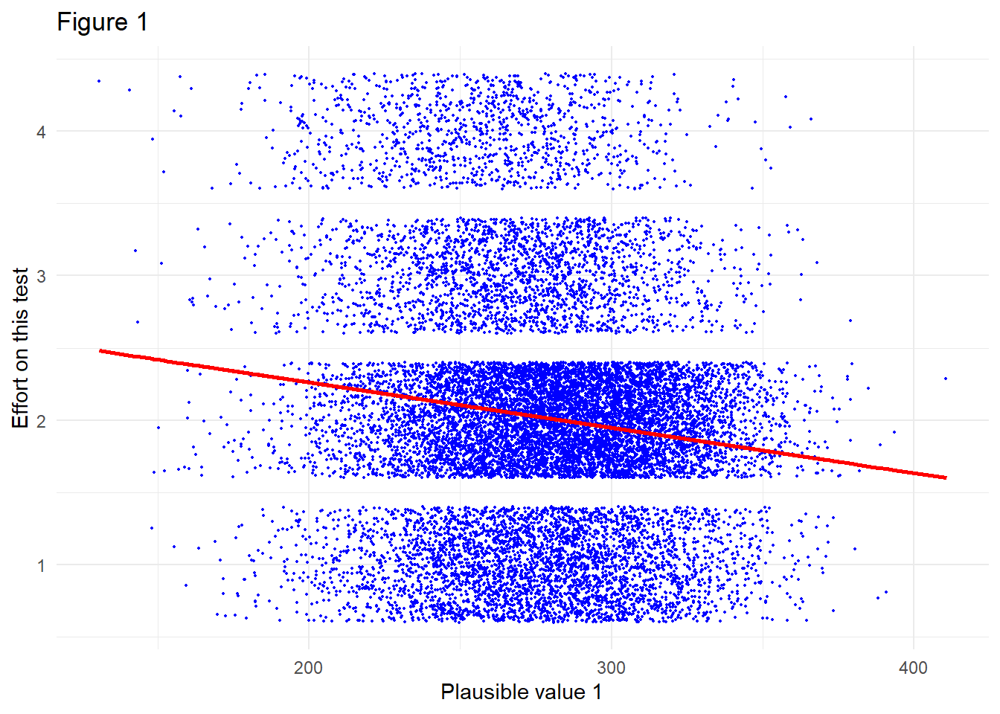

# Models {#models}

Last edited: October 2024

**Suggested Citation**<br></br>
Liao, Y., Bailey, P., & Yavuz, S. Introduction. In Bailey, P. and Zhang, T. (eds.), _Analyzing NCES Data Using EdSurvey: A User's Guide_.

##  Regression Analysis With `lm.sdf`
After the data are read in with the `EdSurvey` package, a linear model can be fit to fully account for the complex sample design used for NCES data by using `lm.sdf`.

The `lm.sdf` function allows jackknife methods (i.e., JK1, JK2, or BRR) or the Taylor series method for variance estimation. By default, the standard error of coefficient is estimated with the jackknife replication method, but users can switch to the Taylor series when appropriate by setting the `varMethod` argument to `varMethod="Taylor"`. When an explicit weight variable is not set, the `lm.sdf` function uses a default weight for the full sample in the analysis. For instance, `origwt` is the default weight in NAEP.

The data are read in and analyzed by the `lm.sdf` function---in this case, `dsex`, `b017451`, the five plausible values for `composite`, and the full sample weight `origwt`. By default, variance is estimated using the jackknife method, so the following call reads in the jackknife replicate weights:


```r
lm1 <- lm.sdf(formula = composite ~ dsex + b017451, data = sdf)
summary(object = lm1)
#> 
#> Formula: composite ~ dsex + b017451
#> 
#> Weight variable: 'origwt'
#> Variance method: jackknife
#> JK replicates: 62
#> Plausible values: 5
#> jrrIMax: 1
#> full data n: 17606
#> n used: 16331
#> 
#> Coefficients:
#>                                  coef        se        t
#> (Intercept)                 270.41112   1.02443 263.9615
#> dsexFemale                   -2.95858   0.60423  -4.8965
#> b017451Once every few weeks   4.23341   1.18327   3.5777
#> b017451About once a week     11.22612   1.25854   8.9200
#> b0174512 or 3 times a week   14.94591   1.18665  12.5951
#> b017451Every day              7.52998   1.30846   5.7549
#>                                dof  Pr(>|t|)    
#> (Intercept)                 54.670 < 2.2e-16 ***
#> dsexFemale                  54.991 8.947e-06 ***
#> b017451Once every few weeks 57.316 0.0007131 ***
#> b017451About once a week    54.683 2.983e-12 ***
#> b0174512 or 3 times a week  72.582 < 2.2e-16 ***
#> b017451Every day            48.470 5.755e-07 ***
#> ---
#> Signif. codes:  
#> 0 '***' 0.001 '**' 0.01 '*' 0.05 '.' 0.1 ' ' 1
#> 
#> Multiple R-squared: 0.0224
```

After the regression is run, the data are automatically removed from memory. 

`EdSurvey` drops level 1 by default from the discrete predictor and treats it as the reference group. The reference level can be changed through the argument `relevels`. For example, in the previous model, the default reference group is males. In the following example, the reference group is changed to "Female" for the variable `dsex`:


```r
lm1f <- lm.sdf(formula = composite ~ dsex + b017451, data = sdf,
               relevels = list(dsex = "Female"))
summary(object = lm1f)
#> 
#> Formula: composite ~ dsex + b017451
#> 
#> Weight variable: 'origwt'
#> Variance method: jackknife
#> JK replicates: 62
#> Plausible values: 5
#> jrrIMax: 1
#> full data n: 17606
#> n used: 16331
#> 
#> Coefficients:
#>                                  coef        se        t
#> (Intercept)                 267.45254   1.13187 236.2919
#> dsexMale                      2.95858   0.60423   4.8965
#> b017451Once every few weeks   4.23341   1.18327   3.5777
#> b017451About once a week     11.22612   1.25854   8.9200
#> b0174512 or 3 times a week   14.94591   1.18665  12.5951
#> b017451Every day              7.52998   1.30846   5.7549
#>                                dof  Pr(>|t|)    
#> (Intercept)                 76.454 < 2.2e-16 ***
#> dsexMale                    54.991 8.947e-06 ***
#> b017451Once every few weeks 57.316 0.0007131 ***
#> b017451About once a week    54.683 2.983e-12 ***
#> b0174512 or 3 times a week  72.582 < 2.2e-16 ***
#> b017451Every day            48.470 5.755e-07 ***
#> ---
#> Signif. codes:  
#> 0 '***' 0.001 '**' 0.01 '*' 0.05 '.' 0.1 ' ' 1
#> 
#> Multiple R-squared: 0.0224
```

The coefficient on `dsex` changed from negative in the previous run to positive of the exact same magnitude, whereas none of the other coefficients (aside from the intercept) changed; this is the expected result. 

The standardized regression coefficient also can be returned by adding `src=TRUE` into the summary call for your regression model object: 

```r
summary(object = lm1f, src=TRUE)
#> 
#> Formula: composite ~ dsex + b017451
#> 
#> Weight variable: 'origwt'
#> Variance method: jackknife
#> JK replicates: 62
#> Plausible values: 5
#> jrrIMax: 1
#> full data n: 17606
#> n used: 16331
#> 
#> Coefficients:
#>                                   coef         se        t
#> (Intercept)                 2.6745e+02 1.1319e+00 236.2919
#> dsexMale                    2.9586e+00 6.0423e-01   4.8965
#> b017451Once every few weeks 4.2334e+00 1.1833e+00   3.5777
#> b017451About once a week    1.1226e+01 1.2585e+00   8.9200
#> b0174512 or 3 times a week  1.4946e+01 1.1866e+00  12.5951
#> b017451Every day            7.5300e+00 1.3085e+00   5.7549
#>                                dof   Pr(>|t|) stdCoef
#> (Intercept)                 76.454 0.0000e+00      NA
#> dsexMale                    54.991 8.9474e-06  0.0407
#> b017451Once every few weeks 57.316 7.1311e-04  0.0458
#> b017451About once a week    54.683 2.9834e-12  0.1175
#> b0174512 or 3 times a week  72.582 0.0000e+00  0.1659
#> b017451Every day            48.470 5.7550e-07  0.0817
#>                                stdSE   
#> (Intercept)                       NA   
#> dsexMale                    0.008313 **
#> b017451Once every few weeks 0.012791 * 
#> b017451About once a week    0.013175 * 
#> b0174512 or 3 times a week  0.013175 * 
#> b017451Every day            0.014200 * 
#> ---
#> Signif. codes:  
#> 0 '***' 0.001 '**' 0.01 '*' 0.05 '.' 0.1 ' ' 1
#> 
#> Multiple R-squared: 0.0224
```

By default, the standardized coefficients are calculated using standard deviations of the variables themselves, including averaging the standard deviation across any plausible values. When `standardizeWithSamplingVar` is set to `TRUE`, the variance of the standardized coefficient is calculated similar to a regression coefficient and therefore includes the sampling variance in the variance estimate of the outcome variable.

### Calculating Multiple Comparisons in lm.sdf

A linear model is analyzed by the `lm.sdf` function---in this case, `dsex`, `b017451`, the five plausible values for `composite`, and the full sample weight `origwt`.


```r
lm1 <- lm.sdf(formula = composite ~ dsex + b003501 + b003601, data = sdf)
summary(object = lm1)$coefmat
```

Table: (\#tab:table801)Coefficients \label{tab:Coefficients}

|                          |      coef|      se|         t|      dof| Pr(>&#124;t&#124;)|
|:-------------------------|---------:|-------:|---------:|--------:|------------------:|
|(Intercept)               | 262.52409| 1.32295| 198.43843| 43.30064|            0.00000|
|dsexFemale                |  -1.51812| 0.91367|  -1.66156| 68.46417|            0.10117|
|b003501Graduated H.S.     |   4.08166| 1.57890|   2.58513| 41.10442|            0.01338|
|b003501Some ed after H.S. |  15.03018| 1.40534|  10.69502| 45.41276|            0.00000|
|b003501I Don't Know       |  -1.59176| 1.79932|  -0.88465| 34.72285|            0.38243|
|b003601Graduated H.S.     |   2.89789| 1.65445|   1.75157| 44.98221|            0.08666|
|b003601Some ed after H.S. |   9.15489| 1.85547|   4.93399| 25.78984|            0.00004|
|b003601I Don't Know       |  -4.12084| 1.52672|  -2.69914| 37.56060|            0.01036|

The *p*-values for variables run in `lm1` can be corrected for multiple testing. Notice that the only *p*-values adjusted in this example are in rows 6, 7, and 8 of the coefficients in `lm1`, and that column's name is `Pr(>|t|)` so we can extract them with this command


```r
# p-values without adjustment
summary(object = lm1)$coefmat[6:8, "Pr(>|t|)"]
#> [1] 8.666330e-02 4.083289e-05 1.035995e-02
```

Here the Benjamini and Hochberg (1995) FDR adjustment is used in the argument `method = "BH"`. The output below displays the adjusted *p*-values with the FDR adjustment:


```r
# Benjamini and Hochberg adjusted p-values
p.adjust(p = lm1$coefmat[6:8, "Pr(>|t|)"], method = "BH")
#> [1] 0.0866633006 0.0001224987 0.0155399244
```
The next example adjusts the same *p*-values using the Bonferroni adjustment with `method="bonferroni"`. Below shows the adjusted *p*-values:


```r
# Bonferroni adjusted p-values
p.adjust(p = lm1$coefmat[6:8, "Pr(>|t|)"], method = "bonferroni")
#> [1] 0.2599899019 0.0001224987 0.0310798488
```
We can compare all the values in a single table in \ref{tab:allp}

Table: (\#tab:allAdjustments)Various p-values adjustments for b003501 \label{tab:allp}

|                          |      raw|       BH| Bonferroni|
|:-------------------------|--------:|--------:|----------:|
|b003601Graduated H.S.     | 0.086663| 0.086663|   0.259990|
|b003601Some ed after H.S. | 0.000041| 0.000122|   0.000122|
|b003601I Don't Know       | 0.010360| 0.015540|   0.031080|
The coefficients matrix also can be overwritten by selecting the same vector in the `lm1` linear regression object, updated here the Bonferroni p-values:


```r
lm1$coefmat[6:8, "Pr(>|t|)"] <- p.adjust(lm1$coefmat[6:8, "Pr(>|t|)"], method = "bonferroni")
summary(object = lm1)$coefmat[6:8, ]
```


Table: (\#tab:updateCoefmatout)Coefficients table after using Bonferroni adjustment to the b003501 variable  \label{tab:Coefficients with Bonferroni}

|                          |     coef|      se|        t|      dof| Pr(>&#124;t&#124;)|
|:-------------------------|--------:|-------:|--------:|--------:|------------------:|
|b003601Graduated H.S.     |  2.89789| 1.65445|  1.75157| 44.98221|            0.25999|
|b003601Some ed after H.S. |  9.15489| 1.85547|  4.93399| 25.78984|            0.00012|
|b003601I Don't Know       | -4.12084| 1.52672| -2.69914| 37.56060|            0.03108|

### Adjusting *p*-Values From Multiple Sources
Sometimes several values must be adjusted at once. In these cases, the `p.adjust` function must be called with all the *p*-values the researcher wishes to adjust together.

For example, if one wishes to adjust values from two regressions and an additional value from another test, all these *p*-values must be put into a single vector and adjusted as a set. Therefore, *p*-value adjustments called on smaller portions of regressions/tests independently may return incorrect adjusted *p*-values and could result in an incorrect inference.

In this example, the coefficients from `b003501` and `b003601`---each from independent regressions---as well as another *p*-value of 0.02 are adjusted.


```r
lm2a <- lm.sdf(formula = composite ~ dsex + b003501, data = sdf)
lm2b <- lm.sdf(formula = composite ~ dsex + b003601, data = sdf)
# pvalues data.frame with missing values
# values of coef that are not in this initial call but will be added
pvalues <- data.frame(source=c(rep("lm2a",3), rep("lm2b",3), "otherp"),
                      coef=rep("",7),
                      p=rep(NA,7),
                      stringsAsFactors=FALSE)
```

This code  is careful to note where the values came from to help avoid transcription errors. The `pvalues` object is then populated using *p*-values and coefficients from the `lm2a` and `lm2b` linear regression objects, rows 1--3 and 4--6 for each, respectively.


```r
# load in values from lm2a
lm2aCoef <- summary(object = lm2a)$coefmat
pvalues$p[1:3] <- lm2aCoef[3:5,5]
pvalues$coef[1:3] <- row.names(lm2aCoef)[3:5]
# load in values from lm2b
lm2bCoef <- summary(object = lm2b)$coefmat
pvalues$p[4:6] <- lm2bCoef[3:5,5]
pvalues$coef[4:6] <- row.names(lm2aCoef)[3:5]
```

The additional *p*-value due for adjustment is included in row 7:


```r
# load in other p-value
pvalues$p[7] <- 0.02
colnames(pvalues)[3] <- "Pr(>|t|)"
# check matrix
pvalues
```

Table: (\#tab:table804)Unadjusted *p*-values \label{tab:unadjustedPValues}

|source |coef                      | Pr(>&#124;t&#124;)|
|:------|:-------------------------|------------------:|
|lm2a   |b003501Graduated H.S.     |          0.0000088|
|lm2a   |b003501Some ed after H.S. |          0.0000000|
|lm2a   |b003501I Don't Know       |          0.0295389|
|lm2b   |b003501Graduated H.S.     |          0.0000144|
|lm2b   |b003501Some ed after H.S. |          0.0000000|
|lm2b   |b003501I Don't Know       |          0.0013006|
|otherp |                          |          0.0200000|

Now that the aforementioned *p*-values are included in the same vector, they are adjusted via `p.adjust` using the Benjamini and Hochberg method:


```r
pvalues[,"Adjusted Pr(>|t|)"] <- p.adjust(p = pvalues[,"Pr(>|t|)"], method = "BH")
pvalues
```

Table: (\#tab:table805)Adjusted *p*-values \label{tab:adjustedPValues}

|source |coef                      | Pr(>&#124;t&#124;)| Adjusted Pr(>&#124;t&#124;)|
|:------|:-------------------------|------------------:|---------------------------:|
|lm2a   |b003501Graduated H.S.     |          0.0000088|                   0.0000205|
|lm2a   |b003501Some ed after H.S. |          0.0000000|                   0.0000000|
|lm2a   |b003501I Don't Know       |          0.0295389|                   0.0295389|
|lm2b   |b003501Graduated H.S.     |          0.0000144|                   0.0000253|
|lm2b   |b003501Some ed after H.S. |          0.0000000|                   0.0000000|
|lm2b   |b003501I Don't Know       |          0.0013006|                   0.0018208|
|otherp |                          |          0.0200000|                   0.0233333|

*NOTE:* The `EdSurvey` package produces *p*-values based on the assumption that tests are independent and unassociated with each other; yet this assumption is not always valid. Several possible methods have been developed for dealing with the multiple hypothesis testing problem.  


##  Multivariate Regression With `mvrlm.sdf`
A multivariate regression model can be fit to fully account for the complex sample design used for NCES data by using `mvrlm.sdf`. This function implements an estimator that correctly handles multiple dependent variables that are continuous (such as plausible values), which allows for variance estimation using the jackknife replication method.

The vertical line symbol `|` separates dependent variables on the left-hand side of formula. In the following example, a multivariate regression is fit with two subject scales as the outcome variables (`algebra` and `geometry`) by two predictor variables signifying gender and a survey item concerning the ability to identify the best unit of area (`dsex` and `m072801`):
 

```r
mvrlm1 <- mvrlm.sdf(algebra | geometry ~ dsex + m072801, data = sdf)
summary(object = mvrlm1)
#> 
#> Formula: algebra | geometry ~ dsex + m072801
#> 
#> jrrIMax: 
#> Weight variable: 'origwt'
#> Variance method: 
#> JK replicates: 62
#> full data n: 17606
#> n used: 16915
#> 
#> Coefficients:
#> 
#> algebra 
#>                         coef        se         t    dof
#> (Intercept)        258.60021   2.37825 108.73566 42.830
#> dsexFemale           6.49222   1.51768   4.27772 52.594
#> m072801B *          24.73912   2.23007  11.09343 67.824
#> m072801C            11.68097   2.97770   3.92281 64.728
#> m072801D           -12.88715   6.56876  -1.96188 12.101
#> m072801E             1.98741   5.38193   0.36927 21.259
#> m072801Omitted      -5.31108   9.43653  -0.56282 24.518
#> m072801Not Reached -33.49285  17.44246  -1.92019 10.866
#>                     Pr(>|t|)    
#> (Intercept)        < 2.2e-16 ***
#> dsexFemale         8.001e-05 ***
#> m072801B *         < 2.2e-16 ***
#> m072801C           0.0002143 ***
#> m072801D           0.0731901 .  
#> m072801E           0.7155757    
#> m072801Omitted     0.5786675    
#> m072801Not Reached 0.0814534 .  
#> ---
#> Signif. codes:  
#> 0 '***' 0.001 '**' 0.01 '*' 0.05 '.' 0.1 ' ' 1
#> 
#> geometry 
#>                          coef         se          t     dof
#> (Intercept)        255.501196   2.367237 107.932229 33.7717
#> dsexFemale           5.158692   1.576222   3.272821 36.3082
#> m072801B *          22.345782   2.212370  10.100380 57.1509
#> m072801C             8.808899   3.646951   2.415414 51.2075
#> m072801D            -9.261391   5.877839  -1.575646 12.8646
#> m072801E            -0.174883   5.919771  -0.029542 23.9273
#> m072801Omitted      -4.713822   7.345774  -0.641705 25.5050
#> m072801Not Reached -31.766149  23.888495  -1.329768  5.1301
#>                     Pr(>|t|)    
#> (Intercept)        < 2.2e-16 ***
#> dsexFemale          0.002341 ** 
#> m072801B *         2.531e-14 ***
#> m072801C            0.019324 *  
#> m072801D            0.139370    
#> m072801E            0.976677    
#> m072801Omitted      0.526790    
#> m072801Not Reached  0.239653    
#> ---
#> Signif. codes:  
#> 0 '***' 0.001 '**' 0.01 '*' 0.05 '.' 0.1 ' ' 1
#> 
#> Residual correlation matrix:
#> 
#>          algebra geometry
#> algebra    1.000    0.849
#> geometry   0.849    1.000
#> 
#> Multiple R-squared by dependent variable: 
#> 
#>  algebra geometry 
#>   0.0944   0.0882
```

The `mvrlm.sdf` documentation provides examples to compare the regression outputs. See `?mvrlm.sdf` for an overview of additional details that can be accessed through components of the returned object. In addition, the vignette titled [*Statistical Methods Used in EdSurvey*](https://www.air.org/sites/default/files/EdSurvey-Statistics.pdf) goes into further detail by describing estimation of the reported statistics.

##  Logistic Regression Analysis With `glm.sdf`, `logit.sdf`, and `probit.sdf`
A logistic regression model can be fit to fully account for the complex sample design used for NCES data by using `glm.sdf`, `logit.sdf`, and `probit.sdf`. These functions predict binary outcomes from a set of predictor variables factoring in appropriate weights and variance estimates. `glm.sdf` is an umbrella function that currently fits logit and probit models. Alternatively, users can choose `logit.sdf` or `probit.sdf` functions for binomial outcomes. 

The following example demonstrates how to use `logit.sdf` to predict the number of books at home with student gender. The example arguments are generalizable to `glm.sdf` and `probit.sdf`. For more information about how to use the latter two functions, check their help files by calling `?glm.sdf` and `?probit.sdf`, respectively.

In `logit.sdf`, although some variables might already be binary, the other variables can be converted to a binary variable using `ifelse` function. A logistic regression can be run exploring the association of gender (`dsex`) to the outcome variable: number of books at home (`b013801`), which is dichotomized with the level matching "more than 100 books at home" (`">100"`) as the outcome level prior to the analyses. While we used to recommend using `I()` for this transformation, we no longer do, as `ifelse` function provides a more intuitive way to handle binary outcomes and allowing it to compare the frequencies of the actual variable and the binary variable. The following code creates a binary variable (`b013801_100more`) and assigne a value of `1` for "more than 100 books at home" (`">100"`) and `0` to all other categories, including `Omitted` and `Multiple`. 


```r
sdf$b013801_100more <- ifelse(sdf$b013801 %in% ">100", yes = 1, no = 0)
table(sdf$b013801, sdf$b013801_100more)
#>           
#>               0    1
#>   0-10     2024    0
#>   11-25    3370    0
#>   26-100   5850    0
#>   >100        0 5115
#>   Omitted   548    0
#>   Multiple    8    0
```

After creating the binary variable, we can run the logistic regression by calling the `logit.sdf` function.


```r
logit1 <- logit.sdf(formula = b013801_100more ~ dsex,
                    weightVar = 'origwt', data = sdf)
summary(object = logit1)
#> 
#> Formula: b013801_100more ~ dsex
#> Family: binomial (logit)
#> 
#> Weight variable: 'origwt'
#> Variance method: jackknife
#> JK replicates: 62
#> full data n: 17606
#> n used: 16915
#> 
#> Coefficients:
#>                   coef         se          t    dof
#> (Intercept)  -0.937357   0.045582 -20.564023 60.193
#> dsexFemale    0.183125   0.049674   3.686517 54.838
#>              Pr(>|t|)    
#> (Intercept) < 2.2e-16 ***
#> dsexFemale  0.0005226 ***
#> ---
#> Signif. codes:  
#> 0 '***' 0.001 '**' 0.01 '*' 0.05 '.' 0.1 ' ' 1
```

The log odds of having more than 100 books at home (versus less than or equal to 100 books) increases by `0.178274` for female students compared with male students.

Logistic regression results can be further interpreted with the assistance of the `oddsRatio` and `waldTest` functions.

### Recovering Odds Ratios
The `oddsRatio` helper function converts coefficients from an `EdSurvey` logit regression model to odds ratios. Odds ratios are useful for understanding the real likelihood of an event occurring based on a transformation to the log odds returned in a logistic model.

In `EdSurvey`, odds ratios can be returned by specifying the logistic model object (`logit1`).


```r
oddsRatio(model = logit1)
#>                    OR      2.5%     97.5%
#> (Intercept) 0.3916615 0.3575323 0.4290487
#> dsexFemale  1.2009640 1.0871600 1.3266810
```

The odds of having more than 100 books at home (versus less than or equal to 100 books) increases by `1.1951531` for female students compared with male students.

### Wald Tests
The `waldTest` function allows the user to test composite hypotheses---those with multiple coefficients involved---even when the data include plausible values.  Because there is no likelihood test for plausible values or residuals of large-scale assessment data analysis, the Wald test fills the role of the likelihood ratio test, analysis of variance, and the F-test.

Wald tests can be run by specifying the model and coefficients. The second coefficient in our `logit1` model object (`Female`) is tested in the following example:


```r
waldTest(model = logit1, coefficients = 2)
#> Wald test:
#> ----------
#> H0:
#> dsexFemale = 0
#> 
#> Chi-square test:
#> X2 = 13.6, df = 1, P(> X2) = 0.00023
#> 
#> F test:
#> W = 13.6, df1 = 1, df2 = 62, P(> W) = 0.00048
```

To learn more about conducting Wald tests, consult the vignette titled [*Methods and Overview of Using EdSurvey for Running Wald Tests*](https://www.air.org/sites/default/files/EdSurvey-WaldTest.pdf).

### Using Plausible Values as a Predictor

For some research questions, a set of plausible values, that represents students’ achievement in a subject scale or subscale, can be used as a predictor. This feature has been enabled for linear regression (`lm.sdf`) and generalized linear regression (`glm.sdf`, `logit.sdf`, and `probit.sdf`). Their methodology has been documented in Chapter11, Statistical Methodology. In this section we will show how to use this feature in linear and generalized linear regressions.


#### Using Plausible Values as a Predictor for Generalized Linear Regression

In this section, we will show examples using `logit.sdf`. For example, we now demonstrate the exploration and analysis for the research question, “How are students’ algebra achievement associated with the student currently taking an algebra class (Algebra I or Algebra II)?” In the `2005 NAEP Primer`, there is a “Math class taking now” variable that has the variable name `m815701` in the `sdf` object. It is useful to look at a raw frequency table to see the levels and their approximate prevalence, a call to table achieves this goal.


```r
table(sdf$m815701)
#> 
#>             Geometry           Algebra II 
#>                  588                  589 
#> Algebra I (1-yr crs)  1st yr 2-yr Algeb I 
#>                 4567                  471 
#>  2nd yr 2-yr Algeb I  Int algeb,pre-algeb 
#>                  254                 4406 
#>  Basic,gen gr 8 math Integrat or seq math 
#>                 4175                  277 
#>     Other math class              Omitted 
#>                  824                  659 
#>             Multiple 
#>                  105
```

One way to run the analyses for the research question of interest is to create a new variable indicating that a student is taking "Algebra I (1-yr crs)", "1st yr 2-yr Algeb I", "2nd yr 2-yr Algeb I", and "Algebra II" or not. The following code uses the `ifelse` function to create a new variable called `AlgebraClass` in the `sdf` object, assigning a value of `1` if the `m815701` column contains any of Algebra I and II classes mentioned above, and `0` otherwise. Note that there are multiple categories of "Algebra I" and these are included in the following code.


```r
sdf$AlgebraClass <- ifelse(sdf$m815701 %in% c('Algebra I (1-yr crs)', '1st yr 2-yr Algeb I', '2nd yr 2-yr Algeb I', 'Algebra II'), 1, 0)
```

The `ifelse` function converts multiple Algebra class categories to `1`, while coding all the other categories as `0`, including `Multiple` and `Omitted`. . The following code provides the frequencies of each category of the newly created `AlgebraClass` variable against the actual variable in the `NAEP 2005 Primer`.


```r
table(sdf$m815701,sdf$AlgebraClass,  useNA = "always")
#>                       
#>                           0    1 <NA>
#>   Geometry              588    0    0
#>   Algebra II              0  589    0
#>   Algebra I (1-yr crs)    0 4567    0
#>   1st yr 2-yr Algeb I     0  471    0
#>   2nd yr 2-yr Algeb I     0  254    0
#>   Int algeb,pre-algeb  4406    0    0
#>   Basic,gen gr 8 math  4175    0    0
#>   Integrat or seq math  277    0    0
#>   Other math class      824    0    0
#>   Omitted               659    0    0
#>   Multiple              105    0    0
#>   <NA>                    0    0    0
```

After creating the `AlgebraClass` variable, the `logit.sdf` function can be used to answer the research question: How are students’ algebra achievement associated with the student currently taking an algebra class (Algebra I or Algebra II)? In this context, `AlgebraClass` is the outcome variable, and algebra achievement, represented by the algebra subscale in the `sdf` object, is the predictor. The `algebra` subscale includes multiple plausible values. The `logit.sdf` function runs the analyses for each plausible value, combines them according to Rubin’s rule (@rubin) on the backend, and provides the final results.  The `logit.sdf` function, like the `glm.sdf`, `probit.sdf,` and `lm.sdf` functions, also accepts other subscales and `composite` scales. You can use the `showPlausibleValues` function to find out the name of the subject scale and subscales in the `sdf` object.

The following code demonstrates how to use plausible values as the predictor to answer the research question of interest. 


```r
logit2 <- logit.sdf(formula = AlgebraClass ~ algebra,
                    weightVar = 'origwt', data = sdf)
summary(object = logit2)
#> 
#> Formula: AlgebraClass ~ algebra
#> Family: binomial (logit)
#> 
#> Weight variable: 'origwt'
#> Variance method: jackknife
#> JK replicates: 62
#> full data n: 17606
#> n used: 16915
#> 
#> Coefficients:
#>                    coef          se           t    dof
#> (Intercept)  -5.1635177   0.4050084 -12.7491605 48.045
#> algebra       0.0164805   0.0013863  11.8882140 49.207
#>              Pr(>|t|)    
#> (Intercept) < 2.2e-16 ***
#> algebra     4.441e-16 ***
#> ---
#> Signif. codes:  
#> 0 '***' 0.001 '**' 0.01 '*' 0.05 '.' 0.1 ' ' 1
```
When running logistic regression, `EdSurvey` package, by default, uses listwise deletes special values including missing values, and `Multiple` and `Omitted`categories. To change the setting, set `dropOmittedLevels = FALSE`, or recode them to another category. In this case, the special values were converted to `0` with the `ifelse` function. As the `AlgebraClass` variable is already created as a binary variable,  by default the `logit.sdf` models the likelihood of its highest category (i.e., level 1: taking one of the algebra class). Additionally, because we created the `AlgebraClass` variable with a certain condition, i.e. `1` if taking one of the algebra classes and `0` not taking one of the algebra classes, the `0` condition contains `Multiple` and `Omitted` categories in it as well. According to the logistic regression results, changes in algebra achievement are significantly associated with the likelihood of enrollment in Algebra I or II classes (versus not taking them, taking another math class, selecting multiple responses, or omitting this question). As a conclusion, with each one-unit increase in the algebra score, the log odds of being in an Algebra class increase by `0.016481`.

#### Using Plausible Values as a Predictor for Linear Regression

This section explains and provides examples of cases where the outcome variable is continuous and the predictor is a scale or subscale. The `lm.sdf` function can be used to perform these analyses. For example, `lm.sdf` can be applied to address the research question: “How does students’ performance in geometry relate their achievement in algebra?” Both algebra and geometry are mathematics subscales within the `sdf` object. The following call performs a linear regression analysis with the geometry subscale as the predictor:


```r
lm3 <- lm.sdf(formula = algebra ~ geometry, data = sdf)
summary(lm3)
#> 
#> Formula: algebra ~ geometry
#> 
#> Weight variable: 'origwt'
#> Variance method: jackknife
#> JK replicates: 62
#> Plausible values: 5
#> jrrIMax: 1
#> full data n: 17606
#> n used: 16915
#> 
#> Coefficients:
#>                   coef         se       t    dof  Pr(>|t|)
#> (Intercept) 27.1500107  2.7555551  9.8528 49.373 3.026e-13
#> geometry     0.9216951  0.0099083 93.0226 53.519 < 2.2e-16
#>                
#> (Intercept) ***
#> geometry    ***
#> ---
#> Signif. codes:  
#> 0 '***' 0.001 '**' 0.01 '*' 0.05 '.' 0.1 ' ' 1
#> 
#> Multiple R-squared: 0.7459
```

The `lm.sdf` function can also be applied to analyze cases where the outcome variable is a Likert scale, which we will treat as a continuous variable for this example. Let's consider a scenario where the goal is to investigate the relationship between students' effort on a math test and their overall math achievement. The research question guiding this analysis could be: “How does students’ overall academic performance predict their effort on this math test?” To address this, we use the `lm.sdf` function, where the outcome variable is the Likert scale measuring the effort on this math test (`m815501`), and the predictor is the math `composite` scale. 
 
Before running the analyses with `lm.sdf` function, we need to ensure that the categories are ordered meaningfully and that `Omitted` and `Multiple` categories are converted to `NA`. First, we check the category order using the `levelsSDF` function:
 

```r
levelsSDF("m815501", sdf)
#> Levels for Variable 'm815501' (Lowest level first):
#>     1. Tried not as hard (n = 3970)
#>     2. Tried about as hard (n = 8543)
#>     3. Tried harder (n = 2277)
#>     4. Tried much harder (n = 1129)
#>     8. Omitted* (n = 986)
#>     0. Multiple* (n = 10)
#>     NOTE: * indicates an omitted level.
```
 
As the output shows, the categories range from `1` to `4`, representing responses from `Tried not as hard` to `Tried much harder.` No reordering is necessary, but the `Multiple` and `Omitted` categories must be converted to `NA`, as their numeric codes (`8` and `0`, respectively) would distort the linear regression results. The following code converts `m815501` to a numeric variable and recodes `0` and `8` as `NA`:
 

```r
sdf$m815501_numeric <- as.numeric(sdf$m815501)
sdf$m815501_numeric <- ifelse(sdf$m815501_numeric  %in% c(0,8), NA,  sdf$m815501_numeric)
```
After preparing the variable, we can apply the `lm.sdf`to run a linear regression model:
 

```r
lm5 <- lm.sdf(formula = m815501_numeric  ~ composite, data = sdf) 
summary(lm5) 
#> 
#> Formula: m815501_numeric ~ composite
#> 
#> Weight variable: 'origwt'
#> Variance method: jackknife
#> JK replicates: 62
#> full data n: 17606
#> n used: 15919
#> 
#> Coefficients:
#>                    coef          se       t    dof
#> (Intercept)  2.89018612  0.06891612  41.938 56.558
#> composite   -0.00314019  0.00024894 -12.614 55.118
#>              Pr(>|t|)    
#> (Intercept) < 2.2e-16 ***
#> composite   < 2.2e-16 ***
#> ---
#> Signif. codes:  
#> 0 '***' 0.001 '**' 0.01 '*' 0.05 '.' 0.1 ' ' 1
#> 
#> Multiple R-squared: 0.0195
```
The analysis shows that the mathematics `composite` scale score is a significant predictor of effort on the math test. However, the coefficient is negative, indicating that higher-scoring students tend to report lower effort on this math test. The R-squared value is 0.02, meaning this model explains only 2% of the variance in the `m815501` variable.
 
We can also visually inspect the fitted values against the observed values. The following code extracts the fitted values from the lm5 model, removes the plausible values for students missing on `m815501`, and creates a plot of the first plausible value, the listwise-deleted `m815501_numeric`, and the fitted values:
 

```r
# Extract fitted values
fittedValues <- lm5$fitted.values
 
# Remove composite plausible values for the missing students on the m815501 variable
noNA_mrpcm1 <- sdf$mrpcm1[!is.na(sdf$m815501_numeric)]
plotData <- data.frame(noNA_mrpcm1, m815501_numeric = na.omit(sdf$m815501_numeric), fittedValues)
 
# Create the plot using ggplot2
ggplot(plotData, aes(x = noNA_mrpcm1, y = m815501_numeric)) +
  geom_point(position = position_jitter(width = 0.2), color = "blue", size = .3) +  # Adding jitter to the points
  geom_line(aes(y = fittedValues), color = "red", linewidth = 1) +  # Line with fitted values
  labs(
    title = "Scatterplot with Fitted Line",
    x = "Plausible Value 1",  # Category label for the x-axis
    y = "Effort on this test"   # Category label for the y-axis
  ) +
  theme_minimal()
```



This plot provides a visual comparison of the fitted values from the linear model and the observed student effort scores.

##  Quantile Regression Analysis with `rq.sdf`
The `rq.sdf` function computes an estimate on the tau-th conditional quantile function of the response, given the covariates, as specified by the formula argument. Similar to `lm.sdf`, the function presumes a linear specification for the quantile regression model (i.e., the formula defines a model that is linear in parameter). Jackknife is the only applicable variance estimation method used by the function.

To conduct quantile regression at a given tau value (by default, tau is set as 0.5), specify using the `tau` argument (in this example `tau = 0.8`); all other arguments are otherwise consistent with `lm.sdf`, except for `returnVarEstInputs`, `returnNumberOfPSU`, and `standardizeWithSamplingVar`, which are not available.


```r
rq1 <- rq.sdf(composite ~ dsex + b017451, data=sdf, tau = 0.8)
summary(object = rq1)
#> 
#> Formula: composite ~ dsex + b017451
#> 
#> tau: 0.8
#> jrrIMax: 1
#> Weight variable: 'origwt'
#> Variance method: jackknife
#> JK replicates: 62
#> full data n: 17606
#> n used: 16331
#> 
#> Coefficients:
#>                                 coef       se        t
#> (Intercept)                 299.7680   1.8103 165.5883
#> dsexFemale                   -4.6280   1.2908  -3.5852
#> b017451Once every few weeks   6.5880   1.9086   3.4518
#> b017451About once a week     12.4800   2.2959   5.4359
#> b0174512 or 3 times a week   16.5420   2.4616   6.7201
#> b017451Every day             12.7420   1.6932   7.5253
#>                                dof  Pr(>|t|)    
#> (Intercept)                 29.389 < 2.2e-16 ***
#> dsexFemale                  58.617 0.0006868 ***
#> b017451Once every few weeks 46.045 0.0012041 ** 
#> b017451About once a week    67.782 8.032e-07 ***
#> b0174512 or 3 times a week  29.867 1.943e-07 ***
#> b017451Every day            50.343 8.717e-10 ***
#> ---
#> Signif. codes:  
#> 0 '***' 0.001 '**' 0.01 '*' 0.05 '.' 0.1 ' ' 1
```

For further details on quantile regression models and how they are implemented in R, see the vignette from the `quantreg` package (accessible by the `vignette("rq", package="quantreg")`), on which the `rq.sdf` function is built.

##  Mixed Models With `mixed.sdf`
`EdSurvey` features the functionality of estimating mixed-effects models accounting for plausible values and survey weights. `EdSurvey` fits a weighted mixed model, also known as a weighted multilevel or hierarchical linear model using the `WeMix` package.

This example illustrates how the user might implement student-level weighting when using a survey (NAEP in this example) that does not have a weighting scheme previously implemented.


```r
# Subset data to a sample of interest
sdf2 <- subset(x = sdf, subset = scrpsu < 500)

# Extract variables of interest to a light.edsurvey.data.frame
lsdf <- getData(sdf2, c("composite","dsex","b017451","scrpsu","origwt","smsrswt"),
                addAttributes=TRUE)

# Transform weights using your method (Note that this method is not recommended for NAEP)
lsdf$pwt1 <- lsdf$origwt/lsdf$smsrswt
lsdf$pwt2 <- lsdf$smsrswt

m1 <- mixed.sdf(composite ~ dsex + b017451 + (1|scrpsu), data=lsdf,
                weightVar = c('pwt1', 'pwt2'))
summary(object = m1)
#> Call:
#> mixed.sdf(formula = composite ~ dsex + b017451 + (1 | scrpsu), 
#>     data = lsdf, weightVars = c("pwt1", "pwt2"))
#> 
#> Formula: composite ~ dsex + b017451 + (1 | scrpsu)
#> 
#> Plausible Values: 5
#> Number of Groups:
#>  Level  Group n size mean wgt sum wgt
#>      2 scrpsu     22    1.281   28.19
#>      1    Obs    492    1.598  786.25
#> 
#> Variance terms:
#>  Level    Group        Name Variance Std. Error Std.Dev.
#>      2   scrpsu (Intercept)    558.6     204.64    23.63
#>      1 Residual                876.8      74.69    29.61
#> 
#> Fixed Effects:
#>                             Estimate Std. Error t value
#> (Intercept)                  266.795      8.200  32.537
#> dsexFemale                    -1.179      2.998  -0.393
#> b017451Once every few weeks    2.173      6.954   0.312
#> b017451About once a week       9.809      4.472   2.193
#> b0174512 or 3 times a week    10.863      6.098   1.781
#> b017451Every day               6.792      7.365   0.922
#> 
#> Intraclass Correlation= 0.389
```

The following two examples illustrate how to model the random intercept of mathematics achievement at the school level with students' gender as a covariate, using TIMSS 2015 datasets. 


```r

#Use all plausible values
TIMSS15USA<- readTIMSS(paste0(edsurveyHome, "TIMSS/2015"), countries = c("usa"), gradeLvl = "4")
#> Found cached Grade 4 data for country code "usa: United States".
#> edsurvey.data.frame data level detail:
#> |---DataLevel----|----Rows----|--Columns---|---MergeType----|-------MatchedRecords-------|-OK-|
#> |Student         |       10029|        1196|                |*base level*                | ✓  |
#> |>School         |       10029|         101|many:one        |10029 of 10029              | ✓  |
#> |>Teacher        |       12119|         745|one:many        |12119 of 12119              | ✓  |
mix1 <- mixed.sdf(mmat ~ itsex + (1|idschool), data = TIMSS15USA,
                  weightVar=c("totwgt","schwgt"), weightTransformation=FALSE)
summary(object = mix1)
#> Call:
#> mixed.sdf(formula = mmat ~ itsex + (1 | idschool), data = TIMSS15USA, 
#>     weightVars = c("totwgt", "schwgt"), weightTransformation = FALSE)
#> 
#> Formula: mmat ~ itsex + (1 | idschool)
#> 
#> Plausible Values: 5
#> Number of Groups:
#>  Level    Group n size mean wgt sum wgt
#>      2 idschool    250    255.9   63971
#>      1      Obs  10029    374.6 3757302
#> 
#> Variance terms:
#>  Level    Group        Name Variance Std. Error Std.Dev.
#>      2 idschool (Intercept)     1758      173.7    41.93
#>      1 Residual                 4672      105.3    68.35
#> 
#> Fixed Effects:
#>             Estimate Std. Error t value
#> (Intercept)  536.042      3.767 142.288
#> itsexMALE      6.091      1.500   4.061
#> 
#> Intraclass Correlation= 0.273
```


```r
# uses only one plausible value
mix2 <- mixed.sdf(asmmat01 ~ itsex + (1|idschool), data = TIMSS15USA,
                  weightVar=c("totwgt","schwgt"), weightTransformation=FALSE)
summary(object = mix2)
#> Call:
#> mixed.sdf(formula = asmmat01 ~ itsex + (1 | idschool), data = TIMSS15USA, 
#>     weightVars = c("totwgt", "schwgt"), weightTransformation = FALSE)
#> 
#> Formula: asmmat01 ~ itsex + (1 | idschool)
#> Number of Groups:
#>  Level    Group n size mean wgt sum wgt
#>      2 idschool    250    255.9   63971
#>      1      Obs  10029    374.6 3757302
#> 
#> Variance terms:
#>  Level    Group        Name Variance Std. Error Std.Dev.
#>      2 idschool (Intercept)     1713      173.7    41.39
#>      1 Residual                 4658      105.3    68.25
#> 
#> Fixed Effects:
#>             Estimate Std. Error t value
#> (Intercept)  536.847      3.668 146.349
#> itsexMALE      5.726      1.442   3.972
#> 
#> lnl=-21290221.51
#> Intraclass Correlation= 0.269
```

For further guidance and use cases for mixed-effects models in `EdSurvey`, see the vignette titled [*Methods Used for Estimating Mixed-Effects Models in EdSurvey*](https://www.air.org/sites/default/files/EdSurvey-Mixed_Models.pdf). For examples of how NCES recommends using weighted mixed-effects models, as well as their summary of the mathematical background and the description of the insufficiency of hierarchical linear models in this case, see Appendix D in the NCES working paper on analysis of TIMSS data at [*Using TIMSS to Analyze Correlates of Performance Variation in Mathematics*](https://nces.ed.gov/pubs2001/200105.pdf).
