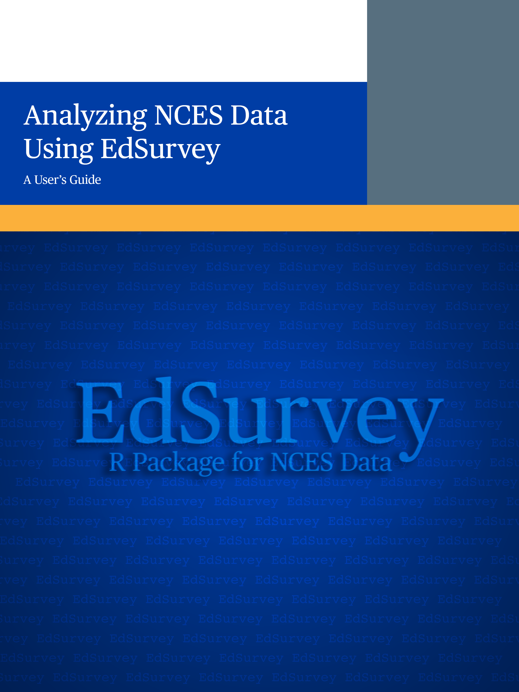

--- 
title: " Analyzing NCES Data Using EdSurvey: A User's Guide"
author: EdSurvey Team\footnote{NCES 2021-044}
date: "`r Sys.Date()`"
site: bookdown::bookdown_site
description: |
  | The EdSurvey R package brings together the ability to download, extract data from, and analyze with common procedures all the methodologies that a researcher needs to analyze NCES survey data. Analyzing NCES Data Using EdSurvey\\: A User’s Guide is an e-book that provides guidance for how to use the `EdSurvey` R package to analyze NCES data.
  | This book covers analysis of data with complex sampling, plausible values, and longitudinal data methodologies inherent to NCES educational databases complete with examples in `EdSurvey`. Comprehensive examples walk readers through how to use many analysis types\\: from data access, processing, and manipulation to statistical analyses, including cross tabulation, gap analysis, correlation, regressions, and multilevel mixed models. Statistical methodologies for EdSurvey appear in Chapters 11 and 12.
  | The book has two formats: a web-based version, which is accessible through a web browser such as Edge or   Chrome, and an epub version for easy access on smart devices such as smartphones and tablets.

documentclass: book
bibliography: [biblio.bib]
csl: apa-annotated-bibliography.csl
pandoc_args: ["--csl", "apa-annotated-bibliography.csl"]
link-citations: yes
always_allow_html: true
url: https://github.com/American-Institutes-for-Research/EdSurvey_A_Users_Guide
cover-image: "images/cover.png"
apple-touch-icon: "touch-icon.png"
apple-touch-icon-size: 120
favicon: "favicon.ico"
---

# Analyzing NCES Data Using EdSurvey: A User's Guide  {.unnumbered}

```{r coverImage, echo=FALSE, fig.align='center', out.width="70%"}
## to render epub, out.width needs to be a number value
## ```{r coverImage, echo=FALSE, fig.align='center', out.width=500}

```

## Learning to Use `EdSurvey`

This user’s guide is intended for skipping around; the information is not ordered sequentially. To find help and see examples for a specific function, the question mark function allows users to get help about a function. For example, at the R prompt, after installing and loading `EdSurvey`, a user can get help about the downloadTIMSS function by typing ?downloadTIMSS.

### Available Resources

Visit the [`EdSurvey` page](https://www.air.org/project/nces-data-r-project-edsurvey) at [AIR.org](https://www.air.org/) for a full listing of `EdSurvey` resources.

###	Trainings

The `EdSurvey` development team provides periodic workshops on the analysis of national and international education data. To learn more about these course offerings,

-  apply to the [NAEP Data Training Workshop](http://naep-research.airprojects.org/Opportunities/Training)
- explore the available courses at the [American Educational Research Association](https://www.aera.net/) and [IEA International Research Conference](https://www.iea.nl/news-events/irc) sites

###	Contact and Bug Report

Please report bugs and other issues on our GitHub repository at [https://github.com/American-Institutes-for-Research/EdSurvey/issues](https://github.com/American-Institutes-for-Research/EdSurvey/issues).

# Cover Page {.unnumbered}

## Analyzing NCES Data Using EdSurvey: A User's Guide {.unnumbered}

**`r paste(lubridate::month(Sys.Date(),label = TRUE,abbr = FALSE),lubridate::year(Sys.Date()))`**

**Michael Lee**<br></br>
**Ting Zhang**<br></br>
**Paul Bailey**<br></br>
**Eric Buehler**<br></br>
**Thomas Fink**<br></br>
**Huade Huo**<br></br>
**Sun-Joo Lee**<br></br>
**Yuqi Liao**<br></br>
American Institutes for Research

**Emmanuel Sikali**<br></br>
Senior Research Scientist<br></br>
National Center for Education Statistics

**U.S. DEPARTMENT OF EDUCATION**

_The content of this user’s guide was commissioned by the National Center for Education Statistics (NCES) and conducted by the American Institutes for Research (AIR) under Education Statistics Services Institute Network (ESSIN) Task Order 14: Assessment Division Support (Contract No. ED-IES-12-D-0002/0004). Task Order 14 supports NCES with expert advice and technical assistance on issues related to the National Assessment of Educational Progress (NAEP)._

_The authors are responsible for the contents of this guide, which is still under development. If you have any feedback, corrections, or suggestions for improvements to subsequent versions, please contact us at [https://github.com/American-Institutes-for-Research/EdSurvey/issues](https://github.com/American-Institutes-for-Research/EdSurvey/issues). Mention of trade names, commercial products, or organizations does not imply endorsement by the U.S. Government._

# Preface {.unnumbered}

_Analyzing NCES Data Using `EdSurvey`: A User's Guide_ is the first introductory manual dedicated to introducing this R package to the education research community. Until now, most of the instruction has occurred at national and international conferences and in scientific journals. `EdSurvey` was introduced to the research community during the American Education Research Association (AERA) annual conference in Washington, D.C., in April 2016. The first version was optimized to analyze only NAEP data. Since then, significant development has continued at a steady pace. This manual is based on the `r  packageVersion("EdSurvey")`. As the user downloads this package on the Comprehensive R Archive Network (CRAN), he or she might discover features not presented or discussed in this manual. The development team strongly suggests using the vignettes that are regularly published with the addition of each new feature.

The team also understands that programming might be intimidating to some education researchers. To lower the entry level of programming skills, this user’s guide provides comprehensive examples that are easy to follow and adaptable to many research questions and investigations. The team assumes that users of this manual have some basic understanding and knowledge of programming and R software. Experienced R users might find themselves equipped to jump to a specific section of interest. For those who do not have such knowledge yet, many courses are available in the public domain that will suffice for acquiring this prerequisite knowledge.

## Rationale for `EdSurvey`

`EdSurvey` was conceived to streamline access and analyses of NCES data by taking advantage of advances in computing and meeting the shifting trend in higher education to move away from using commercial statistical software packages in favor of open-source software packages, such as R, Python, and Julia. Starting in the late 1980s, NCES conceived and developed an approach to make its data available to the research community. Under this approach, the data are distributed on CD-ROM or DVD formats. In these magnetic devices, data are stored in ASCII format in a dedicated folder, and the data manuals and other files will enable the analyst to access the data as intended by NCES.

## History of NCES Data Analysis

Until the advent of `EdSurvey`, to access NCES data, researchers had to implicitly follow the specific steps described later in this foreword while using all the associated software packages that exist solely for each step. Analysts of NCES data had to carefully execute each step; otherwise, any mistake meant having to start over.

As mentioned previously, NCES settled on creating one set of files that could be stored on a CD-ROM or DVD for each data set released. The set of files contained enough information for any user or consumer of NCES data, regardless of the statistical software package used. For accessibility, a decision was made that the following three steps would generally make the data available to the average user, and these steps are still applicable today. 
* allowing  analysts to first select the variables for their analysis, then generating syntax files either in SPSS, SAS, or sometimes STATA
* using the syntax file to generate a reduced data file in the appropriate statistical software from the previous step, cleaning and performing all the necessary recodes
* importing these data in software programs such as WESVAR or AM for testing hypotheses
AM and WESVAR are needed because, traditionally, NCES data are collected using multistage sampling methodologies. Earlier versions of SAS and SPSS were inadequate for analyzing such sample data [@AM].  

### Step 1: Importing NCES Data Using the Electronic Code Book

NCES data constitute very large datasets, with several hundred variables and thousands of cases. Because the memory of personal computers was a few gigabytes      a decade ago, analysts could not upload all the data into their working memory to manipulate the data for their investigations. This problem is still relevant today. For example, NAEP mathematics or reading assessment at Grades 4 and 8 can have more than 1500 variables and close to 250,000 cases. It was then decided that each NCES dataset would be produced along with an electronic code book (ECB). The ECB allowed analysts to explore all the variables in the data files, including obtaining the frequency distribution for each category of a nominal or ordinal variable and the distribution information (min, max, standard deviation, and mean) for variables in the interval and ratio levels of measurement. An analyst may determine variables of interest after reviewing the ECB and then create either an SPSS or SAS syntax file from the ECB.

Across time, NCES noticed that almost every data collection program within NCES created its own ECB with varying unique features. Thus, someone had to analyze data from different program offices to learn the individual features of each ECB.

### Step 2: Data Cleaning and Recoding

In this step, the analyst can use the ECB to generate final data. This step also is the appropriate place to perform all the data cleaning and recoding.

### Step 3: Performing Hypotheses Testing and Variance Estimation

Use WESVAR or AM to specify the sampling design feature, compute estimates and proportions along with their standard errors, and perform all hypothesis testing. AM and WESVAR are utility tools for performing analyses with complex samples; they are not traditional statistical software packages. The types of analyses that AM and WESVAR were designed to perform were limited, and they did not generate sharable codes. NCES  could not be responsive to all the various requests for improvement or the need for updates.

Analysts must carefully plan their analyses, selecting all needed variables in Step 1 and performing all their data cleaning and manipulation in Step 2. In Step 3, every time a mistake originating from a previous step is discovered, the analyst must start over. 

AM and WESVAR were developed primarily for the computations of variance from complex samples and the estimation of group scores using students’ plausible values from large-scale assessment datasets. AM and WESVAR cannot generate additional outputs other than the ones incorporated when they were created. They also were created to be mostly menu driven to allow average analysts to comfortably use them without the requirement for writing code.

As one can see, the analyst of NCES data needs to have all the knowledge described previously before accessing the data and testing their hypotheses. Across time, the features of the analysis package remained unchanged because of budgetary constraints and software limitations. NCES data users inquired why AM and WESVAR couldn’t offer more features, such as the ability to share code with collaborators and advanced data manipulation. In 2014, NCES prioritized creating an analysis tool that would seek to address the issues raised by the research community.

Thus, NCES set out to create a tool that would incorporate all the steps listed previously, which could be expanded by the research community by allowing (a) input for analyses functions to be included in the tool, (b) analyses functions to be contributed by the research community, and (c) code sharing. Most importantly, the tool had to be affordable to the research community. Around that same time, institutions of higher learning were moving away from traditional software packages and favoring open-source packages.

## Development of the `EdSurvey` R Package

R is a programming language and software environment for statistical computing and graphics supported by the R Foundation for Statistical Computing [@R-base]. Because the R language is widely used in academia and the research community for developing statistical software for statistical analysis, NCES chose this language to create the tool called `EdSurvey`. R software's free and extensible distribution ecosystem, [CRAN](https://cran.r-project.org/), provides access to a wide variety of bundled code for computing. Today, with `EdSurvey`, researchers who use NCES data have an additional tool for data access and analyses.

`EdSurvey` is a package developed in the R programming language. It is callable from the R programming environment, and it augments the capability of R base, thus creating a powerful environment for analysts. In addition to the augmentation of R base with `EdSurvey`, users could also add different existing packages, such as [ggplot2](https://cran.r-project.org/web/packages/ggplot2/index.html)---a data visualization package written in R---to create eye-catching graphics to share the results of the `EdSurvey` output with their audiences. So, analysts using `EdSurvey` have access to any other package from CRAN. They also can create a package that is `EdSurvey` callable to augment its functionality.

This manual is a guide for analysts who want to analyze their data collection of choice. Before expanding on `EdSurvey`’s functionality, the next section will expand on the structure of NCES datasets.

## Considerations for Analyzing NCES Data

It is important to remind the reader that NCES data are either samples or censuses. Census data are collected from the universe of possible entities of interest, mostly schools, school districts, and postsecondary institutions. Sample data are collected using multistage complex sample methodologies, with the population of interest being American children and students from 9 months old through postsecondary education, including teachers, principals, schools, and school districts. These sampled data subset into two major groups: cross-sectional and longitudinal. Cross-sectional data can partition into assessment data and nonassessment data. Assessment data such as NAEP and TIMSS are cross-sectional, complex, sampled data with an assessment component. The assessment component allows for inference on student groups' cognitive performance on a variety of subjects. Thus, this manual has three major analysis sections: assessment data, longitudinal data, and cross-sectional data. All these sample datasets are collected using multistage sample methodologies to ensure representativeness of the population of interest.

Complex samples require different methodologies to compute estimates and their associated standard errors. These methodologies might either require full sample weights and their replicates or the stratum variable and the primary sampling unit. Longitudinal data, also known as panel data, collect data on individuals across time. For those familiar with econometrics terminology, the development team notes that NCES panel data are unbalanced because it is very expensive to follow subjects across time. The sample sizes decrease as time elapses. Assessment data are cross-sectional, with an assessment component measuring what students know and can do for reporting and research.

`EdSurvey` was conceived and developed to be the go-to analysis tool for all cross-sectional, assessment, and longitudinal datasets produced by NCES. The package incorporates all the primary functionalities of the ECB. The researcher starts by forming a connection to the survey data to access the codebook, search the variables, and perform other operations before selecting the needed variables for an analysis. Because the package contains functionalities within one piece of software, it is easy for a researcher to research and select new variables to answer a specific research question. This user’s guide will showcase these functions with examples from different datasets.   

## Overview of EdSurvey Fundamentals

`EdSurvey` has a built-in command design to perform specific tasks on NCES data files. Some of these commands can access other files than the data file, such as the codebook  .  The second group of commands is designed to help the analyst explore the design variables or other variables such as plausible values. A third group of commands is designed for statistical analyses, including creating summary statistics that usually appear in NCES reports (e.g., means, standard errors, achievement level, and percentile results), correlations, and regressions. The last group of commands allows the performance of more advanced analyses, such as hierarchical linear modeling and direct estimation (as of Version 2.7). As development continues, more functions will become available in subsequent releases.

In general, the built-in functions in `EdSurvey` have the following structure : 

$Command (argument_1, argument_2, … argument_i, option_1, option_2, …)$

where $Command$ is the action that the analyst wants to perform, and $argument_i  $ is a required element that must appear after this particular command. The number of arguments depends on the given command, and $option_i$: is added to enhance the output from the command.

After the user installs `EdSurvey`, the next logical thing to do is to read built-in data files, read data from a repository, or read the Restricted-Use D ata received from the Institute of Education Sciences data officer. The command to read the data is ReadDATA, where data can be substituted with NAEP, TIMSS, and so forth. To execute this command, `EdSurvey` must know the location of the data file. So, the argument that specifies the path to the folder where the data file is located is necessary for the command to run. It also is important to have a very good understanding of the data of interest before unleashing this command because you must always be aware of the available resources on your computer. For example, the 2015 TIMSS data includes fourth-grade mathematics and science assessment results relating to students, parents, teachers, schools, and curricular background data covering 47 participating countries and six benchmarking entities. The same data are available for eighth-grade students but only for 39 countries and six benchmarking entities. Running the command `readTIMSS` will load all that data in your working memory:

```{r library, echo = FALSE, message=FALSE, warning=FALSE}
library(EdSurvey)
```

```{r Mydatafile, eval = FALSE}
Mydatafile <-   readTIMSS(path = "~/TIMSS/2015")
```

To avoid memory overload , the development team recommends that analysts load only the data of their grade and country (or countries) of interest from the repository, as illustrated in the following example:

```{r Dnk2015, eval = FALSE}
#Read Grade 4 Denmark 2015 TIMSS survey into the dataframe Dnk2015 
Dnk2015 <- readTIMSS(path = "~/TIMSS/2015", countries = "dnk", gradeLvl = 4)
Dnk2015
```

```{r Dnk2015edsurveyHome, echo = FALSE}
#Read Grade 4 Denmark 2015 TIMSS survey into the dataframe Dnk2015 
Dnk2015 <- readTIMSS(paste0(edsurveyHome,"/TIMSS/2015"), countries = "dnk", gradeLvl = 4)
Dnk2015
```


Once the data are loaded, `EdSurvey` automatically detects the design elements needed for computing the estimates and standard errors. In the case of assessment data, this standard error has two components: the sampling error and the measurement error. The elements from the data file needed for their computation are the full sample weight, the replicate weights (or the stratum and the principal sampling unit variables), as well as the plausible values. One read function is unique to one study in `EdSurvey` because each NCES data file has its structure, data layout variable coding, and size. It also should be noted that, in general, different survey programs use different  methodologies to compute these variances. Read more about reading in survey data in [Chapter 4](#dataAccess).

Once read into `EdSurvey`, the next set of commands available to the analyst is showCommand, namely, `showCodebook`, `showWeights`, and `showPlausibleValues`. The following example illustrates the usage of `showPlausibleValues`:

```{r showPlausibleValues}
showPlausibleValues(data = Dnk2015, verbose=TRUE)
```

The option `verbose = TRUE` adds the additional descriptions. Please note that when running analyses with plausible values, one needs to supply only a short name for the set of plausible values, as found through this function, such as the "mmat" (mathematics performance scale) or "ssci" (science performance scale) in the TIMSS datasets. `EdSurvey` uses each plausible value in calculations and correctly accounts for the imputation variance from the plausible values [@Mislevy].

The last function described here is the search function. The command `searchSDF` searches a survey data frame and returns variable names and labels meeting the criteria specified by the user. Users can search by either the variable name or the labels of variables. The following examples illustrate several but not all possible implementations of the search function:

```{r searchSDF}
# Search for variables with a name or label that contains “computer”
searchSDF(string = "computer", data = Dnk2015)
```

One can use Boolean algebra in their search:

```{r searchSDF2}
# Search for a variable with name or label that contains computer, or    internet, or phone
searchSDF(string="computer|internet|phone", data=Dnk2015)
```

Remember that TIMSS contains assessment data in mathematics and science at Grades 4 and 8 as well as student, parent, teacher, school, and curricular background data. One could narrow the search to a given background data file.

```{r searchSDF3}
#Search a keyword in the student file only
searchSDF(string = "computer", data = Dnk2015, fileFormat ="student")
```

The addition of the option `levels = TRUE` in the search function enables a close view of the categorical variable of interest. The next example showcases a different search and the usage of the argument levels.

```{r searchSDF4}
# Search multiple keywords
searchSDF(string = c("computer","homework","school"), data = Dnk2015, levels = TRUE)
```

```{r levelsSDF}
# Display levels of the variable "asbg10b"
levelsSDF(varnames = "asbg10b", data = Dnk2015)
```


Please note that these estimates are weighted. To see the unweighted frequency table, use the option `weightVar = NULL`:

```{r summary2}
summary2(data = Dnk2015, variable = "asbg10b", weightVar = NULL)
```

Additional data exploration functions are in [Chapter 5](#understandingData).

The previous examples give a brief introduction to `EdSurvey` commands, what they look like, and their purpose. Many more commands appear in the subsequent chapters. These commands were created based on questions, inquiries, suggestions, and surveys collected from more than 2 decades of training at NCES, AERA, and National Council for Measurement in Education and interacting with analysts of our data products. The researcher should pay particular attention to commands that are specific to some types of data and those that apply to any dataset. As users progress through this manual while analyzing their data, they must always remember that (a) they are in the R environment, (b) all the commands of R base are available to them at any given time, and (c) they have to ability to augment `EdSurvey` with tools from other packages in CRAN.
At the end of this manual, Chapters 11 and 12   detail some of the mathematics used to create some of the functions in `EdSurvey`. This is done purposefully. The development team wants the user to be aware that even though this package makes many computations easily accessible, there are intensive computations and several methodologies that either existed or were developed that were implemented in this package. The entire `EdSurvey` package is not complete because it is still being developed. The team strongly encourages that anyone who has suggestions of methodology that could be added or that they have developed themselves as an add-on to [contact us]( https://github.com/American-Institutes-for-Research/EdSurvey) for possible implementation. The development team will not guarantee inclusion but will give any suggestions a fair assessment.
